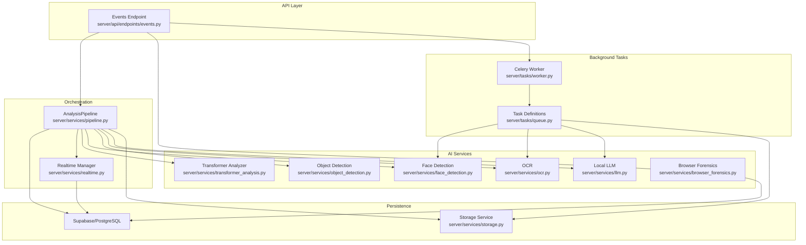
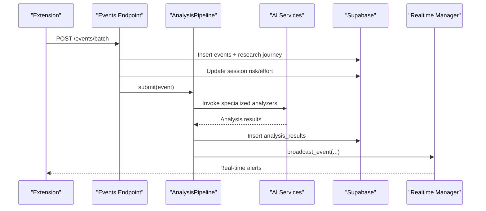
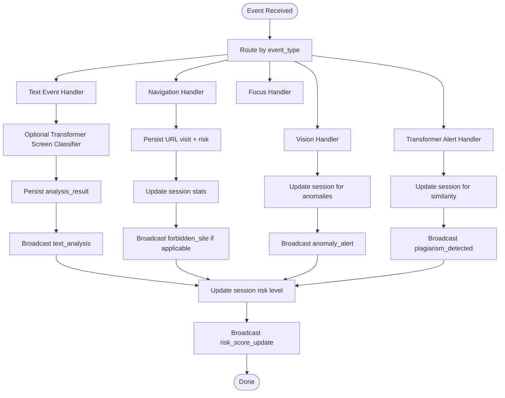
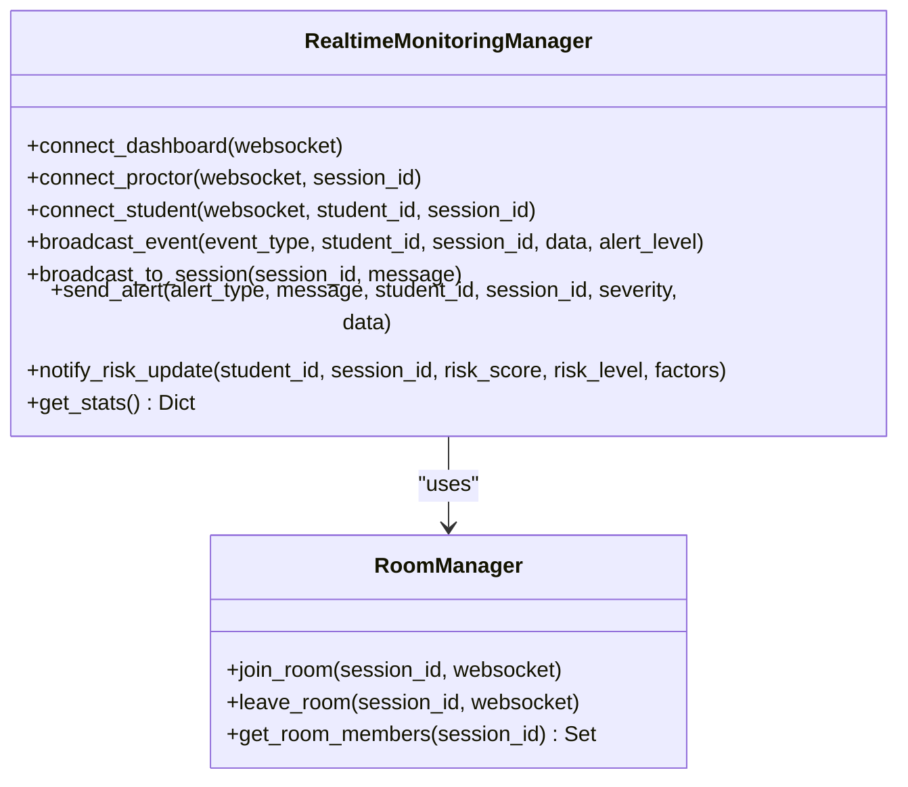
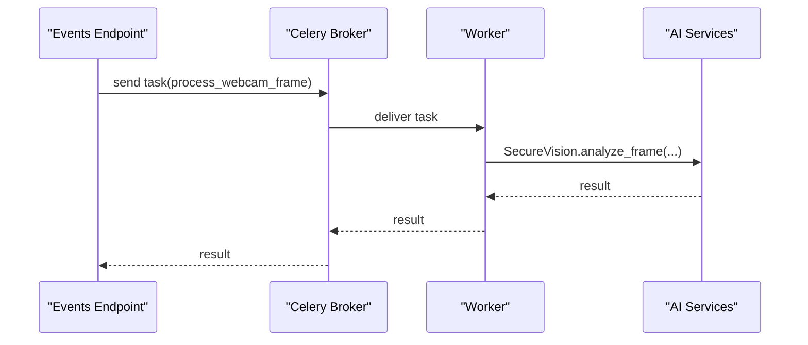
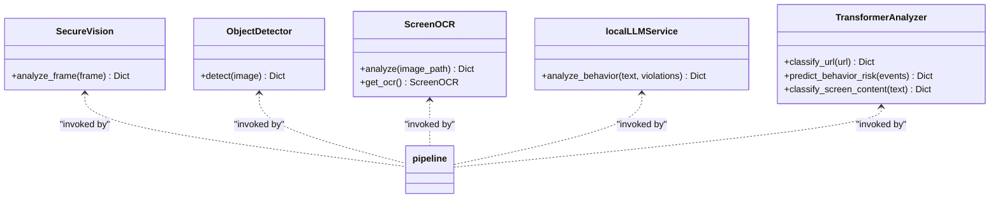
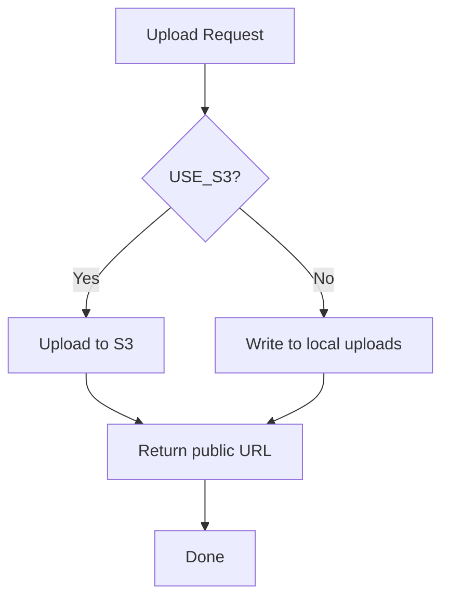
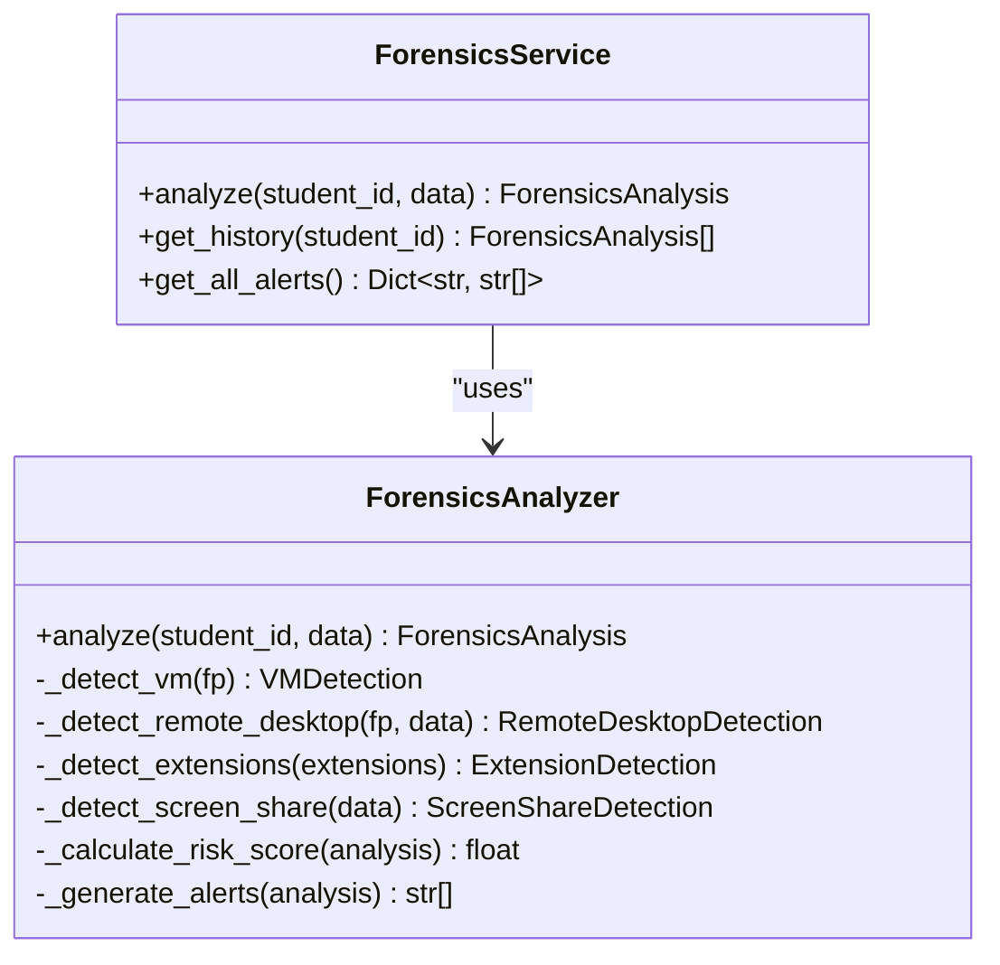
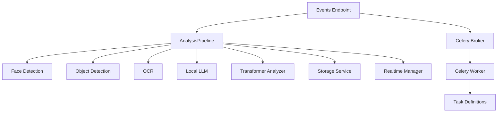

# AI Pipeline Integration

<cite>
**Referenced Files in This Document**
- [pipeline.py](file://server/services/pipeline.py)
- [queue.py](file://server/tasks/queue.py)
- [worker.py](file://server/tasks/worker.py)
- [storage.py](file://server/services/storage.py)
- [browser_forensics.py](file://server/services/browser_forensics.py)
- [face_detection.py](file://server/services/face_detection.py)
- [object_detection.py](file://server/services/object_detection.py)
- [ocr.py](file://server/services/ocr.py)
- [llm.py](file://server/services/llm.py)
- [transformer_analysis.py](file://server/services/transformer_analysis.py)
- [config.py](file://server/config.py)
- [events.py](file://server/api/endpoints/events.py)
- [realtime.py](file://server/services/realtime.py)
- [analysis.py](file://server/models/analysis.py)
- [event.py](file://server/models/event.py)
</cite>

## Table of Contents
1. [Introduction](#introduction)
2. [Project Structure](#project-structure)
3. [Core Components](#core-components)
4. [Architecture Overview](#architecture-overview)
5. [Detailed Component Analysis](#detailed-component-analysis)
6. [Dependency Analysis](#dependency-analysis)
7. [Performance Considerations](#performance-considerations)
8. [Troubleshooting Guide](#troubleshooting-guide)
9. [Conclusion](#conclusion)

## Introduction
This document describes the AI pipeline integration for ExamGuard Pro, focusing on the orchestration and coordination of multiple AI services within the event processing workflow. It explains the event-driven processing model, service coordination, result aggregation, storage integration, browser forensics, configuration management, error handling, and operational guidance for performance and scaling.

## Project Structure
The AI pipeline spans the server-side orchestration, background task processing, AI services, storage, and real-time monitoring. The primary runtime flow is:
- Event ingestion via FastAPI endpoints
- Batch logging and scoring
- Real-time pipeline for immediate analysis and alerting
- Background tasks for heavy AI workloads
- Storage for artifacts and uploads
- Real-time broadcasting to dashboards and clients

**Diagram sources**
- [events.py:144-336](file://server/api/endpoints/events.py#L144-L336)
- [pipeline.py:55-96](file://server/services/pipeline.py#L55-L96)
- [realtime.py:102-200](file://server/services/realtime.py#L102-L200)
- [worker.py:12-31](file://server/tasks/worker.py#L12-L31)
- [queue.py:11-74](file://server/tasks/queue.py#L11-L74)
- [face_detection.py:27-126](file://server/services/face_detection.py#L27-L126)
- [object_detection.py:16-147](file://server/services/object_detection.py#L16-L147)
- [ocr.py:20-121](file://server/services/ocr.py#L20-L121)
- [llm.py:10-78](file://server/services/llm.py#L10-L78)
- [transformer_analysis.py:178-549](file://server/services/transformer_analysis.py#L178-L549)
- [browser_forensics.py:208-587](file://server/services/browser_forensics.py#L208-L587)
- [storage.py:20-71](file://server/services/storage.py#L20-L71)

**Section sources**
- [events.py:144-336](file://server/api/endpoints/events.py#L144-L336)
- [pipeline.py:9-53](file://server/services/pipeline.py#L9-L53)
- [realtime.py:102-138](file://server/services/realtime.py#L102-L138)
- [worker.py:12-31](file://server/tasks/worker.py#L12-L31)
- [queue.py:11-74](file://server/tasks/queue.py#L11-L74)
- [face_detection.py:27-126](file://server/services/face_detection.py#L27-L126)
- [object_detection.py:16-147](file://server/services/object_detection.py#L16-L147)
- [ocr.py:20-121](file://server/services/ocr.py#L20-L121)
- [llm.py:10-78](file://server/services/llm.py#L10-L78)
- [transformer_analysis.py:178-549](file://server/services/transformer_analysis.py#L178-L549)
- [browser_forensics.py:208-587](file://server/services/browser_forensics.py#L208-L587)
- [storage.py:20-71](file://server/services/storage.py#L20-L71)

## Core Components
- AnalysisPipeline: Centralized event processor that routes events to specialized handlers, updates session risk, persists analysis results, and broadcasts real-time updates.
- RealtimeMonitoringManager: Manages WebSocket connections, rooms, and real-time event broadcasting to dashboards and clients.
- Background Task System: Celery worker with task definitions for webcam frames, screenshots, similarity checks, risk calculation, and report generation.
- AI Services: Face detection, object detection, OCR, local LLM reasoning, and transformer-based analysis.
- Storage Service: Uploads artifacts to S3-compatible storage or local filesystem.
- Browser Forensics: Comprehensive client-side fingerprinting and anomaly detection.
- Configuration: Centralized settings for URLs, risk weights, capture parameters, and classification lists.

**Section sources**
- [pipeline.py:9-53](file://server/services/pipeline.py#L9-L53)
- [realtime.py:102-138](file://server/services/realtime.py#L102-L138)
- [worker.py:12-31](file://server/tasks/worker.py#L12-L31)
- [queue.py:11-74](file://server/tasks/queue.py#L11-L74)
- [face_detection.py:27-126](file://server/services/face_detection.py#L27-L126)
- [object_detection.py:16-147](file://server/services/object_detection.py#L16-L147)
- [ocr.py:20-121](file://server/services/ocr.py#L20-L121)
- [llm.py:10-78](file://server/services/llm.py#L10-L78)
- [transformer_analysis.py:178-549](file://server/services/transformer_analysis.py#L178-L549)
- [browser_forensics.py:208-587](file://server/services/browser_forensics.py#L208-L587)
- [storage.py:20-71](file://server/services/storage.py#L20-L71)
- [config.py:58-205](file://server/config.py#L58-L205)

## Architecture Overview
The system follows an event-driven architecture:
- Events are ingested via batch endpoints and immediately scored and stored.
- The AnalysisPipeline asynchronously processes events, invoking AI services and updating session risk.
- Real-time updates are broadcast to dashboards and proctor/student sessions.
- Heavy or off-cycle AI workloads are delegated to background tasks managed by Celery.
- Artifacts and uploads are persisted through the Storage Service.
- Browser forensics enriches risk assessment with client-side anomalies.

**Diagram sources**
- [events.py:144-336](file://server/api/endpoints/events.py#L144-L336)
- [pipeline.py:74-96](file://server/services/pipeline.py#L74-L96)
- [realtime.py:334-378](file://server/services/realtime.py#L334-L378)

**Section sources**
- [events.py:144-336](file://server/api/endpoints/events.py#L144-L336)
- [pipeline.py:74-96](file://server/services/pipeline.py#L74-L96)
- [realtime.py:334-378](file://server/services/realtime.py#L334-L378)

## Detailed Component Analysis

### AnalysisPipeline
Responsibilities:
- Asynchronous queue-based worker for event processing.
- Routes events to handlers for text, navigation, focus, vision, and transformer alerts.
- Updates session risk level and pushes updates to dashboards.
- Persists analysis results and maintains stats.

Processing logic highlights:
- Event routing based on type.
- Text analysis with transformer screen content classification.
- Navigation categorization and risk assignment.
- Vision event handling for phone/facial absence.
- Risk score recalculation and level mapping.

**Diagram sources**
- [pipeline.py:74-304](file://server/services/pipeline.py#L74-L304)

**Section sources**
- [pipeline.py:9-53](file://server/services/pipeline.py#L9-L53)
- [pipeline.py:55-96](file://server/services/pipeline.py#L55-L96)
- [pipeline.py:97-148](file://server/services/pipeline.py#L97-L148)
- [pipeline.py:149-220](file://server/services/pipeline.py#L149-L220)
- [pipeline.py:225-245](file://server/services/pipeline.py#L225-L245)
- [pipeline.py:246-277](file://server/services/pipeline.py#L246-L277)
- [pipeline.py:278-304](file://server/services/pipeline.py#L278-L304)
- [pipeline.py:306-335](file://server/services/pipeline.py#L306-L335)

### RealtimeMonitoringManager
Responsibilities:
- Manages WebSocket connections for dashboards, proctors, and students.
- Broadcasts real-time events to rooms and clients.
- Maintains event history and statistics.
- Integrates AI callbacks for live video streams.

Key capabilities:
- Room-based broadcasting per session.
- Severity-aware alerting.
- Heartbeat and monitoring stats.

**Diagram sources**
- [realtime.py:102-200](file://server/services/realtime.py#L102-L200)
- [realtime.py:81-100](file://server/services/realtime.py#L81-L100)

**Section sources**
- [realtime.py:102-138](file://server/services/realtime.py#L102-L138)
- [realtime.py:334-378](file://server/services/realtime.py#L334-L378)
- [realtime.py:508-533](file://server/services/realtime.py#L508-L533)

### Background Task System (Celery)
Responsibilities:
- Offloads heavy AI workloads (webcam frames, OCR, similarity, risk calculation, report generation).
- Configured with serialization, timeouts, prefetch, and late acknowledgment.

Task highlights:
- process_webcam_frame: face detection pipeline.
- process_screenshot: OCR analysis.
- check_similarity_task: similarity computation (feature disabled).
- calculate_session_risk: aggregate risk.
- generate_report_task: report generation.

**Diagram sources**
- [queue.py:11-25](file://server/tasks/queue.py#L11-L25)
- [worker.py:12-31](file://server/tasks/worker.py#L12-L31)

**Section sources**
- [queue.py:11-74](file://server/tasks/queue.py#L11-L74)
- [worker.py:12-31](file://server/tasks/worker.py#L12-L31)

### AI Services Coordination
- Face Detection: MediaPipe Tasks API with fallback to Haar cascades; detects presence, pose, and violations.
- Object Detection: YOLO-based detection of phones, books, laptops, watches, mice, keyboards, and people.
- OCR: Tesseract-based text extraction with forbidden keyword detection; includes fallback.
- Local LLM: Optional Ollama integration for behavior reasoning.
- Transformer Analyzer: URL classification, behavioral anomaly detection, and screen content classification.

**Diagram sources**
- [face_detection.py:27-126](file://server/services/face_detection.py#L27-L126)
- [object_detection.py:16-147](file://server/services/object_detection.py#L16-L147)
- [ocr.py:20-121](file://server/services/ocr.py#L20-L121)
- [llm.py:10-78](file://server/services/llm.py#L10-L78)
- [transformer_analysis.py:178-549](file://server/services/transformer_analysis.py#L178-L549)

**Section sources**
- [face_detection.py:27-126](file://server/services/face_detection.py#L27-L126)
- [object_detection.py:16-147](file://server/services/object_detection.py#L16-L147)
- [ocr.py:20-121](file://server/services/ocr.py#L20-L121)
- [llm.py:10-78](file://server/services/llm.py#L10-L78)
- [transformer_analysis.py:178-549](file://server/services/transformer_analysis.py#L178-L549)

### Storage Integration
- Supports S3-compatible storage (MinIO) or local filesystem.
- Uploads artifacts (images, videos) and returns public URLs.
- Fallback to local storage on S3 errors.

**Diagram sources**
- [storage.py:24-67](file://server/services/storage.py#L24-L67)

**Section sources**
- [storage.py:20-71](file://server/services/storage.py#L20-L71)

### Browser Forensics
- Comprehensive client-side fingerprinting and anomaly detection.
- Detects VMs, remote desktop, suspicious extensions, and screen sharing.
- Calculates risk score and generates alerts.

**Diagram sources**
- [browser_forensics.py:208-587](file://server/services/browser_forensics.py#L208-L587)

**Section sources**
- [browser_forensics.py:208-587](file://server/services/browser_forensics.py#L208-L587)

### Configuration Management
- Centralized configuration for database, API, capture settings, forbidden keywords, URL classification lists, risk weights, and thresholds.
- Used by endpoints, pipeline, and analyzers.

**Section sources**
- [config.py:16-205](file://server/config.py#L16-L205)

### Event Schema and Analysis Models
- Event model defines logged events with timestamps, types, and risk weights.
- AnalysisResult model defines persisted AI analysis outputs.

**Section sources**
- [event.py:6-30](file://server/models/event.py#L6-L30)
- [analysis.py:6-49](file://server/models/analysis.py#L6-L49)

## Dependency Analysis
- The Events Endpoint writes to Supabase and triggers the AnalysisPipeline.
- The AnalysisPipeline depends on AI services and the Storage Service.
- RealtimeMonitoringManager depends on WebSocket connections and the pipeline for updates.
- Background tasks depend on Celery and Redis for queuing and persistence.

**Diagram sources**
- [events.py:144-336](file://server/api/endpoints/events.py#L144-L336)
- [pipeline.py:74-96](file://server/services/pipeline.py#L74-L96)
- [realtime.py:334-378](file://server/services/realtime.py#L334-L378)
- [worker.py:12-31](file://server/tasks/worker.py#L12-L31)
- [queue.py:11-74](file://server/tasks/queue.py#L11-L74)

**Section sources**
- [events.py:144-336](file://server/api/endpoints/events.py#L144-L336)
- [pipeline.py:74-96](file://server/services/pipeline.py#L74-L96)
- [realtime.py:334-378](file://server/services/realtime.py#L334-L378)
- [worker.py:12-31](file://server/tasks/worker.py#L12-L31)
- [queue.py:11-74](file://server/tasks/queue.py#L11-L74)

## Performance Considerations
- Event batching reduces database load and improves throughput.
- Asynchronous pipeline prevents blocking and enables concurrent processing.
- Background tasks with late acknowledgment and prefetch control reduce contention.
- Throttling and caching in object detection stabilize FPS.
- Real-time broadcasting uses rooms to minimize unnecessary fan-out.
- Storage fallback ensures resilience during S3 outages.

[No sources needed since this section provides general guidance]

## Troubleshooting Guide
Common issues and remedies:
- Pipeline errors: Inspect stats and logs; the pipeline increments error counters and retries with delays.
- WebSocket push failures: The pipeline catches and logs errors when broadcasting to dashboards.
- OCR/Tesseract not available: Fallback mode returns warnings and zero risk.
- S3 upload failures: Automatic fallback to local storage.
- Missing AI backends: Face detection falls back to Haar cascades; object detection disables if YOLO is unavailable.
- LLM connectivity: Optional service checks connection and skips when offline.

**Section sources**
- [pipeline.py:69-72](file://server/services/pipeline.py#L69-L72)
- [pipeline.py:334-335](file://server/services/pipeline.py#L334-L335)
- [ocr.py:75-84](file://server/services/ocr.py#L75-L84)
- [storage.py:53-56](file://server/services/storage.py#L53-L56)
- [face_detection.py:48-58](file://server/services/face_detection.py#L48-L58)
- [object_detection.py:17-26](file://server/services/object_detection.py#L17-L26)
- [llm.py:16-26](file://server/services/llm.py#L16-L26)

## Conclusion
ExamGuard Pro’s AI pipeline integrates real-time event processing, AI services, background task orchestration, and persistent storage to deliver a robust, auditable, and scalable monitoring solution. The event-driven design, combined with real-time broadcasting and configurable risk scoring, supports effective proctoring and student safety.