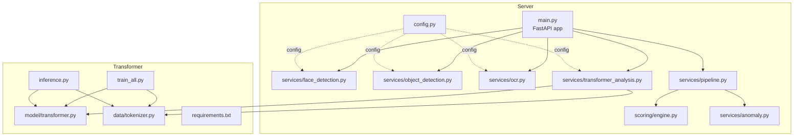
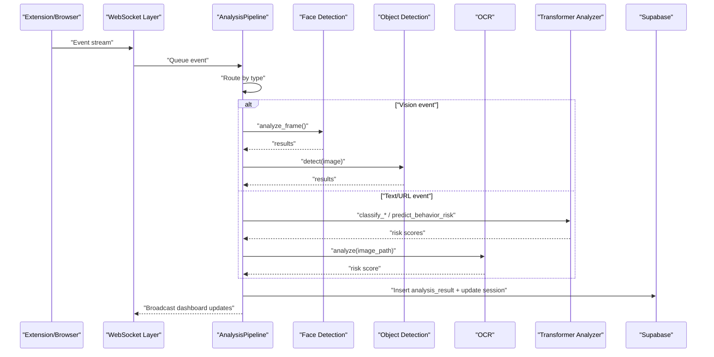
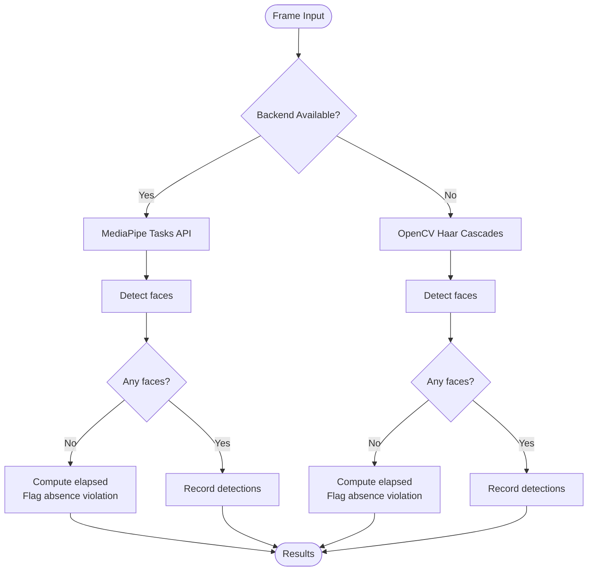
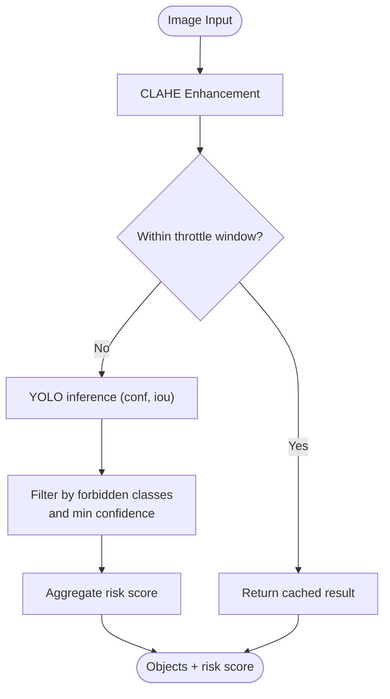
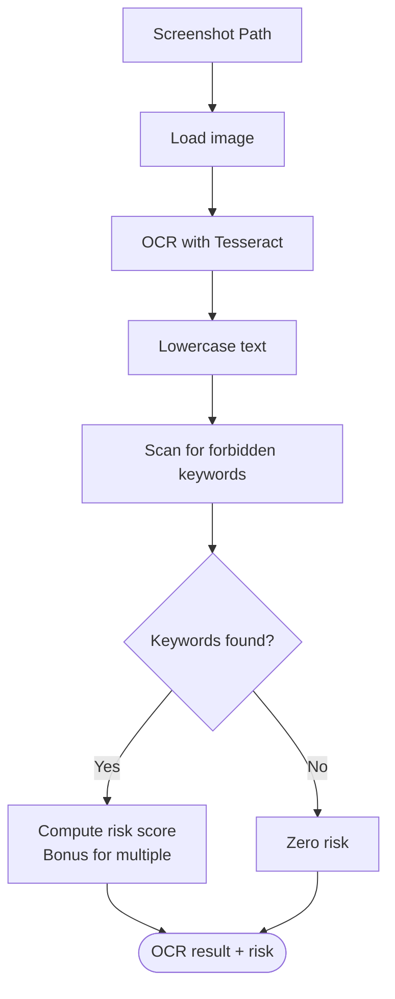
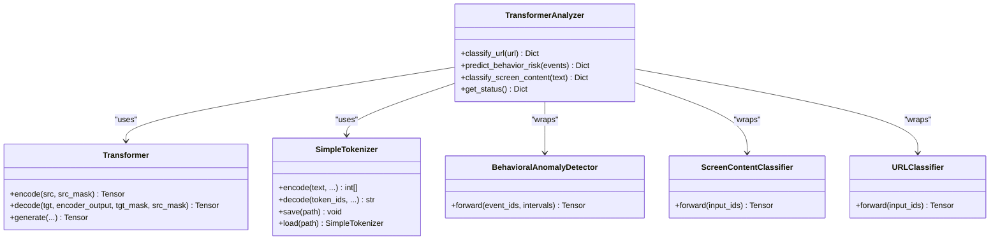
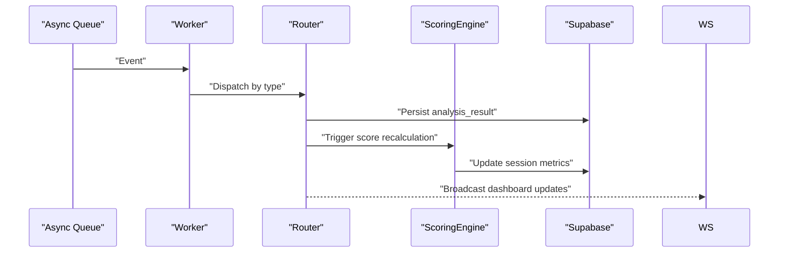
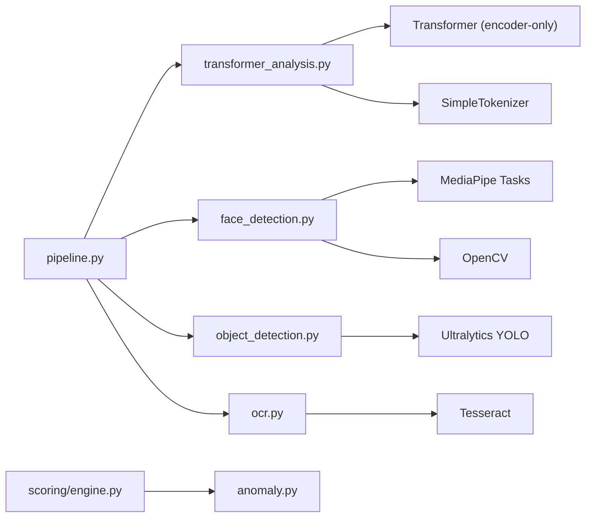

# AI/ML Services

<cite>
**Referenced Files in This Document**
- [face_detection.py](file://server/services/face_detection.py)
- [object_detection.py](file://server/services/object_detection.py)
- [ocr.py](file://server/services/ocr.py)
- [transformer_analysis.py](file://server/services/transformer_analysis.py)
- [pipeline.py](file://server/services/pipeline.py)
- [config.py](file://server/config.py)
- [main.py](file://server/main.py)
- [engine.py](file://server/scoring/engine.py)
- [anomaly.py](file://server/services/anomaly.py)
- [transformer.py](file://transformer/model/transformer.py)
- [tokenizer.py](file://transformer/data/tokenizer.py)
- [train_all.py](file://transformer/train_all.py)
- [inference.py](file://transformer/inference.py)
- [requirements.txt](file://transformer/requirements.txt)
</cite>

## Table of Contents
1. [Introduction](#introduction)
2. [Project Structure](#project-structure)
3. [Core Components](#core-components)
4. [Architecture Overview](#architecture-overview)
5. [Detailed Component Analysis](#detailed-component-analysis)
6. [Dependency Analysis](#dependency-analysis)
7. [Performance Considerations](#performance-considerations)
8. [Troubleshooting Guide](#troubleshooting-guide)
9. [Conclusion](#conclusion)
10. [Appendices](#appendices)

## Introduction
This document describes the AI/ML services powering ExamGuard Pro’s multi-modal analysis pipeline. It covers:
- MediaPipe-based face detection and presence verification
- YOLOv8-powered object detection for unauthorized devices
- Tesseract OCR for content analysis
- Transformer-based NLP models for URL classification, behavioral anomaly detection, and screen content risk classification
- The AI pipeline architecture, event-driven workflows, risk scoring, and decision-making
- Configuration, performance tuning, and accuracy thresholds
- Integration patterns with the main event processing pipeline
- Model training, inference optimization, and production deployment considerations

## Project Structure
The AI/ML stack spans two primary areas:
- Server-side AI services under server/services
- Transformer models and training under transformer/

**Diagram sources**
- [main.py:109-165](file://server/main.py#L109-L165)
- [face_detection.py:27-109](file://server/services/face_detection.py#L27-L109)
- [object_detection.py:16-147](file://server/services/object_detection.py#L16-L147)
- [ocr.py:20-121](file://server/services/ocr.py#L20-L121)
- [transformer_analysis.py:178-549](file://server/services/transformer_analysis.py#L178-L549)
- [pipeline.py:9-342](file://server/services/pipeline.py#L9-L342)
- [engine.py:373-445](file://server/scoring/engine.py#L373-L445)
- [anomaly.py:11-221](file://server/services/anomaly.py#L11-L221)
- [config.py:1-205](file://server/config.py#L1-L205)
- [transformer.py:17-606](file://transformer/model/transformer.py#L17-L606)
- [tokenizer.py:13-475](file://transformer/data/tokenizer.py#L13-L475)
- [train_all.py:1-599](file://transformer/train_all.py#L1-L599)
- [inference.py:1-159](file://transformer/inference.py#L1-L159)
- [requirements.txt:1-8](file://transformer/requirements.txt#L1-L8)

**Section sources**
- [main.py:109-165](file://server/main.py#L109-L165)
- [config.py:1-205](file://server/config.py#L1-L205)

## Core Components
- Face Detection and Presence Verification: MediaPipe Tasks API with fallback to OpenCV Haar cascades. Tracks face presence and enforces absence thresholds.
- Object Detection: YOLOv8 (YOLO11s) for detecting unauthorized devices and people; includes CLAHE preprocessing and throttling for performance.
- OCR: Tesseract-based text extraction with forbidden keyword detection and risk scoring.
- Transformer NLP: Three specialized models (URL classifier, behavioral anomaly detector, screen content classifier) with custom tokenizers and evaluation logic.
- Analysis Pipeline: Async event routing and real-time scoring updates with Supabase persistence and WebSocket broadcasting.
- Scoring Engine: Computes engagement, relevance, effort alignment, and risk scores from events, analysis results, and anomaly detection.

**Section sources**
- [face_detection.py:27-109](file://server/services/face_detection.py#L27-L109)
- [object_detection.py:16-147](file://server/services/object_detection.py#L16-L147)
- [ocr.py:20-121](file://server/services/ocr.py#L20-L121)
- [transformer_analysis.py:178-549](file://server/services/transformer_analysis.py#L178-L549)
- [pipeline.py:9-342](file://server/services/pipeline.py#L9-L342)
- [engine.py:373-445](file://server/scoring/engine.py#L373-L445)

## Architecture Overview
The AI pipeline is event-driven. Events from the browser extension and student sessions are routed to the AnalysisPipeline, which triggers AI services and updates session risk scores. The ScoringEngine aggregates signals from multiple sources, and the system persists results to Supabase while broadcasting updates via WebSockets.

**Diagram sources**
- [main.py:109-165](file://server/main.py#L109-L165)
- [pipeline.py:74-342](file://server/services/pipeline.py#L74-L342)
- [face_detection.py:50-109](file://server/services/face_detection.py#L50-L109)
- [object_detection.py:65-147](file://server/services/object_detection.py#L65-L147)
- [ocr.py:29-121](file://server/services/ocr.py#L29-L121)
- [transformer_analysis.py:332-523](file://server/services/transformer_analysis.py#L332-L523)

## Detailed Component Analysis

### Face Detection and Presence Verification
- MediaPipe Tasks API is preferred; if unavailable, falls back to OpenCV Haar cascades.
- Tracks last face detection time and flags prolonged absence beyond configured thresholds.
- Outputs violations and integrity impact adjustments for downstream scoring.

**Diagram sources**
- [face_detection.py:27-109](file://server/services/face_detection.py#L27-L109)

**Section sources**
- [face_detection.py:27-109](file://server/services/face_detection.py#L27-L109)
- [config.py:198-201](file://server/config.py#L198-L201)

### Object Detection (Unauthorized Devices)
- YOLOv8 (YOLO11s) with CLAHE preprocessing for low-light conditions.
- Throttles inference to ~10 FPS and caches results to reduce overhead.
- Defines forbidden classes and assigns risk scores; penalizes multiple people.

**Diagram sources**
- [object_detection.py:65-147](file://server/services/object_detection.py#L65-L147)

**Section sources**
- [object_detection.py:16-147](file://server/services/object_detection.py#L16-L147)
- [config.py:198-205](file://server/config.py#L198-L205)

### OCR and Forbidden Keyword Detection
- Uses Tesseract with a configured path for Windows; falls back gracefully if unavailable.
- Extracts text, detects forbidden keywords, and computes risk score with bonuses for multiple matches.

**Diagram sources**
- [ocr.py:29-84](file://server/services/ocr.py#L29-L84)

**Section sources**
- [ocr.py:20-121](file://server/services/ocr.py#L20-L121)
- [config.py:58-82](file://server/config.py#L58-L82)

### Transformer NLP Models
- URL Risk Classifier: Encodes URLs and classifies into risk categories.
- Behavioral Anomaly Detector: Encodes event sequences with inter-event intervals into risk levels.
- Screen Content Classifier: Encodes OCR text and classifies risk categories.
- Tokenizers: SimpleTokenizer with BOS/EOS/PAD/UNK tokens; dynamic loading from checkpoints.
- Device selection: CUDA if available, otherwise CPU.

**Diagram sources**
- [transformer_analysis.py:178-549](file://server/services/transformer_analysis.py#L178-L549)
- [transformer.py:17-606](file://transformer/model/transformer.py#L17-L606)
- [tokenizer.py:13-475](file://transformer/data/tokenizer.py#L13-L475)

**Section sources**
- [transformer_analysis.py:178-549](file://server/services/transformer_analysis.py#L178-L549)
- [transformer.py:17-606](file://transformer/model/transformer.py#L17-L606)
- [tokenizer.py:13-475](file://transformer/data/tokenizer.py#L13-L475)

### Analysis Pipeline and Decision-Making
- Async queue-based worker processes events and routes them to appropriate analyzers.
- Updates analysis_results and exam_sessions, then broadcasts to dashboards via WebSockets.
- Integrates risk contributions from vision, OCR, and behavioral anomalies into session risk levels.

**Diagram sources**
- [pipeline.py:55-342](file://server/services/pipeline.py#L55-L342)
- [engine.py:373-445](file://server/scoring/engine.py#L373-L445)

**Section sources**
- [pipeline.py:9-342](file://server/services/pipeline.py#L9-L342)
- [engine.py:373-445](file://server/scoring/engine.py#L373-L445)

## Dependency Analysis
- External libraries:
  - MediaPipe Tasks API for face detection
  - OpenCV for Haar cascades and image preprocessing
  - Ultralytics YOLO for object detection
  - Tesseract for OCR
  - PyTorch for transformer models
  - Tokenizers for BPE tokenization
- Internal dependencies:
  - Transformer models depend on custom tokenizer and Transformer encoder/decoder modules
  - AnalysisPipeline depends on Supabase client and WebSocket manager
  - ScoringEngine integrates with anomaly detection and analysis results

**Diagram sources**
- [face_detection.py:11-26](file://server/services/face_detection.py#L11-L26)
- [object_detection.py:8-12](file://server/services/object_detection.py#L8-L12)
- [ocr.py:10-17](file://server/services/ocr.py#L10-L17)
- [transformer_analysis.py:26-47](file://server/services/transformer_analysis.py#L26-L47)
- [pipeline.py:14-342](file://server/services/pipeline.py#L14-L342)
- [engine.py:22-445](file://server/scoring/engine.py#L22-L445)
- [anomaly.py:11-221](file://server/services/anomaly.py#L11-L221)

**Section sources**
- [face_detection.py:11-26](file://server/services/face_detection.py#L11-L26)
- [object_detection.py:8-12](file://server/services/object_detection.py#L8-L12)
- [ocr.py:10-17](file://server/services/ocr.py#L10-L17)
- [transformer_analysis.py:26-47](file://server/services/transformer_analysis.py#L26-L47)
- [pipeline.py:14-342](file://server/services/pipeline.py#L14-L342)
- [engine.py:22-445](file://server/scoring/engine.py#L22-L445)
- [anomaly.py:11-221](file://server/services/anomaly.py#L11-L221)

## Performance Considerations
- Frame and inference throttling:
  - ObjectDetector throttles to ~10 FPS and caches results to reduce CPU/GPU load.
  - Face detection uses a presence threshold to avoid repeated alerts.
- Preprocessing:
  - CLAHE enhancement improves detection reliability in low-light webcam feeds.
- GPU utilization:
  - TransformerAnalyzer automatically selects CUDA if available.
- Asynchronous processing:
  - AnalysisPipeline runs in a dedicated async worker to prevent blocking the event loop.
- Memory footprint:
  - Tokenizers and model checkpoints are loaded on demand; consider keeping frequently used models resident in memory for latency-sensitive scenarios.

[No sources needed since this section provides general guidance]

## Troubleshooting Guide
- MediaPipe Tasks API not available:
  - The system falls back to OpenCV Haar cascades. Verify model download and path configuration.
- YOLO model missing:
  - Ensure the weights file exists at the expected path; the service checks for availability and returns safe defaults if missing.
- Tesseract not installed:
  - OCR returns a warning and zero risk; install Tesseract and configure the executable path.
- Transformer models not loaded:
  - Check checkpoint existence and tokenizer JSON; the analyzer logs initialization failures and falls back to rule-based URL classification when needed.
- WebSocket and pipeline errors:
  - Inspect pipeline stats and WebSocket stats endpoints; errors are logged and counted in stats.

**Section sources**
- [face_detection.py:11-26](file://server/services/face_detection.py#L11-L26)
- [object_detection.py:17-26](file://server/services/object_detection.py#L17-L26)
- [ocr.py:10-17](file://server/services/ocr.py#L10-L17)
- [transformer_analysis.py:200-327](file://server/services/transformer_analysis.py#L200-L327)
- [main.py:548-584](file://server/main.py#L548-L584)
- [pipeline.py:55-73](file://server/services/pipeline.py#L55-L73)

## Conclusion
ExamGuard Pro’s AI/ML services combine classical computer vision with modern transformer-based NLP to deliver robust, real-time proctoring. The modular design enables graceful degradation, asynchronous processing, and scalable scoring. By tuning thresholds, leveraging preprocessing, and optimizing model loading, the system achieves reliable performance in production environments.

[No sources needed since this section summarizes without analyzing specific files]

## Appendices

### Configuration Options and Tuning Parameters
- Face Detection
  - Presence absence threshold (seconds)
  - Minimum face confidence threshold
- Object Detection
  - Forbidden classes mapping
  - Confidence thresholds per class
  - Risk score weights per class
  - Throttle interval and caching behavior
- OCR
  - Forbidden keyword list
  - Risk weights for forbidden content
  - Tesseract executable path
- Transformer NLP
  - Device selection (CUDA/CPU)
  - Tokenizer vocabulary and special tokens
  - Model-specific hyperparameters (loaded from checkpoints)
- General
  - Risk thresholds for session risk levels
  - Weights for combining different risk signals

**Section sources**
- [config.py:198-205](file://server/config.py#L198-L205)
- [object_detection.py:28-39](file://server/services/object_detection.py#L28-L39)
- [ocr.py:23-28](file://server/services/ocr.py#L23-L28)
- [transformer_analysis.py:200-327](file://server/services/transformer_analysis.py#L200-L327)
- [engine.py:76-93](file://server/scoring/engine.py#L76-L93)

### Integration Patterns with Event Processing Pipeline
- Events are queued and processed asynchronously.
- Specific event types trigger targeted analyzers (vision, OCR, NLP).
- Results are persisted to Supabase and broadcast to dashboards.
- Session risk level is recalculated and updated.

**Section sources**
- [pipeline.py:74-342](file://server/services/pipeline.py#L74-L342)
- [main.py:109-165](file://server/main.py#L109-L165)

### Model Training Procedures
- Unified training script supports URL classification, behavioral anomaly detection, and screen content classification.
- Generates datasets, builds tokenizers, trains models, and saves checkpoints with configs and tokenizers.
- Supports task-specific training and configurable hyperparameters.

**Section sources**
- [train_all.py:1-599](file://transformer/train_all.py#L1-L599)
- [tokenizer.py:13-475](file://transformer/data/tokenizer.py#L13-L475)
- [transformer.py:17-606](file://transformer/model/transformer.py#L17-L606)

### Inference Optimization and Deployment
- Inference script demonstrates loading checkpoints and tokenizers, with sampling controls.
- Requirements specify minimal dependencies for training and inference.
- Production deployment should pin versions, enable CUDA where available, and monitor resource usage.

**Section sources**
- [inference.py:1-159](file://transformer/inference.py#L1-L159)
- [requirements.txt:1-8](file://transformer/requirements.txt#L1-L8)