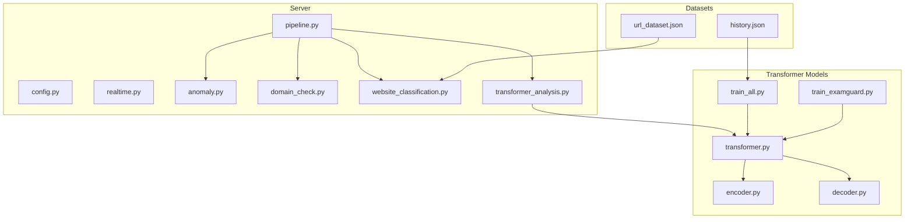
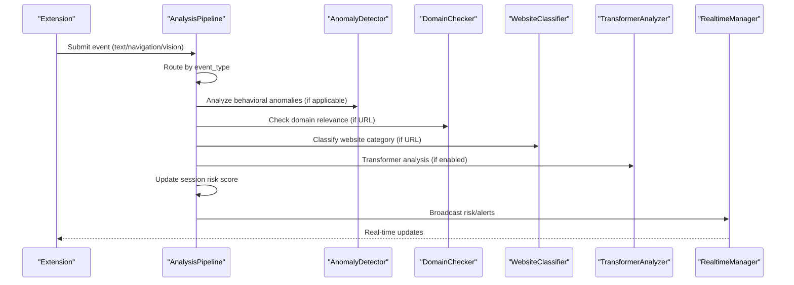
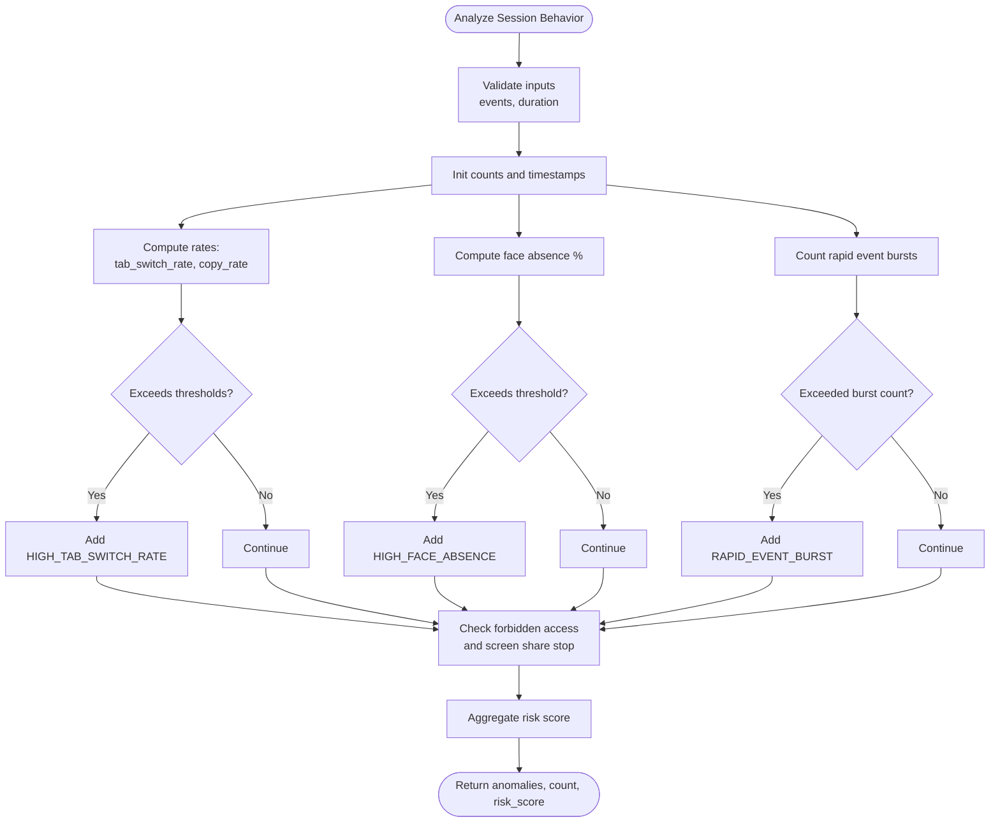
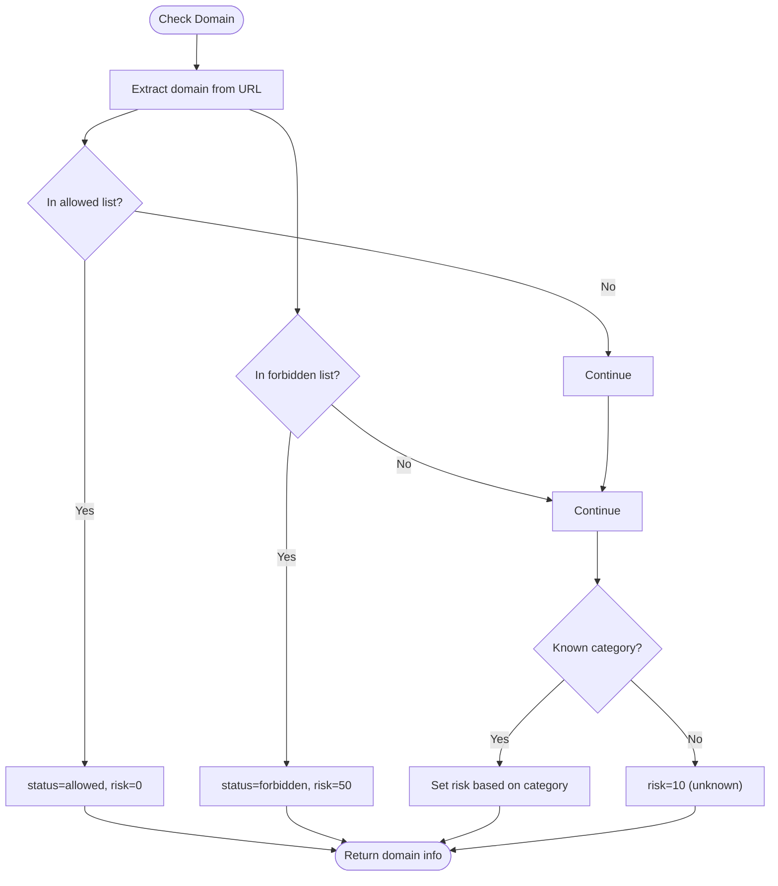
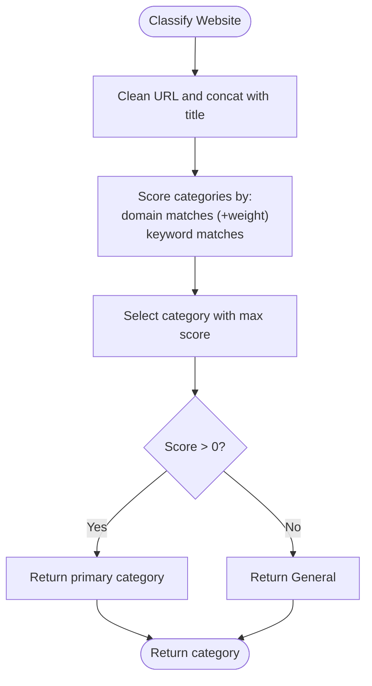
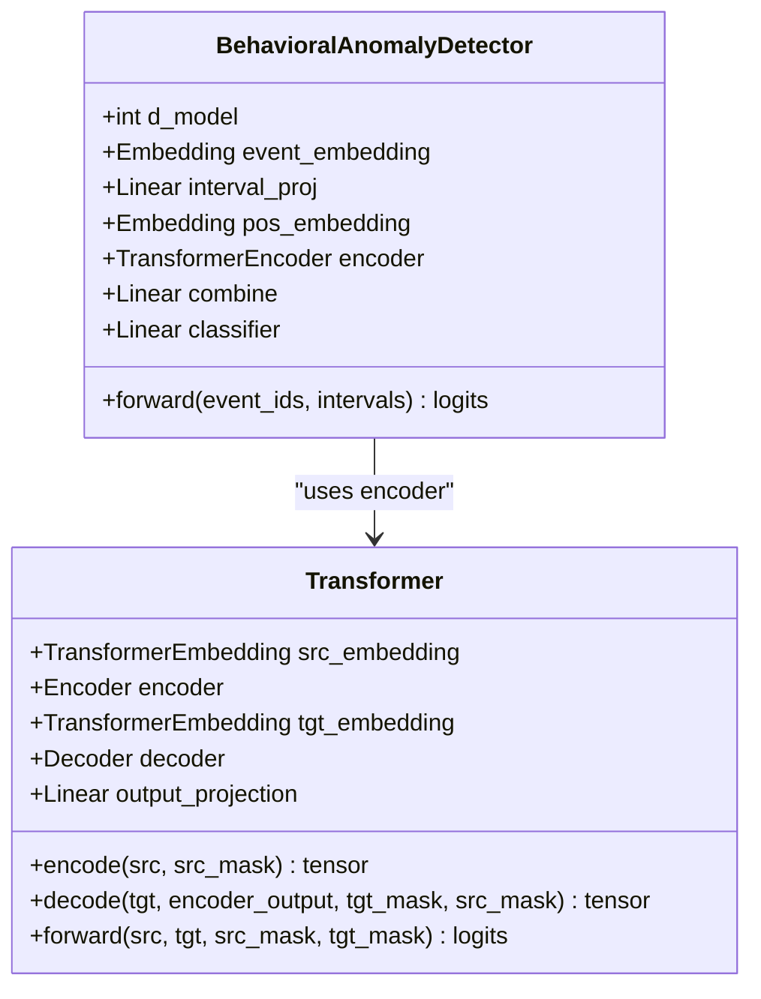
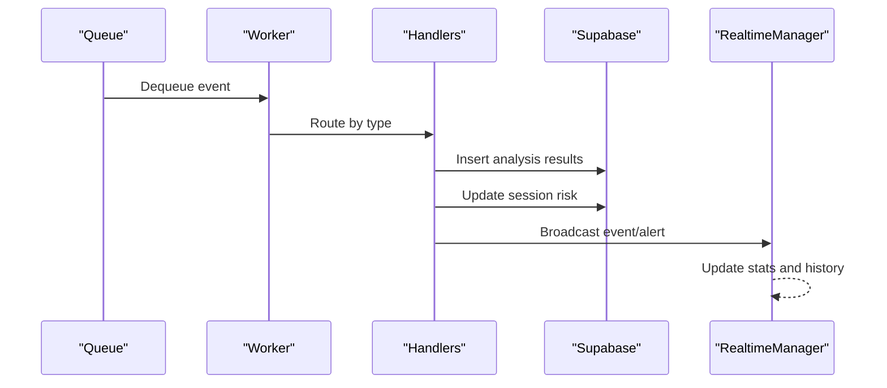
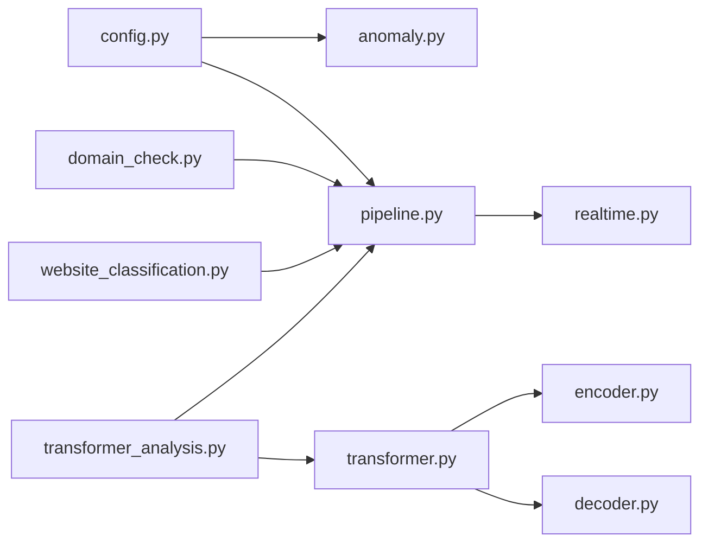

# Anomaly Detection Algorithms

<cite>
**Referenced Files in This Document**
- [anomaly.py](file://server/services/anomaly.py)
- [domain_check.py](file://server/services/domain_check.py)
- [website_classification.py](file://server/services/website_classification.py)
- [config.py](file://server/config.py)
- [pipeline.py](file://server/services/pipeline.py)
- [realtime.py](file://server/services/realtime.py)
- [transformer_analysis.py](file://server/services/transformer_analysis.py)
- [transformer.py](file://transformer/model/transformer.py)
- [encoder.py](file://transformer/model/encoder.py)
- [decoder.py](file://transformer/model/decoder.py)
- [train_all.py](file://transformer/train_all.py)
- [train_examguard.py](file://transformer/train_examguard.py)
- [url_dataset.json](file://transformer/data/url_dataset.json)
- [history.json](file://transformer/checkpoints/history.json)
</cite>

## Table of Contents
1. [Introduction](#introduction)
2. [Project Structure](#project-structure)
3. [Core Components](#core-components)
4. [Architecture Overview](#architecture-overview)
5. [Detailed Component Analysis](#detailed-component-analysis)
6. [Dependency Analysis](#dependency-analysis)
7. [Performance Considerations](#performance-considerations)
8. [Troubleshooting Guide](#troubleshooting-guide)
9. [Conclusion](#conclusion)
10. [Appendices](#appendices)

## Introduction
This document describes the anomaly detection algorithms powering ExamGuard Pro’s behavioral pattern analysis and violation detection. It covers statistical and ML-based methods for identifying unusual user behaviors, mouse and keyboard patterns, screen interactions, and unauthorized website/app usage. It also documents the domain validation system, website classification algorithms, machine learning models for behavioral profiling, threshold configuration, and integration with the real-time analysis pipeline.

## Project Structure
The anomaly detection system spans backend services, configuration, and transformer-based ML models:
- Rule-based anomaly detection for behavioral events
- Domain validation and website classification
- Transformer-based behavioral anomaly detection and URL classification
- Real-time pipeline for streaming event processing and alerts
- Configuration-driven risk scoring and thresholds

**Diagram sources**
- [pipeline.py:1-342](file://server/services/pipeline.py#L1-L342)
- [anomaly.py:1-221](file://server/services/anomaly.py#L1-L221)
- [domain_check.py:1-98](file://server/services/domain_check.py#L1-L98)
- [website_classification.py:1-99](file://server/services/website_classification.py#L1-L99)
- [transformer_analysis.py:54-468](file://server/services/transformer_analysis.py#L54-L468)
- [transformer.py:17-314](file://transformer/model/transformer.py#L17-L314)
- [encoder.py:96-155](file://transformer/model/encoder.py#L96-L155)
- [decoder.py:117-180](file://transformer/model/decoder.py#L117-L180)
- [train_all.py:214-401](file://transformer/train_all.py#L214-L401)
- [train_examguard.py:1-277](file://transformer/train_examguard.py#L1-L277)
- [url_dataset.json:4157-4217](file://transformer/data/url_dataset.json#L4157-L4217)
- [history.json:1-122](file://transformer/checkpoints/history.json#L1-L122)

**Section sources**
- [pipeline.py:1-342](file://server/services/pipeline.py#L1-L342)
- [anomaly.py:1-221](file://server/services/anomaly.py#L1-L221)
- [domain_check.py:1-98](file://server/services/domain_check.py#L1-L98)
- [website_classification.py:1-99](file://server/services/website_classification.py#L1-L99)
- [transformer_analysis.py:54-468](file://server/services/transformer_analysis.py#L54-L468)
- [transformer.py:17-314](file://transformer/model/transformer.py#L17-L314)
- [encoder.py:96-155](file://transformer/model/encoder.py#L96-L155)
- [decoder.py:117-180](file://transformer/model/decoder.py#L117-L180)
- [train_all.py:214-401](file://transformer/train_all.py#L214-L401)
- [train_examguard.py:1-277](file://transformer/train_examguard.py#L1-L277)
- [url_dataset.json:4157-4217](file://transformer/data/url_dataset.json#L4157-L4217)
- [history.json:1-122](file://transformer/checkpoints/history.json#L1-L122)

## Core Components
- Statistical anomaly detection: rule-based checks for tab switches, copy/paste rates, face absence, rapid event bursts, forbidden access, and screen sharing interruptions.
- Domain validation: allowed/forbidden lists and regex-based domain extraction with risk scoring.
- Website classification: keyword and domain-based categorization into Education, AI, Entertainment, etc.
- Transformer-based behavioral anomaly detection: sequence classification of event streams into risk levels.
- Real-time pipeline: asynchronous event routing, risk aggregation, and alert broadcasting.
- Configuration: risk weights, thresholds, and classification lists.

**Section sources**
- [anomaly.py:11-165](file://server/services/anomaly.py#L11-L165)
- [domain_check.py:33-89](file://server/services/domain_check.py#L33-L89)
- [website_classification.py:64-92](file://server/services/website_classification.py#L64-L92)
- [transformer_analysis.py:247-468](file://server/services/transformer_analysis.py#L247-L468)
- [pipeline.py:74-304](file://server/services/pipeline.py#L74-L304)
- [config.py:164-196](file://server/config.py#L164-L196)

## Architecture Overview
The system integrates rule-based and ML-based detectors into a unified real-time pipeline. Events are submitted asynchronously, routed to appropriate handlers, and risk scores are continuously updated and broadcasted.

**Diagram sources**
- [pipeline.py:74-332](file://server/services/pipeline.py#L74-L332)
- [anomaly.py:23-165](file://server/services/anomaly.py#L23-L165)
- [domain_check.py:63-89](file://server/services/domain_check.py#L63-L89)
- [website_classification.py:64-92](file://server/services/website_classification.py#L64-L92)
- [transformer_analysis.py:399-468](file://server/services/transformer_analysis.py#L399-L468)
- [realtime.py:334-402](file://server/services/realtime.py#L334-L402)

## Detailed Component Analysis

### Statistical Anomaly Detection (Rule-Based)
- Thresholds: tab switches per minute, copy/paste per minute, face absence percentage, rapid event interval, and forbidden access/screen share interruption triggers.
- Scoring: severity-based risk increments mapped to a capped score.
- Single-event checks: immediate flags for critical events.

**Diagram sources**
- [anomaly.py:23-165](file://server/services/anomaly.py#L23-L165)

**Section sources**
- [anomaly.py:11-165](file://server/services/anomaly.py#L11-L165)

### Domain Validation System
- Allowed and forbidden domain lists.
- Domain extraction from URLs with protocol removal and “www” stripping.
- Risk scoring and status classification (allowed, forbidden, unknown).

**Diagram sources**
- [domain_check.py:40-89](file://server/services/domain_check.py#L40-L89)

**Section sources**
- [domain_check.py:33-89](file://server/services/domain_check.py#L33-L89)

### Website Classification Algorithms
- Keyword and domain matching with weighted scoring.
- Primary category selection by highest score; fallback to General.
- Integration with URL classification and risk assignment.

**Diagram sources**
- [website_classification.py:64-92](file://server/services/website_classification.py#L64-L92)

**Section sources**
- [website_classification.py:10-99](file://server/services/website_classification.py#L10-L99)
- [url_dataset.json:4157-4217](file://transformer/data/url_dataset.json#L4157-L4217)

### Transformer-Based Behavioral Profiling
- Behavioral anomaly detector: encodes event sequences and intervals, pools representations, and classifies risk levels.
- Training: supervised classification across normal/mild/high/critical risk labels with balanced class weights.
- Inference: loads trained checkpoint, tokenizes events, predicts risk level and confidence.

**Diagram sources**
- [transformer_analysis.py:54-120](file://server/services/transformer_analysis.py#L54-L120)
- [transformer.py:17-120](file://transformer/model/transformer.py#L17-L120)
- [encoder.py:96-155](file://transformer/model/encoder.py#L96-L155)

**Section sources**
- [transformer_analysis.py:247-468](file://server/services/transformer_analysis.py#L247-L468)
- [transformer.py:17-314](file://transformer/model/transformer.py#L17-L314)
- [encoder.py:96-155](file://transformer/model/encoder.py#L96-L155)
- [decoder.py:117-180](file://transformer/model/decoder.py#L117-L180)
- [train_all.py:214-401](file://transformer/train_all.py#L214-L401)

### Real-Time Decision Making and Pipeline Integration
- Asynchronous event queue with background worker.
- Routing by event type: text, navigation, focus, vision, and transformer alerts.
- Continuous risk score updates and real-time broadcasting to dashboards and extensions.

**Diagram sources**
- [pipeline.py:55-332](file://server/services/pipeline.py#L55-L332)
- [realtime.py:334-532](file://server/services/realtime.py#L334-L532)

**Section sources**
- [pipeline.py:74-304](file://server/services/pipeline.py#L74-L304)
- [realtime.py:102-532](file://server/services/realtime.py#L102-L532)

## Dependency Analysis
- Rule-based detector depends on configuration thresholds and weights.
- Domain checker depends on static lists; website classifier depends on keyword/domain rules.
- Transformer analyzer depends on trained checkpoints and tokenizer configurations.
- Pipeline orchestrates all detectors and publishes to real-time manager.

**Diagram sources**
- [config.py:164-196](file://server/config.py#L164-L196)
- [anomaly.py:14-21](file://server/services/anomaly.py#L14-L21)
- [pipeline.py:74-332](file://server/services/pipeline.py#L74-L332)
- [domain_check.py:36-38](file://server/services/domain_check.py#L36-L38)
- [website_classification.py:64-92](file://server/services/website_classification.py#L64-L92)
- [transformer_analysis.py:247-468](file://server/services/transformer_analysis.py#L247-L468)
- [transformer.py:17-314](file://transformer/model/transformer.py#L17-L314)
- [encoder.py:96-155](file://transformer/model/encoder.py#L96-L155)
- [decoder.py:117-180](file://transformer/model/decoder.py#L117-L180)
- [realtime.py:334-532](file://server/services/realtime.py#L334-L532)

**Section sources**
- [config.py:164-196](file://server/config.py#L164-L196)
- [anomaly.py:14-21](file://server/services/anomaly.py#L14-L21)
- [pipeline.py:74-332](file://server/services/pipeline.py#L74-L332)
- [domain_check.py:36-38](file://server/services/domain_check.py#L36-L38)
- [website_classification.py:64-92](file://server/services/website_classification.py#L64-L92)
- [transformer_analysis.py:247-468](file://server/services/transformer_analysis.py#L247-L468)
- [transformer.py:17-314](file://transformer/model/transformer.py#L17-L314)
- [encoder.py:96-155](file://transformer/model/encoder.py#L96-L155)
- [decoder.py:117-180](file://transformer/model/decoder.py#L117-L180)
- [realtime.py:334-532](file://server/services/realtime.py#L334-L532)

## Performance Considerations
- Asynchronous processing prevents blocking; batching and dynamic batching reduce overhead.
- Transformer inference runs on GPU when available; checkpoints enable efficient loading.
- Risk score thresholds cap impact and reduce false positives.
- Streaming video frames trigger periodic AI callbacks; binary relay minimizes latency.

[No sources needed since this section provides general guidance]

## Troubleshooting Guide
- Missing transformer checkpoints: initialization prints warnings and disables features.
- Pipeline errors: logged with error counters; worker continues processing.
- Real-time broadcasting: handles disconnected sockets and cleans up rooms.
- Domain classification: regex parsing errors return empty domains; fallback risk applied.

**Section sources**
- [transformer_analysis.py:278-280](file://server/services/transformer_analysis.py#L278-L280)
- [pipeline.py:69-72](file://server/services/pipeline.py#L69-L72)
- [realtime.py:588-600](file://server/services/realtime.py#L588-L600)
- [domain_check.py:40-51](file://server/services/domain_check.py#L40-L51)

## Conclusion
ExamGuard Pro combines rule-based heuristics with transformer-based behavioral classification to detect anomalies across user interactions, browsing, and visual cues. The real-time pipeline aggregates signals, updates risk scores, and broadcasts actionable alerts to dashboards and extensions, enabling responsive supervision during assessments.

[No sources needed since this section summarizes without analyzing specific files]

## Appendices

### Configuration Parameters
- Risk weights: per-event weight mapping for accumulating risk.
- Risk thresholds: SAFE/REVIEW/SUSPICIOUS boundaries.
- Forbidden keywords and categorized site lists: AI, CHEATING, ENTERTAINMENT, SOCIAL, EDUCATIONAL.
- Face detection thresholds: absence duration and confidence thresholds.

**Section sources**
- [config.py:164-205](file://server/config.py#L164-L205)

### Sensitivity Levels and Adaptive Thresholding
- Behavioral thresholds: tab switches per minute, copy/paste per minute, face absence percentage, rapid event interval.
- Risk score thresholds: categorical boundaries for risk levels.
- Adaptive suggestions: adjust thresholds based on historical risk score distributions and false positive rates.

**Section sources**
- [anomaly.py:14-21](file://server/services/anomaly.py#L14-L21)
- [config.py:191-196](file://server/config.py#L191-L196)

### Learning Periods and False Positive Reduction
- Behavioral model training: supervised classification with class balancing and cosine annealing warmup.
- URL classification: keyword and domain scoring with labeled datasets.
- History tracking: training/validation loss and learning rate curves for diagnostics.

**Section sources**
- [train_all.py:304-401](file://transformer/train_all.py#L304-L401)
- [train_examguard.py:195-277](file://transformer/train_examguard.py#L195-L277)
- [history.json:1-122](file://transformer/checkpoints/history.json#L1-L122)