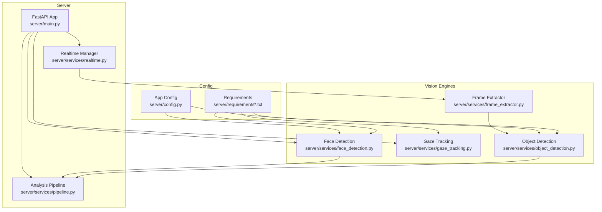
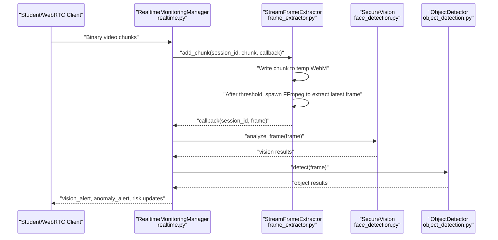
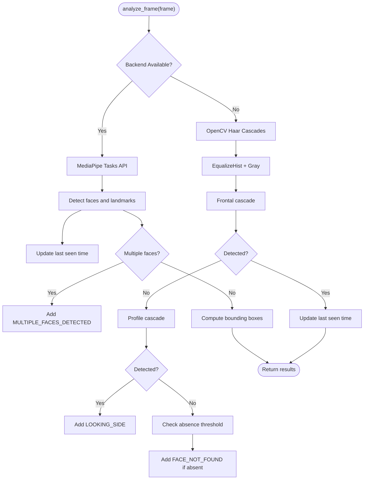
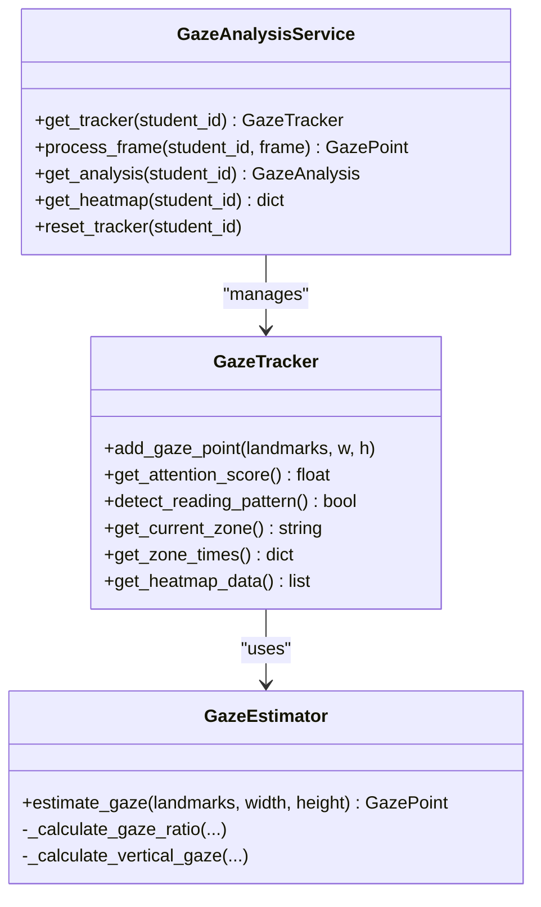
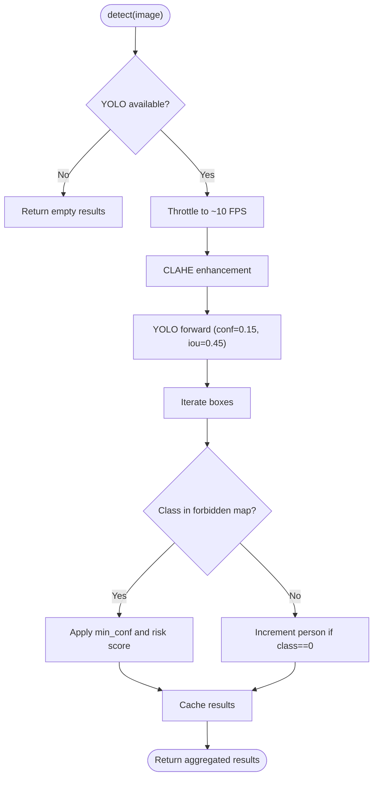
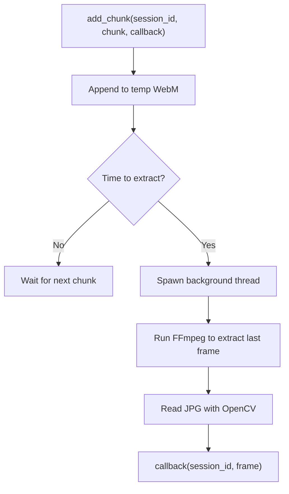
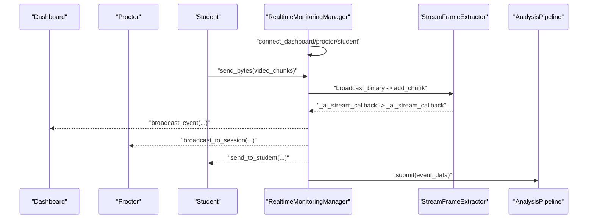
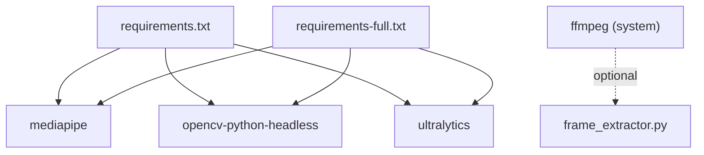

# Computer Vision Services

<cite>
**Referenced Files in This Document**
- [face_detection.py](file://server/services/face_detection.py)
- [gaze_tracking.py](file://server/services/gaze_tracking.py)
- [object_detection.py](file://server/services/object_detection.py)
- [frame_extractor.py](file://server/services/frame_extractor.py)
- [realtime.py](file://server/services/realtime.py)
- [pipeline.py](file://server/services/pipeline.py)
- [main.py](file://server/main.py)
- [config.py](file://server/config.py)
- [requirements.txt](file://server/requirements.txt)
- [requirements-full.txt](file://server/requirements-full.txt)
</cite>

## Table of Contents
1. [Introduction](#introduction)
2. [Project Structure](#project-structure)
3. [Core Components](#core-components)
4. [Architecture Overview](#architecture-overview)
5. [Detailed Component Analysis](#detailed-component-analysis)
6. [Dependency Analysis](#dependency-analysis)
7. [Performance Considerations](#performance-considerations)
8. [Troubleshooting Guide](#troubleshooting-guide)
9. [Conclusion](#conclusion)
10. [Appendices](#appendices)

## Introduction
This document describes the computer vision services powering ExamGuard Pro’s real-time visual analysis. It covers:
- Dual-backend face detection (MediaPipe Tasks API and OpenCV Haar cascades)
- Face landmark extraction and presence verification
- YOLOv8-powered object detection for unauthorized devices and suspicious items
- Gaze tracking and attention monitoring using eye landmarks
- Frame extraction from live video streams and periodic analysis
- Configuration parameters, fallback strategies, and performance tuning
- Integration with the event pipeline and real-time WebSocket broadcasting

## Project Structure
The computer vision stack resides under server/services and integrates with the FastAPI application lifecycle and WebSocket-based real-time monitoring.

**Diagram sources**
- [main.py:109-165](file://server/main.py#L109-L165)
- [realtime.py:102-138](file://server/services/realtime.py#L102-L138)
- [pipeline.py:9-34](file://server/services/pipeline.py#L9-L34)
- [face_detection.py:27-48](file://server/services/face_detection.py#L27-L48)
- [gaze_tracking.py:471-497](file://server/services/gaze_tracking.py#L471-L497)
- [object_detection.py:16-42](file://server/services/object_detection.py#L16-L42)
- [frame_extractor.py:10-20](file://server/services/frame_extractor.py#L10-L20)
- [config.py:198-205](file://server/config.py#L198-L205)
- [requirements.txt:29-33](file://server/requirements.txt#L29-L33)
- [requirements-full.txt:14-24](file://server/requirements-full.txt#L14-L24)

**Section sources**
- [main.py:109-165](file://server/main.py#L109-L165)
- [realtime.py:102-138](file://server/services/realtime.py#L102-L138)
- [pipeline.py:9-34](file://server/services/pipeline.py#L9-L34)

## Core Components
- SecureVision: Dual-backend face detection with MediaPipe Tasks API fallback to OpenCV Haar cascades. Provides presence verification and bounding boxes.
- GazeAnalysisService: On-device eye landmark analysis for gaze estimation, attention scoring, and anomaly detection.
- ObjectDetector: YOLO-based detection of phones, laptops, books, watches, mice, keyboards, remotes, TVs, and multiple people.
- StreamFrameExtractor: Periodic frame extraction from live WebM streams using FFmpeg for server-side AI analysis.
- RealtimeMonitoringManager: WebSocket hub for broadcasting events, managing rooms, and coordinating AI callbacks.
- AnalysisPipeline: Asynchronous event routing and risk score updates integrated with Supabase.

**Section sources**
- [face_detection.py:27-109](file://server/services/face_detection.py#L27-L109)
- [gaze_tracking.py:471-611](file://server/services/gaze_tracking.py#L471-L611)
- [object_detection.py:16-147](file://server/services/object_detection.py#L16-L147)
- [frame_extractor.py:10-115](file://server/services/frame_extractor.py#L10-L115)
- [realtime.py:102-200](file://server/services/realtime.py#L102-L200)
- [pipeline.py:9-96](file://server/services/pipeline.py#L9-L96)

## Architecture Overview
The system initializes vision engines at startup, receives live video chunks over WebSocket, periodically extracts frames, runs AI analyses, and broadcasts results to dashboards, proctors, and students.

**Diagram sources**
- [realtime.py:139-200](file://server/services/realtime.py#L139-L200)
- [frame_extractor.py:31-90](file://server/services/frame_extractor.py#L31-L90)
- [face_detection.py:50-86](file://server/services/face_detection.py#L50-L86)
- [object_detection.py:65-137](file://server/services/object_detection.py#L65-L137)

## Detailed Component Analysis

### Face Detection and Presence Verification
Dual-backend design:
- MediaPipe Tasks API: Loads a local face landmarker task model and runs detection with configurable face count and blendshapes.
- OpenCV Haar cascades: Falls back when MediaPipe is unavailable, using frontal and profile cascades with histogram equalization.

Presence verification:
- Tracks last seen face time and flags absence beyond a configurable threshold.
- Emits violations for multiple faces and absent face conditions.

**Diagram sources**
- [face_detection.py:50-109](file://server/services/face_detection.py#L50-L109)

**Section sources**
- [face_detection.py:7-26](file://server/services/face_detection.py#L7-L26)
- [face_detection.py:27-48](file://server/services/face_detection.py#L27-L48)
- [face_detection.py:50-86](file://server/services/face_detection.py#L50-L86)
- [face_detection.py:88-109](file://server/services/face_detection.py#L88-L109)
- [config.py:198-201](file://server/config.py#L198-L201)

### Gaze Tracking and Attention Monitoring
- Uses MediaPipe FaceMesh to obtain eye landmarks and estimate gaze direction via iris-to-corner ratios and vertical EAR-based proxy.
- Maintains a sliding window of gaze points, computes attention zones, and detects anomalies such as prolonged off-screen time, rapid eye movements, and reading pattern analysis.
- Exposes a singleton service with per-student trackers and a heatmap aggregation.

**Diagram sources**
- [gaze_tracking.py:113-179](file://server/services/gaze_tracking.py#L113-L179)
- [gaze_tracking.py:268-323](file://server/services/gaze_tracking.py#L268-L323)
- [gaze_tracking.py:471-597](file://server/services/gaze_tracking.py#L471-L597)

**Section sources**
- [gaze_tracking.py:16-22](file://server/services/gaze_tracking.py#L16-L22)
- [gaze_tracking.py:113-179](file://server/services/gaze_tracking.py#L113-L179)
- [gaze_tracking.py:268-374](file://server/services/gaze_tracking.py#L268-L374)
- [gaze_tracking.py:471-597](file://server/services/gaze_tracking.py#L471-L597)

### Object Detection (Unauthorized Devices and Suspicious Items)
- YOLO model loader with lazy import and local weights path.
- Preprocessing with CLAHE for low-light scenarios.
- Detection loop filters by COCO-class mapping and applies sensitivity thresholds per object type.
- Aggregates risk scores and flags multiple people.

**Diagram sources**
- [object_detection.py:65-137](file://server/services/object_detection.py#L65-L137)

**Section sources**
- [object_detection.py:16-42](file://server/services/object_detection.py#L16-L42)
- [object_detection.py:43-64](file://server/services/object_detection.py#L43-L64)
- [object_detection.py:65-137](file://server/services/object_detection.py#L65-L137)

### Frame Extraction from Live Streams
- Accumulates WebM chunks into a per-session temporary file.
- Periodically spawns a background thread to run FFmpeg and extract the latest frame.
- Calls a callback with the frame for AI analysis, avoiding blocking the WebSocket.

**Diagram sources**
- [frame_extractor.py:31-90](file://server/services/frame_extractor.py#L31-L90)

**Section sources**
- [frame_extractor.py:10-20](file://server/services/frame_extractor.py#L10-L20)
- [frame_extractor.py:31-90](file://server/services/frame_extractor.py#L31-L90)

### Real-Time WebSocket Integration and Event Broadcasting
- Manages rooms per session and broadcasts events to dashboards, proctors, and students.
- Receives binary video chunks, forwards to frame extractor, and triggers AI callbacks.
- Emits structured events including vision alerts, anomalies, and risk updates.

**Diagram sources**
- [realtime.py:213-329](file://server/services/realtime.py#L213-L329)
- [realtime.py:139-200](file://server/services/realtime.py#L139-L200)
- [pipeline.py:74-96](file://server/services/pipeline.py#L74-L96)

**Section sources**
- [realtime.py:81-138](file://server/services/realtime.py#L81-L138)
- [realtime.py:334-403](file://server/services/realtime.py#L334-L403)
- [realtime.py:404-486](file://server/services/realtime.py#L404-L486)
- [realtime.py:538-576](file://server/services/realtime.py#L538-L576)
- [pipeline.py:74-96](file://server/services/pipeline.py#L74-L96)

## Dependency Analysis
- MediaPipe and OpenCV are required for face detection and gaze tracking.
- Ultralytics YOLO is optional; if unavailable, object detection returns neutral results.
- FFmpeg is required for server-side frame extraction; otherwise, extraction is disabled.

**Diagram sources**
- [requirements.txt:29-33](file://server/requirements.txt#L29-L33)
- [requirements-full.txt:14-24](file://server/requirements-full.txt#L14-L24)
- [frame_extractor.py:51-66](file://server/services/frame_extractor.py#L51-L66)

**Section sources**
- [requirements.txt:29-33](file://server/requirements.txt#L29-L33)
- [requirements-full.txt:14-24](file://server/requirements-full.txt#L14-L24)
- [frame_extractor.py:51-66](file://server/services/frame_extractor.py#L51-L66)

## Performance Considerations
- Frame throttling: Object detection caches results and limits processing frequency to stabilize UI and reduce CPU load.
- CLAHE preprocessing: Improves detection reliability in low-light webcam feeds.
- Backend fallback: MediaPipe Tasks API is preferred; OpenCV Haar cascades ensure functionality when MediaPipe is unavailable.
- Streaming extraction: Background threads prevent blocking WebSocket I/O during FFmpeg frame extraction.
- Model caching: MediaPipe task model is downloaded once and reused locally.

Recommendations:
- Ensure FFmpeg is installed and available in PATH for server-side extraction.
- Tune detection thresholds and absence durations based on deployment lighting and camera quality.
- Monitor CPU usage and adjust extraction FPS and YOLO confidence thresholds accordingly.

**Section sources**
- [object_detection.py:76-85](file://server/services/object_detection.py#L76-L85)
- [object_detection.py:52-63](file://server/services/object_detection.py#L52-L63)
- [face_detection.py:16-25](file://server/services/face_detection.py#L16-L25)
- [frame_extractor.py:42-43](file://server/services/frame_extractor.py#L42-L43)
- [config.py:198-201](file://server/config.py#L198-L201)

## Troubleshooting Guide
Common issues and resolutions:
- MediaPipe initialization failure: The system falls back to Haar cascades automatically. Verify OpenCV installation and cascades availability.
- Missing YOLO model: If the model file is not present, object detection returns neutral results; install the model or ensure the path exists.
- FFmpeg not found: Extraction logs an error and disables server-side frame extraction; install FFmpeg or set the environment variable to point to the executable.
- WebSocket disconnections: The manager cleans up buffers and rooms; verify network stability and heartbeat intervals.
- Risk score not updating: Ensure the analysis pipeline is running and Supabase connectivity is intact.

**Section sources**
- [face_detection.py:24-25](file://server/services/face_detection.py#L24-L25)
- [object_detection.py:17-21](file://server/services/object_detection.py#L17-L21)
- [frame_extractor.py:84-89](file://server/services/frame_extractor.py#L84-L89)
- [realtime.py:275-309](file://server/services/realtime.py#L275-L309)
- [pipeline.py:128-132](file://server/services/pipeline.py#L128-L132)

## Conclusion
ExamGuard Pro’s computer vision services combine robust dual-backend face detection, precise gaze tracking, and efficient object detection to provide comprehensive real-time monitoring. The modular design, fallback mechanisms, and WebSocket-driven pipeline enable scalable, low-latency analysis suitable for online proctoring environments.

## Appendices

### Configuration Parameters
- Face detection
  - Absence threshold: seconds before flagging absent face
  - Minimum face confidence: threshold for detections
- Object detection
  - Base confidence threshold and per-class sensitivity thresholds
  - IOU threshold for non-max suppression
- Gaze tracking
  - Calibration and anomaly thresholds (e.g., continuous off-screen duration, rapid movement counts)
- Stream extraction
  - Extraction rate (FPS) and FFmpeg path environment variable

**Section sources**
- [config.py:198-205](file://server/config.py#L198-L205)
- [object_detection.py:84-107](file://server/services/object_detection.py#L84-L107)
- [gaze_tracking.py:347-373](file://server/services/gaze_tracking.py#L347-L373)
- [frame_extractor.py:15-16](file://server/services/frame_extractor.py#L15-L16)
- [frame_extractor.py:51-66](file://server/services/frame_extractor.py#L51-L66)

### Integration Patterns
- Startup initialization stores vision and gaze services in app state for route access.
- Realtime manager coordinates WebSocket connections and delegates AI callbacks to vision and object detectors.
- Analysis pipeline processes events asynchronously and updates session risk levels.

**Section sources**
- [main.py:117-132](file://server/main.py#L117-L132)
- [realtime.py:139-200](file://server/services/realtime.py#L139-L200)
- [pipeline.py:74-96](file://server/services/pipeline.py#L74-L96)