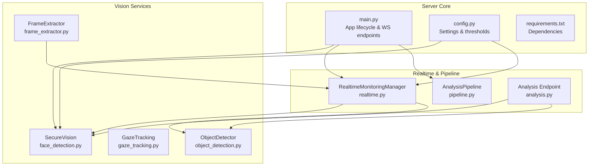
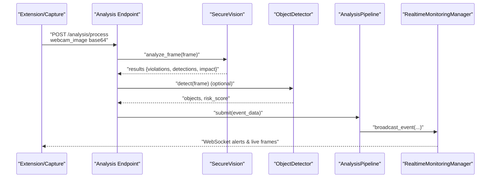
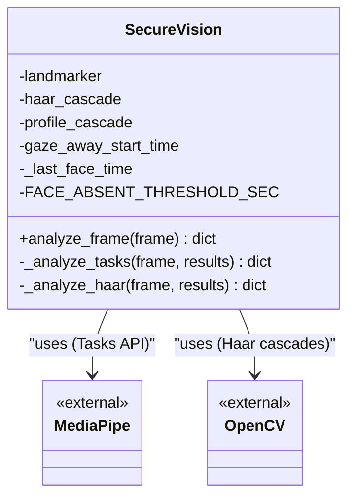
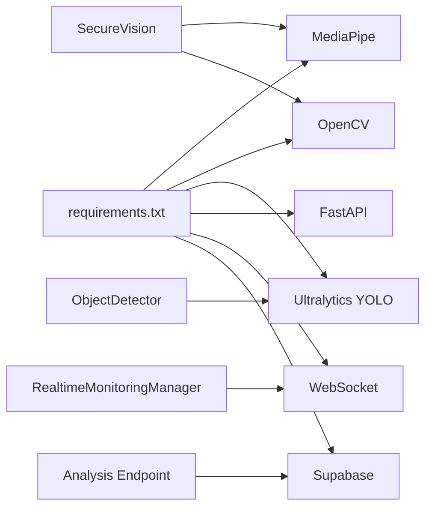

# Face Detection System

<cite>
**Referenced Files in This Document**
- [face_detection.py](file://server/services/face_detection.py)
- [main.py](file://server/main.py)
- [realtime.py](file://server/services/realtime.py)
- [pipeline.py](file://server/services/pipeline.py)
- [analysis.py](file://server/api/endpoints/analysis.py)
- [frame_extractor.py](file://server/services/frame_extractor.py)
- [object_detection.py](file://server/services/object_detection.py)
- [gaze_tracking.py](file://server/services/gaze_tracking.py)
- [requirements.txt](file://server/requirements.txt)
- [config.py](file://server/config.py)
</cite>

## Table of Contents
1. [Introduction](#introduction)
2. [Project Structure](#project-structure)
3. [Core Components](#core-components)
4. [Architecture Overview](#architecture-overview)
5. [Detailed Component Analysis](#detailed-component-analysis)
6. [Dependency Analysis](#dependency-analysis)
7. [Performance Considerations](#performance-considerations)
8. [Troubleshooting Guide](#troubleshooting-guide)
9. [Conclusion](#conclusion)

## Introduction
This document describes the face detection system in ExamGuard Pro, focusing on the dual-backend architecture supporting MediaPipe Tasks API and Haar cascade classifiers, automatic fallback mechanisms, and integration with the broader real-time monitoring pipeline. It explains the SecureVision class implementation, face landmark extraction processes, presence verification algorithms, detection threshold configurations, model loading strategies, and performance optimization techniques. Practical examples illustrate frame analysis, bounding box calculations, and integrity score impact assessments. Finally, it documents integration with the main event processing pipeline and real-time WebSocket communication patterns.

## Project Structure
The face detection system spans several modules:
- Face detection engine: SecureVision with dual-backend support
- Real-time monitoring: WebSocket broadcasting and session management
- Analysis pipeline: asynchronous event processing and risk scoring
- Supporting services: object detection, frame extraction, and gaze tracking
- API endpoints: ingestion and response handling for webcam frames

**Diagram sources**
- [main.py:109-132](file://server/main.py#L109-L132)
- [face_detection.py:27-125](file://server/services/face_detection.py#L27-L125)
- [realtime.py:102-137](file://server/services/realtime.py#L102-L137)
- [pipeline.py:9-53](file://server/services/pipeline.py#L9-L53)
- [analysis.py:57-135](file://server/api/endpoints/analysis.py#L57-L135)
- [frame_extractor.py:10-115](file://server/services/frame_extractor.py#L10-L115)
- [object_detection.py:16-147](file://server/services/object_detection.py#L16-L147)
- [gaze_tracking.py:1-535](file://server/services/gaze_tracking.py#L1-L535)
- [config.py:198-205](file://server/config.py#L198-L205)
- [requirements.txt:24-33](file://server/requirements.txt#L24-L33)

**Section sources**
- [main.py:109-132](file://server/main.py#L109-L132)
- [face_detection.py:1-125](file://server/services/face_detection.py#L1-L125)
- [realtime.py:102-137](file://server/services/realtime.py#L102-L137)
- [pipeline.py:9-53](file://server/services/pipeline.py#L9-L53)
- [analysis.py:57-135](file://server/api/endpoints/analysis.py#L57-L135)
- [frame_extractor.py:10-115](file://server/services/frame_extractor.py#L10-L115)
- [object_detection.py:16-147](file://server/services/object_detection.py#L16-L147)
- [gaze_tracking.py:1-535](file://server/services/gaze_tracking.py#L1-L535)
- [config.py:198-205](file://server/config.py#L198-L205)
- [requirements.txt:24-33](file://server/requirements.txt#L24-L33)

## Core Components
- SecureVision: Dual-backend face detection engine with automatic fallback
- RealtimeMonitoringManager: WebSocket broadcasting and session routing
- AnalysisPipeline: Asynchronous event processing and risk updates
- ObjectDetector: YOLO-based object detection for phones and forbidden items
- FrameExtractor: Server-side frame extraction from live WebM streams
- GazeAnalysisService: MediaPipe-based gaze tracking and attention analysis

Key capabilities:
- Automatic backend selection between MediaPipe Tasks API and Haar cascades
- Presence verification with configurable absence thresholds
- Violation detection for multiple faces, face absence, and side-looking
- Integrity score impact assessment for detected violations
- Real-time WebSocket integration for alerts and live frames

**Section sources**
- [face_detection.py:27-125](file://server/services/face_detection.py#L27-L125)
- [realtime.py:102-137](file://server/services/realtime.py#L102-L137)
- [pipeline.py:9-53](file://server/services/pipeline.py#L9-L53)
- [object_detection.py:16-147](file://server/services/object_detection.py#L16-L147)
- [frame_extractor.py:10-115](file://server/services/frame_extractor.py#L10-L115)
- [gaze_tracking.py:471-535](file://server/services/gaze_tracking.py#L471-L535)

## Architecture Overview
The face detection system integrates tightly with the application lifecycle and real-time monitoring infrastructure. The main application initializes the SecureVision engine and exposes WebSocket endpoints for dashboards, proctors, and students. Live video streams are processed asynchronously, with extracted frames analyzed for faces, objects, and anomalies. Results propagate through the AnalysisPipeline and RealtimeMonitoringManager to update session risk scores and broadcast alerts.

**Diagram sources**
- [analysis.py:57-135](file://server/api/endpoints/analysis.py#L57-L135)
- [face_detection.py:64-125](file://server/services/face_detection.py#L64-L125)
- [object_detection.py:65-137](file://server/services/object_detection.py#L65-L137)
- [pipeline.py:44-96](file://server/services/pipeline.py#L44-L96)
- [realtime.py:334-377](file://server/services/realtime.py#L334-L377)

## Detailed Component Analysis

### SecureVision: Dual-Backend Face Detection Engine
SecureVision encapsulates the face detection logic with automatic backend selection and fallback:
- Backend detection: Attempts MediaPipe Tasks API initialization; falls back to Haar cascades if unavailable
- MediaPipe Tasks API: Loads a face landmarker model and configures detection options
- Haar cascade fallback: Uses OpenCV’s built-in cascades for frontal and profile faces
- Presence verification: Tracks last seen time and flags prolonged absence
- Violation detection: Identifies multiple faces, face absence, and side-looking scenarios
- Bounding box calculation: Converts normalized landmarks to pixel coordinates

**Diagram sources**
- [face_detection.py:27-125](file://server/services/face_detection.py#L27-L125)

**Section sources**
- [face_detection.py:7-26](file://server/services/face_detection.py#L7-L26)
- [face_detection.py:27-63](file://server/services/face_detection.py#L27-L63)
- [face_detection.py:64-125](file://server/services/face_detection.py#L64-L125)

### Backend Selection and Model Loading
Automatic fallback mechanism:
- MediaPipe Tasks API availability check and model download
- Haar cascade initialization guarded by OpenCV availability checks
- Graceful degradation when neither backend is available

Model loading strategies:
- MediaPipe: Downloads a face landmarker task model if missing
- OpenCV: Uses built-in cascade XML files when available

**Section sources**
- [face_detection.py:11-26](file://server/services/face_detection.py#L11-L26)
- [face_detection.py:48-58](file://server/services/face_detection.py#L48-L58)

### Presence Verification and Threshold Configuration
Presence verification logic:
- Tracks last face detection time
- Flags absence violations when elapsed time exceeds configured thresholds
- Applies different impacts for absence and side-looking scenarios

Threshold configurations:
- Face absence threshold: Configurable seconds for absence violation
- Minimum face confidence: Confidence threshold for face detection
- Additional settings: OCR language and text similarity thresholds

**Section sources**
- [face_detection.py:60-62](file://server/services/face_detection.py#L60-L62)
- [face_detection.py:98-101](file://server/services/face_detection.py#L98-L101)
- [config.py:198-205](file://server/config.py#L198-L205)

### Bounding Box Calculation and Detection Results
Bounding box computation:
- MediaPipe Tasks API: Converts normalized face landmarks to pixel coordinates
- Haar cascades: Uses returned rectangles directly
- Detection results include violations, integrity score impact, and bounding boxes

Integrity score impact:
- Multiple faces: Adds significant impact
- Face absence: Adds moderate impact
- Side-looking: Adds violation without explicit impact in current implementation

**Section sources**
- [face_detection.py:86-96](file://server/services/face_detection.py#L86-L96)
- [face_detection.py:105-125](file://server/services/face_detection.py#L105-L125)

### Violation Detection Algorithms
Detection algorithms:
- Multiple faces: Counts detected faces and flags violations accordingly
- Face absence: Monitors time since last detection and flags absence
- Side-looking: Uses profile cascade detection to infer off-face orientation

Integration with object detection:
- Phone detection augments face violations with additional risk
- Combined analysis updates session risk and broadcasts alerts

**Section sources**
- [face_detection.py:82-84](file://server/services/face_detection.py#L82-L84)
- [face_detection.py:98-101](file://server/services/face_detection.py#L98-L101)
- [face_detection.py:110-113](file://server/services/face_detection.py#L110-L113)
- [object_detection.py:105-129](file://server/services/object_detection.py#L105-L129)

### Real-Time WebSocket Communication Patterns
WebSocket integration:
- RealtimeMonitoringManager manages connections for dashboards, proctors, and students
- Broadcasts live frames and alerts to subscribed clients
- Supports room-based routing and targeted messaging
- Handles binary video chunks and JSON events

Live stream processing:
- FrameExtractor accumulates WebM chunks and extracts frames periodically
- AI callbacks trigger analysis and alert broadcasting
- Extension receives real-time updates and anomaly notifications

**Section sources**
- [realtime.py:102-137](file://server/services/realtime.py#L102-L137)
- [realtime.py:334-377](file://server/services/realtime.py#L334-L377)
- [realtime.py:412-417](file://server/services/realtime.py#L412-L417)
- [frame_extractor.py:31-89](file://server/services/frame_extractor.py#L31-L89)

### Integration with Analysis Pipeline
Pipeline integration:
- AnalysisPipeline processes events asynchronously and updates session risk
- Routes vision events to appropriate handlers and updates session metrics
- Broadcasts risk score updates and anomaly alerts via WebSocket
- Maintains statistics for monitoring and debugging

**Section sources**
- [pipeline.py:44-96](file://server/services/pipeline.py#L44-L96)
- [pipeline.py:246-277](file://server/services/pipeline.py#L246-L277)
- [pipeline.py:278-304](file://server/services/pipeline.py#L278-L304)

### API Workflow for Frame Analysis
End-to-end workflow:
- Extension captures webcam frames and sends base64-encoded images
- API endpoint decodes images, saves to disk, and triggers analysis
- Vision engine performs face detection and violation assessment
- Object detector identifies phones and forbidden items
- Results aggregated and session risk updated
- Real-time alerts broadcast to dashboards and students

**Section sources**
- [analysis.py:57-135](file://server/api/endpoints/analysis.py#L57-L135)
- [analysis.py:196-225](file://server/api/endpoints/analysis.py#L196-L225)

## Dependency Analysis
The face detection system relies on external libraries and internal services:
- MediaPipe: Face landmarker and face mesh for advanced detection and gaze tracking
- OpenCV: Haar cascades and image processing utilities
- Ultralytics YOLO: Object detection for phones and forbidden items
- FastAPI and WebSocket: Real-time communication and event broadcasting
- Supabase: Session and analysis result persistence

**Diagram sources**
- [requirements.txt:24-33](file://server/requirements.txt#L24-L33)
- [face_detection.py:11-14](file://server/services/face_detection.py#L11-L14)
- [object_detection.py:8-12](file://server/services/object_detection.py#L8-L12)
- [realtime.py:13-13](file://server/services/realtime.py#L13-L13)
- [analysis.py:11-24](file://server/api/endpoints/analysis.py#L11-L24)

**Section sources**
- [requirements.txt:24-33](file://server/requirements.txt#L24-L33)
- [face_detection.py:11-14](file://server/services/face_detection.py#L11-L14)
- [object_detection.py:8-12](file://server/services/object_detection.py#L8-L12)
- [realtime.py:13-13](file://server/services/realtime.py#L13-L13)
- [analysis.py:11-24](file://server/api/endpoints/analysis.py#L11-L24)

## Performance Considerations
- Backend selection: Prefer MediaPipe Tasks API for higher accuracy; fallback to Haar cascades for minimal overhead
- Model caching: MediaPipe model downloaded once and reused; ensure sufficient disk space
- Frame throttling: Object detection and frame extraction include throttling to reduce CPU usage
- WebSocket broadcasting: Efficient room-based routing minimizes unnecessary network traffic
- Memory management: Temporary files cleaned up after stream processing; ensure proper cleanup on errors

[No sources needed since this section provides general guidance]

## Troubleshooting Guide
Common issues and resolutions:
- MediaPipe initialization failures: Verify model download and permissions; fallback to Haar cascades
- OpenCV headless environments: Ensure Haar cascade data is available; otherwise, no face detection backend
- WebSocket connection drops: Check heartbeat intervals and connection management; verify room membership
- Object detection not triggered: Confirm YOLO model availability and weights path; verify confidence thresholds
- Absence threshold tuning: Adjust absence thresholds in configuration for environment-specific requirements

**Section sources**
- [face_detection.py:24-26](file://server/services/face_detection.py#L24-L26)
- [face_detection.py:55-58](file://server/services/face_detection.py#L55-L58)
- [realtime.py:539-544](file://server/services/realtime.py#L539-L544)
- [object_detection.py:17-26](file://server/services/object_detection.py#L17-L26)
- [config.py:198-205](file://server/config.py#L198-L205)

## Conclusion
ExamGuard Pro’s face detection system provides robust, dual-backend face detection with automatic fallback, presence verification, and integrated violation detection. The SecureVision engine delivers accurate face localization and bounding boxes, while the real-time pipeline ensures timely alerts and risk updates. Integration with WebSocket broadcasting and the analysis pipeline enables comprehensive monitoring and responsive incident handling. Tunable thresholds and performance optimizations support reliable operation across diverse deployment environments.