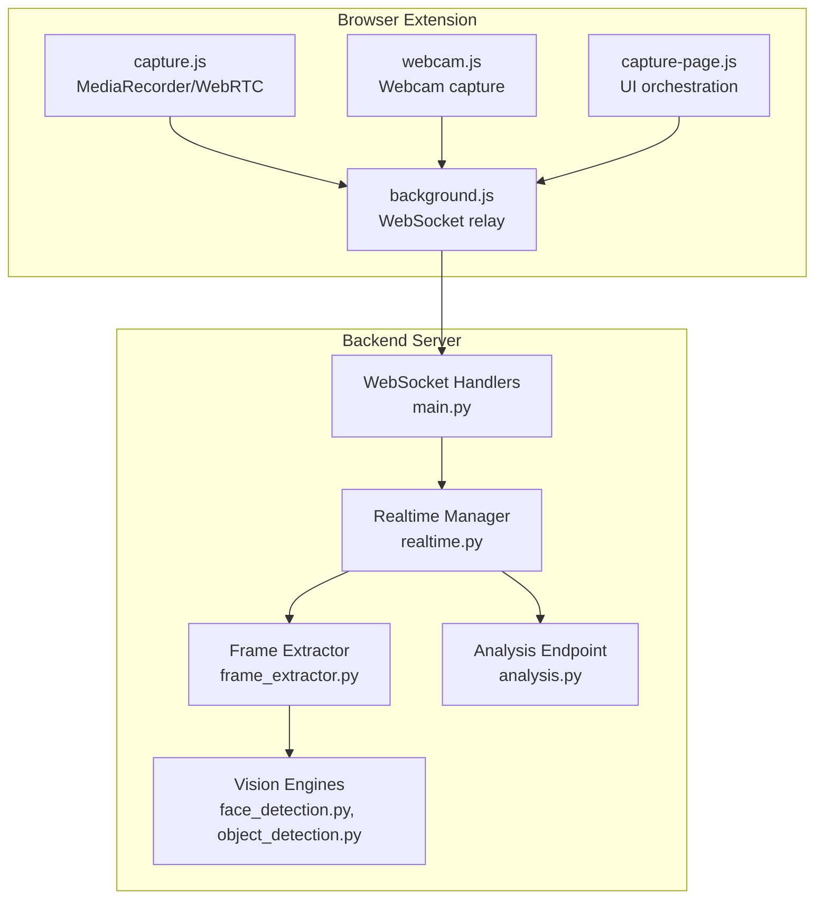
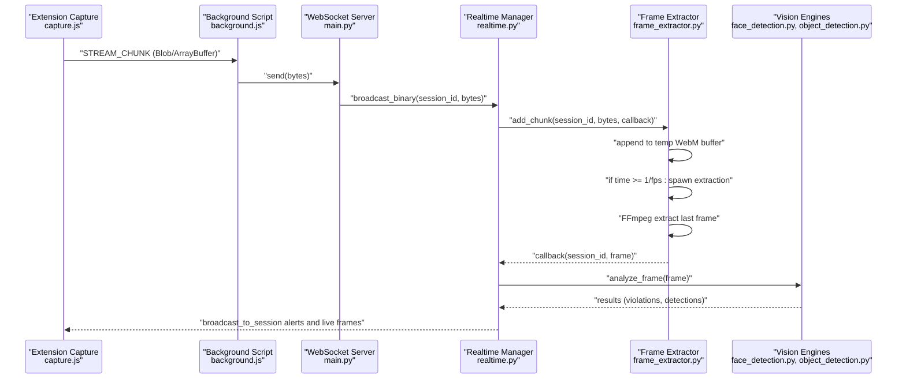
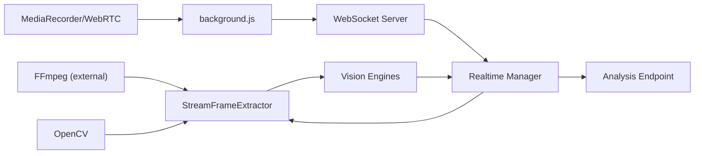

# Frame Extraction Engine

<cite>
**Referenced Files in This Document**
- [frame_extractor.py](file://server/services/frame_extractor.py)
- [realtime.py](file://server/services/realtime.py)
- [main.py](file://server/main.py)
- [analysis.py](file://server/api/endpoints/analysis.py)
- [object_detection.py](file://server/services/object_detection.py)
- [face_detection.py](file://server/services/face_detection.py)
- [background.js](file://extension/background.js)
- [capture.js](file://extension/capture.js)
- [capture-page.js](file://extension/capture-page.js)
- [webcam.js](file://extension/webcam.js)
- [content.js](file://extension/content.js)
- [config.py](file://server/config.py)
</cite>

## Table of Contents
1. [Introduction](#introduction)
2. [Project Structure](#project-structure)
3. [Core Components](#core-components)
4. [Architecture Overview](#architecture-overview)
5. [Detailed Component Analysis](#detailed-component-analysis)
6. [Dependency Analysis](#dependency-analysis)
7. [Performance Considerations](#performance-considerations)
8. [Troubleshooting Guide](#troubleshooting-guide)
9. [Conclusion](#conclusion)
10. [Appendices](#appendices)

## Introduction
This document describes the frame extraction and video processing engine used for periodic analysis of live video streams during exams. It covers frame sampling strategies, timing intervals, quality optimization techniques, integration with webcam capture systems and screen recording workflows, real-time video stream processing, preprocessing steps, and relationships with computer vision services and event-triggering mechanisms. Practical examples of frame acquisition timing, memory management for continuous streams, and performance optimization for high-frequency analysis are included, along with configuration options for frame rates, resolution settings, and storage optimization strategies.

## Project Structure
The frame extraction engine spans three primary areas:
- Browser extension: captures webcam and screen streams, encodes frames, and relays binary chunks to the backend.
- Backend server: receives binary chunks, buffers them, extracts representative frames at controlled intervals, and runs AI analysis.
- Computer vision services: perform face detection, gaze analysis, and object detection on extracted frames.

**Diagram sources**
- [capture.js:207-246](file://extension/capture.js#L207-L246)
- [background.js:143-153](file://extension/background.js#L143-L153)
- [webcam.js:10-56](file://extension/webcam.js#L10-L56)
- [capture-page.js:157-162](file://extension/capture-page.js#L157-L162)
- [main.py:394-476](file://server/main.py#L394-L476)
- [realtime.py:310-329](file://server/services/realtime.py#L310-L329)
- [frame_extractor.py:31-44](file://server/services/frame_extractor.py#L31-L44)
- [face_detection.py:64-103](file://server/services/face_detection.py#L64-L103)
- [object_detection.py:65-137](file://server/services/object_detection.py#L65-L137)
- [analysis.py:196-225](file://server/api/endpoints/analysis.py#L196-L225)

**Section sources**
- [capture.js:207-246](file://extension/capture.js#L207-L246)
- [background.js:143-153](file://extension/background.js#L143-L153)
- [main.py:394-476](file://server/main.py#L394-L476)
- [realtime.py:310-329](file://server/services/realtime.py#L310-L329)
- [frame_extractor.py:31-44](file://server/services/frame_extractor.py#L31-L44)
- [face_detection.py:64-103](file://server/services/face_detection.py#L64-L103)
- [object_detection.py:65-137](file://server/services/object_detection.py#L65-L137)
- [analysis.py:196-225](file://server/api/endpoints/analysis.py#L196-L225)

## Core Components
- StreamFrameExtractor: Buffers incoming WebM chunks and periodically extracts a representative frame using FFmpeg, then invokes a callback with the decoded frame.
- RealtimeMonitoringManager: Receives binary chunks over WebSocket, forwards them to the extractor, and broadcasts processed frames and alerts to dashboards and proctors.
- Vision Engines: Face detection and object detection services analyze frames to detect anomalies and trigger alerts.
- Extension Capture Pipeline: Starts MediaRecorder for screen streaming, optionally captures webcam frames, and relays binary chunks to the backend.

Key responsibilities:
- Sampling strategy: Time-based throttling using a configurable FPS to avoid over-processing.
- Quality optimization: Resolution limits, compression, and preprocessing for low-light conditions.
- Integration: Seamless binary streaming from extension to backend and real-time broadcasting.
- Event triggering: Violations and anomalies propagate to the analysis pipeline and dashboards.

**Section sources**
- [frame_extractor.py:10-115](file://server/services/frame_extractor.py#L10-L115)
- [realtime.py:124-200](file://server/services/realtime.py#L124-L200)
- [face_detection.py:27-126](file://server/services/face_detection.py#L27-L126)
- [object_detection.py:16-147](file://server/services/object_detection.py#L16-L147)
- [capture.js:207-246](file://extension/capture.js#L207-L246)

## Architecture Overview
The engine operates as follows:
- The extension starts MediaRecorder with VP8 encoding and sends binary chunks via WebSocket to the backend.
- The backend’s RealtimeMonitoringManager receives bytes, forwards them to StreamFrameExtractor, and triggers AI analysis callbacks.
- The extractor writes chunks to a per-session temporary WebM file, periodically invoking FFmpeg to extract the latest frame.
- The AI engines analyze the frame and broadcast alerts and updates to dashboards and proctors.

**Diagram sources**
- [capture.js:222-233](file://extension/capture.js#L222-L233)
- [background.js:143-153](file://extension/background.js#L143-L153)
- [main.py:469-472](file://server/main.py#L469-L472)
- [realtime.py:310-329](file://server/services/realtime.py#L310-L329)
- [frame_extractor.py:31-90](file://server/services/frame_extractor.py#L31-L90)
- [face_detection.py:64-103](file://server/services/face_detection.py#L64-L103)
- [object_detection.py:65-137](file://server/services/object_detection.py#L65-L137)

## Detailed Component Analysis

### StreamFrameExtractor
Responsibilities:
- Maintain per-session temporary WebM buffers.
- Append incoming binary chunks atomically.
- Periodically extract a representative frame using FFmpeg based on a configurable FPS.
- Invoke a callback with the decoded NumPy frame for downstream AI analysis.

Sampling strategy:
- Uses a time-based throttle: extracts when the elapsed time since last extraction exceeds the inverse of the configured FPS.
- Extraction runs in a background thread to avoid blocking the WebSocket handler.

Quality optimization:
- FFmpeg command selects the last frame from the growing file to represent the most recent state.
- Temporary image snapshots are cleaned up after loading.

Memory management:
- Per-session temp files are created and removed on cleanup.
- Cleanup occurs when the last connection in a room disconnects.

Practical example:
- With FPS set to 0.1 (1 frame per 10 seconds), the extractor checks every ~10 seconds and extracts the latest frame if available.

**Section sources**
- [frame_extractor.py:10-115](file://server/services/frame_extractor.py#L10-L115)

### RealtimeMonitoringManager
Responsibilities:
- Manage WebSocket connections for dashboards, proctors, and students.
- Receive binary chunks from the student WebSocket and forward them to the extractor.
- Broadcast live frames and alerts to subscribed clients.
- Trigger AI analysis callbacks and update session risk.

Integration with frame extraction:
- On receiving binary chunks, forwards them to the extractor and registers a callback to process frames.
- On student disconnect, triggers cleanup of extractor buffers.

Event broadcasting:
- Supports session-scoped and global broadcasts.
- Sends alerts with severity levels and maintains event history.

**Section sources**
- [realtime.py:124-200](file://server/services/realtime.py#L124-L200)
- [realtime.py:310-329](file://server/services/realtime.py#L310-L329)
- [realtime.py:297-300](file://server/services/realtime.py#L297-L300)

### Vision Engines
Face detection:
- Uses MediaPipe Tasks API with a downloaded model or falls back to Haar cascades.
- Detects multiple faces, absence thresholds, and generates integrity impact scores.

Object detection:
- Uses YOLOv8 to detect forbidden objects (e.g., cell phone, watch) with CLAHE preprocessing for low-light conditions.
- Applies confidence thresholds and risk scoring.

Integration with frame extraction:
- The extractor callback passes frames to both engines; results are broadcast as anomalies and alerts.

**Section sources**
- [face_detection.py:27-126](file://server/services/face_detection.py#L27-L126)
- [object_detection.py:16-147](file://server/services/object_detection.py#L16-L147)

### Extension Capture Pipeline
Screen capture:
- Uses MediaRecorder with VP8 codec and adjustable bitrate.
- Emits binary chunks at a configurable interval.

Webcam capture:
- Captures frames at a fixed interval and sends JPEG data via WebSocket.
- Provides manual capture capability for ad-hoc frames.

WebRTC signaling:
- Establishes peer-to-peer signaling channels for direct streaming.

**Section sources**
- [capture.js:207-246](file://extension/capture.js#L207-L246)
- [webcam.js:10-56](file://extension/webcam.js#L10-L56)
- [capture-page.js:157-162](file://extension/capture-page.js#L157-L162)
- [background.js:133-142](file://extension/background.js#L133-L142)

### Analysis Endpoint Integration
The analysis endpoint can also broadcast live frames to dashboards and update session risk scores, complementing the real-time streaming path.

**Section sources**
- [analysis.py:196-225](file://server/api/endpoints/analysis.py#L196-L225)

## Dependency Analysis
The frame extraction engine depends on:
- FFmpeg availability for extracting frames from the growing WebM buffer.
- OpenCV for loading extracted frames.
- MediaRecorder/WebRTC in the extension for binary streaming.
- WebSocket infrastructure for real-time communication.
- Vision engines for downstream analysis.

**Diagram sources**
- [frame_extractor.py:50-82](file://server/services/frame_extractor.py#L50-L82)
- [capture.js:222-233](file://extension/capture.js#L222-L233)
- [background.js:143-153](file://extension/background.js#L143-L153)
- [main.py:469-472](file://server/main.py#L469-L472)
- [realtime.py:310-329](file://server/services/realtime.py#L310-L329)
- [face_detection.py:64-103](file://server/services/face_detection.py#L64-L103)
- [object_detection.py:65-137](file://server/services/object_detection.py#L65-L137)
- [analysis.py:196-225](file://server/api/endpoints/analysis.py#L196-L225)

**Section sources**
- [frame_extractor.py:50-82](file://server/services/frame_extractor.py#L50-L82)
- [realtime.py:310-329](file://server/services/realtime.py#L310-L329)
- [capture.js:222-233](file://extension/capture.js#L222-L233)
- [background.js:143-153](file://extension/background.js#L143-L153)
- [analysis.py:196-225](file://server/api/endpoints/analysis.py#L196-L225)

## Performance Considerations
- Frame sampling frequency: Controlled by FPS; lower FPS reduces CPU and I/O load.
- Binary streaming interval: MediaRecorder interval balances latency and bandwidth.
- Preprocessing: CLAHE and histogram equalization improve detection in low-light webcam feeds.
- Throttling: Object detector caches results to avoid repeated processing within short intervals.
- Memory: Temporary WebM buffers are cleaned up on session end; consider rotating buffers for long sessions.
- FFmpeg dependency: Ensure availability and proper PATH configuration; otherwise, server-side extraction is disabled.

[No sources needed since this section provides general guidance]

## Troubleshooting Guide
Common issues and resolutions:
- FFmpeg not found: Extraction logs an error and disables server-side extraction. Install FFmpeg and configure the environment variable if needed.
- Corrupted or incomplete WebM: Early frames may be missing; extraction handles missing snapshots gracefully.
- Extension WebSocket errors: Background script catches “context invalidated” errors and stops monitoring; restart the extension or session.
- Low-light webcam detection: Enable CLAHE preprocessing in object detection; adjust camera lighting.
- Memory growth: Ensure cleanup is triggered on student disconnect; verify room manager cleanup logic.

**Section sources**
- [frame_extractor.py:84-89](file://server/services/frame_extractor.py#L84-L89)
- [background.js:5-26](file://extension/background.js#L5-L26)
- [object_detection.py:52-63](file://server/services/object_detection.py#L52-L63)
- [realtime.py:297-300](file://server/services/realtime.py#L297-L300)

## Conclusion
The frame extraction engine provides a robust, modular solution for periodic frame sampling from live video streams. By combining time-based throttling, efficient binary streaming, and integrated computer vision services, it enables real-time anomaly detection and alerting. Proper configuration of FPS, resolution, and preprocessing ensures optimal performance while maintaining detection fidelity.

[No sources needed since this section summarizes without analyzing specific files]

## Appendices

### Configuration Options
- Frame extraction FPS: Controls sampling frequency for periodic analysis.
- MediaRecorder interval: Adjusts live streaming granularity and bandwidth.
- Image quality and resolution limits: Reduce storage and transmission overhead.
- Forbidden keyword lists and URL classification: Drive contextual risk scoring.

**Section sources**
- [frame_extractor.py:15-16](file://server/services/frame_extractor.py#L15-L16)
- [capture.js:214-218](file://extension/capture.js#L214-L218)
- [config.py:51-57](file://server/config.py#L51-L57)
- [config.py:58-81](file://server/config.py#L58-L81)

### Practical Examples
- Frame acquisition timing: With FPS = 0.1, a frame is extracted approximately every 10 seconds from the growing WebM buffer.
- Memory management: Temporary WebM files are removed on session end; ensure room manager disconnect logic is invoked.
- Performance optimization: Lower FPS, reduce MediaRecorder interval, enable CLAHE preprocessing, and throttle object detection.

**Section sources**
- [frame_extractor.py:38-43](file://server/services/frame_extractor.py#L38-L43)
- [realtime.py:297-300](file://server/services/realtime.py#L297-L300)
- [object_detection.py:76-79](file://server/services/object_detection.py#L76-L79)
- [capture.js:233-238](file://extension/capture.js#L233-L238)