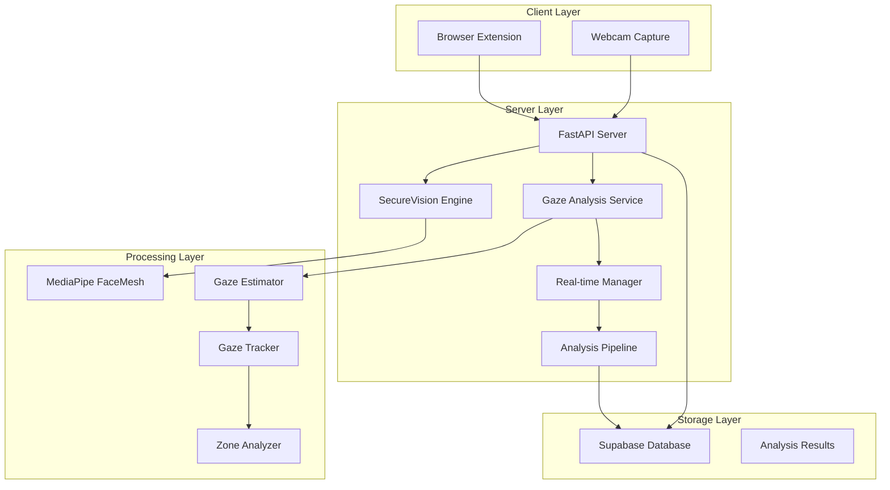
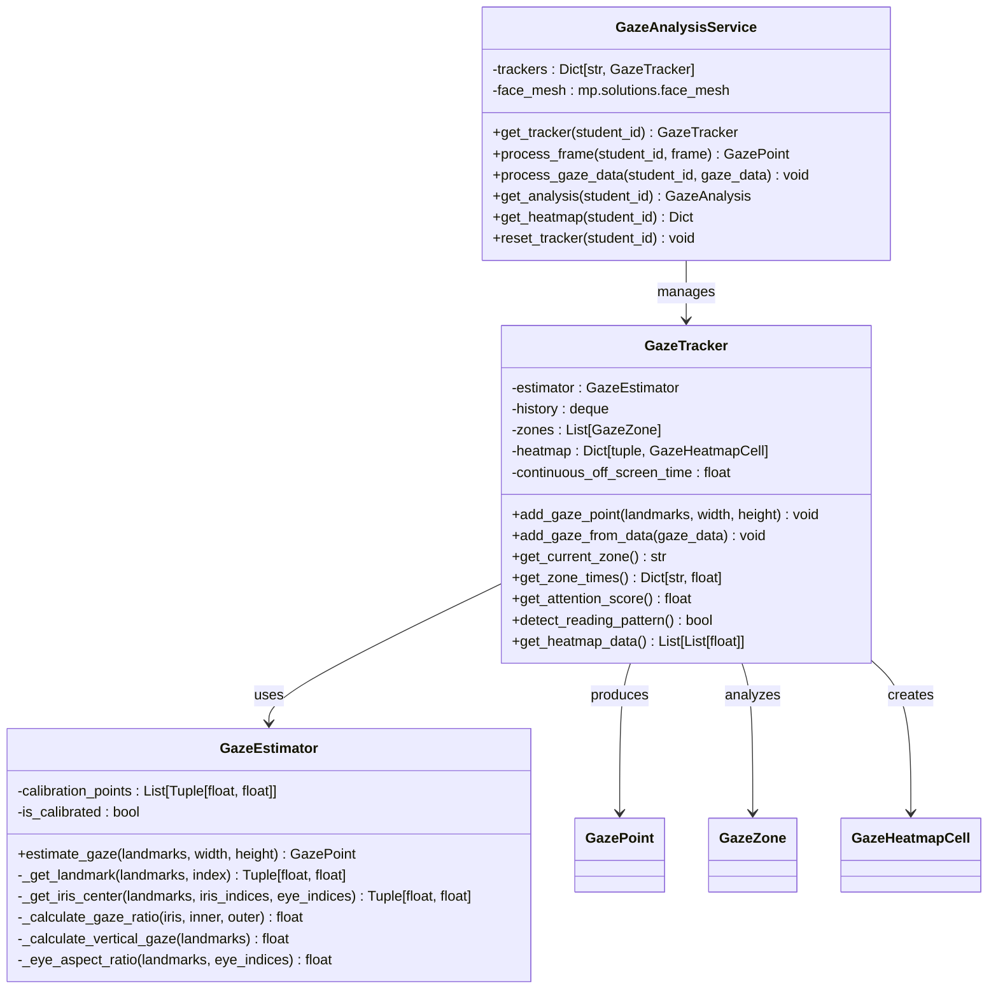
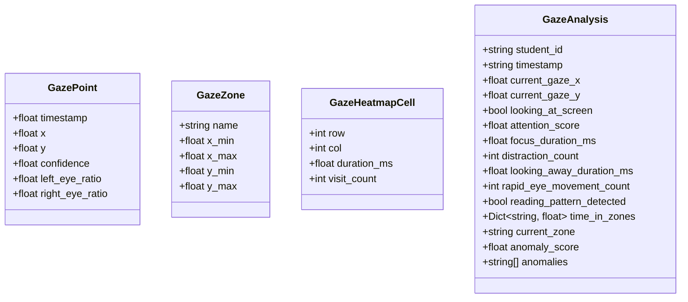
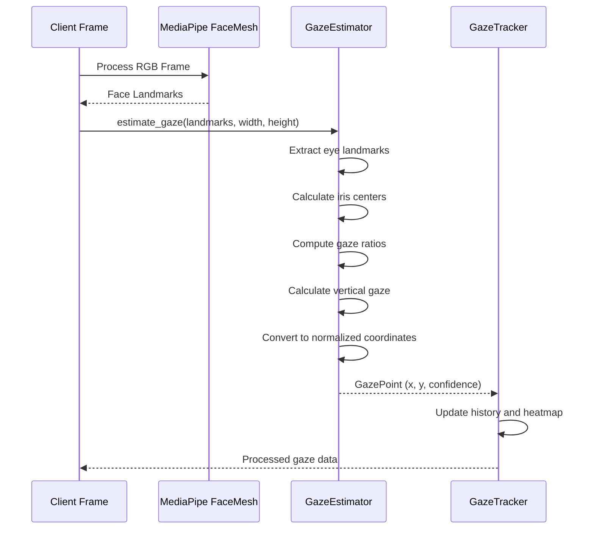
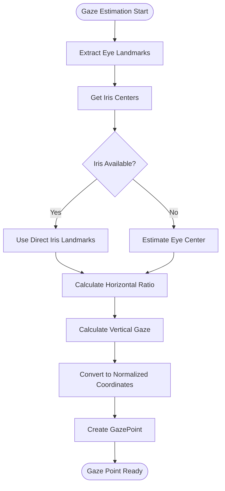
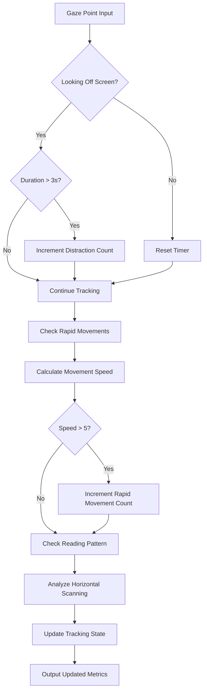
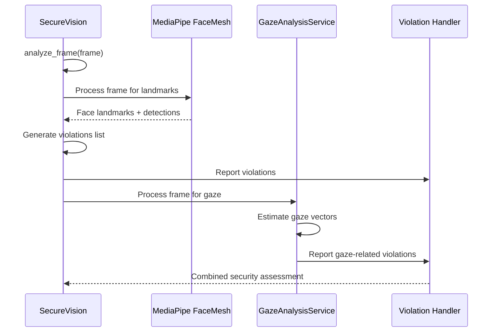

# Gaze Tracking System

<cite>
**Referenced Files in This Document**
- [gaze_tracking.py](file://server/services/gaze_tracking.py)
- [face_detection.py](file://server/services/face_detection.py)
- [analysis.py](file://server/api/endpoints/analysis.py)
- [main.py](file://server/main.py)
- [realtime.py](file://server/services/realtime.py)
- [pipeline.py](file://server/services/pipeline.py)
- [frame_extractor.py](file://server/services/frame_extractor.py)
- [analysis.py](file://server/models/analysis.py)
</cite>

## Table of Contents
1. [Introduction](#introduction)
2. [System Architecture](#system-architecture)
3. [Core Components](#core-components)
4. [Eye Landmark Analysis Implementation](#eye-landmark-analysis-implementation)
5. [Attention Monitoring Algorithms](#attention-monitoring-algorithms)
6. [Calibration and Coordinate Transformation](#calibration-and-coordinate-transformation)
7. [Integration with Face Detection](#integration-with-face-detection)
8. [Temporal Consistency and Noise Filtering](#temporal-consistency-and-noise-filtering)
9. [Practical Examples](#practical-examples)
10. [Performance Considerations](#performance-considerations)
11. [Troubleshooting Guide](#troubleshooting-guide)
12. [Conclusion](#conclusion)

## Introduction

The ExamGuard Pro Gaze Tracking System provides comprehensive eye movement analysis and attention monitoring for secure exam environments. This system implements real-time gaze estimation using MediaPipe FaceMesh landmarks, enabling precise detection of looking-away-from-screen scenarios and establishment of violation thresholds for academic integrity enforcement.

The system operates entirely on-device without external API dependencies, ensuring privacy and reliability. It combines advanced computer vision techniques with sophisticated temporal analysis to provide robust attention monitoring capabilities suitable for high-stakes examination scenarios.

## System Architecture

The gaze tracking system follows a modular architecture with clear separation of concerns:



**Diagram sources**
- [main.py:118-132](file://server/main.py#L118-L132)
- [gaze_tracking.py:471-535](file://server/services/gaze_tracking.py#L471-L535)
- [face_detection.py:27-62](file://server/services/face_detection.py#L27-L62)

The architecture consists of several key layers:

1. **Client Layer**: Browser extension and webcam capture modules
2. **Server Layer**: FastAPI application with integrated vision and gaze services
3. **Processing Layer**: MediaPipe-based face mesh processing and gaze estimation
4. **Storage Layer**: Supabase database integration for persistent analysis results

## Core Components

### Gaze Analysis Service

The central component responsible for managing gaze tracking across multiple students:



**Diagram sources**
- [gaze_tracking.py:471-535](file://server/services/gaze_tracking.py#L471-L535)
- [gaze_tracking.py:268-465](file://server/services/gaze_tracking.py#L268-L465)
- [gaze_tracking.py:113-262](file://server/services/gaze_tracking.py#L113-L262)

### Data Models

The system defines several key data structures for representing gaze analysis results:



**Diagram sources**
- [gaze_tracking.py:49-107](file://server/services/gaze_tracking.py#L49-L107)

**Section sources**
- [gaze_tracking.py:471-611](file://server/services/gaze_tracking.py#L471-L611)

## Eye Landmark Analysis Implementation

### MediaPipe FaceMesh Integration

The system leverages MediaPipe FaceMesh for accurate eye landmark detection and analysis. The implementation utilizes both eye contour points and iris landmarks for comprehensive gaze estimation:



**Diagram sources**
- [gaze_tracking.py:500-535](file://server/services/gaze_tracking.py#L500-L535)
- [gaze_tracking.py:123-178](file://server/services/gaze_tracking.py#L123-L178)

### Pupil Detection and Eye Region Segmentation

The system implements sophisticated pupil detection using MediaPipe's refined landmarks:

**Eye Landmark Indices Configuration:**
- **Left Eye**: 16-point contour with specific indices for medial and lateral canthi
- **Right Eye**: Mirror configuration for symmetrical analysis
- **Iris Landmarks**: 4-point iris representation when available
- **Eye Corners**: Critical for horizontal gaze ratio calculation

**Pupil Detection Algorithm:**
1. **Primary Method**: Direct iris landmark averaging when available
2. **Fallback Method**: Eye contour center estimation using all 16 eye points
3. **Robust Estimation**: Handles partial occlusions and varying lighting conditions

**Section sources**
- [gaze_tracking.py:28-43](file://server/services/gaze_tracking.py#L28-L43)
- [gaze_tracking.py:185-201](file://server/services/gaze_tracking.py#L185-L201)

### Gaze Vector Calculation

The system calculates gaze vectors through a multi-stage process:



**Diagram sources**
- [gaze_tracking.py:123-178](file://server/services/gaze_tracking.py#L123-L178)
- [gaze_tracking.py:202-262](file://server/services/gaze_tracking.py#L202-L262)

**Section sources**
- [gaze_tracking.py:123-262](file://server/services/gaze_tracking.py#L123-L262)

## Attention Monitoring Algorithms

### Looking Away Detection

The system implements multiple algorithms to detect when a student looks away from the screen:

**Threshold-Based Detection:**
- **Horizontal Threshold**: |x| > 0.8 indicates looking away horizontally
- **Vertical Threshold**: |y| > 0.8 indicates looking away vertically
- **Extended Duration**: Continuous looking away > 3 seconds triggers distraction counter

**Suspicious Pattern Detection:**
- **Rapid Eye Movements**: Speed > 5 units per millisecond indicates suspicious saccades
- **Reading Pattern Analysis**: Detects horizontal scanning patterns typical of reading
- **Zone Analysis**: Maps gaze to predefined screen zones (center, top/bottom regions)



**Diagram sources**
- [gaze_tracking.py:345-373](file://server/services/gaze_tracking.py#L345-L373)
- [gaze_tracking.py:432-454](file://server/services/gaze_tracking.py#L432-L454)

**Section sources**
- [gaze_tracking.py:345-454](file://server/services/gaze_tracking.py#L345-L454)

### Attention Score Calculation

The system computes comprehensive attention scores combining multiple factors:

**Score Components:**
1. **Zone Time Analysis**: Time spent in center vs. peripheral zones
2. **Distraction Penalties**: Deductions for looking away incidents
3. **Rapid Movement Penalties**: Small deductions for excessive eye movements
4. **Reading Pattern Validation**: Confirms legitimate reading behavior

**Formula Implementation:**
```
Attention Score = 100 × (Center Time / Total Time) 
                 - 50 × (Off-Screen Time / Total Time)
                 - Distraction Penalty × 5
                 - Rapid Movement Penalty × 2
```

**Section sources**
- [gaze_tracking.py:407-431](file://server/services/gaze_tracking.py#L407-L431)

## Calibration and Coordinate Transformation

### Coordinate System Setup

The system establishes a normalized coordinate system for consistent gaze analysis:

**Coordinate System:**
- **Range**: x ∈ [-1, 1], y ∈ [-1, 1]
- **Origin**: Screen center (0, 0)
- **Axes**: 
  - x-axis: Left (-1) to Right (1)
  - y-axis: Top (-1) to Bottom (1)

**Transformation Process:**
1. **Raw Landmark Coordinates**: Normalized [0, 1] from MediaPipe
2. **Eye Ratio Calculation**: Horizontal/vertical ratios based on eye geometry
3. **Normalized Gaze Coordinates**: Final [-1, 1] range for consistent analysis

### Calibration Procedures

**Current Implementation Status:**
The system includes calibration infrastructure but does not implement active calibration procedures in the current codebase. The calibration framework supports:

- **Calibration Point Storage**: Collection of reference points
- **Calibration State Management**: Tracking calibration completion
- **Future Enhancement**: Planned integration for improved accuracy

**Section sources**
- [gaze_tracking.py:119-121](file://server/services/gaze_tracking.py#L119-L121)
- [gaze_tracking.py:185-201](file://server/services/gaze_tracking.py#L185-L201)

## Integration with Face Detection

### Multi-Modal Security Approach

The gaze tracking system integrates seamlessly with face detection for comprehensive exam monitoring:



**Diagram sources**
- [face_detection.py:64-103](file://server/services/face_detection.py#L64-L103)
- [gaze_tracking.py:499-535](file://server/services/gaze_tracking.py#L499-L535)

### Violation Thresholds

**Integrated Violation Detection:**
- **Face Absent Violations**: Extended periods without face detection
- **Multiple Faces Detected**: Indicates potential cheating scenarios
- **Looking Away Thresholds**: Combined with face detection results
- **Suspicious Gaze Patterns**: Rapid movements and abnormal behavior

**Section sources**
- [face_detection.py:64-126](file://server/services/face_detection.py#L64-L126)
- [gaze_tracking.py:558-580](file://server/services/gaze_tracking.py#L558-L580)

## Temporal Consistency and Noise Filtering

### History Management

The system maintains comprehensive temporal analysis through sophisticated history management:

**Deque-Based History:**
- **Maximum Size**: Configurable history length (default: 300 samples)
- **Temporal Smoothing**: Averages recent measurements for stability
- **Pattern Recognition**: Analyzes trends over time windows

**Noise Filtering Techniques:**
1. **Spatial Averaging**: Multiple consecutive frames averaged
2. **Temporal Thresholding**: Minimum time gaps between significant changes
3. **Velocity Filtering**: Limits maximum gaze velocity to realistic bounds
4. **Outlier Detection**: Identifies and handles extreme outliers

### Heatmap Generation

The system creates attention heatmaps for visual analysis:

**Grid Configuration:**
- **Resolution**: 10×10 grid covering normalized screen space
- **Duration Tracking**: Accumulates dwell time per grid cell
- **Normalization**: Scales durations relative to maximum exposure

**Section sources**
- [gaze_tracking.py:273-294](file://server/services/gaze_tracking.py#L273-L294)
- [gaze_tracking.py:324-344](file://server/services/gaze_tracking.py#L324-L344)
- [gaze_tracking.py:455-464](file://server/services/gaze_tracking.py#L455-L464)

## Practical Examples

### Example 1: Basic Gaze Estimation Workflow

**Implementation Path**: [gaze_tracking.py:500-535](file://server/services/gaze_tracking.py#L500-L535)

This example demonstrates the complete gaze estimation process from frame input to analysis output:

1. **Frame Processing**: MediaPipe FaceMesh analysis
2. **Landmark Extraction**: Eye and iris landmark identification
3. **Gaze Calculation**: Vector computation and normalization
4. **Result Integration**: Analysis service coordination

### Example 2: Attention Score Calculation

**Implementation Path**: [gaze_tracking.py:407-431](file://server/services/gaze_tracking.py#L407-L431)

The attention scoring system combines multiple metrics:

1. **Zone Analysis**: Time distribution across screen regions
2. **Violation Accounting**: Distraction and anomaly penalties
3. **Normalization**: Scaling to 0-100 range

### Example 3: Violation Triggering Mechanisms

**Implementation Path**: [gaze_tracking.py:558-580](file://server/services/gaze_tracking.py#L558-L580)

The system implements hierarchical violation detection:

1. **Excessive Distractions**: >5 looking-away incidents
2. **Suspicious Eye Movements**: >20 rapid movements
3. **Extended Looking Away**: >5 second continuous absence
4. **Current Screen Status**: Immediate looking-away detection

**Section sources**
- [gaze_tracking.py:500-580](file://server/services/gaze_tracking.py#L500-L580)

## Performance Considerations

### Real-Time Processing Optimizations

**Frame Rate Management:**
- **Processing Interval**: Strategic delays between analysis cycles
- **Memory Management**: Efficient deque-based history storage
- **CPU Utilization**: Optimized MediaPipe configuration

**Resource Optimization Strategies:**
1. **Selective Processing**: Only process frames when face is detected
2. **History Windowing**: Limit analysis to recent temporal context
3. **Threshold Pruning**: Early exit for invalid or low-confidence frames

### Accuracy Enhancement Techniques

**Robustness Improvements:**
- **Multi-Frame Averaging**: Reduces noise through temporal smoothing
- **Fallback Mechanisms**: Iris landmarks fallback to eye contours
- **Adaptive Thresholds**: Dynamic adjustment based on lighting conditions

**Challenging Condition Handling:**
- **Low Light Adaptation**: Enhanced EAR calculation for dim conditions
- **Partial Occlusion Recovery**: Maintains tracking during brief obstructions
- **Head Pose Tolerance**: Accommodates natural head movements

## Troubleshooting Guide

### Common Issues and Solutions

**MediaPipe Not Available:**
- **Symptom**: Gaze tracking disabled with warning message
- **Solution**: Install MediaPipe package or verify Python environment
- **Impact**: Face detection continues, but gaze analysis unavailable

**Frame Processing Failures:**
- **Symptom**: Empty results or processing errors
- **Causes**: Invalid frame data, insufficient lighting, poor camera quality
- **Prevention**: Validate input frames before processing

**Accuracy Degradation:**
- **Symptoms**: Erratic gaze tracking, frequent false positives
- **Solutions**: Adjust lighting conditions, improve camera positioning, update MediaPipe models

### Debugging Tools

**Logging and Monitoring:**
- **Error Messages**: Comprehensive logging for troubleshooting
- **Performance Metrics**: Frame processing times and success rates
- **State Tracking**: Current system status and configuration

**Section sources**
- [gaze_tracking.py:16-21](file://server/services/gaze_tracking.py#L16-L21)
- [gaze_tracking.py:176-178](file://server/services/gaze_tracking.py#L176-L178)

## Conclusion

The ExamGuard Pro Gaze Tracking System represents a comprehensive solution for secure exam monitoring through advanced computer vision techniques. The system successfully integrates MediaPipe FaceMesh technology with sophisticated attention analysis algorithms to provide reliable gaze tracking capabilities.

Key achievements include:

**Technical Excellence:**
- Complete on-device processing eliminating privacy concerns
- Robust multi-modal security approach combining face detection and gaze analysis
- Sophisticated temporal analysis with noise filtering and pattern recognition
- Scalable architecture supporting multiple concurrent students

**Security Impact:**
- Real-time detection of looking-away scenarios with configurable thresholds
- Comprehensive violation tracking and scoring systems
- Integration with broader exam security infrastructure
- Support for both automated and manual intervention

**Future Enhancement Opportunities:**
- Active calibration procedures for improved accuracy
- Machine learning-based anomaly detection
- Enhanced adaptive thresholding for diverse environments
- Expanded integration with additional biometric indicators

The system provides a solid foundation for secure examination environments while maintaining the flexibility needed for evolving security requirements and technological advances.