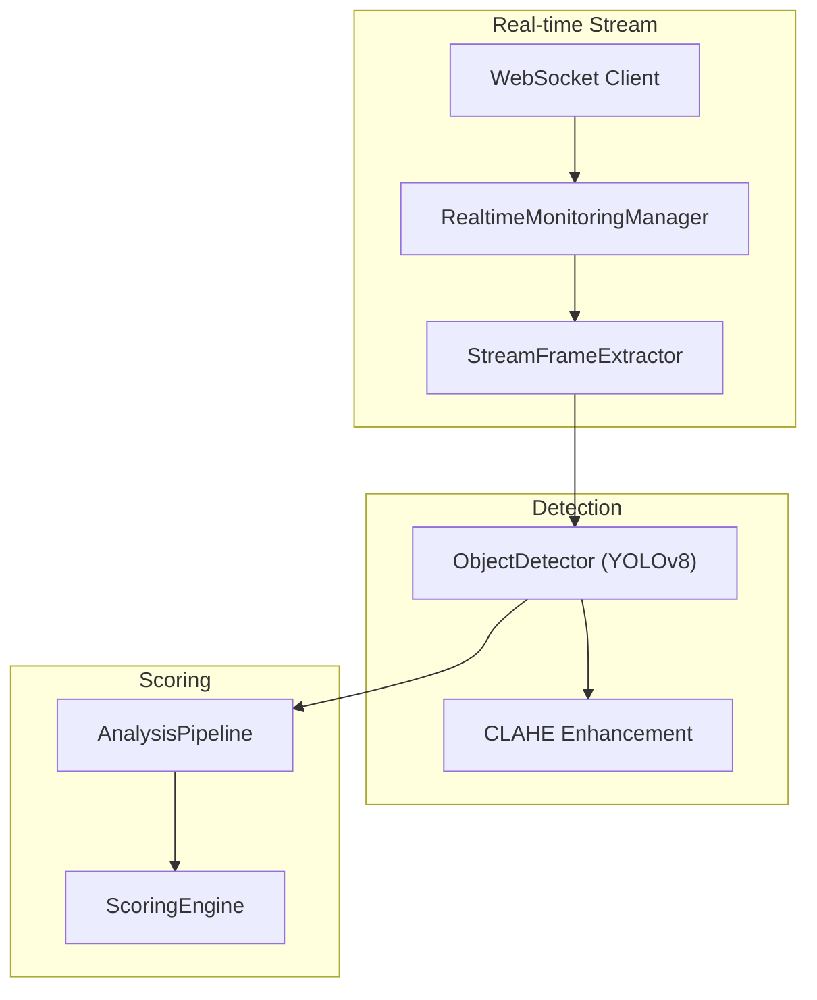
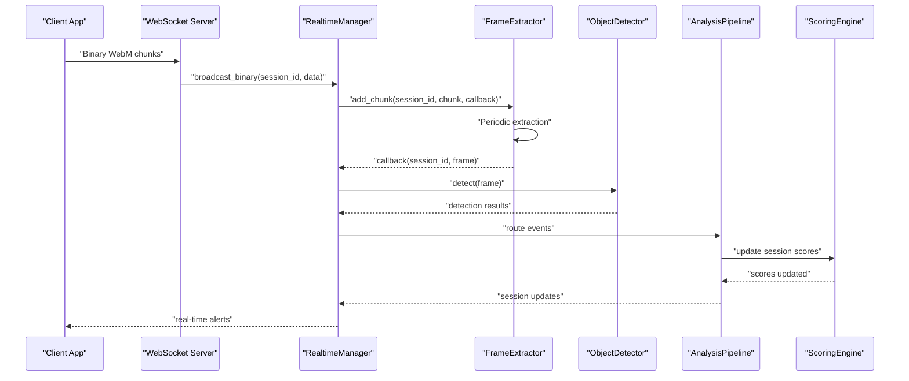
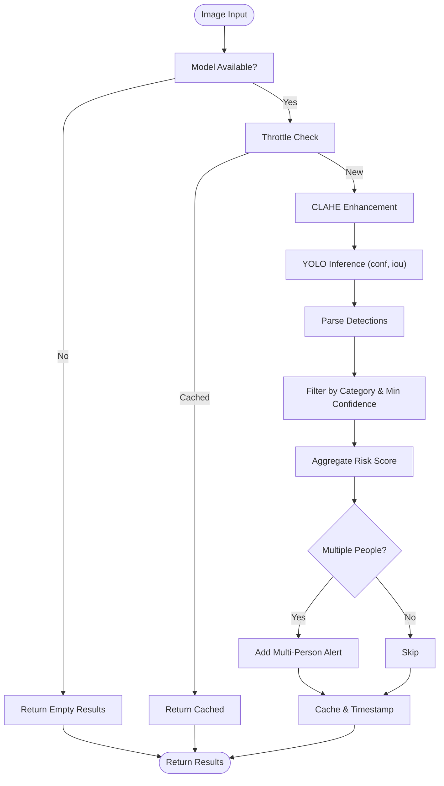
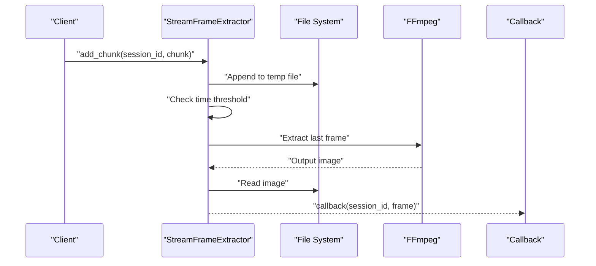
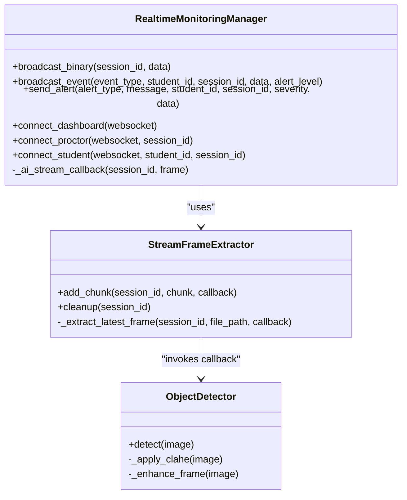
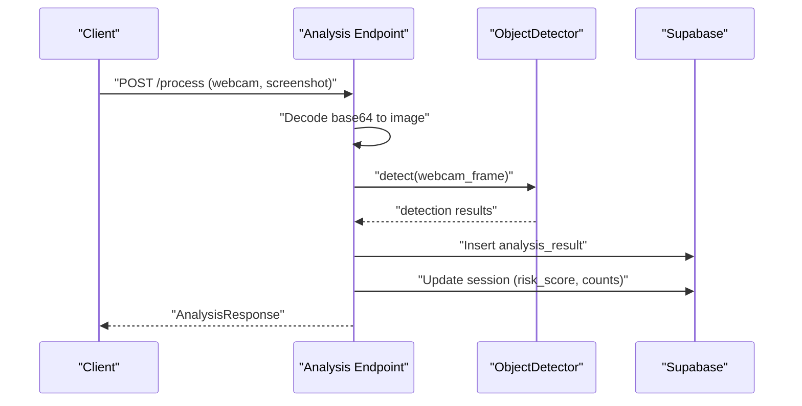
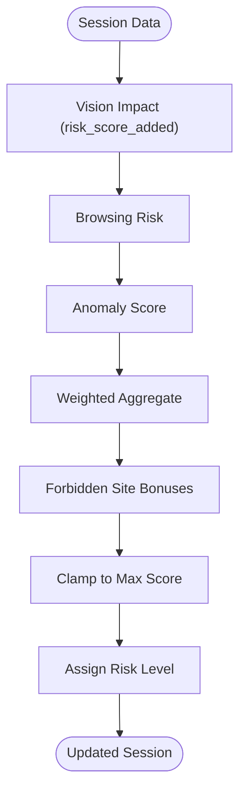
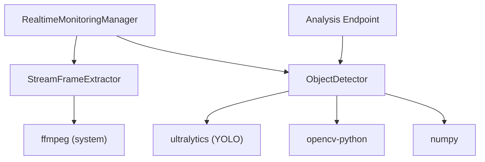

# Object Detection System

<cite>
**Referenced Files in This Document**
- [object_detection.py](file://server/services/object_detection.py)
- [frame_extractor.py](file://server/services/frame_extractor.py)
- [realtime.py](file://server/services/realtime.py)
- [analysis.py](file://server/api/endpoints/analysis.py)
- [main.py](file://server/main.py)
- [engine.py](file://server/scoring/engine.py)
- [pipeline.py](file://server/services/pipeline.py)
- [config.py](file://server/config.py)
- [requirements.txt](file://deployment/requirements.txt)
</cite>

## Table of Contents
1. [Introduction](#introduction)
2. [Project Structure](#project-structure)
3. [Core Components](#core-components)
4. [Architecture Overview](#architecture-overview)
5. [Detailed Component Analysis](#detailed-component-analysis)
6. [Dependency Analysis](#dependency-analysis)
7. [Performance Considerations](#performance-considerations)
8. [Troubleshooting Guide](#troubleshooting-guide)
9. [Conclusion](#conclusion)

## Introduction
This document describes the YOLOv8-powered object detection system used for unauthorized device identification in the ExamGuard Pro platform. The system integrates real-time webcam streams, performs object detection for prohibited items, applies confidence thresholds and non-maximum suppression, and feeds results into a broader risk scoring pipeline. It covers model initialization, preprocessing techniques, inference optimization, detection categories, and integration with frame extraction services and violation scoring mechanisms.

## Project Structure
The object detection system spans several modules:
- Object detection service: YOLO-based inference with preprocessing and post-processing
- Frame extraction: Server-side extraction of frames from live WebM streams
- Real-time monitoring: WebSocket-based broadcast of detections and alerts
- Analysis API: Endpoint that triggers object detection on uploaded images
- Scoring engine: Aggregates detection results into session risk scores
- Pipeline: Asynchronous processing and event routing

**Diagram sources**
- [realtime.py:139-200](file://server/services/realtime.py#L139-L200)
- [frame_extractor.py:45-83](file://server/services/frame_extractor.py#L45-L83)
- [object_detection.py:65-137](file://server/services/object_detection.py#L65-L137)
- [pipeline.py:74-96](file://server/services/pipeline.py#L74-L96)
- [engine.py:417-431](file://server/scoring/engine.py#L417-L431)

**Section sources**
- [object_detection.py:16-42](file://server/services/object_detection.py#L16-L42)
- [frame_extractor.py:10-44](file://server/services/frame_extractor.py#L10-L44)
- [realtime.py:139-200](file://server/services/realtime.py#L139-L200)

## Core Components
- ObjectDetector: Initializes the YOLO model, defines forbidden categories, applies CLAHE preprocessing, runs inference with configurable confidence and IoU thresholds, and aggregates risk scores.
- StreamFrameExtractor: Accumulates WebM chunks and periodically extracts the latest frame for analysis.
- RealtimeMonitoringManager: Bridges WebSocket connections, broadcasts detections, and triggers object detection callbacks during live streams.
- Analysis API: Provides endpoints to process webcam and screenshot images, invoking object detection and updating session risk.
- ScoringEngine: Computes engagement, relevance, effort, and risk metrics, incorporating vision impact and other signals.
- AnalysisPipeline: Asynchronous event routing and session risk updates.

**Section sources**
- [object_detection.py:16-147](file://server/services/object_detection.py#L16-L147)
- [frame_extractor.py:10-115](file://server/services/frame_extractor.py#L10-L115)
- [realtime.py:102-200](file://server/services/realtime.py#L102-L200)
- [analysis.py:57-272](file://server/api/endpoints/analysis.py#L57-L272)
- [engine.py:373-445](file://server/scoring/engine.py#L373-L445)
- [pipeline.py:9-345](file://server/services/pipeline.py#L9-L345)

## Architecture Overview
The system operates in two primary modes:
- Live stream analysis: Frames are extracted from WebM chunks and analyzed in real-time via WebSocket callbacks.
- Batch/image analysis: API endpoints accept base64-encoded images, decode them, and run object detection.

**Diagram sources**
- [realtime.py:310-329](file://server/services/realtime.py#L310-L329)
- [frame_extractor.py:31-44](file://server/services/frame_extractor.py#L31-L44)
- [object_detection.py:65-137](file://server/services/object_detection.py#L65-L137)
- [pipeline.py:74-96](file://server/services/pipeline.py#L74-L96)
- [engine.py:417-431](file://server/scoring/engine.py#L417-L431)

## Detailed Component Analysis

### Object Detection Service
The ObjectDetector encapsulates:
- Model initialization with a YOLOv8 checkpoint
- CLAHE preprocessing for low-light conditions
- Inference with configurable confidence and IoU thresholds
- Post-processing to filter detections by category and confidence
- Risk scoring aggregation for prohibited items

Key behaviors:
- Confidence threshold tuning: Lower base confidence during inference, then apply category-specific minimum confidence thresholds in post-processing
- Non-maximum suppression: Controlled via IoU threshold passed to the model
- Person counting: Separate logic to detect multiple people and add risk
- Caching: Throttles processing frequency and caches results

**Diagram sources**
- [object_detection.py:65-137](file://server/services/object_detection.py#L65-L137)

**Section sources**
- [object_detection.py:16-147](file://server/services/object_detection.py#L16-L147)

### Frame Extraction Service
The StreamFrameExtractor:
- Accumulates WebM chunks into a temporary file per session
- Periodically extracts the latest frame using FFmpeg
- Invokes a callback with the extracted frame for AI analysis
- Manages cleanup of temporary buffers

**Diagram sources**
- [frame_extractor.py:31-83](file://server/services/frame_extractor.py#L31-L83)

**Section sources**
- [frame_extractor.py:10-115](file://server/services/frame_extractor.py#L10-L115)

### Real-time Monitoring Integration
RealtimeMonitoringManager:
- Receives binary WebM chunks via WebSocket
- Delegates to StreamFrameExtractor for frame extraction
- Calls ObjectDetector for detection
- Broadcasts alerts and updates session risk

**Diagram sources**
- [realtime.py:102-200](file://server/services/realtime.py#L102-L200)
- [frame_extractor.py:10-115](file://server/services/frame_extractor.py#L10-L115)
- [object_detection.py:16-147](file://server/services/object_detection.py#L16-L147)

**Section sources**
- [realtime.py:139-200](file://server/services/realtime.py#L139-L200)

### Analysis API Integration
The Analysis API:
- Accepts base64-encoded webcam and screenshot images
- Decodes images and saves to disk
- Runs ObjectDetector on webcam frames
- Updates session risk and broadcasts live frames

**Diagram sources**
- [analysis.py:57-272](file://server/api/endpoints/analysis.py#L57-L272)
- [object_detection.py:65-137](file://server/services/object_detection.py#L65-L137)

**Section sources**
- [analysis.py:57-272](file://server/api/endpoints/analysis.py#L57-L272)

### Scoring Engine Integration
The ScoringEngine:
- Aggregates vision impact from object detection into session risk
- Applies weighted blending across multiple signals
- Updates risk level thresholds and session status

**Diagram sources**
- [engine.py:311-355](file://server/scoring/engine.py#L311-L355)

**Section sources**
- [engine.py:373-445](file://server/scoring/engine.py#L373-L445)

## Dependency Analysis
External dependencies include:
- Ultralytics YOLO for object detection
- OpenCV for image processing and CLAHE
- NumPy for numerical operations
- FFmpeg for server-side frame extraction from WebM streams

**Diagram sources**
- [requirements.txt:11-21](file://deployment/requirements.txt#L11-L21)
- [object_detection.py:8-14](file://server/services/object_detection.py#L8-L14)
- [frame_extractor.py:51-66](file://server/services/frame_extractor.py#L51-L66)

**Section sources**
- [requirements.txt:11-21](file://deployment/requirements.txt#L11-L21)

## Performance Considerations
- Inference throttling: The ObjectDetector caches results and limits processing frequency to reduce CPU/GPU load.
- Preprocessing: CLAHE enhances low-light visibility, improving detection reliability without heavy computation.
- Confidence/IoU tuning: Lower base confidence during inference reduces missed detections; post-processing filters with category-specific thresholds balances precision and recall.
- Frame extraction: Server-side extraction avoids client-side CPU spikes by offloading to background threads.
- Asynchronous pipeline: Events are processed asynchronously to prevent blocking the main thread.

[No sources needed since this section provides general guidance]

## Troubleshooting Guide
Common issues and resolutions:
- YOLO import failure: The detector gracefully falls back to returning empty results when the YOLO module is unavailable.
- CLAHE failures: Exceptions during CLAHE are caught and logged, with the original image returned.
- FFmpeg not found: If FFmpeg is missing, extraction fails early with a clear error message; ensure the executable is installed and discoverable.
- WebSocket disconnections: The system cleans up session buffers and removes stale connections.
- Risk score inconsistencies: Verify that vision impact contributions are properly accumulated and that forbidden site bonuses are applied.

**Section sources**
- [object_detection.py:18-21](file://server/services/object_detection.py#L18-L21)
- [object_detection.py:61-63](file://server/services/object_detection.py#L61-L63)
- [frame_extractor.py:86-89](file://server/services/frame_extractor.py#L86-L89)
- [realtime.py:297-309](file://server/services/realtime.py#L297-L309)

## Conclusion
The object detection system integrates YOLOv8 with robust preprocessing, configurable thresholds, and real-time streaming capabilities. It feeds detection results into a comprehensive scoring pipeline, enabling accurate and timely identification of unauthorized devices and suspicious activities. The modular design supports both live streams and batch processing, with caching and asynchronous processing to maintain performance under real-time constraints.