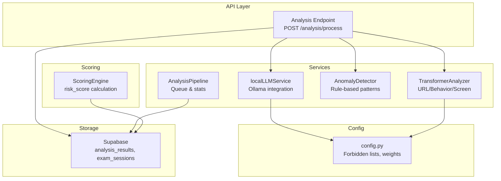
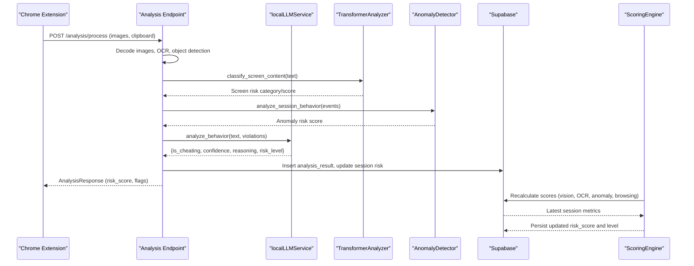
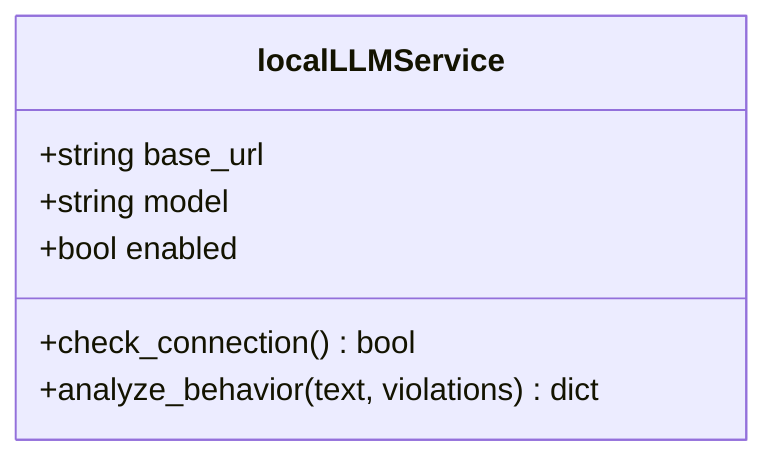
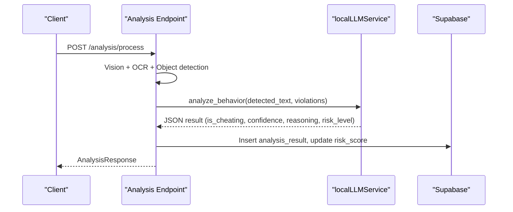
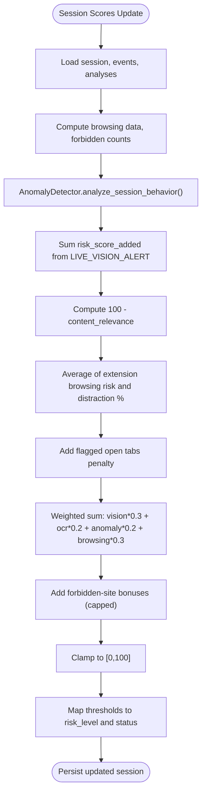
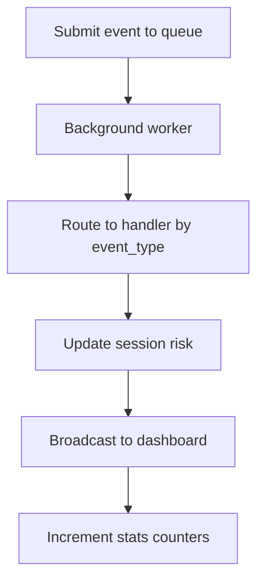
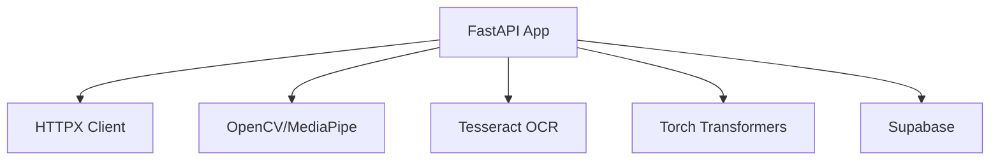

# LLM-Based Contextual Analysis

<cite>
**Referenced Files in This Document**
- [llm.py](file://server/services/llm.py)
- [analysis.py](file://server/api/endpoints/analysis.py)
- [analysis.py](file://server/models/analysis.py)
- [engine.py](file://server/scoring/engine.py)
- [config.py](file://server/config.py)
- [transformer_analysis.py](file://server/services/transformer_analysis.py)
- [analysis.py](file://server/api/schemas/analysis.py)
- [anomaly.py](file://server/services/anomaly.py)
- [pipeline.py](file://server/services/pipeline.py)
- [requirements.txt](file://server/requirements.txt)
- [requirements.txt](file://transformer/requirements.txt)
</cite>

## Table of Contents
1. [Introduction](#introduction)
2. [Project Structure](#project-structure)
3. [Core Components](#core-components)
4. [Architecture Overview](#architecture-overview)
5. [Detailed Component Analysis](#detailed-component-analysis)
6. [Dependency Analysis](#dependency-analysis)
7. [Performance Considerations](#performance-considerations)
8. [Troubleshooting Guide](#troubleshooting-guide)
9. [Conclusion](#conclusion)

## Introduction
This document explains the LLM-based contextual analysis services powering ExamGuard Pro’s academic integrity monitoring. It covers how the system integrates a local LLM (via Ollama) to assess suspicious student behavior beyond keyword matching, using prompt engineering, structured JSON responses, and risk-aware decision-making. It also documents complementary transformer-based models, scoring mechanisms, and operational safeguards such as connection checks, timeouts, and graceful fallbacks.

## Project Structure
The LLM integration resides in the backend service layer and is orchestrated by the analysis pipeline and scoring engine. Key areas:
- LLM service: localLLMService encapsulates Ollama connectivity and prompt-driven analysis.
- API layer: endpoints orchestrate multi-modal analysis and optionally invoke LLM.
- Scoring engine: computes session-level risk scores incorporating LLM signals.
- Configuration: defines forbidden lists, URL categories, and risk weights.
- Transformers: provide complementary contextual classifiers for URLs, behavior, and screen content.
- Pipeline: queues and processes real-time events, updating session risk continuously.

**Diagram sources**
- [analysis.py:57-272](file://server/api/endpoints/analysis.py#L57-L272)
- [llm.py:10-77](file://server/services/llm.py#L10-L77)
- [transformer_analysis.py:178-549](file://server/services/transformer_analysis.py#L178-L549)
- [anomaly.py:11-221](file://server/services/anomaly.py#L11-L221)
- [engine.py:373-445](file://server/scoring/engine.py#L373-L445)
- [config.py:58-205](file://server/config.py#L58-L205)
- [pipeline.py:9-345](file://server/services/pipeline.py#L9-L345)

**Section sources**
- [analysis.py:57-272](file://server/api/endpoints/analysis.py#L57-L272)
- [llm.py:10-77](file://server/services/llm.py#L10-L77)
- [engine.py:373-445](file://server/scoring/engine.py#L373-L445)
- [config.py:58-205](file://server/config.py#L58-L205)
- [transformer_analysis.py:178-549](file://server/services/transformer_analysis.py#L178-L549)
- [anomaly.py:11-221](file://server/services/anomaly.py#L11-L221)
- [pipeline.py:9-345](file://server/services/pipeline.py#L9-L345)

## Core Components
- Local LLM Service: Provides asynchronous connectivity checks and behavior analysis using a structured prompt returning JSON with cheating determination, confidence, reasoning, and risk level.
- Analysis Endpoint: Coordinates webcam/screen OCR, object/vision detection, optional LLM analysis, and updates session risk.
- Scoring Engine: Aggregates vision, OCR, anomaly, and browsing signals into a unified risk score with thresholds mapped to risk levels.
- Configuration: Defines forbidden keywords, URL categories, and risk weights influencing scoring.
- Transformer Analyzer: Offers URL classification, behavioral anomaly detection, and screen content risk classification as alternatives or complements to LLM.
- Analysis Pipeline: Asynchronous queueing of events, continuous risk updates, and real-time dashboard broadcasting.

**Section sources**
- [llm.py:10-77](file://server/services/llm.py#L10-L77)
- [analysis.py:57-272](file://server/api/endpoints/analysis.py#L57-L272)
- [engine.py:311-355](file://server/scoring/engine.py#L311-L355)
- [config.py:58-205](file://server/config.py#L58-L205)
- [transformer_analysis.py:178-549](file://server/services/transformer_analysis.py#L178-L549)
- [pipeline.py:9-345](file://server/services/pipeline.py#L9-L345)

## Architecture Overview
The LLM-based contextual analysis participates in a multi-modal pipeline:
- Data ingestion via the analysis endpoint (webcam, screenshots, clipboard).
- Optional LLM reasoning enriches the analysis with semantic interpretation of OCR text and detected violations.
- Results are persisted and used by the scoring engine to compute session risk.
- The pipeline continuously updates risk levels and pushes real-time notifications.

**Diagram sources**
- [analysis.py:57-272](file://server/api/endpoints/analysis.py#L57-L272)
- [llm.py:28-71](file://server/services/llm.py#L28-L71)
- [transformer_analysis.py:474-523](file://server/services/transformer_analysis.py#L474-L523)
- [anomaly.py:23-165](file://server/services/anomaly.py#L23-L165)
- [engine.py:410-432](file://server/scoring/engine.py#L410-L432)

## Detailed Component Analysis

### Local LLM Service
The localLLMService encapsulates:
- Connection health checks against Ollama.
- Prompt construction embedding OCR text and detected violations.
- Structured JSON response parsing for is_cheating, confidence, reasoning, and risk_level.
- Graceful fallbacks when Ollama is unreachable.

**Diagram sources**
- [llm.py:10-77](file://server/services/llm.py#L10-L77)

**Section sources**
- [llm.py:10-77](file://server/services/llm.py#L10-L77)

### Analysis Endpoint Orchestration
The analysis endpoint:
- Validates session existence.
- Performs webcam and screen processing (vision, OCR, object detection).
- Optionally invokes LLM behavior analysis.
- Updates session risk and broadcasts live frames to the dashboard.

**Diagram sources**
- [analysis.py:57-272](file://server/api/endpoints/analysis.py#L57-L272)
- [llm.py:28-71](file://server/services/llm.py#L28-L71)

**Section sources**
- [analysis.py:57-272](file://server/api/endpoints/analysis.py#L57-L272)

### Scoring Engine Integration
The ScoringEngine aggregates:
- Vision impact from live alerts.
- OCR-derived content relevance (inverted to risk).
- Anomaly detection risk.
- Browsing distraction and flagged tabs.
- Applies weighted aggregation and capped thresholds to derive risk_score and risk_level.

**Diagram sources**
- [engine.py:311-355](file://server/scoring/engine.py#L311-L355)
- [engine.py:410-432](file://server/scoring/engine.py#L410-L432)

**Section sources**
- [engine.py:311-355](file://server/scoring/engine.py#L311-L355)
- [engine.py:410-432](file://server/scoring/engine.py#L410-L432)

### Configuration and Safety Filters
Key configuration impacting LLM and contextual analysis:
- Forbidden keywords and URL categories guide OCR and URL classification.
- Risk weights influence how individual events contribute to risk.
- Thresholds define safe/review/suspicious risk levels.

Operational safeguards:
- LLM connection checks with short timeouts.
- Graceful handling of missing models or network failures.
- Non-blocking writes to Supabase and live WebSocket updates.

**Section sources**
- [config.py:58-205](file://server/config.py#L58-L205)
- [llm.py:16-26](file://server/services/llm.py#L16-L26)
- [analysis.py:182-195](file://server/api/endpoints/analysis.py#L182-L195)

### Transformer-Based Contextual Analysis (Complementary)
While the LLM focuses on textual reasoning, transformers provide:
- URL classification with risk scores.
- Behavioral anomaly detection from event sequences.
- Screen content risk classification for OCR text.

These outputs complement LLM insights and can act as fallbacks when the LLM is unavailable.

**Section sources**
- [transformer_analysis.py:178-549](file://server/services/transformer_analysis.py#L178-L549)

### Real-Time Pipeline and Risk Updates
The AnalysisPipeline:
- Queues events and processes them asynchronously.
- Updates session risk after each event.
- Pushes real-time updates to the dashboard via WebSocket.

**Diagram sources**
- [pipeline.py:55-345](file://server/services/pipeline.py#L55-L345)

**Section sources**
- [pipeline.py:9-345](file://server/services/pipeline.py#L9-L345)

## Dependency Analysis
External dependencies supporting LLM and contextual analysis:
- FastAPI and HTTP clients for API orchestration.
- OpenCV and MediaPipe for vision processing.
- Tesseract for OCR.
- Torch-based transformers for specialized classification.
- Supabase for persistence and real-time.

**Diagram sources**
- [requirements.txt:1-34](file://server/requirements.txt#L1-L34)
- [requirements.txt:1-8](file://transformer/requirements.txt#L1-L8)

**Section sources**
- [requirements.txt:1-34](file://server/requirements.txt#L1-L34)
- [requirements.txt:1-8](file://transformer/requirements.txt#L1-L8)

## Performance Considerations
- LLM latency: The service enforces a strict timeout for LLM requests and falls back gracefully when Ollama is unreachable.
- Queueing: The pipeline processes events asynchronously to avoid blocking the main request thread.
- Model availability: Transformer models are loaded lazily and disabled when checkpoints are missing; rule-based fallbacks ensure continuity.
- Risk computation: Scoring uses lightweight aggregations and clamping to maintain responsiveness.

[No sources needed since this section provides general guidance]

## Troubleshooting Guide
Common issues and resolutions:
- LLM not reachable: The service checks Ollama tags endpoint and disables LLM analysis if unreachable. Verify Ollama is running and the base URL is correct.
- Empty or short OCR text: The pipeline skips transformer analysis when text length is below a threshold.
- Supabase write failures: The analysis endpoint logs and continues; ensure credentials and schema alignment.
- WebSocket push errors: The pipeline logs and continues; verify real-time manager configuration.

**Section sources**
- [llm.py:16-26](file://server/services/llm.py#L16-L26)
- [analysis.py:105-106](file://server/api/endpoints/analysis.py#L105-L106)
- [pipeline.py:306-335](file://server/services/pipeline.py#L306-L335)

## Conclusion
ExamGuard Pro augments keyword-based detection with LLM-driven contextual reasoning and complementary transformer models. The local LLM service integrates seamlessly into the analysis pipeline, providing structured assessments of suspicious behavior grounded in OCR text and detected violations. These insights feed the ScoringEngine to compute session risk, enabling automated decisions and real-time alerts. Robust configuration, safety filters, and fallbacks ensure reliable operation across diverse environments.