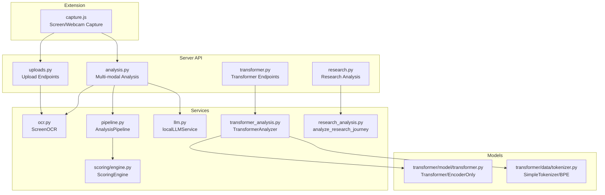
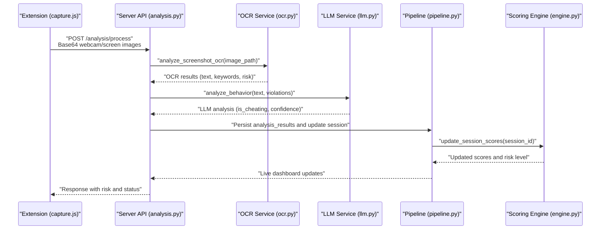
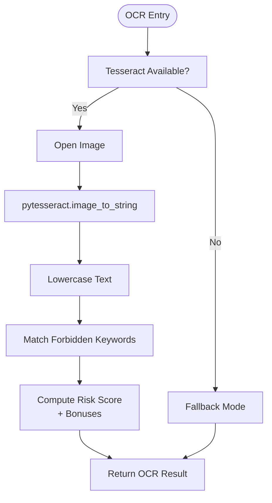
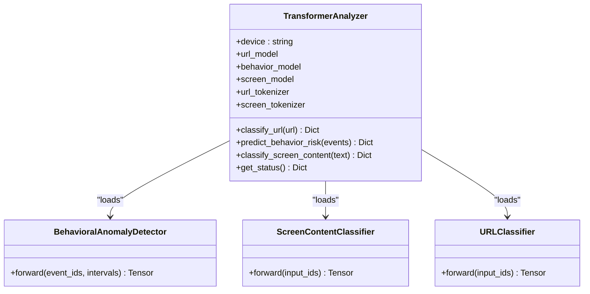
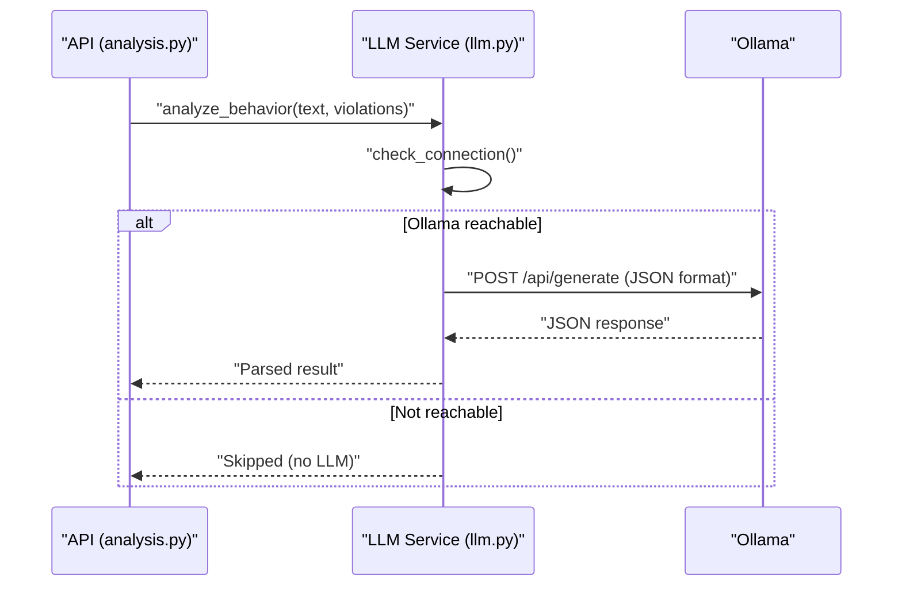
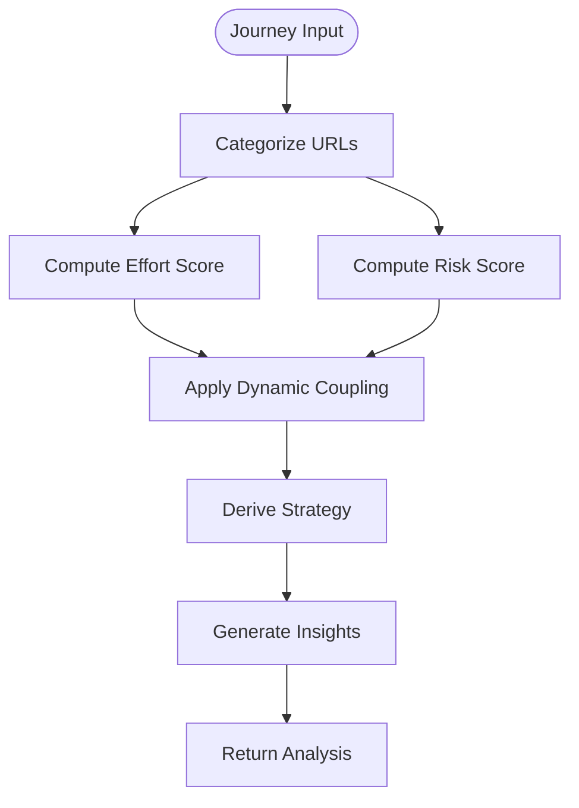
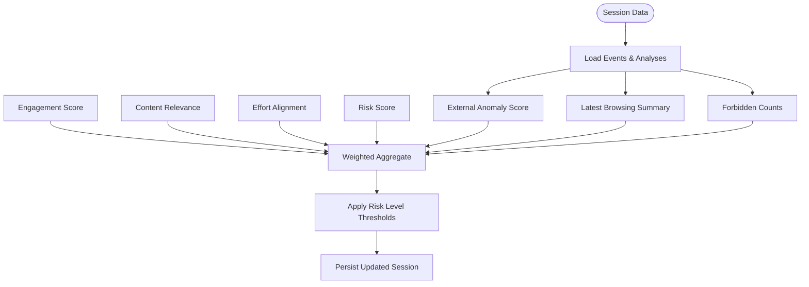
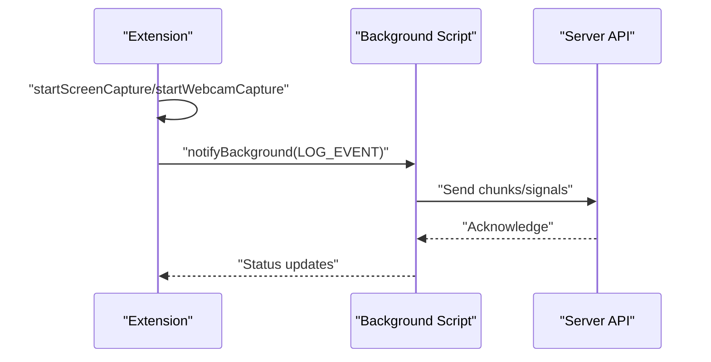
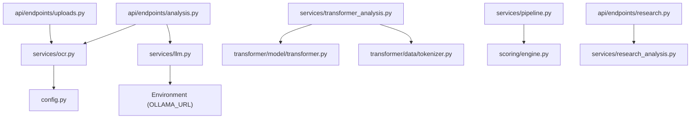

# NLP & Text Analysis Services

<cite>
**Referenced Files in This Document**
- [config.py](file://server/config.py)
- [ocr.py](file://server/services/ocr.py)
- [transformer_analysis.py](file://server/services/transformer_analysis.py)
- [llm.py](file://server/services/llm.py)
- [research_analysis.py](file://server/services/research_analysis.py)
- [pipeline.py](file://server/services/pipeline.py)
- [analysis.py](file://server/api/endpoints/analysis.py)
- [transformer.py](file://transformer/model/transformer.py)
- [tokenizer.py](file://transformer/data/tokenizer.py)
- [analysis.py](file://server/api/endpoints/analysis.py)
- [research.py](file://server/api/endpoints/research.py)
- [uploads.py](file://server/api/endpoints/uploads.py)
- [engine.py](file://server/scoring/engine.py)
- [capture.js](file://extension/capture.js)
</cite>

## Table of Contents
1. [Introduction](#introduction)
2. [Project Structure](#project-structure)
3. [Core Components](#core-components)
4. [Architecture Overview](#architecture-overview)
5. [Detailed Component Analysis](#detailed-component-analysis)
6. [Dependency Analysis](#dependency-analysis)
7. [Performance Considerations](#performance-considerations)
8. [Troubleshooting Guide](#troubleshooting-guide)
9. [Conclusion](#conclusion)
10. [Appendices](#appendices)

## Introduction
This document describes the NLP and text analysis services powering ExamGuard Pro’s content monitoring and plagiarism detection capabilities. It covers:
- Tesseract OCR for extracting text from screen captures and images, including preprocessing and risk scoring
- Transformer-based text classification for URL risk, behavioral anomalies, and screen content risk
- Local LLM integration for contextual analysis and violation assessment
- Research analysis services for academic integrity and content authenticity
- Configuration options, thresholds, and performance tuning parameters
- Integration with the AI pipeline and risk scoring algorithms

## Project Structure
The NLP/text analysis stack spans backend services, APIs, transformer models, and the extension capture pipeline:
- Server-side services: OCR, transformer analysis, LLM, research analysis, scoring engine, and pipeline orchestration
- Transformer models and tokenizers: encoder-only models for classification and simple tokenizers
- Frontend extension: screen/webcam capture and signaling for live streaming
- APIs: endpoints for uploads, analysis, research, and transformer classification

**Diagram sources**
- [capture.js:1-352](file://extension/capture.js#L1-L352)
- [uploads.py:1-302](file://server/api/endpoints/uploads.py#L1-L302)
- [analysis.py:1-453](file://server/api/endpoints/analysis.py#L1-L453)
- [research.py:1-125](file://server/api/endpoints/research.py#L1-L125)
- [ocr.py:1-121](file://server/services/ocr.py#L1-L121)
- [transformer_analysis.py:1-549](file://server/services/transformer_analysis.py#L1-L549)
- [llm.py:1-78](file://server/services/llm.py#L1-L78)
- [pipeline.py:1-342](file://server/services/pipeline.py#L1-L342)
- [research_analysis.py:1-92](file://server/services/research_analysis.py#L1-L92)
- [engine.py:1-445](file://server/scoring/engine.py#L1-L445)
- [transformer.py:1-606](file://transformer/model/transformer.py#L1-L606)
- [tokenizer.py:1-475](file://transformer/data/tokenizer.py#L1-L475)

**Section sources**
- [config.py:1-205](file://server/config.py#L1-L205)
- [ocr.py:1-121](file://server/services/ocr.py#L1-L121)
- [transformer_analysis.py:1-549](file://server/services/transformer_analysis.py#L1-L549)
- [llm.py:1-78](file://server/services/llm.py#L1-L78)
- [research_analysis.py:1-92](file://server/services/research_analysis.py#L1-L92)
- [pipeline.py:1-342](file://server/services/pipeline.py#L1-L342)
- [analysis.py:1-453](file://server/api/endpoints/analysis.py#L1-L453)
- [transformer.py:1-606](file://transformer/model/transformer.py#L1-L606)
- [tokenizer.py:1-475](file://transformer/data/tokenizer.py#L1-L475)
- [engine.py:1-445](file://server/scoring/engine.py#L1-L445)
- [capture.js:1-352](file://extension/capture.js#L1-L352)

## Core Components
- Tesseract OCR: Extracts text from screenshots and flags forbidden keywords, computes risk contributions
- Transformer Analyzer: URL classification, behavioral anomaly detection, and screen content risk classification
- Local LLM: Contextual analysis and violation assessment using a local Ollama instance
- Research Analysis: Academic integrity checks and browsing strategy analysis
- Scoring Engine: Aggregates evidence into session-level risk, engagement, effort, and relevance scores
- Pipeline: Real-time ingestion and orchestration of analysis events

**Section sources**
- [ocr.py:20-121](file://server/services/ocr.py#L20-L121)
- [transformer_analysis.py:178-549](file://server/services/transformer_analysis.py#L178-L549)
- [llm.py:10-78](file://server/services/llm.py#L10-L78)
- [research_analysis.py:18-92](file://server/services/research_analysis.py#L18-L92)
- [engine.py:373-445](file://server/scoring/engine.py#L373-L445)
- [pipeline.py:9-342](file://server/services/pipeline.py#L9-L342)

## Architecture Overview
The system integrates extension capture, server APIs, and AI services to continuously monitor and assess academic integrity.

**Diagram sources**
- [capture.js:175-203](file://extension/capture.js#L175-L203)
- [analysis.py:57-272](file://server/api/endpoints/analysis.py#L57-L272)
- [ocr.py:99-121](file://server/services/ocr.py#L99-L121)
- [llm.py:28-72](file://server/services/llm.py#L28-L72)
- [pipeline.py:74-96](file://server/services/pipeline.py#L74-L96)
- [engine.py:382-445](file://server/scoring/engine.py#L382-L445)

## Detailed Component Analysis

### Tesseract OCR Implementation
The OCR service extracts text from screenshots and detects forbidden keywords, computing a risk contribution. It gracefully handles missing Tesseract installations with a fallback.

Key behaviors:
- Initializes Tesseract path for Windows
- Performs OCR and lowercases text for keyword matching
- Detects forbidden keywords and computes risk score with bonuses for multiple matches
- Limits returned text length and returns structured results

**Diagram sources**
- [ocr.py:20-84](file://server/services/ocr.py#L20-L84)
- [ocr.py:99-121](file://server/services/ocr.py#L99-L121)

**Section sources**
- [ocr.py:20-121](file://server/services/ocr.py#L20-L121)
- [config.py:58-81](file://server/config.py#L58-L81)
- [config.py:164-189](file://server/config.py#L164-L189)

### Transformer-Based Text Similarity and Classification
The Transformer Analyzer loads three specialized models:
- URL Classifier: Website risk categorization
- Behavioral Anomaly Detector: Event sequence risk classification
- Screen Content Classifier: OCR text risk classification

It dynamically loads models and tokenizers, supports rule-based fallbacks, and returns confidence scores and risk mappings.

**Diagram sources**
- [transformer_analysis.py:178-549](file://server/services/transformer_analysis.py#L178-L549)

**Section sources**
- [transformer_analysis.py:178-549](file://server/services/transformer_analysis.py#L178-L549)
- [transformer.py:17-314](file://transformer/model/transformer.py#L17-L314)
- [tokenizer.py:13-204](file://transformer/data/tokenizer.py#L13-L204)

### Local LLM Integration
The local LLM service communicates with a local Ollama instance to assess whether detected behavior constitutes meaningful cheating. It checks connectivity, constructs prompts, and parses JSON responses.

**Diagram sources**
- [analysis.py:182-194](file://server/api/endpoints/analysis.py#L182-L194)
- [llm.py:16-72](file://server/services/llm.py#L16-L72)

**Section sources**
- [llm.py:10-78](file://server/services/llm.py#L10-L78)
- [analysis.py:182-194](file://server/api/endpoints/analysis.py#L182-L194)

### Research Analysis Services
The research analysis engine evaluates a student’s browsing journey to compute effort and risk scores, and to derive a strategy classification.

**Diagram sources**
- [research_analysis.py:18-92](file://server/services/research_analysis.py#L18-L92)

**Section sources**
- [research_analysis.py:18-92](file://server/services/research_analysis.py#L18-L92)
- [research.py:12-125](file://server/api/endpoints/research.py#L12-L125)

### Scoring Engine and Risk Algorithms
The Scoring Engine aggregates evidence from OCR, vision, anomaly detection, and browsing summaries to compute engagement, relevance, effort alignment, and risk scores. It applies weighted combinations and thresholds to set risk levels.

**Diagram sources**
- [engine.py:382-445](file://server/scoring/engine.py#L382-L445)

**Section sources**
- [engine.py:29-93](file://server/scoring/engine.py#L29-L93)
- [engine.py:195-354](file://server/scoring/engine.py#L195-L354)
- [engine.py:382-445](file://server/scoring/engine.py#L382-L445)

### Extension Capture Pipeline
The extension captures screen and webcam streams, adapts quality, and streams data to the backend. It also manages WebRTC signaling for live dashboards.

**Diagram sources**
- [capture.js:28-65](file://extension/capture.js#L28-L65)
- [capture.js:71-106](file://extension/capture.js#L71-L106)
- [capture.js:281-331](file://extension/capture.js#L281-L331)

**Section sources**
- [capture.js:1-352](file://extension/capture.js#L1-L352)

## Dependency Analysis
- OCR depends on Tesseract and PIL; falls back when unavailable
- Transformer Analyzer dynamically imports model and tokenizer modules to avoid path conflicts
- LLM Service depends on Ollama availability; otherwise skips analysis
- Research Analysis depends on website classification utilities
- Scoring Engine orchestrates multiple services and persists results

**Diagram sources**
- [ocr.py:11-17](file://server/services/ocr.py#L11-L17)
- [transformer_analysis.py:26-48](file://server/services/transformer_analysis.py#L26-L48)
- [llm.py:12-26](file://server/services/llm.py#L12-L26)
- [analysis.py:18-21](file://server/api/endpoints/analysis.py#L18-L21)
- [uploads.py:19-20](file://server/api/endpoints/uploads.py#L19-L20)
- [research.py:6](file://server/api/endpoints/research.py#L6)

**Section sources**
- [ocr.py:11-17](file://server/services/ocr.py#L11-L17)
- [transformer_analysis.py:26-48](file://server/services/transformer_analysis.py#L26-L48)
- [llm.py:12-26](file://server/services/llm.py#L12-L26)
- [analysis.py:18-21](file://server/api/endpoints/analysis.py#L18-L21)
- [uploads.py:19-20](file://server/api/endpoints/uploads.py#L19-L20)
- [research.py:6](file://server/api/endpoints/research.py#L6)

## Performance Considerations
- OCR
  - Limit returned text length to reduce payload sizes
  - Use asynchronous execution to avoid blocking
  - Prefer GPU acceleration if available (CUDA) for transformer models
- Transformers
  - Use encoder-only models for classification to minimize overhead
  - Pad/truncate sequences to fixed lengths (e.g., 64 tokens) to enable batching
  - Disable dropout and use eval mode for inference
- LLM
  - Enable connection checks to avoid retries when Ollama is unreachable
  - Keep prompts concise and JSON-formatted for faster parsing
- Pipeline
  - Queue-based processing decouples event ingestion from analysis
  - Batch updates to reduce database contention

[No sources needed since this section provides general guidance]

## Troubleshooting Guide
Common issues and resolutions:
- Tesseract not installed
  - Symptom: OCR returns warnings and zero risk
  - Resolution: Install Tesseract and configure path; verify import
- Ollama not reachable
  - Symptom: LLM analysis skipped
  - Resolution: Start Ollama service or disable local LLM integration
- Transformer models not found
  - Symptom: Rule-based fallback for URL classification
  - Resolution: Ensure checkpoint files exist and paths are correct
- Missing forbidden keywords
  - Symptom: OCR risk score unchanged
  - Resolution: Verify keyword lists and case-insensitive matching

**Section sources**
- [ocr.py:11-17](file://server/services/ocr.py#L11-L17)
- [llm.py:16-26](file://server/services/llm.py#L16-L26)
- [transformer_analysis.py:324-326](file://server/services/transformer_analysis.py#L324-L326)

## Conclusion
ExamGuard Pro’s NLP and text analysis services combine OCR, transformer-based classification, and local LLM reasoning to provide comprehensive content monitoring and plagiarism detection. The modular design enables graceful fallbacks, real-time processing, and robust risk scoring aligned with academic integrity policies.

[No sources needed since this section summarizes without analyzing specific files]

## Appendices

### Configuration Options and Thresholds
- OCR
  - OCR language setting
  - Forbidden keyword list and risk weights
- Transformer
  - Risk mappings for URL, screen content, and behavior categories
  - Device selection (CPU/GPU)
- LLM
  - Ollama URL environment variable
- Scoring
  - Engagement, relevance, effort, and risk weightings
  - Thresholds for risk levels

**Section sources**
- [config.py:58-81](file://server/config.py#L58-L81)
- [config.py:164-189](file://server/config.py#L164-L189)
- [config.py:191-196](file://server/config.py#L191-L196)
- [transformer_analysis.py:144-175](file://server/services/transformer_analysis.py#L144-L175)
- [engine.py:27-93](file://server/scoring/engine.py#L27-L93)