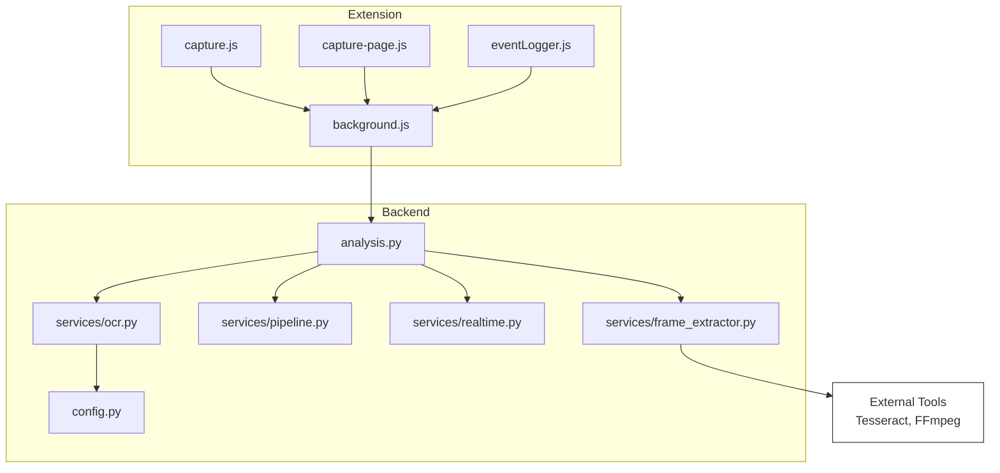
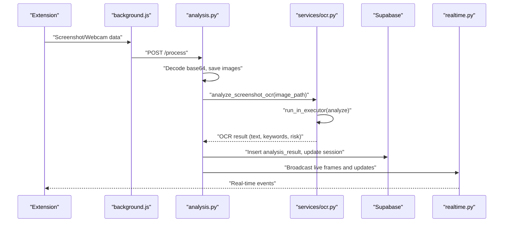
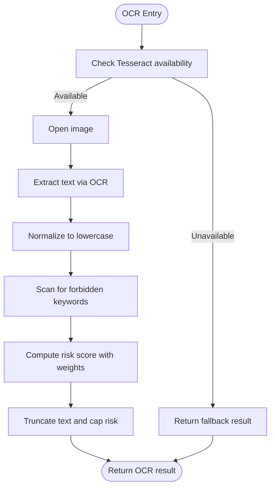
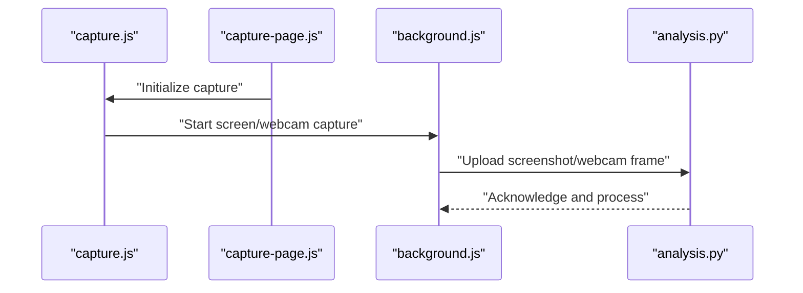
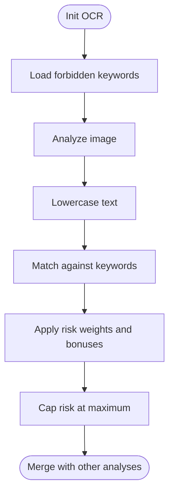
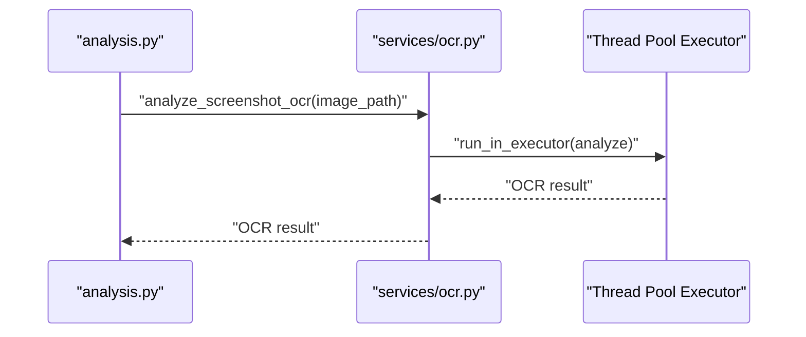
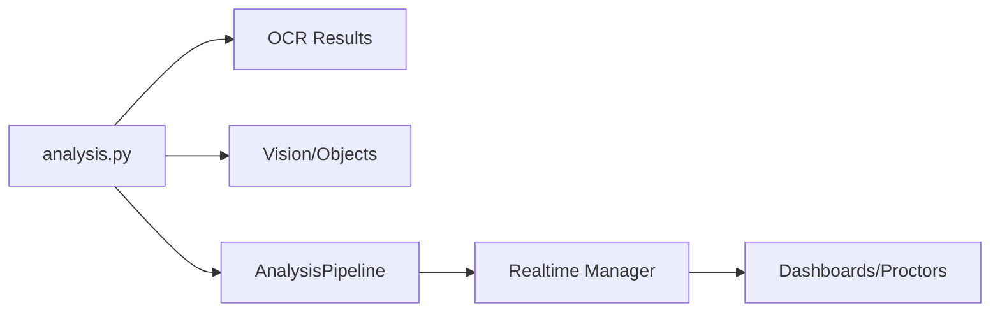
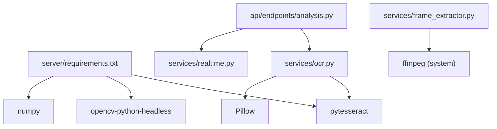

# OCR Text Extraction & Processing

<cite>
**Referenced Files in This Document**
- [README.md](file://README.md)
- [requirements.txt](file://requirements.txt)
- [server/requirements.txt](file://server/requirements.txt)
- [server/config.py](file://server/config.py)
- [server/services/ocr.py](file://server/services/ocr.py)
- [server/api/endpoints/analysis.py](file://server/api/endpoints/analysis.py)
- [server/services/pipeline.py](file://server/services/pipeline.py)
- [server/services/realtime.py](file://server/services/realtime.py)
- [server/services/frame_extractor.py](file://server/services/frame_extractor.py)
- [extension/manifest.json](file://extension/manifest.json)
- [extension/capture.js](file://extension/capture.js)
- [extension/capture-page.js](file://extension/capture-page.js)
- [extension/background.js](file://extension/background.js)
- [extension/eventLogger.js](file://extension/eventLogger.js)
</cite>

## Table of Contents
1. [Introduction](#introduction)
2. [Project Structure](#project-structure)
3. [Core Components](#core-components)
4. [Architecture Overview](#architecture-overview)
5. [Detailed Component Analysis](#detailed-component-analysis)
6. [Dependency Analysis](#dependency-analysis)
7. [Performance Considerations](#performance-considerations)
8. [Troubleshooting Guide](#troubleshooting-guide)
9. [Conclusion](#conclusion)
10. [Appendices](#appendices)

## Introduction
This document explains the OCR text extraction and processing pipeline in ExamGuard Pro with a focus on screen capture analysis. It covers Tesseract OCR installation and configuration for Windows, fallback mechanisms when Tesseract is unavailable, the text extraction process from screenshots (including preprocessing, normalization, and keyword detection), the forbidden keyword detection system with configurable keyword lists and risk scoring, asynchronous execution using thread pools, configuration options for Tesseract path settings and OCR quality parameters, performance optimization techniques, error handling strategies, text truncation limits, and integration with the overall AI analysis pipeline.

## Project Structure
The OCR and screen capture pipeline spans three layers:
- Extension (Chrome Manifest V3): Captures screenshots and webcam frames, sends events and snapshots to the backend.
- Backend (FastAPI): Receives images, performs OCR asynchronously, integrates results into the AI analysis pipeline, and updates session risk.
- AI/ML Services: Vision engines, object detectors, and frame extraction utilities.

**Diagram sources**
- [extension/background.js:1-200](file://extension/background.js#L1-L200)
- [extension/capture.js:1-352](file://extension/capture.js#L1-L352)
- [extension/capture-page.js:1-171](file://extension/capture-page.js#L1-L171)
- [extension/eventLogger.js:1-111](file://extension/eventLogger.js#L1-L111)
- [server/api/endpoints/analysis.py:1-272](file://server/api/endpoints/analysis.py#L1-L272)
- [server/services/ocr.py:1-121](file://server/services/ocr.py#L1-L121)
- [server/config.py:1-205](file://server/config.py#L1-L205)
- [server/services/pipeline.py:1-345](file://server/services/pipeline.py#L1-L345)
- [server/services/realtime.py:1-643](file://server/services/realtime.py#L1-L643)
- [server/services/frame_extractor.py:1-115](file://server/services/frame_extractor.py#L1-L115)

**Section sources**
- [README.md:1-92](file://README.md#L1-L92)
- [extension/manifest.json:1-73](file://extension/manifest.json#L1-L73)

## Core Components
- Tesseract OCR module: Provides synchronous OCR analysis and asynchronous wrapper using a thread pool executor to avoid blocking the event loop.
- Configuration: Defines forbidden keyword lists, risk weights, OCR language, and capture parameters.
- Analysis endpoint: Decodes base64 images, saves them to disk, triggers OCR, and aggregates results into session updates.
- Real-time pipeline: Updates session risk levels and broadcasts events to dashboards and proctors.
- Frame extraction: Extracts representative frames from live WebM streams using FFmpeg for AI analysis.

**Section sources**
- [server/services/ocr.py:1-121](file://server/services/ocr.py#L1-L121)
- [server/config.py:58-205](file://server/config.py#L58-L205)
- [server/api/endpoints/analysis.py:57-272](file://server/api/endpoints/analysis.py#L57-L272)
- [server/services/pipeline.py:1-345](file://server/services/pipeline.py#L1-L345)
- [server/services/realtime.py:1-643](file://server/services/realtime.py#L1-L643)
- [server/services/frame_extractor.py:1-115](file://server/services/frame_extractor.py#L1-L115)

## Architecture Overview
The OCR pipeline integrates with the broader AI analysis pipeline as follows:
- The extension captures screenshots and webcam frames and forwards them to the backend.
- The backend decodes images, saves them, and runs OCR asynchronously.
- OCR results are merged with vision/object detection results and streamed to dashboards via WebSocket.
- The analysis endpoint updates session risk and risk level, and the pipeline continuously recalculates risk.

**Diagram sources**
- [extension/background.js:1-200](file://extension/background.js#L1-L200)
- [server/api/endpoints/analysis.py:57-272](file://server/api/endpoints/analysis.py#L57-L272)
- [server/services/ocr.py:99-121](file://server/services/ocr.py#L99-L121)
- [server/services/realtime.py:334-417](file://server/services/realtime.py#L334-L417)

## Detailed Component Analysis

### Tesseract OCR Implementation
- Installation and Windows configuration:
  - Tesseract must be installed on the system. The backend sets the Tesseract executable path for Windows during initialization.
  - The OCR module attempts to import Tesseract and falls back gracefully if unavailable.
- Asynchronous execution:
  - The OCR analysis is executed in a thread pool to avoid blocking the event loop.
- Text extraction and preprocessing:
  - The image is opened and OCR text is extracted.
  - The text is normalized to lowercase for keyword matching.
- Keyword detection and risk scoring:
  - Forbidden keywords are checked against the lowercase text.
  - Risk score is computed using configured weights, with bonuses for multiple keywords.
  - Results are truncated to a safe length and capped at a maximum risk value.

**Diagram sources**
- [server/services/ocr.py:29-84](file://server/services/ocr.py#L29-L84)
- [server/config.py:164-189](file://server/config.py#L164-L189)

**Section sources**
- [server/services/ocr.py:1-121](file://server/services/ocr.py#L1-L121)
- [server/config.py:58-81](file://server/config.py#L58-L81)
- [server/config.py:164-189](file://server/config.py#L164-L189)

### Screen Capture and Screenshot Upload
- The extension captures screenshots and webcam frames and forwards them to the backend.
- The capture page handles permission requests and initiates the session.
- The background script manages session state, relays messages, and streams video chunks to the backend.

**Diagram sources**
- [extension/capture.js:1-352](file://extension/capture.js#L1-L352)
- [extension/capture-page.js:1-171](file://extension/capture-page.js#L1-L171)
- [extension/background.js:1-200](file://extension/background.js#L1-L200)
- [server/api/endpoints/analysis.py:57-272](file://server/api/endpoints/analysis.py#L57-L272)

**Section sources**
- [extension/capture.js:1-352](file://extension/capture.js#L1-L352)
- [extension/capture-page.js:1-171](file://extension/capture-page.js#L1-L171)
- [extension/background.js:1-200](file://extension/background.js#L1-L200)

### Forbidden Keyword Detection and Risk Scoring
- Configurable keyword lists:
  - Forbidden keywords are defined centrally and loaded into the OCR module.
- Detection algorithm:
  - The extracted text is converted to lowercase and scanned for matches against the forbidden keyword list.
- Risk scoring:
  - A base weight is applied for forbidden content detection.
  - Additional bonus risk is added for multiple keywords, capped at a maximum risk value.
- Integration:
  - The analysis endpoint incorporates OCR risk into session updates and broadcasts risk level changes.

**Diagram sources**
- [server/config.py:58-81](file://server/config.py#L58-L81)
- [server/config.py:164-189](file://server/config.py#L164-L189)
- [server/services/ocr.py:43-63](file://server/services/ocr.py#L43-L63)
- [server/api/endpoints/analysis.py:157-177](file://server/api/endpoints/analysis.py#L157-L177)

**Section sources**
- [server/config.py:58-81](file://server/config.py#L58-L81)
- [server/config.py:164-189](file://server/config.py#L164-L189)
- [server/services/ocr.py:43-63](file://server/services/ocr.py#L43-L63)
- [server/api/endpoints/analysis.py:157-177](file://server/api/endpoints/analysis.py#L157-L177)

### Async Execution Model and Thread Pool
- The OCR analysis is wrapped in an async function that executes the synchronous analyze method inside a thread pool executor.
- This ensures non-blocking operation in the FastAPI event loop.

**Diagram sources**
- [server/services/ocr.py:99-121](file://server/services/ocr.py#L99-L121)

**Section sources**
- [server/services/ocr.py:99-121](file://server/services/ocr.py#L99-L121)

### Integration with the AI Analysis Pipeline
- The analysis endpoint merges OCR results with vision and object detection outputs.
- Session risk is updated and broadcast to dashboards and proctors via WebSocket.
- The pipeline continuously recalculates risk levels and pushes updates.

**Diagram sources**
- [server/api/endpoints/analysis.py:57-272](file://server/api/endpoints/analysis.py#L57-L272)
- [server/services/pipeline.py:74-96](file://server/services/pipeline.py#L74-L96)
- [server/services/realtime.py:334-417](file://server/services/realtime.py#L334-L417)

**Section sources**
- [server/api/endpoints/analysis.py:57-272](file://server/api/endpoints/analysis.py#L57-L272)
- [server/services/pipeline.py:74-96](file://server/services/pipeline.py#L74-L96)
- [server/services/realtime.py:334-417](file://server/services/realtime.py#L334-L417)

## Dependency Analysis
- External dependencies:
  - Tesseract OCR and OpenCV are required for OCR and image processing.
  - FFmpeg is used server-side for extracting frames from live streams.
- Internal dependencies:
  - The analysis endpoint depends on OCR, vision/object detection, and the realtime manager.
  - OCR relies on configuration for keyword lists and risk weights.

**Diagram sources**
- [server/requirements.txt:1-34](file://server/requirements.txt#L1-L34)
- [server/services/ocr.py:1-18](file://server/services/ocr.py#L1-L18)
- [server/api/endpoints/analysis.py:1-25](file://server/api/endpoints/analysis.py#L1-L25)
- [server/services/frame_extractor.py:51-66](file://server/services/frame_extractor.py#L51-L66)

**Section sources**
- [server/requirements.txt:1-34](file://server/requirements.txt#L1-L34)
- [server/services/ocr.py:1-18](file://server/services/ocr.py#L1-L18)
- [server/services/frame_extractor.py:51-66](file://server/services/frame_extractor.py#L51-L66)

## Performance Considerations
- Asynchronous execution: OCR runs in a thread pool to prevent blocking the event loop.
- Image saving and decoding: Images are decoded from base64 and saved to disk before OCR to reduce memory overhead.
- Text truncation: Extracted text is truncated to a safe length to limit downstream processing costs.
- Risk score caps: Risk scores are capped to prevent unbounded growth.
- FFmpeg-based frame extraction: Server-side frame extraction reduces client bandwidth and CPU load.

[No sources needed since this section provides general guidance]

## Troubleshooting Guide
- Tesseract not installed:
  - The OCR module detects missing Tesseract and returns a fallback result with a warning.
- Import errors:
  - If Tesseract or Pillow fails to import, OCR falls back and returns empty results with an error field.
- OCR runtime exceptions:
  - Exceptions during OCR trigger a safe return with error details and zero risk.
- Extension permissions:
  - Ensure the extension has necessary permissions and host permissions configured.
- Backend connectivity:
  - Verify backend URL configuration in the extension and that the server is reachable.

**Section sources**
- [server/services/ocr.py:10-17](file://server/services/ocr.py#L10-L17)
- [server/services/ocr.py:65-73](file://server/services/ocr.py#L65-L73)
- [extension/manifest.json:6-24](file://extension/manifest.json#L6-L24)
- [extension/background.js:8-11](file://extension/background.js#L8-L11)

## Conclusion
ExamGuard Pro’s OCR pipeline provides robust, asynchronous text extraction from screenshots with configurable forbidden keyword detection and risk scoring. It integrates seamlessly with the broader AI analysis pipeline, ensuring real-time updates and responsive dashboards. The design accommodates environments where Tesseract may be unavailable by providing a graceful fallback, and it leverages thread pools and FFmpeg to maintain performance and scalability.

[No sources needed since this section summarizes without analyzing specific files]

## Appendices

### Configuration Options
- Tesseract path (Windows): Configured in the OCR module initialization.
- Forbidden keyword lists: Centralized in configuration.
- Risk weights: Defined in configuration for various event types.
- OCR language: Defined in configuration.
- Capture parameters: Image quality, maximum dimensions, intervals.

**Section sources**
- [server/services/ocr.py:25-27](file://server/services/ocr.py#L25-L27)
- [server/config.py:58-81](file://server/config.py#L58-L81)
- [server/config.py:164-189](file://server/config.py#L164-L189)
- [server/config.py](file://server/config.py#L203)

### Installation Requirements
- Python packages: Tesseract, OpenCV, NumPy, and supporting libraries.
- System tools: Tesseract OCR and FFmpeg (for server-side frame extraction).

**Section sources**
- [server/requirements.txt:24-34](file://server/requirements.txt#L24-L34)
- [server/services/frame_extractor.py:51-66](file://server/services/frame_extractor.py#L51-L66)