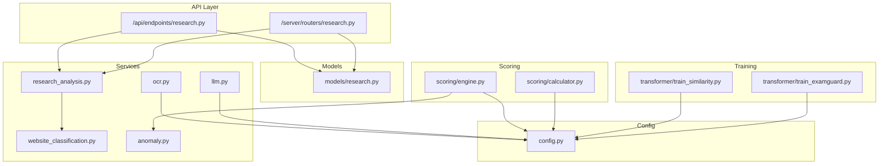
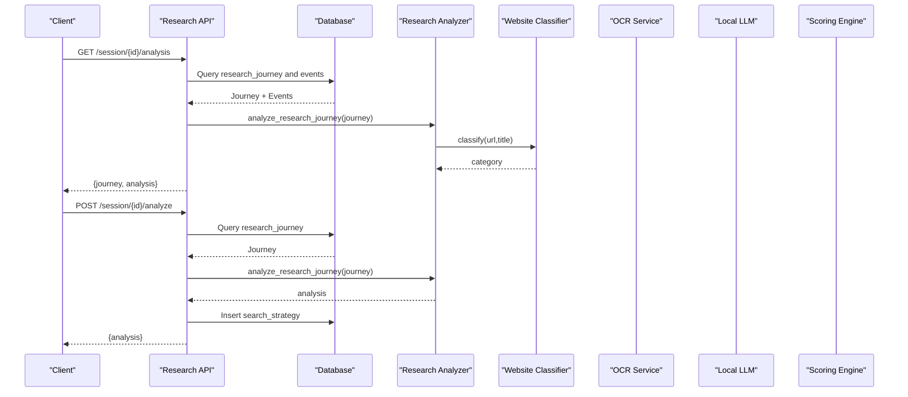
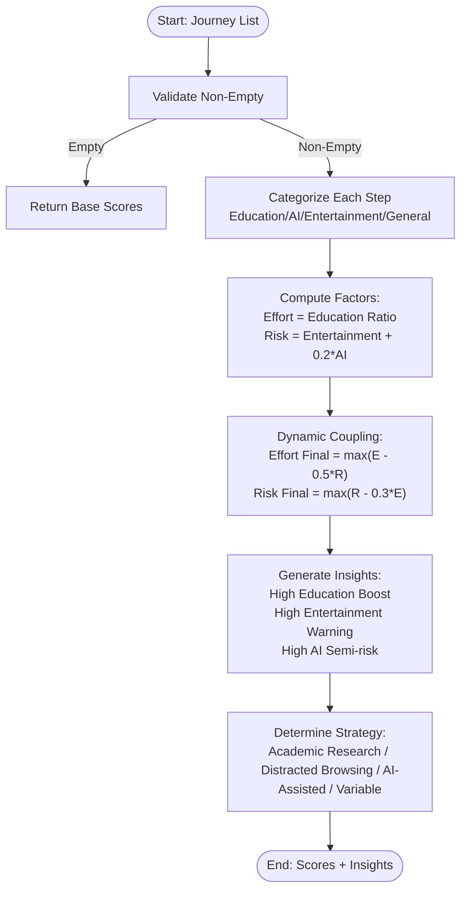
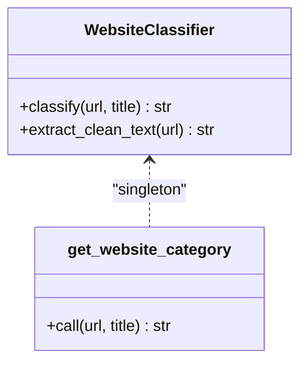
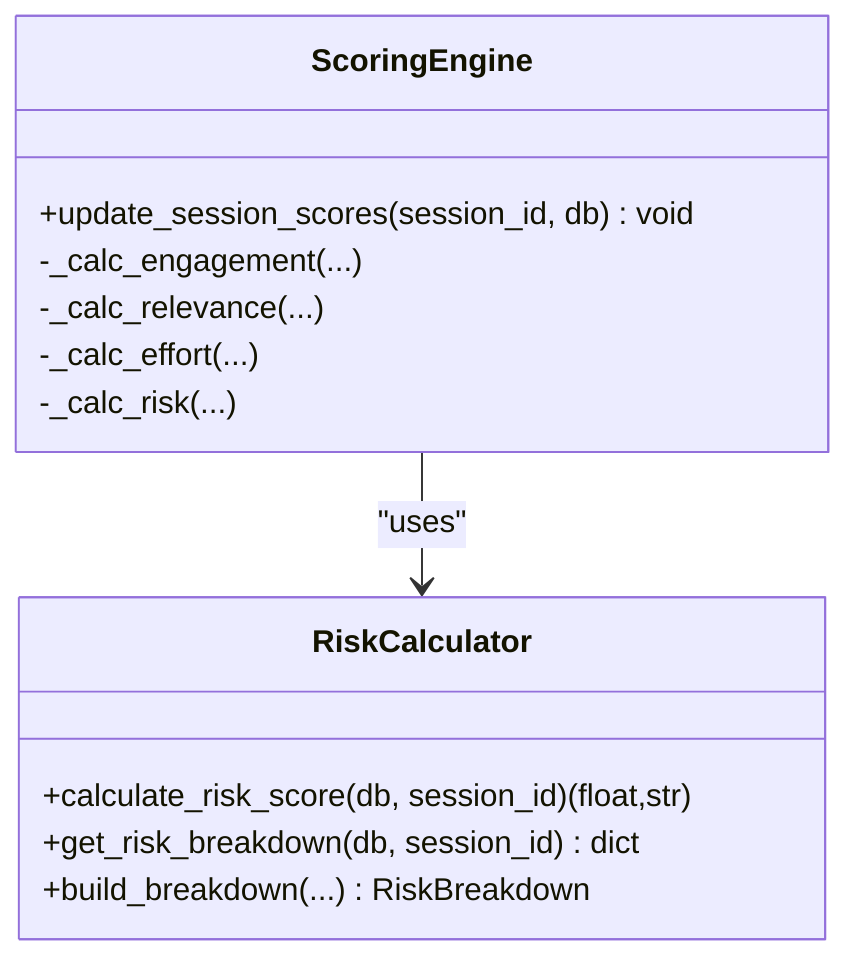
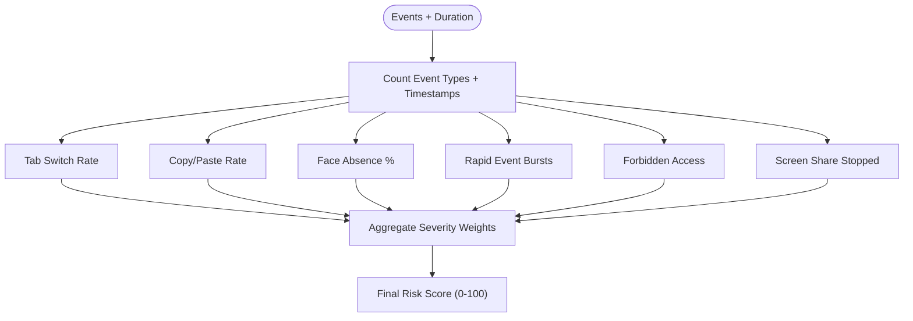
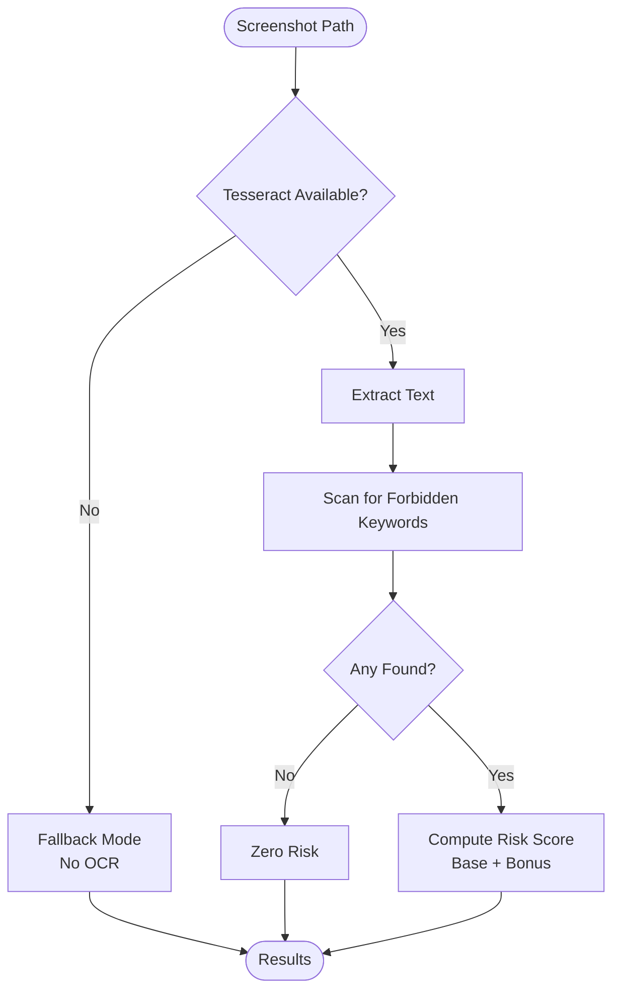
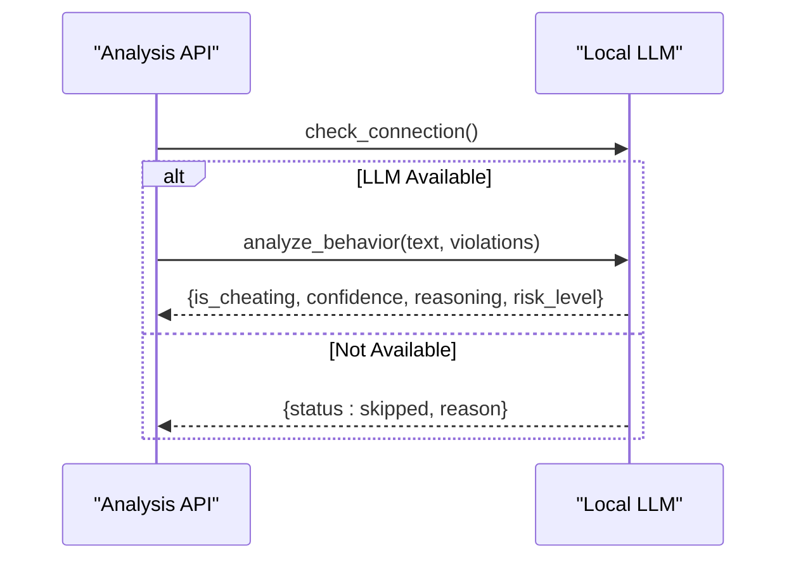
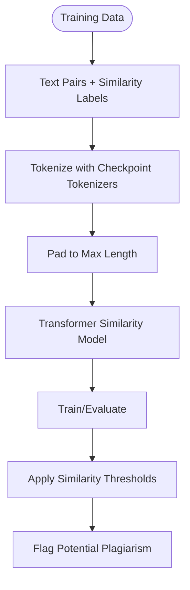
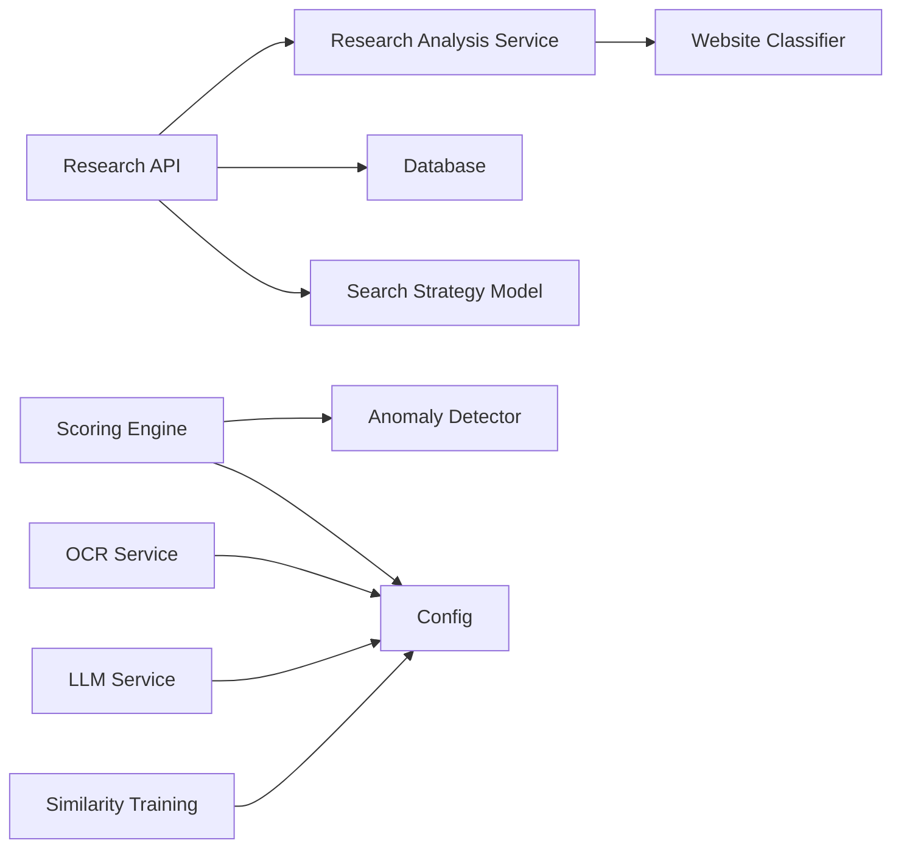

# Research & Content Authenticity Analysis

<cite>
**Referenced Files in This Document**
- [research_analysis.py](file://server/services/research_analysis.py)
- [website_classification.py](file://server/services/website_classification.py)
- [research.py](file://server/api/endpoints/research.py)
- [routers/research.py](file://server/routers/research.py)
- [models/research.py](file://server/models/research.py)
- [config.py](file://server/config.py)
- [scoring/engine.py](file://server/scoring/engine.py)
- [scoring/calculator.py](file://server/scoring/calculator.py)
- [services/anomaly.py](file://server/services/anomaly.py)
- [services/llm.py](file://server/services/llm.py)
- [services/ocr.py](file://server/services/ocr.py)
- [api/endpoints/analysis.py](file://server/api/endpoints/analysis.py)
- [transformer/train_similarity.py](file://transformer/train_similarity.py)
- [transformer/train_examguard.py](file://transformer/train_examguard.py)
</cite>

## Table of Contents
1. [Introduction](#introduction)
2. [Project Structure](#project-structure)
3. [Core Components](#core-components)
4. [Architecture Overview](#architecture-overview)
5. [Detailed Component Analysis](#detailed-component-analysis)
6. [Dependency Analysis](#dependency-analysis)
7. [Performance Considerations](#performance-considerations)
8. [Troubleshooting Guide](#troubleshooting-guide)
9. [Conclusion](#conclusion)
10. [Appendices](#appendices)

## Introduction
This document describes the research and content authenticity analysis services in ExamGuard Pro. It explains how the platform verifies academic integrity by analyzing browsing behavior, detecting unauthorized collaboration and content sharing, and validating content authenticity. The system integrates multiple detection mechanisms including website categorization, OCR-based forbidden content detection, optional local LLM reasoning, anomaly detection, and a scoring engine that combines behavioral and content signals into risk assessments. It also documents configuration options for research database connections, verification thresholds, and false positive reduction techniques, along with reporting mechanisms and integration points with institutional academic policies.

## Project Structure
The research and content authenticity analysis spans backend services, APIs, models, configuration, and ML/training assets:
- Services: website classification, anomaly detection, OCR, and optional LLM reasoning
- APIs: REST endpoints for retrieving and triggering research analysis
- Models: Pydantic models representing research journey and search strategy data
- Scoring: Engines and calculators that combine multiple signals into engagement, relevance, effort, and risk metrics
- Configuration: Environment-driven settings for database connectivity, forbidden keywords, URL categories, and thresholds
- Training: Transformer-based text similarity models for plagiarism detection

**Diagram sources**
- [research.py:1-125](file://server/api/endpoints/research.py#L1-L125)
- [routers/research.py:1-45](file://server/routers/research.py#L1-L45)
- [research_analysis.py:1-92](file://server/services/research_analysis.py#L1-L92)
- [website_classification.py:1-100](file://server/services/website_classification.py#L1-L100)
- [models/research.py:1-39](file://server/models/research.py#L1-L39)
- [scoring/engine.py:1-445](file://server/scoring/engine.py#L1-L445)
- [scoring/calculator.py:1-263](file://server/scoring/calculator.py#L1-L263)
- [config.py:1-205](file://server/config.py#L1-L205)
- [services/anomaly.py:1-221](file://server/services/anomaly.py#L1-L221)
- [services/ocr.py:1-121](file://server/services/ocr.py#L1-L121)
- [services/llm.py:1-78](file://server/services/llm.py#L1-L78)
- [transformer/train_similarity.py:40-820](file://transformer/train_similarity.py#L40-L820)
- [transformer/train_examguard.py:150-178](file://transformer/train_examguard.py#L150-L178)

**Section sources**
- [research.py:1-125](file://server/api/endpoints/research.py#L1-L125)
- [routers/research.py:1-45](file://server/routers/research.py#L1-L45)
- [research_analysis.py:1-92](file://server/services/research_analysis.py#L1-L92)
- [website_classification.py:1-100](file://server/services/website_classification.py#L1-L100)
- [models/research.py:1-39](file://server/models/research.py#L1-L39)
- [scoring/engine.py:1-445](file://server/scoring/engine.py#L1-L445)
- [scoring/calculator.py:1-263](file://server/scoring/calculator.py#L1-L263)
- [config.py:1-205](file://server/config.py#L1-L205)
- [services/anomaly.py:1-221](file://server/services/anomaly.py#L1-L221)
- [services/ocr.py:1-121](file://server/services/ocr.py#L1-L121)
- [services/llm.py:1-78](file://server/services/llm.py#L1-L78)
- [transformer/train_similarity.py:40-820](file://transformer/train_similarity.py#L40-L820)
- [transformer/train_examguard.py:150-178](file://transformer/train_examguard.py#L150-L178)

## Core Components
- Research journey analyzer: Computes effort and risk scores from categorized browsing history and provides strategy insights.
- Website classification: Classifies URLs into Education, AI, Entertainment, and others using domain and keyword heuristics.
- Scoring engine: Aggregates engagement, relevance, effort, and risk metrics using configurable weights and thresholds.
- Anomaly detection: Identifies behavioral anomalies from session events with severity-based risk scoring.
- OCR-based forbidden content detection: Extracts text from screenshots and flags forbidden keywords.
- Optional LLM reasoning: Uses a local LLM to assess whether detected behavior indicates meaningful cheating.
- Configuration: Centralized settings for database connectivity, forbidden lists, URL categories, and thresholds.

**Section sources**
- [research_analysis.py:18-92](file://server/services/research_analysis.py#L18-L92)
- [website_classification.py:10-99](file://server/services/website_classification.py#L10-L99)
- [scoring/engine.py:27-93](file://server/scoring/engine.py#L27-L93)
- [services/anomaly.py:11-165](file://server/services/anomaly.py#L11-L165)
- [services/ocr.py:20-121](file://server/services/ocr.py#L20-L121)
- [services/llm.py:10-78](file://server/services/llm.py#L10-L78)
- [config.py:16-205](file://server/config.py#L16-L205)

## Architecture Overview
The research and content authenticity pipeline integrates event and browsing data with real-time and offline analysis services. The API layer retrieves research journeys and triggers analysis, while services compute scores and insights. The scoring engine consolidates multiple signals into session-level metrics, and configuration governs thresholds and weights.

**Diagram sources**
- [research.py:12-125](file://server/api/endpoints/research.py#L12-L125)
- [routers/research.py:12-45](file://server/routers/research.py#L12-L45)
- [research_analysis.py:18-92](file://server/services/research_analysis.py#L18-L92)
- [website_classification.py:50-99](file://server/services/website_classification.py#L50-L99)

## Detailed Component Analysis

### Research Journey Analyzer
The analyzer computes effort and risk scores from a sequence of visited sites, categorizing each step and deriving strategy insights. It dynamically couples effort and risk, adjusts for high-risk or high-effort conditions, and provides actionable insights.

**Diagram sources**
- [research_analysis.py:18-92](file://server/services/research_analysis.py#L18-L92)

**Section sources**
- [research_analysis.py:18-92](file://server/services/research_analysis.py#L18-L92)

### Website Classification Service
The classifier assigns categories to URLs using domain and keyword matching with weighted scoring. It supports a singleton interface for reuse and fallback to a general category when no matches are found.

**Diagram sources**
- [website_classification.py:50-99](file://server/services/website_classification.py#L50-L99)

**Section sources**
- [website_classification.py:10-99](file://server/services/website_classification.py#L10-L99)

### Scoring Engine and Risk Calculator
The scoring engine orchestrates calculation of engagement, relevance, effort alignment, and risk from session data, integrating anomaly detection and configurable weights. The calculator provides a repeat-offense multiplier and risk classification based on thresholds.

**Diagram sources**
- [scoring/engine.py:373-445](file://server/scoring/engine.py#L373-L445)
- [scoring/calculator.py:161-207](file://server/scoring/calculator.py#L161-L207)

**Section sources**
- [scoring/engine.py:27-93](file://server/scoring/engine.py#L27-L93)
- [scoring/engine.py:373-445](file://server/scoring/engine.py#L373-L445)
- [scoring/calculator.py:127-157](file://server/scoring/calculator.py#L127-L157)
- [scoring/calculator.py:161-207](file://server/scoring/calculator.py#L161-L207)

### Anomaly Detection
The anomaly detector evaluates session events against thresholds for tab switches, copy/paste rates, face absence, rapid event bursts, forbidden access, and screen sharing interruptions, aggregating a risk score with severity weights.

**Diagram sources**
- [services/anomaly.py:23-165](file://server/services/anomaly.py#L23-L165)

**Section sources**
- [services/anomaly.py:11-165](file://server/services/anomaly.py#L11-L165)

### OCR-Based Forbidden Content Detection
The OCR module extracts text from screenshots and flags forbidden keywords, calculating a risk score proportional to the number of matches. It gracefully handles missing Tesseract installations.

**Diagram sources**
- [services/ocr.py:29-121](file://server/services/ocr.py#L29-L121)
- [config.py:58-81](file://server/config.py#L58-L81)

**Section sources**
- [services/ocr.py:20-121](file://server/services/ocr.py#L20-L121)
- [config.py:58-81](file://server/config.py#L58-L81)

### Optional LLM Reasoning
The local LLM service checks connectivity and performs behavior analysis given extracted text and detected violations, returning structured results for risk augmentation.

**Diagram sources**
- [services/llm.py:16-78](file://server/services/llm.py#L16-L78)
- [api/endpoints/analysis.py:182-195](file://server/api/endpoints/analysis.py#L182-L195)

**Section sources**
- [services/llm.py:10-78](file://server/services/llm.py#L10-L78)
- [api/endpoints/analysis.py:182-195](file://server/api/endpoints/analysis.py#L182-L195)

### Plagiarism Detection Workflows
Plagiarism detection leverages a transformer-based similarity model trained on curated text pairs. The training pipeline constructs datasets with labeled similarity scores and demonstrates evaluation modes.

**Diagram sources**
- [transformer/train_similarity.py:40-820](file://transformer/train_similarity.py#L40-L820)
- [transformer/train_examguard.py:150-178](file://transformer/train_examguard.py#L150-L178)

**Section sources**
- [transformer/train_similarity.py:40-820](file://transformer/train_similarity.py#L40-L820)
- [transformer/train_examguard.py:150-178](file://transformer/train_examguard.py#L150-L178)

## Dependency Analysis
The system exhibits clear separation of concerns:
- API endpoints depend on services and models for data retrieval and persistence.
- Services encapsulate domain logic (classification, OCR, anomaly detection, LLM).
- Scoring components depend on configuration and event data.
- Training assets are decoupled from runtime services.

**Diagram sources**
- [research.py:1-125](file://server/api/endpoints/research.py#L1-L125)
- [routers/research.py:1-45](file://server/routers/research.py#L1-L45)
- [research_analysis.py:1-92](file://server/services/research_analysis.py#L1-L92)
- [website_classification.py:1-100](file://server/services/website_classification.py#L1-L100)
- [models/research.py:1-39](file://server/models/research.py#L1-L39)
- [scoring/engine.py:1-445](file://server/scoring/engine.py#L1-L445)
- [services/anomaly.py:1-221](file://server/services/anomaly.py#L1-L221)
- [services/ocr.py:1-121](file://server/services/ocr.py#L1-L121)
- [services/llm.py:1-78](file://server/services/llm.py#L1-L78)
- [config.py:1-205](file://server/config.py#L1-L205)
- [transformer/train_similarity.py:40-820](file://transformer/train_similarity.py#L40-L820)

**Section sources**
- [research.py:1-125](file://server/api/endpoints/research.py#L1-L125)
- [routers/research.py:1-45](file://server/routers/research.py#L1-L45)
- [research_analysis.py:1-92](file://server/services/research_analysis.py#L1-L92)
- [website_classification.py:1-100](file://server/services/website_classification.py#L1-L100)
- [models/research.py:1-39](file://server/models/research.py#L1-L39)
- [scoring/engine.py:1-445](file://server/scoring/engine.py#L1-L445)
- [services/anomaly.py:1-221](file://server/services/anomaly.py#L1-L221)
- [services/ocr.py:1-121](file://server/services/ocr.py#L1-L121)
- [services/llm.py:1-78](file://server/services/llm.py#L1-L78)
- [config.py:1-205](file://server/config.py#L1-L205)
- [transformer/train_similarity.py:40-820](file://transformer/train_similarity.py#L40-L820)

## Performance Considerations
- Minimize I/O bottlenecks by batching database queries and leveraging async sessions.
- Use lightweight category classification for large-scale browsing sequences.
- Apply OCR and LLM analysis selectively to flagged sessions to reduce latency.
- Tune thresholds and weights to balance sensitivity and false positives.
- Cache classifier and model instances to avoid repeated initialization overhead.

## Troubleshooting Guide
- Database connectivity: Verify environment variables for Supabase or PostgreSQL and ensure the database URL format is compatible with the async driver.
- OCR disabled: Install Tesseract and configure the executable path; otherwise, fallback mode will return zero risk.
- LLM not responding: Confirm the local LLM service endpoint is reachable and model tags are available.
- High false positives: Adjust thresholds in configuration and review forbidden keyword lists; consider increasing grace periods for benign events.
- Missing research data: Ensure research journey entries exist for the session ID and timestamps are ordered correctly.

**Section sources**
- [config.py:16-43](file://server/config.py#L16-L43)
- [services/ocr.py:10-28](file://server/services/ocr.py#L10-L28)
- [services/llm.py:16-26](file://server/services/llm.py#L16-L26)
- [config.py:191-197](file://server/config.py#L191-L197)

## Conclusion
ExamGuard Pro’s research and content authenticity analysis integrates browsing behavior analysis, website classification, OCR-based forbidden content detection, optional LLM reasoning, and a robust scoring engine to assess academic integrity. Configuration enables customization of database connections, verification thresholds, and false positive reduction strategies. The system’s modular design supports scalable deployment and aligns with institutional policies through structured reporting and risk classification.

## Appendices

### Configuration Options
- Database connectivity: Environment variables for Supabase or PostgreSQL; defaults to SQLite if none are set.
- Forbidden keywords: Centralized list for OCR-based detection.
- URL categories: Lists for AI, entertainment, cheating, social, and educational sites; used for risk classification.
- Risk weights and thresholds: Configurable weights for event types and thresholds for risk levels.
- OCR and LLM settings: Language selection for OCR and similarity thresholds for plagiarism detection.

**Section sources**
- [config.py:16-43](file://server/config.py#L16-L43)
- [config.py:58-81](file://server/config.py#L58-L81)
- [config.py:83-139](file://server/config.py#L83-L139)
- [config.py:164-197](file://server/config.py#L164-L197)
- [config.py:202-205](file://server/config.py#L202-L205)

### Reporting Mechanisms and Policy Integration
- API endpoints expose analysis results and strategy insights for each session.
- Risk breakdowns and scores can be incorporated into institutional reporting dashboards.
- Policies can be mapped to risk levels and thresholds to automate flagging and escalation.

**Section sources**
- [research.py:12-125](file://server/api/endpoints/research.py#L12-L125)
- [scoring/calculator.py:118-157](file://server/scoring/calculator.py#L118-L157)
- [scoring/engine.py:357-370](file://server/scoring/engine.py#L357-L370)