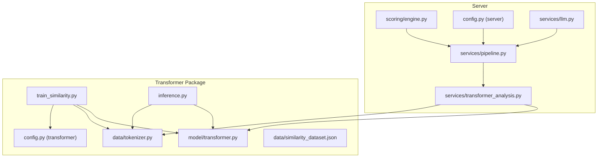
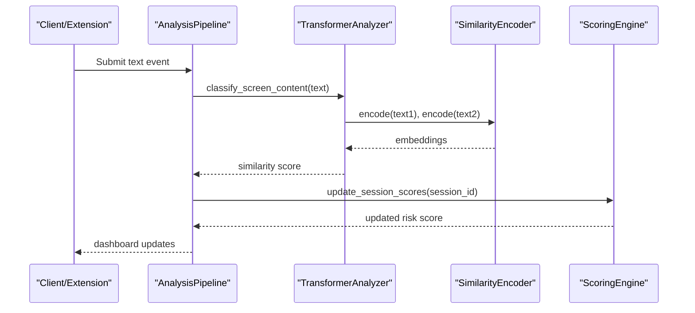
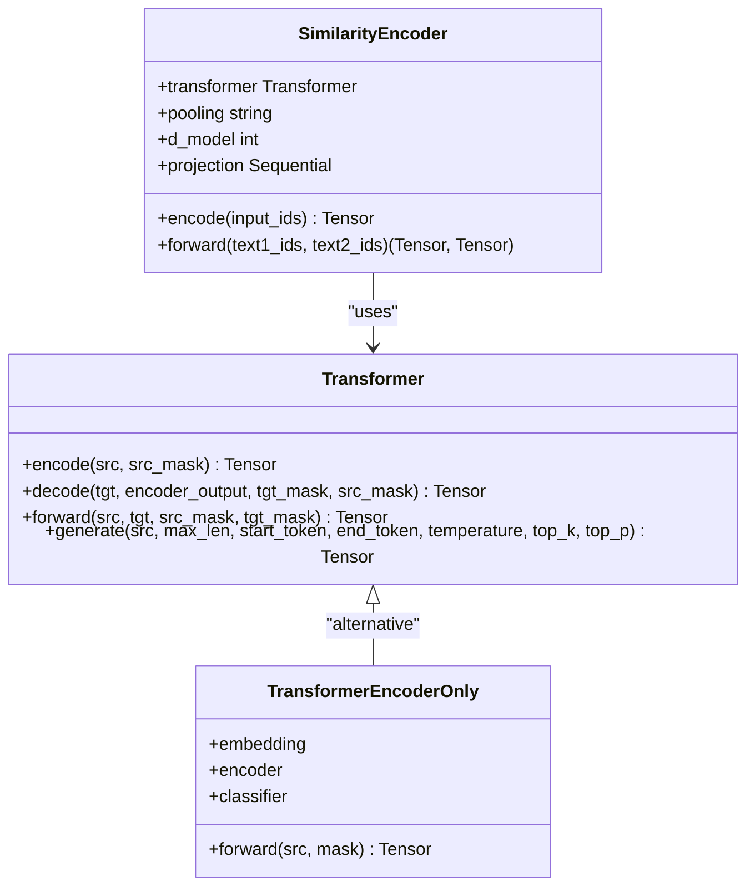
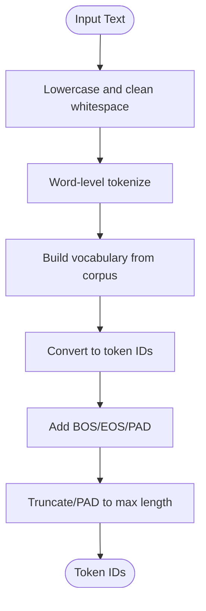
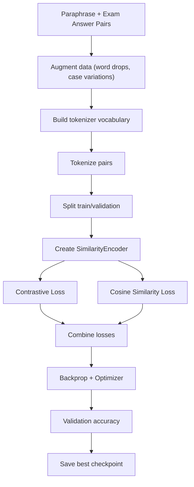
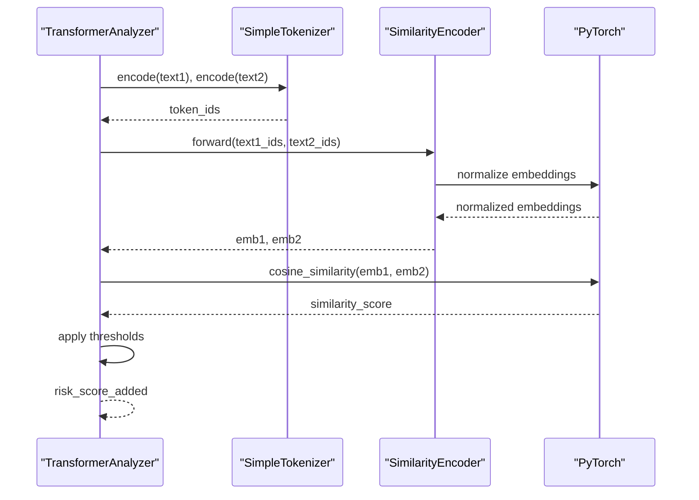
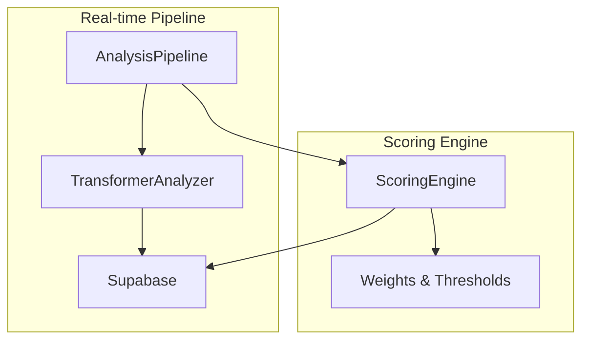
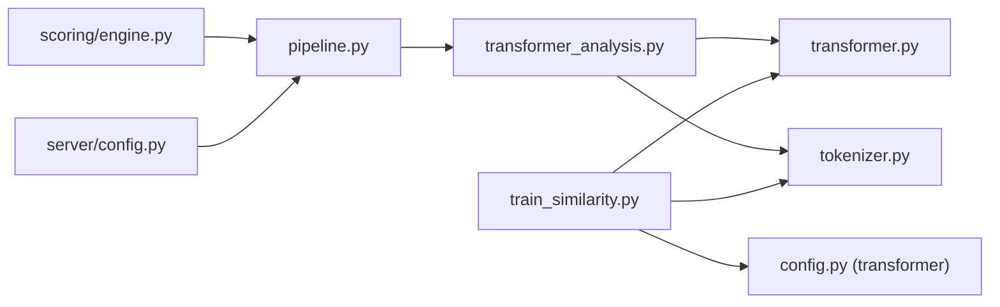

# Transformer-Based Text Similarity Analysis

<cite>
**Referenced Files in This Document**
- [transformer_analysis.py](file://server/services/transformer_analysis.py)
- [transformer.py](file://transformer/model/transformer.py)
- [tokenizer.py](file://transformer/data/tokenizer.py)
- [train_similarity.py](file://transformer/train_similarity.py)
- [config.py](file://transformer/config.py)
- [inference.py](file://transformer/inference.py)
- [similarity_dataset.json](file://transformer/data/similarity_dataset.json)
- [pipeline.py](file://server/services/pipeline.py)
- [engine.py](file://server/scoring/engine.py)
- [config.py](file://server/config.py)
- [llm.py](file://server/services/llm.py)
</cite>

## Table of Contents
1. [Introduction](#introduction)
2. [Project Structure](#project-structure)
3. [Core Components](#core-components)
4. [Architecture Overview](#architecture-overview)
5. [Detailed Component Analysis](#detailed-component-analysis)
6. [Dependency Analysis](#dependency-analysis)
7. [Performance Considerations](#performance-considerations)
8. [Troubleshooting Guide](#troubleshooting-guide)
9. [Conclusion](#conclusion)

## Introduction
This document explains the transformer-based text similarity analysis services in ExamGuard Pro, focusing on semantic similarity detection for plagiarism and copied content detection. It covers model selection criteria, embedding generation, cosine similarity scoring, threshold configurations, preprocessing and normalization, and integration with the AI pipeline and overall risk scoring.

## Project Structure
The text similarity system spans two major areas:
- Training and inference assets under the transformer package
- Runtime integration under the server package

**Diagram sources**
- [transformer_analysis.py:178-549](file://server/services/transformer_analysis.py#L178-L549)
- [transformer.py:17-606](file://transformer/model/transformer.py#L17-L606)
- [tokenizer.py:13-475](file://transformer/data/tokenizer.py#L13-L475)
- [train_similarity.py:411-702](file://transformer/train_similarity.py#L411-L702)
- [config.py:10-75](file://transformer/config.py#L10-L75)
- [inference.py:17-159](file://transformer/inference.py#L17-L159)
- [similarity_dataset.json:1-800](file://transformer/data/similarity_dataset.json#L1-L800)
- [pipeline.py:9-345](file://server/services/pipeline.py#L9-L345)
- [engine.py:373-445](file://server/scoring/engine.py#L373-L445)
- [config.py:1-205](file://server/config.py#L1-L205)

**Section sources**
- [transformer_analysis.py:1-549](file://server/services/transformer_analysis.py#L1-L549)
- [transformer.py:1-606](file://transformer/model/transformer.py#L1-L606)
- [tokenizer.py:1-475](file://transformer/data/tokenizer.py#L1-L475)
- [train_similarity.py:1-834](file://transformer/train_similarity.py#L1-L834)
- [config.py:1-75](file://transformer/config.py#L1-L75)
- [inference.py:1-159](file://transformer/inference.py#L1-L159)
- [similarity_dataset.json:1-1042](file://transformer/data/similarity_dataset.json#L1-L1042)
- [pipeline.py:1-345](file://server/services/pipeline.py#L1-L345)
- [engine.py:1-445](file://server/scoring/engine.py#L1-L445)
- [config.py:1-205](file://server/config.py#L1-L205)

## Core Components
- Transformer encoder-only architecture for text encoding
- Sentence-aware tokenizer with vocabulary building
- Similarity encoder with pooling and projection head
- Training pipeline with contrastive and cosine similarity losses
- Runtime analyzer for similarity scoring and thresholding
- Pipeline integration for real-time scoring and risk updates
- Scoring engine that blends similarity signals into overall risk

**Section sources**
- [transformer.py:317-414](file://transformer/model/transformer.py#L317-L414)
- [tokenizer.py:13-171](file://transformer/data/tokenizer.py#L13-L171)
- [train_similarity.py:411-460](file://transformer/train_similarity.py#L411-L460)
- [transformer_analysis.py:178-549](file://server/services/transformer_analysis.py#L178-L549)
- [pipeline.py:97-148](file://server/services/pipeline.py#L97-L148)
- [engine.py:311-354](file://server/scoring/engine.py#L311-L354)

## Architecture Overview
The system uses a transformer encoder to embed sentences into fixed-dimensional vectors. Cosine similarity between pairs determines similarity scores. Thresholds trigger risk adjustments in the scoring engine.

**Diagram sources**
- [pipeline.py:97-148](file://server/services/pipeline.py#L97-L148)
- [transformer_analysis.py:474-523](file://server/services/transformer_analysis.py#L474-L523)
- [train_similarity.py:411-460](file://transformer/train_similarity.py#L411-L460)
- [engine.py:417-432](file://server/scoring/engine.py#L417-L432)

## Detailed Component Analysis

### Transformer Encoder and Similarity Encoder
The transformer encoder-only architecture encodes input sequences and supports multiple pooling strategies. The SimilarityEncoder wraps the transformer to produce compact embeddings suitable for cosine similarity.

**Diagram sources**
- [transformer.py:17-314](file://transformer/model/transformer.py#L17-L314)
- [transformer.py:317-414](file://transformer/model/transformer.py#L317-L414)
- [train_similarity.py:411-460](file://transformer/train_similarity.py#L411-L460)

**Section sources**
- [transformer.py:17-606](file://transformer/model/transformer.py#L17-L606)
- [train_similarity.py:411-460](file://transformer/train_similarity.py#L411-L460)

### Tokenization and Normalization
The SimpleTokenizer performs lowercasing, basic cleaning, and word-level tokenization with special tokens. It builds vocabulary from corpora and supports saving/loading. Normalization is applied during training/inference via embedding normalization and projection.

**Diagram sources**
- [tokenizer.py:61-140](file://transformer/data/tokenizer.py#L61-L140)

**Section sources**
- [tokenizer.py:13-171](file://transformer/data/tokenizer.py#L13-L171)

### Training Pipeline and Loss Functions
The training pipeline constructs balanced paraphrase and exam-answer pairs, augments data, and trains with combined contrastive and cosine similarity losses. Mean pooling with a projection head improves similarity discrimination.

**Diagram sources**
- [train_similarity.py:81-347](file://transformer/train_similarity.py#L81-L347)
- [train_similarity.py:411-460](file://transformer/train_similarity.py#L411-L460)
- [train_similarity.py:568-702](file://transformer/train_similarity.py#L568-L702)

**Section sources**
- [train_similarity.py:411-702](file://transformer/train_similarity.py#L411-L702)
- [config.py:10-75](file://transformer/config.py#L10-L75)

### Runtime Analyzer and Thresholding
The runtime analyzer loads the trained SimilarityEncoder, tokenizes input, generates embeddings, computes cosine similarity, and applies thresholds to determine suspiciousness and risk impact.

**Diagram sources**
- [transformer_analysis.py:474-523](file://server/services/transformer_analysis.py#L474-L523)
- [train_similarity.py:392-404](file://transformer/train_similarity.py#L392-L404)

**Section sources**
- [transformer_analysis.py:178-549](file://server/services/transformer_analysis.py#L178-L549)
- [train_similarity.py:392-404](file://transformer/train_similarity.py#L392-L404)

### Integration with AI Pipeline and Risk Scoring
The analysis pipeline submits text events, runs transformer similarity checks, records analysis results, and triggers risk score updates. The scoring engine aggregates vision, OCR, anomaly, and browsing signals into a unified risk score.

**Diagram sources**
- [pipeline.py:97-148](file://server/services/pipeline.py#L97-L148)
- [engine.py:311-354](file://server/scoring/engine.py#L311-L354)

**Section sources**
- [pipeline.py:97-148](file://server/services/pipeline.py#L97-L148)
- [engine.py:311-354](file://server/scoring/engine.py#L311-L354)

## Dependency Analysis
- The server-side transformer analyzer depends on the transformer encoder-only and tokenizer modules.
- Training scripts depend on the transformer model, tokenizer, and configuration.
- The pipeline integrates analyzer outputs into session risk updates.
- The scoring engine consumes analyzer outputs and other signals to compute risk.

**Diagram sources**
- [transformer_analysis.py:178-549](file://server/services/transformer_analysis.py#L178-L549)
- [transformer.py:17-606](file://transformer/model/transformer.py#L17-L606)
- [tokenizer.py:13-475](file://transformer/data/tokenizer.py#L13-L475)
- [train_similarity.py:411-702](file://transformer/train_similarity.py#L411-L702)
- [config.py:10-75](file://transformer/config.py#L10-L75)
- [pipeline.py:97-148](file://server/services/pipeline.py#L97-L148)
- [engine.py:311-354](file://server/scoring/engine.py#L311-L354)
- [config.py:1-205](file://server/config.py#L1-L205)

**Section sources**
- [transformer_analysis.py:178-549](file://server/services/transformer_analysis.py#L178-L549)
- [transformer.py:17-606](file://transformer/model/transformer.py#L17-L606)
- [tokenizer.py:13-475](file://transformer/data/tokenizer.py#L13-L475)
- [train_similarity.py:411-702](file://transformer/train_similarity.py#L411-L702)
- [config.py:10-75](file://transformer/config.py#L10-L75)
- [pipeline.py:97-148](file://server/services/pipeline.py#L97-L148)
- [engine.py:311-354](file://server/scoring/engine.py#L311-L354)
- [config.py:1-205](file://server/config.py#L1-L205)

## Performance Considerations
- Model size and sequence length: The similarity model uses configurable d_model, n_heads, n_layers, and max_seq_len. Smaller configs reduce memory and latency.
- Pooling strategy: Mean pooling with mask normalization is used; CLS or max pooling can be alternatives depending on trade-offs.
- Tokenization efficiency: SimpleTokenizer is lightweight; BPE-based tokenizers offer better compression but require external libraries.
- Device utilization: Prefer GPU when available; ensure batch sizes and sequence lengths fit device memory.
- Inference optimization: Disable dropout and gradients during inference; reuse tokenizers and models across requests.

[No sources needed since this section provides general guidance]

## Troubleshooting Guide
Common issues and resolutions:
- Model not initialized: The analyzer checks for checkpoint existence and falls back to rule-based URL classification if unavailable.
- Tokenizer mismatch: Ensure tokenizer.json matches training vocabulary; rebuild vocabulary if needed.
- CUDA out-of-memory: Reduce batch size or sequence length; use smaller model configs.
- Low similarity scores: Verify tokenization correctness and consider adjusting thresholds.
- Pipeline errors: Inspect queue processing and database insertions; monitor stats for errors.

**Section sources**
- [transformer_analysis.py:305-326](file://server/services/transformer_analysis.py#L305-L326)
- [transformer_analysis.py:474-523](file://server/services/transformer_analysis.py#L474-L523)
- [pipeline.py:55-73](file://server/services/pipeline.py#L55-L73)

## Conclusion
ExamGuard Pro leverages a transformer encoder-only architecture to compute semantic similarity for plagiarism detection. The system combines robust preprocessing, strong training losses, and practical thresholding to integrate similarity signals into a comprehensive risk scoring framework. The modular design enables easy tuning of model configurations, tokenization strategies, and scoring thresholds to balance detection sensitivity and performance.