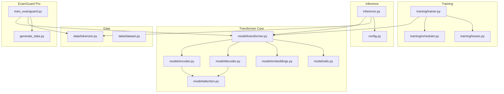
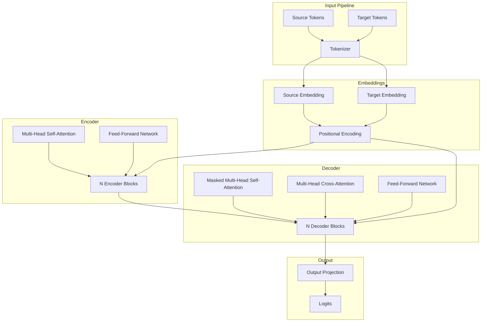
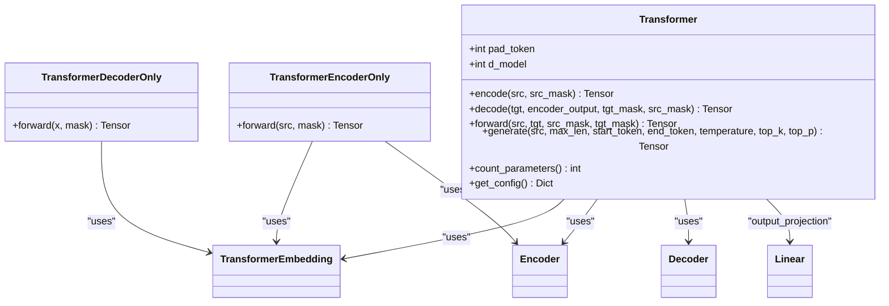
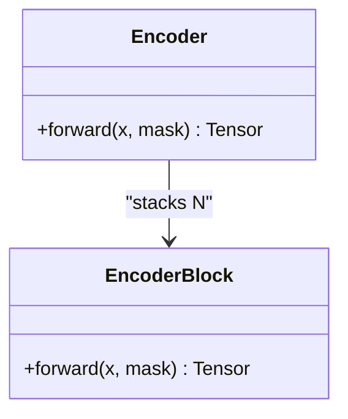
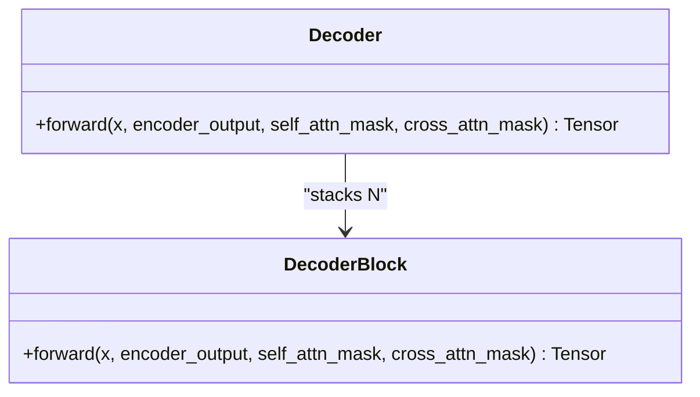
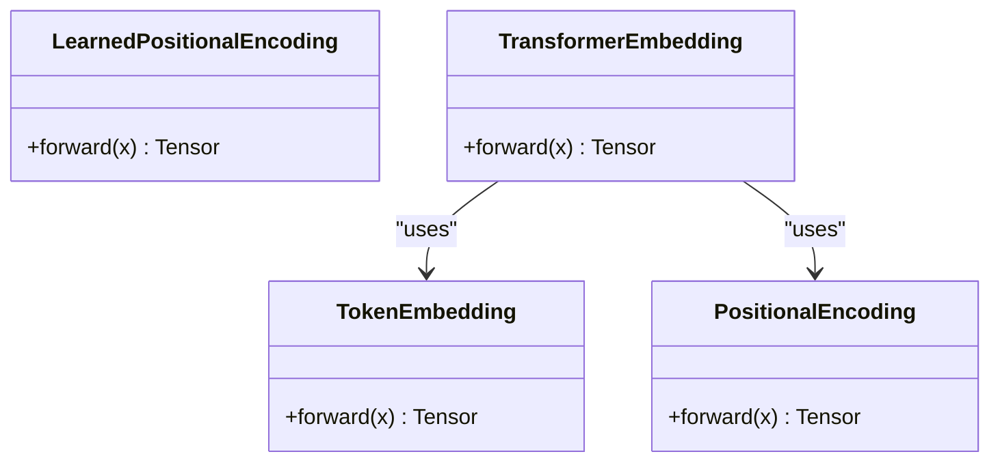
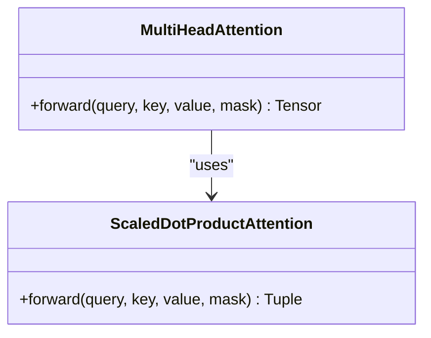
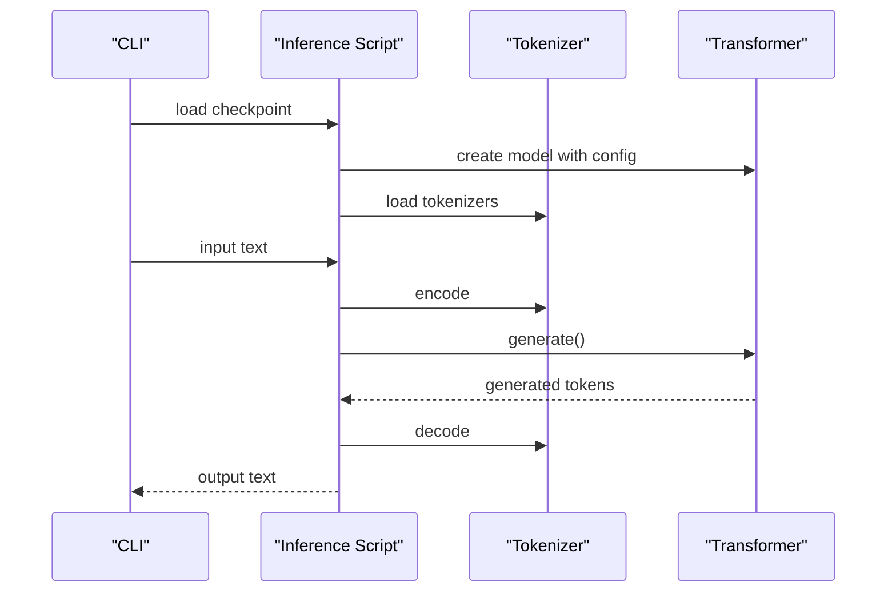
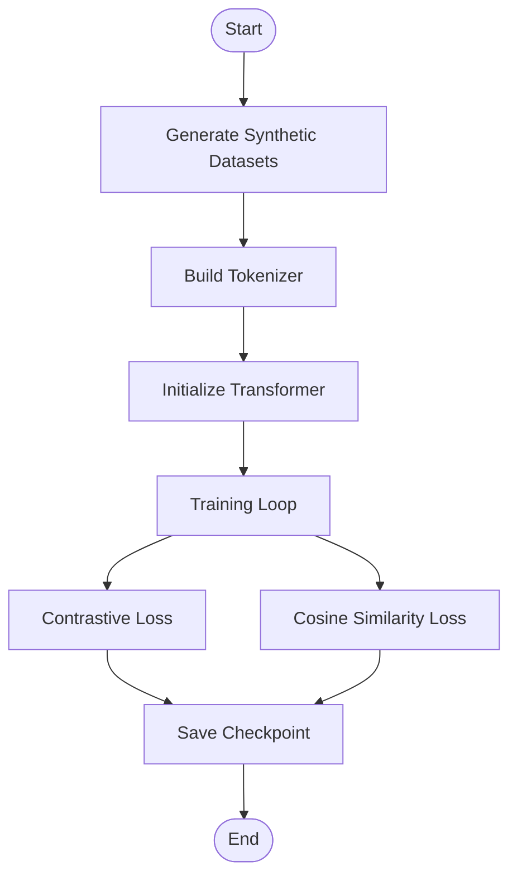
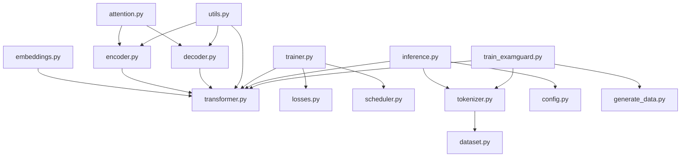

# Transformer Model Implementation

<cite>
**Referenced Files in This Document**
- [transformer.py](file://transformer/model/transformer.py)
- [encoder.py](file://transformer/model/encoder.py)
- [decoder.py](file://transformer/model/decoder.py)
- [embeddings.py](file://transformer/model/embeddings.py)
- [attention.py](file://transformer/model/attention.py)
- [utils.py](file://transformer/model/utils.py)
- [trainer.py](file://transformer/training/trainer.py)
- [scheduler.py](file://transformer/training/scheduler.py)
- [losses.py](file://transformer/training/losses.py)
- [inference.py](file://transformer/inference.py)
- [config.py](file://transformer/config.py)
- [tokenizer.py](file://transformer/data/tokenizer.py)
- [dataset.py](file://transformer/data/dataset.py)
- [train_examguard.py](file://transformer/train_examguard.py)
- [generate_data.py](file://transformer/generate_data.py)
</cite>

## Table of Contents
1. [Introduction](#introduction)
2. [Project Structure](#project-structure)
3. [Core Components](#core-components)
4. [Architecture Overview](#architecture-overview)
5. [Detailed Component Analysis](#detailed-component-analysis)
6. [Dependency Analysis](#dependency-analysis)
7. [Performance Considerations](#performance-considerations)
8. [Troubleshooting Guide](#troubleshooting-guide)
9. [Conclusion](#conclusion)
10. [Appendices](#appendices)

## Introduction
This document provides a comprehensive guide to the custom transformer model implementation used by ExamGuard Pro for text analysis and sequence modeling. It covers the encoder-decoder architecture, multi-head attention mechanisms, positional encoding, feed-forward layers, embedding systems, training configuration, optimization strategies, checkpoint management, inference procedures, and integration with the broader AI pipeline. The implementation emphasizes practical deployment considerations and inference optimization techniques tailored for exam content analysis and behavioral pattern recognition.

## Project Structure
The transformer implementation is organized into modular components within the transformer directory:
- model: Core transformer building blocks (embeddings, attention, encoder, decoder, utilities)
- training: Training loop, schedulers, and loss functions
- data: Tokenization utilities and dataset abstractions
- inference: Standalone inference script and utilities
- configs: Hyperparameter configurations
- generate_data.py: Synthetic dataset generators for exam security use cases



**Diagram sources**
- [transformer.py:1-606](file://transformer/model/transformer.py#L1-L606)
- [encoder.py:1-194](file://transformer/model/encoder.py#L1-L194)
- [decoder.py:1-229](file://transformer/model/decoder.py#L1-L229)
- [embeddings.py:1-224](file://transformer/model/embeddings.py#L1-L224)
- [attention.py:1-283](file://transformer/model/attention.py#L1-L283)
- [utils.py:1-274](file://transformer/model/utils.py#L1-L274)
- [trainer.py:1-429](file://transformer/training/trainer.py#L1-L429)
- [scheduler.py:1-272](file://transformer/training/scheduler.py#L1-L272)
- [losses.py:1-273](file://transformer/training/losses.py#L1-L273)
- [tokenizer.py:1-475](file://transformer/data/tokenizer.py#L1-L475)
- [dataset.py:1-379](file://transformer/data/dataset.py#L1-L379)
- [inference.py:1-159](file://transformer/inference.py#L1-L159)
- [config.py:1-75](file://transformer/config.py#L1-L75)
- [train_examguard.py:1-277](file://transformer/train_examguard.py#L1-L277)
- [generate_data.py:1-602](file://transformer/generate_data.py#L1-L602)

**Section sources**
- [transformer.py:1-606](file://transformer/model/transformer.py#L1-L606)
- [trainer.py:1-429](file://transformer/training/trainer.py#L1-L429)
- [tokenizer.py:1-475](file://transformer/data/tokenizer.py#L1-L475)
- [train_examguard.py:1-277](file://transformer/train_examguard.py#L1-L277)

## Core Components
This section outlines the primary transformer components and their roles in ExamGuard Pro’s architecture.

- Transformer: Implements the full encoder-decoder architecture with embeddings, masking, and output projection. Supports shared embeddings and tied output weights for memory efficiency.
- Encoder: Stacks multiple encoder blocks with multi-head self-attention and feed-forward networks, supporting pre-LN and post-LN variants.
- Decoder: Stacks multiple decoder blocks with masked self-attention, cross-attention to encoder outputs, and feed-forward networks.
- Embeddings: Token embeddings with optional learned positional encodings; supports padding-aware scaling.
- Attention: Multi-head attention with scaled dot-product computation, masking support, and attention weight storage for visualization.
- Utilities: Layer normalization, feed-forward networks, residual connections, and mask generation helpers.
- Training: Trainer with AMP, gradient accumulation, checkpointing, early stopping, and TensorBoard logging.
- Schedulers: Warmup, cosine annealing with warmup, inverse square root, and polynomial decay schedulers.
- Losses: Label smoothing, focal loss, contrastive loss, and sequence loss wrappers.
- Tokenization: Simple word-level, BPE, and character-level tokenizers with save/load capabilities.
- Datasets: Translation, language modeling, and classification datasets with dynamic batching support.
- Inference: Standalone script for loading checkpoints and generating outputs with sampling controls.
- Config: Centralized hyperparameters for model sizes, training schedules, and special tokens.

**Section sources**
- [transformer.py:17-314](file://transformer/model/transformer.py#L17-L314)
- [encoder.py:15-155](file://transformer/model/encoder.py#L15-L155)
- [decoder.py:15-180](file://transformer/model/decoder.py#L15-L180)
- [embeddings.py:12-174](file://transformer/model/embeddings.py#L12-L174)
- [attention.py:14-171](file://transformer/model/attention.py#L14-L171)
- [utils.py:15-223](file://transformer/model/utils.py#L15-L223)
- [trainer.py:18-371](file://transformer/training/trainer.py#L18-L371)
- [scheduler.py:12-226](file://transformer/training/scheduler.py#L12-L226)
- [losses.py:10-244](file://transformer/training/losses.py#L10-L244)
- [tokenizer.py:13-440](file://transformer/data/tokenizer.py#L13-L440)
- [dataset.py:12-323](file://transformer/data/dataset.py#L12-L323)
- [inference.py:17-159](file://transformer/inference.py#L17-L159)
- [config.py:10-75](file://transformer/config.py#L10-L75)

## Architecture Overview
The transformer architecture follows the encoder-decoder paradigm with embeddings and masking to process variable-length sequences. The model supports three variants:
- Full Transformer: Encoder + Decoder for sequence-to-sequence tasks
- Encoder-Only: For classification and encoding tasks
- Decoder-Only: For autoregressive language modeling



**Diagram sources**
- [transformer.py:33-219](file://transformer/model/transformer.py#L33-L219)
- [encoder.py:27-93](file://transformer/model/encoder.py#L27-L93)
- [decoder.py:30-114](file://transformer/model/decoder.py#L30-L114)
- [embeddings.py:131-173](file://transformer/model/embeddings.py#L131-L173)
- [attention.py:81-171](file://transformer/model/attention.py#L81-L171)

**Section sources**
- [transformer.py:17-314](file://transformer/model/transformer.py#L17-L314)
- [encoder.py:96-155](file://transformer/model/encoder.py#L96-L155)
- [decoder.py:117-180](file://transformer/model/decoder.py#L117-L180)

## Detailed Component Analysis

### Transformer Model
The Transformer class composes embeddings, encoder stack, decoder stack, and output projection. It supports:
- Shared embeddings between encoder and decoder when vocabularies match
- Tied output weights with decoder embeddings for parameter efficiency
- Automatic mask creation for padding and causal masking
- Generation method with temperature and top-k/top-p sampling



**Diagram sources**
- [transformer.py:17-314](file://transformer/model/transformer.py#L17-L314)

**Section sources**
- [transformer.py:17-314](file://transformer/model/transformer.py#L17-L314)

### Encoder Module
The encoder stack applies residual connections, layer normalization, multi-head self-attention, and position-wise feed-forward networks. It supports pre-LN and post-LN variants for improved training stability.



**Diagram sources**
- [encoder.py:15-155](file://transformer/model/encoder.py#L15-L155)

**Section sources**
- [encoder.py:15-155](file://transformer/model/encoder.py#L15-L155)

### Decoder Module
The decoder stack integrates masked self-attention, cross-attention to encoder outputs, and feed-forward networks. It ensures the decoder does not attend to future positions via causal masking.



**Diagram sources**
- [decoder.py:15-180](file://transformer/model/decoder.py#L15-L180)

**Section sources**
- [decoder.py:15-180](file://transformer/model/decoder.py#L15-L180)

### Embedding Systems
The embedding system combines token embeddings with positional encodings:
- TokenEmbedding scales embeddings by sqrt(d_model)
- PositionalEncoding uses sinusoidal functions; LearnedPositionalEncoding uses trainable embeddings
- TransformerEmbedding stacks token and positional encodings



**Diagram sources**
- [embeddings.py:12-173](file://transformer/model/embeddings.py#L12-L173)

**Section sources**
- [embeddings.py:12-173](file://transformer/model/embeddings.py#L12-L173)

### Multi-Head Attention
Multi-head attention computes attention scores via scaled dot-product, applies masks, and concatenates head outputs. It supports storing attention weights for visualization.



**Diagram sources**
- [attention.py:14-171](file://transformer/model/attention.py#L14-L171)

**Section sources**
- [attention.py:14-171](file://transformer/model/attention.py#L14-L171)

### Training Configuration and Optimization
The training loop integrates mixed precision, gradient accumulation, learning rate scheduling, and checkpointing:
- Trainer supports AMP, gradient clipping, early stopping, and TensorBoard logging
- Optimizer factory separates decay/no-decay parameters for stable training
- Schedulers include warmup, cosine annealing, inverse square root, and polynomial decay
- Losses include label smoothing, focal loss, and contrastive loss

```mermaid
sequenceDiagram
participant Trainer as "Trainer"
participant Model as "Transformer"
participant Loader as "DataLoader"
participant Opt as "Optimizer"
participant Sch as "Scheduler"
Trainer->>Loader : iterate batches
Loader-->>Trainer : batch
Trainer->>Model : forward(src, tgt_input)
Model-->>Trainer : logits
Trainer->>Trainer : compute loss
Trainer->>Opt : backward()
Trainer->>Opt : step()
Trainer->>Sch : step()
Trainer->>Trainer : save checkpoint
```

**Diagram sources**
- [trainer.py:109-314](file://transformer/training/trainer.py#L109-L314)
- [scheduler.py:12-226](file://transformer/training/scheduler.py#L12-L226)
- [losses.py:10-244](file://transformer/training/losses.py#L10-L244)

**Section sources**
- [trainer.py:18-371](file://transformer/training/trainer.py#L18-L371)
- [scheduler.py:12-226](file://transformer/training/scheduler.py#L12-L226)
- [losses.py:10-244](file://transformer/training/losses.py#L10-L244)

### Inference Procedures
The inference script loads a trained checkpoint, initializes tokenizers, and performs generation with configurable sampling parameters:
- Loads model with configuration and sets eval mode
- Encodes input, decodes with causal masking, and projects to logits
- Samples tokens with temperature and top-k/top-p filtering



**Diagram sources**
- [inference.py:17-159](file://transformer/inference.py#L17-L159)

**Section sources**
- [inference.py:17-159](file://transformer/inference.py#L17-L159)

### ExamGuard Pro Training and Data Generation
ExamGuard Pro extends the base similarity training with specialized datasets and losses:
- SimilarityEncoder wraps the transformer encoder for representation learning
- ContrastiveLoss and CosineSimilarityLoss for text similarity tasks
- Synthetic datasets for URL risk classification, behavioral sequence anomaly detection, and screen content risk classification



**Diagram sources**
- [train_examguard.py:121-277](file://transformer/train_examguard.py#L121-L277)
- [generate_data.py:152-572](file://transformer/generate_data.py#L152-L572)

**Section sources**
- [train_examguard.py:42-277](file://transformer/train_examguard.py#L42-L277)
- [generate_data.py:152-572](file://transformer/generate_data.py#L152-L572)

## Dependency Analysis
The transformer components exhibit clear separation of concerns with minimal coupling:
- model/* depends on torch and typing; attention and utils are foundational modules
- training/* depends on model/* and torch; schedulers and losses are independent
- data/* provides tokenization and dataset abstractions; inference depends on model and data
- train_examguard.py orchestrates model, tokenizer, and datasets for ExamGuard Pro tasks



**Diagram sources**
- [attention.py:1-283](file://transformer/model/attention.py#L1-L283)
- [encoder.py:1-194](file://transformer/model/encoder.py#L1-L194)
- [decoder.py:1-229](file://transformer/model/decoder.py#L1-L229)
- [embeddings.py:1-224](file://transformer/model/embeddings.py#L1-L224)
- [utils.py:1-274](file://transformer/model/utils.py#L1-L274)
- [transformer.py:1-606](file://transformer/model/transformer.py#L1-L606)
- [trainer.py:1-429](file://transformer/training/trainer.py#L1-L429)
- [losses.py:1-273](file://transformer/training/losses.py#L1-L273)
- [scheduler.py:1-272](file://transformer/training/scheduler.py#L1-L272)
- [tokenizer.py:1-475](file://transformer/data/tokenizer.py#L1-L475)
- [dataset.py:1-379](file://transformer/data/dataset.py#L1-L379)
- [inference.py:1-159](file://transformer/inference.py#L1-L159)
- [config.py:1-75](file://transformer/config.py#L1-L75)
- [train_examguard.py:1-277](file://transformer/train_examguard.py#L1-L277)
- [generate_data.py:1-602](file://transformer/generate_data.py#L1-L602)

**Section sources**
- [transformer.py:1-606](file://transformer/model/transformer.py#L1-L606)
- [trainer.py:1-429](file://transformer/training/trainer.py#L1-L429)
- [tokenizer.py:1-475](file://transformer/data/tokenizer.py#L1-L475)
- [train_examguard.py:1-277](file://transformer/train_examguard.py#L1-L277)

## Performance Considerations
- Mixed Precision Training: Enabled by default in the trainer to reduce memory usage and accelerate training.
- Gradient Accumulation: Allows effective larger batch sizes without increasing memory footprint.
- Early Stopping: Prevents overfitting and saves computational resources.
- Dynamic Batching: Minimizes padding overhead by grouping sequences of similar lengths.
- Pre-LN vs Post-LN: Pre-LN variants improve training stability for deep networks.
- Weight Tying: Sharing decoder embeddings with output projection reduces parameters and improves generalization.
- Attention Masking: Proper masking prevents information leakage and maintains causality.

[No sources needed since this section provides general guidance]

## Troubleshooting Guide
Common issues and resolutions:
- Gradient Explosion: Enable gradient clipping and consider reducing learning rate or using label smoothing.
- Overfitting: Use dropout, label smoothing, and early stopping; monitor validation loss.
- Memory Issues: Reduce batch size, enable mixed precision, or use gradient accumulation.
- Poor Convergence: Adjust learning rate schedule, warmup steps, or optimizer parameters.
- Tokenizer Mismatch: Ensure tokenizer vocabularies match model configurations; save and load tokenizers alongside checkpoints.

**Section sources**
- [trainer.py:168-180](file://transformer/training/trainer.py#L168-L180)
- [losses.py:10-62](file://transformer/training/losses.py#L10-L62)
- [dataset.py:237-323](file://transformer/data/dataset.py#L237-L323)

## Conclusion
ExamGuard Pro’s transformer implementation provides a robust, modular foundation for text analysis and sequence modeling in exam security contexts. The architecture supports flexible training and inference workflows, integrates seamlessly with tokenization and dataset utilities, and offers practical deployment features such as checkpoint management and inference optimization. By leveraging pre-LN, weight tying, and advanced schedulers, the system achieves strong performance for plagiarism detection, behavioral anomaly detection, and content risk classification.

[No sources needed since this section summarizes without analyzing specific files]

## Appendices

### API and Configuration Reference
- Transformer hyperparameters: vocab sizes, model dimensions, number of heads, layers, feed-forward dimensions, dropout, maximum sequence length, and special token IDs.
- Training hyperparameters: batch size, learning rate, warmup steps, maximum epochs, gradient clip, label smoothing, and device selection.
- Inference parameters: temperature, top-k, top-p, and maximum generation length.

**Section sources**
- [config.py:10-75](file://transformer/config.py#L10-L75)
- [inference.py:110-159](file://transformer/inference.py#L110-L159)