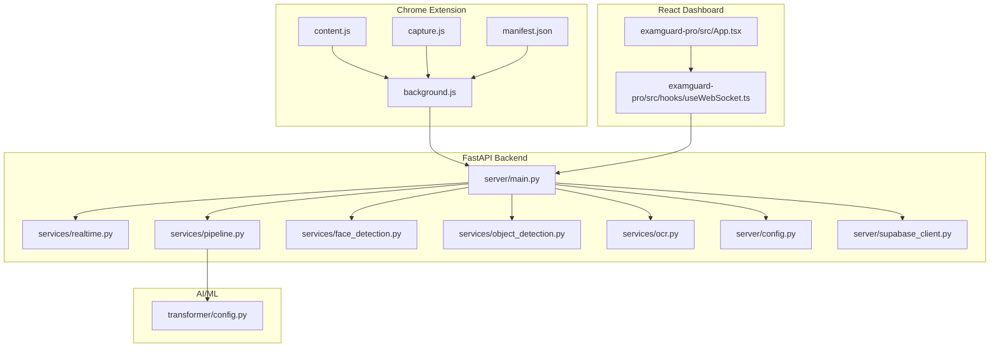
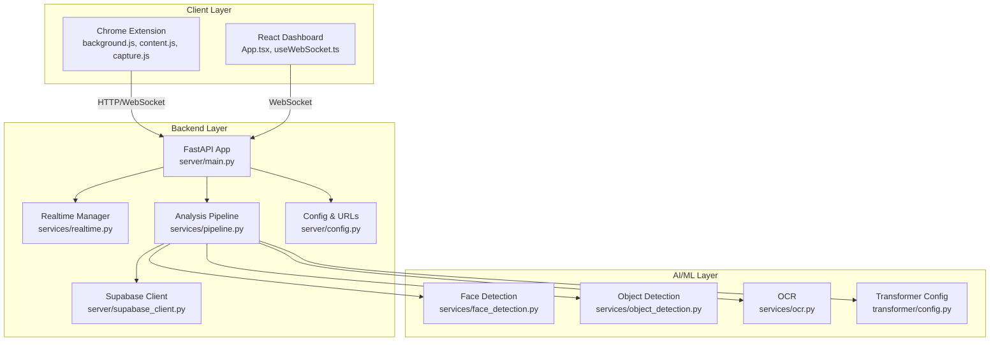
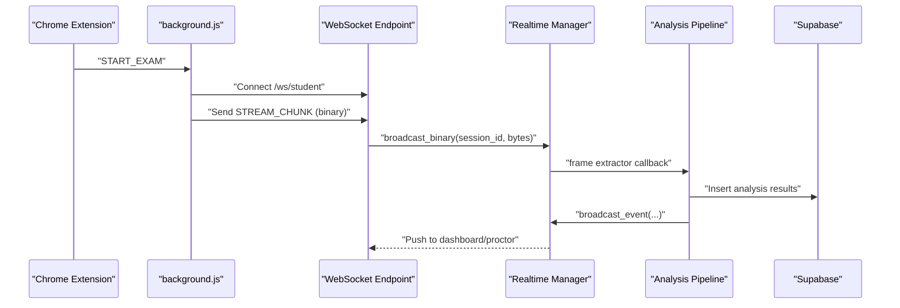
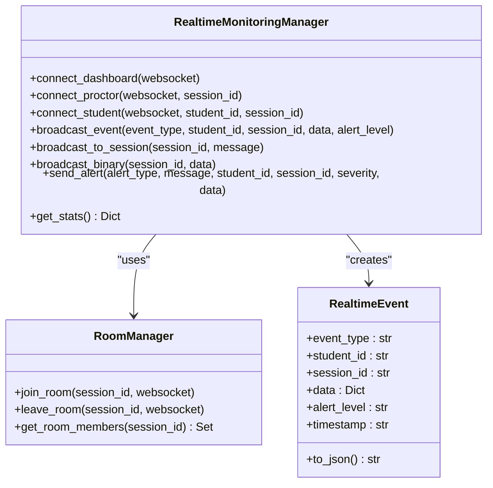
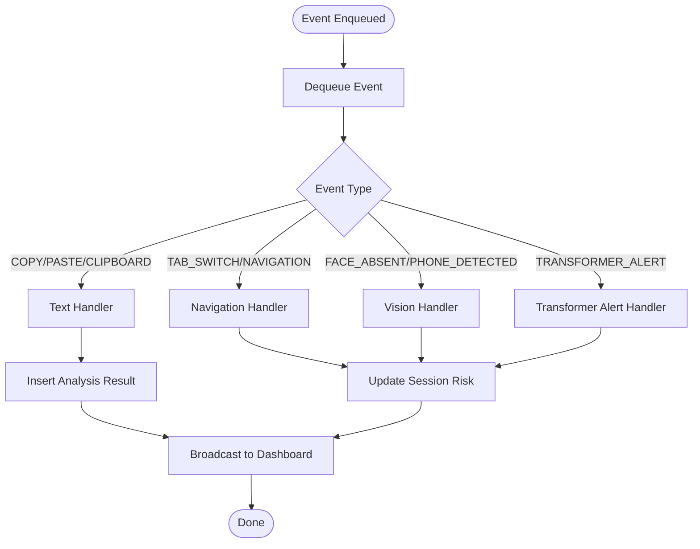
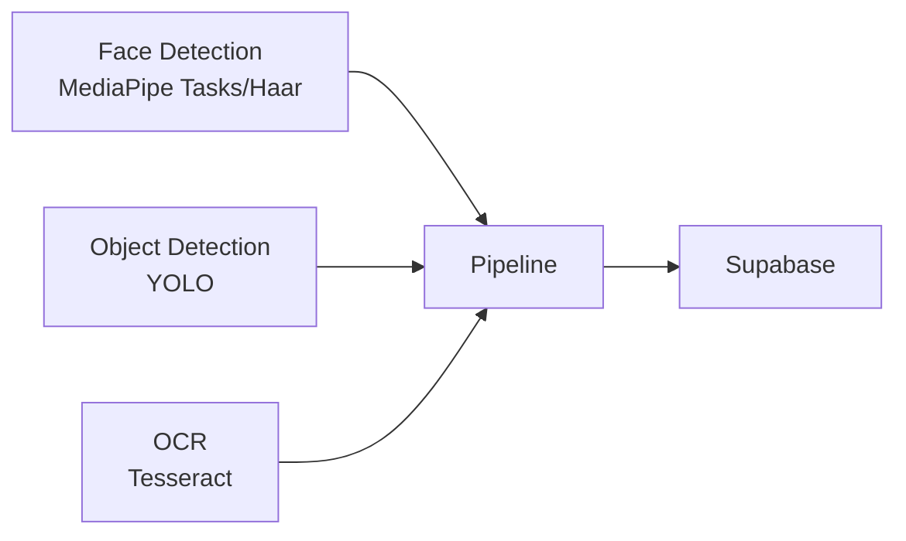
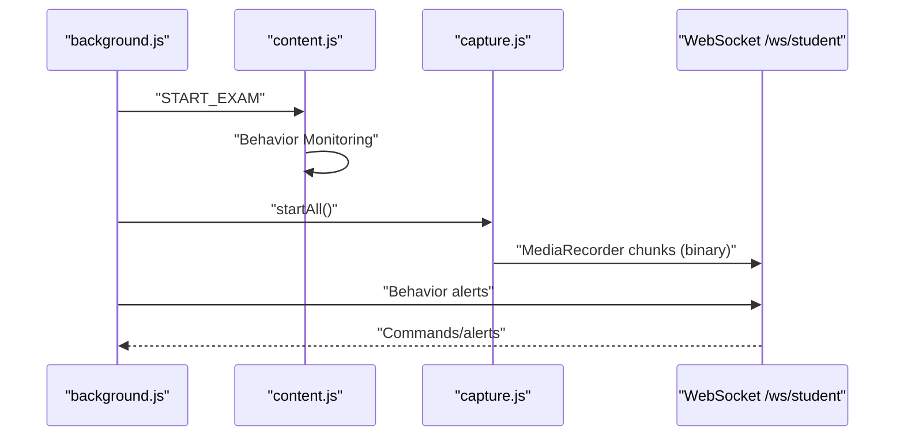
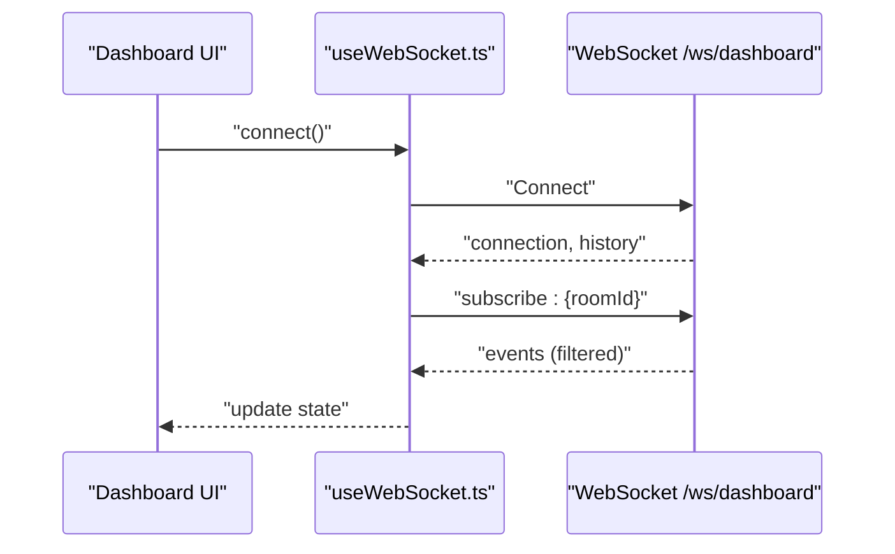
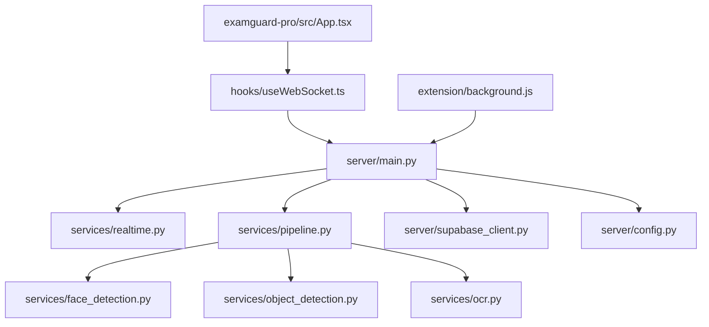

# Architecture & Design

<cite>
**Referenced Files in This Document**
- [server/main.py](file://server/main.py)
- [server/config.py](file://server/config.py)
- [server/supabase_client.py](file://server/supabase_client.py)
- [server/services/realtime.py](file://server/services/realtime.py)
- [server/services/pipeline.py](file://server/services/pipeline.py)
- [server/services/face_detection.py](file://server/services/face_detection.py)
- [server/services/object_detection.py](file://server/services/object_detection.py)
- [server/services/ocr.py](file://server/services/ocr.py)
- [extension/manifest.json](file://extension/manifest.json)
- [extension/background.js](file://extension/background.js)
- [extension/content.js](file://extension/content.js)
- [extension/capture.js](file://extension/capture.js)
- [examguard-pro/src/App.tsx](file://examguard-pro/src/App.tsx)
- [examguard-pro/src/hooks/useWebSocket.ts](file://examguard-pro/src/hooks/useWebSocket.ts)
- [transformer/config.py](file://transformer/config.py)
</cite>

## Table of Contents
1. [Introduction](#introduction)
2. [Project Structure](#project-structure)
3. [Core Components](#core-components)
4. [Architecture Overview](#architecture-overview)
5. [Detailed Component Analysis](#detailed-component-analysis)
6. [Dependency Analysis](#dependency-analysis)
7. [Performance Considerations](#performance-considerations)
8. [Troubleshooting Guide](#troubleshooting-guide)
9. [Conclusion](#conclusion)
10. [Appendices](#appendices)

## Introduction
ExamGuard Pro is a multi-layered exam proctoring system integrating a FastAPI backend, a React dashboard, a Chrome Extension (Manifest V3), and AI/ML services. It implements a microservices-style backend architecture with real-time WebSocket communication and an event-driven processing pipeline. The system captures browser behavior, performs face detection, OCR analysis, object detection, and optional transformer-based NLP analysis, and streams real-time updates to the dashboard and proctor clients.

## Project Structure
The repository is organized into four primary layers:
- Backend API (FastAPI): Central orchestration, WebSocket endpoints, real-time monitoring, and event pipeline.
- Chrome Extension (Manifest V3): Captures screen/webcam streams, monitors behavior, and communicates with the backend via WebSocket and HTTP.
- React Dashboard: SPA dashboard with real-time WebSocket updates and session management.
- AI/ML Services: Face detection, OCR, object detection, and optional transformer analysis.

**Diagram sources**
- [server/main.py:170-480](file://server/main.py#L170-L480)
- [server/services/realtime.py:102-642](file://server/services/realtime.py#L102-L642)
- [server/services/pipeline.py:9-342](file://server/services/pipeline.py#L9-L342)
- [server/services/face_detection.py:27-109](file://server/services/face_detection.py#L27-L109)
- [server/services/object_detection.py:16-147](file://server/services/object_detection.py#L16-L147)
- [server/services/ocr.py:20-121](file://server/services/ocr.py#L20-L121)
- [extension/background.js:1-200](file://extension/background.js#L1-L200)
- [extension/content.js:1-200](file://extension/content.js#L1-L200)
- [extension/capture.js:1-200](file://extension/capture.js#L1-L200)
- [extension/manifest.json:1-73](file://extension/manifest.json#L1-L73)
- [examguard-pro/src/App.tsx:67-92](file://examguard-pro/src/App.tsx#L67-L92)
- [examguard-pro/src/hooks/useWebSocket.ts:18-78](file://examguard-pro/src/hooks/useWebSocket.ts#L18-L78)
- [transformer/config.py:10-75](file://transformer/config.py#L10-L75)

**Section sources**
- [server/main.py:170-480](file://server/main.py#L170-L480)
- [extension/manifest.json:1-73](file://extension/manifest.json#L1-L73)
- [examguard-pro/src/App.tsx:67-92](file://examguard-pro/src/App.tsx#L67-L92)

## Core Components
- FastAPI Backend
  - WebSocket endpoints for dashboard, proctor, and student communications.
  - Real-time monitoring manager supporting rooms, alerts, and event history.
  - Event-driven analysis pipeline integrating face detection, OCR, object detection, and optional transformer analysis.
  - Supabase client for database and real-time features.
- Chrome Extension (Manifest V3)
  - Background script orchestrating session lifecycle, periodic sync, and WebRTC signaling.
  - Content script monitoring behavior, overlays, and clipboard events.
  - Capture module managing screen/webcam streams and MediaRecorder-based live streaming.
- React Dashboard
  - SPA with protected routes, sidebar/header, and bottom navigation.
  - WebSocket hook for real-time updates and subscription to specific exam rooms.
- AI/ML Services
  - Face detection using MediaPipe Tasks or Haar cascades.
  - Object detection using YOLO (optional).
  - OCR using Tesseract (optional).
  - Transformer configuration for NLP analysis.

**Section sources**
- [server/main.py:170-480](file://server/main.py#L170-L480)
- [server/services/realtime.py:102-642](file://server/services/realtime.py#L102-L642)
- [server/services/pipeline.py:9-342](file://server/services/pipeline.py#L9-L342)
- [server/services/face_detection.py:27-109](file://server/services/face_detection.py#L27-L109)
- [server/services/object_detection.py:16-147](file://server/services/object_detection.py#L16-L147)
- [server/services/ocr.py:20-121](file://server/services/ocr.py#L20-L121)
- [extension/background.js:1-200](file://extension/background.js#L1-L200)
- [extension/content.js:1-200](file://extension/content.js#L1-L200)
- [extension/capture.js:1-200](file://extension/capture.js#L1-L200)
- [examguard-pro/src/App.tsx:67-92](file://examguard-pro/src/App.tsx#L67-L92)
- [examguard-pro/src/hooks/useWebSocket.ts:18-78](file://examguard-pro/src/hooks/useWebSocket.ts#L18-L78)
- [transformer/config.py:10-75](file://transformer/config.py#L10-L75)

## Architecture Overview
The system follows a microservices-style backend with FastAPI, real-time WebSocket communication, and an event-driven pipeline. The Chrome Extension acts as the data acquisition layer, capturing browser behavior, screenshots, webcam frames, and live streams. The backend processes events asynchronously, updates session risk scores, and broadcasts real-time alerts to the dashboard and proctors. Supabase provides database persistence and real-time capabilities.

**Diagram sources**
- [server/main.py:170-480](file://server/main.py#L170-L480)
- [server/services/realtime.py:102-642](file://server/services/realtime.py#L102-L642)
- [server/services/pipeline.py:9-342](file://server/services/pipeline.py#L9-L342)
- [server/services/face_detection.py:27-109](file://server/services/face_detection.py#L27-L109)
- [server/services/object_detection.py:16-147](file://server/services/object_detection.py#L16-L147)
- [server/services/ocr.py:20-121](file://server/services/ocr.py#L20-L121)
- [server/supabase_client.py:10-22](file://server/supabase_client.py#L10-L22)
- [server/config.py:16-205](file://server/config.py#L16-L205)
- [extension/background.js:1-200](file://extension/background.js#L1-L200)
- [examguard-pro/src/hooks/useWebSocket.ts:18-78](file://examguard-pro/src/hooks/useWebSocket.ts#L18-L78)
- [transformer/config.py:10-75](file://transformer/config.py#L10-L75)

## Detailed Component Analysis

### Backend API (FastAPI)
- Responsibilities
  - Expose REST endpoints and WebSocket endpoints for dashboard, proctor, and student.
  - Initialize AI engines (SecureVision, Gaze service) and the analysis pipeline.
  - Serve React build assets and SPA fallback.
  - Health checks and pipeline statistics.
- Key Endpoints and WebSocket Routes
  - GET /api/health-check, /health, /api/pipeline/stats, /api
  - WebSocket /ws/alerts, /ws/dashboard, /ws/proctor/{session_id}, /ws/student
- Real-time Broadcasting
  - Uses RealtimeMonitoringManager to manage rooms, alerts, and event history.
  - Supports binary streaming for live webcam feeds.

**Diagram sources**
- [server/main.py:393-473](file://server/main.py#L393-L473)
- [server/services/realtime.py:310-329](file://server/services/realtime.py#L310-L329)
- [server/services/pipeline.py:74-96](file://server/services/pipeline.py#L74-L96)

**Section sources**
- [server/main.py:170-480](file://server/main.py#L170-L480)
- [server/services/realtime.py:102-642](file://server/services/realtime.py#L102-L642)
- [server/services/pipeline.py:9-342](file://server/services/pipeline.py#L9-L342)

### Real-time Monitoring Manager
- Responsibilities
  - Manage WebSocket connections for dashboards, proctors, and students.
  - Support multi-room broadcasting and session-specific subscriptions.
  - Maintain event history and emit alerts with severity levels.
  - Process live video chunks and trigger AI callbacks.
- Data Structures
  - RoomManager: maps session_id to sets of WebSocket connections.
  - RealtimeEvent: structured event with type, severity, and timestamp.
  - Stats: counts of events sent, alerts, and connections.

**Diagram sources**
- [server/services/realtime.py:102-642](file://server/services/realtime.py#L102-L642)

**Section sources**
- [server/services/realtime.py:102-642](file://server/services/realtime.py#L102-L642)

### Analysis Pipeline
- Responsibilities
  - Asynchronous event processing via asyncio Queue.
  - Route events to specialized handlers (navigation, text, vision).
  - Update session risk scores and broadcast real-time updates.
  - Insert analysis results into Supabase.
- Handlers
  - Text events: optional transformer analysis and similarity scoring.
  - Navigation events: URL categorization and risk impact.
  - Vision events: face absence and phone detection.
  - Transformer alerts: plagiarism detection triggers.

**Diagram sources**
- [server/services/pipeline.py:74-332](file://server/services/pipeline.py#L74-L332)

**Section sources**
- [server/services/pipeline.py:9-342](file://server/services/pipeline.py#L9-L342)

### AI/ML Components
- Face Detection
  - MediaPipe Tasks API with fallback to Haar cascades.
  - Detects multiple faces, face absence violations, and outputs detections.
- Object Detection
  - YOLO-based detector for phones, books, laptops, watches, remotes, keyboards, mice.
  - Low-light enhancement via CLAHE.
- OCR
  - Tesseract-based text extraction and forbidden keyword detection.
  - Fallback mode when Tesseract is unavailable.

**Diagram sources**
- [server/services/face_detection.py:27-109](file://server/services/face_detection.py#L27-L109)
- [server/services/object_detection.py:16-147](file://server/services/object_detection.py#L16-L147)
- [server/services/ocr.py:20-121](file://server/services/ocr.py#L20-L121)
- [server/services/pipeline.py:74-332](file://server/services/pipeline.py#L74-L332)

**Section sources**
- [server/services/face_detection.py:27-109](file://server/services/face_detection.py#L27-L109)
- [server/services/object_detection.py:16-147](file://server/services/object_detection.py#L16-L147)
- [server/services/ocr.py:20-121](file://server/services/ocr.py#L20-L121)

### Chrome Extension (Manifest V3)
- Background Script
  - Manages exam session lifecycle, retries, and periodic sync.
  - Browsing tracker for URL classification, risk/effort scoring, and tab audits.
  - WebRTC signaling and binary stream relay to backend WebSocket.
- Content Script
  - Behavior monitoring (keystrokes, paste, mouse movement, devtools).
  - Overlay and iframe detection for cheating tools.
- Capture Module
  - Screen/webcam capture with adaptive quality.
  - MediaRecorder-based live streaming and WebRTC offer/answer.

**Diagram sources**
- [extension/background.js:52-166](file://extension/background.js#L52-L166)
- [extension/content.js:367-381](file://extension/content.js#L367-L381)
- [extension/capture.js:207-246](file://extension/capture.js#L207-L246)
- [server/main.py:393-473](file://server/main.py#L393-L473)

**Section sources**
- [extension/background.js:1-200](file://extension/background.js#L1-L200)
- [extension/content.js:1-200](file://extension/content.js#L1-L200)
- [extension/capture.js:1-200](file://extension/capture.js#L1-L200)

### React Dashboard
- App Routing
  - Protected routes and nested layout with sidebar, header, and bottom navigation.
- WebSocket Integration
  - useWebSocket hook connects to /ws/dashboard, subscribes to rooms, and handles reconnection.

**Diagram sources**
- [examguard-pro/src/App.tsx:67-92](file://examguard-pro/src/App.tsx#L67-L92)
- [examguard-pro/src/hooks/useWebSocket.ts:18-78](file://examguard-pro/src/hooks/useWebSocket.ts#L18-L78)
- [server/main.py:274-342](file://server/main.py#L274-L342)

**Section sources**
- [examguard-pro/src/App.tsx:67-92](file://examguard-pro/src/App.tsx#L67-L92)
- [examguard-pro/src/hooks/useWebSocket.ts:18-78](file://examguard-pro/src/hooks/useWebSocket.ts#L18-L78)

## Dependency Analysis
- Backend Dependencies
  - FastAPI app depends on RealtimeMonitoringManager, AnalysisPipeline, AI engines, Supabase client, and configuration.
  - Pipeline depends on Supabase for database writes and realtime manager for broadcasting.
- Frontend Dependencies
  - Dashboard depends on WebSocket hook and FastAPI backend for real-time updates.
- Extension Dependencies
  - Background script depends on browsing tracker, WebRTC signaling, and WebSocket endpoints.
  - Content script depends on behavior monitoring and overlay detection.
- AI/ML Dependencies
  - Face detection and object detection are integrated into the pipeline and realtime callbacks.

**Diagram sources**
- [server/main.py:170-480](file://server/main.py#L170-L480)
- [server/services/realtime.py:102-642](file://server/services/realtime.py#L102-L642)
- [server/services/pipeline.py:9-342](file://server/services/pipeline.py#L9-L342)
- [server/supabase_client.py:10-22](file://server/supabase_client.py#L10-L22)
- [server/config.py:16-205](file://server/config.py#L16-L205)
- [examguard-pro/src/App.tsx:67-92](file://examguard-pro/src/App.tsx#L67-L92)
- [examguard-pro/src/hooks/useWebSocket.ts:18-78](file://examguard-pro/src/hooks/useWebSocket.ts#L18-L78)
- [extension/background.js:1-200](file://extension/background.js#L1-L200)

**Section sources**
- [server/main.py:170-480](file://server/main.py#L170-L480)
- [server/services/realtime.py:102-642](file://server/services/realtime.py#L102-L642)
- [server/services/pipeline.py:9-342](file://server/services/pipeline.py#L9-L342)
- [server/supabase_client.py:10-22](file://server/supabase_client.py#L10-L22)
- [server/config.py:16-205](file://server/config.py#L16-L205)
- [examguard-pro/src/App.tsx:67-92](file://examguard-pro/src/App.tsx#L67-L92)
- [examguard-pro/src/hooks/useWebSocket.ts:18-78](file://examguard-pro/src/hooks/useWebSocket.ts#L18-L78)
- [extension/background.js:1-200](file://extension/background.js#L1-L200)

## Performance Considerations
- Real-time Streaming
  - MediaRecorder configured with VP8 and moderate bitrate to balance quality and bandwidth.
  - Binary broadcasting to dashboards and proctors; ensure efficient consumers to avoid backlog.
- Async Processing
  - Pipeline uses asyncio queues and workers; tune queue sizes and worker concurrency for throughput.
- AI Engines
  - Face detection and object detection include throttling and pre-processing (CLAHE) to reduce computational overhead.
  - Optional transformers require GPU acceleration for optimal performance.
- Database Writes
  - Batch updates and careful indexing on Supabase improve write performance; monitor query latency.

[No sources needed since this section provides general guidance]

## Troubleshooting Guide
- WebSocket Connectivity
  - Verify WebSocket endpoints and room subscriptions; use heartbeat messages to keep connections alive.
  - Check reconnection logic and exponential backoff in the dashboard hook.
- Extension Lifecycle
  - Ensure background script properly initializes session and relays binary chunks; handle WebRTC signaling errors.
  - Monitor behavior alerts and overlay detections; confirm permissions for screen/webcam capture.
- AI/ML Availability
  - Confirm MediaPipe Tasks model download and fallback to Haar cascades.
  - Validate YOLO weights and Tesseract installation; fallback modes should still process events.
- Supabase Integration
  - Confirm environment variables for Supabase URL and key; verify table access and row-level security policies.

**Section sources**
- [server/main.py:274-342](file://server/main.py#L274-L342)
- [server/services/realtime.py:538-576](file://server/services/realtime.py#L538-L576)
- [server/services/face_detection.py:11-26](file://server/services/face_detection.py#L11-L26)
- [server/services/object_detection.py:16-42](file://server/services/object_detection.py#L16-L42)
- [server/services/ocr.py:10-18](file://server/services/ocr.py#L10-L18)
- [server/supabase_client.py:10-22](file://server/supabase_client.py#L10-L22)

## Conclusion
ExamGuard Pro integrates a robust microservices-style backend with real-time WebSocket communication and an event-driven pipeline. The Chrome Extension captures comprehensive behavioral and visual signals, while the React Dashboard provides live monitoring and insights. AI/ML components enhance detection fidelity, and Supabase ensures scalable persistence and real-time features. The architecture supports extensibility, maintainability, and operational resilience across diverse deployment environments.

[No sources needed since this section summarizes without analyzing specific files]

## Appendices
- Infrastructure Requirements
  - FastAPI backend with Uvicorn; WebSocket-capable reverse proxy (e.g., Nginx).
  - Supabase for PostgreSQL, storage, and real-time subscriptions.
  - Optional GPU resources for transformer and object detection models.
- Deployment Topology
  - Single containerized backend with static asset serving; separate CDN for React assets.
  - Horizontal scaling via multiple backend instances behind a load balancer; ensure sticky sessions for WebSocket endpoints if needed.
- Scalability Considerations
  - Use async workers and queues for event processing; shard sessions across instances.
  - Optimize AI inference with caching and batching; provision adequate compute for live streams.

[No sources needed since this section provides general guidance]