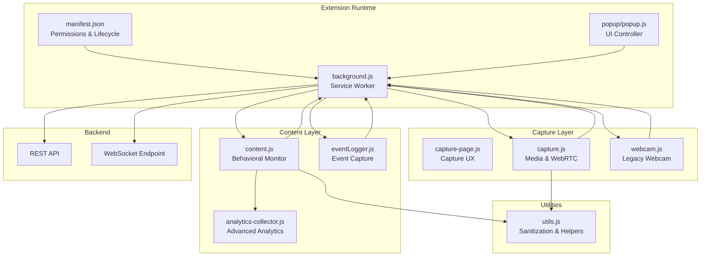
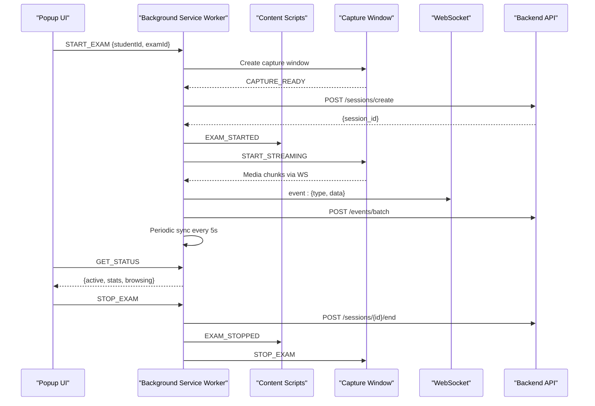
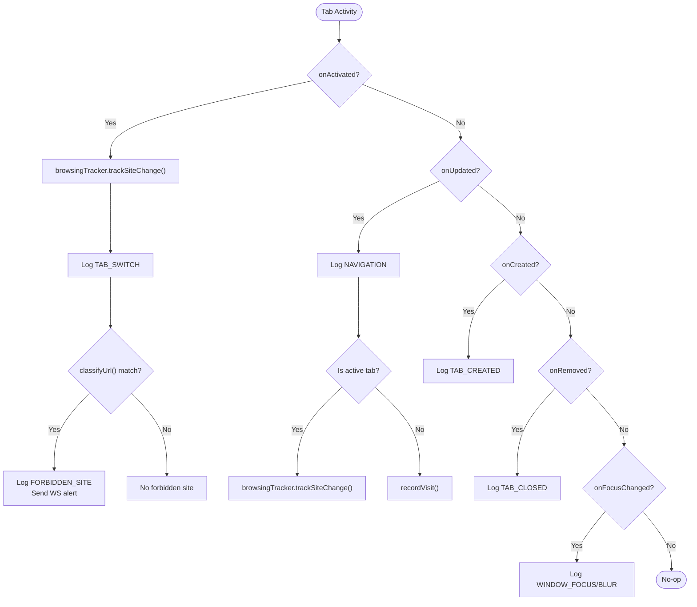
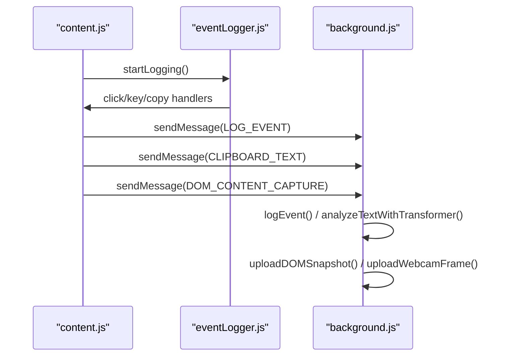
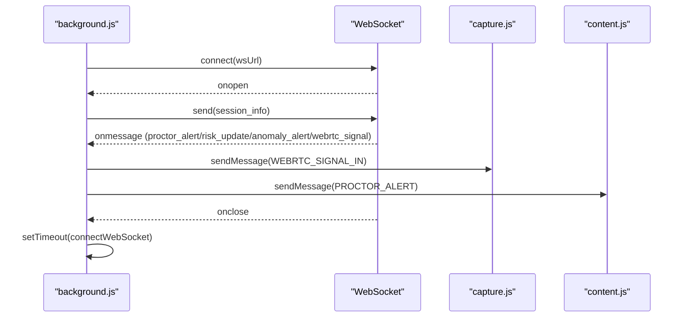
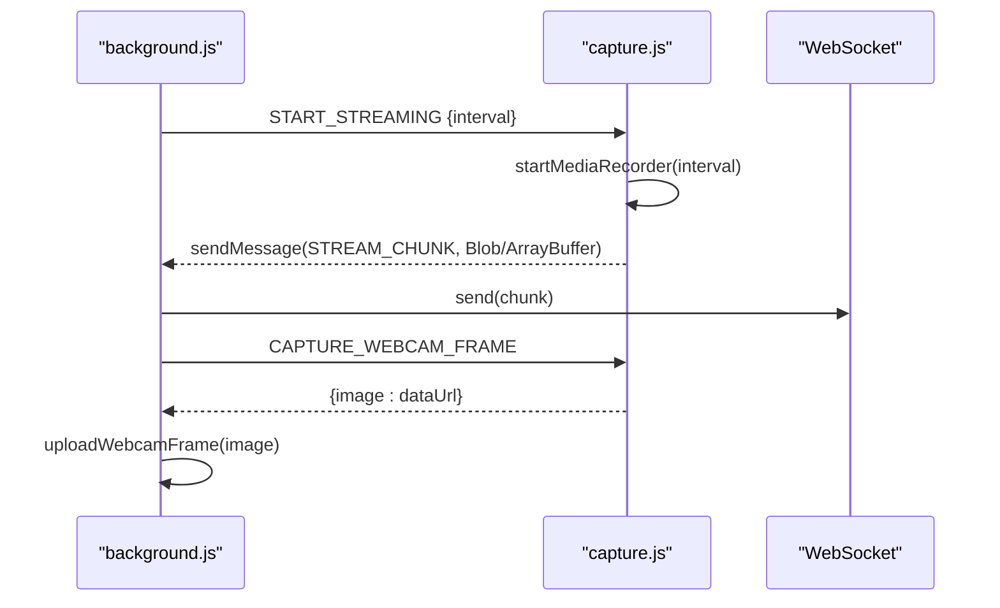
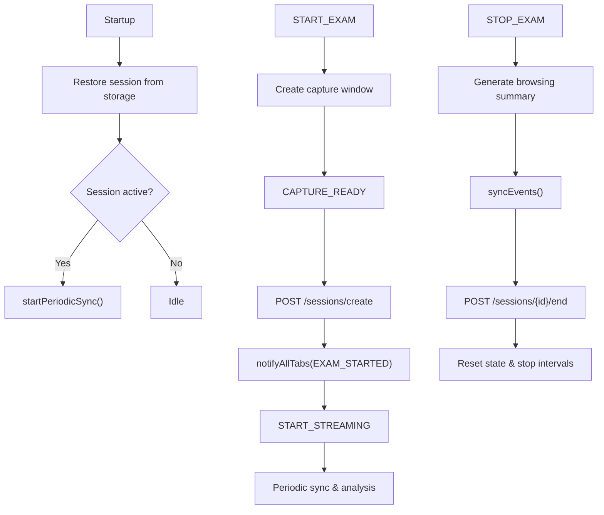
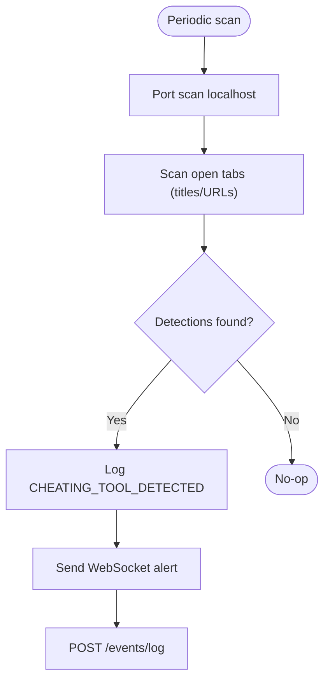
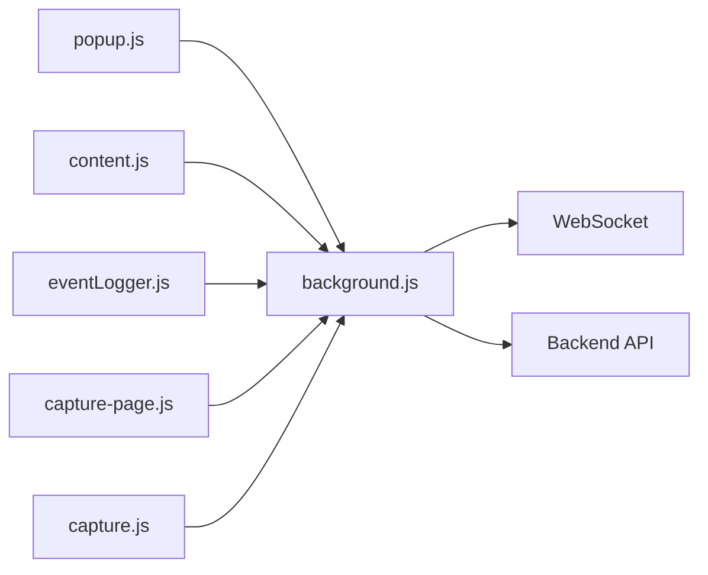
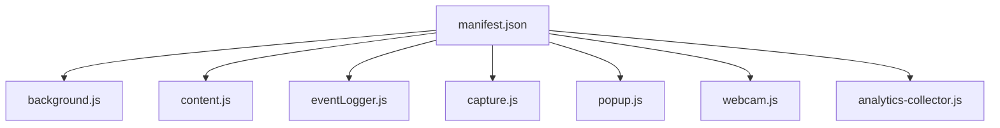

# Background Script Architecture

<cite>
**Referenced Files in This Document**
- [background.js](file://extension/background.js)
- [manifest.json](file://extension/manifest.json)
- [content.js](file://extension/content.js)
- [eventLogger.js](file://extension/eventLogger.js)
- [utils.js](file://extension/utils.js)
- [capture.js](file://extension/capture.js)
- [capture-page.js](file://extension/capture-page.js)
- [popup.js](file://extension/popup/popup.js)
- [webcam.js](file://extension/webcam.js)
- [analytics-collector.js](file://extension/analytics-collector.js)
</cite>

## Table of Contents
1. [Introduction](#introduction)
2. [Project Structure](#project-structure)
3. [Core Components](#core-components)
4. [Architecture Overview](#architecture-overview)
5. [Detailed Component Analysis](#detailed-component-analysis)
6. [Dependency Analysis](#dependency-analysis)
7. [Performance Considerations](#performance-considerations)
8. [Troubleshooting Guide](#troubleshooting-guide)
9. [Conclusion](#conclusion)

## Introduction
This document explains the Chrome extension background script architecture that orchestrates secure exam proctoring. The background script acts as the central coordinator for:
- Tab monitoring and navigation event logging
- Event capture from content scripts and popup
- WebSocket communication with the backend
- Media capture orchestration via a dedicated capture window
- Persistent state management and periodic synchronization
- Anti-cheating detection and security enforcement

It integrates tightly with content scripts, event logging utilities, and the extension manifest to define permissions and lifecycle.

## Project Structure
The extension’s background architecture spans several modules:
- Background service worker coordinating all activities
- Content scripts performing behavioral and anti-cheating monitoring
- Event logging utilities capturing user interactions
- Capture modules managing screen/webcam streams and WebRTC signaling
- Popup UI for session control and status
- Utilities for URL sanitization and shared helpers

**Diagram sources**
- [background.js:1-2003](file://extension/background.js#L1-L2003)
- [manifest.json:1-73](file://extension/manifest.json#L1-L73)
- [content.js:1-473](file://extension/content.js#L1-L473)
- [eventLogger.js:1-111](file://extension/eventLogger.js#L1-L111)
- [capture.js:1-352](file://extension/capture.js#L1-L352)
- [capture-page.js:1-171](file://extension/capture-page.js#L1-L171)
- [popup.js:1-490](file://extension/popup/popup.js#L1-L490)
- [webcam.js:1-90](file://extension/webcam.js#L1-L90)
- [utils.js:1-35](file://extension/utils.js#L1-L35)
- [analytics-collector.js:1-610](file://extension/analytics-collector.js#L1-L610)

**Section sources**
- [manifest.json:1-73](file://extension/manifest.json#L1-L73)

## Core Components
- Background Service Worker: Central coordinator for messaging, tab monitoring, event logging, WebSocket, periodic sync, and anti-cheating detection.
- Content Scripts: Behavioral monitoring, anti-cheating scanning, audio monitoring, and event forwarding.
- Event Logger: Captures clicks, typing, copy/paste, and visibility changes; forwards to background.
- Capture Modules: Screen/webcam capture, MediaRecorder streaming, WebRTC signaling, and frame capture.
- Popup UI: Session control, health checks, and real-time stats.
- Utilities: URL sanitization and shared helpers.

**Section sources**
- [background.js:1-2003](file://extension/background.js#L1-L2003)
- [content.js:1-473](file://extension/content.js#L1-L473)
- [eventLogger.js:1-111](file://extension/eventLogger.js#L1-L111)
- [capture.js:1-352](file://extension/capture.js#L1-L352)
- [capture-page.js:1-171](file://extension/capture-page.js#L1-L171)
- [popup.js:1-490](file://extension/popup/popup.js#L1-L490)
- [utils.js:1-35](file://extension/utils.js#L1-L35)

## Architecture Overview
The background script coordinates a multi-layered monitoring pipeline:
- Messaging: Content scripts and popup communicate via chrome.runtime.sendMessage with the background.
- Tab Monitoring: Uses chrome.tabs APIs to detect tab switches, navigation, creation, removal, and window focus changes.
- Event Logging: Aggregates events locally and syncs to backend; also streams critical events via WebSocket.
- Media Capture: Orchestrates screen/webcam capture via a dedicated capture window and MediaRecorder/WebRTC.
- Anti-Cheating: Scans for cheating tools via port scans, window/tab titles, and URL patterns.
- Persistence: Uses chrome.storage.local to persist session state and cleans event buffers to prevent memory leaks.

**Diagram sources**
- [background.js:686-944](file://extension/background.js#L686-L944)
- [popup.js:343-423](file://extension/popup/popup.js#L343-L423)
- [capture-page.js:76-102](file://extension/capture-page.js#L76-L102)
- [capture.js:207-246](file://extension/capture.js#L207-L246)

## Detailed Component Analysis

### Background Service Worker
Responsibilities:
- Session lifecycle: start/stop exam, enforce lockdown, manage capture window, and device fingerprinting.
- Tab monitoring: track tab activation, navigation, creation, removal, and window focus changes; update browsing tracker and log events.
- Event logging: enqueue events, maintain counters, and trigger periodic sync.
- WebSocket: connect to backend, forward events, and handle server commands.
- Media orchestration: coordinate MediaRecorder streaming and WebRTC signaling from the capture window.
- Anti-cheating: scan for local servers and suspicious tabs/windows.
- Persistence: save/load session state to/from chrome.storage.local.

Key mechanisms:
- Message routing: onMessage listener handles START_EXAM, CAPTURE_READY, STOP_EXAM, LOG_EVENT, GET_STATUS, CLIPBOARD_TEXT, DOM_CONTENT_CAPTURE, BEHAVIOR_ALERT, WEBRTC_SIGNAL_OUT, STREAM_CHUNK, WEBCAM_CAPTURE, and unknown types.
- Tab monitoring: onActivated, onUpdated, onCreated, onRemoved, onFocusChanged; updates browsingTracker and logs categorized events.
- Browsing Tracker: maintains active site, time by category, visited sites, open tabs, and calculates risk/effort scores.
- Periodic sync: every 5s syncs events and sends browsing summary; every 15s runs transformer analysis on clipboard text.
- WebSocket: reconnects automatically; handles proctor alerts, risk updates, anomaly alerts, and WebRTC signals.

Security and safety:
- Memory leak prevention: trims event buffer to last 50 items.
- Robustness: retries session creation with bounded attempts; debounced fullscreen checks; safe sendMessage wrappers.

**Section sources**
- [background.js:52-169](file://extension/background.js#L52-L169)
- [background.js:948-1126](file://extension/background.js#L948-L1126)
- [background.js:1194-1228](file://extension/background.js#L1194-L1228)
- [background.js:1408-1444](file://extension/background.js#L1408-L1444)
- [background.js:1448-1502](file://extension/background.js#L1448-L1502)
- [background.js:1657-1704](file://extension/background.js#L1657-L1704)
- [background.js:1706-1750](file://extension/background.js#L1706-L1750)
- [background.js:1854-2002](file://extension/background.js#L1854-L2002)

### Tab Monitoring and Navigation Events
- Activation: onActivated triggers browsingTracker.update and logs TAB_SWITCH; classifies forbidden sites and sends WebSocket alerts.
- Updates: onUpdated logs NAVIGATION; records visits for background tabs; classifies and logs forbidden sites.
- Creation/Removal: onCreated logs TAB_CREATED; onRemoved logs TAB_CLOSED and removes from open tabs.
- Window focus: onFocusChanged logs WINDOW_BLUR/WINDOW_FOCUS.

**Diagram sources**
- [background.js:948-1126](file://extension/background.js#L948-L1126)

**Section sources**
- [background.js:948-1126](file://extension/background.js#L948-L1126)

### Event Capture Mechanisms
- EventLogger (content): Starts/stops logging clicks, keydown, copy/paste, visibility changes; forwards events to background via runtime.sendMessage.
- Content Monitor (content): Advanced behavioral monitoring including keystroke dynamics, paste detection, mouse movement entropy, DevTools detection, heartbeat, VPN detection, and audio monitoring.
- Clipboard and DOM snapshots: Background receives CLIPBOARD_TEXT and DOM_CONTENT_CAPTURE messages; queues for transformer analysis and OCR processing.

**Diagram sources**
- [eventLogger.js:10-95](file://extension/eventLogger.js#L10-L95)
- [content.js:367-381](file://extension/content.js#L367-L381)
- [background.js:1194-1228](file://extension/background.js#L1194-L1228)
- [background.js:1264-1301](file://extension/background.js#L1264-L1301)
- [background.js:1351-1384](file://extension/background.js#L1351-L1384)

**Section sources**
- [eventLogger.js:1-111](file://extension/eventLogger.js#L1-L111)
- [content.js:34-381](file://extension/content.js#L34-L381)
- [background.js:1194-1384](file://extension/background.js#L1194-L1384)

### WebSocket Communication Management
- Connection: Establishes WebSocket to backend with session context; auto-reconnects when disconnected.
- Bidirectional: Receives proctor alerts, risk updates, anomaly alerts, and WebRTC signals; forwards to capture window or content scripts.
- Event streaming: Sends event payloads prefixed with “event:” to backend in real-time.

**Diagram sources**
- [background.js:1448-1502](file://extension/background.js#L1448-L1502)
- [background.js:1504-1608](file://extension/background.js#L1504-L1608)
- [capture.js:335-348](file://extension/capture.js#L335-L348)

**Section sources**
- [background.js:1448-1608](file://extension/background.js#L1448-L1608)
- [capture.js:335-348](file://extension/capture.js#L335-L348)

### Media Capture Orchestration
- Capture Window: Dedicated window for screen/webcam capture and WebRTC signaling; communicates via runtime messages.
- MediaRecorder: Streams screen capture frames to background; background forwards binary chunks to WebSocket.
- WebRTC: Background routes SDP/ICE candidates to capture window; capture window initializes RTCPeerConnection and adds tracks.
- Frame capture: Background triggers webcam frame capture from capture window and uploads for analysis.

**Diagram sources**
- [background.js:837-846](file://extension/background.js#L837-L846)
- [capture.js:207-246](file://extension/capture.js#L207-L246)
- [capture.js:145-171](file://extension/capture.js#L145-L171)

**Section sources**
- [background.js:837-846](file://extension/background.js#L837-L846)
- [background.js:1332-1346](file://extension/background.js#L1332-L1346)
- [background.js:1351-1384](file://extension/background.js#L1351-L1384)
- [capture.js:207-246](file://extension/capture.js#L207-L246)
- [capture.js:145-171](file://extension/capture.js#L145-L171)

### Persistent State and Session Lifecycle
- Session state: Maintains active flag, session ID, timestamps, event counters, last captures, last sync, and risk/effort scores.
- Startup: Restores session from chrome.storage.local; cleans oversized event buffers.
- Start flow: Opens capture window, creates backend session, notifies tabs, starts periodic sync and live streaming, enforces lockdown.
- Stop flow: Adds browsing summary, performs final sync, ends backend session, resets state, stops intervals, closes capture window, notifies tabs.

**Diagram sources**
- [background.js:668-681](file://extension/background.js#L668-L681)
- [background.js:686-858](file://extension/background.js#L686-L858)
- [background.js:860-944](file://extension/background.js#L860-L944)
- [background.js:1408-1444](file://extension/background.js#L1408-L1444)

**Section sources**
- [background.js:22-48](file://extension/background.js#L22-L48)
- [background.js:668-681](file://extension/background.js#L668-L681)
- [background.js:686-944](file://extension/background.js#L686-L944)
- [background.js:1408-1444](file://extension/background.js#L1408-L1444)

### Anti-Cheating Detection
- Port scan: Checks localhost ports commonly used by cheating tools (e.g., Cluely/Vite dev servers).
- Window/tab scanning: Matches titles and URLs against known cheating tool patterns.
- Reporting: Logs CHEATING_TOOL_DETECTED events, sends WebSocket alerts, and posts to backend.

**Diagram sources**
- [background.js:1871-2002](file://extension/background.js#L1871-L2002)

**Section sources**
- [background.js:1832-2002](file://extension/background.js#L1832-L2002)

### Relationship Between Components and Data Flow
- Popup UI: Controls session start/stop, health checks, and displays stats; communicates via runtime.sendMessage.
- Content Scripts: Monitor behavior, detect overlays/cheating tools, and forward alerts; also capture analytics.
- Event Logger: Captures user interactions and forwards to background.
- Capture Window: Manages media streams and WebRTC; communicates with background for signaling and frame capture.
- Background: Coordinates all components, persists state, syncs events, and manages WebSocket.

**Diagram sources**
- [popup.js:343-423](file://extension/popup/popup.js#L343-L423)
- [content.js:367-381](file://extension/content.js#L367-L381)
- [eventLogger.js:101-110](file://extension/eventLogger.js#L101-L110)
- [capture-page.js:150-170](file://extension/capture-page.js#L150-L170)
- [capture.js:335-348](file://extension/capture.js#L335-L348)
- [background.js:1448-1502](file://extension/background.js#L1448-L1502)

**Section sources**
- [popup.js:1-490](file://extension/popup/popup.js#L1-L490)
- [content.js:1-473](file://extension/content.js#L1-L473)
- [eventLogger.js:1-111](file://extension/eventLogger.js#L1-L111)
- [capture-page.js:1-171](file://extension/capture-page.js#L1-L171)
- [capture.js:1-352](file://extension/capture.js#L1-L352)
- [background.js:1-2003](file://extension/background.js#L1-L2003)

## Dependency Analysis
- Permissions and lifecycle: manifest.json declares tabs, storage, notifications, scripting, windows, system.display, host_permissions, and service_worker.
- Content scripts: Injected into all http/https pages, run_at document_start, all_frames enabled.
- Web-accessible resources: Expose capture assets to all URLs.

**Diagram sources**
- [manifest.json:1-73](file://extension/manifest.json#L1-L73)

**Section sources**
- [manifest.json:1-73](file://extension/manifest.json#L1-L73)

## Performance Considerations
- Debouncing: Fullscreen checks use a debounce to reduce redundant computations.
- Interval tuning: Sync every 5s, transformer analysis every 15s, tab audit every 10s.
- Memory management: Event buffer trimmed to last 50 items; clipboard buffer cleared after batch analysis.
- Efficient filtering: Set-based filtering for synced events to minimize overhead.
- Media optimization: Reduced JPEG quality and targeted WebRTC/MediaRecorder options to balance fidelity and bandwidth.

[No sources needed since this section provides general guidance]

## Troubleshooting Guide
Common issues and remedies:
- Extension reload invalidates runtime context: Content scripts use safeSendMessage to detect “context invalidated” and stop monitoring.
- WebSocket disconnections: Background auto-reconnects; verify backend connectivity and session state.
- Media permissions denied: Capture window prompts for screen/webcam access; ensure permissions granted.
- Tab audit failures: Background catches and logs errors; verify tabs API permissions.
- Clipboard analysis timeouts: Transformer endpoints may be slow; adjust intervals or backend capacity.
- Anti-cheating detection false positives: Tune patterns and thresholds; validate against legitimate tools.

**Section sources**
- [content.js:5-26](file://extension/content.js#L5-L26)
- [background.js:1476-1490](file://extension/background.js#L1476-L1490)
- [background.js:1871-1939](file://extension/background.js#L1871-L1939)

## Conclusion
The background script architecture provides a robust, modular foundation for secure exam proctoring. It centralizes coordination among tab monitoring, event logging, media capture, and WebSocket communication while maintaining resilience through retries, debouncing, and memory-conscious design. Proper permission management, clear data flows, and comprehensive anti-cheating detection ensure reliable operation across diverse environments.