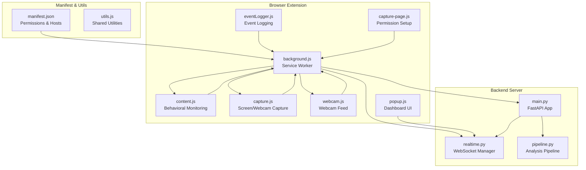
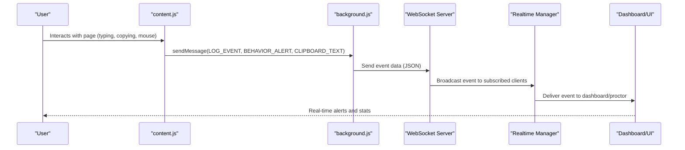
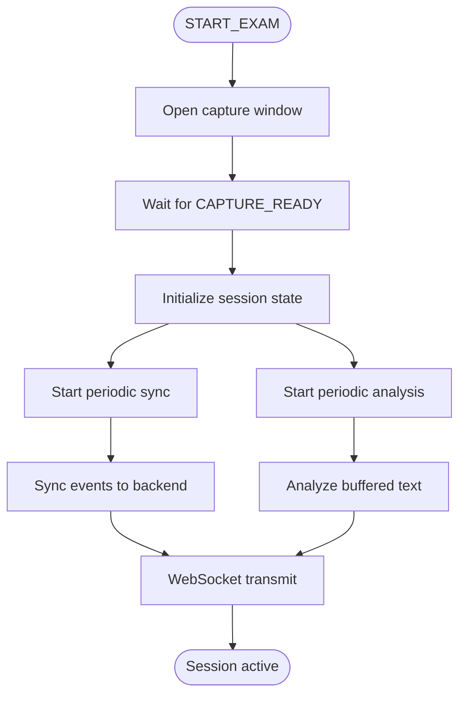
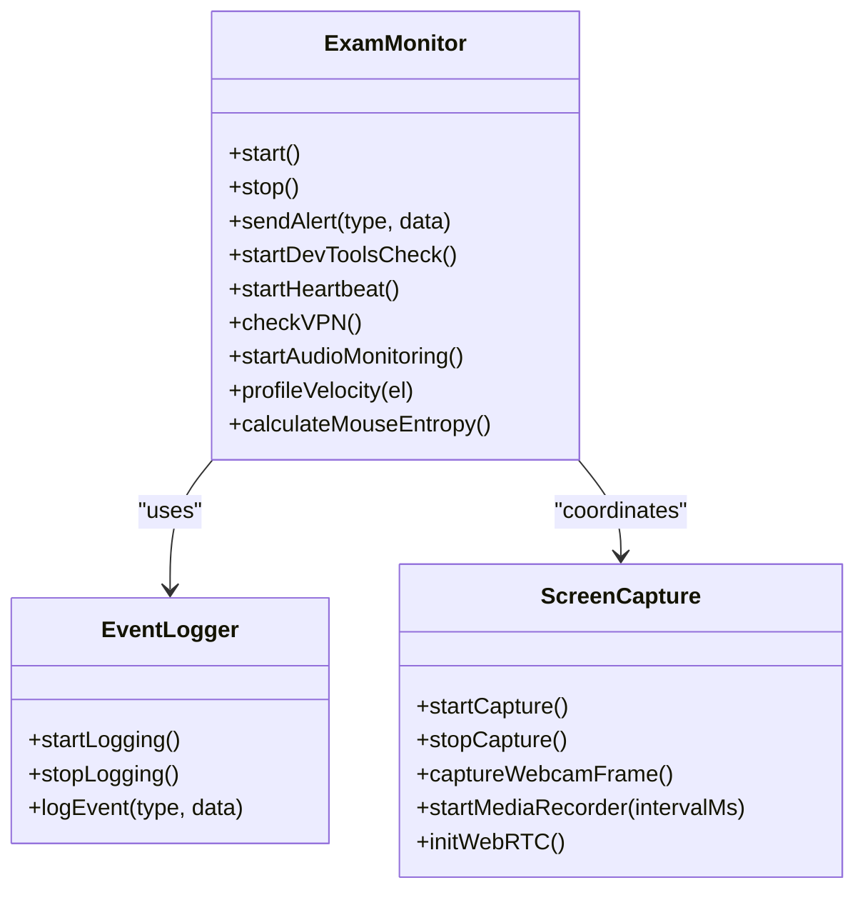
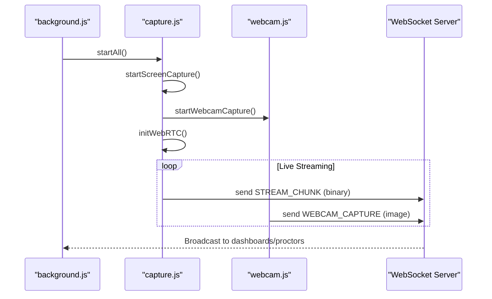
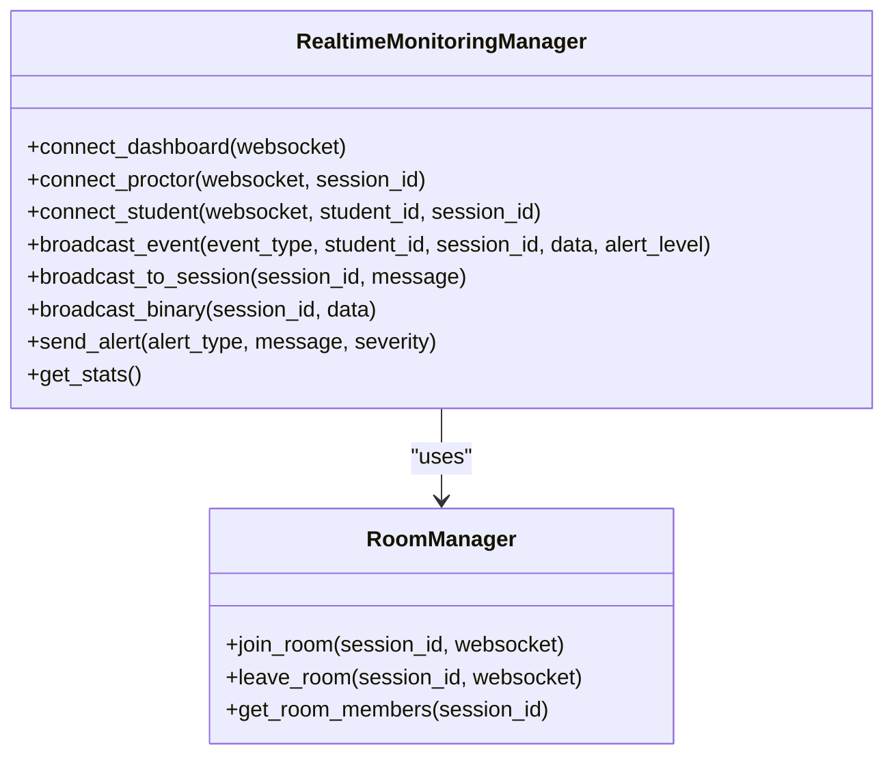
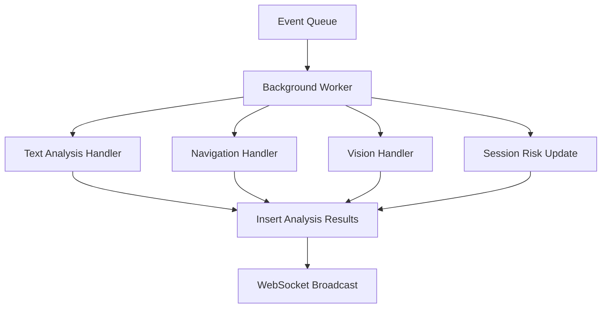
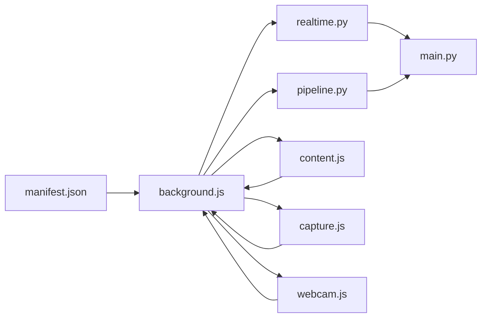

# Chrome Extension Integration

<cite>
**Referenced Files in This Document**
- [manifest.json](file://extension/manifest.json)
- [background.js](file://extension/background.js)
- [content.js](file://extension/content.js)
- [eventLogger.js](file://extension/eventLogger.js)
- [capture.js](file://extension/capture.js)
- [webcam.js](file://extension/webcam.js)
- [capture-page.js](file://extension/capture-page.js)
- [popup.js](file://extension/popup/popup.js)
- [main.py](file://server/main.py)
- [realtime.py](file://server/services/realtime.py)
- [pipeline.py](file://server/services/pipeline.py)
</cite>

## Table of Contents
1. [Introduction](#introduction)
2. [Project Structure](#project-structure)
3. [Core Components](#core-components)
4. [Architecture Overview](#architecture-overview)
5. [Detailed Component Analysis](#detailed-component-analysis)
6. [Dependency Analysis](#dependency-analysis)
7. [Performance Considerations](#performance-considerations)
8. [Troubleshooting Guide](#troubleshooting-guide)
9. [Conclusion](#conclusion)

## Introduction
This document explains the Chrome extension integration patterns used by ExamGuard Pro for secure online proctoring. It covers the extension's background script architecture, content script injection, event capture mechanisms, and real-time data transmission to the backend via WebSocket connections. It also documents the extension's permissions system, manifest configuration, security considerations, and integration with the AI analysis pipeline and RealtimeMonitoringManager.

## Project Structure
The extension integrates with a FastAPI backend that manages real-time monitoring, WebSocket broadcasting, and AI-powered analysis. The extension handles local data capture and communication with the backend, while the server coordinates real-time dashboards, proctor sessions, and persistent analysis results.

**Diagram sources**
- [manifest.json:1-73](file://extension/manifest.json#L1-L73)
- [background.js:1-2003](file://extension/background.js#L1-L2003)
- [content.js:1-473](file://extension/content.js#L1-L473)
- [eventLogger.js:1-111](file://extension/eventLogger.js#L1-L111)
- [capture.js:1-352](file://extension/capture.js#L1-L352)
- [webcam.js:1-90](file://extension/webcam.js#L1-L90)
- [capture-page.js:1-171](file://extension/capture-page.js#L1-L171)
- [popup.js:1-490](file://extension/popup/popup.js#L1-L490)
- [main.py:1-650](file://server/main.py#L1-L650)
- [realtime.py:1-643](file://server/services/realtime.py#L1-L643)
- [pipeline.py:1-345](file://server/services/pipeline.py#L1-L345)

**Section sources**
- [manifest.json:1-73](file://extension/manifest.json#L1-L73)
- [background.js:1-2003](file://extension/background.js#L1-L2003)
- [main.py:1-650](file://server/main.py#L1-L650)

## Core Components
- Background Service Worker: Orchestrates session lifecycle, manages WebSocket connections, buffers and transmits events, and coordinates media capture.
- Content Scripts: Injected into pages to monitor user behavior, capture screenshots, and relay events to the background.
- Capture Modules: Handle screen and webcam capture, WebRTC signaling, and live streaming to the backend.
- Realtime Monitoring Manager: Manages WebSocket connections, rooms, and event broadcasting to dashboards and proctors.
- Analysis Pipeline: Processes events asynchronously, performs AI analysis, and updates session state.

**Section sources**
- [background.js:1-2003](file://extension/background.js#L1-L2003)
- [content.js:1-473](file://extension/content.js#L1-L473)
- [capture.js:1-352](file://extension/capture.js#L1-L352)
- [realtime.py:1-643](file://server/services/realtime.py#L1-L643)
- [pipeline.py:1-345](file://server/services/pipeline.py#L1-L345)

## Architecture Overview
The extension establishes a multi-channel communication architecture:
- Background script receives messages from content scripts and capture modules.
- Events are serialized and transmitted via WebSocket to the backend.
- The backend's RealtimeMonitoringManager broadcasts events to dashboards and proctors.
- The Analysis Pipeline processes events asynchronously and updates session risk/engagement metrics.

**Diagram sources**
- [content.js:1-473](file://extension/content.js#L1-L473)
- [background.js:52-169](file://extension/background.js#L52-L169)
- [main.py:250-504](file://server/main.py#L250-L504)
- [realtime.py:334-403](file://server/services/realtime.py#L334-L403)

## Detailed Component Analysis

### Background Service Worker Architecture
The background script acts as the central coordinator:
- Handles extension lifecycle messages (START_EXAM, STOP_EXAM, CAPTURE_READY).
- Manages session state, event buffering, and periodic synchronization.
- Integrates with the RealtimeMonitoringManager for WebSocket operations.
- Coordinates media capture and WebRTC signaling.

**Diagram sources**
- [background.js:684-800](file://extension/background.js#L684-L800)
- [background.js:1-2003](file://extension/background.js#L1-L2003)

**Section sources**
- [background.js:1-2003](file://extension/background.js#L1-L2003)

### Content Script Injection and Behavior Monitoring
Content scripts are injected into all http/https pages and provide:
- Event logging for clicks, typing, copy/paste, and visibility changes.
- Advanced behavioral monitoring including keystroke dynamics, mouse movement analysis, and clipboard paste detection.
- Overlay detection for AI answer tools and iframe-based cheating tools.
- Audio monitoring via microphone access for anomaly detection.

**Diagram sources**
- [content.js:34-357](file://extension/content.js#L34-L357)
- [eventLogger.js:1-111](file://extension/eventLogger.js#L1-L111)
- [capture.js:6-352](file://extension/capture.js#L6-L352)

**Section sources**
- [content.js:1-473](file://extension/content.js#L1-L473)
- [eventLogger.js:1-111](file://extension/eventLogger.js#L1-L111)

### Media Capture and WebRTC Integration
The extension captures screen and webcam feeds and streams them to the backend:
- Screen capture uses getDisplayMedia with adaptive resolution.
- Webcam capture uses getUserMedia with configurable frame rate.
- MediaRecorder streams video chunks over WebSocket.
- WebRTC signaling enables peer-to-peer streaming coordination.

**Diagram sources**
- [capture.js:175-247](file://extension/capture.js#L175-L247)
- [webcam.js:10-57](file://extension/webcam.js#L10-L57)
- [main.py:394-477](file://server/main.py#L394-L477)

**Section sources**
- [capture.js:1-352](file://extension/capture.js#L1-L352)
- [webcam.js:1-90](file://extension/webcam.js#L1-L90)

### Realtime Monitoring and Dashboard Coordination
The backend's RealtimeMonitoringManager manages:
- WebSocket connections for dashboards, proctors, and students.
- Room-based broadcasting for session isolation.
- Event history and heartbeat monitoring.
- AI analysis callbacks for live stream processing.

**Diagram sources**
- [realtime.py:102-643](file://server/services/realtime.py#L102-L643)

**Section sources**
- [realtime.py:1-643](file://server/services/realtime.py#L1-L643)

### Analysis Pipeline Integration
The Analysis Pipeline processes events asynchronously:
- Text similarity and transformer analysis for clipboard content.
- Navigation categorization and risk impact scoring.
- Vision event handling (phone detection, face absence).
- Session risk score updates and dashboard notifications.

**Diagram sources**
- [pipeline.py:55-345](file://server/services/pipeline.py#L55-L345)

**Section sources**
- [pipeline.py:1-345](file://server/services/pipeline.py#L1-L345)

## Dependency Analysis
The extension depends on:
- Manifest permissions for tabs, storage, alarms, scripting, and host_permissions.
- Content scripts for DOM access and event capture.
- Background script for orchestration and WebSocket communication.
- Server-side RealtimeMonitoringManager and Analysis Pipeline for processing and broadcasting.

**Diagram sources**
- [manifest.json:1-73](file://extension/manifest.json#L1-L73)
- [background.js:1-2003](file://extension/background.js#L1-L2003)
- [realtime.py:1-643](file://server/services/realtime.py#L1-L643)
- [pipeline.py:1-345](file://server/services/pipeline.py#L1-L345)
- [main.py:1-650](file://server/main.py#L1-L650)

**Section sources**
- [manifest.json:1-73](file://extension/manifest.json#L1-L73)
- [background.js:1-2003](file://extension/background.js#L1-L2003)
- [main.py:1-650](file://server/main.py#L1-L650)

## Performance Considerations
- Event batching and periodic synchronization reduce WebSocket overhead.
- Adaptive capture resolution balances quality and bandwidth.
- MediaRecorder streaming minimizes latency for live monitoring.
- Asynchronous analysis pipeline prevents UI blocking.
- Memory management: background script cleans event buffers and pending analysis queues.

## Troubleshooting Guide
Common integration issues and resolutions:
- Extension context invalidated: content scripts implement safe message sending with context checks and automatic monitoring stop.
- Permission denials: capture modules provide detailed error reporting for screen and camera access failures.
- WebSocket connectivity: background script implements retry logic and reconnect timers for reliable transmission.
- Clipboard analysis delays: transformer analysis runs asynchronously with buffering to avoid blocking user actions.
- Debugging techniques:
  - Use browser developer tools to inspect extension messages and WebSocket traffic.
  - Monitor background script console logs for error traces.
  - Verify manifest permissions and host permissions match backend URLs.
  - Check popup UI for real-time status indicators and connection health.

**Section sources**
- [content.js:5-26](file://extension/content.js#L5-L26)
- [capture.js:57-64](file://extension/capture.js#L57-L64)
- [background.js:133-153](file://extension/background.js#L133-L153)
- [popup.js:87-115](file://extension/popup/popup.js#L87-L115)

## Conclusion
ExamGuard Pro's Chrome extension integrates tightly with the backend through a robust messaging and WebSocket architecture. The background script coordinates capture, analysis, and real-time broadcasting, while content scripts provide comprehensive behavioral monitoring. The server's RealtimeMonitoringManager and Analysis Pipeline ensure scalable, real-time processing and session management. Proper permissions, manifest configuration, and security considerations are essential for reliable operation.