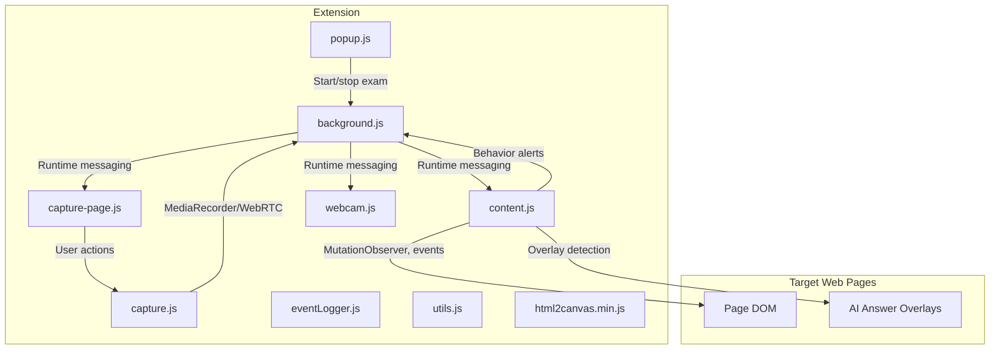
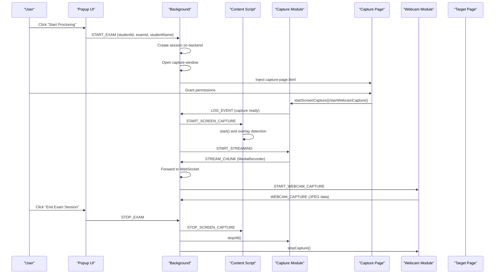
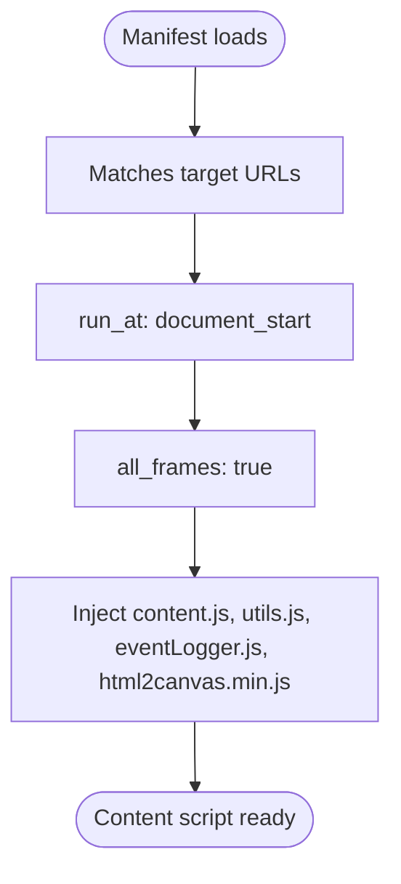
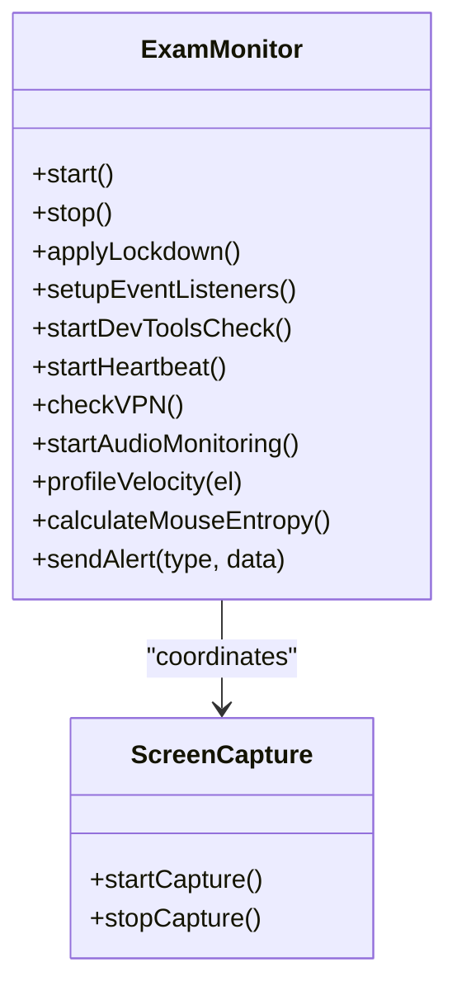
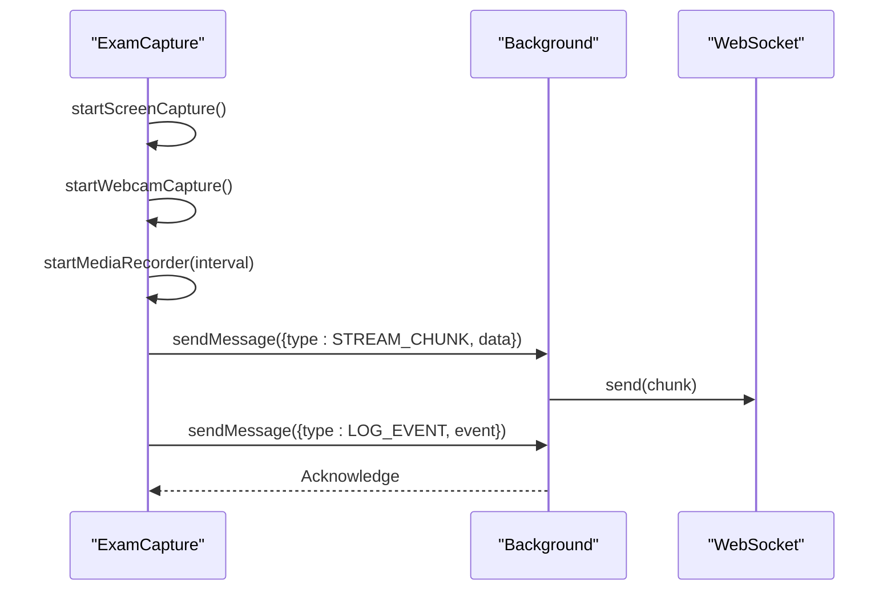
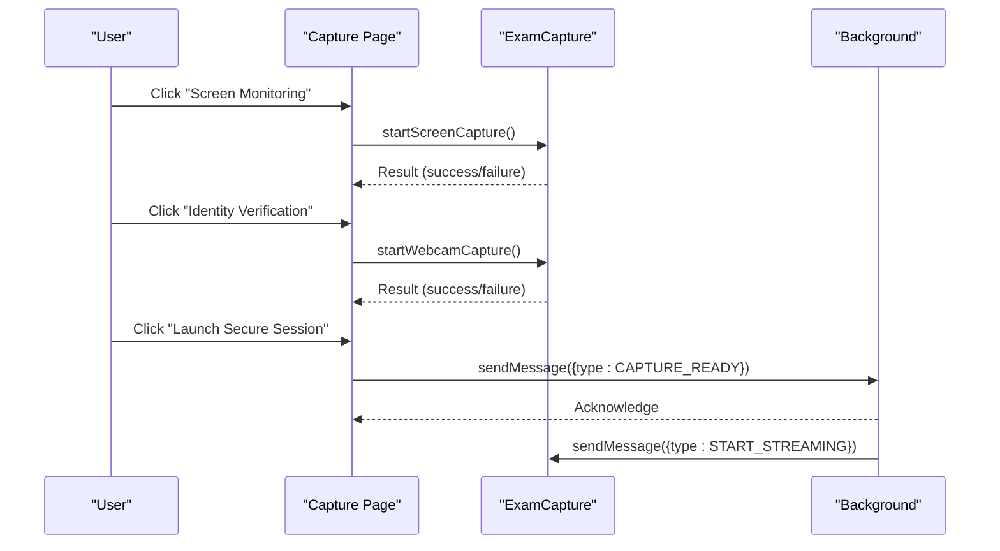
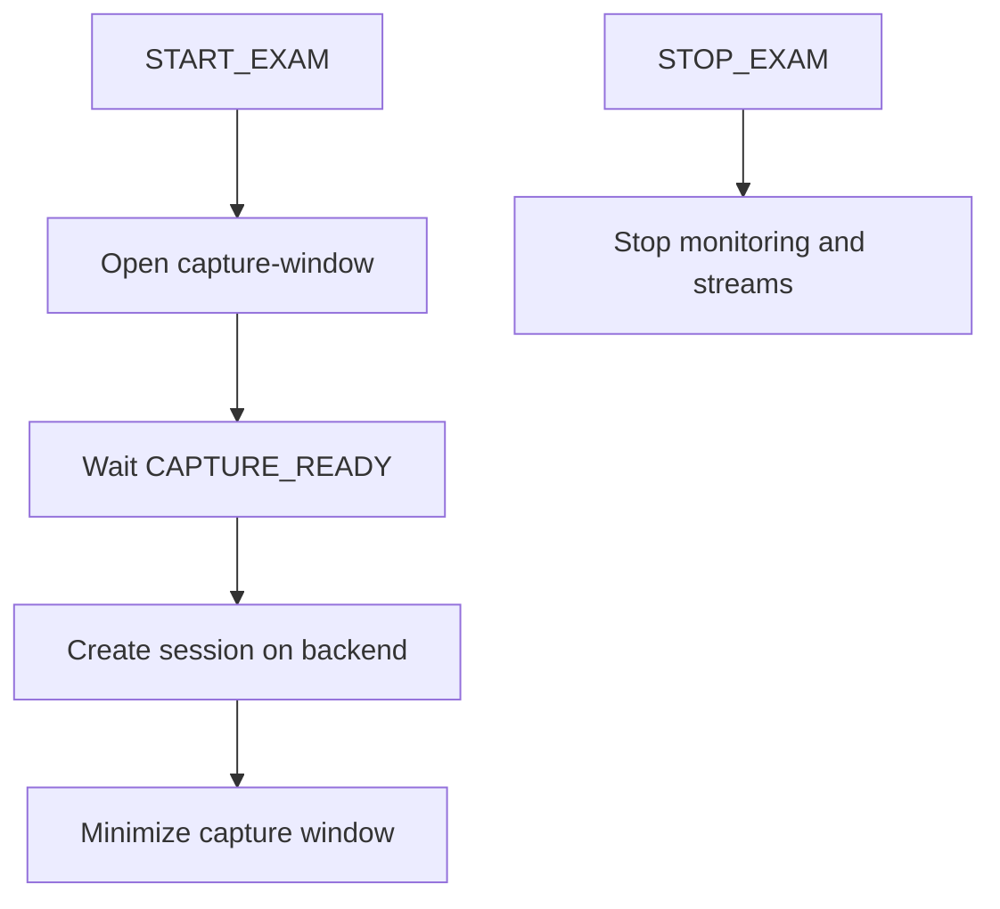
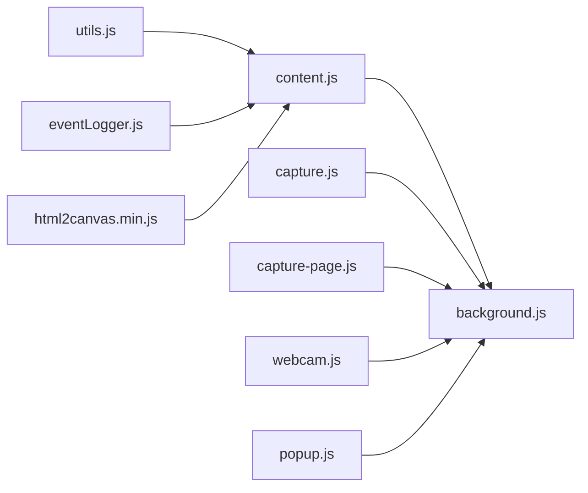

# Content Script Injection

<cite>
**Referenced Files in This Document**
- [content.js](file://extension/content.js)
- [capture.js](file://extension/capture.js)
- [capture-page.js](file://extension/capture-page.js)
- [background.js](file://extension/background.js)
- [manifest.json](file://extension/manifest.json)
- [utils.js](file://extension/utils.js)
- [eventLogger.js](file://extension/eventLogger.js)
- [html2canvas.min.js](file://extension/html2canvas.min.js)
- [capture-page.html](file://extension/capture-page.html)
- [capture-page.css](file://extension/capture-page.css)
- [webcam.js](file://extension/webcam.js)
- [popup.js](file://extension/popup/popup.js)
- [popup.html](file://extension/popup/popup.html)
</cite>

## Table of Contents
1. [Introduction](#introduction)
2. [Project Structure](#project-structure)
3. [Core Components](#core-components)
4. [Architecture Overview](#architecture-overview)
5. [Detailed Component Analysis](#detailed-component-analysis)
6. [Dependency Analysis](#dependency-analysis)
7. [Performance Considerations](#performance-considerations)
8. [Troubleshooting Guide](#troubleshooting-guide)
9. [Conclusion](#conclusion)

## Introduction
This document explains how the Chrome extension injects content scripts into target web pages to monitor browser activity and capture screen content. It covers the dynamic injection mechanism, the behavior monitoring and screen capture modules, the specialized page capture flow, and the coordination between content scripts and the background script. Practical examples demonstrate injection timing, DOM manipulation, and secure communication patterns. Security boundaries, content script isolation, and cross-origin restrictions are addressed alongside troubleshooting guidance and performance optimization techniques.

## Project Structure
The extension uses Manifest V3 with a background service worker and content scripts. The content scripts are injected into all frames of all URLs at document_start, enabling early interception of user interactions and page overlays. The capture-page serves as a dedicated UI for permissions and session initiation.

**Diagram sources**
- [manifest.json:29-44](file://extension/manifest.json#L29-L44)
- [content.js:367-381](file://extension/content.js#L367-L381)
- [capture-page.js:14-16](file://extension/capture-page.js#L14-L16)
- [background.js:52-169](file://extension/background.js#L52-L169)
- [webcam.js:78-89](file://extension/webcam.js#L78-L89)

**Section sources**
- [manifest.json:29-44](file://extension/manifest.json#L29-L44)
- [content.js:367-381](file://extension/content.js#L367-L381)
- [capture-page.js:14-16](file://extension/capture-page.js#L14-L16)
- [background.js:52-169](file://extension/background.js#L52-L169)
- [webcam.js:78-89](file://extension/webcam.js#L78-L89)

## Core Components
- Content script loader: Injects content.js, utils.js, eventLogger.js, and html2canvas.min.js into all frames at document_start.
- Behavior monitor: ExamMonitor class captures keystrokes, mouse movements, clipboard events, dev tools detection, heartbeat, VPN IP discovery, and AI overlay detection.
- Screen capture module: ExamCapture class manages screen and webcam capture, MediaRecorder streaming, and WebRTC signaling.
- Specialized capture page: capture-page.js orchestrates permission requests and session launch.
- Background service worker: Handles session lifecycle, runtime messaging, event logging, and WebSocket relay to backend.
- Webcam feed module: Separate webcam capture for periodic frames.
- Popup UI: popup.js controls start/stop, displays live stats, and health checks.

**Section sources**
- [manifest.json:29-44](file://extension/manifest.json#L29-L44)
- [content.js:34-357](file://extension/content.js#L34-L357)
- [capture.js:6-332](file://extension/capture.js#L6-L332)
- [capture-page.js:14-171](file://extension/capture-page.js#L14-L171)
- [background.js:52-169](file://extension/background.js#L52-L169)
- [webcam.js:2-75](file://extension/webcam.js#L2-L75)
- [popup.js:117-123](file://extension/popup/popup.js#L117-L123)

## Architecture Overview
The extension follows a layered architecture:
- Content scripts run in page context and communicate with the background via chrome.runtime messaging.
- The background coordinates sessions, maintains state, and relays data to the backend via WebSocket.
- The specialized capture page provides a controlled UI for permissions and session initiation.

**Diagram sources**
- [popup.js:343-389](file://extension/popup/popup.js#L343-L389)
- [background.js:686-750](file://extension/background.js#L686-L750)
- [background.js:117-169](file://extension/background.js#L117-L169)
- [capture-page.js:14-171](file://extension/capture-page.js#L14-L171)
- [capture.js:175-203](file://extension/capture.js#L175-L203)
- [content.js:367-381](file://extension/content.js#L367-L381)
- [webcam.js:78-89](file://extension/webcam.js#L78-L89)

## Detailed Component Analysis

### Content Script Injection and Timing
- Injection timing: Manifest configures content scripts to run at document_start across all frames for http/https targets.
- Loaded modules: content.js, utils.js, eventLogger.js, html2canvas.min.js are included in the content script bundle.
- Isolation: Content scripts execute in the page’s security context with access to DOM and page APIs, but are isolated from the extension’s privileged contexts.

**Diagram sources**
- [manifest.json:29-44](file://extension/manifest.json#L29-L44)

**Section sources**
- [manifest.json:29-44](file://extension/manifest.json#L29-L44)

### Behavior Monitoring and Overlay Detection
- ExamMonitor class:
  - Lockdown: Blocks right-click, drag/drop, and disables browser autocomplete/spellcheck on inputs.
  - Event listeners: Tracks keystrokes, paste detection, mouse movement entropy, copy/cut events.
  - DevTools detection: Uses debugger timing and window resize heuristics.
  - Heartbeat: Monitors inactivity and raises alerts.
  - VPN IP discovery: Uses WebRTC ICE candidates to infer local IP.
  - Audio monitoring: Periodic microphone analysis to detect sustained noise.
  - Overlay detection: Scans DOM for suspicious overlays (high z-index, fixed/absolute positioning, pointer-events: none) and iframe sources pointing to localhost or known cheating domains.
- Communication: Uses safeSendMessage to guard against “context invalidated” errors and stops monitoring on reload.

**Diagram sources**
- [content.js:34-357](file://extension/content.js#L34-L357)

**Section sources**
- [content.js:34-357](file://extension/content.js#L34-L357)

### Screen Capture Module (ExamCapture)
- Screen capture:
  - Uses navigator.mediaDevices.getDisplayMedia with cursor and display surface constraints.
  - Resets error counters on success; handles stream end events.
- Webcam capture:
  - Uses navigator.mediaDevices.getUserMedia with facingMode and frame rate constraints.
  - Provides single-frame capture via canvas drawing for JPEG output.
- Live streaming:
  - MediaRecorder configured with video/webm and bitrate tuning; emits chunks via sendMessage.
- WebRTC signaling:
  - Creates RTCPeerConnection, adds video tracks from active streams, and emits SDP/ICE candidates to background.
  - Handles incoming signals via onMessage listener.
- Coordination:
  - Background receives STREAM_CHUNK and forwards to WebSocket; LOG_EVENT for capture readiness.

**Diagram sources**
- [capture.js:28-65](file://extension/capture.js#L28-L65)
- [capture.js:71-106](file://extension/capture.js#L71-L106)
- [capture.js:207-246](file://extension/capture.js#L207-L246)
- [capture.js:281-332](file://extension/capture.js#L281-L332)
- [background.js:143-154](file://extension/background.js#L143-L154)

**Section sources**
- [capture.js:6-332](file://extension/capture.js#L6-L332)
- [background.js:143-154](file://extension/background.js#L143-L154)

### Specialized Capture Page (Permissions and Session Launch)
- Purpose: Dedicated UI to request screen and webcam permissions and finalize session launch.
- Interaction:
  - On click, attempts startScreenCapture/startWebcamCapture, updates UI state, and sends CAPTURE_READY to background.
  - After background acknowledges, minimizes the capture window to keep streams alive.
- Messaging:
  - Receives CAPTURE_WEBCAM_FRAME, START_STREAMING, STOP_EXAM from background.

**Diagram sources**
- [capture-page.js:21-102](file://extension/capture-page.js#L21-L102)
- [capture-page.js:150-170](file://extension/capture-page.js#L150-L170)
- [background.js:59-62](file://extension/background.js#L59-L62)

**Section sources**
- [capture-page.js:14-171](file://extension/capture-page.js#L14-L171)
- [capture-page.html:1-53](file://extension/capture-page.html#L1-L53)
- [capture-page.css:1-202](file://extension/capture-page.css#L1-L202)

### Background Service Worker Coordination
- Session lifecycle:
  - START_EXAM opens capture window and waits for CAPTURE_READY.
  - CAPTURE_READY triggers session creation on backend and minimizes capture window.
  - STOP_EXAM halts monitoring and cleans up.
- Runtime messaging:
  - Handles BEHAVIOR_ALERT, LOG_EVENT, CLIPBOARD_TEXT, DOM_CONTENT_CAPTURE, NETWORK_INFO, STREAM_CHUNK, WEBCAM_CAPTURE, WEBRTC_SIGNAL_OUT.
  - Forwards MediaRecorder chunks directly to WebSocket to avoid serialization issues.
- Browsing tracker:
  - Tracks active site, categorizes URLs, audits open tabs, computes risk and effort scores.

**Diagram sources**
- [background.js:686-750](file://extension/background.js#L686-L750)
- [background.js:52-169](file://extension/background.js#L52-L169)

**Section sources**
- [background.js:52-169](file://extension/background.js#L52-L169)
- [background.js:686-750](file://extension/background.js#L686-L750)

### Webcam Feed Module
- Provides periodic webcam frames via canvas capture and sends WEBCAM_CAPTURE messages to background.
- Starts/stops capture intervals and releases resources cleanly.

**Section sources**
- [webcam.js:2-75](file://extension/webcam.js#L2-L75)
- [webcam.js:78-89](file://extension/webcam.js#L78-L89)

### Popup UI and Session Controls
- Displays live stats, connection status, and capture indicators.
- Initiates/terminates sessions and performs health checks against backend.

**Section sources**
- [popup.js:117-123](file://extension/popup/popup.js#L117-L123)
- [popup.js:343-389](file://extension/popup/popup.js#L343-L389)
- [popup.js:391-423](file://extension/popup/popup.js#L391-L423)
- [popup.html:1-192](file://extension/popup/popup.html#L1-L192)

## Dependency Analysis
- Content script dependencies:
  - content.js depends on utils.js for shared utilities and eventLogger.js for event logging.
  - html2canvas.min.js is bundled for DOM snapshotting capabilities.
- Capture module dependencies:
  - capture.js depends on background.js messaging contracts and uses MediaRecorder/WebRTC APIs.
- Background dependencies:
  - background.js orchestrates runtime messaging, WebSocket forwarding, and session state.
- Cross-origin and isolation:
  - Content scripts run in page context; overlay detection attempts getComputedStyle on elements, with silent failure for cross-origin nodes.
  - Permissions required: tabs, activeTab, storage, notifications, clipboardRead, scripting, windows, system.display.

**Diagram sources**
- [manifest.json:35-39](file://extension/manifest.json#L35-L39)
- [content.js:367-381](file://extension/content.js#L367-L381)
- [capture.js:281-332](file://extension/capture.js#L281-L332)
- [capture-page.js:14-16](file://extension/capture-page.js#L14-L16)
- [webcam.js:78-89](file://extension/webcam.js#L78-L89)
- [popup.js:117-123](file://extension/popup/popup.js#L117-L123)

**Section sources**
- [manifest.json:6-24](file://extension/manifest.json#L6-L24)
- [manifest.json:35-39](file://extension/manifest.json#L35-L39)
- [content.js:367-381](file://extension/content.js#L367-L381)
- [capture.js:281-332](file://extension/capture.js#L281-L332)
- [capture-page.js:14-16](file://extension/capture-page.js#L14-L16)
- [webcam.js:78-89](file://extension/webcam.js#L78-L89)
- [popup.js:117-123](file://extension/popup/popup.js#L117-L123)

## Performance Considerations
- Injection timing: Running at document_start reduces race conditions for overlay and input detection.
- Stream configuration: MediaRecorder uses video/webm with tuned bitrate; adjust videoBitsPerSecond for bandwidth constraints.
- Canvas capture: Limit frame sizes and compression quality to balance fidelity and throughput.
- Interval tuning: Adjust heartbeat, dev tools checks, and audio monitoring intervals to reduce CPU usage.
- Error handling: Retry logic and graceful degradation when permissions are denied or streams end unexpectedly.
- Memory: Limit event buffers and periodically prune old entries.

[No sources needed since this section provides general guidance]

## Troubleshooting Guide
- Injection failures:
  - Verify manifest content_scripts match target URLs and run_at/document_start are set.
  - Ensure web_accessible_resources include capture.js and capture-page.html if accessed externally.
- Overlay detection issues:
  - Cross-origin elements throw; detection silently fails for those nodes.
- Permission denials:
  - Screen share and webcam prompts must be granted; otherwise capture methods return errors.
- Messaging errors:
  - Use safeSendMessage to handle “context invalidated” errors and stop monitoring gracefully.
- MediaRecorder/WebRTC:
  - Ensure streams are active before starting MediaRecorder; handle onended events to stop recording.
  - For WebSocket forwarding, send raw blobs directly to avoid serialization pitfalls.

**Section sources**
- [manifest.json:29-44](file://extension/manifest.json#L29-L44)
- [manifest.json:59-72](file://extension/manifest.json#L59-L72)
- [content.js:5-26](file://extension/content.js#L5-L26)
- [capture.js:207-246](file://extension/capture.js#L207-L246)
- [capture.js:281-332](file://extension/capture.js#L281-L332)

## Conclusion
The extension’s content script injection enables comprehensive monitoring and secure session orchestration. Content scripts intercept user interactions, detect overlays, and coordinate with the background service worker to manage screen and webcam capture, streaming, and WebRTC signaling. Robust messaging patterns, permission-driven UI, and performance-conscious configurations ensure reliable operation while respecting security boundaries and cross-origin restrictions.