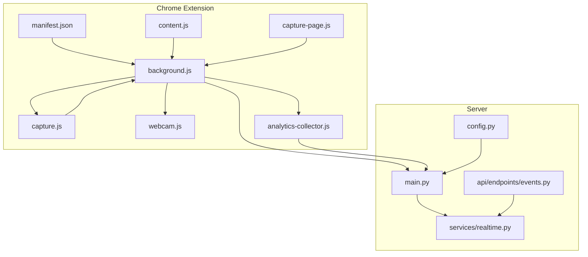
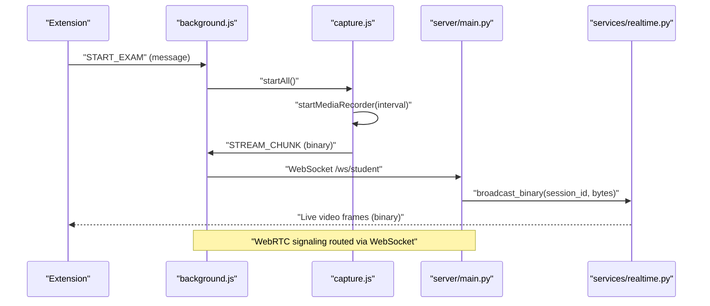
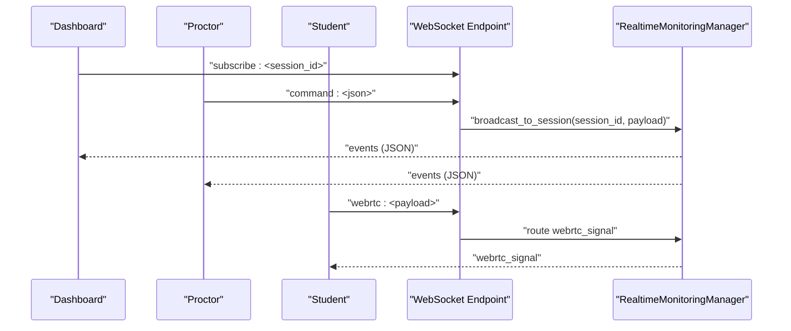
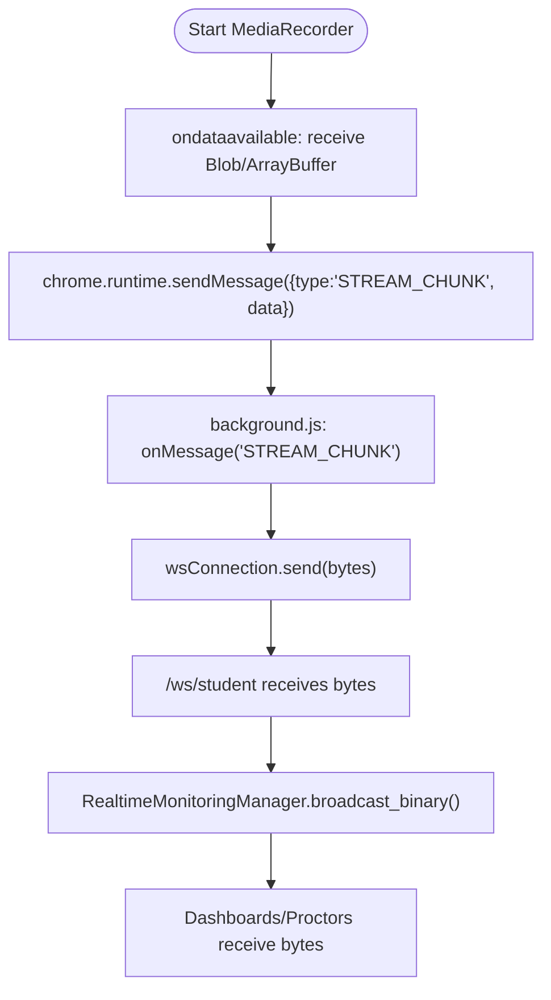
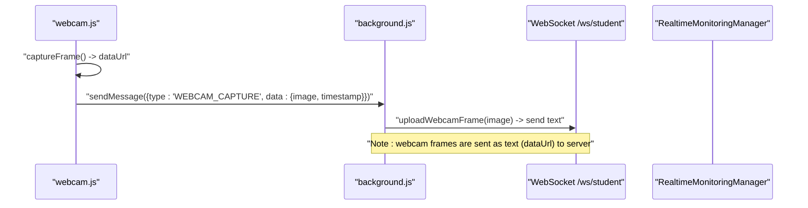
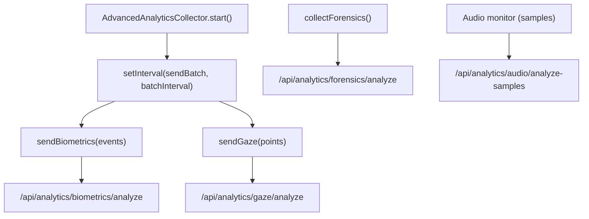
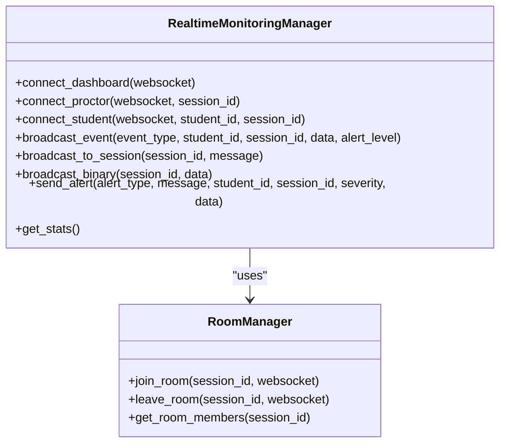
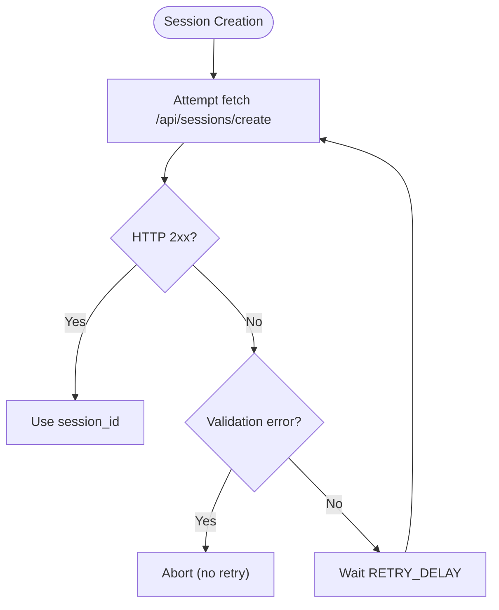
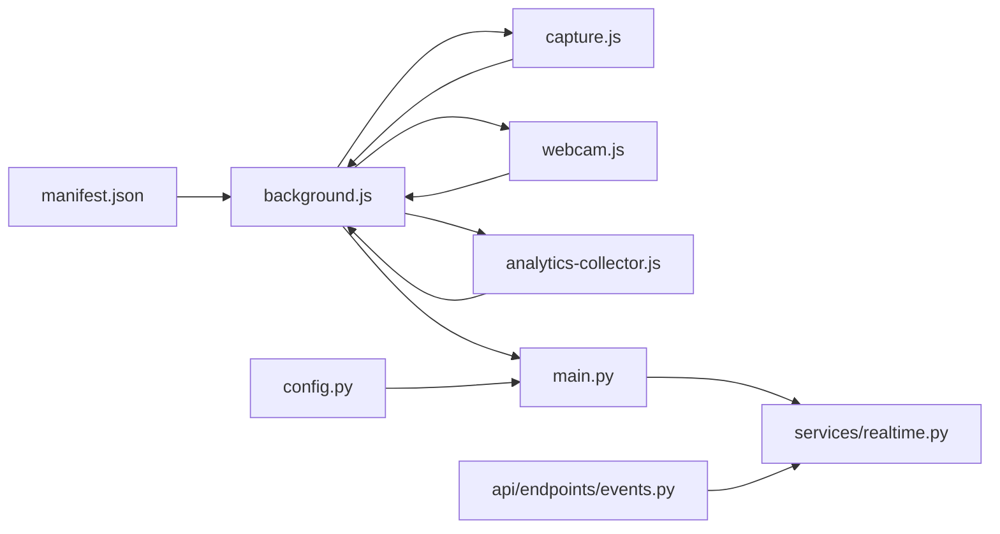

# Data Transmission Protocols

<cite>
**Referenced Files in This Document**
- [manifest.json](file://extension/manifest.json)
- [background.js](file://extension/background.js)
- [content.js](file://extension/content.js)
- [capture.js](file://extension/capture.js)
- [capture-page.js](file://extension/capture-page.js)
- [webcam.js](file://extension/webcam.js)
- [analytics-collector.js](file://extension/analytics-collector.js)
- [main.py](file://server/main.py)
- [realtime.py](file://server/services/realtime.py)
- [events.py](file://server/api/endpoints/events.py)
- [config.py](file://server/config.py)
</cite>

## Table of Contents
1. [Introduction](#introduction)
2. [Project Structure](#project-structure)
3. [Core Components](#core-components)
4. [Architecture Overview](#architecture-overview)
5. [Detailed Component Analysis](#detailed-component-analysis)
6. [Dependency Analysis](#dependency-analysis)
7. [Performance Considerations](#performance-considerations)
8. [Troubleshooting Guide](#troubleshooting-guide)
9. [Conclusion](#conclusion)

## Introduction
This document describes the data transmission protocols between the Chrome extension and the backend server for real-time exam monitoring. It covers WebSocket communication patterns for live streaming, message formatting, error recovery, and the extension’s analytics and media capture modules. It also documents the server-side WebSocket endpoints and the RealtimeMonitoringManager integration for event broadcasting and live video streaming.

## Project Structure
The system comprises:
- A Chrome extension with multiple modules for content monitoring, media capture, analytics collection, and background orchestration.
- A FastAPI server exposing WebSocket endpoints for real-time dashboards, proctors, and students, plus REST endpoints for event logging and analytics.

**Diagram sources**
- [manifest.json:1-73](file://extension/manifest.json#L1-L73)
- [background.js:1-2003](file://extension/background.js#L1-L2003)
- [content.js:1-473](file://extension/content.js#L1-L473)
- [capture.js:1-352](file://extension/capture.js#L1-L352)
- [capture-page.js:1-171](file://extension/capture-page.js#L1-L171)
- [webcam.js:1-90](file://extension/webcam.js#L1-L90)
- [analytics-collector.js:1-610](file://extension/analytics-collector.js#L1-L610)
- [main.py:1-650](file://server/main.py#L1-L650)
- [realtime.py:1-643](file://server/services/realtime.py#L1-L643)
- [events.py:1-414](file://server/api/endpoints/events.py#L1-L414)
- [config.py:1-205](file://server/config.py#L1-L205)

**Section sources**
- [manifest.json:1-73](file://extension/manifest.json#L1-L73)
- [main.py:249-511](file://server/main.py#L249-L511)

## Core Components
- Extension background orchestrator: manages session lifecycle, retries, WebRTC signaling, and relays binary video chunks to the server via WebSocket.
- Content script: monitors behavior, detects overlays, and sends alerts to the background.
- Capture module: handles screen and webcam capture, MediaRecorder-based live streaming, and WebRTC signaling.
- Analytics collector: batches behavioral analytics and sends them to the backend.
- Server WebSocket endpoints: provide dashboards, proctors, and students with real-time updates and accept live video streams.
- RealtimeMonitoringManager: central broadcaster for events and binary video chunks.

**Section sources**
- [background.js:52-169](file://extension/background.js#L52-L169)
- [content.js:34-357](file://extension/content.js#L34-L357)
- [capture.js:6-332](file://extension/capture.js#L6-L332)
- [analytics-collector.js:13-610](file://extension/analytics-collector.js#L13-L610)
- [main.py:252-504](file://server/main.py#L252-L504)
- [realtime.py:102-643](file://server/services/realtime.py#L102-L643)

## Architecture Overview
The extension communicates with the server using:
- WebSocket endpoints for real-time dashboards, proctors, and students.
- Binary video chunks streamed via WebSocket from the extension to the server.
- REST endpoints for analytics and event logging.

**Diagram sources**
- [background.js:52-169](file://extension/background.js#L52-L169)
- [capture.js:207-238](file://extension/capture.js#L207-L238)
- [main.py:394-477](file://server/main.py#L394-L477)
- [realtime.py:310-329](file://server/services/realtime.py#L310-L329)

## Detailed Component Analysis

### WebSocket Communication Patterns
- Endpoints:
  - /ws/dashboard: dashboard receives all events and can subscribe to sessions.
  - /ws/proctor/{session_id}: proctor receives session-specific events.
  - /ws/student: student receives targeted alerts and instructions; accepts binary video chunks.
- Message types:
  - Text: control messages (ping, stats, subscribe, command, webrtc).
  - Binary: MediaRecorder chunks for live streaming.
- Routing:
  - WebRTC signals are forwarded between dashboard and student via the server.
  - Live video chunks are broadcast to dashboards and proctors in the session room.

**Diagram sources**
- [main.py:275-391](file://server/main.py#L275-L391)
- [realtime.py:412-417](file://server/services/realtime.py#L412-L417)

**Section sources**
- [main.py:252-504](file://server/main.py#L252-L504)
- [realtime.py:213-417](file://server/services/realtime.py#L213-L417)

### Extension-to-Server Video Streaming
- MediaRecorder captures screen frames at a configurable interval and emits binary chunks.
- The extension sends binary chunks to the background, which forwards them to the server WebSocket.
- The server broadcasts the chunks to dashboards and proctors in the session room.

**Diagram sources**
- [capture.js:222-237](file://extension/capture.js#L222-L237)
- [background.js:143-153](file://extension/background.js#L143-L153)
- [main.py:469-476](file://server/main.py#L469-L476)
- [realtime.py:310-329](file://server/services/realtime.py#L310-L329)

**Section sources**
- [capture.js:207-238](file://extension/capture.js#L207-L238)
- [background.js:143-153](file://extension/background.js#L143-L153)
- [main.py:469-476](file://server/main.py#L469-L476)
- [realtime.py:310-329](file://server/services/realtime.py#L310-L329)

### Webcam Stream Capture and Transmission
- The webcam module captures frames at a fixed interval, converts them to JPEG, and sends them to the background via extension messaging.
- The background forwards webcam frames to the server via the student WebSocket endpoint.

**Diagram sources**
- [webcam.js:30-57](file://extension/webcam.js#L30-L57)
- [background.js:155-162](file://extension/background.js#L155-L162)
- [main.py:420-452](file://server/main.py#L420-L452)

**Section sources**
- [webcam.js:10-57](file://extension/webcam.js#L10-L57)
- [background.js:155-162](file://extension/background.js#L155-L162)
- [main.py:420-452](file://server/main.py#L420-L452)

### Analytics Data Aggregation and Transmission
- The analytics collector batches keystroke and mouse events, periodically sends them to the server, and optionally sends forensics and audio samples.
- Batch intervals and throttling reduce overhead; silent failures for audio samples prevent overload.

**Diagram sources**
- [analytics-collector.js:63-111](file://extension/analytics-collector.js#L63-L111)
- [analytics-collector.js:488-582](file://extension/analytics-collector.js#L488-L582)

**Section sources**
- [analytics-collector.js:13-610](file://extension/analytics-collector.js#L13-L610)

### Server-Side WebSocket Endpoint Handling and RealtimeMonitoringManager
- The server exposes multiple WebSocket endpoints:
  - /ws/dashboard: supports ping, stats, subscribe, and command routing.
  - /ws/proctor/{session_id}: session-scoped proctor monitoring.
  - /ws/student: accepts both text events and binary video chunks.
- RealtimeMonitoringManager:
  - Manages connections for dashboards, proctors, and students.
  - Supports room-based broadcasting and binary forwarding for live video.
  - Provides heartbeat and statistics.

**Diagram sources**
- [realtime.py:102-643](file://server/services/realtime.py#L102-L643)

**Section sources**
- [main.py:252-504](file://server/main.py#L252-L504)
- [realtime.py:102-643](file://server/services/realtime.py#L102-L643)

### Message Queuing Strategies and Retry Mechanisms
- Session creation:
  - The background attempts to create a session with retries and bounded delays.
  - Validation errors (HTTP 400) are not retried; network/timeout errors trigger retries.
- MediaRecorder:
  - Binary chunks are sent immediately upon availability; no persistent queue is implemented in the extension.
- Analytics:
  - Batching reduces frequency; audio samples are sent less frequently and failures are suppressed to avoid overload.
- Server:
  - Real-time manager cleans disconnected sockets and continues broadcasting to others.

**Diagram sources**
- [background.js:754-800](file://extension/background.js#L754-L800)

**Section sources**
- [background.js:754-800](file://extension/background.js#L754-L800)
- [analytics-collector.js:488-582](file://extension/analytics-collector.js#L488-L582)

## Dependency Analysis
- Extension depends on:
  - Manifest permissions enabling tabs, storage, windows, and media devices.
  - Background orchestration coordinating capture, analytics, and WebSocket signaling.
- Server depends on:
  - RealtimeMonitoringManager for event and binary broadcasting.
  - REST endpoints for event logging and analytics aggregation.

**Diagram sources**
- [manifest.json:1-73](file://extension/manifest.json#L1-L73)
- [background.js:1-2003](file://extension/background.js#L1-L2003)
- [capture.js:1-352](file://extension/capture.js#L1-L352)
- [webcam.js:1-90](file://extension/webcam.js#L1-L90)
- [analytics-collector.js:1-610](file://extension/analytics-collector.js#L1-L610)
- [main.py:1-650](file://server/main.py#L1-L650)
- [realtime.py:1-643](file://server/services/realtime.py#L1-L643)
- [events.py:1-414](file://server/api/endpoints/events.py#L1-L414)
- [config.py:1-205](file://server/config.py#L1-L205)

**Section sources**
- [manifest.json:1-73](file://extension/manifest.json#L1-L73)
- [main.py:1-650](file://server/main.py#L1-L650)

## Performance Considerations
- Compression and resolution:
  - Webcam frames are captured at a reduced resolution and compressed to JPEG.
  - MediaRecorder uses VP8 codec with a constrained bitrate to balance quality and bandwidth.
- Throttling and batching:
  - Analytics events are batched and sent at intervals.
  - Mouse events are throttled to reduce frequency.
- Binary streaming:
  - Live video is streamed as binary chunks; the server extracts frames for AI analysis and forwards raw chunks to clients.
- Network resilience:
  - Session creation retries with exponential backoff for transient failures.
  - Realtime manager removes disconnected clients and continues broadcasting.

[No sources needed since this section provides general guidance]

## Troubleshooting Guide
- Permission denials:
  - Screen capture and webcam initialization return explicit errors; UI reflects denial and prevents proceeding.
- Stream interruptions:
  - Track end handlers stop capture and notify background; MediaRecorder state is checked before starting.
- WebSocket connectivity:
  - Server endpoints echo ping/pong; clients should handle disconnects and reconnect.
- Analytics failures:
  - Audio sample sending failures are suppressed to avoid overwhelming the network.

**Section sources**
- [capture.js:57-64](file://extension/capture.js#L57-L64)
- [capture.js:98-105](file://extension/capture.js#L98-L105)
- [main.py:296-301](file://server/main.py#L296-L301)
- [analytics-collector.js:569-582](file://extension/analytics-collector.js#L569-L582)

## Conclusion
The extension-server communication model leverages WebSocket endpoints for real-time dashboards, proctors, and students, with MediaRecorder-based binary streaming for live video and extension-managed analytics batching for behavioral insights. The server’s RealtimeMonitoringManager centralizes broadcasting and room-based routing, ensuring scalable and resilient event delivery. Robust error handling, retries, and bandwidth-conscious compression help maintain performance and reliability in exam monitoring scenarios.