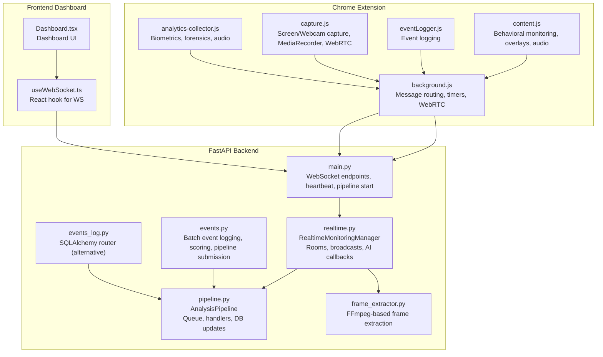
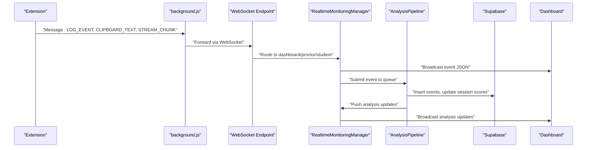
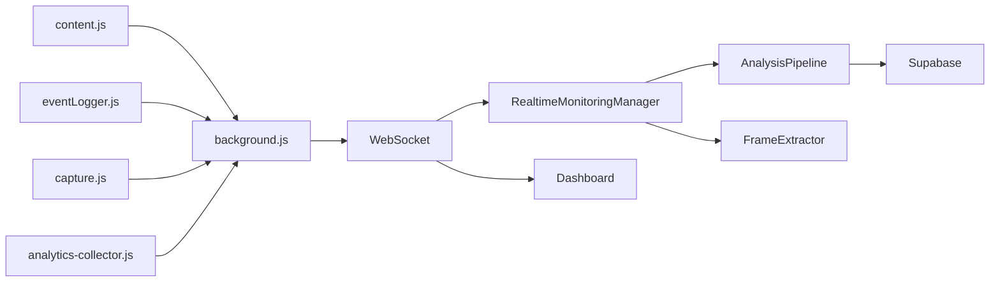

# Component Interactions

<cite>
**Referenced Files in This Document**
- [background.js](file://extension/background.js)
- [content.js](file://extension/content.js)
- [eventLogger.js](file://extension/eventLogger.js)
- [capture.js](file://extension/capture.js)
- [analytics-collector.js](file://extension/analytics-collector.js)
- [main.py](file://server/main.py)
- [realtime.py](file://server/services/realtime.py)
- [pipeline.py](file://server/services/pipeline.py)
- [frame_extractor.py](file://server/services/frame_extractor.py)
- [events.py](file://server/api/endpoints/events.py)
- [events_log.py](file://server/routers/events_log.py)
- [useWebSocket.ts](file://examguard-pro/src/hooks/useWebSocket.ts)
- [Dashboard.tsx](file://examguard-pro/src/components/Dashboard.tsx)
- [config.py](file://server/config.py)
</cite>

## Table of Contents
1. [Introduction](#introduction)
2. [Project Structure](#project-structure)
3. [Core Components](#core-components)
4. [Architecture Overview](#architecture-overview)
5. [Detailed Component Analysis](#detailed-component-analysis)
6. [Dependency Analysis](#dependency-analysis)
7. [Performance Considerations](#performance-considerations)
8. [Troubleshooting Guide](#troubleshooting-guide)
9. [Conclusion](#conclusion)

## Introduction
This document explains how ExamGuard Pro captures user events and browser activities in the Chrome extension, transmits them to the FastAPI backend via WebSocket, and processes them through the AI analysis pipeline. It details the real-time communication flow among the dashboard, proctor, and student WebSocket endpoints, and clarifies how the RealtimeMonitoringManager coordinates connections and how the Pipeline service orchestrates AI analysis workflows. Practical examples are drawn from the codebase to illustrate event routing, message formatting, and connection management.

## Project Structure
The system comprises three major parts:
- Chrome Extension: Captures user behavior, browser activity, and media streams; relays events and binary chunks to the backend.
- FastAPI Backend: Exposes WebSocket endpoints for dashboard, proctor, and student; manages real-time connections and broadcasts; runs the AI analysis pipeline.
- Frontend Dashboard: Connects to the backend via WebSocket to receive live alerts and session updates.

**Diagram sources**
- [background.js:1-200](file://extension/background.js#L1-L200)
- [content.js:1-120](file://extension/content.js#L1-L120)
- [eventLogger.js:1-111](file://extension/eventLogger.js#L1-L111)
- [capture.js:1-120](file://extension/capture.js#L1-L120)
- [analytics-collector.js:1-120](file://extension/analytics-collector.js#L1-L120)
- [main.py:248-501](file://server/main.py#L248-L501)
- [realtime.py:102-208](file://server/services/realtime.py#L102-L208)
- [pipeline.py:9-53](file://server/services/pipeline.py#L9-L53)
- [frame_extractor.py:10-44](file://server/services/frame_extractor.py#L10-L44)
- [events.py:129-284](file://server/api/endpoints/events.py#L129-L284)
- [events_log.py:99-207](file://server/routers/events_log.py#L99-L207)
- [useWebSocket.ts:1-110](file://examguard-pro/src/hooks/useWebSocket.ts#L1-L110)
- [Dashboard.tsx:1-120](file://examguard-pro/src/components/Dashboard.tsx#L1-L120)

**Section sources**
- [background.js:1-200](file://extension/background.js#L1-L200)
- [main.py:248-501](file://server/main.py#L248-L501)
- [realtime.py:102-208](file://server/services/realtime.py#L102-L208)
- [useWebSocket.ts:1-110](file://examguard-pro/src/hooks/useWebSocket.ts#L1-L110)

## Core Components
- Chrome Extension:
  - background.js: Central message router, session lifecycle, timers, WebRTC signaling, and binary stream forwarding.
  - content.js: Behavioral monitoring (keystroke dynamics, mouse movement, overlays, audio), DevTools detection, VPN detection.
  - eventLogger.js: Event logging and forwarding to background.
  - capture.js: Screen/webcam capture, MediaRecorder streaming, WebRTC offer/answer.
  - analytics-collector.js: Biometrics, forensics, and audio sampling.
- FastAPI Backend:
  - main.py: WebSocket endpoints (/ws/dashboard, /ws/proctor/{session_id}, /ws/student), heartbeat, pipeline startup.
  - realtime.py: RealtimeMonitoringManager for connection pooling, rooms, broadcasts, AI callbacks.
  - pipeline.py: AnalysisPipeline with queue, event handlers, DB updates, dashboard pushes.
  - frame_extractor.py: FFmpeg-based frame extraction from binary streams.
  - events.py: Batch event logging, scoring, and pipeline submission.
  - events_log.py: SQLAlchemy-based router (alternative path).
- Frontend Dashboard:
  - useWebSocket.ts: React WebSocket hook with reconnection and subscription.
  - Dashboard.tsx: Dashboard UI consuming live alerts.

**Section sources**
- [background.js:52-166](file://extension/background.js#L52-L166)
- [content.js:34-125](file://extension/content.js#L34-L125)
- [eventLogger.js:1-111](file://extension/eventLogger.js#L1-L111)
- [capture.js:6-120](file://extension/capture.js#L6-L120)
- [analytics-collector.js:13-120](file://extension/analytics-collector.js#L13-L120)
- [main.py:248-501](file://server/main.py#L248-L501)
- [realtime.py:102-208](file://server/services/realtime.py#L102-L208)
- [pipeline.py:9-53](file://server/services/pipeline.py#L9-L53)
- [frame_extractor.py:10-44](file://server/services/frame_extractor.py#L10-L44)
- [events.py:129-284](file://server/api/endpoints/events.py#L129-L284)
- [events_log.py:99-207](file://server/routers/events_log.py#L99-L207)
- [useWebSocket.ts:1-110](file://examguard-pro/src/hooks/useWebSocket.ts#L1-L110)
- [Dashboard.tsx:1-120](file://examguard-pro/src/components/Dashboard.tsx#L1-L120)

## Architecture Overview
The system uses a layered real-time architecture:
- Extension collects events and media, forwards them to the backend via WebSocket.
- Backend routes messages to dashboard, proctor, and student endpoints.
- RealtimeMonitoringManager coordinates rooms and broadcasts.
- AnalysisPipeline processes events asynchronously and updates session risk scores.
- Dashboard consumes live alerts and session stats.

**Diagram sources**
- [background.js:52-166](file://extension/background.js#L52-L166)
- [main.py:248-501](file://server/main.py#L248-L501)
- [realtime.py:334-403](file://server/services/realtime.py#L334-L403)
- [pipeline.py:44-96](file://server/services/pipeline.py#L44-L96)
- [events.py:261-277](file://server/api/endpoints/events.py#L261-L277)

## Detailed Component Analysis

### Chrome Extension: Event Capture and Transmission
- Message routing:
  - background.js registers listeners for START_EXAM, STOP_EXAM, LOG_EVENT, CLIPBOARD_TEXT, DOM_CONTENT_CAPTURE, BEHAVIOR_ALERT, WEBRTC_SIGNAL_OUT, STREAM_CHUNK, WEBCAM_CAPTURE, and GET_STATUS. It forwards events to the backend and relays WebRTC signaling.
  - content.js monitors keystrokes, mouse movement, overlays, audio anomalies, DevTools, VPN, and sends alerts via runtime messaging.
  - eventLogger.js logs click, keydown, copy/paste, visibility changes, and forwards events to background.
  - capture.js handles screen/webcam capture, MediaRecorder streaming, and WebRTC offer/answer exchange.
  - analytics-collector.js performs local biometrics, forensics, and audio sampling; sends batches to backend endpoints.

- Real-time transmission:
  - STREAM_CHUNK messages carry raw MediaRecorder chunks; background.js forwards them directly to the open WebSocket to avoid serialization issues.
  - WEBRTC_SIGNAL_OUT messages are prefixed with a protocol marker and sent to the backend; background.js relays them to the WebSocket.

- Example paths:
  - [background.js: message listener and routing:52-166](file://extension/background.js#L52-L166)
  - [content.js: behavior monitoring and alerts:34-125](file://extension/content.js#L34-L125)
  - [eventLogger.js: event logging and forwarding:1-111](file://extension/eventLogger.js#L1-L111)
  - [capture.js: MediaRecorder streaming and WebRTC:207-246](file://extension/capture.js#L207-L246)
  - [analytics-collector.js: batch sending:488-511](file://extension/analytics-collector.js#L488-L511)

**Section sources**
- [background.js:52-166](file://extension/background.js#L52-L166)
- [content.js:34-125](file://extension/content.js#L34-L125)
- [eventLogger.js:1-111](file://extension/eventLogger.js#L1-L111)
- [capture.js:207-246](file://extension/capture.js#L207-L246)
- [analytics-collector.js:488-511](file://extension/analytics-collector.js#L488-L511)

### Backend: WebSocket Endpoints and Real-Time Coordination
- WebSocket endpoints:
  - /ws/dashboard: Dashboard receives all events across sessions; supports subscribe commands and ping/pong.
  - /ws/proctor/{session_id}: Proctor connects to a specific session; receives targeted events and can send commands/alerts.
  - /ws/student: Student endpoint accepts both text and binary messages; routes event reports and WebRTC signaling; broadcasts binary chunks to dashboards and proctors.

- RealtimeMonitoringManager:
  - Manages connection pools for dashboard, proctor, and student.
  - Implements RoomManager for session-based broadcasting.
  - Broadcasts events to dashboards and proctors; supports binary broadcasting for live streams.
  - Provides heartbeat and statistics.

- Example paths:
  - [main.py: WebSocket endpoints and routing:274-501](file://server/main.py#L274-L501)
  - [realtime.py: RealtimeMonitoringManager, rooms, broadcasts:102-208](file://server/services/realtime.py#L102-L208)

**Section sources**
- [main.py:274-501](file://server/main.py#L274-L501)
- [realtime.py:102-208](file://server/services/realtime.py#L102-L208)

### Backend: AI Analysis Pipeline Orchestration
- AnalysisPipeline:
  - Maintains an asyncio queue and background worker.
  - Routes events to handlers: text events, navigation, focus, transformer alerts, vision anomalies.
  - Updates session risk scores and broadcasts analysis updates to dashboards.
  - Inserts analysis results into Supabase.

- Frame extraction:
  - StreamFrameExtractor writes incoming binary chunks to a temporary WebM file and periodically extracts frames using FFmpeg.
  - Triggers AI callbacks to analyze frames and broadcast alerts.

- Example paths:
  - [pipeline.py: AnalysisPipeline, handlers, DB updates:9-96](file://server/services/pipeline.py#L9-L96)
  - [frame_extractor.py: FFmpeg-based extraction:10-44](file://server/services/frame_extractor.py#L10-L44)

**Section sources**
- [pipeline.py:9-96](file://server/services/pipeline.py#L9-L96)
- [frame_extractor.py:10-44](file://server/services/frame_extractor.py#L10-L44)

### Backend: Event Logging and Scoring
- Batch logging:
  - events.py: Handles batch submissions, computes risk and effort impacts, inserts events, updates session stats, and submits to the pipeline.
  - events_log.py: Alternative SQLAlchemy-based router with similar logic.

- Example paths:
  - [events.py: batch logging and pipeline submission:129-284](file://server/api/endpoints/events.py#L129-L284)
  - [events_log.py: SQLAlchemy router:99-207](file://server/routers/events_log.py#L99-L207)

**Section sources**
- [events.py:129-284](file://server/api/endpoints/events.py#L129-L284)
- [events_log.py:99-207](file://server/routers/events_log.py#L99-L207)

### Frontend Dashboard: Real-Time Interaction
- useWebSocket.ts:
  - Connects to /ws/dashboard, supports subscription to a room, ping/pong, exponential backoff reconnection, and ignores heartbeat/connection messages.
- Dashboard.tsx:
  - Displays live alerts and integrates with the WebSocket hook.

- Example paths:
  - [useWebSocket.ts: connection, subscription, reconnection:1-110](file://examguard-pro/src/hooks/useWebSocket.ts#L1-L110)
  - [Dashboard.tsx: live alerts rendering:103-113](file://examguard-pro/src/components/Dashboard.tsx#L103-L113)

**Section sources**
- [useWebSocket.ts:1-110](file://examguard-pro/src/hooks/useWebSocket.ts#L1-L110)
- [Dashboard.tsx:103-113](file://examguard-pro/src/components/Dashboard.tsx#L103-L113)

## Dependency Analysis
- Extension-to-backend:
  - background.js depends on runtime messaging to coordinate content scripts and capture modules; forwards events and binary chunks to the backend WebSocket.
- Backend orchestration:
  - main.py initializes RealtimeMonitoringManager and starts the AnalysisPipeline; exposes WebSocket endpoints.
  - realtime.py coordinates rooms and broadcasts; delegates AI analysis callbacks.
  - pipeline.py consumes the queue and updates Supabase; pushes updates to dashboards via realtime.
  - frame_extractor.py depends on FFmpeg availability; extracts frames from binary streams.
- Frontend:
  - useWebSocket.ts depends on config.wsUrl and handles reconnection and subscription.

**Diagram sources**
- [background.js:52-166](file://extension/background.js#L52-L166)
- [main.py:248-501](file://server/main.py#L248-L501)
- [realtime.py:102-208](file://server/services/realtime.py#L102-L208)
- [pipeline.py:9-53](file://server/services/pipeline.py#L9-L53)
- [frame_extractor.py:10-44](file://server/services/frame_extractor.py#L10-L44)
- [useWebSocket.ts:1-110](file://examguard-pro/src/hooks/useWebSocket.ts#L1-L110)

**Section sources**
- [background.js:52-166](file://extension/background.js#L52-L166)
- [main.py:248-501](file://server/main.py#L248-L501)
- [realtime.py:102-208](file://server/services/realtime.py#L102-L208)
- [pipeline.py:9-53](file://server/services/pipeline.py#L9-L53)
- [frame_extractor.py:10-44](file://server/services/frame_extractor.py#L10-L44)
- [useWebSocket.ts:1-110](file://examguard-pro/src/hooks/useWebSocket.ts#L1-L110)

## Performance Considerations
- Binary streaming:
  - MediaRecorder chunks are forwarded as-is to the backend WebSocket to avoid serialization overhead. See [capture.js: STREAM_CHUNK handling:222-231](file://extension/capture.js#L222-L231) and [background.js: STREAM_CHUNK relay:140-150](file://extension/background.js#L140-L150).
- Frame extraction:
  - FFmpeg-based extraction runs in a background thread; adjust fps to balance CPU usage and responsiveness. See [frame_extractor.py: fps and extraction:15-44](file://server/services/frame_extractor.py#L15-L44).
- Queue processing:
  - AnalysisPipeline uses an asyncio queue with a worker; tune queue size and error handling for throughput. See [pipeline.py: queue and worker:14-73](file://server/services/pipeline.py#L14-L73).
- Connection management:
  - Heartbeat and exponential backoff improve resilience; ensure intervals align with platform constraints. See [main.py: heartbeat task:134-137](file://server/main.py#L134-L137) and [useWebSocket.ts: reconnection:64-70](file://examguard-pro/src/hooks/useWebSocket.ts#L64-L70).

[No sources needed since this section provides general guidance]

## Troubleshooting Guide
- Connection timeouts and reconnection:
  - Dashboard uses exponential backoff and ping/pong; verify WebSocket URL and CORS settings. See [useWebSocket.ts: reconnection and ping:64-90](file://examguard-pro/src/hooks/useWebSocket.ts#L64-L90).
  - Backend heartbeat keeps connections alive; ensure intervals are appropriate. See [main.py: heartbeat:134-137](file://server/main.py#L134-L137).
- Message queuing:
  - If the pipeline queue grows, check worker throughput and DB write performance. See [pipeline.py: queue and stats:14-53](file://server/services/pipeline.py#L14-L53).
- Event ordering:
  - Batch logging computes risk and effort impacts cumulatively; ensure timestamps are correct. See [events.py: batch scoring:182-258](file://server/api/endpoints/events.py#L182-L258).
- Binary stream delivery:
  - FFmpeg must be installed for server-side frame extraction; otherwise, extraction is disabled. See [frame_extractor.py: FFmpeg checks:84-90](file://server/services/frame_extractor.py#L84-L90).
- WebRTC signaling:
  - Ensure ICE candidates and SDP are exchanged correctly; background.js forwards signaling messages. See [background.js: WEBRTC_SIGNAL_OUT:133-138](file://extension/background.js#L133-L138) and [capture.js: WebRTC offer/answer:280-318](file://extension/capture.js#L280-L318).

**Section sources**
- [useWebSocket.ts:64-90](file://examguard-pro/src/hooks/useWebSocket.ts#L64-L90)
- [main.py:134-137](file://server/main.py#L134-L137)
- [pipeline.py:14-53](file://server/services/pipeline.py#L14-L53)
- [events.py:182-258](file://server/api/endpoints/events.py#L182-L258)
- [frame_extractor.py:84-90](file://server/services/frame_extractor.py#L84-L90)
- [background.js:133-138](file://extension/background.js#L133-L138)
- [capture.js:280-318](file://extension/capture.js#L280-L318)

## Conclusion
ExamGuard Pro’s component interactions form a cohesive real-time monitoring pipeline:
- The Chrome extension captures user behavior, browser activity, and media streams.
- Events and binary chunks are transmitted to the backend via WebSocket endpoints.
- RealtimeMonitoringManager coordinates connections and rooms, broadcasting events to dashboards and proctors.
- The AnalysisPipeline processes events asynchronously, updates session risk scores, and pushes analysis updates.
- The dashboard consumes live alerts and session stats, enabling responsive proctor oversight.

This architecture balances performance (binary streaming, background extraction) with reliability (heartbeat, reconnection, queue processing), while providing clear separation of concerns across components.