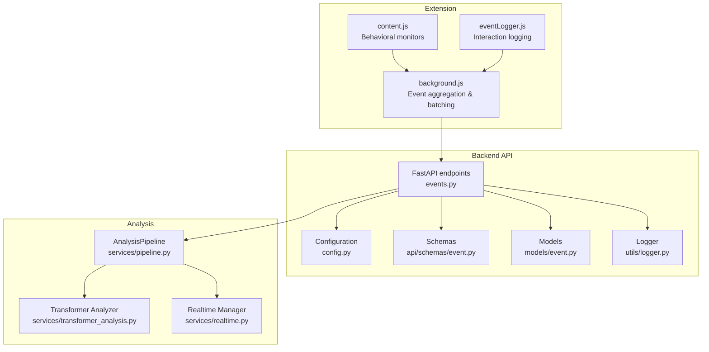
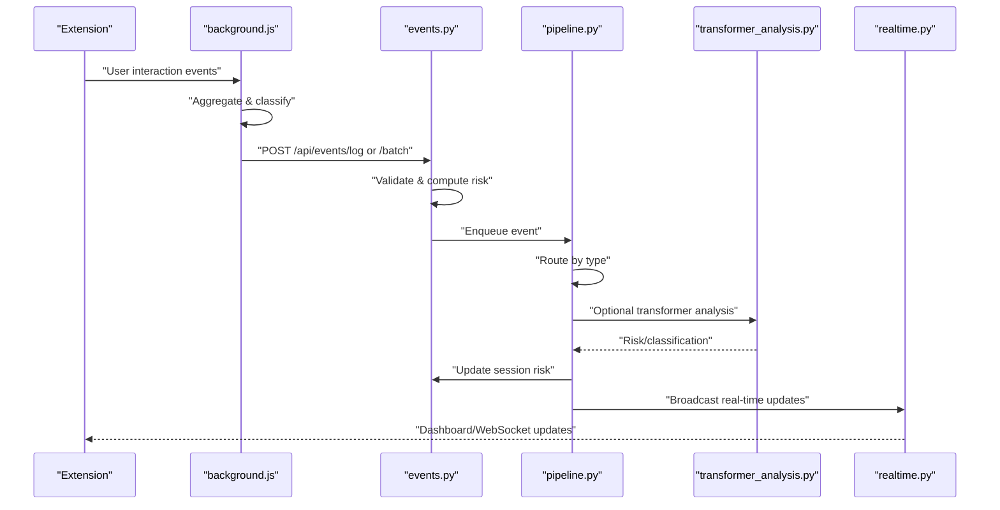
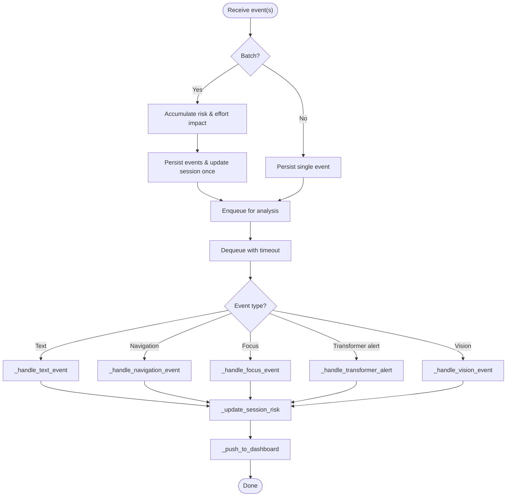
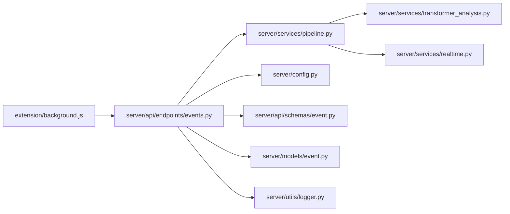

# Event Processing Stages

<cite>
**Referenced Files in This Document**
- [pipeline.py](file://server/services/pipeline.py)
- [events.py](file://server/api/endpoints/events.py)
- [event.py](file://server/models/event.py)
- [event.py](file://server/api/schemas/event.py)
- [config.py](file://server/config.py)
- [transformer_analysis.py](file://server/services/transformer_analysis.py)
- [realtime.py](file://server/services/realtime.py)
- [background.js](file://extension/background.js)
- [content.js](file://extension/content.js)
- [eventLogger.js](file://extension/eventLogger.js)
- [logger.py](file://server/utils/logger.py)
</cite>

## Table of Contents
1. [Introduction](#introduction)
2. [Project Structure](#project-structure)
3. [Core Components](#core-components)
4. [Architecture Overview](#architecture-overview)
5. [Detailed Component Analysis](#detailed-component-analysis)
6. [Dependency Analysis](#dependency-analysis)
7. [Performance Considerations](#performance-considerations)
8. [Troubleshooting Guide](#troubleshooting-guide)
9. [Conclusion](#conclusion)

## Introduction
This document explains the event processing stages within the AnalysisPipeline, covering how events are received, routed, transformed, validated, and analyzed. It details the event routing mechanism for text, navigation, focus, transformer alerts, and vision events, along with batch processing, session context preservation, real-time dashboards, and error handling. Concrete examples are drawn from the codebase to illustrate event type detection, parameter extraction, and handler delegation.

## Project Structure
The event processing spans three layers:
- Extension (browser): captures user behavior and sends events to the backend and real-time dashboard.
- Backend API: validates and persists events, computes session metrics, and enqueues them for analysis.
- Analysis Pipeline: asynchronously processes events, applies transformers where available, updates session risk, and broadcasts real-time updates.

**Diagram sources**
- [background.js:1194-1200](file://extension/background.js#L1194-L1200)
- [events.py:144-336](file://server/api/endpoints/events.py#L144-L336)
- [pipeline.py:74-96](file://server/services/pipeline.py#L74-L96)
- [transformer_analysis.py:540-549](file://server/services/transformer_analysis.py#L540-L549)
- [realtime.py:637-643](file://server/services/realtime.py#L637-L643)
- [config.py:164-189](file://server/config.py#L164-L189)
- [event.py:10-63](file://server/api/schemas/event.py#L10-L63)
- [event.py:6-30](file://server/models/event.py#L6-L30)
- [logger.py:20-64](file://server/utils/logger.py#L20-L64)

**Section sources**
- [events.py:144-336](file://server/api/endpoints/events.py#L144-L336)
- [pipeline.py:74-96](file://server/services/pipeline.py#L74-L96)
- [background.js:1194-1200](file://extension/background.js#L1194-L1200)

## Core Components
- AnalysisPipeline: Asynchronous event processor with a queue, worker loop, and specialized handlers for different event types. It updates session risk and pushes real-time updates to dashboards.
- Event endpoints: Single-event and batch endpoints that validate inputs, compute risk weights, persist events, and enqueue them for analysis.
- Transformer analyzer: Optional transformer-based classifiers for URL, behavior, and screen content risk.
- Realtime manager: WebSocket broadcaster for dashboards, proctors, and students; integrates with AI analysis callbacks.
- Extension background: Aggregates events, performs classification, and batches submissions to the backend.

**Section sources**
- [pipeline.py:9-53](file://server/services/pipeline.py#L9-L53)
- [events.py:30-142](file://server/api/endpoints/events.py#L30-L142)
- [transformer_analysis.py:178-206](file://server/services/transformer_analysis.py#L178-L206)
- [realtime.py:102-138](file://server/services/realtime.py#L102-L138)
- [background.js:1194-1200](file://extension/background.js#L1194-L1200)

## Architecture Overview
The event lifecycle:
1. Extension monitors user behavior and logs events locally.
2. Events are submitted individually or in batches to the backend.
3. Backend validates inputs, computes risk weights, persists events, and enqueues them for analysis.
4. AnalysisPipeline routes events to handlers, optionally runs transformers, updates session risk, and broadcasts updates.
5. Real-time manager pushes updates to dashboards and clients.

**Diagram sources**
- [background.js:1194-1200](file://extension/background.js#L1194-L1200)
- [events.py:30-142](file://server/api/endpoints/events.py#L30-L142)
- [events.py:144-336](file://server/api/endpoints/events.py#L144-L336)
- [pipeline.py:74-96](file://server/services/pipeline.py#L74-L96)
- [transformer_analysis.py:474-523](file://server/services/transformer_analysis.py#L474-L523)
- [realtime.py:334-378](file://server/services/realtime.py#L334-L378)

## Detailed Component Analysis

### Event Routing and Processing Flow
- Event reception: The batch endpoint aggregates multiple events, computes accumulated risk and effort impact, and inserts them into the events table. It also updates session totals and risk level once.
- Queue submission: If the pipeline is running, each event is submitted to the AnalysisPipeline queue with type, session_id, and data.
- Worker loop: The pipeline worker dequeues events with a timeout, routes to a handler based on event type, and updates session risk.

**Diagram sources**
- [events.py:144-336](file://server/api/endpoints/events.py#L144-L336)
- [pipeline.py:55-96](file://server/services/pipeline.py#L55-L96)
- [pipeline.py:97-148](file://server/services/pipeline.py#L97-L148)
- [pipeline.py:149-220](file://server/services/pipeline.py#L149-L220)
- [pipeline.py:225-245](file://server/services/pipeline.py#L225-L245)
- [pipeline.py:246-277](file://server/services/pipeline.py#L246-L277)
- [pipeline.py:278-304](file://server/services/pipeline.py#L278-L304)
- [pipeline.py:306-335](file://server/services/pipeline.py#L306-L335)

**Section sources**
- [events.py:144-336](file://server/api/endpoints/events.py#L144-L336)
- [pipeline.py:55-96](file://server/services/pipeline.py#L55-L96)

### Event Types and Handlers
- Text events (COPY, PASTE, CLIPBOARD_TEXT): Extract text or preview, optionally run transformer screen content classification, persist analysis results, and broadcast updates.
- Navigation events (TAB_SWITCH, NAVIGATION): Compute URL category and risk impact, update session stats and risk level, and broadcast forbidden site alerts when applicable.
- Focus events (WINDOW_BLUR, PAGE_HIDDEN): Handled via batch accumulation; pipeline acknowledges but defers heavy processing to batch stage.
- Transformer alerts (TRANSFORMER_ALERT): Apply penalties to session risk and broadcast plagiarism alerts.
- Vision events (FACE_ABSENT, PHONE_DETECTED): Update session risk and engagement, broadcast anomaly alerts, and escalate to critical for phone detection.

**Section sources**
- [pipeline.py:97-148](file://server/services/pipeline.py#L97-L148)
- [pipeline.py:149-220](file://server/services/pipeline.py#L149-L220)
- [pipeline.py:225-245](file://server/services/pipeline.py#L225-L245)
- [pipeline.py:246-277](file://server/services/pipeline.py#L246-L277)

### Event Transformation and Validation
- Input validation: The batch endpoint validates timestamps, accumulates risk and effort impact per event, and ensures session existence before proceeding.
- Parameter extraction: Handlers extract relevant fields (e.g., text, URL, preview) and derive derived fields (e.g., domain, category).
- Risk computation: Risk weights are mapped from configuration; category-based risk is computed for browsing summaries and navigation events.
- Timestamp handling: Client timestamps are normalized to seconds; server timestamps are stored as ISO format.

**Section sources**
- [events.py:171-233](file://server/api/endpoints/events.py#L171-L233)
- [events.py:284-301](file://server/api/endpoints/events.py#L284-L301)
- [config.py:164-189](file://server/config.py#L164-L189)
- [event.py:18-23](file://server/api/schemas/event.py#L18-L23)
- [event.py:14-16](file://server/models/event.py#L14-L16)

### Session Context Preservation
- Session_id is propagated across endpoints and pipeline handlers to maintain context.
- The pipeline updates session risk level and scores, ensuring consistency with batch-computed values.
- Realtime broadcasts include student_session_id to preserve linkage for targeted notifications.

**Section sources**
- [events.py:310-323](file://server/api/endpoints/events.py#L310-L323)
- [pipeline.py:278-304](file://server/services/pipeline.py#L278-L304)
- [realtime.py:324-334](file://server/services/realtime.py#L324-L334)

### Batch Processing Capabilities
- The batch endpoint processes multiple events atomically, computing aggregated risk and effort impact, inserting events and optional research journey entries, and updating session totals once.
- It buffers events and research entries, then performs bulk inserts to reduce database overhead.
- Events are enqueued to the pipeline for further analysis if the pipeline is running.

**Section sources**
- [events.py:144-336](file://server/api/endpoints/events.py#L144-L336)

### Coordination Between Synchronous and Asynchronous Stages
- Synchronous stage: API endpoints persist events and compute session metrics synchronously.
- Asynchronous stage: AnalysisPipeline processes events concurrently, enabling transformer analysis and real-time broadcasting without blocking API responses.
- Real-time callbacks: AI analysis callbacks (e.g., vision) are scheduled to run in the background loop and broadcast anomalies to dashboards and extension.

**Section sources**
- [events.py:310-323](file://server/api/endpoints/events.py#L310-L323)
- [pipeline.py:55-73](file://server/services/pipeline.py#L55-L73)
- [realtime.py:140-200](file://server/services/realtime.py#L140-L200)

### Event Ordering Guarantees, Timeouts, and Error Propagation
- Ordering: Events are processed in FIFO order via the asyncio queue; batch insertion preserves submission order.
- Timeouts: The worker uses a timeout when awaiting events to remain responsive; errors are caught and logged, and the loop continues.
- Error propagation: Exceptions are caught, counted in stats, logged, and the worker continues processing.

**Section sources**
- [pipeline.py:55-73](file://server/services/pipeline.py#L55-L73)

### Transformer Integration
- Optional transformer analysis is invoked for screen content classification when the analyzer is initialized.
- Results are persisted as part of analysis records and broadcast to dashboards.

**Section sources**
- [pipeline.py:112-137](file://server/services/pipeline.py#L112-L137)
- [transformer_analysis.py:474-523](file://server/services/transformer_analysis.py#L474-L523)

### Real-Time Dashboards and Alerts
- The realtime manager broadcasts events to dashboards, proctors, and students; supports alert levels and event history.
- The pipeline pushes updates for risk score changes, plagiarism, forbidden sites, and anomalies.

**Section sources**
- [realtime.py:334-378](file://server/services/realtime.py#L334-L378)
- [pipeline.py:306-335](file://server/services/pipeline.py#L306-L335)

### Extension-Level Event Generation
- The extension monitors user interactions, detects overlays and cheating tools, and sends alerts and clipboard text for analysis.
- It aggregates events and periodically sends browsing summaries to the backend.

**Section sources**
- [content.js:332-343](file://extension/content.js#L332-L343)
- [eventLogger.js:58-72](file://extension/eventLogger.js#L58-L72)
- [background.js:504-539](file://extension/background.js#L504-L539)

## Dependency Analysis
The following diagram highlights key dependencies among components involved in event processing.

**Diagram sources**
- [background.js:1194-1200](file://extension/background.js#L1194-L1200)
- [events.py:144-336](file://server/api/endpoints/events.py#L144-L336)
- [pipeline.py:74-96](file://server/services/pipeline.py#L74-L96)
- [transformer_analysis.py:540-549](file://server/services/transformer_analysis.py#L540-L549)
- [realtime.py:637-643](file://server/services/realtime.py#L637-L643)
- [config.py:164-189](file://server/config.py#L164-L189)
- [event.py:10-63](file://server/api/schemas/event.py#L10-L63)
- [event.py:6-30](file://server/models/event.py#L6-L30)
- [logger.py:20-64](file://server/utils/logger.py#L20-L64)

**Section sources**
- [events.py:144-336](file://server/api/endpoints/events.py#L144-L336)
- [pipeline.py:74-96](file://server/services/pipeline.py#L74-L96)

## Performance Considerations
- Batch processing reduces database load and improves throughput for navigation and clipboard events.
- Asynchronous pipeline prevents API latency spikes and enables concurrent analysis.
- Transformer analysis is optional and gated by initialization checks to avoid runtime failures.
- Real-time broadcasting is optimized by room-based targeting and event history limits.

[No sources needed since this section provides general guidance]

## Troubleshooting Guide
- Pipeline errors: The worker catches exceptions, increments error stats, logs messages, and continues processing.
- Session not found: Batch endpoint tolerates missing sessions gracefully to prevent retry loops.
- Real-time push failures: WebSocket broadcasting errors are caught and logged without halting the pipeline.
- Logging utilities: Centralized logger provides structured logs for events and analysis results.

**Section sources**
- [pipeline.py:67-72](file://server/services/pipeline.py#L67-L72)
- [events.py:154-159](file://server/api/endpoints/events.py#L154-L159)
- [realtime.py:582-601](file://server/services/realtime.py#L582-L601)
- [logger.py:51-64](file://server/utils/logger.py#L51-L64)

## Conclusion
The AnalysisPipeline orchestrates a robust, scalable event processing system. It routes diverse event types to specialized handlers, leverages batch processing for efficiency, preserves session context, and integrates real-time dashboards. Optional transformer analysis enhances accuracy, while strict error handling and timeouts ensure resilience. Together, these components deliver a comprehensive monitoring solution for exam environments.