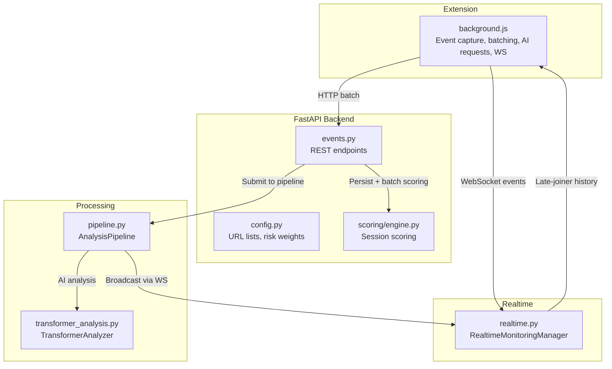
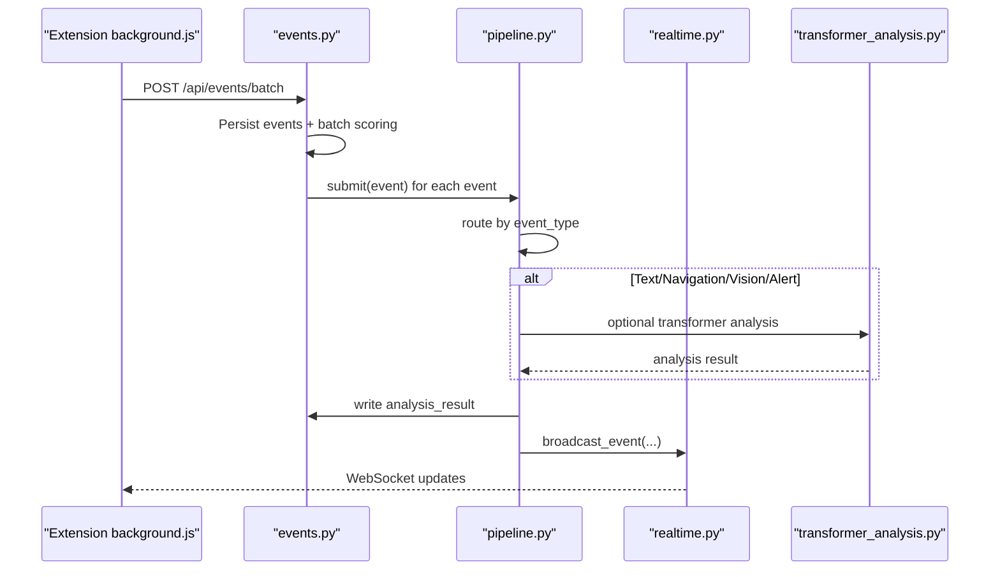
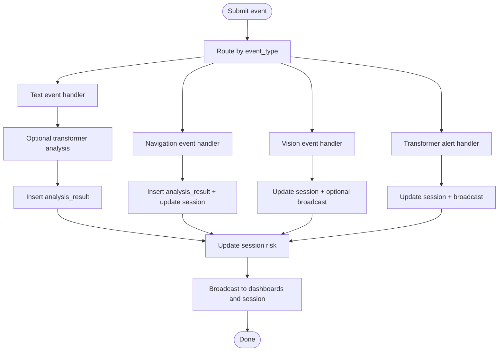
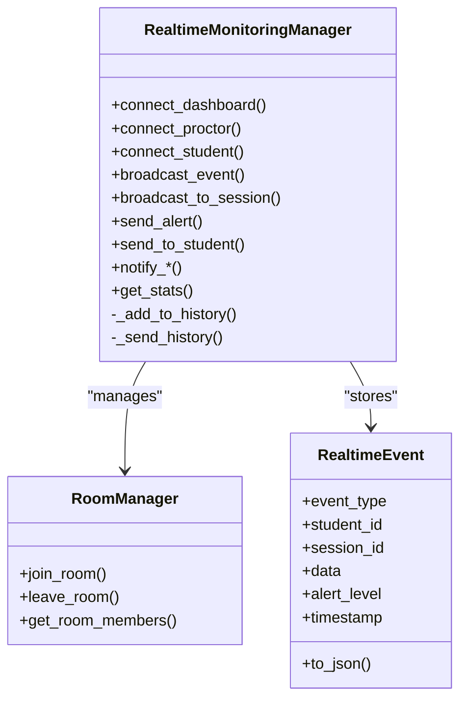
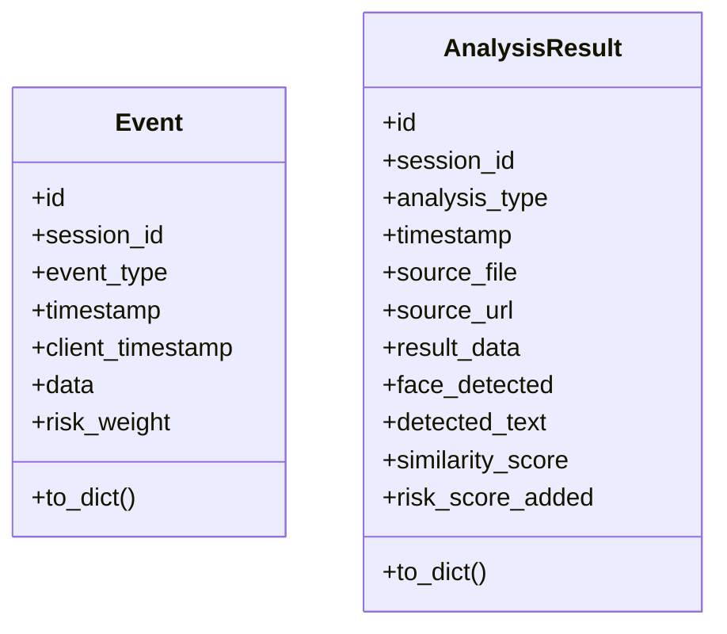
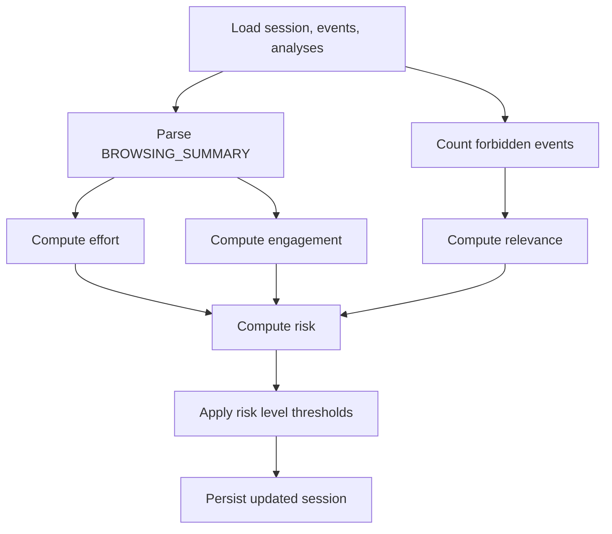
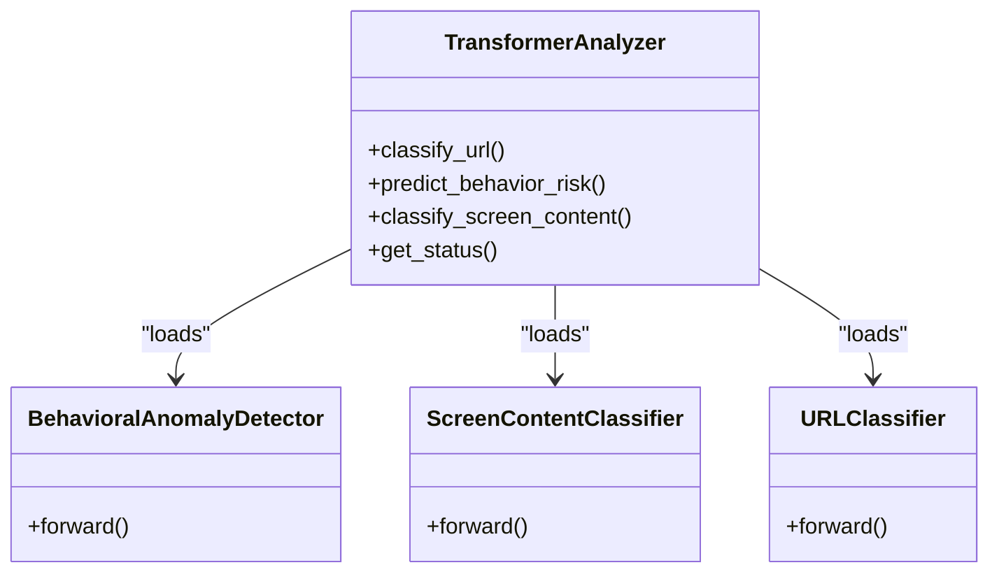
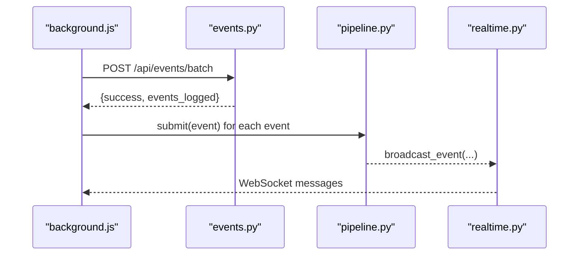
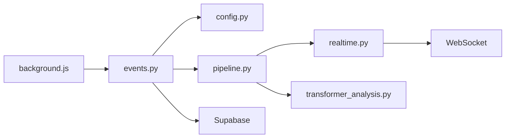

# Event Routing & Processing

<cite>
**Referenced Files in This Document**
- [pipeline.py](file://server/services/pipeline.py)
- [realtime.py](file://server/services/realtime.py)
- [events.py](file://server/api/endpoints/events.py)
- [event.py](file://server/models/event.py)
- [event.py](file://server/api/schemas/event.py)
- [analysis.py](file://server/models/analysis.py)
- [analysis.py](file://server/api/schemas/analysis.py)
- [config.py](file://server/config.py)
- [engine.py](file://server/scoring/engine.py)
- [transformer_analysis.py](file://server/services/transformer_analysis.py)
- [background.js](file://extension/background.js)
</cite>

## Table of Contents
1. [Introduction](#introduction)
2. [Project Structure](#project-structure)
3. [Core Components](#core-components)
4. [Architecture Overview](#architecture-overview)
5. [Detailed Component Analysis](#detailed-component-analysis)
6. [Dependency Analysis](#dependency-analysis)
7. [Performance Considerations](#performance-considerations)
8. [Troubleshooting Guide](#troubleshooting-guide)
9. [Conclusion](#conclusion)

## Introduction
This document explains how ExamGuard Pro routes and processes events from the browser extension to the backend, orchestrates AI analysis, and distributes real-time updates to dashboards and clients. It focuses on the Pipeline service’s coordination of event processing, the event transformation and risk scoring mechanics, the WebSocket-based real-time distribution, and the strategies for event history, late-joiner notifications, and deduplication. It also covers high-throughput considerations, the integration between synchronous AI callbacks and asynchronous WebSocket broadcasting, and how to extend the pipeline with custom analysis modules.

## Project Structure
The event lifecycle spans the browser extension, the FastAPI backend, and the real-time service:
- Extension: Captures user actions, periodically syncs events, triggers AI analysis, and maintains a WebSocket connection for live updates.
- Backend: Accepts events via REST endpoints, persists them, updates session metrics, and submits them to the Analysis Pipeline.
- Pipeline: Asynchronously processes events, performs AI analysis, writes results, and broadcasts updates via WebSocket.
- Realtime: Manages WebSocket rooms, maintains event history, and delivers real-time updates to dashboards and clients.

**Diagram sources**
- [background.js:1232-1259](file://extension/background.js#L1232-L1259)
- [events.py:144-336](file://server/api/endpoints/events.py#L144-L336)
- [engine.py:382-444](file://server/scoring/engine.py#L382-L444)
- [pipeline.py:74-344](file://server/services/pipeline.py#L74-L344)
- [transformer_analysis.py:540-549](file://server/services/transformer_analysis.py#L540-L549)
- [realtime.py:637-642](file://server/services/realtime.py#L637-L642)

**Section sources**
- [background.js:1232-1259](file://extension/background.js#L1232-L1259)
- [events.py:144-336](file://server/api/endpoints/events.py#L144-L336)
- [engine.py:382-444](file://server/scoring/engine.py#L382-L444)
- [pipeline.py:74-344](file://server/services/pipeline.py#L74-L344)
- [transformer_analysis.py:540-549](file://server/services/transformer_analysis.py#L540-L549)
- [realtime.py:637-642](file://server/services/realtime.py#L637-L642)

## Core Components
- AnalysisPipeline: Asynchronous event processor that routes events to specialized handlers, updates session risk, and broadcasts real-time updates.
- RealtimeMonitoringManager: WebSocket hub that manages rooms, maintains event history, and broadcasts updates to dashboards and clients.
- Event models and schemas: Define event structures for persistence and transport.
- ScoringEngine: Computes engagement, relevance, effort, and risk metrics for sessions.
- TransformerAnalyzer: Provides transformer-based analysis for URLs, screen content, and behavioral anomalies.
- Extension background script: Captures events, batches and syncs them, triggers AI analysis, and maintains WebSocket connectivity.

**Section sources**
- [pipeline.py:9-344](file://server/services/pipeline.py#L9-L344)
- [realtime.py:102-642](file://server/services/realtime.py#L102-L642)
- [event.py:6-29](file://server/models/event.py#L6-L29)
- [event.py:10-63](file://server/api/schemas/event.py#L10-L63)
- [analysis.py:6-48](file://server/models/analysis.py#L6-L48)
- [analysis.py:10-121](file://server/api/schemas/analysis.py#L10-L121)
- [engine.py:373-444](file://server/scoring/engine.py#L373-L444)
- [transformer_analysis.py:178-549](file://server/services/transformer_analysis.py#L178-L549)
- [background.js:1232-1259](file://extension/background.js#L1232-L1259)

## Architecture Overview
The event routing and processing workflow integrates the extension, backend, pipeline, and real-time service:

**Diagram sources**
- [background.js:1232-1259](file://extension/background.js#L1232-L1259)
- [events.py:144-336](file://server/api/endpoints/events.py#L144-L336)
- [pipeline.py:74-344](file://server/services/pipeline.py#L74-L344)
- [realtime.py:334-378](file://server/services/realtime.py#L334-L378)
- [transformer_analysis.py:474-523](file://server/services/transformer_analysis.py#L474-L523)

## Detailed Component Analysis

### AnalysisPipeline: Event Routing and Processing
The Pipeline coordinates AI analysis and real-time distribution:
- Queue-based worker processes events asynchronously.
- Routes events by type to specialized handlers:
  - Text events: optional transformer screen-content classification.
  - Navigation events: categorize URL, compute risk impact, update session metrics.
  - Vision events: update risk and broadcast anomaly alerts.
  - Transformer alerts: adjust session metrics and broadcast.
- After processing, updates session risk level and broadcasts risk updates.
- Uses Supabase for persistence and real-time broadcasting via the Realtime service.

**Diagram sources**
- [pipeline.py:74-344](file://server/services/pipeline.py#L74-L344)

**Section sources**
- [pipeline.py:25-344](file://server/services/pipeline.py#L25-L344)

### RealtimeMonitoringManager: WebSocket Distribution and History
The Realtime service:
- Maintains rooms keyed by session_id for targeted broadcasting.
- Stores event history and serves recent events to late-joiners.
- Supports broadcast to dashboards, proctors, and student-specific rooms.
- Integrates with AI callbacks for live stream analysis.

**Diagram sources**
- [realtime.py:102-642](file://server/services/realtime.py#L102-L642)

**Section sources**
- [realtime.py:102-642](file://server/services/realtime.py#L102-L642)

### Event Models and Schemas
- Event model: Defines persisted event structure with timestamps, risk weight, and flexible data payload.
- Event schemas: Pydantic models for request/response validation in REST endpoints.
- AnalysisResult model: Defines persisted AI analysis records with risk contributions.

**Diagram sources**
- [event.py:6-29](file://server/models/event.py#L6-L29)
- [analysis.py:6-48](file://server/models/analysis.py#L6-L48)

**Section sources**
- [event.py:6-29](file://server/models/event.py#L6-L29)
- [event.py:10-63](file://server/api/schemas/event.py#L10-L63)
- [analysis.py:6-48](file://server/models/analysis.py#L6-L48)
- [analysis.py:10-121](file://server/api/schemas/analysis.py#L10-L121)

### ScoringEngine: Risk and Session Metrics
The ScoringEngine computes engagement, relevance, effort, and risk:
- Engagement: penalizes tab switches, window blurs, and excessive face absence.
- Relevance: penalizes forbidden site visits and OCR keyword hits.
- Effort: blends browsing productivity with extension’s effort estimate.
- Risk: aggregates vision, OCR, anomaly, and browsing risk with additive bonuses.

**Diagram sources**
- [engine.py:382-444](file://server/scoring/engine.py#L382-L444)

**Section sources**
- [engine.py:373-444](file://server/scoring/engine.py#L373-L444)

### TransformerAnalyzer: AI Analysis Orchestration
The TransformerAnalyzer loads and runs three models:
- URL classifier: risk classification for websites.
- Screen content classifier: OCR text risk.
- Behavioral anomaly detector: risk from event sequences.

**Diagram sources**
- [transformer_analysis.py:178-549](file://server/services/transformer_analysis.py#L178-L549)

**Section sources**
- [transformer_analysis.py:178-549](file://server/services/transformer_analysis.py#L178-L549)

### Extension Background Script: Event Capture and Real-Time Updates
The extension:
- Tracks browsing, logs events, and batches them for sync.
- Triggers AI analysis on clipboard text and screenshots/webcam frames.
- Maintains a WebSocket connection to receive real-time updates and alerts.
- Sends events and snapshots to the backend and receives live stream updates.

**Diagram sources**
- [background.js:1232-1259](file://extension/background.js#L1232-L1259)
- [events.py:144-336](file://server/api/endpoints/events.py#L144-L336)
- [pipeline.py:306-344](file://server/services/pipeline.py#L306-L344)
- [realtime.py:334-378](file://server/services/realtime.py#L334-L378)

**Section sources**
- [background.js:1232-1259](file://extension/background.js#L1232-L1259)
- [events.py:144-336](file://server/api/endpoints/events.py#L144-L336)
- [pipeline.py:306-344](file://server/services/pipeline.py#L306-L344)
- [realtime.py:334-378](file://server/services/realtime.py#L334-L378)

## Dependency Analysis
Key dependencies and relationships:
- events.py depends on config.py for risk weights and URL classification.
- pipeline.py depends on Supabase for persistence and realtime.py for broadcasting.
- realtime.py depends on WebSocket connections and maintains event history.
- transformer_analysis.py depends on external transformer checkpoints and tokenizer.
- background.js depends on REST endpoints and WebSocket for bidirectional updates.

**Diagram sources**
- [background.js:1232-1259](file://extension/background.js#L1232-L1259)
- [events.py:144-336](file://server/api/endpoints/events.py#L144-L336)
- [config.py:164-196](file://server/config.py#L164-L196)
- [pipeline.py:7-7](file://server/services/pipeline.py#L7-L7)
- [realtime.py:1-14](file://server/services/realtime.py#L1-L14)
- [transformer_analysis.py:26-47](file://server/services/transformer_analysis.py#L26-L47)

**Section sources**
- [background.js:1232-1259](file://extension/background.js#L1232-L1259)
- [events.py:144-336](file://server/api/endpoints/events.py#L144-L336)
- [config.py:164-196](file://server/config.py#L164-L196)
- [pipeline.py:7-7](file://server/services/pipeline.py#L7-L7)
- [realtime.py:1-14](file://server/services/realtime.py#L1-L14)
- [transformer_analysis.py:26-47](file://server/services/transformer_analysis.py#L26-L47)

## Performance Considerations
- Batch processing: The extension batches events and syncs periodically to reduce load.
- Asynchronous pipeline: Events are queued and processed asynchronously to avoid blocking the main thread.
- WebSocket broadcasting: Efficient fan-out to dashboards and session rooms minimizes redundant work.
- Deduplication: The extension filters out duplicate clipboard entries and limits memory usage by keeping only recent events.
- Late-joiner history: The Realtime service maintains a bounded event history to serve new subscribers quickly.
- AI model availability: The TransformerAnalyzer checks for model availability and falls back gracefully when models are not loaded.

[No sources needed since this section provides general guidance]

## Troubleshooting Guide
Common issues and remedies:
- Pipeline errors: Inspect error counters and logs printed by the pipeline worker.
- WebSocket push failures: The pipeline catches exceptions during broadcast and continues processing.
- Session not found: The batch endpoint handles missing sessions gracefully and returns success to prevent retry loops.
- Transformer analysis disabled: The pipeline skips transformer analysis when the analyzer is not initialized.
- Real-time history not delivered: Verify that the Realtime service maintains history and that clients request recent history upon connection.

**Section sources**
- [pipeline.py:67-72](file://server/services/pipeline.py#L67-L72)
- [pipeline.py:334-335](file://server/services/pipeline.py#L334-L335)
- [events.py:157-159](file://server/api/endpoints/events.py#L157-L159)
- [pipeline.py:119-121](file://server/services/pipeline.py#L119-L121)
- [realtime.py:626-630](file://server/services/realtime.py#L626-L630)

## Conclusion
ExamGuard Pro’s event routing and processing pipeline integrates the extension, backend REST endpoints, an asynchronous Analysis Pipeline, and a WebSocket-based Realtime service. The system transforms raw events into actionable insights, performs AI-driven analysis, and distributes real-time updates to dashboards and clients. Robust batching, asynchronous processing, and event history enable high-throughput operation and resilient late-joiner delivery. Extensibility is supported through modular analysis modules and clear routing within the Pipeline.