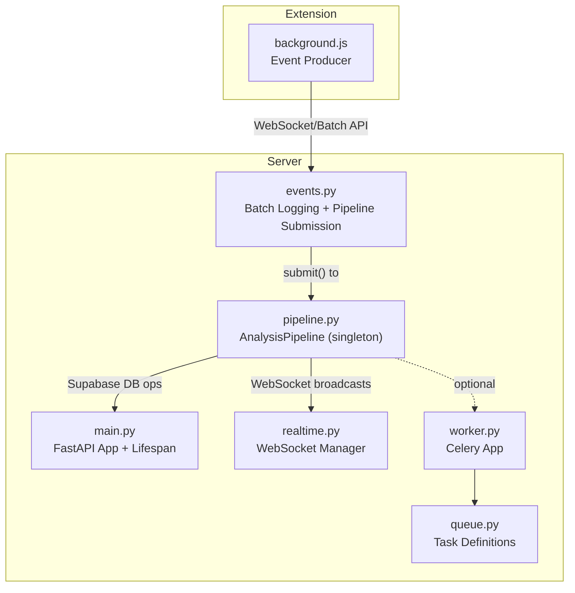
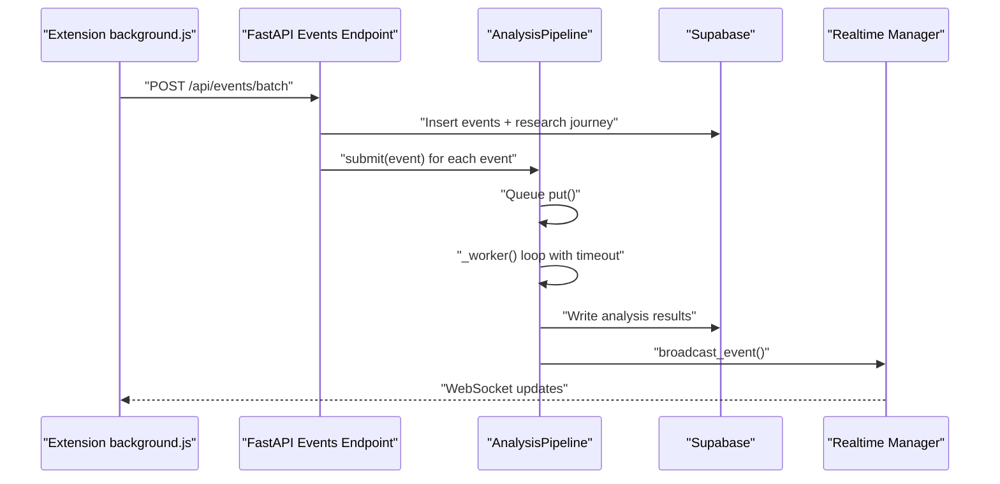
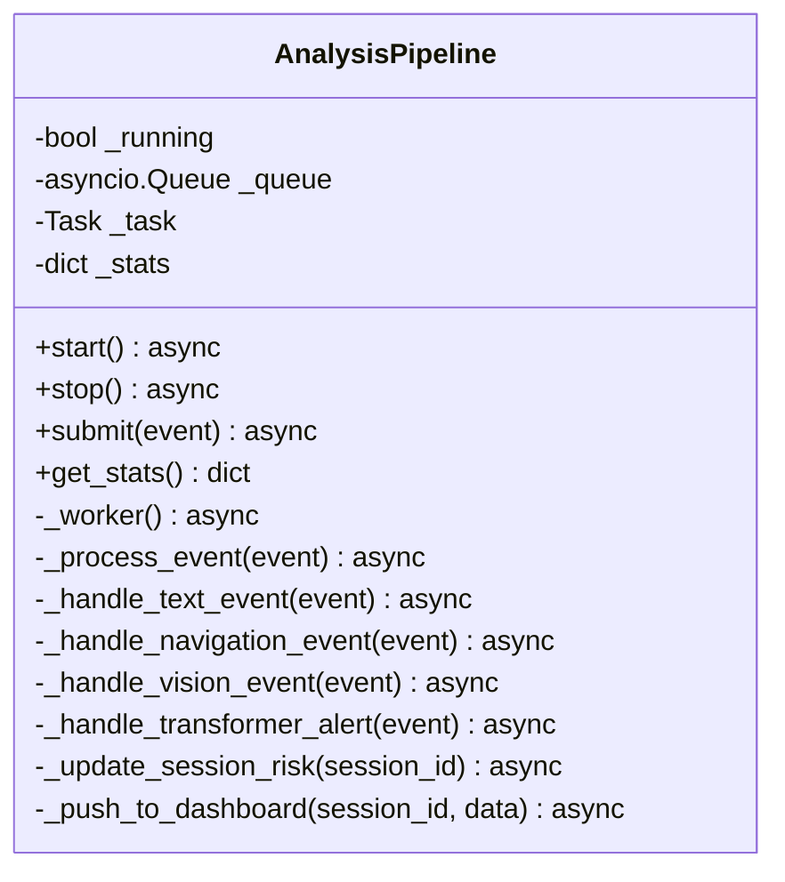
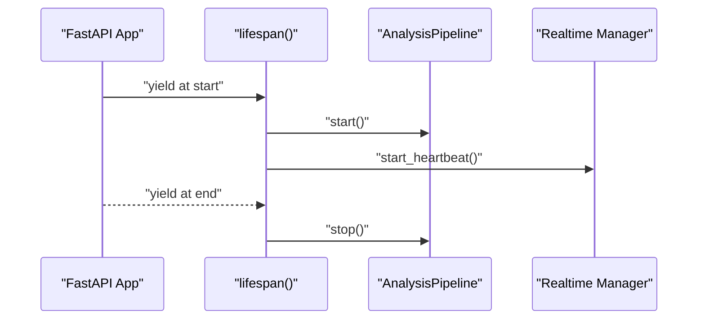
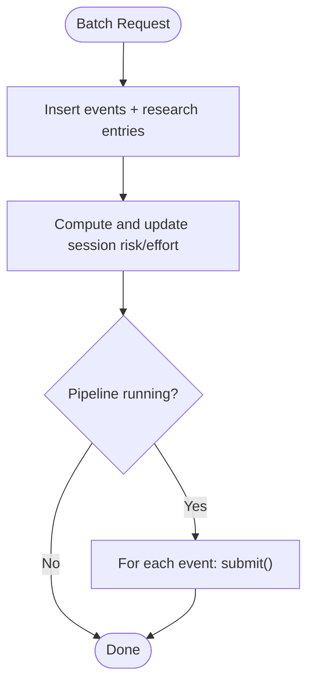
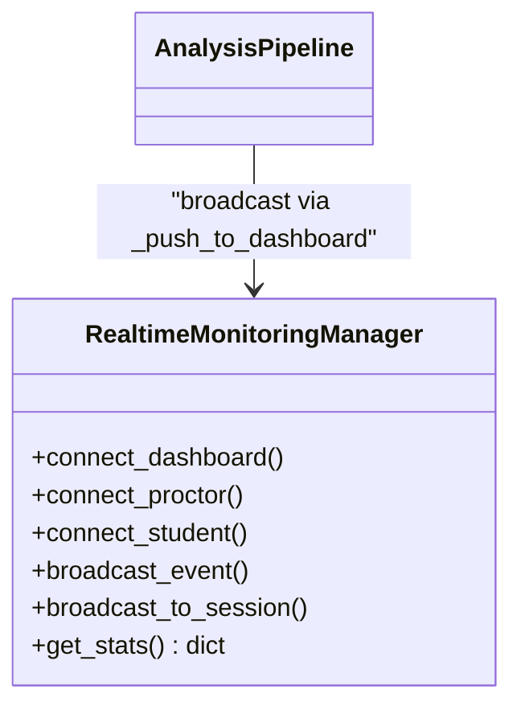
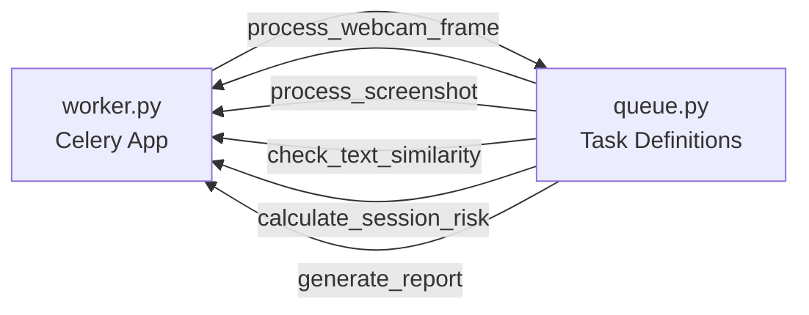
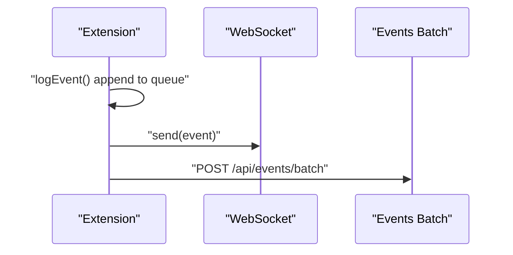
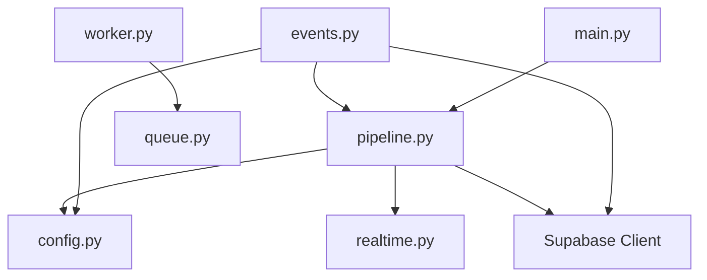

# Pipeline Coordination & Worker Management

<cite>
**Referenced Files in This Document**
- [pipeline.py](file://server/services/pipeline.py)
- [main.py](file://server/main.py)
- [events.py](file://server/api/endpoints/events.py)
- [realtime.py](file://server/services/realtime.py)
- [worker.py](file://server/tasks/worker.py)
- [queue.py](file://server/tasks/queue.py)
- [background.js](file://extension/background.js)
- [config.py](file://server/config.py)
</cite>

## Table of Contents
1. [Introduction](#introduction)
2. [Project Structure](#project-structure)
3. [Core Components](#core-components)
4. [Architecture Overview](#architecture-overview)
5. [Detailed Component Analysis](#detailed-component-analysis)
6. [Dependency Analysis](#dependency-analysis)
7. [Performance Considerations](#performance-considerations)
8. [Troubleshooting Guide](#troubleshooting-guide)
9. [Conclusion](#conclusion)

## Introduction
This document explains the AnalysisPipeline coordination and worker management system used for real-time event processing in the ExamGuard Pro platform. It covers the singleton pattern implementation, background worker lifecycle management, queue-based event processing architecture, start/stop mechanisms, task cancellation handling, graceful shutdown procedures, statistics tracking, timeout handling, retry strategies, memory/resource management, and concurrency characteristics. It also provides practical examples from the codebase and guidance for scaling under high-volume event loads.

## Project Structure
The pipeline spans several modules:
- Real-time analysis pipeline: server/services/pipeline.py
- Application lifecycle and integration: server/main.py
- Event ingestion and batching: server/api/endpoints/events.py
- Real-time broadcasting: server/services/realtime.py
- Background task worker (Celery): server/tasks/worker.py and server/tasks/queue.py
- Extension event producer: extension/background.js
- Configuration: server/config.py

**Diagram sources**
- [main.py:109-165](file://server/main.py#L109-L165)
- [pipeline.py:9-345](file://server/services/pipeline.py#L9-L345)
- [events.py:144-337](file://server/api/endpoints/events.py#L144-L337)
- [realtime.py:102-643](file://server/services/realtime.py#L102-L643)
- [worker.py:1-35](file://server/tasks/worker.py#L1-L35)
- [queue.py:1-75](file://server/tasks/queue.py#L1-L75)

**Section sources**
- [main.py:109-165](file://server/main.py#L109-L165)
- [pipeline.py:9-345](file://server/services/pipeline.py#L9-L345)
- [events.py:144-337](file://server/api/endpoints/events.py#L144-L337)
- [realtime.py:102-643](file://server/services/realtime.py#L102-L643)
- [worker.py:1-35](file://server/tasks/worker.py#L1-L35)
- [queue.py:1-75](file://server/tasks/queue.py#L1-L75)

## Core Components
- AnalysisPipeline: Singleton async worker managing an internal asyncio queue, processing events, updating session risk, and broadcasting updates.
- FastAPI lifespan: Starts the pipeline at application boot and stops it gracefully on shutdown.
- Event ingestion: Batch endpoint logs events to Supabase and submits them to the pipeline.
- Real-time broadcasting: WebSocket manager for dashboards, proctors, and students.
- Background tasks: Celery worker for offloaded heavy computations (optional).

Key responsibilities:
- Queue-based event processing with timeouts and retries
- Statistics tracking for events processed, transformer analyses, DB updates, and errors
- Graceful shutdown with task cancellation and resource cleanup
- Integration with Supabase for persistence and with WebSocket for real-time updates

**Section sources**
- [pipeline.py:9-345](file://server/services/pipeline.py#L9-L345)
- [main.py:109-165](file://server/main.py#L109-L165)
- [events.py:144-337](file://server/api/endpoints/events.py#L144-L337)
- [realtime.py:102-643](file://server/services/realtime.py#L102-L643)
- [worker.py:1-35](file://server/tasks/worker.py#L1-L35)

## Architecture Overview
The system integrates the extension, backend API, pipeline, and real-time manager:

**Diagram sources**
- [events.py:144-337](file://server/api/endpoints/events.py#L144-L337)
- [pipeline.py:44-96](file://server/services/pipeline.py#L44-L96)
- [realtime.py:334-378](file://server/services/realtime.py#L334-L378)

## Detailed Component Analysis

### AnalysisPipeline: Singleton, Queue, and Worker
- Singleton pattern: A global variable holds a single AnalysisPipeline instance accessed via a factory function.
- Async worker lifecycle:
  - start(): Sets running flag, creates an asyncio Task wrapping the internal _worker().
  - stop(): Cancels the worker task and awaits completion, printing a stop message.
- Queue management:
  - Uses asyncio.Queue for FIFO event delivery.
  - _worker() runs while running flag is True, with a 1-second timeout on queue.get().
  - On timeout, continues the loop; on exceptions, increments errors counter and sleeps briefly.
- Event processing:
  - _process_event() routes by event type and always updates session risk.
  - Specific handlers:
    - Text events: optional transformer analysis, DB insert, dashboard push.
    - Navigation events: categorize URL, compute risk impact, update session, insert analysis.
    - Vision/anomaly events: update session fields, broadcast alerts.
    - Transformer alerts: adjust risk/effort based on similarity threshold.
- Statistics:
  - Tracks events_processed, transformer_analyses, db_updates, errors, plus queue_size and running state.

**Diagram sources**
- [pipeline.py:9-345](file://server/services/pipeline.py#L9-L345)

**Section sources**
- [pipeline.py:14-53](file://server/services/pipeline.py#L14-L53)
- [pipeline.py:25-43](file://server/services/pipeline.py#L25-L43)
- [pipeline.py:55-73](file://server/services/pipeline.py#L55-L73)
- [pipeline.py:74-96](file://server/services/pipeline.py#L74-L96)
- [pipeline.py:97-148](file://server/services/pipeline.py#L97-L148)
- [pipeline.py:149-220](file://server/services/pipeline.py#L149-L220)
- [pipeline.py:221-277](file://server/services/pipeline.py#L221-L277)
- [pipeline.py:225-245](file://server/services/pipeline.py#L225-L245)
- [pipeline.py:278-305](file://server/services/pipeline.py#L278-L305)
- [pipeline.py:306-336](file://server/services/pipeline.py#L306-L336)
- [pipeline.py:337-345](file://server/services/pipeline.py#L337-L345)

### FastAPI Lifespan and Pipeline Integration
- Startup: Creates and starts the singleton pipeline, stores it in app state.
- Shutdown: Cancels heartbeat task, stops the pipeline, prints shutdown messages.

**Diagram sources**
- [main.py:109-165](file://server/main.py#L109-L165)

**Section sources**
- [main.py:128-133](file://server/main.py#L128-L133)
- [main.py:158-161](file://server/main.py#L158-L161)

### Event Ingestion and Pipeline Submission
- Batch endpoint:
  - Inserts events and research journey entries.
  - Updates session risk/effort once per batch.
  - Submits each event to the pipeline if running.

**Diagram sources**
- [events.py:144-337](file://server/api/endpoints/events.py#L144-L337)

**Section sources**
- [events.py:310-326](file://server/api/endpoints/events.py#L310-L326)

### Real-Time Broadcasting and Statistics
- RealtimeMonitoringManager:
  - Manages rooms, dashboards, proctors, and students.
  - Broadcasts events and maintains stats for connections, events, and alerts.
- Pipeline pushes updates to dashboards and sessions via broadcast helpers.

**Diagram sources**
- [realtime.py:102-643](file://server/services/realtime.py#L102-L643)
- [pipeline.py:306-336](file://server/services/pipeline.py#L306-L336)

**Section sources**
- [realtime.py:561-577](file://server/services/realtime.py#L561-L577)
- [pipeline.py:306-336](file://server/services/pipeline.py#L306-L336)

### Background Tasks (Optional Celery Worker)
- Celery app configured with Redis as broker/backend, JSON serialization, time limits, prefetch multiplier, and late acks.
- Task definitions include webcam frame processing, screenshot OCR, similarity checks, risk calculation, and report generation.

**Diagram sources**
- [worker.py:1-35](file://server/tasks/worker.py#L1-L35)
- [queue.py:1-75](file://server/tasks/queue.py#L1-L75)

**Section sources**
- [worker.py:10-31](file://server/tasks/worker.py#L10-L31)
- [queue.py:11-75](file://server/tasks/queue.py#L11-L75)

### Extension Event Producer
- Maintains an in-memory event queue and periodically syncs to the backend.
- Emits events (tabs, navigation, clipboard, window focus, etc.) and sends them via WebSocket for immediate updates.
- Triggers periodic transformer analysis on clipboard text.

**Diagram sources**
- [background.js:1194-1228](file://extension/background.js#L1194-L1228)
- [background.js:1232-1259](file://extension/background.js#L1232-L1259)

**Section sources**
- [background.js:1194-1228](file://extension/background.js#L1194-L1228)
- [background.js:1232-1259](file://extension/background.js#L1232-L1259)

## Dependency Analysis
- Pipeline depends on:
  - Supabase client for DB operations
  - Realtime manager for WebSocket broadcasts
  - Config constants for URL classification and risk weights
- Events endpoint depends on:
  - Supabase client
  - Config for risk weights and URL classification
  - Pipeline singleton for submission
- Realtime manager depends on:
  - WebSocket connections and room management
- Celery worker depends on:
  - Redis broker
  - Task modules

**Diagram sources**
- [pipeline.py:5-7](file://server/services/pipeline.py#L5-L7)
- [events.py:7-9](file://server/api/endpoints/events.py#L7-L9)
- [main.py:128-132](file://server/main.py#L128-L132)
- [worker.py:6-18](file://server/tasks/worker.py#L6-L18)

**Section sources**
- [pipeline.py:5-7](file://server/services/pipeline.py#L5-L7)
- [events.py:7-9](file://server/api/endpoints/events.py#L7-L9)
- [main.py:128-132](file://server/main.py#L128-L132)
- [worker.py:6-18](file://server/tasks/worker.py#L6-L18)

## Performance Considerations
- Concurrency model:
  - Single-threaded asyncio worker processes events sequentially from a single queue.
  - Backpressure via queue size and blocking queue.put() behavior.
- Timeout handling:
  - Worker uses a 1-second timeout on queue.get() to remain responsive to stop signals.
- Retry and resilience:
  - On processing exceptions, the worker increments errors and sleeps briefly before continuing.
  - Batch endpoint handles insertion failures and warns without failing the whole batch.
- Memory management:
  - Extension trims event queue to a bounded size to prevent memory growth.
  - Pipeline keeps minimal in-memory state; persistence is handled by Supabase.
- Scaling strategies:
  - Horizontal scaling: Run multiple server instances behind a load balancer; ensure shared Redis for Celery if used.
  - Vertical scaling: Increase CPU/RAM for the server process; consider multiple worker processes for CPU-bound tasks (e.g., OCR).
  - Offloading: Use Celery tasks for heavy computations (e.g., OCR, webcam processing) to keep the main pipeline responsive.

[No sources needed since this section provides general guidance]

## Troubleshooting Guide
Common issues and remedies:
- Pipeline not starting:
  - Verify lifespan startup code initializes and starts the pipeline.
  - Check for exceptions during pipeline creation or start.
- Pipeline not stopping:
  - Ensure stop() is called during shutdown and that the task is awaited after cancellation.
- Events not reaching the pipeline:
  - Confirm batch endpoint calls submit() and that the pipeline is running.
  - Inspect Supabase insertion errors and warnings.
- WebSocket updates not received:
  - Validate realtime manager connections and broadcast calls.
  - Check heartbeat and connection counts.
- High error counts:
  - Review worker exception handling and error counter increments.
  - Investigate DB connectivity and Supabase rate limits.
- Celery tasks not executing:
  - Verify Redis availability and Celery app configuration.
  - Ensure task names match included modules.

**Section sources**
- [main.py:158-161](file://server/main.py#L158-L161)
- [events.py:310-326](file://server/api/endpoints/events.py#L310-L326)
- [pipeline.py:67-72](file://server/services/pipeline.py#L67-L72)
- [realtime.py:539-560](file://server/services/realtime.py#L539-L560)
- [worker.py:10-31](file://server/tasks/worker.py#L10-L31)

## Conclusion
The AnalysisPipeline provides a robust, single-threaded, queue-driven processing model integrated with FastAPI’s lifespan for lifecycle management. It tracks key performance metrics, handles timeouts and errors gracefully, and integrates tightly with Supabase and WebSocket broadcasting. For high-volume scenarios, complement the pipeline with Celery-backed background tasks and scale horizontally as needed. The singleton pattern ensures consistent state and simplified access across the application.