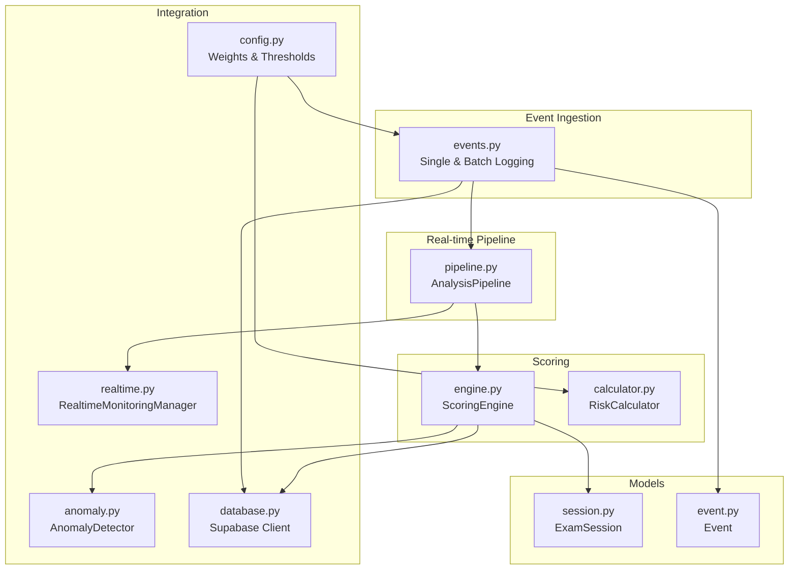
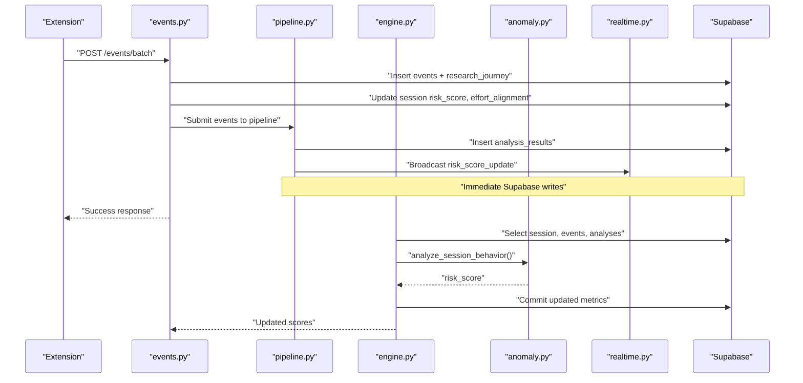
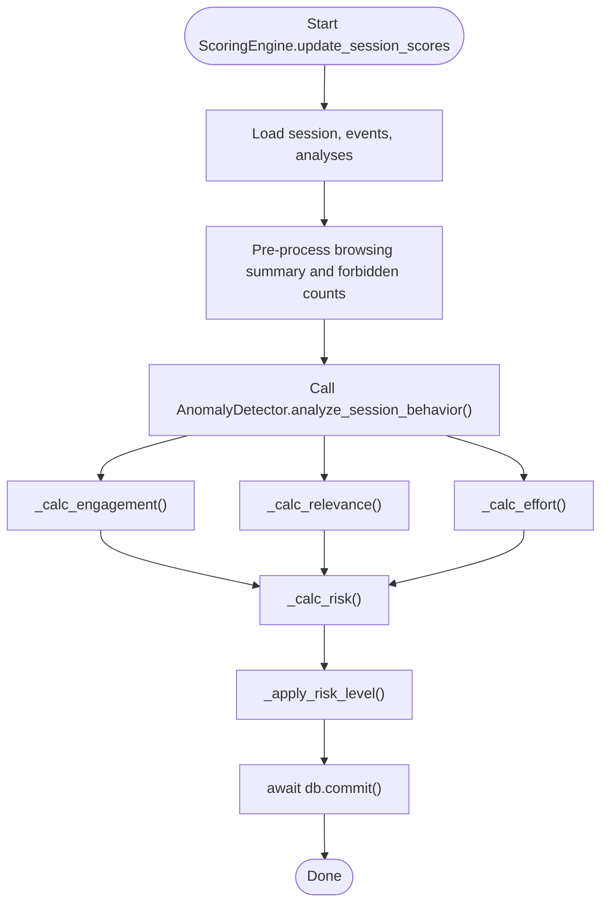
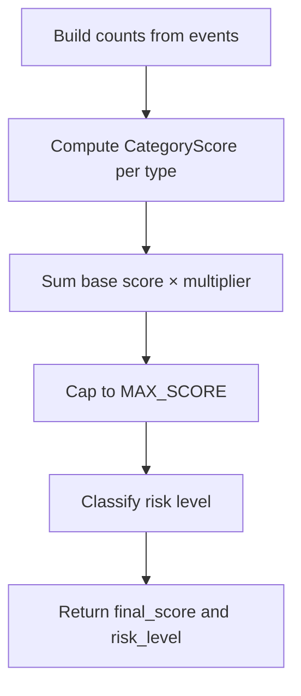
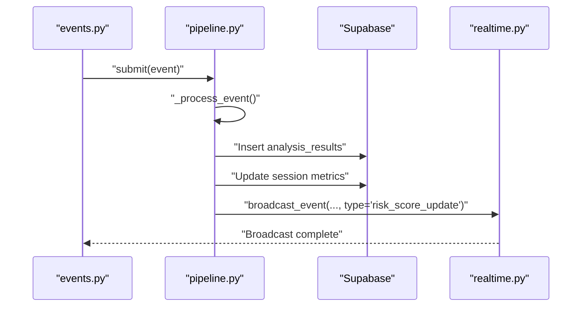
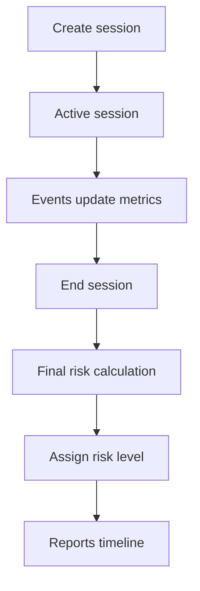
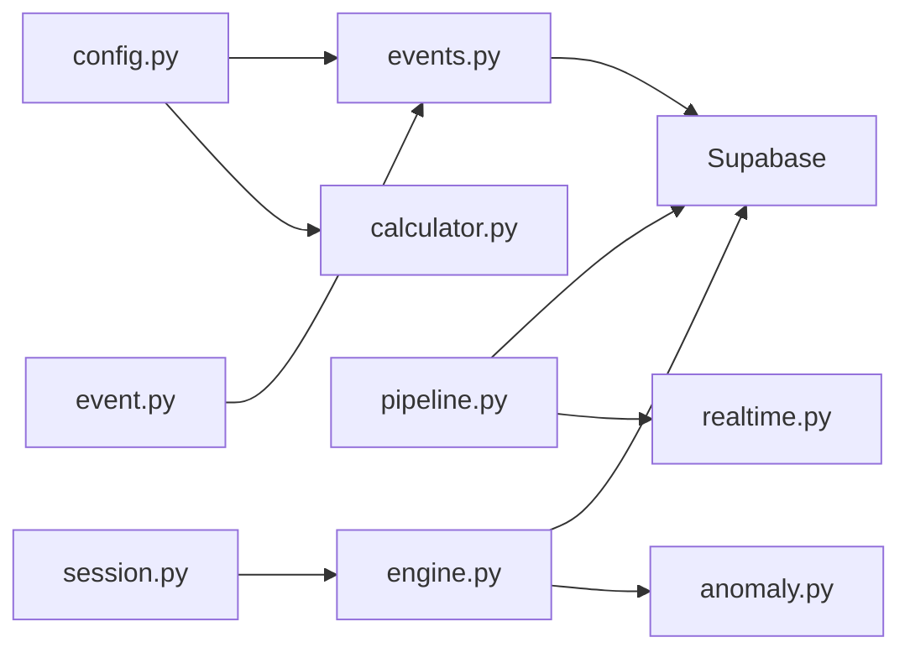

# Risk Scoring & Session Updates

<cite>
**Referenced Files in This Document**
- [engine.py](file://server/scoring/engine.py)
- [calculator.py](file://server/scoring/calculator.py)
- [config.py](file://server/config.py)
- [events.py](file://server/api/endpoints/events.py)
- [sessions.py](file://server/api/endpoints/sessions.py)
- [pipeline.py](file://server/services/pipeline.py)
- [anomaly.py](file://server/services/anomaly.py)
- [realtime.py](file://server/services/realtime.py)
- [session.py](file://server/models/session.py)
- [event.py](file://server/models/event.py)
- [database.py](file://server/database.py)
- [reports.py](file://server/api/endpoints/reports.py)
- [worker.py](file://server/tasks/worker.py)
- [queue.py](file://server/tasks/queue.py)
</cite>

## Table of Contents
1. [Introduction](#introduction)
2. [Project Structure](#project-structure)
3. [Core Components](#core-components)
4. [Architecture Overview](#architecture-overview)
5. [Detailed Component Analysis](#detailed-component-analysis)
6. [Dependency Analysis](#dependency-analysis)
7. [Performance Considerations](#performance-considerations)
8. [Troubleshooting Guide](#troubleshooting-guide)
9. [Conclusion](#conclusion)

## Introduction
This document explains the risk scoring integration and session management within the AnalysisPipeline. It covers automatic risk score calculation, risk level determination, and session state updates triggered by events. It documents thresholds, penalty calculations, and the relationships among engagement_score, effort_alignment, and content_relevance. Concrete examples show how forbidden site visits, plagiarism detection, and vision anomalies modify risk scores. It also details session data structure updates, Supabase persistence, real-time broadcasting, and the balance between immediate updates and batch processing.

## Project Structure
The risk scoring and session management span several modules:
- Scoring: centralized calculation and engine orchestration
- Events: ingestion and batch updates with immediate risk adjustments
- Pipeline: real-time analysis and immediate Supabase updates
- Anomaly detection: external module feeding risk scores
- Real-time service: WebSocket broadcasting to dashboards and extensions
- Models: session and event data structures
- Configuration: risk weights and thresholds
- Database: Supabase client and schema access



**Diagram sources**
- [events.py:144-336](file://server/api/endpoints/events.py#L144-L336)
- [pipeline.py:74-305](file://server/services/pipeline.py#L74-L305)
- [engine.py:381-445](file://server/scoring/engine.py#L381-L445)
- [calculator.py:161-206](file://server/scoring/calculator.py#L161-L206)
- [session.py:15-63](file://server/models/session.py#L15-L63)
- [event.py:6-30](file://server/models/event.py#L6-L30)
- [config.py:164-196](file://server/config.py#L164-L196)
- [anomaly.py:23-165](file://server/services/anomaly.py#L23-L165)
- [realtime.py:334-416](file://server/services/realtime.py#L334-L416)
- [database.py:18-23](file://server/database.py#L18-L23)

**Section sources**
- [events.py:144-336](file://server/api/endpoints/events.py#L144-L336)
- [pipeline.py:74-305](file://server/services/pipeline.py#L74-L305)
- [engine.py:381-445](file://server/scoring/engine.py#L381-L445)
- [calculator.py:161-206](file://server/scoring/calculator.py#L161-L206)
- [session.py:15-63](file://server/models/session.py#L15-L63)
- [event.py:6-30](file://server/models/event.py#L6-L30)
- [config.py:164-196](file://server/config.py#L164-L196)
- [anomaly.py:23-165](file://server/services/anomaly.py#L23-L165)
- [realtime.py:334-416](file://server/services/realtime.py#L334-L416)
- [database.py:18-23](file://server/database.py#L18-L23)

## Core Components
- Risk scoring engine: computes engagement_score, content_relevance, effort_alignment, and risk_score; applies risk level thresholds
- Risk calculator: calculates risk from event counts with repeat-offense multipliers and capped scores
- Event ingestion: logs events and updates session risk/effort in near-real time; supports batch inserts with aggregated impacts
- Analysis pipeline: routes events to specialized handlers, persists analysis results, and triggers immediate session updates
- Anomaly detection: external module contributing anomaly risk scores
- Real-time broadcasting: WebSocket manager pushes risk updates and alerts to dashboards and extensions
- Session model: tracks risk metrics, stats, and lifecycle

**Section sources**
- [engine.py:27-93](file://server/scoring/engine.py#L27-L93)
- [calculator.py:22-156](file://server/scoring/calculator.py#L22-L156)
- [events.py:30-142](file://server/api/endpoints/events.py#L30-L142)
- [events.py:144-336](file://server/api/endpoints/events.py#L144-L336)
- [pipeline.py:74-305](file://server/services/pipeline.py#L74-L305)
- [anomaly.py:23-165](file://server/services/anomaly.py#L23-L165)
- [realtime.py:334-416](file://server/services/realtime.py#L334-L416)
- [session.py:15-63](file://server/models/session.py#L15-L63)

## Architecture Overview
The system integrates immediate event processing with periodic recalculations:
- Single and batch event logging update session risk and effort immediately
- The analysis pipeline performs real-time transformations and pushes analysis results
- The scoring engine periodically recomputes session metrics and persists them
- Anomaly detection contributes risk scores to the combined risk metric
- Real-time service broadcasts risk updates and alerts



**Diagram sources**
- [events.py:144-336](file://server/api/endpoints/events.py#L144-L336)
- [pipeline.py:74-305](file://server/services/pipeline.py#L74-L305)
- [engine.py:381-445](file://server/scoring/engine.py#L381-L445)
- [anomaly.py:23-165](file://server/services/anomaly.py#L23-L165)
- [realtime.py:334-416](file://server/services/realtime.py#L334-L416)

## Detailed Component Analysis

### Risk Scoring Engine
The engine orchestrates metric computation:
- Engagement: penalizes tab switches, window blurs, excessive distraction time, and flagged open tabs; accounts for face absence
- Content relevance: penalizes forbidden site visits and OCR forbidden keywords; considers exam-platform time
- Effort alignment: blends browsing productivity with extension effort estimates; penalizes excessive copy/paste and per-category forbidden visits
- Risk: aggregates vision impact, OCR-derived content relevance, anomaly risk, and browsing risk; adds capped forbidden-site bonuses; maps to risk level and optional flagged status



**Diagram sources**
- [engine.py:381-445](file://server/scoring/engine.py#L381-L445)
- [engine.py:195-308](file://server/scoring/engine.py#L195-L308)
- [engine.py:311-354](file://server/scoring/engine.py#L311-L354)
- [engine.py:357-369](file://server/scoring/engine.py#L357-L369)
- [anomaly.py:23-165](file://server/services/anomaly.py#L23-L165)

**Section sources**
- [engine.py:27-93](file://server/scoring/engine.py#L27-L93)
- [engine.py:195-308](file://server/scoring/engine.py#L195-L308)
- [engine.py:311-354](file://server/scoring/engine.py#L311-L354)
- [engine.py:357-369](file://server/scoring/engine.py#L357-L369)
- [anomaly.py:23-165](file://server/services/anomaly.py#L23-L165)

### Risk Calculator (Event-Based)
The calculator computes risk from event counts:
- CategoryScore: weight per event type from configuration
- RiskBreakdown: accumulates contributions, applies repeat-offense multipliers, caps final score, and classifies risk level
- Thresholds: configurable SAFE and REVIEW thresholds map numeric scores to risk labels



**Diagram sources**
- [calculator.py:22-156](file://server/scoring/calculator.py#L22-L156)
- [config.py:164-196](file://server/config.py#L164-L196)

**Section sources**
- [calculator.py:22-156](file://server/scoring/calculator.py#L22-L156)
- [config.py:164-196](file://server/config.py#L164-L196)

### Event Ingestion and Immediate Session Updates
- Single event logging: inserts event with risk_weight, updates session risk_score, effort_alignment, and stats; maps risk to level
- Batch logging: bulk-inserts events and research_journey entries; aggregates risk and effort impacts; updates session once; submits events to pipeline
- Navigation categorization: classifies URLs and records analysis results; penalizes forbidden sites with immediate session updates

```mermaid
sequenceDiagram
participant Ext as "Extension"
participant API as "events.py"
participant DB as "Supabase"
participant Pipe as "pipeline.py"
Ext->>API : "POST /events/log"
API->>DB : "Insert event"
API->>DB : "Update session risk_score, effort_alignment, stats"
API-->>Ext : "EventResponse"
Ext->>API : "POST /events/batch"
API->>DB : "Bulk insert events + research_journey"
API->>DB : "Aggregate risk and effort; update session once"
API->>Pipe : "Submit events"
API-->>Ext : "Batch result"
```

**Diagram sources**
- [events.py:30-142](file://server/api/endpoints/events.py#L30-L142)
- [events.py:144-336](file://server/api/endpoints/events.py#L144-L336)
- [pipeline.py:74-96](file://server/services/pipeline.py#L74-L96)

**Section sources**
- [events.py:30-142](file://server/api/endpoints/events.py#L30-L142)
- [events.py:144-336](file://server/api/endpoints/events.py#L144-L336)
- [pipeline.py:74-96](file://server/services/pipeline.py#L74-L96)

### Analysis Pipeline and Real-time Updates
- Routes events to handlers for text, navigation, focus, transformer alerts, and vision anomalies
- Immediately updates session metrics for forbidden sites, plagiarism, and vision anomalies
- Inserts analysis results and pushes real-time updates to dashboards and extensions
- Broadcasts risk updates and alerts with severity levels



**Diagram sources**
- [pipeline.py:74-305](file://server/services/pipeline.py#L74-L305)
- [realtime.py:334-416](file://server/services/realtime.py#L334-L416)

**Section sources**
- [pipeline.py:74-305](file://server/services/pipeline.py#L74-L305)
- [realtime.py:334-416](file://server/services/realtime.py#L334-L416)

### Session Lifecycle and Final Risk Calculation
- Session creation initializes risk metrics and status
- During active sessions, events continuously update risk_score and effort_alignment
- Ending a session triggers final risk calculation and risk level assignment
- Reports endpoint builds a timeline with cumulative risk and event details



**Diagram sources**
- [sessions.py:12-101](file://server/api/endpoints/sessions.py#L12-L101)
- [sessions.py:146-209](file://server/api/endpoints/sessions.py#L146-L209)
- [reports.py:158-177](file://server/api/endpoints/reports.py#L158-L177)

**Section sources**
- [sessions.py:12-101](file://server/api/endpoints/sessions.py#L12-L101)
- [sessions.py:146-209](file://server/api/endpoints/sessions.py#L146-L209)
- [reports.py:158-177](file://server/api/endpoints/reports.py#L158-L177)

### Risk Score Modifications by Violations
- Forbidden site visits: increase risk_score, reduce content_relevance and engagement_score; insert analysis result
- Plagiarism detection: reduce effort_alignment and risk_score based on similarity
- Vision anomalies: immediate updates (e.g., phone detection sets risk_score to maximum and risk_level to suspicious)

**Section sources**
- [pipeline.py:205-218](file://server/services/pipeline.py#L205-L218)
- [pipeline.py:230-244](file://server/services/pipeline.py#L230-L244)
- [pipeline.py:254-276](file://server/services/pipeline.py#L254-L276)

## Dependency Analysis
Key dependencies and relationships:
- Scoring engine depends on models and anomaly detection; writes to Supabase
- Event endpoints depend on configuration weights and models; write to Supabase
- Analysis pipeline depends on Supabase and real-time service; writes analysis results
- Real-time service manages WebSocket connections and broadcasts events
- Configuration centralizes risk weights and thresholds



**Diagram sources**
- [config.py:164-196](file://server/config.py#L164-L196)
- [events.py:30-142](file://server/api/endpoints/events.py#L30-L142)
- [calculator.py:161-206](file://server/scoring/calculator.py#L161-L206)
- [pipeline.py:74-305](file://server/services/pipeline.py#L74-L305)
- [realtime.py:334-416](file://server/services/realtime.py#L334-L416)
- [engine.py:381-445](file://server/scoring/engine.py#L381-L445)
- [anomaly.py:23-165](file://server/services/anomaly.py#L23-L165)
- [session.py:15-63](file://server/models/session.py#L15-L63)
- [event.py:6-30](file://server/models/event.py#L6-L30)

**Section sources**
- [config.py:164-196](file://server/config.py#L164-L196)
- [events.py:30-142](file://server/api/endpoints/events.py#L30-L142)
- [calculator.py:161-206](file://server/scoring/calculator.py#L161-L206)
- [pipeline.py:74-305](file://server/services/pipeline.py#L74-L305)
- [realtime.py:334-416](file://server/services/realtime.py#L334-L416)
- [engine.py:381-445](file://server/scoring/engine.py#L381-L445)
- [anomaly.py:23-165](file://server/services/anomaly.py#L23-L165)
- [session.py:15-63](file://server/models/session.py#L15-L63)
- [event.py:6-30](file://server/models/event.py#L6-L30)

## Performance Considerations
- Batch processing: the batch endpoint reduces database round-trips by bulk-inserting events and updating session metrics once
- Real-time pipeline: immediate updates minimize latency for critical violations (e.g., phone detection)
- Scoring engine: periodic recomputation ensures consistency; anomaly detection cost is bounded and externalized
- Supabase writes: minimal transactions per event plus batched writes improve throughput
- WebSocket broadcasting: selective rooms and alert severities reduce unnecessary traffic

[No sources needed since this section provides general guidance]

## Troubleshooting Guide
- Session not found during batch: the batch endpoint tolerates missing sessions to prevent retry loops and returns a warning
- Pipeline submission failures: pipeline submission errors are caught and logged; session updates still occur
- Real-time broadcast errors: WebSocket errors are caught and logged; connections are cleaned up
- Risk level thresholds: ensure configuration thresholds align with intended safety margins

**Section sources**
- [events.py:154-159](file://server/api/endpoints/events.py#L154-L159)
- [events.py:324-325](file://server/api/endpoints/events.py#L324-L325)
- [pipeline.py:334-335](file://server/services/pipeline.py#L334-L335)

## Conclusion
The system combines immediate event-driven updates with periodic scoring recalculations to maintain accurate and responsive risk assessments. Supabase serves as the central persistence layer, while the real-time service ensures timely communication with dashboards and extensions. The modular design allows for incremental improvements, such as integrating the ScoringEngine for final risk calculation upon session end and optimizing batch sizes and anomaly detection parameters.