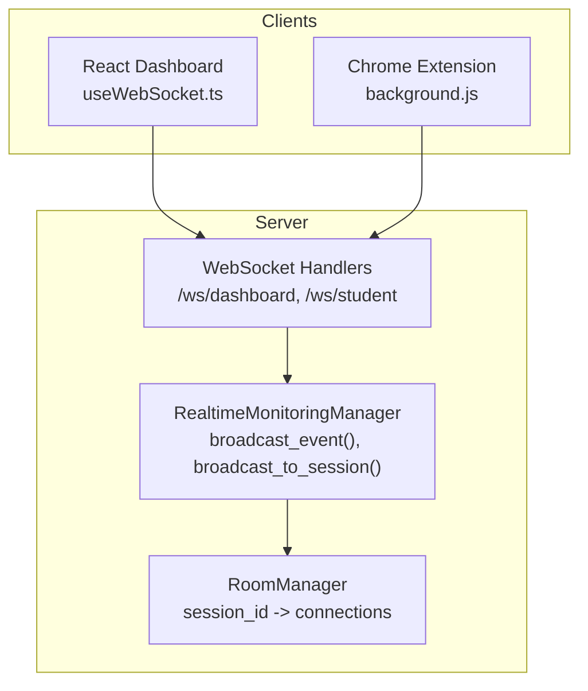
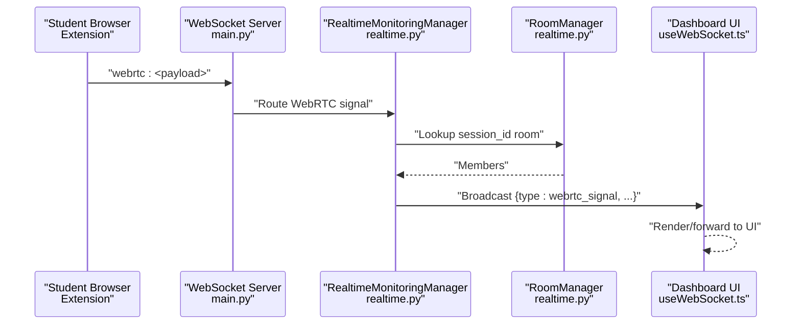
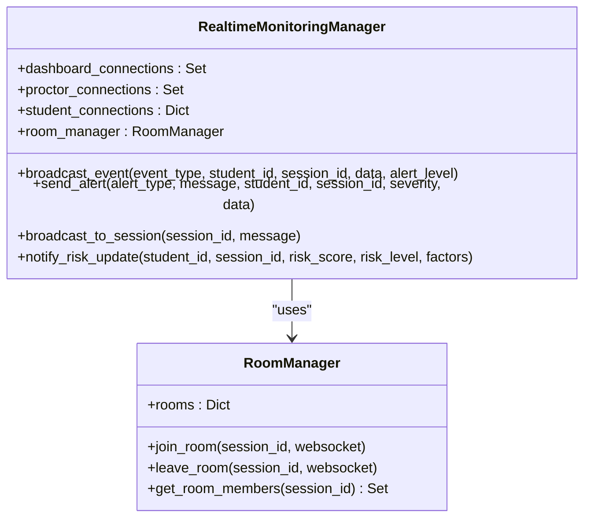
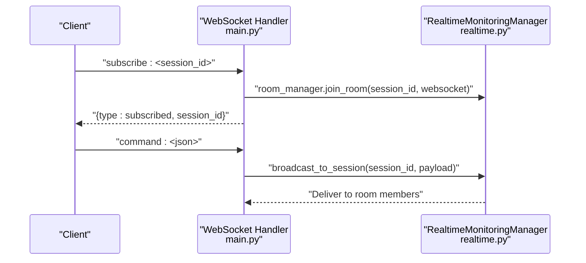
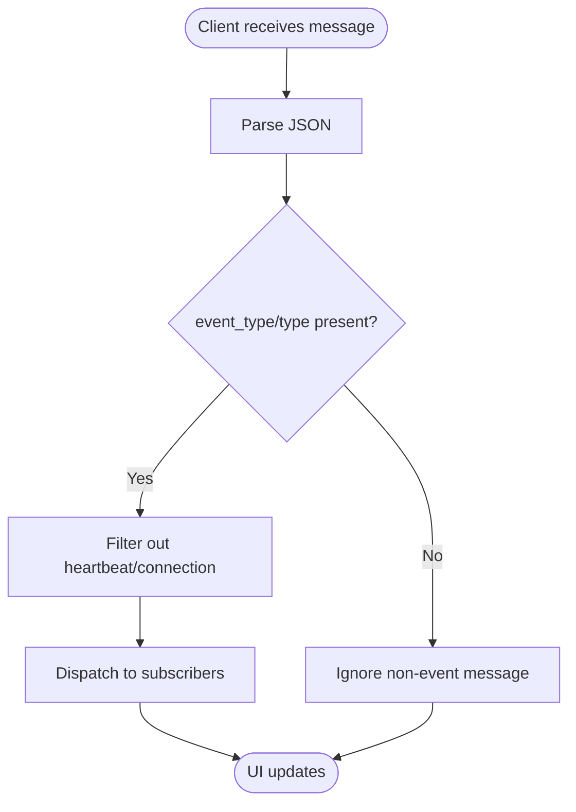
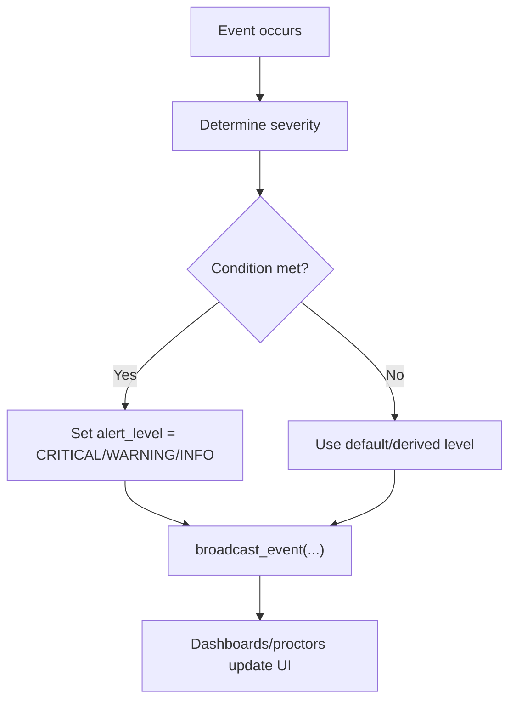
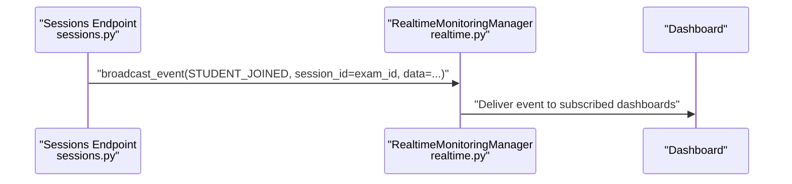
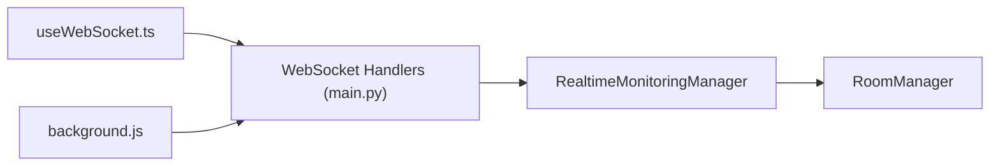

# WebSocket Broadcasting & Client Notifications

<cite>
**Referenced Files in This Document**
- [realtime.py](file://server/services/realtime.py)
- [main.py](file://server/main.py)
- [useWebSocket.ts](file://examguard-pro/src/hooks/useWebSocket.ts)
- [background.js](file://extension/background.js)
- [manifest.json](file://extension/manifest.json)
- [sessions.py](file://server/api/endpoints/sessions.py)
- [event.py](file://server/api/schemas/event.py)
- [session.py](file://server/api/schemas/session.py)
</cite>

## Table of Contents
1. [Introduction](#introduction)
2. [Project Structure](#project-structure)
3. [Core Components](#core-components)
4. [Architecture Overview](#architecture-overview)
5. [Detailed Component Analysis](#detailed-component-analysis)
6. [Dependency Analysis](#dependency-analysis)
7. [Performance Considerations](#performance-considerations)
8. [Troubleshooting Guide](#troubleshooting-guide)
9. [Conclusion](#conclusion)

## Introduction
This document explains the WebSocket-based real-time broadcasting and client notification system within the AnalysisPipeline. It covers how events are generated, categorized by alert level, routed to dashboards and proctors, and delivered to multiple client types including the React dashboard and the Chrome extension. It also documents room-based messaging for exam sessions, the relationship between session_id and exam_id in routing, and the client-side event handling patterns. Concrete examples are drawn from the codebase to illustrate alert level determination, event type mapping, and the data payload structure.

## Project Structure
The real-time system spans three primary areas:
- Server-side WebSocket and event broadcasting in the backend
- Client-side React WebSocket manager for dashboards
- Chrome extension WebSocket client for student-side monitoring and immediate anomaly responses

**Diagram sources**
- [realtime.py:102-417](file://server/services/realtime.py#L102-L417)
- [main.py:297-489](file://server/main.py#L297-L489)
- [useWebSocket.ts:1-175](file://examguard-pro/src/hooks/useWebSocket.ts#L1-L175)
- [background.js:1-200](file://extension/background.js#L1-L200)

**Section sources**
- [realtime.py:102-417](file://server/services/realtime.py#L102-L417)
- [main.py:297-489](file://server/main.py#L297-L489)
- [useWebSocket.ts:1-175](file://examguard-pro/src/hooks/useWebSocket.ts#L1-L175)
- [background.js:1-200](file://extension/background.js#L1-L200)

## Core Components
- RealtimeMonitoringManager: Central broadcaster that builds RealtimeEvent objects, maintains connection pools, manages rooms, and sends JSON or binary payloads.
- RoomManager: Associates WebSocket connections to session_id rooms for targeted delivery.
- WebSocket handlers: Accept connections for dashboards and students, process commands, route WebRTC signals, and forward binary media chunks.
- Client managers:
  - React useWebSocket.ts: Singleton WebSocketManager that connects to /dashboard, subscribes to rooms, and dispatches messages to subscribers.
  - Chrome extension background.js: Connects to /student, relays WebRTC signaling, streams binary chunks, and reacts to anomaly alerts.

Key routing and alerting patterns:
- Alert levels: INFO, WARNING, CRITICAL, EMERGENCY are defined and applied to events and alerts.
- Event types: Enumerated in EventType and mapped from client-originated actions (e.g., tab switching, copy/paste) to server events.
- Payload structure: RealtimeEvent includes event_type, student_id, session_id, data, alert_level, timestamp.

**Section sources**
- [realtime.py:16-78](file://server/services/realtime.py#L16-L78)
- [realtime.py:81-100](file://server/services/realtime.py#L81-L100)
- [realtime.py:334-417](file://server/services/realtime.py#L334-L417)
- [main.py:297-489](file://server/main.py#L297-L489)
- [useWebSocket.ts:1-175](file://examguard-pro/src/hooks/useWebSocket.ts#L1-L175)
- [background.js:1-200](file://extension/background.js#L1-L200)

## Architecture Overview
The system supports multi-client real-time communication:
- Dashboards receive global and room-specific events.
- Proctors receive session-specific events.
- Students receive targeted commands and alerts.
- WebRTC signaling and live video streams are routed via session_id rooms.

**Diagram sources**
- [main.py:458-473](file://server/main.py#L458-L473)
- [realtime.py:81-100](file://server/services/realtime.py#L81-L100)
- [useWebSocket.ts:129-175](file://examguard-pro/src/hooks/useWebSocket.ts#L129-L175)

## Detailed Component Analysis

### RealtimeMonitoringManager and RoomManager
- Maintains three connection pools: dashboards, proctors, and student-to-connection mapping.
- Uses RoomManager to associate WebSocket connections with session_id for targeted broadcasts.
- Provides broadcast_event to send JSON events to dashboards and proctors in the session room.
- Offers convenience methods to send alerts and risk updates with severity escalation.

**Diagram sources**
- [realtime.py:102-131](file://server/services/realtime.py#L102-L131)
- [realtime.py:81-100](file://server/services/realtime.py#L81-L100)

**Section sources**
- [realtime.py:102-417](file://server/services/realtime.py#L102-L417)

### WebSocket Handlers and Routing
- /ws/dashboard: Accepts dashboard connections, sends connection confirmation and recent history, and handles ping/stats.
- /ws/student: Accepts student connections, routes WebRTC signaling, forwards binary chunks, and handles dashboard commands.

**Diagram sources**
- [main.py:297-320](file://server/main.py#L297-L320)
- [realtime.py:412-417](file://server/services/realtime.py#L412-L417)

**Section sources**
- [main.py:297-320](file://server/main.py#L297-L320)
- [main.py:458-489](file://server/main.py#L458-L489)

### Client-Side Event Handling Patterns
- React dashboard:
  - Singleton WebSocketManager connects to /dashboard, resubscribes to rooms on reconnect, ignores heartbeat/connection messages, and pushes events to subscribers.
  - useWebSocket hook exposes messages, connection status, and room subscription helpers.

- Chrome extension:
  - Connects to /student, relays WebRTC signaling and binary chunks, and reacts to anomaly alerts.

**Diagram sources**
- [useWebSocket.ts:43-54](file://examguard-pro/src/hooks/useWebSocket.ts#L43-L54)
- [background.js:133-153](file://extension/background.js#L133-L153)

**Section sources**
- [useWebSocket.ts:1-175](file://examguard-pro/src/hooks/useWebSocket.ts#L1-L175)
- [background.js:1-200](file://extension/background.js#L1-L200)

### Alert Level Categorization and Escalation
- AlertLevel enum defines severity tiers used when broadcasting events and alerts.
- Severity escalates based on event characteristics:
  - Risk score updates escalate based on risk_level ("high" → WARNING, "critical" → CRITICAL).
  - Plagiarism escalates based on similarity thresholds.
  - Face missing escalates based on duration thresholds.
  - Specific event types (e.g., behavior violations) are broadcast with CRITICAL by design.

**Diagram sources**
- [realtime.py:16-22](file://server/services/realtime.py#L16-L22)
- [realtime.py:508-533](file://server/services/realtime.py#L508-L533)
- [realtime.py:422-435](file://server/services/realtime.py#L422-L435)
- [realtime.py:456-476](file://server/services/realtime.py#L456-L476)

**Section sources**
- [realtime.py:16-22](file://server/services/realtime.py#L16-L22)
- [realtime.py:508-533](file://server/services/realtime.py#L508-L533)
- [realtime.py:422-435](file://server/services/realtime.py#L422-L435)
- [realtime.py:456-476](file://server/services/realtime.py#L456-L476)

### Room-Based Messaging for Exam Sessions
- RoomManager associates session_id with WebSocket connections.
- broadcast_to_session delivers messages to all members of a session room.
- Session joins trigger STUDENT_JOINED events broadcast to the exam-level room (session_id used as exam_id in this context).

**Diagram sources**
- [sessions.py:72-87](file://server/api/endpoints/sessions.py#L72-L87)
- [realtime.py:334-371](file://server/services/realtime.py#L334-L371)

**Section sources**
- [sessions.py:72-87](file://server/api/endpoints/sessions.py#L72-L87)
- [realtime.py:81-100](file://server/services/realtime.py#L81-L100)
- [realtime.py:334-371](file://server/services/realtime.py#L334-L371)

### Client-Side Event Handling Patterns
- React dashboard:
  - Subscribes to /dashboard and to specific session rooms via subscribeRoom.
  - Filters out heartbeat/connection messages and maintains a capped message history.

- Chrome extension:
  - Subscribes to /student and handles WebRTC signaling and binary chunks.
  - Reacts to anomaly alerts and forwards events to the backend.

**Section sources**
- [useWebSocket.ts:129-175](file://examguard-pro/src/hooks/useWebSocket.ts#L129-L175)
- [background.js:133-153](file://extension/background.js#L133-L153)

### Real-Time Dashboard Updates and Violation Notifications
- Risk score changes:
  - notify_risk_update maps risk_level to alert_level and sends RISK_SCORE_UPDATE events.
- Violation notifications:
  - AI analysis callbacks broadcast vision_alert and anomaly_alert events to session rooms.
  - These are consumed by dashboards and the extension for immediate UI updates.

**Section sources**
- [realtime.py:508-533](file://server/services/realtime.py#L508-L533)
- [realtime.py:140-200](file://server/services/realtime.py#L140-L200)

### Integration with Chrome Extension for Immediate Anomaly Responses
- The extension connects to /student, relays WebRTC signaling and binary chunks, and reacts to anomaly alerts.
- Manifest permissions enable tab access, notifications, and webcam capture.

**Section sources**
- [background.js:1-200](file://extension/background.js#L1-L200)
- [manifest.json:1-73](file://extension/manifest.json#L1-L73)

## Dependency Analysis
The system exhibits clear separation of concerns:
- Server-side:
  - RealtimeMonitoringManager depends on RoomManager and FastAPI WebSocket APIs.
  - WebSocket handlers depend on RealtimeMonitoringManager for routing and broadcasting.
- Client-side:
  - React dashboard uses a singleton WebSocketManager to abstract connection lifecycle and room subscriptions.
  - Chrome extension uses a dedicated background script to manage multiple streams and signaling.

**Diagram sources**
- [realtime.py:102-131](file://server/services/realtime.py#L102-L131)
- [main.py:297-489](file://server/main.py#L297-L489)
- [useWebSocket.ts:1-175](file://examguard-pro/src/hooks/useWebSocket.ts#L1-L175)
- [background.js:1-200](file://extension/background.js#L1-L200)

**Section sources**
- [realtime.py:102-131](file://server/services/realtime.py#L102-L131)
- [main.py:297-489](file://server/main.py#L297-L489)
- [useWebSocket.ts:1-175](file://examguard-pro/src/hooks/useWebSocket.ts#L1-L175)
- [background.js:1-200](file://extension/background.js#L1-L200)

## Performance Considerations
- Connection pooling and room-based targeting minimize unnecessary fan-out.
- Heartbeat messages keep connections alive and provide stats for monitoring.
- Binary forwarding for live streams integrates AI analysis callbacks to reduce latency.
- Message history for new connections reduces missed events during late joins.

[No sources needed since this section provides general guidance]

## Troubleshooting Guide
Common issues and remedies:
- Connection drops:
  - WebSocketManager retries with exponential backoff; verify reconnect attempts and room re-subscription.
- Missing events:
  - Ensure subscribeRoom is called with the correct session_id and that messages are not filtered out (heartbeat/connection types are intentionally ignored).
- WebRTC signaling failures:
  - Verify the payload structure and that the handler routes to the correct session_id room.
- Binary stream errors:
  - Confirm the broadcast_binary path and that disconnected sockets are cleaned up.

**Section sources**
- [useWebSocket.ts:21-74](file://examguard-pro/src/hooks/useWebSocket.ts#L21-L74)
- [main.py:458-489](file://server/main.py#L458-L489)
- [realtime.py:603-618](file://server/services/realtime.py#L603-L618)

## Conclusion
The WebSocket broadcasting and client notification system provides a robust, multi-client real-time infrastructure. Events are categorized by alert level, routed via session-based rooms, and delivered to dashboards and proctors. The React dashboard and Chrome extension consume these events to update UIs and coordinate immediate responses. Room-based messaging ensures precise targeting for exam sessions, while alert escalation helps prioritize critical incidents.