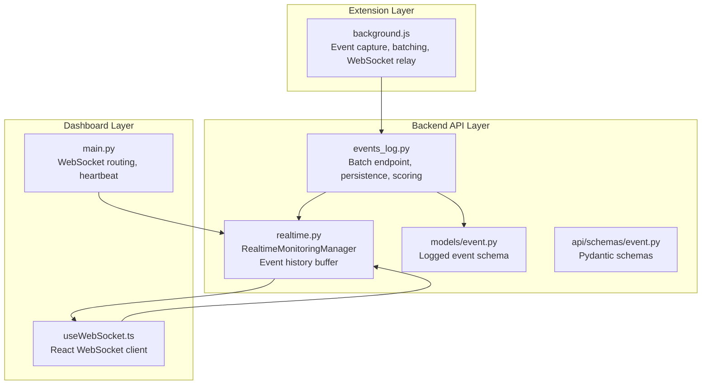
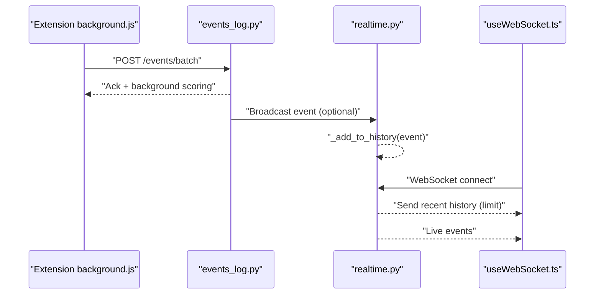
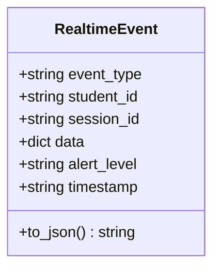
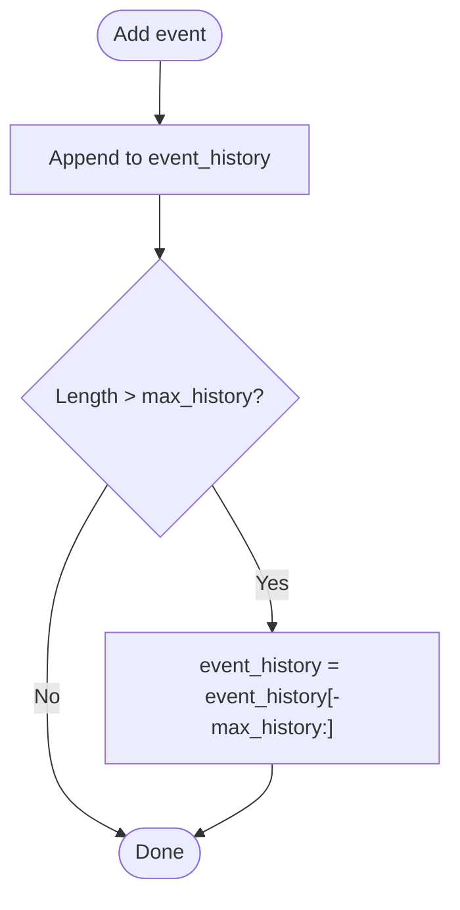
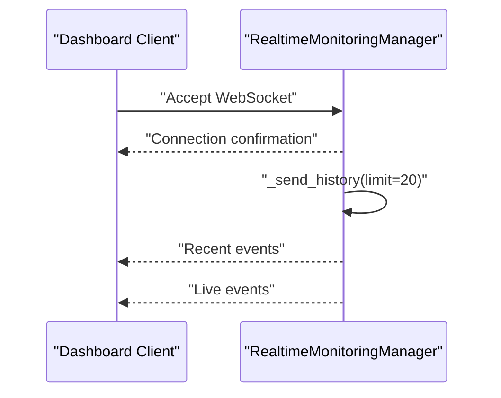
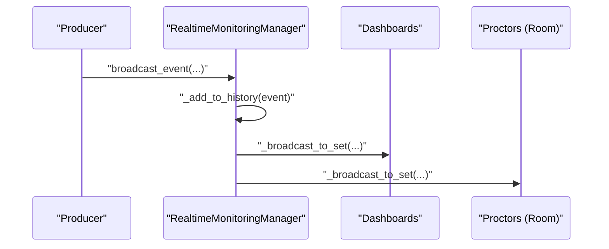
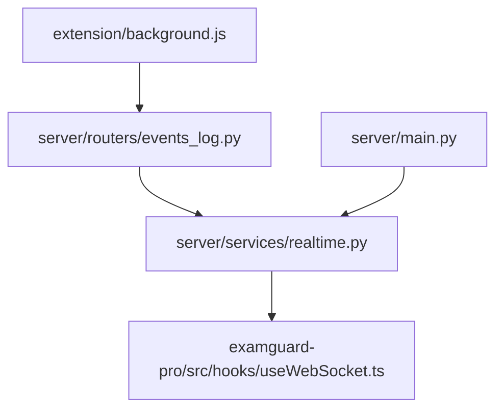

# Event History System

<cite>
**Referenced Files in This Document**
- [realtime.py](file://server/services/realtime.py)
- [event.py](file://server/models/event.py)
- [event.py](file://server/api/schemas/event.py)
- [events_log.py](file://server/routers/events_log.py)
- [background.js](file://extension/background.js)
- [useWebSocket.ts](file://examguard-pro/src/hooks/useWebSocket.ts)
- [main.py](file://server/main.py)
</cite>

## Table of Contents
1. [Introduction](#introduction)
2. [Project Structure](#project-structure)
3. [Core Components](#core-components)
4. [Architecture Overview](#architecture-overview)
5. [Detailed Component Analysis](#detailed-component-analysis)
6. [Dependency Analysis](#dependency-analysis)
7. [Performance Considerations](#performance-considerations)
8. [Troubleshooting Guide](#troubleshooting-guide)
9. [Conclusion](#conclusion)

## Introduction
This document explains the event history system that maintains real-time event records for late-joiner synchronization. It covers the event history buffer management, the configurable maximum history size, the circular buffer-like implementation, and how new connections receive recent event history to synchronize their state with ongoing sessions. It also documents the RealtimeEvent data structure, event serialization mechanisms, JSON encoding/decoding processes, event filtering and deduplication strategies, timestamp-based ordering, and memory management approaches for efficient history storage.

## Project Structure
The event history system spans three layers:
- Frontend extension: captures and batches events, periodically syncing to the backend and immediately forwarding via WebSocket for live updates.
- Backend API: receives batched events, persists them, and triggers real-time analysis; maintains a real-time event history buffer.
- Frontend dashboard: connects via WebSocket, receives live events and initial history upon connection.

**Diagram sources**
- [background.js:1194-1228](file://extension/background.js#L1194-L1228)
- [events_log.py:99-207](file://server/routers/events_log.py#L99-L207)
- [realtime.py:102-137](file://server/services/realtime.py#L102-L137)
- [event.py:6-29](file://server/models/event.py#L6-L29)
- [event.py:10-63](file://server/api/schemas/event.py#L10-L63)
- [useWebSocket.ts:1-133](file://examguard-pro/src/hooks/useWebSocket.ts#L1-L133)
- [main.py:48-103](file://server/main.py#L48-L103)

**Section sources**
- [realtime.py:102-137](file://server/services/realtime.py#L102-L137)
- [events_log.py:99-207](file://server/routers/events_log.py#L99-L207)
- [background.js:1194-1228](file://extension/background.js#L1194-L1228)
- [useWebSocket.ts:1-133](file://examguard-pro/src/hooks/useWebSocket.ts#L1-L133)
- [main.py:48-103](file://server/main.py#L48-L103)

## Core Components
- RealtimeEvent: The canonical event structure for real-time broadcasting, including type, identifiers, payload, alert level, and ISO-formatted timestamp. It provides a JSON serialization method.
- RealtimeMonitoringManager: Central coordinator that manages WebSocket connections, rooms, event broadcasting, and the event history buffer.
- Event history buffer: Maintains a rolling window of recent events with configurable maximum capacity.
- WebSocket integration: New connections receive recent history immediately after acceptance.

Key implementation references:
- RealtimeEvent definition and JSON serialization: [realtime.py:67-78](file://server/services/realtime.py#L67-L78)
- RealtimeMonitoringManager initialization and history buffer: [realtime.py:115-130](file://server/services/realtime.py#L115-L130)
- Adding to history and sending recent history: [realtime.py:620-631](file://server/services/realtime.py#L620-L631)
- Dashboard connection flow and initial history: [realtime.py:213-229](file://server/services/realtime.py#L213-L229)

**Section sources**
- [realtime.py:67-78](file://server/services/realtime.py#L67-L78)
- [realtime.py:115-130](file://server/services/realtime.py#L115-L130)
- [realtime.py:620-631](file://server/services/realtime.py#L620-L631)
- [realtime.py:213-229](file://server/services/realtime.py#L213-L229)

## Architecture Overview
The system ensures late-joiners stay synchronized by delivering recent events upon connection. The backend maintains a bounded event history and sends it to new subscribers. Live events are broadcast to all relevant recipients, while logged events are persisted to the database.

**Diagram sources**
- [background.js:1232-1259](file://extension/background.js#L1232-L1259)
- [events_log.py:99-207](file://server/routers/events_log.py#L99-L207)
- [realtime.py:334-377](file://server/services/realtime.py#L334-L377)
- [realtime.py:626-631](file://server/services/realtime.py#L626-L631)
- [useWebSocket.ts:31-54](file://examguard-pro/src/hooks/useWebSocket.ts#L31-L54)

## Detailed Component Analysis

### RealtimeEvent Data Structure and Serialization
RealtimeEvent encapsulates event metadata and payload for real-time delivery:
- Fields: event_type, student_id, session_id, data, alert_level, timestamp.
- JSON serialization: Converts the dataclass to a dictionary and encodes to JSON.

Implementation references:
- Definition and to_json(): [realtime.py:67-78](file://server/services/realtime.py#L67-L78)

**Diagram sources**
- [realtime.py:67-78](file://server/services/realtime.py#L67-L78)

**Section sources**
- [realtime.py:67-78](file://server/services/realtime.py#L67-L78)

### Event History Buffer Management
The RealtimeMonitoringManager maintains a bounded event history:
- Storage: A list stores events in chronological order.
- Maximum size: Configurable via constructor argument; defaults apply if not specified.
- Circular buffer behavior: When exceeding capacity, the oldest events are dropped by slicing from the end.

Implementation references:
- Initialization and buffer fields: [realtime.py:115-130](file://server/services/realtime.py#L115-L130)
- Adding to history: [realtime.py:620-624](file://server/services/realtime.py#L620-L624)
- Retrieving recent history: [realtime.py:626-631](file://server/services/realtime.py#L626-L631)

**Diagram sources**
- [realtime.py:115-130](file://server/services/realtime.py#L115-L130)
- [realtime.py:620-624](file://server/services/realtime.py#L620-L624)

**Section sources**
- [realtime.py:115-130](file://server/services/realtime.py#L115-L130)
- [realtime.py:620-624](file://server/services/realtime.py#L620-L624)
- [realtime.py:626-631](file://server/services/realtime.py#L626-L631)

### Late-Joiner Synchronization Workflow
New WebSocket connections receive recent events to synchronize their state:
- Dashboard connections: After accepting the WebSocket and sending a connection confirmation, the manager sends recent history (default limit).
- Proctor/student connections: Joined to rooms; they receive live events per session.

Implementation references:
- Dashboard connect and history send: [realtime.py:213-229](file://server/services/realtime.py#L213-L229)
- Room-based broadcasting: [realtime.py:366-370](file://server/services/realtime.py#L366-L370)

**Diagram sources**
- [realtime.py:213-229](file://server/services/realtime.py#L213-L229)
- [realtime.py:626-631](file://server/services/realtime.py#L626-L631)

**Section sources**
- [realtime.py:213-229](file://server/services/realtime.py#L213-L229)
- [realtime.py:626-631](file://server/services/realtime.py#L626-L631)

### Event Broadcasting and Realtime Delivery
Events are broadcast to relevant subscribers:
- Construction: RealtimeEvent is created with type, identifiers, data, alert level, and timestamp.
- Storage: Event appended to history buffer.
- Delivery: Message prepared and sent to dashboards and session-specific proctors.

Implementation references:
- Event construction and broadcast: [realtime.py:334-377](file://server/services/realtime.py#L334-L377)

**Diagram sources**
- [realtime.py:334-377](file://server/services/realtime.py#L334-L377)

**Section sources**
- [realtime.py:334-377](file://server/services/realtime.py#L334-L377)

### JSON Encoding/Decoding Mechanisms
- Real-time events: Serialized using the RealtimeEvent.to_json() method, which converts the dataclass to a dictionary and encodes to JSON.
- WebSocket transport: Messages are sent as JSON payloads; receivers parse JSON on the client side.
- Batch endpoints: Pydantic schemas define request/response structures for batch logging.

Implementation references:
- RealtimeEvent JSON: [realtime.py:77-78](file://server/services/realtime.py#L77-L78)
- Client-side JSON parsing: [useWebSocket.ts:43-54](file://examguard-pro/src/hooks/useWebSocket.ts#L43-L54)
- Batch schema definitions: [event.py:10-63](file://server/api/schemas/event.py#L10-L63)

**Section sources**
- [realtime.py:77-78](file://server/services/realtime.py#L77-L78)
- [useWebSocket.ts:43-54](file://examguard-pro/src/hooks/useWebSocket.ts#L43-L54)
- [event.py:10-63](file://server/api/schemas/event.py#L10-L63)

### Event Filtering and Deduplication Strategies
- Client-side filtering: The dashboard WebSocket client ignores specific message types (e.g., connection, heartbeat, pong, subscribed) to reduce noise.
- Client-side deduplication: The extension maintains a small in-memory queue and clears events after successful sync using a Set-based filter for O(N) removal.
- Server-side deduplication: Not implemented in the history buffer; duplicates can occur if identical events are received rapidly.

Implementation references:
- Client filtering: [useWebSocket.ts:47-48](file://examguard-pro/src/hooks/useWebSocket.ts#L47-L48)
- Extension deduplication: [background.js:1248-1250](file://extension/background.js#L1248-L1250)

**Section sources**
- [useWebSocket.ts:47-48](file://examguard-pro/src/hooks/useWebSocket.ts#L47-L48)
- [background.js:1248-1250](file://extension/background.js#L1248-L1250)

### Timestamp-Based Ordering and Memory Management
- Timestamps: Real-time events use UTC ISO format; logged events include both server and client timestamps.
- Ordering: Real-time history is maintained in insertion order. For persistent storage, queries sort by timestamp for chronological timelines.
- Memory management: The history buffer enforces a maximum size; older entries are dropped to maintain bounded memory usage.

Implementation references:
- Real-time timestamp: [realtime.py:354-355](file://server/services/realtime.py#L354-L355)
- Logged event timestamps: [event.py:14-16](file://server/models/event.py#L14-L16)
- Timeline ordering: [events_log.py:246-249](file://server/routers/events_log.py#L246-L249)
- History sizing: [realtime.py:129-130](file://server/services/realtime.py#L129-L130)

**Section sources**
- [realtime.py:354-355](file://server/services/realtime.py#L354-L355)
- [event.py:14-16](file://server/models/event.py#L14-L16)
- [events_log.py:246-249](file://server/routers/events_log.py#L246-L249)
- [realtime.py:129-130](file://server/services/realtime.py#L129-L130)

### Example: Event History Retrieval and Replay
- Retrieval: The _send_history method slices the last N events from the history buffer and sends them to the newly connected client.
- Replay: Clients receive a bounded set of recent events to reconstruct the current state.

Implementation references:
- _send_history method: [realtime.py:626-631](file://server/services/realtime.py#L626-L631)

Concrete example paths:
- Retrieve recent history for a dashboard: [realtime.py:227-228](file://server/services/realtime.py#L227-L228)
- Replay recent events to a new connection: [realtime.py:626-631](file://server/services/realtime.py#L626-L631)

**Section sources**
- [realtime.py:227-228](file://server/services/realtime.py#L227-L228)
- [realtime.py:626-631](file://server/services/realtime.py#L626-L631)

## Dependency Analysis
The event history system integrates multiple components across layers:
- Extension: Generates events, batches them, and forwards via WebSocket.
- API: Validates and persists events; optionally triggers real-time analysis.
- Real-time manager: Stores events in history and broadcasts to subscribers.
- Dashboard: Receives live events and initial history over WebSocket.

**Diagram sources**
- [background.js:1232-1259](file://extension/background.js#L1232-L1259)
- [events_log.py:99-207](file://server/routers/events_log.py#L99-L207)
- [realtime.py:102-137](file://server/services/realtime.py#L102-L137)
- [useWebSocket.ts:1-133](file://examguard-pro/src/hooks/useWebSocket.ts#L1-L133)
- [main.py:48-103](file://server/main.py#L48-L103)

**Section sources**
- [background.js:1232-1259](file://extension/background.js#L1232-L1259)
- [events_log.py:99-207](file://server/routers/events_log.py#L99-L207)
- [realtime.py:102-137](file://server/services/realtime.py#L102-L137)
- [useWebSocket.ts:1-133](file://examguard-pro/src/hooks/useWebSocket.ts#L1-L133)
- [main.py:48-103](file://server/main.py#L48-L103)

## Performance Considerations
- History buffer efficiency: Appending to a Python list and slicing is O(k) for each addition, where k is the retained window size. This is efficient for typical limits.
- JSON serialization: Converting dataclasses to dictionaries and encoding to JSON is lightweight for moderate event sizes.
- WebSocket throughput: Binary frames are sent directly to reduce overhead for video streams; JSON messages are used for control and event data.
- Memory footprint: The bounded history prevents unbounded growth; adjust max_history according to retention needs and memory constraints.

[No sources needed since this section provides general guidance]

## Troubleshooting Guide
Common issues and remedies:
- Events not appearing for late joiners:
  - Verify the dashboard connection accepts the WebSocket and recent history is sent.
  - Check the _send_history limit and ensure it matches expectations.
  - References: [realtime.py:213-229](file://server/services/realtime.py#L213-L229), [realtime.py:626-631](file://server/services/realtime.py#L626-L631)
- Duplicate or missing events:
  - Client-side filtering may drop certain message types; confirm filters align with intended behavior.
  - Extension deduplication uses Set-based filtering after successful sync; ensure sync responses are processed.
  - References: [useWebSocket.ts:47-48](file://examguard-pro/src/hooks/useWebSocket.ts#L47-L48), [background.js:1248-1250](file://extension/background.js#L1248-L1250)
- WebSocket connectivity problems:
  - Inspect connection lifecycle and reconnection logic; ensure proper subscription after reconnect.
  - References: [useWebSocket.ts:21-74](file://examguard-pro/src/hooks/useWebSocket.ts#L21-L74), [main.py:61-103](file://server/main.py#L61-L103)
- Event ordering discrepancies:
  - Real-time history is insertion-ordered; for strict chronological ordering, rely on server-persisted timelines.
  - References: [events_log.py:246-249](file://server/routers/events_log.py#L246-L249)

**Section sources**
- [realtime.py:213-229](file://server/services/realtime.py#L213-L229)
- [realtime.py:626-631](file://server/services/realtime.py#L626-L631)
- [useWebSocket.ts:47-48](file://examguard-pro/src/hooks/useWebSocket.ts#L47-L48)
- [background.js:1248-1250](file://extension/background.js#L1248-L1250)
- [useWebSocket.ts:21-74](file://examguard-pro/src/hooks/useWebSocket.ts#L21-L74)
- [main.py:61-103](file://server/main.py#L61-L103)
- [events_log.py:246-249](file://server/routers/events_log.py#L246-L249)

## Conclusion
The event history system provides robust late-joiner synchronization through a configurable, bounded history buffer and immediate post-connection replay. Real-time events are serialized efficiently and delivered to dashboards and session-specific subscribers. Client-side filtering and deduplication improve reliability and reduce noise. Together, these mechanisms ensure accurate, timely, and memory-efficient event synchronization across the platform.

[No sources needed since this section summarizes without analyzing specific files]