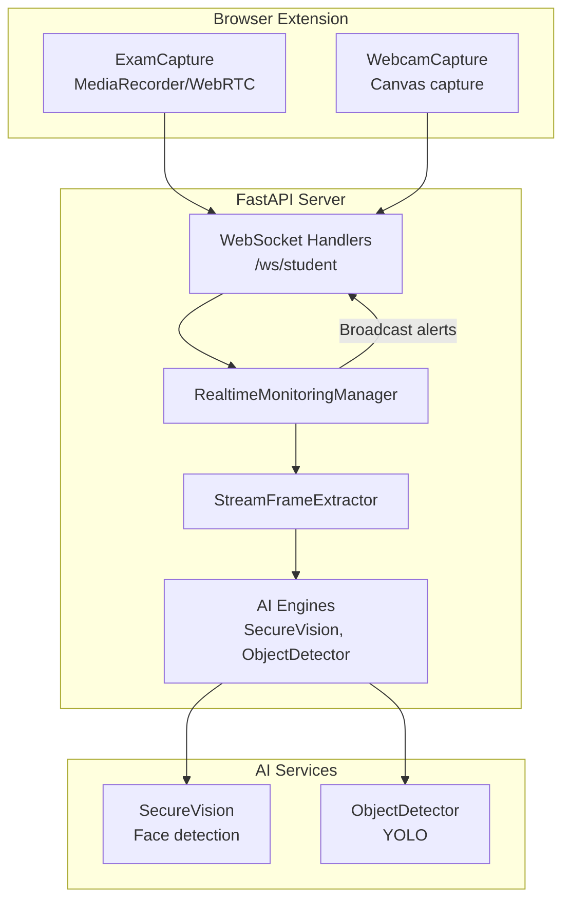
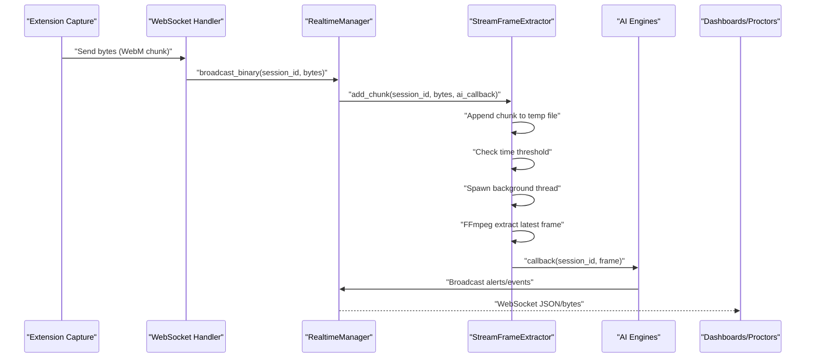
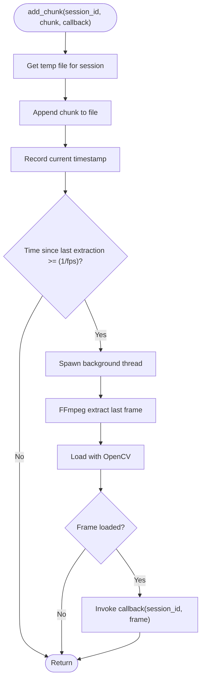
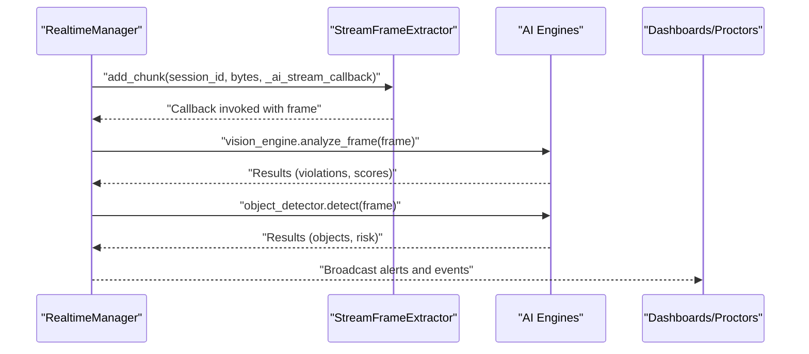
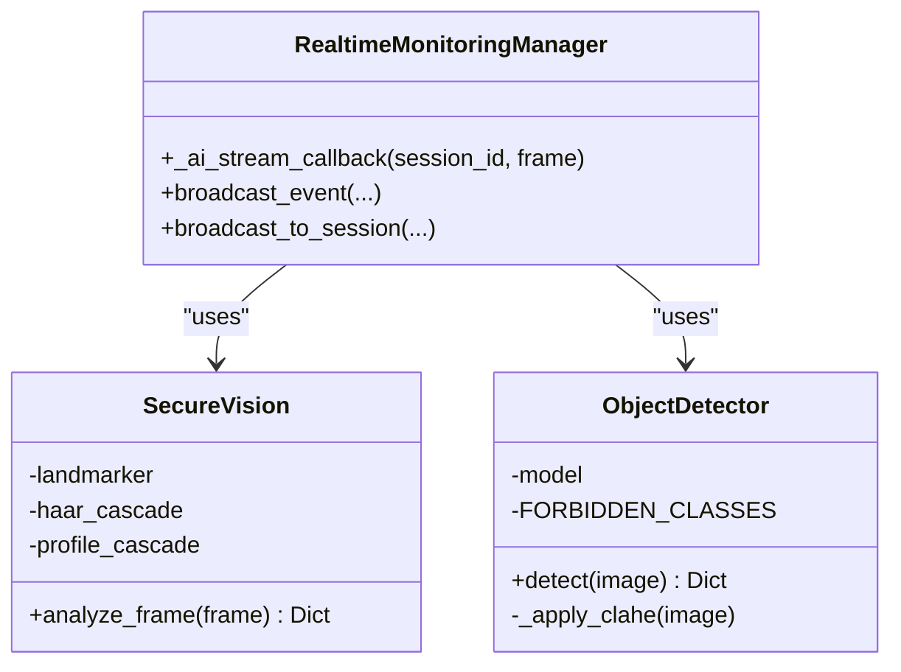
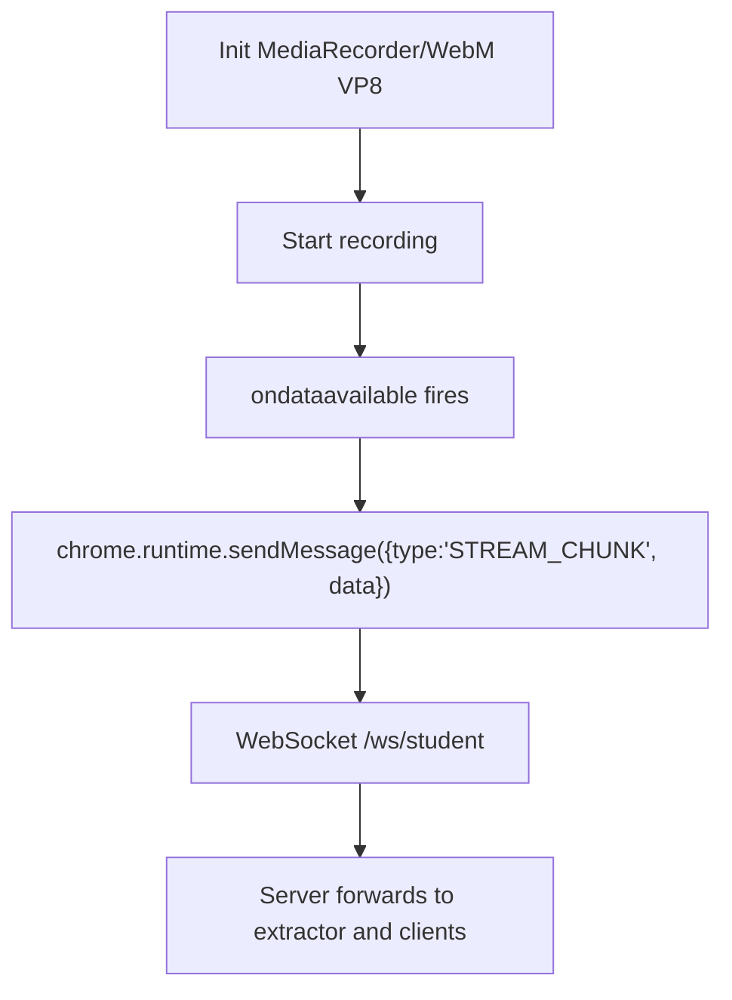
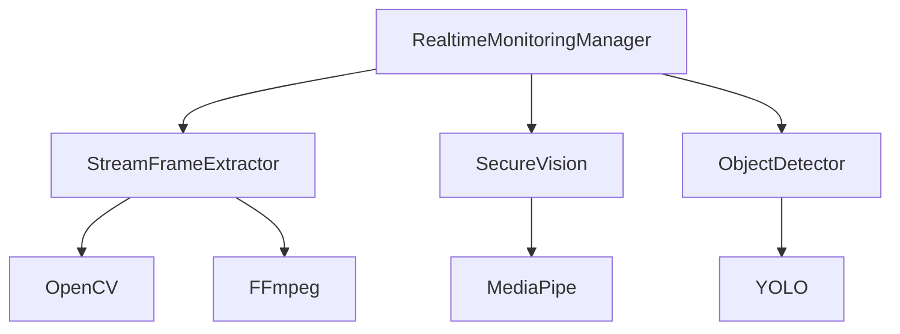

# Frame Extraction Pipeline

<cite>
**Referenced Files in This Document**
- [frame_extractor.py](file://server/services/frame_extractor.py)
- [realtime.py](file://server/services/realtime.py)
- [main.py](file://server/main.py)
- [object_detection.py](file://server/services/object_detection.py)
- [face_detection.py](file://server/services/face_detection.py)
- [capture.js](file://extension/capture.js)
- [webcam.js](file://extension/webcam.js)
</cite>

## Table of Contents
1. [Introduction](#introduction)
2. [Project Structure](#project-structure)
3. [Core Components](#core-components)
4. [Architecture Overview](#architecture-overview)
5. [Detailed Component Analysis](#detailed-component-analysis)
6. [Dependency Analysis](#dependency-analysis)
7. [Performance Considerations](#performance-considerations)
8. [Troubleshooting Guide](#troubleshooting-guide)
9. [Conclusion](#conclusion)

## Introduction
This document explains the frame extraction pipeline that processes live video streams for AI analysis. It covers how binary video chunks are segmented, buffered, and asynchronously converted into processed frames suitable for computer vision. It documents the buffer management system, frame rate control algorithms, thread-safe communication patterns between the frame extractor and AI analysis engines, and the callback integration system that triggers AI analysis upon frame availability. Practical examples are drawn from the codebase to illustrate the end-to-end flow from client capture to server-side AI processing.

## Project Structure
The frame extraction pipeline spans the browser extension (client capture), the FastAPI WebSocket server (real-time transport and orchestration), and the AI analysis services (face detection and object detection). The key components are:
- Extension capture modules that produce binary video chunks
- WebSocket endpoints that forward binary chunks to the server
- A server-side frame extractor that buffers chunks and periodically extracts frames
- A real-time manager that integrates AI callbacks and broadcasts results
- AI engines that analyze frames and publish alerts

**Diagram sources**
- [capture.js:207-246](file://extension/capture.js#L207-L246)
- [webcam.js:30-57](file://extension/webcam.js#L30-L57)
- [main.py:469-476](file://server/main.py#L469-L476)
- [realtime.py:310-329](file://server/services/realtime.py#L310-L329)
- [frame_extractor.py:31-44](file://server/services/frame_extractor.py#L31-L44)
- [face_detection.py:64-103](file://server/services/face_detection.py#L64-L103)
- [object_detection.py:65-137](file://server/services/object_detection.py#L65-L137)

**Section sources**
- [capture.js:207-246](file://extension/capture.js#L207-L246)
- [webcam.js:30-57](file://extension/webcam.js#L30-L57)
- [main.py:469-476](file://server/main.py#L469-L476)
- [realtime.py:310-329](file://server/services/realtime.py#L310-L329)
- [frame_extractor.py:31-44](file://server/services/frame_extractor.py#L31-L44)

## Core Components
- StreamFrameExtractor: Buffers binary WebM chunks per session and periodically extracts frames using FFmpeg, invoking a callback with the latest frame.
- RealtimeMonitoringManager: Manages WebSocket rooms, forwards binary chunks to the extractor, and invokes AI analysis callbacks on extracted frames.
- AI Engines: SecureVision performs face detection and engagement analysis; ObjectDetector performs object detection (e.g., phones).
- Extension capture: ExamCapture starts MediaRecorder with WebM VP8 encoding and sends binary chunks; WebcamCapture captures still frames.

Key responsibilities:
- Buffer management: Persistent temp files per session to accumulate chunks.
- Frame rate control: Time-based throttling to control extraction cadence.
- Asynchronous processing: Background threads for FFmpeg extraction to avoid blocking WebSocket handlers.
- Thread-safe communication: Asyncio event loop bridging for cross-thread callback invocation.

**Section sources**
- [frame_extractor.py:10-115](file://server/services/frame_extractor.py#L10-L115)
- [realtime.py:102-200](file://server/services/realtime.py#L102-L200)
- [face_detection.py:27-126](file://server/services/face_detection.py#L27-L126)
- [object_detection.py:16-147](file://server/services/object_detection.py#L16-L147)
- [capture.js:207-246](file://extension/capture.js#L207-L246)

## Architecture Overview
The pipeline operates as follows:
1. Client capture produces binary WebM chunks via MediaRecorder.
2. The client sends bytes to the server via WebSocket.
3. The server forwards the chunk to the frame extractor and also relays it to subscribed clients.
4. The extractor appends the chunk to a per-session temp file and checks if enough time has elapsed to extract a frame.
5. Extraction runs FFmpeg to write the latest frame as an image and loads it with OpenCV.
6. The AI callback receives the frame and runs analysis engines (face detection and object detection).
7. Results are broadcast to dashboards and proctors via WebSocket.

**Diagram sources**
- [capture.js:222-231](file://extension/capture.js#L222-L231)
- [main.py:469-476](file://server/main.py#L469-L476)
- [realtime.py:310-329](file://server/services/realtime.py#L310-L329)
- [frame_extractor.py:31-90](file://server/services/frame_extractor.py#L31-L90)
- [face_detection.py:64-103](file://server/services/face_detection.py#L64-L103)
- [object_detection.py:65-137](file://server/services/object_detection.py#L65-L137)

## Detailed Component Analysis

### StreamFrameExtractor
Responsibilities:
- Per-session buffering: Creates a persistent temp file per session to append incoming chunks.
- Rate control: Uses a configurable FPS to throttle frame extraction.
- Asynchronous extraction: Runs FFmpeg in a background thread to avoid blocking the WebSocket handler.
- Callback integration: Invokes a provided callback with the extracted frame for AI analysis.

Buffer management:
- Temp files are created per session and cleaned up on session disconnect.
- Append-only writes ensure minimal overhead during streaming.

Extraction algorithm:
- Time-based gating ensures frames are extracted at a controlled cadence.
- FFmpeg is invoked to extract the last frame from the accumulating file.
- OpenCV reads the resulting image and passes it to the callback.

Thread-safety:
- A lock protects cleanup operations.
- Background threads prevent blocking the main WebSocket loop.

**Diagram sources**
- [frame_extractor.py:31-90](file://server/services/frame_extractor.py#L31-L90)

**Section sources**
- [frame_extractor.py:10-115](file://server/services/frame_extractor.py#L10-L115)

### RealtimeMonitoringManager
Responsibilities:
- WebSocket room management for session-based broadcasting.
- Binary forwarding to the frame extractor and relay to clients.
- AI callback integration: Calls extractor with a callback that runs AI engines and broadcasts results.
- Alert broadcasting and event history.

Integration with frame extraction:
- On receiving binary chunks, forwards to extractor and relays to subscribed clients.
- The AI callback retrieves AI engines from app state and runs analysis, then broadcasts anomalies.

**Diagram sources**
- [realtime.py:139-200](file://server/services/realtime.py#L139-L200)
- [frame_extractor.py:45-90](file://server/services/frame_extractor.py#L45-L90)
- [face_detection.py:64-103](file://server/services/face_detection.py#L64-L103)
- [object_detection.py:65-137](file://server/services/object_detection.py#L65-L137)

**Section sources**
- [realtime.py:102-200](file://server/services/realtime.py#L102-L200)

### AI Engines Integration
SecureVision:
- Performs face detection and engagement analysis.
- Detects violations such as multiple faces or prolonged face absence.

ObjectDetector:
- Performs object detection using YOLO to detect forbidden items (e.g., phones).
- Applies preprocessing for low-light conditions and throttles processing to a fixed cadence.

**Diagram sources**
- [face_detection.py:27-126](file://server/services/face_detection.py#L27-L126)
- [object_detection.py:16-147](file://server/services/object_detection.py#L16-L147)
- [realtime.py:139-200](file://server/services/realtime.py#L139-L200)

**Section sources**
- [face_detection.py:27-126](file://server/services/face_detection.py#L27-L126)
- [object_detection.py:16-147](file://server/services/object_detection.py#L16-L147)

### Client Capture and Streaming
ExamCapture:
- Starts MediaRecorder with WebM VP8 codec and sends binary chunks via WebSocket.
- Configures bitrate and interval for balanced quality and bandwidth.

WebcamCapture:
- Captures still frames from the webcam stream and sends them to the background script.

**Diagram sources**
- [capture.js:207-246](file://extension/capture.js#L207-L246)
- [main.py:469-476](file://server/main.py#L469-L476)

**Section sources**
- [capture.js:207-246](file://extension/capture.js#L207-L246)
- [webcam.js:30-57](file://extension/webcam.js#L30-L57)
- [main.py:469-476](file://server/main.py#L469-L476)

## Dependency Analysis
- RealtimeMonitoringManager depends on StreamFrameExtractor for frame extraction and on AI engines for analysis.
- StreamFrameExtractor depends on FFmpeg and OpenCV for frame extraction and loading.
- AI engines depend on external models (MediaPipe and YOLO) and are accessed via app state in the main server lifecycle.
- Extension capture depends on browser APIs (MediaRecorder, getUserMedia) and communicates with the background script.

**Diagram sources**
- [realtime.py:124-127](file://server/services/realtime.py#L124-L127)
- [frame_extractor.py:51-66](file://server/services/frame_extractor.py#L51-L66)
- [face_detection.py:33-45](file://server/services/face_detection.py#L33-L45)
- [object_detection.py:23-26](file://server/services/object_detection.py#L23-L26)

**Section sources**
- [realtime.py:124-127](file://server/services/realtime.py#L124-L127)
- [frame_extractor.py:51-66](file://server/services/frame_extractor.py#L51-L66)
- [face_detection.py:33-45](file://server/services/face_detection.py#L33-L45)
- [object_detection.py:23-26](file://server/services/object_detection.py#L23-L26)

## Performance Considerations
- Frame rate control: The extractor’s FPS parameter controls extraction cadence. Lower FPS reduces CPU and disk I/O.
- Background extraction: FFmpeg runs in a separate thread to avoid blocking the WebSocket handler.
- Throttling in AI engines: ObjectDetector limits processing frequency and caches results to reduce repeated heavy computations.
- Buffer management: Persistent temp files per session minimize memory pressure by writing to disk incrementally.
- Codec choice: WebM VP8 is used for efficient streaming and decoding.
- Async event loop bridging: The AI callback uses async event loop bridging to safely invoke WebSocket broadcasts from background threads.

[No sources needed since this section provides general guidance]

## Troubleshooting Guide
Common issues and resolutions:
- FFmpeg not found: The extractor prints an error and disables server-side extraction. Ensure FFmpeg is installed and available in PATH or set the environment variable for the executable path.
- Corrupted or incomplete WebM: Early frames may be missing; the extractor silently handles missing snapshots and continues buffering.
- AI engine initialization failures: MediaPipe or YOLO may fail to initialize; the system falls back to available backends or returns empty results.
- WebSocket disconnects: On client disconnect, the extractor cleans up temp files for the session to free resources.
- Cross-thread callback: The AI callback uses async event loop bridging to safely broadcast from background threads.

**Section sources**
- [frame_extractor.py:84-90](file://server/services/frame_extractor.py#L84-L90)
- [realtime.py:297-300](file://server/services/realtime.py#L297-L300)
- [face_detection.py:11-26](file://server/services/face_detection.py#L11-L26)
- [object_detection.py:8-12](file://server/services/object_detection.py#L8-L12)

## Conclusion
The frame extraction pipeline efficiently transforms live WebM video streams into processed frames for AI analysis. It achieves this through per-session buffering, time-based frame extraction, asynchronous processing, and robust integration with AI engines. The system balances throughput and resource usage while maintaining thread-safe communication between the frame extractor and the AI analysis engines. The provided diagrams and references enable developers to understand and extend the pipeline for high-throughput scenarios.