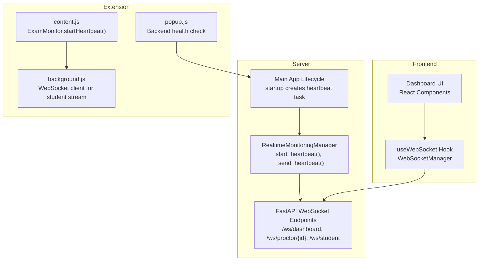
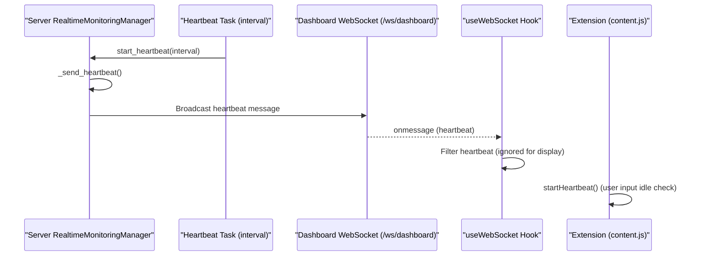
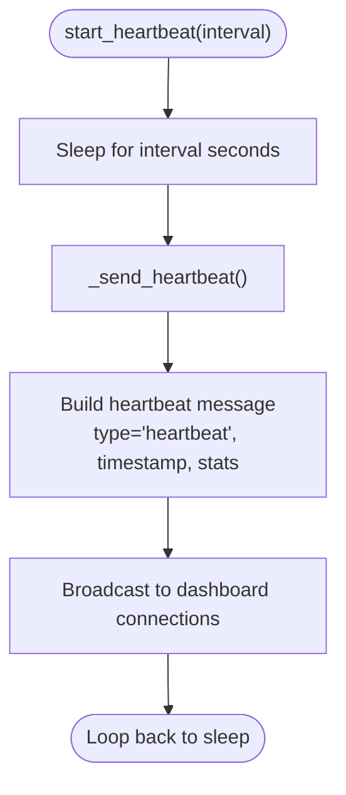
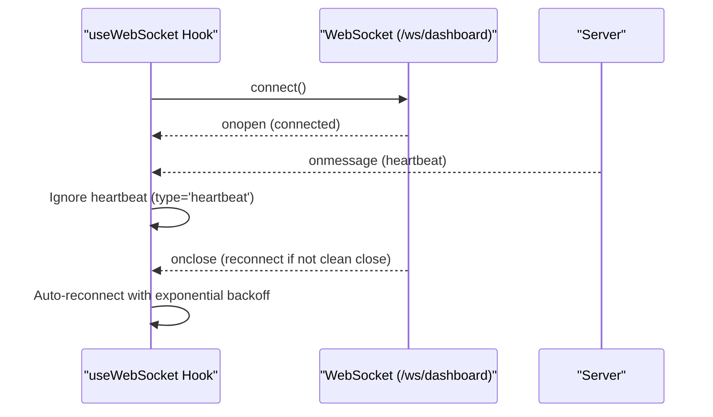
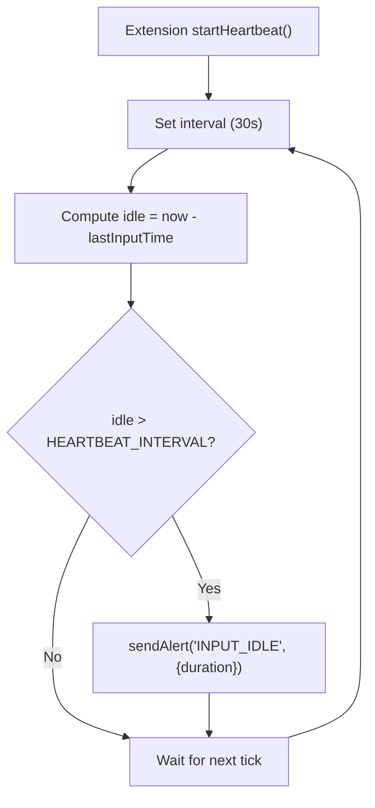
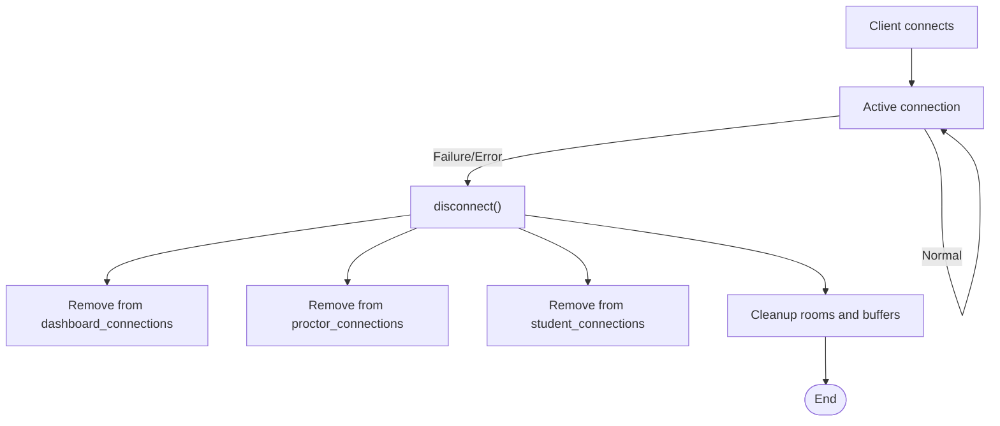
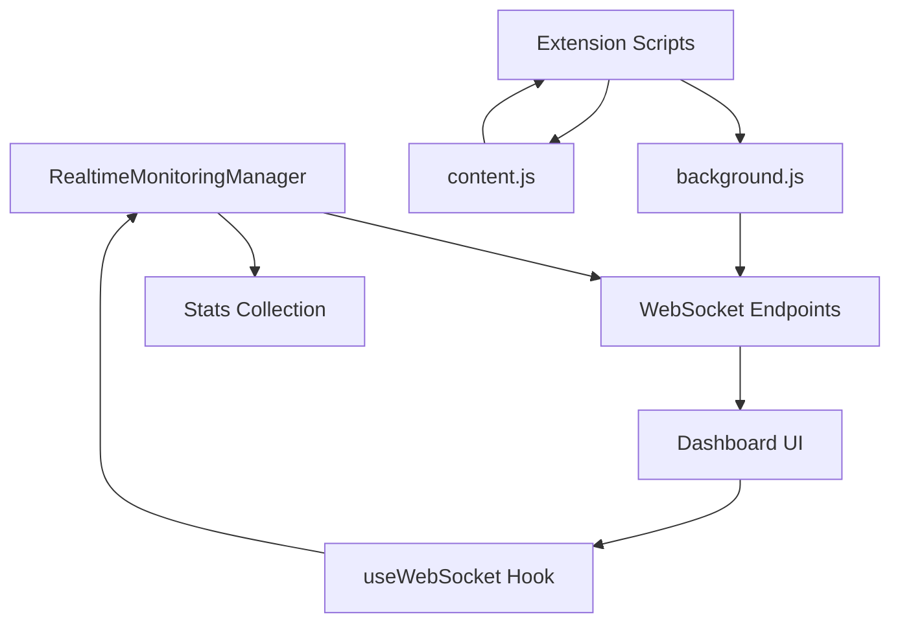

# Heartbeat Monitoring

<cite>
**Referenced Files in This Document**
- [realtime.py](file://server/services/realtime.py)
- [main.py](file://server/main.py)
- [useWebSocket.ts](file://examguard-pro/src/hooks/useWebSocket.ts)
- [content.js](file://extension/content.js)
- [background.js](file://extension/background.js)
- [popup.js](file://extension/popup/popup.js)
- [config.ts](file://examguard-pro/src/config.ts)
</cite>

## Table of Contents
1. [Introduction](#introduction)
2. [Project Structure](#project-structure)
3. [Core Components](#core-components)
4. [Architecture Overview](#architecture-overview)
5. [Detailed Component Analysis](#detailed-component-analysis)
6. [Dependency Analysis](#dependency-analysis)
7. [Performance Considerations](#performance-considerations)
8. [Troubleshooting Guide](#troubleshooting-guide)
9. [Conclusion](#conclusion)

## Introduction
This document explains the heartbeat monitoring system that ensures connection health and system status tracking across the real-time coordination stack. It covers the periodic heartbeat mechanism, configurable intervals, automated heartbeat message generation, heartbeat message structure, connection health monitoring, automatic disconnection detection, and cleanup procedures. It also demonstrates how heartbeat messages are used for system monitoring, connection quality assessment, and performance tracking, and outlines heartbeat-based connection management strategies integrated with the broader real-time coordination system.

## Project Structure
The heartbeat system spans three layers:
- Server-side WebSocket management and broadcasting
- Frontend React dashboard WebSocket consumer
- Browser extension monitoring and auxiliary heartbeat checks

**Diagram sources**
- [realtime.py:539-559](file://server/services/realtime.py#L539-L559)
- [main.py:133-137](file://server/main.py#L133-L137)
- [useWebSocket.ts:1-175](file://examguard-pro/src/hooks/useWebSocket.ts#L1-L175)
- [content.js:300-309](file://extension/content.js#L300-L309)
- [background.js:1-200](file://extension/background.js#L1-L200)
- [popup.js:87-115](file://extension/popup/popup.js#L87-L115)

**Section sources**
- [realtime.py:102-138](file://server/services/realtime.py#L102-L138)
- [main.py:133-137](file://server/main.py#L133-L137)
- [useWebSocket.ts:1-175](file://examguard-pro/src/hooks/useWebSocket.ts#L1-L175)
- [content.js:300-309](file://extension/content.js#L300-L309)
- [background.js:1-200](file://extension/background.js#L1-L200)
- [popup.js:87-115](file://extension/popup/popup.js#L87-L115)

## Core Components
- Server heartbeat producer: Periodic heartbeat messages are generated and broadcast to dashboard clients.
- Client heartbeat consumer: The dashboard consumes heartbeat messages to assess connection health and system status.
- Extension heartbeat: The extension monitors user input inactivity and sends alerts; it also performs backend connectivity checks.
- Connection lifecycle: Automatic disconnection detection and cleanup are performed when sockets fail to respond or close unexpectedly.

Key responsibilities:
- Periodic heartbeat generation and broadcasting
- Heartbeat message structure with connection statistics and system metrics
- Connection health monitoring and automatic cleanup
- Integration with the broader real-time coordination system

**Section sources**
- [realtime.py:539-559](file://server/services/realtime.py#L539-L559)
- [useWebSocket.ts:43-54](file://examguard-pro/src/hooks/useWebSocket.ts#L43-L54)
- [content.js:300-309](file://extension/content.js#L300-L309)
- [popup.js:87-115](file://extension/popup/popup.js#L87-L115)

## Architecture Overview
The heartbeat architecture consists of:
- A server-side task that periodically emits heartbeat messages containing connection and event metrics.
- WebSocket endpoints that accept connections from dashboards, proctors, and students.
- A client-side WebSocket manager that connects to the dashboard endpoint and ignores heartbeat messages for display purposes.
- An extension that runs auxiliary heartbeat-like checks for user input inactivity and backend connectivity.

**Diagram sources**
- [realtime.py:539-559](file://server/services/realtime.py#L539-L559)
- [main.py:133-137](file://server/main.py#L133-L137)
- [useWebSocket.ts:43-54](file://examguard-pro/src/hooks/useWebSocket.ts#L43-L54)
- [content.js:300-309](file://extension/content.js#L300-L309)

## Detailed Component Analysis

### Server Heartbeat Producer
The server generates heartbeat messages at a configurable interval and broadcasts them to dashboard clients. The heartbeat message includes:
- Message type: heartbeat
- Timestamp: UTC ISO timestamp
- Stats: connection counts and event/alert counters

**Diagram sources**
- [realtime.py:539-559](file://server/services/realtime.py#L539-L559)

Implementation highlights:
- Configurable interval via the start_heartbeat method.
- Stats include dashboard, proctor, and student connection counts, plus total events and alerts.
- Broadcast occurs only to dashboard connections; heartbeat messages are intentionally filtered by the dashboard client.

**Section sources**
- [realtime.py:539-559](file://server/services/realtime.py#L539-L559)
- [main.py:133-137](file://server/main.py#L133-L137)

### Heartbeat Message Structure
The heartbeat message structure is standardized and includes:
- type: heartbeat
- timestamp: UTC ISO timestamp
- stats: dictionary containing connection and event metrics

Metrics included:
- dashboard_connections: Number of connected dashboard clients
- proctor_connections: Number of connected proctor clients
- student_connections: Number of connected student clients
- total_events: Total events sent by the server
- total_alerts: Total alerts sent by the server

These metrics enable system monitoring, connection quality assessment, and performance tracking.

**Section sources**
- [realtime.py:545-559](file://server/services/realtime.py#L545-L559)

### Client Heartbeat Consumer (Dashboard)
The dashboard consumes heartbeat messages to monitor connection health. The client-side WebSocket manager:
- Connects to the dashboard endpoint
- Ignores heartbeat messages for display purposes
- Maintains connection status and auto-reconnects on failure

**Diagram sources**
- [useWebSocket.ts:21-74](file://examguard-pro/src/hooks/useWebSocket.ts#L21-L74)

Behavioral notes:
- Heartbeat messages are filtered out to avoid cluttering the UI.
- The hook manages reconnection attempts with exponential backoff.

**Section sources**
- [useWebSocket.ts:43-54](file://examguard-pro/src/hooks/useWebSocket.ts#L43-L54)
- [useWebSocket.ts:56-65](file://examguard-pro/src/hooks/useWebSocket.ts#L56-L65)

### Extension Heartbeat and Health Checks
The extension performs two complementary heartbeat-like mechanisms:
- User input idle detection: Periodically checks for user inactivity and sends alerts when idle time exceeds a threshold.
- Backend connectivity check: Periodically pings the backend health endpoint to verify connectivity.

**Diagram sources**
- [content.js:300-309](file://extension/content.js#L300-L309)

Additional health checks:
- Backend health check: Periodically fetches the health endpoint to update UI status and permissions indicators.
- WebRTC signaling: The extension relays signaling messages to the server via the student WebSocket.

**Section sources**
- [content.js:300-309](file://extension/content.js#L300-L309)
- [popup.js:87-115](file://extension/popup/popup.js#L87-L115)
- [background.js:133-142](file://extension/background.js#L133-L142)

### Connection Health Monitoring and Cleanup
Automatic disconnection detection and cleanup are implemented across the system:
- Server-side cleanup: When a socket fails to respond or closes, the server removes it from all connection pools and rooms, and cleans up associated resources.
- Client-side cleanup: The dashboard WebSocket manager detects closure and triggers reconnection attempts.
- Extension cleanup: On context invalidation or reload, monitoring stops and intervals are cleared.

**Diagram sources**
- [realtime.py:275-309](file://server/services/realtime.py#L275-L309)
- [useWebSocket.ts:56-65](file://examguard-pro/src/hooks/useWebSocket.ts#L56-L65)
- [content.js:28-31](file://extension/content.js#L28-L31)

**Section sources**
- [realtime.py:275-309](file://server/services/realtime.py#L275-L309)
- [useWebSocket.ts:56-65](file://examguard-pro/src/hooks/useWebSocket.ts#L56-L65)
- [content.js:28-31](file://extension/content.js#L28-L31)

### Heartbeat-Based Connection Management Strategies
Heartbeat-based strategies include:
- Connection health monitoring: Dashboard consumers rely on heartbeat messages to confirm server responsiveness.
- Automatic reconnection: The dashboard WebSocket manager automatically reconnects on unexpected closures.
- Resource cleanup: The server proactively removes broken connections and associated rooms to prevent resource leaks.
- Auxiliary heartbeat checks: The extension monitors user input inactivity and backend connectivity to maintain a robust client experience.

Integration points:
- Server heartbeat interval configured during application startup.
- Client filtering of heartbeat messages to avoid UI noise.
- Extension auxiliary heartbeat for user behavior and backend health.

**Section sources**
- [main.py:133-137](file://server/main.py#L133-L137)
- [useWebSocket.ts:43-54](file://examguard-pro/src/hooks/useWebSocket.ts#L43-L54)
- [content.js:300-309](file://extension/content.js#L300-L309)
- [popup.js:87-115](file://extension/popup/popup.js#L87-L115)

## Dependency Analysis
The heartbeat system depends on:
- WebSocket endpoints for real-time communication
- A singleton WebSocket manager for the dashboard
- Periodic tasks for heartbeat generation
- Extension scripts for auxiliary heartbeat checks

**Diagram sources**
- [realtime.py:102-138](file://server/services/realtime.py#L102-L138)
- [main.py:275-421](file://server/main.py#L275-L421)
- [useWebSocket.ts:1-175](file://examguard-pro/src/hooks/useWebSocket.ts#L1-L175)
- [background.js:1-200](file://extension/background.js#L1-L200)
- [content.js:1-473](file://extension/content.js#L1-L473)

**Section sources**
- [realtime.py:102-138](file://server/services/realtime.py#L102-L138)
- [main.py:275-421](file://server/main.py#L275-L421)
- [useWebSocket.ts:1-175](file://examguard-pro/src/hooks/useWebSocket.ts#L1-L175)
- [background.js:1-200](file://extension/background.js#L1-L200)
- [content.js:1-473](file://extension/content.js#L1-L473)

## Performance Considerations
- Heartbeat interval tuning: The server heartbeat interval is set to a conservative value to keep connections alive without excessive overhead. Adjustments should balance responsiveness with resource usage.
- Client filtering: Heartbeat messages are intentionally ignored by the dashboard to reduce UI churn and improve rendering performance.
- Exponential backoff: The dashboard WebSocket manager uses exponential backoff to avoid flooding the server during transient failures.
- Extension checks: The extension’s auxiliary heartbeat and backend health checks are designed to minimize overhead and avoid frequent polling.

[No sources needed since this section provides general guidance]

## Troubleshooting Guide
Common issues and resolutions:
- Dashboard not receiving heartbeat messages: Verify the dashboard endpoint is reachable and the client is not filtering heartbeat messages unintentionally.
- Frequent reconnections: Check network stability and server load; adjust heartbeat interval and client reconnection parameters if necessary.
- Extension heartbeat not firing: Ensure the extension is active and the user input monitoring is not disabled; verify the auxiliary heartbeat interval is configured correctly.
- Backend connectivity failures: Confirm the health endpoint is accessible and the extension’s periodic health checks are functioning.

**Section sources**
- [useWebSocket.ts:43-54](file://examguard-pro/src/hooks/useWebSocket.ts#L43-L54)
- [content.js:300-309](file://extension/content.js#L300-L309)
- [popup.js:87-115](file://extension/popup/popup.js#L87-L115)

## Conclusion
The heartbeat monitoring system provides a robust foundation for connection health and system status tracking across the real-time coordination stack. By combining server-side periodic heartbeats, client-side filtering and reconnection, and extension-level auxiliary checks, the system ensures reliable operation, timely cleanup of stale connections, and continuous visibility into connection quality and performance. Proper configuration and monitoring of heartbeat intervals and message structures enable effective system oversight and troubleshooting.