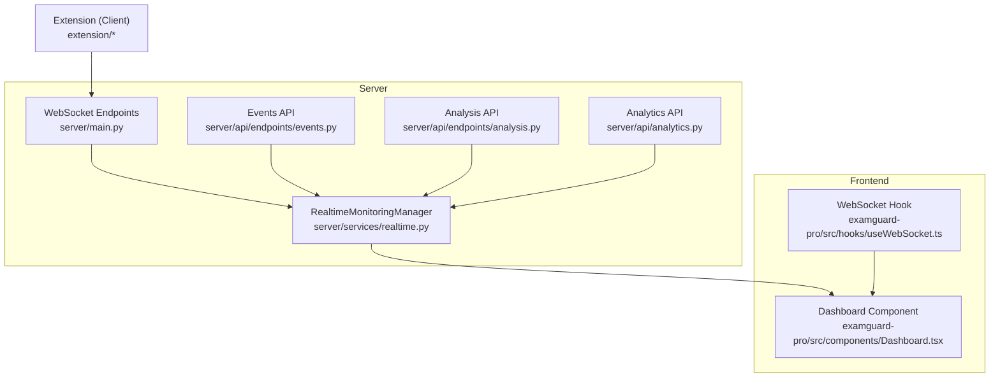
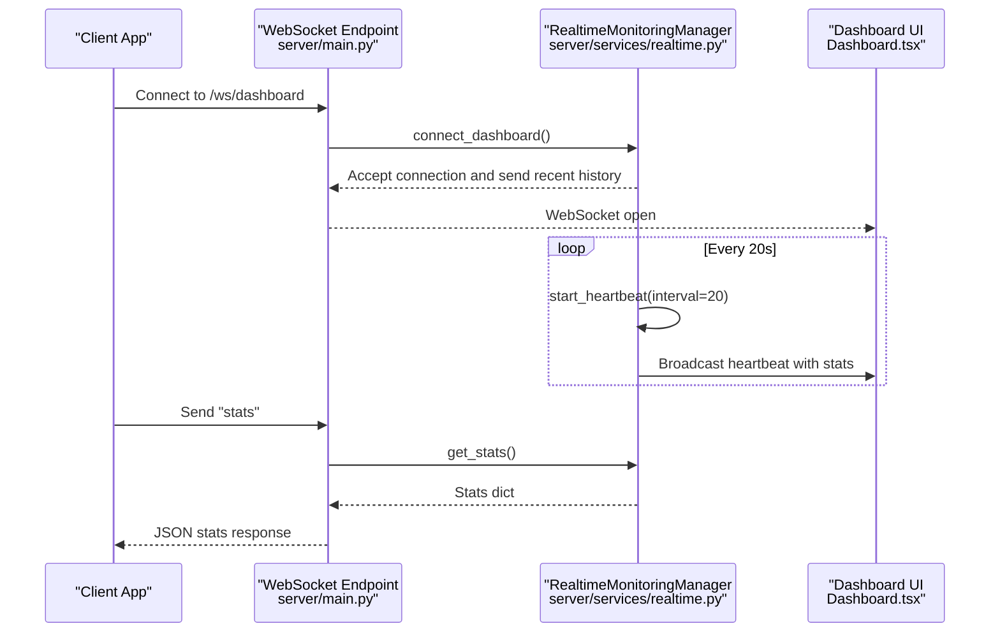
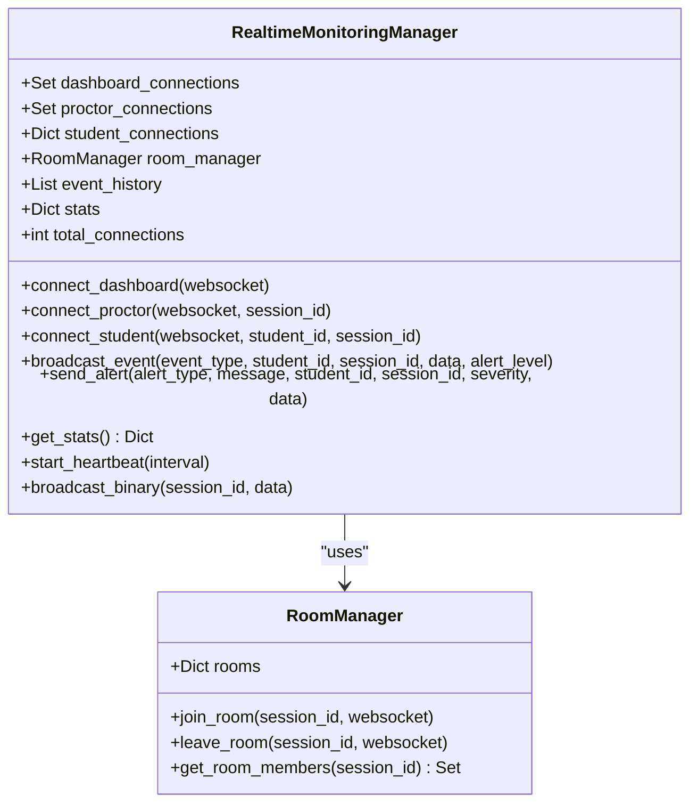
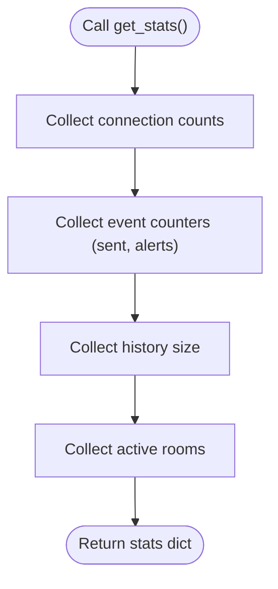
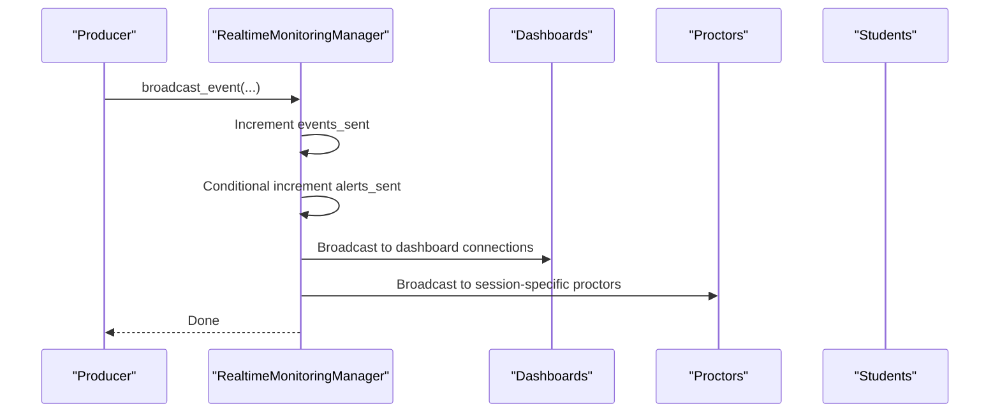
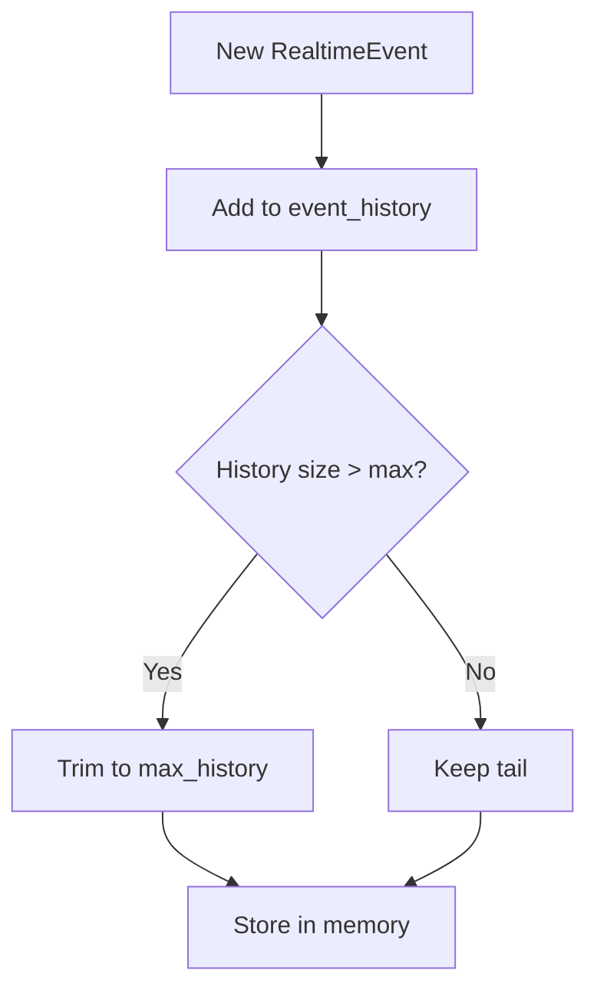
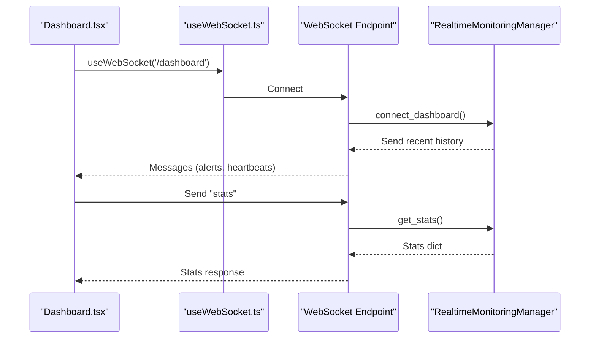
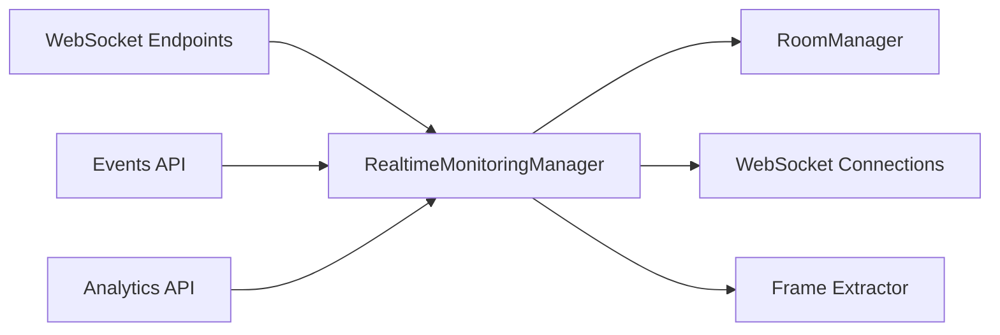

# Performance Statistics

<cite>
**Referenced Files in This Document**
- [realtime.py](file://server/services/realtime.py)
- [main.py](file://server/main.py)
- [analysis.py](file://server/api/endpoints/analysis.py)
- [events.py](file://server/api/endpoints/events.py)
- [analytics.py](file://server/api/analytics.py)
- [Dashboard.tsx](file://examguard-pro/src/components/Dashboard.tsx)
- [useWebSocket.ts](file://examguard-pro/src/hooks/useWebSocket.ts)
- [config.py](file://server/config.py)
- [schemas.py](file://server/schemas.py)
- [events_log.py](file://server/routers/events_log.py)
</cite>

## Table of Contents
1. [Introduction](#introduction)
2. [Project Structure](#project-structure)
3. [Core Components](#core-components)
4. [Architecture Overview](#architecture-overview)
5. [Detailed Component Analysis](#detailed-component-analysis)
6. [Dependency Analysis](#dependency-analysis)
7. [Performance Considerations](#performance-considerations)
8. [Troubleshooting Guide](#troubleshooting-guide)
9. [Conclusion](#conclusion)

## Introduction
This document explains the performance statistics and monitoring capabilities of the real-time coordination system. It covers how event counts, connection metrics, and alert tracking are collected and reported, details the get_stats method and its comprehensive reporting of system performance indicators, and documents connection pooling statistics, event broadcasting metrics, and historical data tracking. It also provides concrete examples of stats retrieval, outlines the internal statistics tracking mechanisms, and describes how the system integrates with the performance monitoring dashboard.

## Project Structure
The performance monitoring system spans the backend WebSocket service, API endpoints, and the frontend dashboard:
- Backend WebSocket service manages real-time connections, event broadcasting, and statistics.
- API endpoints log events, compute risk scores, and push updates to dashboards.
- Frontend dashboard subscribes to WebSocket channels and renders live statistics.

**Diagram sources**
- [realtime.py:102-643](file://server/services/realtime.py#L102-L643)
- [main.py:250-516](file://server/main.py#L250-L516)
- [events.py:1-414](file://server/api/endpoints/events.py#L1-L414)
- [analysis.py:1-453](file://server/api/endpoints/analysis.py#L1-L453)
- [analytics.py:1-528](file://server/api/analytics.py#L1-L528)
- [Dashboard.tsx:1-427](file://examguard-pro/src/components/Dashboard.tsx#L1-L427)
- [useWebSocket.ts:1-175](file://examguard-pro/src/hooks/useWebSocket.ts#L1-L175)

**Section sources**
- [realtime.py:102-643](file://server/services/realtime.py#L102-L643)
- [main.py:250-516](file://server/main.py#L250-L516)

## Core Components
- RealtimeMonitoringManager: Central coordinator for WebSocket connections, event broadcasting, and statistics.
- WebSocket endpoints: Expose real-time channels for dashboards, proctors, and students; support stats retrieval.
- Event APIs: Log events, compute risk scores, and broadcast updates.
- Analytics APIs: Local ML services for biometrics, gaze, forensics, and audio analysis.
- Frontend dashboard: Subscribes to WebSocket channels and displays live metrics.

**Section sources**
- [realtime.py:102-643](file://server/services/realtime.py#L102-L643)
- [main.py:250-516](file://server/main.py#L250-L516)
- [events.py:1-414](file://server/api/endpoints/events.py#L1-L414)
- [analysis.py:1-453](file://server/api/endpoints/analysis.py#L1-L453)
- [analytics.py:1-528](file://server/api/analytics.py#L1-L528)
- [Dashboard.tsx:1-427](file://examguard-pro/src/components/Dashboard.tsx#L1-L427)
- [useWebSocket.ts:1-175](file://examguard-pro/src/hooks/useWebSocket.ts#L1-L175)

## Architecture Overview
The system uses a WebSocket-based real-time coordination layer with three connection pools (dashboards, proctors, students), event broadcasting to targeted audiences, and periodic heartbeat messages containing aggregated statistics.

**Diagram sources**
- [main.py:275-348](file://server/main.py#L275-L348)
- [realtime.py:539-576](file://server/services/realtime.py#L539-L576)

**Section sources**
- [main.py:275-348](file://server/main.py#L275-L348)
- [realtime.py:539-576](file://server/services/realtime.py#L539-L576)

## Detailed Component Analysis

### RealtimeMonitoringManager
The manager maintains:
- Connection pools: dashboard_connections, proctor_connections, student_connections.
- Room-based routing via RoomManager for session-scoped broadcasts.
- Event history with configurable max size for late-joiners.
- Aggregated statistics: events_sent, alerts_sent, connections_total.

Key methods:
- connect_dashboard, connect_proctor, connect_student: manage connection pools and roles.
- broadcast_event, send_alert: broadcast to dashboards and session-specific proctors; increment counters.
- get_stats: returns connections, events, and rooms.
- start_heartbeat/_send_heartbeat: periodically sends heartbeat messages with connection and event counts.
- _broadcast_to_set/_send_to_socket: resilient broadcasting with cleanup on disconnect.

**Diagram sources**
- [realtime.py:102-643](file://server/services/realtime.py#L102-L643)

**Section sources**
- [realtime.py:102-643](file://server/services/realtime.py#L102-L643)

### Stats Collection and Reporting
- get_stats returns:
  - connections: dashboards, proctors, students, total.
  - events: sent, alerts, history_size.
  - rooms: active session room IDs.
- Heartbeat messages embed stats for dashboards and proctors.
- WebSocket endpoint /ws/stats exposes get_stats via GET.

**Diagram sources**
- [realtime.py:561-576](file://server/services/realtime.py#L561-L576)
- [main.py:511-516](file://server/main.py#L511-L516)

**Section sources**
- [realtime.py:561-576](file://server/services/realtime.py#L561-L576)
- [main.py:511-516](file://server/main.py#L511-L516)

### Event Broadcasting Metrics
- broadcast_event increments events_sent and alerts_sent for critical severities.
- send_alert is a convenience wrapper around broadcast_event.
- _broadcast_to_set handles resilience by removing disconnected sockets.

**Diagram sources**
- [realtime.py:334-402](file://server/services/realtime.py#L334-L402)

**Section sources**
- [realtime.py:334-402](file://server/services/realtime.py#L334-L402)

### Historical Data Tracking
- Event history stored as RealtimeEvent objects with a capped size.
- _add_to_history enforces max_history.
- _send_history forwards recent events to newly connected dashboards.

**Diagram sources**
- [realtime.py:620-630](file://server/services/realtime.py#L620-L630)

**Section sources**
- [realtime.py:620-630](file://server/services/realtime.py#L620-L630)

### Stats Retrieval Examples
- WebSocket channel:
  - Client sends "stats" to /ws/dashboard.
  - Server responds with JSON stats payload.
- REST endpoint:
  - GET /ws/stats returns stats dictionary.

**Section sources**
- [main.py:302-303](file://server/main.py#L302-L303)
- [main.py:511-516](file://server/main.py#L511-L516)

### Connection Pooling Statistics
- Connection pools:
  - dashboard_connections: global dashboard subscribers.
  - proctor_connections: session-aware proctor connections.
  - student_connections: per-student mapping for direct messaging.
- Room-based routing ensures session-scoped broadcasts.
- total_connections computed as the sum of pool sizes.

**Section sources**
- [realtime.py:117-120](file://server/services/realtime.py#L117-L120)
- [realtime.py:202-207](file://server/services/realtime.py#L202-L207)

### Real-Time Performance Indicators
- Heartbeat messages include:
  - dashboard_connections, proctor_connections, student_connections.
  - total_events, total_alerts.
- Frontend dashboard subscribes to live alerts and displays counts.

**Section sources**
- [realtime.py:545-559](file://server/services/realtime.py#L545-L559)
- [Dashboard.tsx:30-113](file://examguard-pro/src/components/Dashboard.tsx#L30-L113)

### Event Throughput and Alert Tracking
- Throughput:
  - events_sent tracks total events broadcast.
  - alerts_sent tracks critical/emergency alerts.
- Alert levels:
  - AlertLevel enum defines severity levels used to decide incrementing alerts_sent.

**Section sources**
- [realtime.py:16-22](file://server/services/realtime.py#L16-L22)
- [realtime.py:374-377](file://server/services/realtime.py#L374-L377)

### Statistical Data Aggregation
- Aggregation occurs in:
  - RealtimeMonitoringManager.get_stats for connection and event metrics.
  - API endpoints for session-level risk and engagement metrics.
- Risk score computation:
  - Weighted risk based on event types and browsing summaries.
  - Effort alignment adjusted by event impact.

**Section sources**
- [realtime.py:561-576](file://server/services/realtime.py#L561-L576)
- [events.py:94-130](file://server/api/endpoints/events.py#L94-L130)
- [analysis.py:232-250](file://server/api/endpoints/analysis.py#L232-L250)

### Metrics Export Capabilities
- WebSocket /ws/stats provides JSON stats for external monitoring.
- Health endpoint /health includes WebSocket stats and pipeline status.

**Section sources**
- [main.py:511-516](file://server/main.py#L511-L516)
- [main.py:556-592](file://server/main.py#L556-L592)

### Monitoring Dashboard Integration
- Dashboard.tsx subscribes to /ws/dashboard via useWebSocket hook.
- Live alerts are filtered and displayed; active student count is fetched periodically.
- WebSocket hook manages reconnection and room subscription.

**Diagram sources**
- [Dashboard.tsx:30-113](file://examguard-pro/src/components/Dashboard.tsx#L30-L113)
- [useWebSocket.ts:129-175](file://examguard-pro/src/hooks/useWebSocket.ts#L129-L175)
- [main.py:275-348](file://server/main.py#L275-L348)
- [realtime.py:561-576](file://server/services/realtime.py#L561-L576)

**Section sources**
- [Dashboard.tsx:30-113](file://examguard-pro/src/components/Dashboard.tsx#L30-L113)
- [useWebSocket.ts:129-175](file://examguard-pro/src/hooks/useWebSocket.ts#L129-L175)
- [main.py:275-348](file://server/main.py#L275-L348)
- [realtime.py:561-576](file://server/services/realtime.py#L561-L576)

## Dependency Analysis
- RealtimeMonitoringManager depends on:
  - RoomManager for session-based routing.
  - Frame extractor for AI analysis callbacks.
  - WebSocket connections for broadcasting.
- WebSocket endpoints depend on RealtimeMonitoringManager for connection and stats.
- Event APIs depend on RealtimeMonitoringManager for broadcasting risk updates and live frames.
- Analytics APIs provide local ML insights integrated with the broader monitoring.

**Diagram sources**
- [realtime.py:102-643](file://server/services/realtime.py#L102-L643)
- [main.py:250-516](file://server/main.py#L250-L516)
- [events.py:196-224](file://server/api/endpoints/events.py#L196-L224)
- [analytics.py:1-528](file://server/api/analytics.py#L1-L528)

**Section sources**
- [realtime.py:102-643](file://server/services/realtime.py#L102-L643)
- [main.py:250-516](file://server/main.py#L250-L516)
- [events.py:196-224](file://server/api/endpoints/events.py#L196-L224)
- [analytics.py:1-528](file://server/api/analytics.py#L1-L528)

## Performance Considerations
- Connection cleanup: Disconnected sockets are removed from all pools and rooms to prevent leaks.
- Resilient broadcasting: _broadcast_to_set attempts sends and removes failing sockets.
- History trimming: Event history maintains bounded memory usage.
- Heartbeat intervals: Configured to balance responsiveness and overhead.

[No sources needed since this section provides general guidance]

## Troubleshooting Guide
- Stats not updating:
  - Verify heartbeat task is running and WebSocket endpoints are reachable.
  - Confirm clients send "stats" to /ws/dashboard or call /ws/stats.
- High alerts_sent:
  - Review critical alert triggers and adjust thresholds.
  - Inspect broadcast_event calls with high-severity alert levels.
- Connection drops:
  - Check _broadcast_to_set behavior and disconnect cleanup.
  - Validate client reconnection logic in useWebSocket.

**Section sources**
- [main.py:134-137](file://server/main.py#L134-L137)
- [realtime.py:589-601](file://server/services/realtime.py#L589-L601)
- [useWebSocket.ts:56-64](file://examguard-pro/src/hooks/useWebSocket.ts#L56-L64)

## Conclusion
The real-time coordination system provides comprehensive performance statistics through a centralized RealtimeMonitoringManager, robust WebSocket endpoints, and a reactive frontend dashboard. Stats include connection pools, event throughput, alert counts, and historical context, enabling effective monitoring and alerting. The design emphasizes resilience, scalability, and clear separation of concerns across components.