# Real-Time Coordination

<cite>
**Referenced Files in This Document**
- [realtime.py](file://server/services/realtime.py)
- [frame_extractor.py](file://server/services/frame_extractor.py)
- [main.py](file://server/main.py)
- [pipeline.py](file://server/services/pipeline.py)
- [object_detection.py](file://server/services/object_detection.py)
- [analysis.py](file://server/api/endpoints/analysis.py)
- [useWebSocket.ts](file://examguard-pro/src/hooks/useWebSocket.ts)
</cite>

## Table of Contents
1. [Introduction](#introduction)
2. [Project Structure](#project-structure)
3. [Core Components](#core-components)
4. [Architecture Overview](#architecture-overview)
5. [Detailed Component Analysis](#detailed-component-analysis)
6. [Dependency Analysis](#dependency-analysis)
7. [Performance Considerations](#performance-considerations)
8. [Troubleshooting Guide](#troubleshooting-guide)
9. [Conclusion](#conclusion)

## Introduction
This document explains the real-time coordination mechanisms in ExamGuard Pro, focusing on how the system orchestrates concurrent WebSocket connections, manages session-based room hierarchies, and processes live video streams for AI analysis. It documents the frame extraction pipeline, heartbeat monitoring, event history for late-joiner synchronization, and statistical tracking. It also covers integration with AI services for concurrent processing, thread-safe coordination patterns, and performance optimizations for high-concurrency scenarios.

## Project Structure
The real-time coordination spans three primary areas:
- Backend WebSocket orchestration and broadcasting
- Video frame extraction and AI analysis pipeline
- Frontend WebSocket manager for UI connectivity

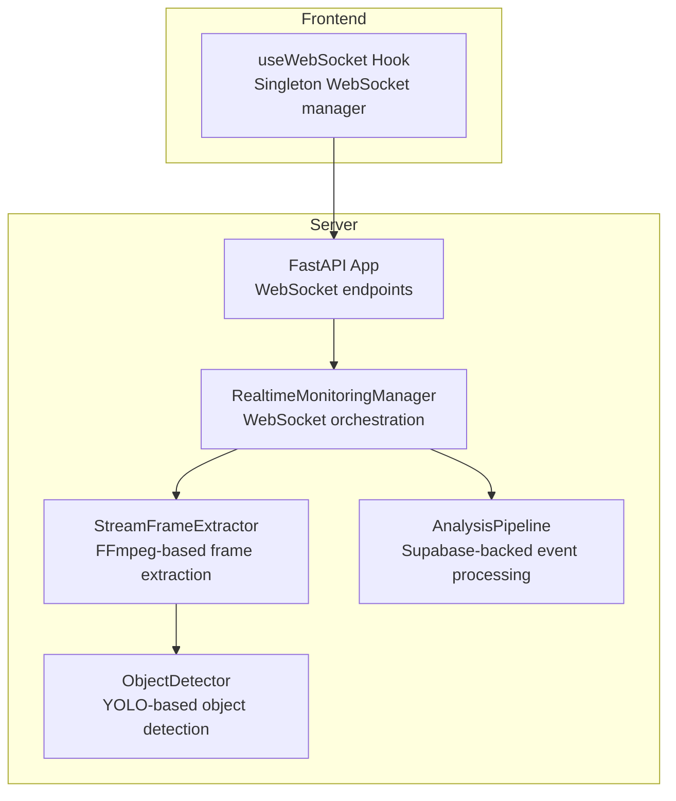

**Diagram sources**
- [realtime.py:102-642](file://server/services/realtime.py#L102-L642)
- [frame_extractor.py:10-115](file://server/services/frame_extractor.py#L10-L115)
- [object_detection.py:16-147](file://server/services/object_detection.py#L16-L147)
- [pipeline.py:9-345](file://server/services/pipeline.py#L9-L345)
- [main.py:275-504](file://server/main.py#L275-L504)
- [useWebSocket.ts:1-133](file://examguard-pro/src/hooks/useWebSocket.ts#L1-L133)

**Section sources**
- [realtime.py:102-642](file://server/services/realtime.py#L102-L642)
- [frame_extractor.py:10-115](file://server/services/frame_extractor.py#L10-L115)
- [main.py:275-504](file://server/main.py#L275-L504)
- [useWebSocket.ts:1-133](file://examguard-pro/src/hooks/useWebSocket.ts#L1-L133)

## Core Components
- RealtimeMonitoringManager: Central coordinator for WebSocket connections, room-based broadcasting, event history, heartbeat, and stats.
- StreamFrameExtractor: Accumulates WebM chunks, periodically extracts frames using FFmpeg, and invokes AI callbacks.
- AnalysisPipeline: Asynchronous queue-driven processor for events, integrating with Supabase and broadcasting results.
- ObjectDetector: YOLO-based detection of forbidden objects in frames.
- FastAPI WebSocket endpoints: Expose dashboard, proctor, and student channels.
- useWebSocket hook: Frontend singleton managing connection lifecycle, subscriptions, and reconnect logic.

**Section sources**
- [realtime.py:102-642](file://server/services/realtime.py#L102-L642)
- [frame_extractor.py:10-115](file://server/services/frame_extractor.py#L10-L115)
- [pipeline.py:9-345](file://server/services/pipeline.py#L9-L345)
- [object_detection.py:16-147](file://server/services/object_detection.py#L16-L147)
- [main.py:275-504](file://server/main.py#L275-L504)
- [useWebSocket.ts:1-133](file://examguard-pro/src/hooks/useWebSocket.ts#L1-L133)

## Architecture Overview
The system integrates frontend and backend real-time pathways:
- Frontend establishes WebSocket connections and subscribes to rooms.
- Backend accepts connections, assigns roles, and manages rooms.
- Live video streams are received as binary chunks and forwarded to the frame extractor.
- Extracted frames trigger AI analysis (vision and object detection).
- Results are broadcast to dashboards, proctors, and students; historical events support late-joiner synchronization.
- Heartbeat messages maintain connection health and expose stats.

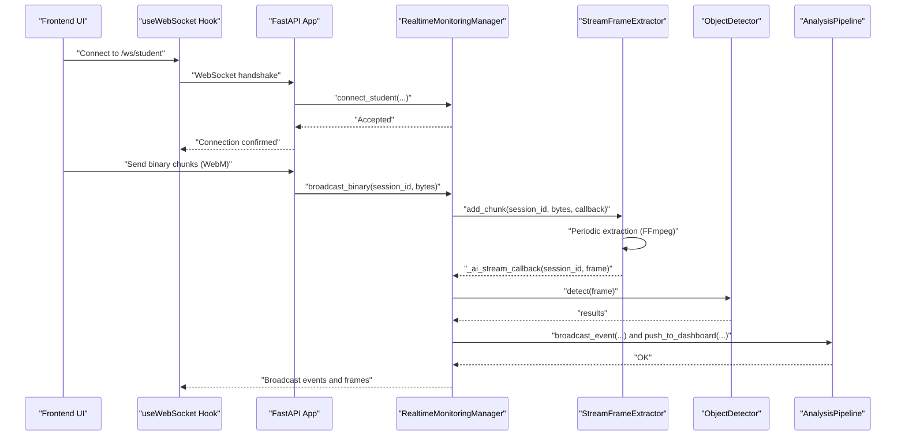

**Diagram sources**
- [main.py:400-504](file://server/main.py#L400-L504)
- [realtime.py:310-329](file://server/services/realtime.py#L310-L329)
- [frame_extractor.py:31-43](file://server/services/frame_extractor.py#L31-L43)
- [object_detection.py:65-137](file://server/services/object_detection.py#L65-L137)
- [pipeline.py:306-335](file://server/services/pipeline.py#L306-L335)
- [useWebSocket.ts:131-133](file://examguard-pro/src/hooks/useWebSocket.ts#L131-L133)

## Detailed Component Analysis

### RealtimeMonitoringManager
Responsibilities:
- Manage connection pools for dashboards, proctors, and student-to-connection mapping.
- Maintain session-based rooms via RoomManager and broadcast to subsets.
- Buffer recent events for late-joiner synchronization.
- Emit periodic heartbeats and track connection metrics.
- Coordinate AI callbacks from extracted frames.

Key behaviors:
- Room-based broadcasting ensures proctors and dashboards receive session-scoped updates.
- Event history is capped to a configurable maximum and sent to newly connected dashboards.
- Heartbeat messages include connection counts and event/alert tallies.
- Stats counters track total connections, events sent, and alerts.

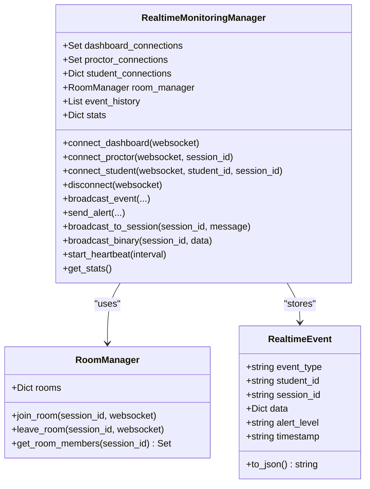

**Diagram sources**
- [realtime.py:81-137](file://server/services/realtime.py#L81-L137)
- [realtime.py:334-417](file://server/services/realtime.py#L334-L417)
- [realtime.py:539-576](file://server/services/realtime.py#L539-L576)

**Section sources**
- [realtime.py:102-642](file://server/services/realtime.py#L102-L642)

### StreamFrameExtractor
Responsibilities:
- Persist incoming WebM chunks per session into temporary files.
- Periodically extract the latest frame using FFmpeg and invoke a callback with the frame.
- Thread-safe management of per-session buffers and extraction timing.
- Cleanup temporary files upon session termination.

Processing logic:
- Append binary chunks to a persistent temp file per session.
- Enforce a minimum interval between extractions to control FPS.
- Spawn a background thread to run FFmpeg and OpenCV loading.
- Invoke the AI callback with the extracted frame.

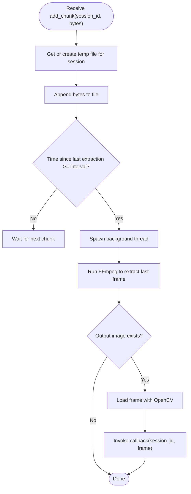

**Diagram sources**
- [frame_extractor.py:31-43](file://server/services/frame_extractor.py#L31-L43)
- [frame_extractor.py:45-89](file://server/services/frame_extractor.py#L45-L89)

**Section sources**
- [frame_extractor.py:10-115](file://server/services/frame_extractor.py#L10-L115)

### AI Analysis Integration
The AI callback chain:
- RealtimeMonitoringManager registers a callback with StreamFrameExtractor.
- On frame extraction, the callback accesses the vision engine and object detector from app state.
- Vision engine results trigger “vision_alert” broadcasts.
- Object detector results trigger “anomaly_alert” and critical alerts for phones.

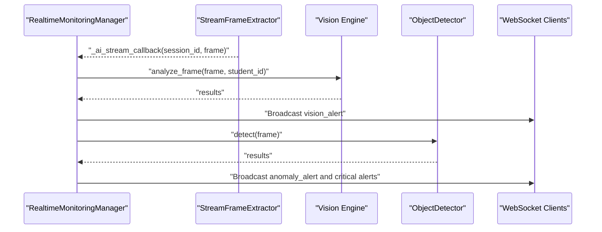

**Diagram sources**
- [realtime.py:140-199](file://server/services/realtime.py#L140-L199)
- [object_detection.py:65-137](file://server/services/object_detection.py#L65-L137)

**Section sources**
- [realtime.py:140-199](file://server/services/realtime.py#L140-L199)
- [object_detection.py:16-147](file://server/services/object_detection.py#L16-L147)

### WebSocket Endpoints and Room Coordination
Endpoints:
- Dashboard: receives all events and supports subscription to specific sessions.
- Proctor: receives session-scoped events only.
- Student: receives alerts and instructions; handles live video binary chunks.

Room coordination:
- RoomManager tracks which WebSocket belongs to which session.
- broadcast_to_session sends messages to all members of a given session.
- broadcast_binary forwards binary chunks to dashboards and proctors; it also triggers frame extraction.

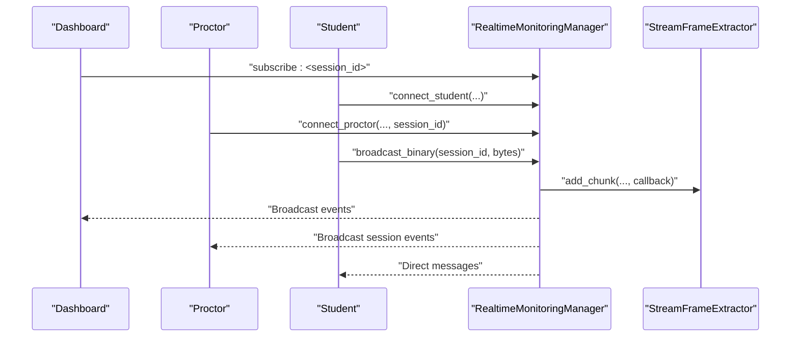

**Diagram sources**
- [main.py:275-342](file://server/main.py#L275-L342)
- [main.py:345-391](file://server/main.py#L345-L391)
- [main.py:394-504](file://server/main.py#L394-L504)
- [realtime.py:412-416](file://server/services/realtime.py#L412-L416)
- [realtime.py:310-329](file://server/services/realtime.py#L310-L329)

**Section sources**
- [main.py:275-504](file://server/main.py#L275-L504)
- [realtime.py:81-100](file://server/services/realtime.py#L81-L100)
- [realtime.py:412-416](file://server/services/realtime.py#L412-L416)
- [realtime.py:310-329](file://server/services/realtime.py#L310-L329)

### Frontend WebSocket Manager
The useWebSocket hook:
- Singleton WebSocketManager persists across React re-renders.
- Tracks subscribers, status subscribers, and subscribed rooms.
- Implements exponential-like reconnect attempts and re-subscribes after reconnect.
- Supports subscribing to rooms and sending messages.

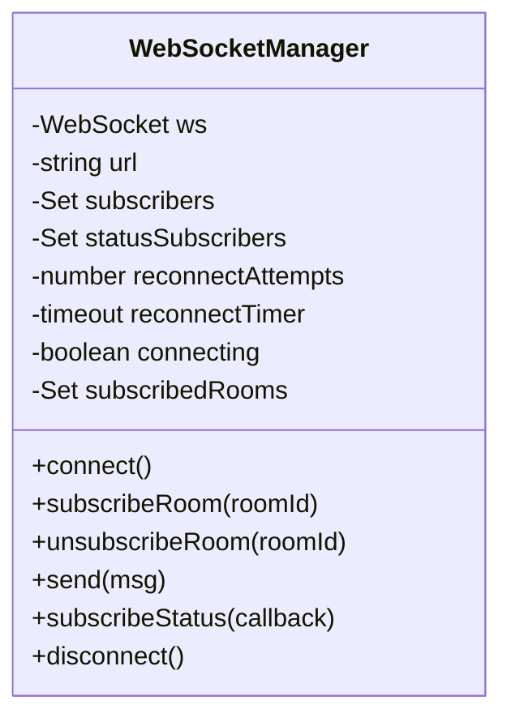

**Diagram sources**
- [useWebSocket.ts:5-126](file://examguard-pro/src/hooks/useWebSocket.ts#L5-L126)

**Section sources**
- [useWebSocket.ts:1-133](file://examguard-pro/src/hooks/useWebSocket.ts#L1-L133)

### Heartbeat Monitoring and Stats
- Heartbeat task runs periodically and broadcasts stats to dashboards.
- Stats include connection counts, total events, and total alerts.
- Health endpoints surface WebSocket and pipeline stats.

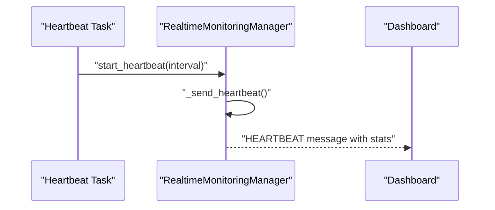

**Diagram sources**
- [main.py:134-137](file://server/main.py#L134-L137)
- [realtime.py:539-559](file://server/services/realtime.py#L539-L559)

**Section sources**
- [realtime.py:539-576](file://server/services/realtime.py#L539-L576)
- [main.py:551-587](file://server/main.py#L551-L587)

### Event History and Late-Joiner Synchronization
- RealtimeMonitoringManager maintains a bounded event history.
- New dashboard connections receive recent events via _send_history.
- This ensures late-joiners can synchronize with recent state.

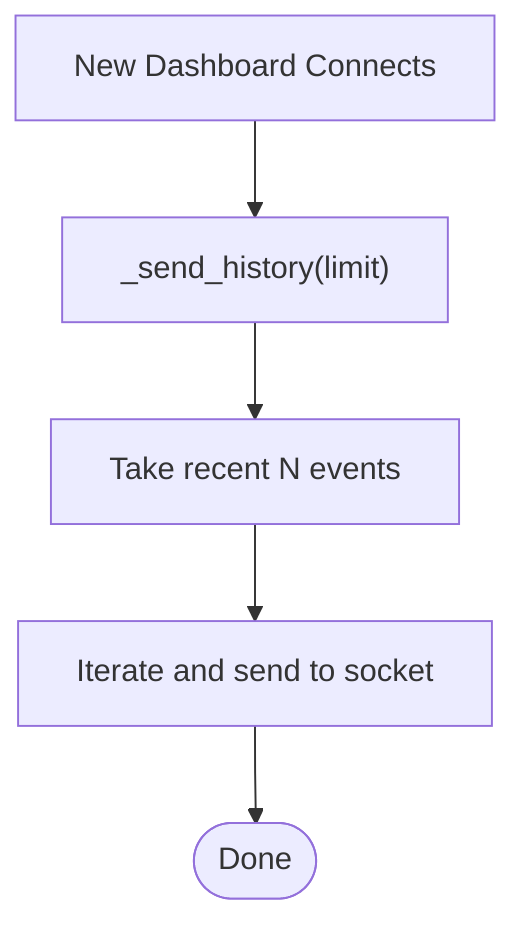

**Diagram sources**
- [realtime.py:626-630](file://server/services/realtime.py#L626-L630)

**Section sources**
- [realtime.py:128-131](file://server/services/realtime.py#L128-L131)
- [realtime.py:620-630](file://server/services/realtime.py#L620-L630)

### Integration with AI Services and Concurrent Processing
- Vision engine and object detector are accessed from app state inside the AI callback.
- AnalysisPipeline processes events asynchronously and pushes results to dashboards and students.
- Live frames from analysis endpoints are broadcast to sessions.

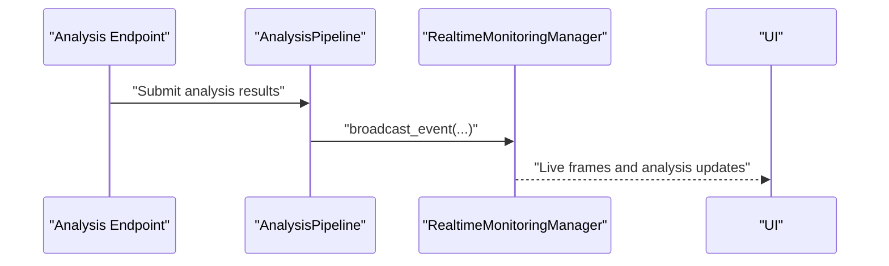

**Diagram sources**
- [analysis.py:196-224](file://server/api/endpoints/analysis.py#L196-L224)
- [pipeline.py:306-335](file://server/services/pipeline.py#L306-L335)
- [realtime.py:334-417](file://server/services/realtime.py#L334-L417)

**Section sources**
- [analysis.py:196-224](file://server/api/endpoints/analysis.py#L196-L224)
- [pipeline.py:306-335](file://server/services/pipeline.py#L306-L335)
- [realtime.py:140-199](file://server/services/realtime.py#L140-L199)

## Dependency Analysis
- RealtimeMonitoringManager depends on StreamFrameExtractor for frame extraction and on AI services (vision engine and object detector) via app state.
- StreamFrameExtractor depends on FFmpeg and OpenCV for frame extraction.
- AnalysisPipeline depends on Supabase for persistence and uses RealtimeMonitoringManager to broadcast results.
- Frontend useWebSocket hook depends on the backend WebSocket endpoints.

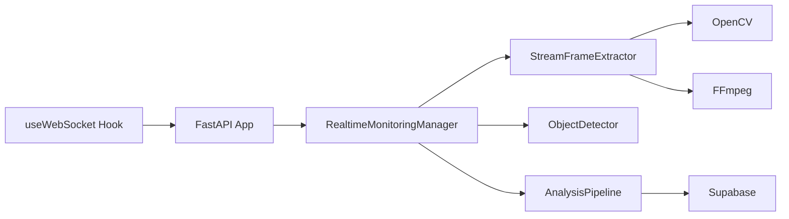

**Diagram sources**
- [realtime.py:124-126](file://server/services/realtime.py#L124-L126)
- [frame_extractor.py:50-66](file://server/services/frame_extractor.py#L50-L66)
- [pipeline.py:1-7](file://server/services/pipeline.py#L1-L7)
- [useWebSocket.ts:1-2](file://examguard-pro/src/hooks/useWebSocket.ts#L1-L2)
- [main.py:275-504](file://server/main.py#L275-L504)

**Section sources**
- [realtime.py:124-126](file://server/services/realtime.py#L124-L126)
- [frame_extractor.py:50-66](file://server/services/frame_extractor.py#L50-L66)
- [pipeline.py:1-7](file://server/services/pipeline.py#L1-L7)
- [useWebSocket.ts:1-2](file://examguard-pro/src/hooks/useWebSocket.ts#L1-L2)
- [main.py:275-504](file://server/main.py#L275-L504)

## Performance Considerations
- Frame extraction throttling: StreamFrameExtractor enforces a minimum interval between extractions to cap AI processing load.
- Background threads: FFmpeg extraction runs in a daemon thread to avoid blocking WebSocket handlers.
- Bounded event history: Limits memory footprint for late-joiner sync.
- Queue-driven pipeline: AnalysisPipeline processes events asynchronously, preventing backpressure on WebSocket handlers.
- Heartbeat intervals: Configurable intervals reduce unnecessary traffic while keeping connections alive.
- Resource cleanup: Temporary files are cleaned up when sessions end.

[No sources needed since this section provides general guidance]

## Troubleshooting Guide
Common issues and diagnostics:
- FFmpeg not found: StreamFrameExtractor logs an error when FFmpeg is unavailable; extraction is disabled.
- WebSocket disconnects: RealtimeMonitoringManager removes disconnected sockets and cleans up rooms.
- Heartbeat failures: Heartbeat task runs continuously; missing heartbeats indicate network or server issues.
- Pipeline errors: AnalysisPipeline increments error counters and continues processing.

**Section sources**
- [frame_extractor.py:84-89](file://server/services/frame_extractor.py#L84-L89)
- [realtime.py:593-601](file://server/services/realtime.py#L593-L601)
- [main.py:134-137](file://server/main.py#L134-L137)
- [pipeline.py:69-72](file://server/services/pipeline.py#L69-L72)

## Conclusion
ExamGuard Pro’s real-time coordination combines robust WebSocket orchestration, session-based room hierarchies, and a scalable frame extraction pipeline. The system leverages asynchronous processing, bounded histories, and heartbeat monitoring to maintain reliability under concurrency. Integrations with AI services enable concurrent analysis of multiple video streams, while thread-safe patterns and resource cleanup ensure efficient operation.