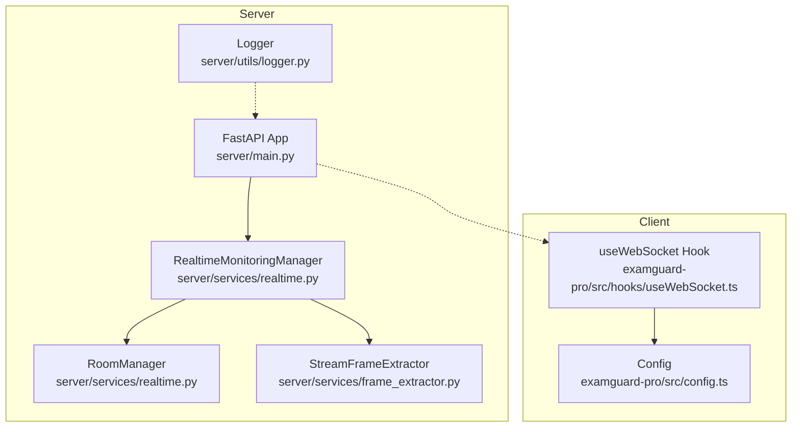
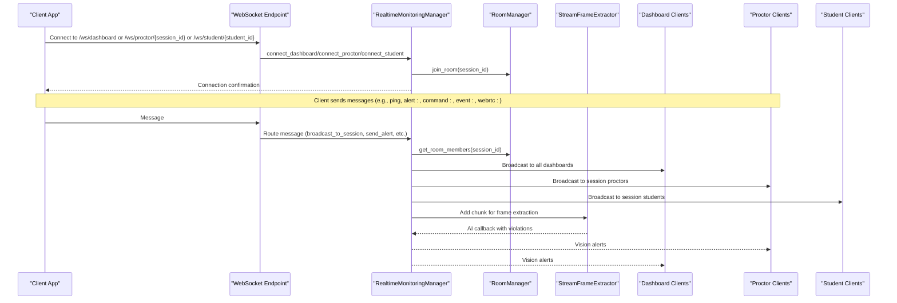
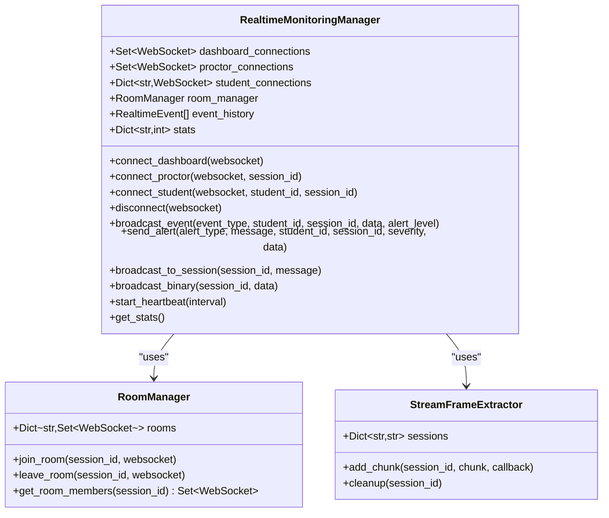
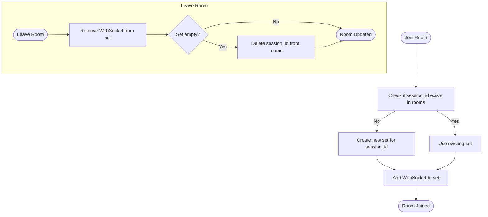
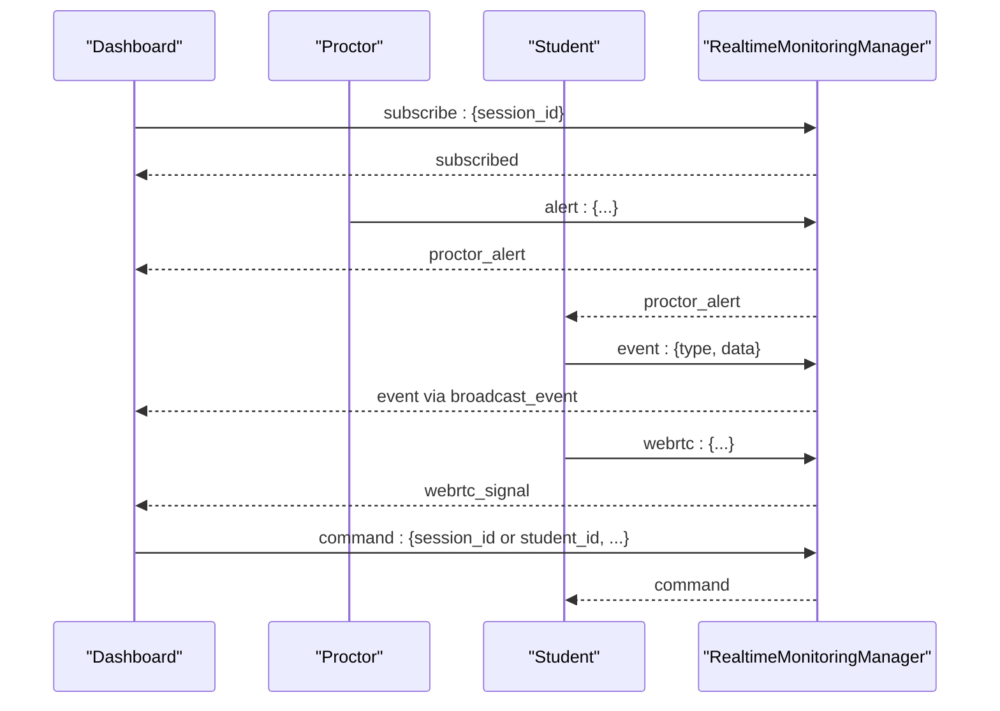
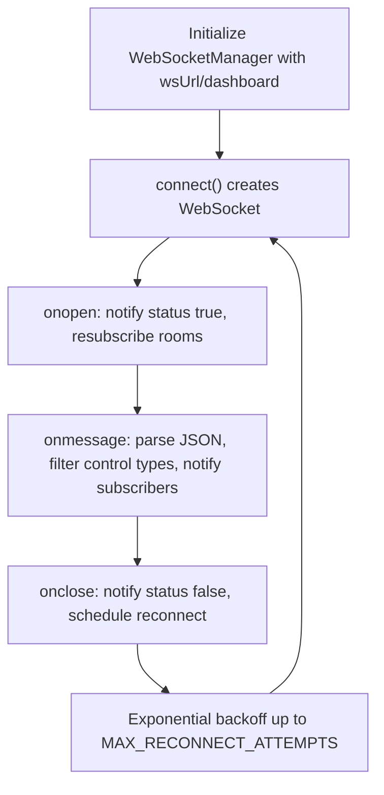
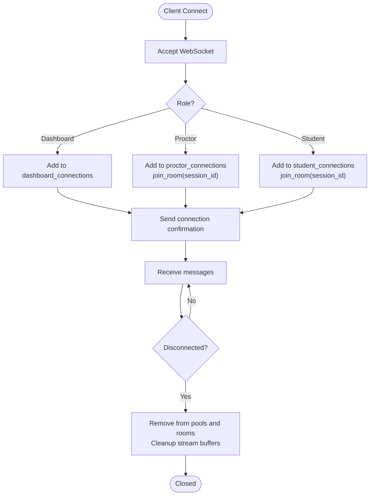
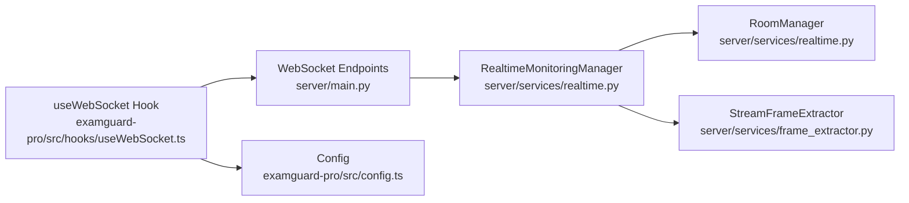

# WebSocket Architecture

<cite>
**Referenced Files in This Document**
- [main.py](file://server/main.py)
- [realtime.py](file://server/services/realtime.py)
- [frame_extractor.py](file://server/services/frame_extractor.py)
- [useWebSocket.ts](file://examguard-pro/src/hooks/useWebSocket.ts)
- [config.ts](file://examguard-pro/src/config.ts)
- [logger.py](file://server/utils/logger.py)
</cite>

## Table of Contents
1. [Introduction](#introduction)
2. [Project Structure](#project-structure)
3. [Core Components](#core-components)
4. [Architecture Overview](#architecture-overview)
5. [Detailed Component Analysis](#detailed-component-analysis)
6. [Dependency Analysis](#dependency-analysis)
7. [Performance Considerations](#performance-considerations)
8. [Troubleshooting Guide](#troubleshooting-guide)
9. [Conclusion](#conclusion)

## Introduction
This document explains the WebSocket architecture powering real-time monitoring in ExamGuard Pro. It focuses on the RealtimeMonitoringManager class as the central coordinator for all WebSocket connections, the three connection pools (dashboard, proctor, and student), the RoomManager implementation for session-based room hierarchies, and the multi-tiered broadcasting system. It also documents connection lifecycle management, error handling strategies, automatic cleanup mechanisms, and the structured approach to real-time communication across all system components.

## Project Structure
The WebSocket implementation spans two primary areas:
- Server-side WebSocket endpoints and real-time coordination in the FastAPI application
- Client-side WebSocket manager in the React dashboard

**Diagram sources**
- [main.py:275-504](file://server/main.py#L275-L504)
- [realtime.py:102-642](file://server/services/realtime.py#L102-L642)
- [frame_extractor.py:10-115](file://server/services/frame_extractor.py#L10-L115)
- [useWebSocket.ts:1-175](file://examguard-pro/src/hooks/useWebSocket.ts#L1-L175)
- [config.ts:1-12](file://examguard-pro/src/config.ts#L1-L12)
- [logger.py:1-64](file://server/utils/logger.py#L1-L64)

**Section sources**
- [main.py:275-504](file://server/main.py#L275-L504)
- [realtime.py:102-642](file://server/services/realtime.py#L102-L642)
- [useWebSocket.ts:1-175](file://examguard-pro/src/hooks/useWebSocket.ts#L1-L175)
- [config.ts:1-12](file://examguard-pro/src/config.ts#L1-L12)

## Core Components
- RealtimeMonitoringManager: Central coordinator managing three connection pools, room-based broadcasting, event history, and heartbeat monitoring.
- RoomManager: Manages session-based rooms for targeted broadcasting.
- StreamFrameExtractor: Extracts frames from live video streams for AI analysis.
- WebSocket endpoints: Dedicated endpoints for dashboard, proctor, and student connections.
- Client WebSocket manager: Handles connection lifecycle, reconnection, room subscription, and message routing in the React dashboard.

Key responsibilities:
- Connection pools: dashboard_connections (global), proctor_connections (room-scoped), student_connections (student_id -> WebSocket).
- Room-based broadcasting: broadcast_to_session routes messages to all connections in a session room.
- Event broadcasting: broadcast_event sends events to dashboards and session-specific proctors, with severity-aware alerting.
- Heartbeat monitoring: periodic heartbeats to keep connections alive and report stats.
- Automatic cleanup: disconnect removes stale connections and cleans up stream buffers.

**Section sources**
- [realtime.py:115-138](file://server/services/realtime.py#L115-L138)
- [realtime.py:213-309](file://server/services/realtime.py#L213-L309)
- [realtime.py:412-417](file://server/services/realtime.py#L412-L417)
- [realtime.py:539-560](file://server/services/realtime.py#L539-L560)

## Architecture Overview
The WebSocket architecture follows a multi-tiered broadcasting model:
- Global tier: Dashboard receives all events and can subscribe to specific sessions.
- Session tier: Proctors receive only events for their assigned session; students receive session-specific alerts and instructions.
- Binary streaming tier: Live webcam/video chunks are broadcast to dashboards and proctors; AI analysis runs on extracted frames.

**Diagram sources**
- [main.py:275-504](file://server/main.py#L275-L504)
- [realtime.py:213-309](file://server/services/realtime.py#L213-L309)
- [realtime.py:412-417](file://server/services/realtime.py#L412-L417)
- [frame_extractor.py:31-44](file://server/services/frame_extractor.py#L31-L44)

## Detailed Component Analysis

### RealtimeMonitoringManager
The RealtimeMonitoringManager is the central coordinator for all WebSocket connections. It maintains three connection pools and orchestrates multi-tiered broadcasting.

**Diagram sources**
- [realtime.py:102-642](file://server/services/realtime.py#L102-L642)

Key capabilities:
- Connection pools: Separate pools for dashboard, proctor, and student connections.
- Room-based broadcasting: Uses RoomManager to target specific sessions.
- Event broadcasting: Sends events to dashboards and session-specific proctors; tracks alert severity.
- Binary streaming: Forwards video chunks to dashboards and proctors; triggers AI frame extraction.
- Heartbeat monitoring: Periodic heartbeats to keep connections alive and report stats.
- History and stats: Maintains event history and connection statistics.

**Section sources**
- [realtime.py:115-138](file://server/services/realtime.py#L115-L138)
- [realtime.py:213-309](file://server/services/realtime.py#L213-L309)
- [realtime.py:334-417](file://server/services/realtime.py#L334-L417)
- [realtime.py:539-560](file://server/services/realtime.py#L539-L560)

### RoomManager Implementation
RoomManager manages session-based rooms for targeted broadcasting. It stores sets of WebSocket connections per session and provides membership queries.

**Diagram sources**
- [realtime.py:81-100](file://server/services/realtime.py#L81-L100)

**Section sources**
- [realtime.py:81-100](file://server/services/realtime.py#L81-L100)

### WebSocket Endpoints and Message Routing
The server exposes three WebSocket endpoints:
- Dashboard: Receives all events and can subscribe to specific sessions.
- Proctor: Receives only events for the specified session.
- Student: Receives alerts and instructions from proctors; can report events and WebRTC signaling.

**Diagram sources**
- [main.py:275-504](file://server/main.py#L275-L504)
- [realtime.py:334-417](file://server/services/realtime.py#L334-L417)

**Section sources**
- [main.py:275-504](file://server/main.py#L275-L504)
- [realtime.py:334-417](file://server/services/realtime.py#L334-L417)

### Client-Side WebSocket Manager
The client-side WebSocket manager in the React dashboard:
- Establishes connections to the dashboard endpoint.
- Handles reconnection with exponential backoff.
- Subscribes to rooms and forwards messages to subscribers.
- Ignores control messages (connection, heartbeat, pong, subscribed).

**Diagram sources**
- [useWebSocket.ts:1-175](file://examguard-pro/src/hooks/useWebSocket.ts#L1-L175)
- [config.ts:1-12](file://examguard-pro/src/config.ts#L1-L12)

**Section sources**
- [useWebSocket.ts:1-175](file://examguard-pro/src/hooks/useWebSocket.ts#L1-L175)
- [config.ts:1-12](file://examguard-pro/src/config.ts#L1-L12)

### Connection Lifecycle Management and Automatic Cleanup
Connection lifecycle management includes:
- Connection acceptance and role-specific initialization.
- Room joining upon connection.
- Graceful disconnection handling and cleanup.
- Stream buffer cleanup for sessions.

**Diagram sources**
- [realtime.py:213-309](file://server/services/realtime.py#L213-L309)
- [realtime.py:275-309](file://server/services/realtime.py#L275-L309)

**Section sources**
- [realtime.py:213-309](file://server/services/realtime.py#L213-L309)
- [realtime.py:275-309](file://server/services/realtime.py#L275-L309)

### Error Handling Strategies
- Server-side: Try-catch around message handling; disconnects broken sockets; logs errors; heartbeat task cancellation on shutdown.
- Client-side: Robust parsing and filtering of messages; ignores non-JSON; exponential backoff reconnection; explicit status notifications.

**Section sources**
- [main.py:340-391](file://server/main.py#L340-L391)
- [main.py:474-503](file://server/main.py#L474-L503)
- [useWebSocket.ts:43-73](file://examguard-pro/src/hooks/useWebSocket.ts#L43-L73)

### WebSocket Message Formats and Event Types
Message structure:
- Connection confirmation: includes role and timestamp.
- Heartbeat: includes stats and timestamp.
- Events: include event_type, student_id, session_id, data, alert_level, timestamp.
- Commands: include routing identifiers (session_id or student_id).
- Alerts: include alert_type, message, and optional data.
- WebRTC signaling: includes type and payload.

Event types include session lifecycle, monitoring, suspicious activity, advanced detection, analysis, system, and heartbeat.

**Section sources**
- [realtime.py:16-65](file://server/services/realtime.py#L16-L65)
- [realtime.py:67-79](file://server/services/realtime.py#L67-L79)
- [main.py:296-338](file://server/main.py#L296-L338)
- [main.py:364-387](file://server/main.py#L364-L387)
- [main.py:420-476](file://server/main.py#L420-L476)

## Dependency Analysis
The WebSocket architecture exhibits clear separation of concerns:
- Server endpoints depend on RealtimeMonitoringManager for connection and broadcasting logic.
- RealtimeMonitoringManager depends on RoomManager for session scoping and StreamFrameExtractor for AI analysis.
- Client WebSocket manager depends on configuration for endpoint URLs and uses a singleton pattern for persistence.

**Diagram sources**
- [main.py:275-504](file://server/main.py#L275-L504)
- [realtime.py:102-642](file://server/services/realtime.py#L102-L642)
- [frame_extractor.py:10-115](file://server/services/frame_extractor.py#L10-L115)
- [useWebSocket.ts:1-175](file://examguard-pro/src/hooks/useWebSocket.ts#L1-L175)
- [config.ts:1-12](file://examguard-pro/src/config.ts#L1-L12)

**Section sources**
- [main.py:275-504](file://server/main.py#L275-L504)
- [realtime.py:102-642](file://server/services/realtime.py#L102-L642)
- [frame_extractor.py:10-115](file://server/services/frame_extractor.py#L10-L115)
- [useWebSocket.ts:1-175](file://examguard-pro/src/hooks/useWebSocket.ts#L1-L175)
- [config.ts:1-12](file://examguard-pro/src/config.ts#L1-L12)

## Performance Considerations
- Binary streaming: Video chunks are forwarded to dashboards and proctors; AI frame extraction runs asynchronously to avoid blocking WebSocket loops.
- Heartbeat intervals: Configurable heartbeat interval to keep connections alive without excessive overhead.
- Event history: Limited-size history to reduce memory usage while enabling late-joiner synchronization.
- Exponential backoff: Client-side reconnection avoids thundering herd on server restarts.

[No sources needed since this section provides general guidance]

## Troubleshooting Guide
Common issues and remedies:
- Connection failures: Verify endpoint URLs and network connectivity; check server logs for exceptions.
- No messages received: Ensure room subscription for dashboard clients; confirm message filtering logic in the client.
- Disconnections: Server automatically cleans up; client reconnects with exponential backoff.
- FFmpeg not found: Server-side frame extraction disabled; verify FFmpeg installation or adjust expectations.

**Section sources**
- [logger.py:51-64](file://server/utils/logger.py#L51-L64)
- [useWebSocket.ts:60-64](file://examguard-pro/src/hooks/useWebSocket.ts#L60-L64)
- [frame_extractor.py:84-89](file://server/services/frame_extractor.py#L84-L89)

## Conclusion
ExamGuard Pro’s WebSocket architecture centers on RealtimeMonitoringManager, which coordinates three connection pools and implements a robust, multi-tiered broadcasting system. RoomManager enables session-based targeting, while the client-side WebSocket manager ensures resilient connectivity and efficient message routing. Together, these components deliver a scalable, real-time monitoring solution for exam supervision.