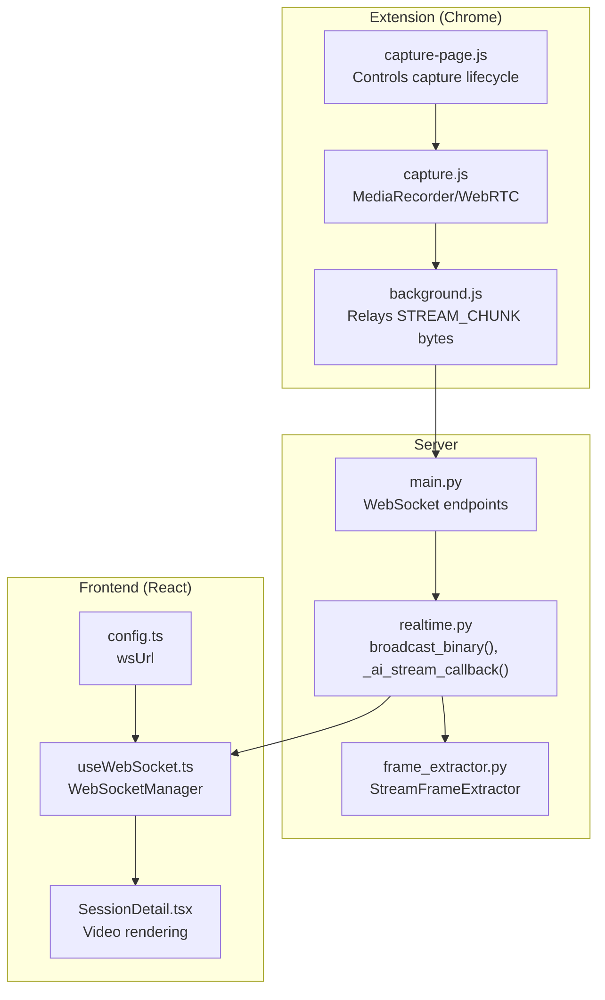
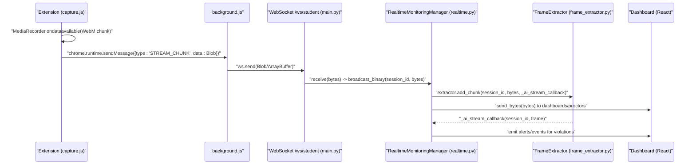
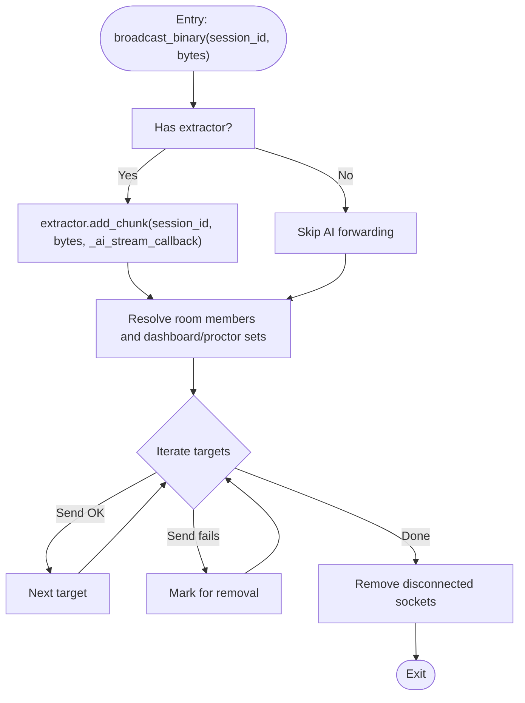
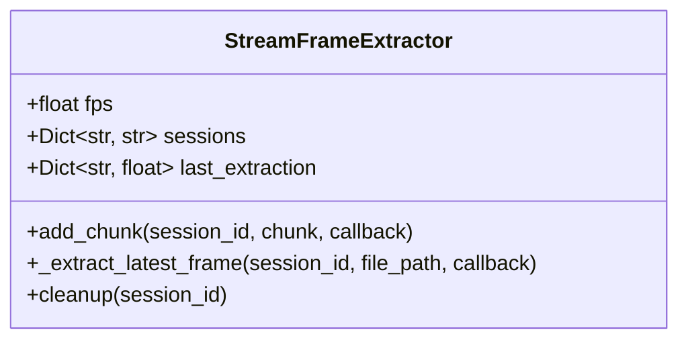
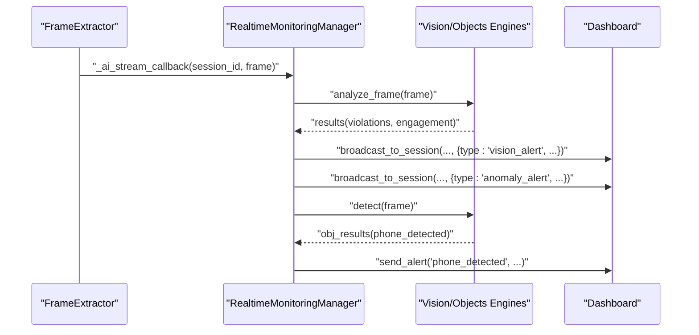
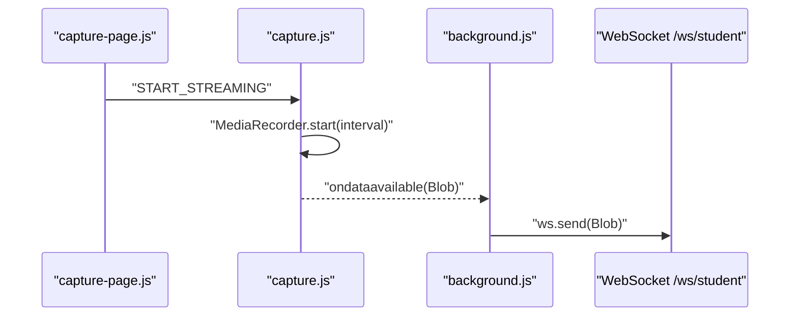
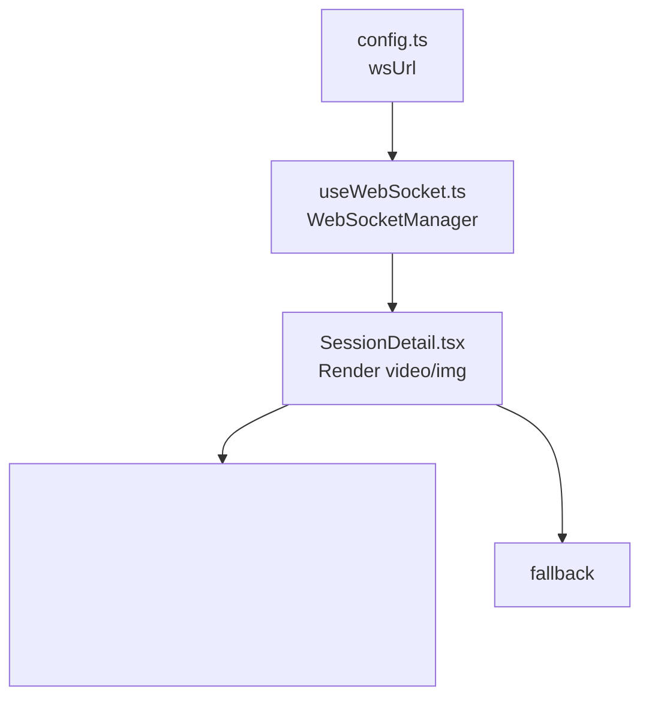
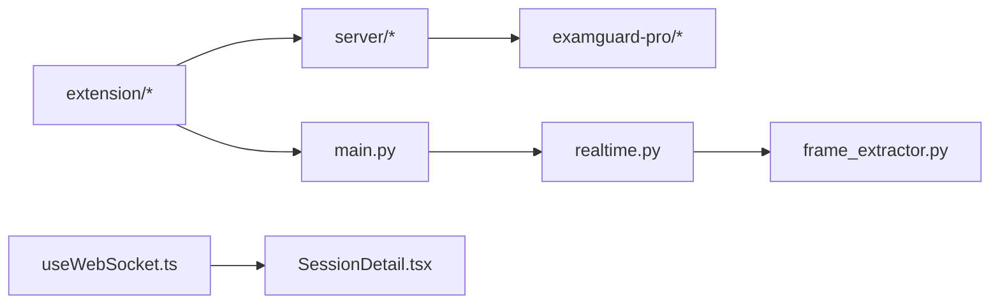

# Binary Streaming

<cite>
**Referenced Files in This Document**
- [realtime.py](file://server/services/realtime.py)
- [frame_extractor.py](file://server/services/frame_extractor.py)
- [main.py](file://server/main.py)
- [background.js](file://extension/background.js)
- [capture.js](file://extension/capture.js)
- [capture-page.js](file://extension/capture-page.js)
- [useWebSocket.ts](file://examguard-pro/src/hooks/useWebSocket.ts)
- [SessionDetail.tsx](file://examguard-pro/src/components/SessionDetail.tsx)
- [config.ts](file://examguard-pro/src/config.ts)
</cite>

## Table of Contents
1. [Introduction](#introduction)
2. [Project Structure](#project-structure)
3. [Core Components](#core-components)
4. [Architecture Overview](#architecture-overview)
5. [Detailed Component Analysis](#detailed-component-analysis)
6. [Dependency Analysis](#dependency-analysis)
7. [Performance Considerations](#performance-considerations)
8. [Troubleshooting Guide](#troubleshooting-guide)
9. [Conclusion](#conclusion)

## Introduction
This document explains the binary video streaming and frame extraction pipeline in ExamGuard Pro. It focuses on:
- The broadcast_binary() method for real-time binary video delivery to dashboards and proctors
- Integration with FrameExtractor for AI analysis of live video streams via the _ai_stream_callback() method
- Dual-path delivery: forwarding chunks to AI engines and relaying raw chunks to clients
- Session-based routing to room members and dashboard connections
- Practical examples of binary data handling, video chunk processing, and stream buffer cleanup
- Client-side video reception and integration with the Chrome extension’s video capture functionality

## Project Structure
The binary streaming spans three layers:
- Extension (Chrome): captures screen/webcam, encodes to WebM, and streams binary chunks to the backend
- Server: receives binary chunks, broadcasts to dashboards/proctors, and extracts frames for AI analysis
- Frontend (React Dashboard): subscribes to WebSocket channels and renders live feeds

**Diagram sources**
- [background.js:143-152](file://extension/background.js#L143-L152)
- [capture.js:207-238](file://extension/capture.js#L207-L238)
- [capture-page.js:151-170](file://extension/capture-page.js#L151-L170)
- [main.py:469-476](file://server/main.py#L469-L476)
- [realtime.py:310-329](file://server/services/realtime.py#L310-L329)
- [frame_extractor.py:10-115](file://server/services/frame_extractor.py#L10-L115)
- [useWebSocket.ts:1-175](file://examguard-pro/src/hooks/useWebSocket.ts#L1-L175)
- [SessionDetail.tsx:466-491](file://examguard-pro/src/components/SessionDetail.tsx#L466-L491)
- [config.ts:1-12](file://examguard-pro/src/config.ts#L1-L12)

**Section sources**
- [realtime.py:102-338](file://server/services/realtime.py#L102-L338)
- [frame_extractor.py:10-115](file://server/services/frame_extractor.py#L10-L115)
- [main.py:394-476](file://server/main.py#L394-L476)
- [background.js:143-152](file://extension/background.js#L143-L152)
- [capture.js:207-238](file://extension/capture.js#L207-L238)
- [capture-page.js:151-170](file://extension/capture-page.js#L151-L170)
- [useWebSocket.ts:1-175](file://examguard-pro/src/hooks/useWebSocket.ts#L1-L175)
- [SessionDetail.tsx:466-491](file://examguard-pro/src/components/SessionDetail.tsx#L466-L491)
- [config.ts:1-12](file://examguard-pro/src/config.ts#L1-L12)

## Core Components
- RealtimeMonitoringManager: central orchestrator for WebSocket connections, session routing, and binary broadcasting
- StreamFrameExtractor: accumulates WebM chunks and periodically extracts frames for AI analysis
- WebSocket endpoints: receive binary chunks from the extension and route events to dashboards/proctors
- Extension capture pipeline: MediaRecorder produces WebM chunks; background relays bytes to the server
- React dashboard: connects to WebSocket channels and renders live video

Key responsibilities:
- broadcast_binary(): forwards binary chunks to AI and to clients
- _ai_stream_callback(): runs AI engines on extracted frames and emits alerts
- StreamFrameExtractor.add_chunk(): appends chunks and schedules frame extraction
- Server WebSocket handlers: accept binary frames and broadcast to rooms

**Section sources**
- [realtime.py:102-338](file://server/services/realtime.py#L102-L338)
- [frame_extractor.py:31-89](file://server/services/frame_extractor.py#L31-L89)
- [main.py:469-476](file://server/main.py#L469-L476)

## Architecture Overview
The binary streaming pipeline operates as follows:
- Extension captures screen/webcam and streams WebM via MediaRecorder
- background.js relays each chunk as raw bytes to the server’s /ws/student WebSocket
- Server’s student handler invokes broadcast_binary(session_id, bytes)
- broadcast_binary() sends bytes to dashboards/proctors and forwards to FrameExtractor
- FrameExtractor writes chunks to a per-session WebM buffer and periodically extracts frames
- _ai_stream_callback() runs AI engines and emits real-time alerts to the dashboard

**Diagram sources**
- [capture.js:220-231](file://extension/capture.js#L220-L231)
- [background.js:143-152](file://extension/background.js#L143-L152)
- [main.py:469-476](file://server/main.py#L469-L476)
- [realtime.py:310-329](file://server/services/realtime.py#L310-L329)
- [frame_extractor.py:31-43](file://server/services/frame_extractor.py#L31-L43)

## Detailed Component Analysis

### broadcast_binary() Method
Responsibilities:
- Accepts a session_id and bytes
- Forwards the chunk to FrameExtractor for AI analysis
- Broadcasts raw bytes to room members and dashboard/proctor connections
- Handles disconnections and cleans up

Processing logic:
- Extract targets: room members intersected with proctor connections plus global dashboard connections
- For each target, attempt send_bytes; collect and remove disconnected sockets
- Uses RoomManager to resolve session membership

**Diagram sources**
- [realtime.py:310-329](file://server/services/realtime.py#L310-L329)

**Section sources**
- [realtime.py:310-329](file://server/services/realtime.py#L310-L329)

### AI Frame Extraction Pipeline
StreamFrameExtractor:
- Maintains a per-session WebM buffer file
- On add_chunk(): appends bytes and, if enough time has passed, spawns a background extraction
- _extract_latest_frame(): runs FFmpeg to write the latest frame as a JPEG, loads with OpenCV, and invokes callback
- cleanup(): removes buffer files when a session ends

**Diagram sources**
- [frame_extractor.py:10-115](file://server/services/frame_extractor.py#L10-L115)

**Section sources**
- [frame_extractor.py:21-105](file://server/services/frame_extractor.py#L21-L105)

### _ai_stream_callback() Method
Responsibilities:
- Receives extracted frames and session_id
- Accesses AI engines from app state and object detector
- Runs face/gaze and object detection on frames
- Emits real-time alerts to dashboards and proctors via broadcast_to_session and send_alert

Processing logic:
- Retrieve vision_engine and object_detector
- If violations detected, broadcast vision_alert and anomaly_alert
- If phone/object detected, emit critical alerts

**Diagram sources**
- [realtime.py:140-200](file://server/services/realtime.py#L140-L200)

**Section sources**
- [realtime.py:140-200](file://server/services/realtime.py#L140-L200)

### Server WebSocket Endpoints and Binary Handling
Endpoints:
- /ws/student: accepts both text and binary messages
- On binary: invokes broadcast_binary(session_id, bytes)
- On text: supports ping, event reporting, and WebRTC signaling

Routing:
- Uses RoomManager to resolve session membership
- Broadcasts to dashboards and proctors in the session

**Section sources**
- [main.py:394-476](file://server/main.py#L394-L476)

### Extension Capture and Binary Relaying
Capture pipeline:
- MediaRecorder configured for WebM/VP8 with tuned bitrate
- ondataavailable emits Blob; extension sends via chrome.runtime.sendMessage
- background.js forwards the raw bytes to the open WebSocket

**Diagram sources**
- [capture-page.js:157-161](file://extension/capture-page.js#L157-L161)
- [capture.js:220-231](file://extension/capture.js#L220-L231)
- [background.js:143-152](file://extension/background.js#L143-L152)

**Section sources**
- [capture.js:207-238](file://extension/capture.js#L207-L238)
- [capture-page.js:151-170](file://extension/capture-page.js#L151-L170)
- [background.js:143-152](file://extension/background.js#L143-L152)

### Client-Side Video Reception and Rendering
React dashboard:
- useWebSocket.ts manages a singleton WebSocketManager to /ws/dashboard
- Subscribes to rooms and filters non-JSON or heartbeat messages
- SessionDetail.tsx renders live feeds; when a MediaStream is available, it renders a <video>; otherwise it falls back to displaying images

**Diagram sources**
- [useWebSocket.ts:1-175](file://examguard-pro/src/hooks/useWebSocket.ts#L1-L175)
- [SessionDetail.tsx:466-491](file://examguard-pro/src/components/SessionDetail.tsx#L466-L491)
- [config.ts:1-12](file://examguard-pro/src/config.ts#L1-L12)

**Section sources**
- [useWebSocket.ts:1-175](file://examguard-pro/src/hooks/useWebSocket.ts#L1-L175)
- [SessionDetail.tsx:466-491](file://examguard-pro/src/components/SessionDetail.tsx#L466-L491)
- [config.ts:1-12](file://examguard-pro/src/config.ts#L1-L12)

## Dependency Analysis
- Extension depends on capture.js for MediaRecorder/WebRTC and background.js for relaying bytes
- Server depends on FastAPI WebSocket endpoints and RealtimeMonitoringManager
- RealtimeMonitoringManager depends on StreamFrameExtractor for AI analysis
- React dashboard depends on useWebSocket.ts and SessionDetail.tsx for rendering

**Diagram sources**
- [main.py:394-476](file://server/main.py#L394-L476)
- [realtime.py:102-338](file://server/services/realtime.py#L102-L338)
- [frame_extractor.py:10-115](file://server/services/frame_extractor.py#L10-L115)
- [useWebSocket.ts:1-175](file://examguard-pro/src/hooks/useWebSocket.ts#L1-L175)
- [SessionDetail.tsx:466-491](file://examguard-pro/src/components/SessionDetail.tsx#L466-L491)

**Section sources**
- [main.py:394-476](file://server/main.py#L394-L476)
- [realtime.py:102-338](file://server/services/realtime.py#L102-L338)
- [frame_extractor.py:10-115](file://server/services/frame_extractor.py#L10-L115)
- [useWebSocket.ts:1-175](file://examguard-pro/src/hooks/useWebSocket.ts#L1-L175)
- [SessionDetail.tsx:466-491](file://examguard-pro/src/components/SessionDetail.tsx#L466-L491)

## Performance Considerations
- MediaRecorder interval: tune to balance latency and bandwidth; smaller intervals increase CPU/network load
- FFmpeg extraction cadence: controlled by fps in StreamFrameExtractor; reduce frequency to minimize CPU usage
- Buffering: WebM buffer grows continuously; ensure cleanup on session end to prevent disk pressure
- WebSocket fan-out: broadcast_binary iterates targets; large rooms increase send overhead
- Client rendering: prefer <video> with autoPlay for smooth playback; fallback images reduce CPU but increase bandwidth

## Troubleshooting Guide
Common issues and resolutions:
- No video on dashboard
  - Verify /ws/student receives binary and broadcast_binary() is invoked
  - Confirm RoomManager membership and that targets are not disconnected
  - Check client-side rendering path (video vs img fallback)
- AI alerts not appearing
  - Ensure extractor.add_chunk() is called and _ai_stream_callback() executes
  - Verify FFmpeg availability and extraction logs
- Extension stops streaming
  - Check MediaRecorder state and ondataavailable events
  - Confirm background.js forwards bytes to WebSocket
- Cleanup not triggered
  - Ensure disconnect() removes extractor buffers for the session

**Section sources**
- [realtime.py:297-309](file://server/services/realtime.py#L297-L309)
- [frame_extractor.py:91-105](file://server/services/frame_extractor.py#L91-L105)
- [main.py:469-476](file://server/main.py#L469-L476)
- [background.js:143-152](file://extension/background.js#L143-L152)
- [capture.js:207-238](file://extension/capture.js#L207-L238)

## Conclusion
ExamGuard Pro’s binary streaming integrates a robust pipeline:
- Extension captures and streams WebM chunks as raw bytes
- Server routes chunks to dashboards/proctors and forwards to AI analysis
- AI engines analyze extracted frames and emit real-time alerts
- Clients render live feeds efficiently with fallbacks
- Session-based routing ensures targeted delivery and proper cleanup

This design enables scalable, low-latency monitoring with real-time AI insights.