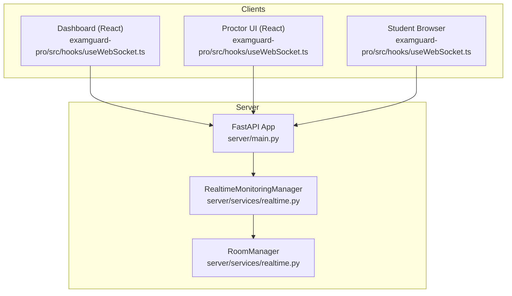
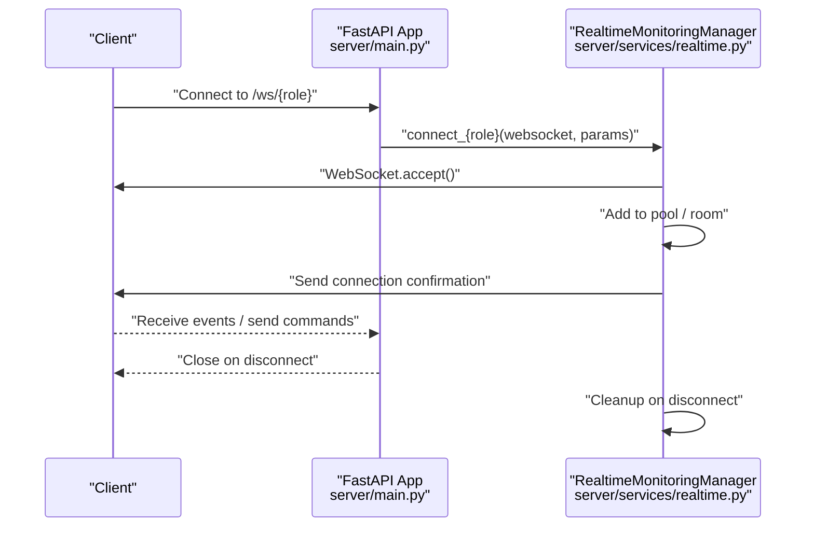
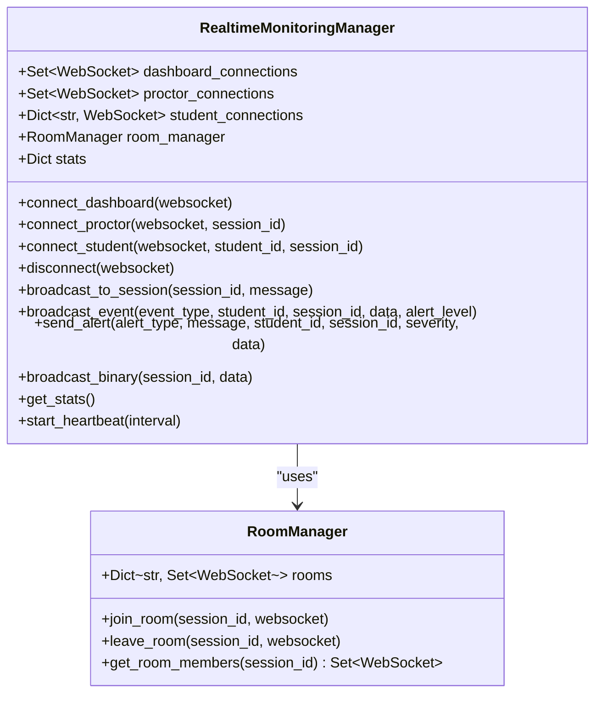
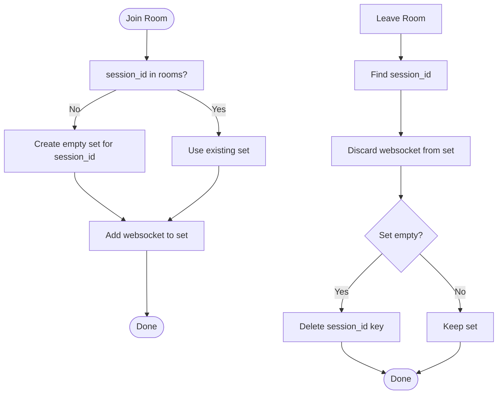
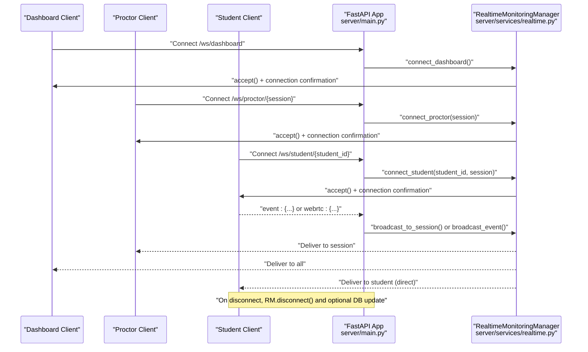
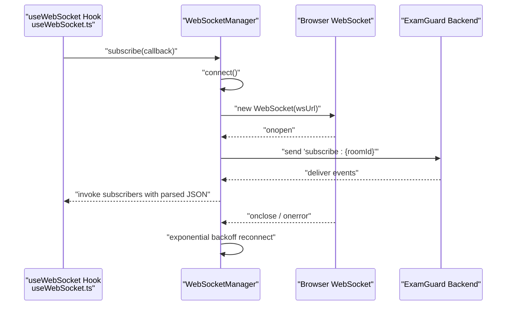
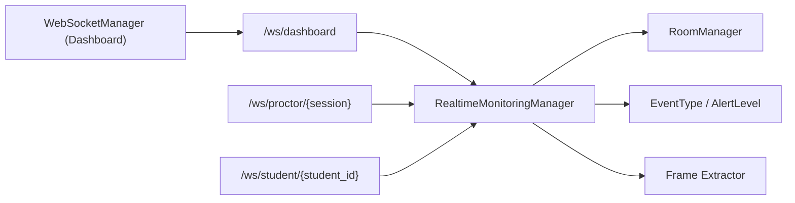

# Connection Management

<cite>
**Referenced Files in This Document**
- [main.py](file://server/main.py)
- [realtime.py](file://server/services/realtime.py)
- [useWebSocket.ts](file://examguard-pro/src/hooks/useWebSocket.ts)
- [config.ts](file://examguard-pro/src/config.ts)
</cite>

## Table of Contents
1. [Introduction](#introduction)
2. [Project Structure](#project-structure)
3. [Core Components](#core-components)
4. [Architecture Overview](#architecture-overview)
5. [Detailed Component Analysis](#detailed-component-analysis)
6. [Dependency Analysis](#dependency-analysis)
7. [Performance Considerations](#performance-considerations)
8. [Troubleshooting Guide](#troubleshooting-guide)
9. [Conclusion](#conclusion)

## Introduction
This document explains the WebSocket connection management architecture used by ExamGuard Pro. It focuses on the RealtimeMonitoringManager and RoomManager components, the connection pools for dashboards, proctors, and students, and the end-to-end flow for establishing connections to the /ws/dashboard, /ws/proctor/{session_id}, and /ws/student endpoints. It also covers connection statistics, lifecycle management, error handling, and practical client-side connection patterns.

## Project Structure
The WebSocket subsystem spans the server application and the React dashboard frontend:
- Server-side endpoints and managers are defined in server/main.py and server/services/realtime.py.
- Client-side connection management is implemented in examguard-pro/src/hooks/useWebSocket.ts with configuration in examguard-pro/src/config.ts.

**Diagram sources**
- [main.py](file://server/main.py)
- [realtime.py](file://server/services/realtime.py)
- [useWebSocket.ts](file://examguard-pro/src/hooks/useWebSocket.ts)

**Section sources**
- [main.py](file://server/main.py)
- [realtime.py](file://server/services/realtime.py)
- [useWebSocket.ts](file://examguard-pro/src/hooks/useWebSocket.ts)
- [config.ts](file://examguard-pro/src/config.ts)

## Core Components
- RealtimeMonitoringManager: Central coordinator for WebSocket connections, broadcasting, event history, and stats.
- RoomManager: Manages per-session rooms for targeted broadcasting.
- Connection pools:
  - dashboard_connections: Set of WebSocket connections for dashboard clients.
  - proctor_connections: Set of WebSocket connections for proctors.
  - student_connections: student_id → WebSocket mapping for targeted student messaging.
- Circular import handling: AI engine access is resolved via app state lookup to avoid import cycles.

Key responsibilities:
- Accept WebSocket connections with WebSocket.accept().
- Add connections to appropriate pools and rooms.
- Broadcast events to dashboards, proctors, and students.
- Track connection totals and event counts.
- Gracefully handle disconnections and cleanup.

**Section sources**
- [realtime.py](file://server/services/realtime.py)
- [main.py](file://server/main.py)

## Architecture Overview
The system uses role-based endpoints and a central manager to orchestrate connections and broadcasts.

**Diagram sources**
- [main.py](file://server/main.py)
- [realtime.py](file://server/services/realtime.py)

## Detailed Component Analysis

### RealtimeMonitoringManager
- Connection pools:
  - dashboard_connections: Set of WebSocket connections for dashboard clients.
  - proctor_connections: Set of WebSocket connections for proctors.
  - student_connections: Dict mapping student_id to WebSocket for direct messaging.
- Room management:
  - RoomManager maintains session_id → Set[WebSocket] for per-session targeting.
- Connection lifecycle:
  - connect_dashboard(): Accepts, increments total connections, sends confirmation, and history.
  - connect_proctor(): Accepts, adds to pool, joins room by session_id, sends confirmation.
  - connect_student(): Accepts, maps student_id → WebSocket, joins room by session_id, sends confirmation, and emits a joined event.
  - disconnect(): Removes from all pools and rooms, cleans up stream buffers, and logs.
- Broadcasting:
  - broadcast_to_session(): Sends to room members.
  - broadcast_event(): Sends to dashboards and session-specific proctors; tracks sent/alerts counts.
  - send_alert(): Convenience to broadcast alert events.
  - broadcast_binary(): Forwards video chunks to AI extractor and relays to dashboards and proctors.
- Statistics:
  - get_stats(): Returns counts for dashboards, proctors, students, total, events sent, alerts sent, and active rooms.
- Heartbeat:
  - start_heartbeat(): Periodically sends heartbeat messages containing stats to dashboards.

**Diagram sources**
- [realtime.py](file://server/services/realtime.py)

**Section sources**
- [realtime.py](file://server/services/realtime.py)

### RoomManager
- Maintains rooms keyed by session_id.
- Provides join_room(), leave_room(), and get_room_members() for session-scoped targeting.

**Diagram sources**
- [realtime.py](file://server/services/realtime.py)

**Section sources**
- [realtime.py](file://server/services/realtime.py)

### Server WebSocket Endpoints
- /ws/dashboard:
  - Accepts connection via RealtimeMonitoringManager.connect_dashboard().
  - Handles ping, stats, subscribe to session, command routing, and WebRTC signaling.
  - Graceful disconnect via RealtimeMonitoringManager.disconnect().
- /ws/proctor/{session_id}:
  - Accepts connection via RealtimeMonitoringManager.connect_proctor().
  - Handles ping, alert forwarding, and command forwarding to students in the session.
  - Graceful disconnect via RealtimeMonitoringManager.disconnect().
- /ws/student and /ws/student/{student_id}:
  - Accepts connection via RealtimeMonitoringManager.connect_student().
  - Handles ping, event reporting, and WebRTC signaling.
  - On disconnect:
    - Broadcasts a student-left event.
    - Attempts to mark session as inactive in the database.

**Diagram sources**
- [main.py](file://server/main.py)
- [realtime.py](file://server/services/realtime.py)

**Section sources**
- [main.py](file://server/main.py)
- [realtime.py](file://server/services/realtime.py)

### Client-Side Connection Patterns
- Configuration:
  - wsUrl is derived from the current protocol and host, enabling ws/wss and localhost/dev setups.
- WebSocketManager:
  - Singleton managing a single WebSocket connection.
  - Connects automatically on first subscription; handles reconnection with exponential backoff.
  - Subscribes to rooms by sending "subscribe:{roomId}" after connect.
  - Ignores internal message types (connection, heartbeat, pong, subscribed) when dispatching to subscribers.
  - Tracks connection status and exposes subscribeStatus().

**Diagram sources**
- [useWebSocket.ts](file://examguard-pro/src/hooks/useWebSocket.ts)
- [config.ts](file://examguard-pro/src/config.ts)

**Section sources**
- [useWebSocket.ts](file://examguard-pro/src/hooks/useWebSocket.ts)
- [config.ts](file://examguard-pro/src/config.ts)

## Dependency Analysis
- RealtimeMonitoringManager depends on:
  - RoomManager for session scoping.
  - Frame extractor for AI analysis callbacks.
  - Enumerations EventType and AlertLevel for event typing and severity.
- Endpoints depend on RealtimeMonitoringManager for connection and broadcasting.
- Client-side uses a singleton WebSocketManager to abstract connection lifecycle and reconnection.

**Diagram sources**
- [realtime.py](file://server/services/realtime.py)
- [main.py](file://server/main.py)
- [useWebSocket.ts](file://examguard-pro/src/hooks/useWebSocket.ts)

**Section sources**
- [realtime.py](file://server/services/realtime.py)
- [main.py](file://server/main.py)
- [useWebSocket.ts](file://examguard-pro/src/hooks/useWebSocket.ts)

## Performance Considerations
- Broadcasting efficiency:
  - Uses sets for O(1) membership checks and iteration.
  - Binary video chunks are forwarded to AI extractor and relayed to dashboards and proctors in a single pass.
- Heartbeat:
  - Periodic heartbeats reduce stale connections and provide stats visibility.
- Memory footprint:
  - Event history capped by max_history to bound memory growth.
- Client reconnection:
  - Exponential backoff prevents thundering herd on server restarts.

[No sources needed since this section provides general guidance]

## Troubleshooting Guide
Common issues and remedies:
- Connection not accepted:
  - Ensure WebSocket.accept() is reached and application state remains CONNECTED before entering the receive loop.
- Frequent disconnects:
  - Verify client reconnection logic and server heartbeat settings.
- Missing events in a session:
  - Confirm the client sent "subscribe:{session_id}" and the session_id matches the room key.
- Video stream not received:
  - Check that broadcast_binary() is invoked with the correct session_id and that the room contains the intended recipients.
- Cleanup on disconnect:
  - The manager removes the connection from all pools and rooms; verify logs for disconnection messages.

**Section sources**
- [main.py](file://server/main.py)
- [realtime.py](file://server/services/realtime.py)
- [useWebSocket.ts](file://examguard-pro/src/hooks/useWebSocket.ts)

## Conclusion
ExamGuard Pro’s WebSocket subsystem centers on a robust RealtimeMonitoringManager with role-based connection pools and session-scoped rooms. The server endpoints cleanly delegate connection and broadcasting to the manager, while the React dashboard encapsulates connection lifecycle and reconnection in a reusable WebSocketManager. Together, these components provide scalable, observable, and resilient real-time communication for dashboards, proctors, and students.