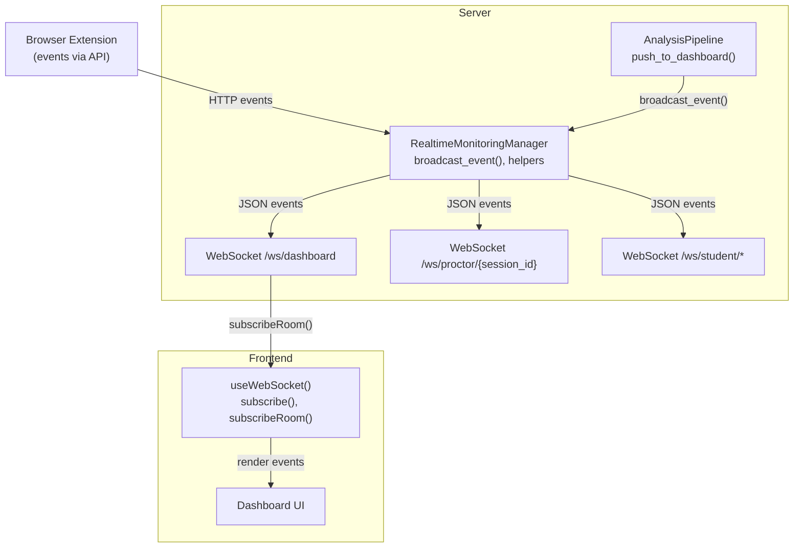
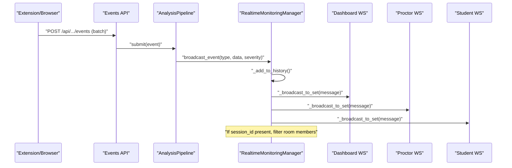
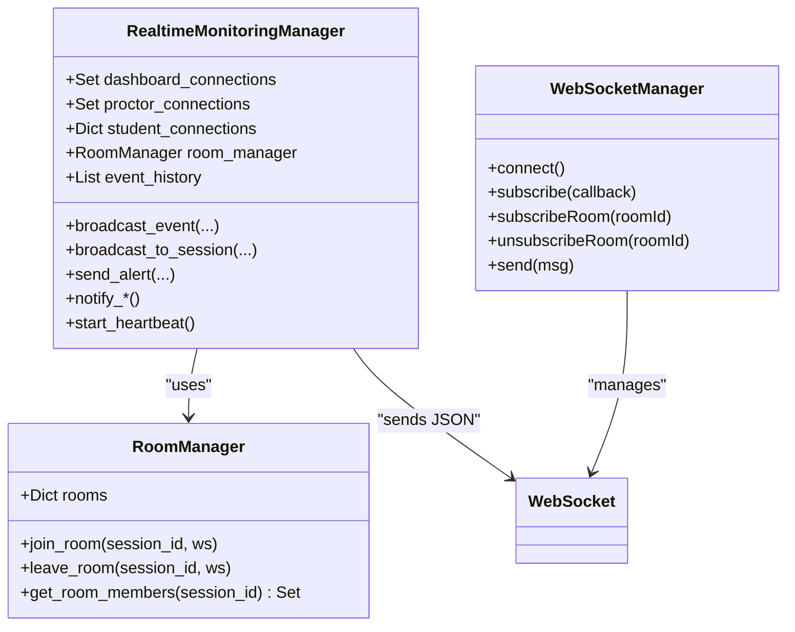

# Event Broadcasting

<cite>
**Referenced Files in This Document**
- [realtime.py](file://server/services/realtime.py)
- [main.py](file://server/main.py)
- [useWebSocket.ts](file://examguard-pro/src/hooks/useWebSocket.ts)
- [events.py](file://server/api/endpoints/events.py)
- [events_log.py](file://server/routers/events_log.py)
- [pipeline.py](file://server/services/pipeline.py)
- [config.py](file://server/config.py)
</cite>

## Table of Contents
1. [Introduction](#introduction)
2. [Project Structure](#project-structure)
3. [Core Components](#core-components)
4. [Architecture Overview](#architecture-overview)
5. [Detailed Component Analysis](#detailed-component-analysis)
6. [Dependency Analysis](#dependency-analysis)
7. [Performance Considerations](#performance-considerations)
8. [Troubleshooting Guide](#troubleshooting-guide)
9. [Conclusion](#conclusion)

## Introduction
This document explains the real-time event broadcasting mechanism in ExamGuard Pro. It covers the RealtimeEvent data structure, the EventType and AlertLevel enumerations, the broadcast_event() method, convenience methods for common events, event serialization, late-joiner delivery, and the internal helper for efficient distribution. It also describes event-driven communication patterns and subscriber filtering logic across the server’s WebSocket infrastructure and the React dashboard client.

## Project Structure
The event broadcasting system spans three layers:
- Server-side WebSocket management and event dispatch
- Frontend React WebSocket client integration
- Event ingestion and scoring pipelines that trigger broadcasts

**Diagram sources**
- [realtime.py:102-642](file://server/services/realtime.py#L102-L642)
- [main.py:275-504](file://server/main.py#L275-L504)
- [useWebSocket.ts:1-175](file://examguard-pro/src/hooks/useWebSocket.ts#L1-L175)
- [pipeline.py:306-336](file://server/services/pipeline.py#L306-L336)

**Section sources**
- [realtime.py:102-642](file://server/services/realtime.py#L102-L642)
- [main.py:275-504](file://server/main.py#L275-L504)
- [useWebSocket.ts:1-175](file://examguard-pro/src/hooks/useWebSocket.ts#L1-L175)
- [pipeline.py:306-336](file://server/services/pipeline.py#L306-L336)

## Core Components
- RealtimeEvent: The canonical event shape sent over WebSocket and stored in history.
- EventType: Enumeration of event categories (session, monitoring, suspicious activity, advanced detection, analysis, system, heartbeat).
- AlertLevel: Severity levels for alerts.
- RealtimeMonitoringManager: Central broadcaster managing connection pools, rooms, history, and dispatch.
- Convenience methods: notify_face_missing(), notify_suspicious_activity(), notify_plagiarism(), notify_risk_update(), and others.
- Frontend useWebSocket(): React hook that connects to the dashboard WebSocket, subscribes to rooms, and filters out heartbeat/connection noise.

**Section sources**
- [realtime.py:16-65](file://server/services/realtime.py#L16-L65)
- [realtime.py:68-78](file://server/services/realtime.py#L68-L78)
- [realtime.py:102-642](file://server/services/realtime.py#L102-L642)
- [useWebSocket.ts:43-54](file://examguard-pro/src/hooks/useWebSocket.ts#L43-L54)

## Architecture Overview
The server exposes multiple WebSocket endpoints:
- /ws/dashboard: Global dashboard receives all events and can subscribe to specific sessions.
- /ws/proctor/{session_id}: Proctors receive only session-scoped events.
- /ws/student: Students receive targeted messages and broadcast signals.

The RealtimeMonitoringManager maintains:
- Connection pools: dashboard_connections, proctor_connections, student_connections
- Room membership via RoomManager keyed by session_id
- Event history for late-joiners
- Stats counters for monitoring

**Diagram sources**
- [events.py:310-326](file://server/api/endpoints/events.py#L310-L326)
- [pipeline.py:306-336](file://server/services/pipeline.py#L306-L336)
- [realtime.py:334-377](file://server/services/realtime.py#L334-L377)

**Section sources**
- [main.py:275-504](file://server/main.py#L275-L504)
- [realtime.py:115-137](file://server/services/realtime.py#L115-L137)
- [realtime.py:334-377](file://server/services/realtime.py#L334-L377)

## Detailed Component Analysis

### RealtimeEvent Data Structure
RealtimeEvent carries:
- event_type: String discriminator for the event category
- student_id: Optional identifier for per-student events
- session_id: Optional identifier for per-session events
- data: Arbitrary JSON payload
- alert_level: Severity level (info, warning, critical, emergency)
- timestamp: ISO timestamp string

Serialization uses asdict() and json.dumps() to produce a JSON message suitable for WebSocket transport.

Practical implications:
- Always include session_id for session-scoped events to enable room filtering.
- Use alert_level to drive UI urgency and downstream actions.

**Section sources**
- [realtime.py:68-78](file://server/services/realtime.py#L68-L78)

### EventType Enumeration
Categories include:
- Session events: session_started, session_ended, student_joined, student_left
- Monitoring events: face_detected, face_missing, multiple_faces
- Suspicious activity: tab_switch, copy_paste, screenshot_attempt, window_blur
- Advanced detection (Layer 1–4): gaze_aversion, mouth_movement, behavior_violation, question_leak, network_change, device_mismatch
- Analysis events: plagiarism_detected, anomaly_detected, low_engagement, unusual_behavior, object_detected
- System events: risk_score_update, alert_triggered, report_generated
- Heartbeat: heartbeat

These values are used as event_type strings and can be passed directly or via the enum.

**Section sources**
- [realtime.py:24-65](file://server/services/realtime.py#L24-L65)

### AlertLevel Enumeration
Severity levels:
- info
- warning
- critical
- emergency

Used to categorize alert traffic and influence UI treatment and logging.

**Section sources**
- [realtime.py:16-22](file://server/services/realtime.py#L16-L22)

### broadcast_event() Method
Responsibilities:
- Normalize enum inputs to strings
- Construct RealtimeEvent with timestamp
- Append to event_history (bounded)
- Serialize to JSON
- Broadcast to:
  - All dashboard connections
  - Proctors in the session room (when session_id provided)
- Update stats and log critical alerts

Subscriber filtering:
- Room-aware via RoomManager.get_room_members(session_id)
- Intersection with proctor_connections ensures only proctors in the room receive session-specific messages

Late-joiner delivery:
- New dashboard connections receive recent history via _send_history()

Efficiency:
- _broadcast_to_set() iterates a set of WebSockets, handles send failures, and cleans disconnected sockets.

**Section sources**
- [realtime.py:334-377](file://server/services/realtime.py#L334-L377)
- [realtime.py:620-631](file://server/services/realtime.py#L620-L631)
- [realtime.py:589-602](file://server/services/realtime.py#L589-L602)

### Convenience Methods for Common Events
- notify_face_missing(student_id, session_id, duration_seconds)
  - Severity escalates with duration
- notify_suspicious_activity(student_id, session_id, activity_type, details)
- notify_plagiarism(student_id, session_id, similarity_score, matched_source)
  - Severity escalates with similarity
- notify_behavior_violation(student_id, session_id, violation_type, details)
- notify_network_change(student_id, session_id, old_ip, new_ip)
- notify_question_leak(student_id, session_id, url)
- notify_risk_update(student_id, session_id, risk_score, risk_level, factors)
  - Severity derived from risk_level

Each method calls broadcast_event() with appropriate event_type and alert_level.

**Section sources**
- [realtime.py:422-533](file://server/services/realtime.py#L422-L533)

### Event Serialization and Message Preparation
- RealtimeEvent.to_json() produces a JSON string from a dataclass representation.
- broadcast_event() deserializes to a Python dict via json.loads() to prepare the message for broadcast.
- _broadcast_to_set() sends JSON via WebSocket.send_json().

Example flow:
- Create RealtimeEvent
- Convert to JSON string
- Parse to dict
- Send to dashboard set
- Send to proctor set filtered by room membership

**Section sources**
- [realtime.py:77-78](file://server/services/realtime.py#L77-L78)
- [realtime.py:360-361](file://server/services/realtime.py#L360-L361)
- [realtime.py:589-596](file://server/services/realtime.py#L589-L596)

### Late-Joiner Notification Delivery
- On dashboard connect, the server sends a recent slice of event_history to the new connection.
- The limit defaults to a small number to bound initial payload size.

**Section sources**
- [realtime.py:227-228](file://server/services/realtime.py#L227-L228)
- [realtime.py:626-631](file://server/services/realtime.py#L626-L631)

### _broadcast_to_set() Helper
Behavior:
- Iterates over a set of WebSockets
- Attempts send_json() to each
- Catches exceptions and removes disconnected sockets from the set
- Prevents future attempts to send to dead connections

**Section sources**
- [realtime.py:589-602](file://server/services/realtime.py#L589-L602)

### Frontend Subscription and Filtering
- useWebSocket() manages a singleton WebSocket connection to the dashboard endpoint.
- Subscribes to rooms via “subscribe:{roomId}” messages.
- Filters out heartbeat/connection/pong/subscribed messages to reduce noise.
- Maintains reconnection logic with exponential backoff.

**Section sources**
- [useWebSocket.ts:17-74](file://examguard-pro/src/hooks/useWebSocket.ts#L17-L74)
- [useWebSocket.ts:43-54](file://examguard-pro/src/hooks/useWebSocket.ts#L43-L54)
- [useWebSocket.ts:93-99](file://examguard-pro/src/hooks/useWebSocket.ts#L93-L99)

### Event-Driven Communication Patterns
- From extension to server:
  - HTTP endpoints accept events and optionally enqueue them for real-time analysis.
  - AnalysisPipeline pushes results back to dashboards via broadcast_event().
- From server to clients:
  - RealtimeMonitoringManager broadcasts to dashboards and session-specific proctors.
  - Students receive targeted messages and session-wide signals.

**Section sources**
- [events.py:310-326](file://server/api/endpoints/events.py#L310-L326)
- [pipeline.py:306-336](file://server/services/pipeline.py#L306-L336)
- [main.py:275-504](file://server/main.py#L275-L504)

### Subscriber Filtering Logic
- Room membership:
  - RoomManager stores session_id -> Set[WebSocket].
  - For session-scoped events, only WebSockets in the room receive the message.
- Role-based filtering:
  - Dashboard connections receive global events.
  - Proctor connections receive session-scoped events only when the proctor is in the room.
- Client-side filtering:
  - useWebSocket ignores heartbeat/connection/pong/subscribed messages.

**Section sources**
- [realtime.py:81-100](file://server/services/realtime.py#L81-L100)
- [realtime.py:366-370](file://server/services/realtime.py#L366-L370)
- [useWebSocket.ts:47-49](file://examguard-pro/src/hooks/useWebSocket.ts#L47-L49)

## Dependency Analysis
Key relationships:
- RealtimeMonitoringManager depends on:
  - RoomManager for session scoping
  - WebSocket sets for routing
  - AnalysisPipeline for transforming pipeline outputs into broadcast events
- Frontend useWebSocket() depends on:
  - WebSocketManager for connection lifecycle and room subscription
  - Dashboard UI for rendering

**Diagram sources**
- [realtime.py:81-100](file://server/services/realtime.py#L81-L100)
- [realtime.py:102-642](file://server/services/realtime.py#L102-L642)
- [useWebSocket.ts:5-126](file://examguard-pro/src/hooks/useWebSocket.ts#L5-L126)

**Section sources**
- [realtime.py:102-642](file://server/services/realtime.py#L102-L642)
- [useWebSocket.ts:5-126](file://examguard-pro/src/hooks/useWebSocket.ts#L5-L126)

## Performance Considerations
- Bounded event history: The manager caps history length to limit memory usage and initial payload sizes for late-joiners.
- Efficient broadcast: Using sets for connection pools avoids duplicates and reduces iteration overhead.
- Room filtering: Intersection with proctor connections minimizes unnecessary sends.
- Binary streaming: Dedicated broadcast_binary() path supports video chunks without JSON overhead.
- Reconnection backoff: Frontend retries with exponential backoff reduce server churn.

[No sources needed since this section provides general guidance]

## Troubleshooting Guide
Common issues and remedies:
- No events received on dashboard:
  - Ensure the client subscribes to the correct room using “subscribe:{roomId}”.
  - Confirm the server is broadcasting to dashboard connections and the room membership is correct.
- Proctor does not see session events:
  - Verify the proctor joined the correct session and is in the room.
  - Check that session_id is provided when calling broadcast_event().
- Frequent reconnections:
  - Review frontend reconnection logic and backoff limits.
  - Inspect server-side disconnect handling and cleanup.
- Excessive memory usage:
  - Adjust max_history and monitor event volume.
- Duplicate or missed events:
  - Validate that _broadcast_to_set() is invoked for all intended recipients and that exceptions are handled.

**Section sources**
- [useWebSocket.ts:93-99](file://examguard-pro/src/hooks/useWebSocket.ts#L93-L99)
- [realtime.py:589-602](file://server/services/realtime.py#L589-L602)
- [realtime.py:620-624](file://server/services/realtime.py#L620-L624)

## Conclusion
ExamGuard Pro’s real-time event broadcasting centers on a robust WebSocket manager that scopes events by session, routes messages efficiently, and preserves recent history for late-joiners. The system integrates seamlessly with the React dashboard via a concise subscription model and provides convenience methods to streamline common alerting scenarios. Together with the analysis pipeline, it enables a responsive, event-driven monitoring environment.