# WebSocket Communication

<cite>
**Referenced Files in This Document**
- [main.py](file://server/main.py)
- [realtime.py](file://server/services/realtime.py)
- [useWebSocket.ts](file://examguard-pro/src/hooks/useWebSocket.ts)
- [config.ts](file://examguard-pro/src/config.ts)
</cite>

## Table of Contents
1. [Introduction](#introduction)
2. [Project Structure](#project-structure)
3. [Core Components](#core-components)
4. [Architecture Overview](#architecture-overview)
5. [Detailed Component Analysis](#detailed-component-analysis)
6. [Dependency Analysis](#dependency-analysis)
7. [Performance Considerations](#performance-considerations)
8. [Troubleshooting Guide](#troubleshooting-guide)
9. [Conclusion](#conclusion)

## Introduction
This document explains the WebSocket communication patterns used by ExamGuard Pro for real-time monitoring. It focuses on the RealtimeMonitoringManager architecture, connection pooling for dashboards, proctors, and students, room-based session management, event broadcasting, message serialization, connection lifecycle, heartbeat monitoring, and binary video streaming. It also covers client-side integration patterns and security considerations.

## Project Structure
The WebSocket stack spans the backend FastAPI server and the React frontend:
- Backend: WebSocket endpoints and the RealtimeMonitoringManager service manage connections, rooms, and event broadcasting.
- Frontend: A singleton WebSocketManager encapsulates connection lifecycle, reconnection, room subscription, and message routing.

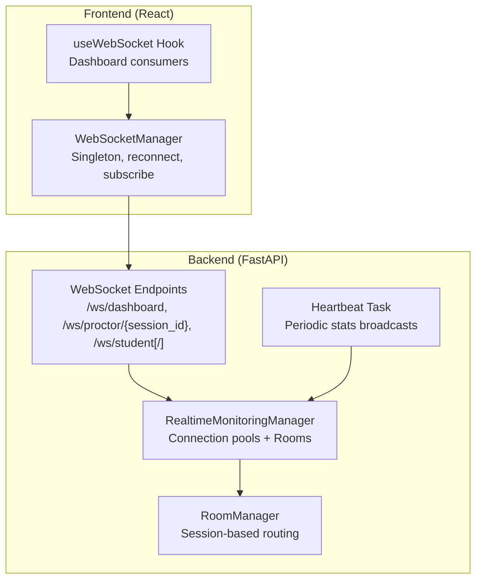

**Diagram sources**
- [main.py:275-503](file://server/main.py#L275-L503)
- [realtime.py:102-643](file://server/services/realtime.py#L102-L643)
- [useWebSocket.ts:1-175](file://examguard-pro/src/hooks/useWebSocket.ts#L1-L175)

**Section sources**
- [main.py:275-503](file://server/main.py#L275-L503)
- [realtime.py:102-643](file://server/services/realtime.py#L102-L643)
- [useWebSocket.ts:1-175](file://examguard-pro/src/hooks/useWebSocket.ts#L1-L175)

## Core Components
- RealtimeMonitoringManager: Central orchestrator for connection pools, room management, event broadcasting, alerting, heartbeat, and binary forwarding.
- RoomManager: Maintains per-session sets of WebSocket connections for targeted broadcasting.
- WebSocket Endpoints: Three primary endpoints:
  - /ws/dashboard: Global dashboard updates, room subscriptions, stats, and commands.
  - /ws/proctor/{session_id}: Proctor monitoring a specific session.
  - /ws/student and /ws/student/{student_id}: Student-side event reporting and binary video streaming.
- Client-side WebSocketManager: Singleton managing connection, reconnection, room subscriptions, and message delivery.

Key responsibilities:
- Connection pooling: Separate sets for dashboards, proctors, and a map for students keyed by student_id.
- Room-based routing: Join/leave rooms by session_id; broadcast to room members plus dashboards/proctors.
- Event model: RealtimeEvent carries structured data with JSON serialization.
- Binary streaming: Video chunks forwarded to dashboards and proctors; AI analysis callback invoked per chunk.
- Heartbeat: Periodic stats broadcasts to dashboards.

**Section sources**
- [realtime.py:102-643](file://server/services/realtime.py#L102-L643)
- [main.py:275-503](file://server/main.py#L275-L503)

## Architecture Overview
The backend exposes three WebSocket endpoints. Each endpoint delegates to RealtimeMonitoringManager for connection acceptance and subsequent message handling. The manager maintains connection pools and rooms, serializes events to JSON, and forwards binary video frames to dashboards and proctors.

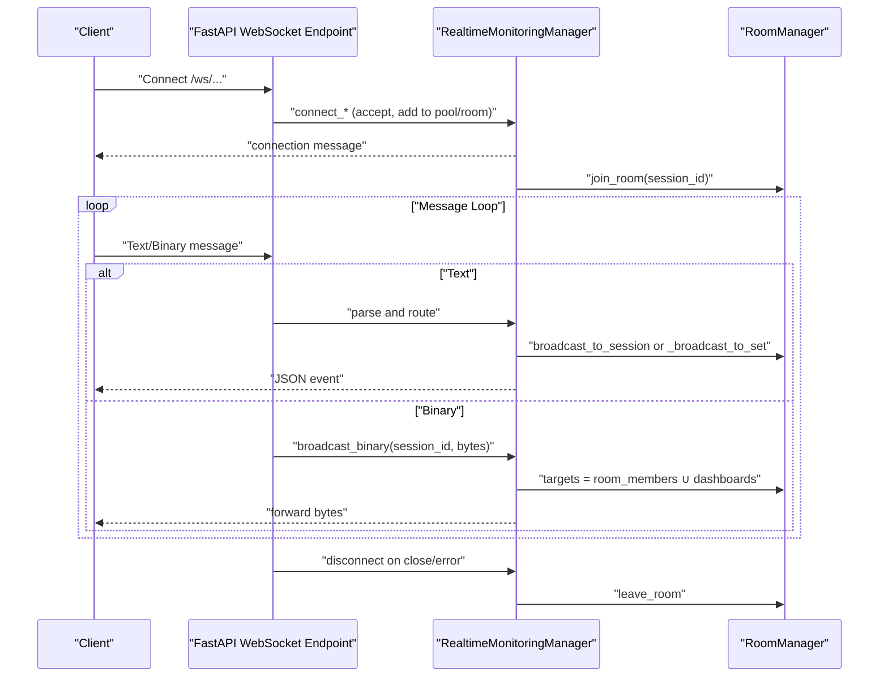

**Diagram sources**
- [main.py:275-503](file://server/main.py#L275-L503)
- [realtime.py:213-329](file://server/services/realtime.py#L213-L329)
- [realtime.py:412-417](file://server/services/realtime.py#L412-L417)
- [realtime.py:603-619](file://server/services/realtime.py#L603-L619)

## Detailed Component Analysis

### RealtimeMonitoringManager
Responsibilities:
- Connection pools: dashboard_connections, proctor_connections, student_connections.
- Room management: join_room/leave_room/get_room_members.
- Event broadcasting: broadcast_event, send_alert, broadcast_to_session.
- Binary forwarding: broadcast_binary for video chunks.
- Heartbeat: start_heartbeat/_send_heartbeat.
- History: maintain recent events for late joiners.

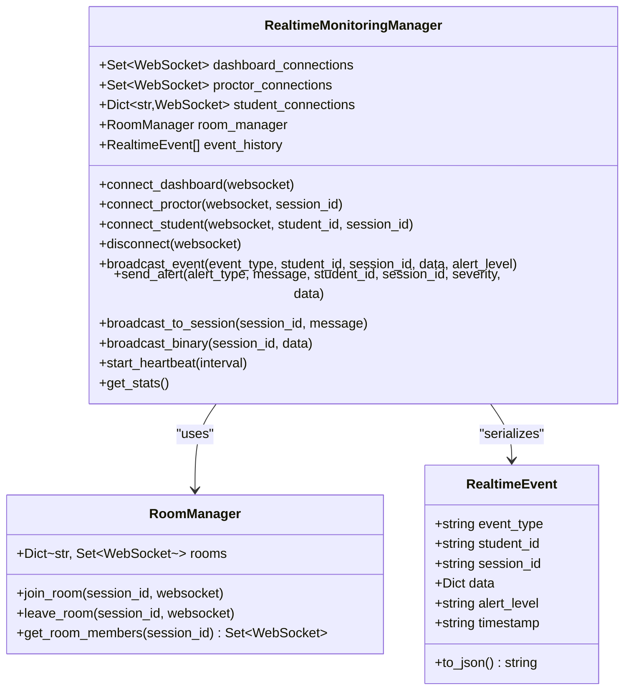

**Diagram sources**
- [realtime.py:102-643](file://server/services/realtime.py#L102-L643)

**Section sources**
- [realtime.py:102-643](file://server/services/realtime.py#L102-L643)

### WebSocket Endpoints and Handshake Procedures
- /ws/dashboard
  - Accepts connection and sends a connection confirmation.
  - Supports ping/pong, stats retrieval, room subscription, and command routing.
  - Subscriptions are managed via RoomManager; commands are routed to session members.
- /ws/proctor/{session_id}
  - Accepts connection and joins the proctor to the specified session room.
  - Supports ping/pong and session-scoped commands/alerts.
- /ws/student and /ws/student/{student_id}
  - Accepts connection and registers the student by student_id in the session room.
  - Handles text events (e.g., tab switches, copy/paste) mapped to EventType values.
  - Handles binary messages for live video streaming; forwards to dashboards/proctors and triggers AI analysis.

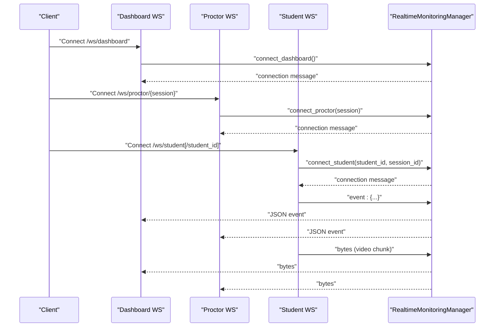

**Diagram sources**
- [main.py:275-503](file://server/main.py#L275-L503)
- [realtime.py:213-329](file://server/services/realtime.py#L213-L329)

**Section sources**
- [main.py:275-503](file://server/main.py#L275-L503)

### Room-Based Session Management
- Each session_id maps to a set of WebSocket connections.
- Dashboards are global; proctors and students are scoped to rooms.
- Room membership determines who receives session-specific messages and binary streams.

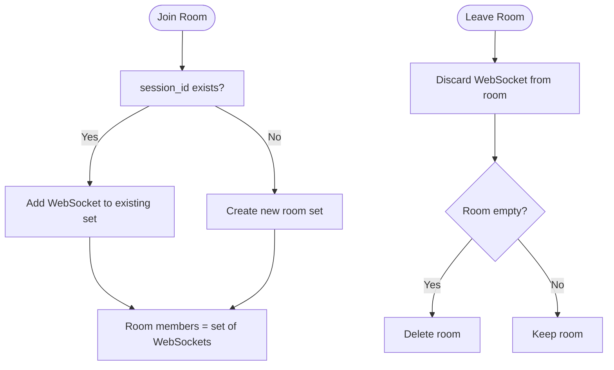

**Diagram sources**
- [realtime.py:81-100](file://server/services/realtime.py#L81-L100)

**Section sources**
- [realtime.py:81-100](file://server/services/realtime.py#L81-L100)

### Event Broadcasting Mechanisms
- RealtimeEvent encapsulates event_type, student_id, session_id, data, alert_level, and timestamp.
- broadcast_event serializes to JSON and sends to dashboards and session-specific recipients.
- send_alert is a convenience wrapper around broadcast_event for alert-type messages.
- broadcast_to_session targets room members; _broadcast_to_set handles connection sets with cleanup on failures.

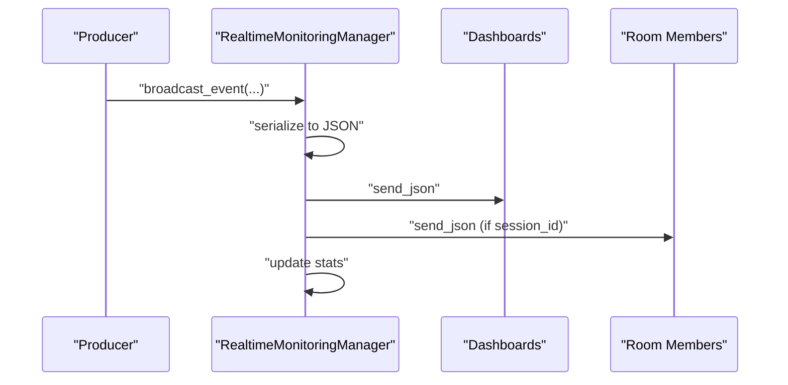

**Diagram sources**
- [realtime.py:334-417](file://server/services/realtime.py#L334-L417)

**Section sources**
- [realtime.py:67-79](file://server/services/realtime.py#L67-L79)
- [realtime.py:334-417](file://server/services/realtime.py#L334-L417)

### Message Serialization and Data Structures
- RealtimeEvent.to_json produces a JSON string suitable for WebSocket transport.
- Client-side expects JSON messages with fields like type/event_type, student_id/session_id, and data.
- Binary messages are sent as bytes for video streaming.

**Section sources**
- [realtime.py:67-79](file://server/services/realtime.py#L67-L79)
- [realtime.py:603-619](file://server/services/realtime.py#L603-L619)

### Connection Lifecycle Management
- Acceptance: Each endpoint calls the corresponding connect_* method on RealtimeMonitoringManager.
- Loop handling: Endpoints process text and binary messages; ping/pong supported.
- Graceful disconnection: disconnect removes the socket from all pools and rooms; cleanup is performed.

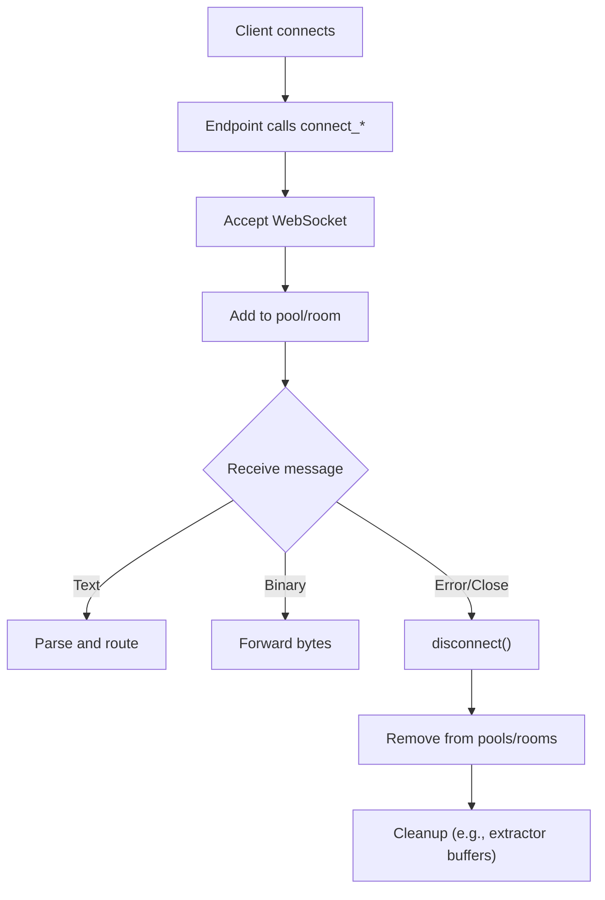

**Diagram sources**
- [main.py:275-503](file://server/main.py#L275-L503)
- [realtime.py:275-309](file://server/services/realtime.py#L275-L309)

**Section sources**
- [main.py:275-503](file://server/main.py#L275-L503)
- [realtime.py:275-309](file://server/services/realtime.py#L275-L309)

### Heartbeat Mechanism
- A background task periodically sends heartbeat messages containing connection stats to dashboards.
- Interval is configurable and started during application lifespan initialization.

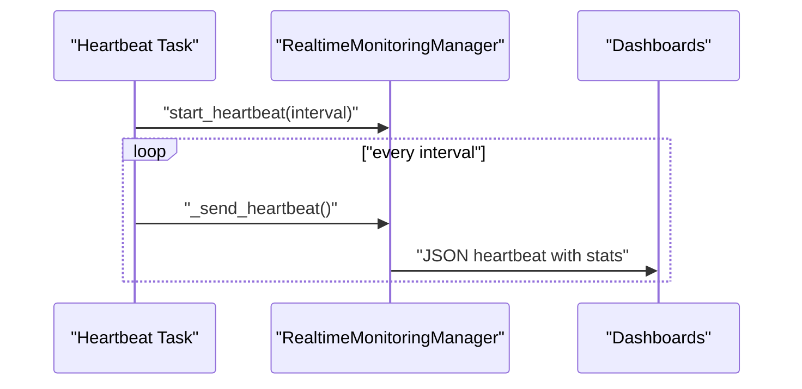

**Diagram sources**
- [main.py:134-137](file://server/main.py#L134-L137)
- [realtime.py:539-560](file://server/services/realtime.py#L539-L560)

**Section sources**
- [main.py:134-137](file://server/main.py#L134-L137)
- [realtime.py:539-560](file://server/services/realtime.py#L539-L560)

### Binary Data Streaming for Video Feeds
- Student endpoint receives binary chunks and forwards them to dashboards and proctors in the same session.
- A frame extractor callback is triggered per chunk to run AI analysis asynchronously.

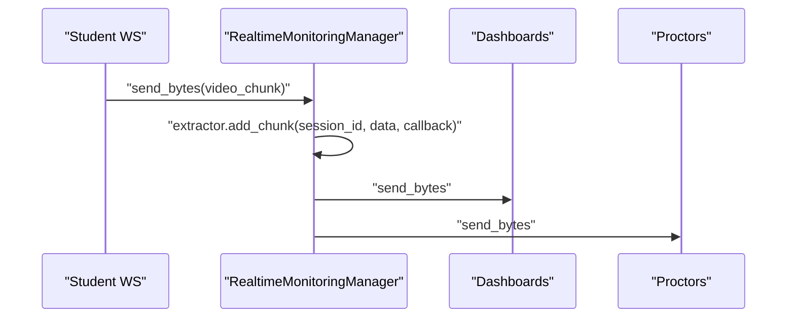

**Diagram sources**
- [main.py:468-472](file://server/main.py#L468-L472)
- [realtime.py:310-329](file://server/services/realtime.py#L310-L329)

**Section sources**
- [main.py:468-472](file://server/main.py#L468-L472)
- [realtime.py:310-329](file://server/services/realtime.py#L310-L329)

### Client-Side WebSocket Integration Patterns
- WebSocketManager encapsulates:
  - Singleton creation and connection lifecycle.
  - Reconnection with exponential backoff.
  - Room subscription via "subscribe:{roomId}".
  - Message parsing and filtering of non-JSON or ignorable types.
  - Status callbacks for connection state.
- useWebSocket hook integrates with React components, manages message history, and exposes connection controls.

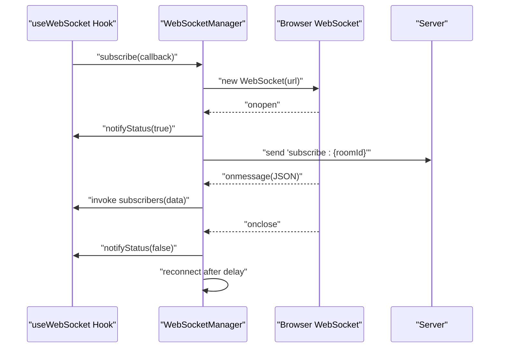

**Diagram sources**
- [useWebSocket.ts:1-175](file://examguard-pro/src/hooks/useWebSocket.ts#L1-L175)
- [config.ts:1-12](file://examguard-pro/src/config.ts#L1-L12)

**Section sources**
- [useWebSocket.ts:1-175](file://examguard-pro/src/hooks/useWebSocket.ts#L1-L175)
- [config.ts:1-12](file://examguard-pro/src/config.ts#L1-L12)

## Dependency Analysis
- Backend dependencies:
  - FastAPI WebSocket endpoints depend on RealtimeMonitoringManager.
  - RealtimeMonitoringManager depends on RoomManager and optional AI services for frame extraction.
- Frontend dependencies:
  - useWebSocket relies on config.wsUrl and WebSocketManager.
  - WebSocketManager holds a singleton WebSocket instance and manages reconnection and subscriptions.

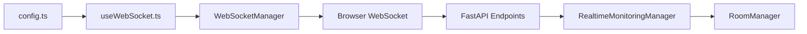

**Diagram sources**
- [config.ts:1-12](file://examguard-pro/src/config.ts#L1-L12)
- [useWebSocket.ts:1-175](file://examguard-pro/src/hooks/useWebSocket.ts#L1-L175)
- [main.py:275-503](file://server/main.py#L275-L503)
- [realtime.py:102-643](file://server/services/realtime.py#L102-L643)

**Section sources**
- [config.ts:1-12](file://examguard-pro/src/config.ts#L1-L12)
- [useWebSocket.ts:1-175](file://examguard-pro/src/hooks/useWebSocket.ts#L1-L175)
- [main.py:275-503](file://server/main.py#L275-L503)
- [realtime.py:102-643](file://server/services/realtime.py#L102-L643)

## Performance Considerations
- Connection pooling minimizes overhead by grouping recipients by role and room membership.
- Binary forwarding avoids unnecessary copies by iterating over connection sets and sending bytes directly.
- Heartbeat intervals should balance responsiveness with network overhead.
- Event history size is bounded to control memory usage for late-joiners.
- AI analysis runs asynchronously via callbacks to prevent blocking the WebSocket loop.

[No sources needed since this section provides general guidance]

## Troubleshooting Guide
Common issues and remedies:
- Connection not accepted:
  - Verify the endpoint path and that connect_* is invoked.
  - Check for early state checks and ensure the WebSocket is CONNECTED before entering the loop.
- Messages not received:
  - Confirm room subscriptions ("subscribe:{session_id}") are sent upon connect.
  - Ensure message types are not filtered out (e.g., heartbeat/connection/pong).
- Binary stream not appearing:
  - Ensure session_id is present and correct; only room members plus dashboards/proctors receive video.
  - Verify the sender is emitting bytes and not text.
- Frequent disconnects:
  - Review reconnection logic in WebSocketManager; adjust retry delays and caps.
  - Inspect server-side disconnect handling and cleanup routines.
- Heartbeat missing:
  - Confirm heartbeat task is started during lifespan initialization and interval is appropriate.

**Section sources**
- [main.py:286-294](file://server/main.py#L286-L294)
- [main.py:364-369](file://server/main.py#L364-L369)
- [main.py:420-428](file://server/main.py#L420-L428)
- [useWebSocket.ts:21-74](file://examguard-pro/src/hooks/useWebSocket.ts#L21-L74)
- [realtime.py:539-560](file://server/services/realtime.py#L539-L560)

## Conclusion
ExamGuard Pro’s WebSocket infrastructure centers on RealtimeMonitoringManager, which provides robust connection pooling, room-based routing, event serialization, and binary forwarding. The backend endpoints expose clear roles for dashboards, proctors, and students, while the frontend WebSocketManager offers resilient connectivity and subscription semantics. Together, these components enable scalable, real-time monitoring with heartbeat-driven health visibility and efficient video streaming.