# Analysis Pipeline Processing

<cite>
**Referenced Files in This Document**
- [pipeline.py](file://server/services/pipeline.py)
- [queue.py](file://server/tasks/queue.py)
- [worker.py](file://server/tasks/worker.py)
- [engine.py](file://server/scoring/engine.py)
- [calculator.py](file://server/scoring/calculator.py)
- [transformer_analysis.py](file://server/services/transformer_analysis.py)
- [anomaly.py](file://server/services/anomaly.py)
- [website_classification.py](file://server/services/website_classification.py)
- [face_detection.py](file://server/services/face_detection.py)
- [ocr.py](file://server/services/ocr.py)
- [realtime.py](file://server/services/realtime.py)
- [config.py](file://server/config.py)
- [analysis.py](file://server/models/analysis.py)
- [event.py](file://server/models/event.py)
- [session.py](file://server/models/session.py)
</cite>

## Table of Contents
1. [Introduction](#introduction)
2. [Project Structure](#project-structure)
3. [Core Components](#core-components)
4. [Architecture Overview](#architecture-overview)
5. [Detailed Component Analysis](#detailed-component-analysis)
6. [Dependency Analysis](#dependency-analysis)
7. [Performance Considerations](#performance-considerations)
8. [Troubleshooting Guide](#troubleshooting-guide)
9. [Conclusion](#conclusion)
10. [Appendices](#appendices)

## Introduction
This document explains the AI/ML analysis pipeline powering ExamGuard Pro. It covers the event-driven architecture, queue-based processing, real-time scoring, and database integration. It documents specialized analysis modules (text similarity, URL categorization, vision-based anomaly detection, and transformer-based content analysis), risk scoring algorithms, thresholds, and decision-making for alert generation. It also describes batch processing strategies, real-time updates, and monitoring.

## Project Structure
The analysis pipeline spans several modules:
- Real-time event ingestion and routing via an asynchronous pipeline
- Background task processing via Celery workers
- Scoring engine computing engagement, relevance, effort, and risk
- Specialized AI/ML services for vision, OCR, URL classification, and transformer-based analysis
- Real-time broadcasting to dashboards and clients
- Data models and configuration for risk thresholds and categories

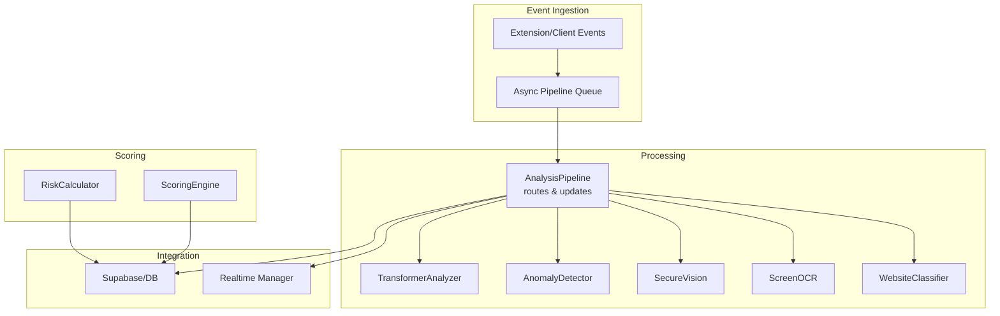

**Diagram sources**
- [pipeline.py:9-345](file://server/services/pipeline.py#L9-L345)
- [queue.py:11-75](file://server/tasks/queue.py#L11-L75)
- [worker.py:9-31](file://server/tasks/worker.py#L9-L31)
- [engine.py:373-445](file://server/scoring/engine.py#L373-L445)
- [calculator.py:161-207](file://server/scoring/calculator.py#L161-L207)
- [transformer_analysis.py:178-549](file://server/services/transformer_analysis.py#L178-L549)
- [anomaly.py:11-221](file://server/services/anomaly.py#L11-L221)
- [face_detection.py:27-126](file://server/services/face_detection.py#L27-L126)
- [ocr.py:20-121](file://server/services/ocr.py#L20-L121)
- [website_classification.py:50-100](file://server/services/website_classification.py#L50-L100)
- [realtime.py:102-643](file://server/services/realtime.py#L102-L643)
- [config.py:58-205](file://server/config.py#L58-L205)

**Section sources**
- [pipeline.py:9-345](file://server/services/pipeline.py#L9-L345)
- [engine.py:373-445](file://server/scoring/engine.py#L373-L445)
- [calculator.py:161-207](file://server/scoring/calculator.py#L161-L207)
- [realtime.py:102-643](file://server/services/realtime.py#L102-L643)

## Core Components
- AnalysisPipeline: Asynchronous event router and processor that enqueues events, routes to handlers, persists analysis results, and updates session risk.
- ScoringEngine: Pure calculation engine that recomputes engagement, relevance, effort, and risk from stored events and analyses.
- RiskCalculator: Computes risk breakdown and thresholds from event counts.
- TransformerAnalyzer: Loads and runs transformer-based models for URL classification, behavioral anomaly, and screen content classification.
- AnomalyDetector: Rule-based behavioral anomaly detection.
- SecureVision: Face detection and presence checks.
- ScreenOCR: OCR and forbidden keyword detection.
- WebsiteClassifier: Rule-based URL categorization.
- Realtime Manager: WebSocket broadcasting for dashboards and proctors.
- Configuration: Risk weights, thresholds, and URL category lists.

**Section sources**
- [pipeline.py:9-345](file://server/services/pipeline.py#L9-L345)
- [engine.py:373-445](file://server/scoring/engine.py#L373-L445)
- [calculator.py:161-207](file://server/scoring/calculator.py#L161-L207)
- [transformer_analysis.py:178-549](file://server/services/transformer_analysis.py#L178-L549)
- [anomaly.py:11-221](file://server/services/anomaly.py#L11-L221)
- [face_detection.py:27-126](file://server/services/face_detection.py#L27-L126)
- [ocr.py:20-121](file://server/services/ocr.py#L20-L121)
- [website_classification.py:50-100](file://server/services/website_classification.py#L50-L100)
- [realtime.py:102-643](file://server/services/realtime.py#L102-L643)
- [config.py:58-205](file://server/config.py#L58-L205)

## Architecture Overview
The pipeline is event-driven and queue-based:
- Events arrive asynchronously and are queued.
- A background worker dequeues and processes events by type.
- Specialized analyzers produce results and risk contributions.
- Results are persisted and session risk is recalculated and broadcast.

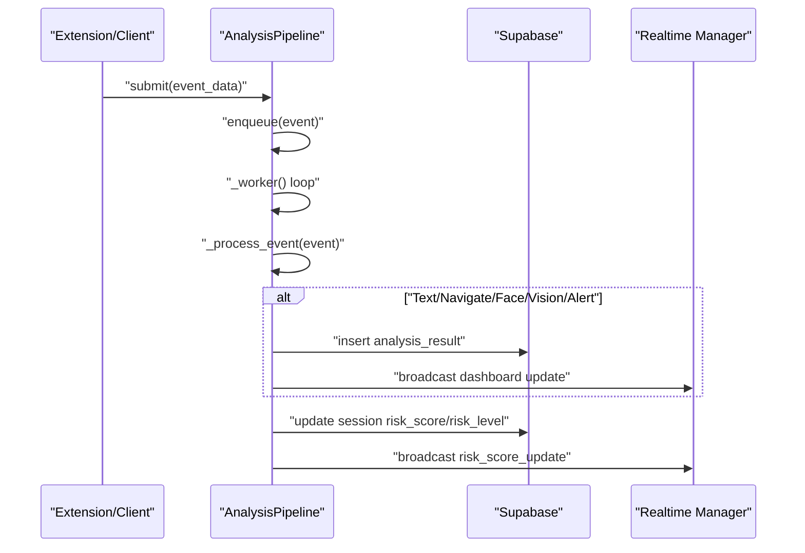

**Diagram sources**
- [pipeline.py:25-96](file://server/services/pipeline.py#L25-L96)
- [pipeline.py:278-336](file://server/services/pipeline.py#L278-L336)
- [realtime.py:334-403](file://server/services/realtime.py#L334-L403)

## Detailed Component Analysis

### AnalysisPipeline
Responsibilities:
- Start/stop background worker
- Enqueue events and process with timeouts
- Route to specialized handlers by event type
- Persist analysis results and update session risk
- Broadcast real-time updates

Key routing:
- Text events: transformer screen content classification (when available)
- Navigation events: URL categorization and forbidden keyword checks
- Vision events: phone and face absence penalties and alerts
- Transformer alerts: plagiarism-like similarity adjustments
- Risk update: recalculation and level assignment

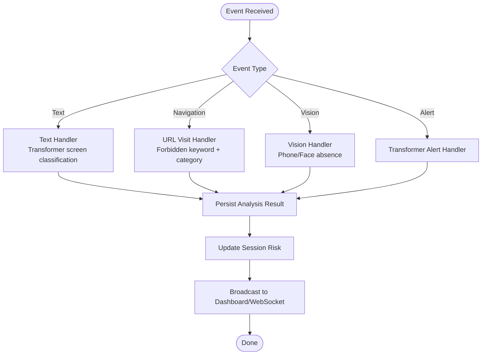

**Diagram sources**
- [pipeline.py:74-336](file://server/services/pipeline.py#L74-L336)

**Section sources**
- [pipeline.py:25-345](file://server/services/pipeline.py#L25-L345)

### Transformer-Based Content Analysis
Capabilities:
- URL classification
- Behavioral anomaly detection from event sequences
- Screen content classification

Initialization and availability:
- Dynamically loads models and tokenizers from the transformer module
- Falls back to rule-based classification if models are unavailable

Classification outputs:
- Categories and risk scores mapped per class
- Confidence and method used

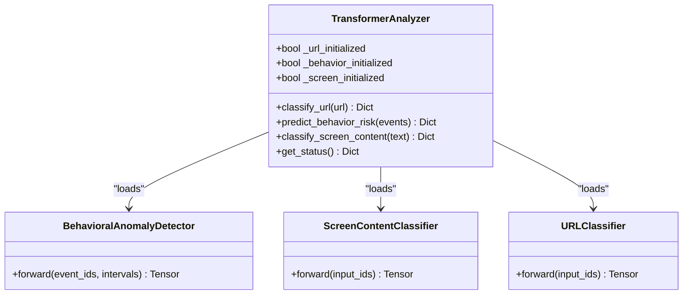

**Diagram sources**
- [transformer_analysis.py:178-549](file://server/services/transformer_analysis.py#L178-L549)

**Section sources**
- [transformer_analysis.py:178-549](file://server/services/transformer_analysis.py#L178-L549)

### URL Categorization and Navigation Handling
- Rule-based categorization using domain and keyword lists
- Forbidden keyword detection for URLs
- Risk impact assignment and session updates

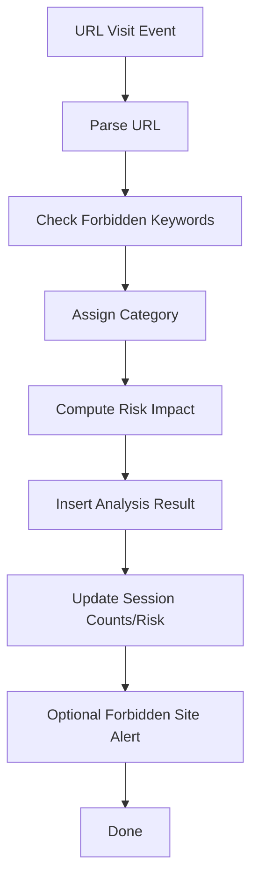

**Diagram sources**
- [pipeline.py:149-220](file://server/services/pipeline.py#L149-L220)
- [config.py:84-163](file://server/config.py#L84-L163)

**Section sources**
- [pipeline.py:149-220](file://server/services/pipeline.py#L149-L220)
- [config.py:84-163](file://server/config.py#L84-L163)

### Vision-Based Anomaly Detection
- Face detection using MediaPipe Tasks or Haar cascades
- Presence/absence violations and penalties
- Phone/object detection via object detectors
- Immediate alerts and session updates

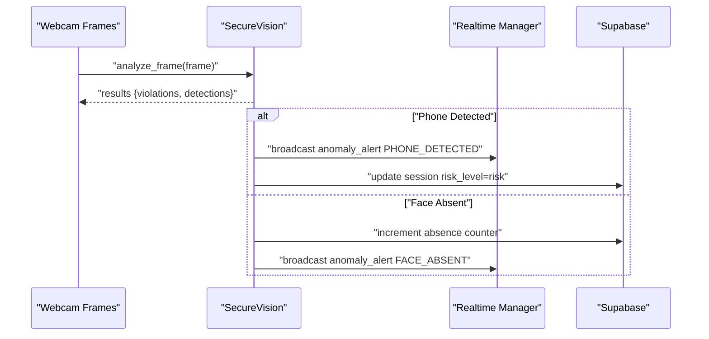

**Diagram sources**
- [face_detection.py:64-126](file://server/services/face_detection.py#L64-L126)
- [pipeline.py:246-277](file://server/services/pipeline.py#L246-L277)
- [realtime.py:412-417](file://server/services/realtime.py#L412-L417)

**Section sources**
- [face_detection.py:27-126](file://server/services/face_detection.py#L27-L126)
- [pipeline.py:246-277](file://server/services/pipeline.py#L246-L277)

### OCR and Forbidden Keyword Detection
- Extracts text from screenshots and detects forbidden keywords
- Computes risk contribution based on keyword matches
- Provides fallback when OCR is unavailable

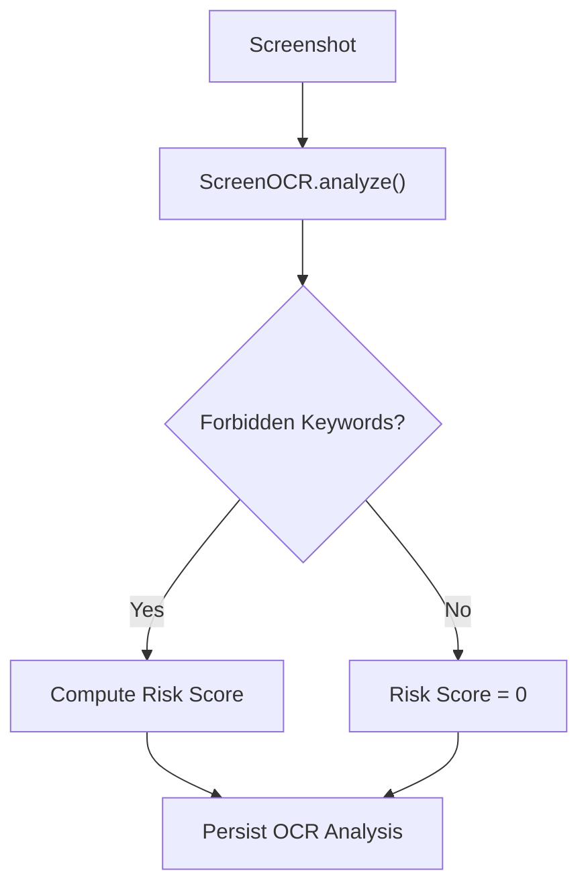

**Diagram sources**
- [ocr.py:29-84](file://server/services/ocr.py#L29-L84)
- [pipeline.py:149-220](file://server/services/pipeline.py#L149-L220)

**Section sources**
- [ocr.py:20-121](file://server/services/ocr.py#L20-L121)
- [pipeline.py:149-220](file://server/services/pipeline.py#L149-L220)

### Real-Time Broadcasting and Alerts
- WebSocket rooms per session
- Broadcasts risk updates, anomalies, and analysis results
- Severity levels guide alerting

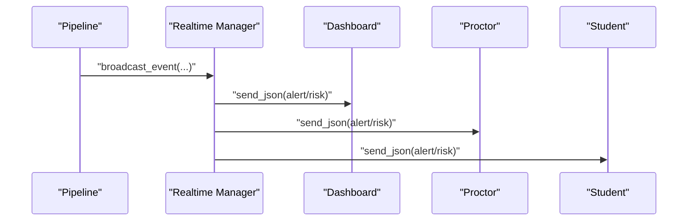

**Diagram sources**
- [pipeline.py:306-336](file://server/services/pipeline.py#L306-L336)
- [realtime.py:334-403](file://server/services/realtime.py#L334-L403)

**Section sources**
- [realtime.py:102-643](file://server/services/realtime.py#L102-L643)
- [pipeline.py:306-336](file://server/services/pipeline.py#L306-L336)

### Risk Scoring Algorithms and Decision-Making
- Engagement: penalizes tab switches, window blurs, distraction time, flagged tabs; rewards face presence
- Relevance: penalizes forbidden site visits and OCR forbidden keywords; considers exam time ratio
- Effort: productivity ratio, bonus for time spent, blending with extension estimates; copy/paste penalties
- Risk: weighted combination of vision impact, OCR-derived content relevance, anomaly score, browsing risk; additive bonuses for forbidden categories; level thresholds

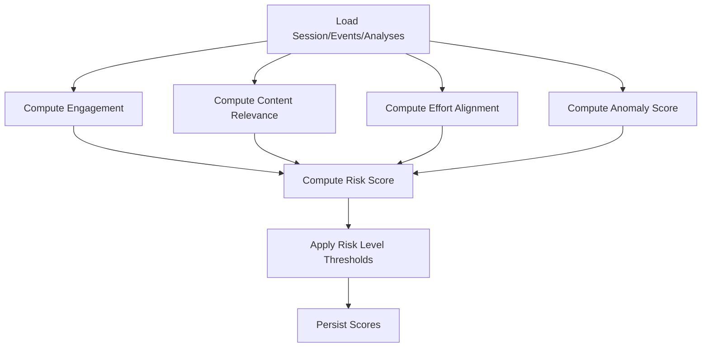

**Diagram sources**
- [engine.py:382-445](file://server/scoring/engine.py#L382-L445)

**Section sources**
- [engine.py:27-445](file://server/scoring/engine.py#L27-L445)
- [calculator.py:161-207](file://server/scoring/calculator.py#L161-L207)
- [config.py:191-197](file://server/config.py#L191-L197)

### Batch Processing and Real-Time Updates
- Pipeline processes events in batches via queue and updates risk after each event
- ScoringEngine recomputes all metrics periodically or on-demand
- Real-time updates are pushed immediately upon risk changes or alerts

**Section sources**
- [pipeline.py:55-96](file://server/services/pipeline.py#L55-L96)
- [engine.py:382-445](file://server/scoring/engine.py#L382-L445)
- [realtime.py:334-403](file://server/services/realtime.py#L334-L403)

## Dependency Analysis
Inter-module dependencies:
- AnalysisPipeline depends on Supabase for persistence and Realtime Manager for broadcasting
- ScoringEngine and RiskCalculator depend on models and configuration
- TransformerAnalyzer depends on external transformer module and checkpoints
- Vision and OCR services depend on external libraries (MediaPipe, OpenCV, Tesseract)
- Realtime Manager coordinates WebSocket connections and event routing

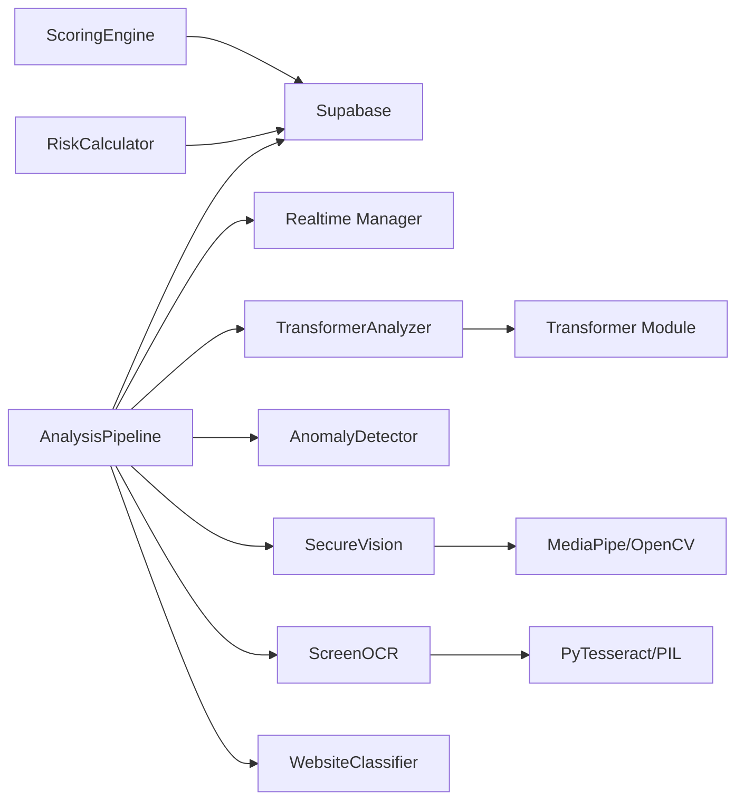

**Diagram sources**
- [pipeline.py:9-345](file://server/services/pipeline.py#L9-L345)
- [engine.py:373-445](file://server/scoring/engine.py#L373-L445)
- [calculator.py:161-207](file://server/scoring/calculator.py#L161-L207)
- [transformer_analysis.py:26-48](file://server/services/transformer_analysis.py#L26-L48)
- [face_detection.py:11-26](file://server/services/face_detection.py#L11-L26)
- [ocr.py:11-17](file://server/services/ocr.py#L11-L17)
- [realtime.py:102-643](file://server/services/realtime.py#L102-L643)

**Section sources**
- [pipeline.py:9-345](file://server/services/pipeline.py#L9-L345)
- [engine.py:373-445](file://server/scoring/engine.py#L373-L445)
- [calculator.py:161-207](file://server/scoring/calculator.py#L161-L207)
- [transformer_analysis.py:26-48](file://server/services/transformer_analysis.py#L26-L48)
- [face_detection.py:11-26](file://server/services/face_detection.py#L11-L26)
- [ocr.py:11-17](file://server/services/ocr.py#L11-L17)
- [realtime.py:102-643](file://server/services/realtime.py#L102-L643)

## Performance Considerations
- Asynchronous processing: Pipeline uses asyncio queues and non-blocking I/O to handle bursts
- External model availability: TransformerAnalyzer gracefully falls back when models are unavailable
- Resource constraints: Vision and OCR services may degrade gracefully if libraries are missing
- Database writes: Minimize write frequency by batching updates and leveraging real-time broadcasts
- WebSocket scalability: Room-based broadcasting reduces unnecessary fan-out

[No sources needed since this section provides general guidance]

## Troubleshooting Guide
Common issues and remedies:
- Missing OCR/Tesseract: OCR falls back to a warning and zero risk contribution
- Missing MediaPipe/Haar: Vision backend falls back to minimal/no detection
- Transformer models not found: URL classification falls back to rule-based
- WebSocket errors: Pipeline logs and continues; check connectivity and room membership
- Risk update failures: Pipeline logs and continues; verify Supabase connectivity

**Section sources**
- [ocr.py:75-84](file://server/services/ocr.py#L75-L84)
- [face_detection.py:11-26](file://server/services/face_detection.py#L11-L26)
- [transformer_analysis.py:321-326](file://server/services/transformer_analysis.py#L321-L326)
- [pipeline.py:306-336](file://server/services/pipeline.py#L306-L336)

## Conclusion
ExamGuard Pro’s analysis pipeline combines event-driven orchestration, specialized AI/ML modules, and real-time scoring to continuously monitor and assess session risk. The system balances accuracy with resilience by falling back to rule-based or lightweight modes when advanced models are unavailable. Real-time updates keep stakeholders informed, while robust scoring algorithms provide transparent risk assessments.

[No sources needed since this section summarizes without analyzing specific files]

## Appendices

### Data Models Overview
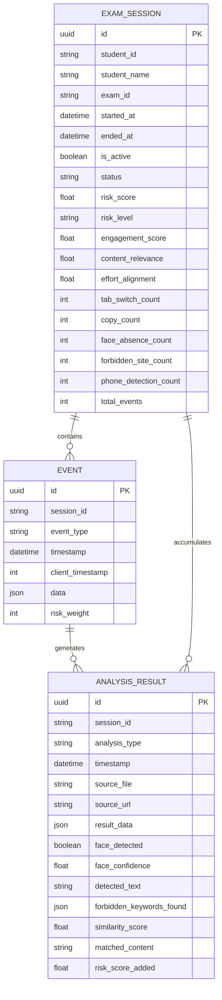

**Diagram sources**
- [event.py:6-30](file://server/models/event.py#L6-L30)
- [analysis.py:6-49](file://server/models/analysis.py#L6-L49)
- [session.py:15-63](file://server/models/session.py#L15-L63)

### Example Workflows

#### Text Analysis Workflow
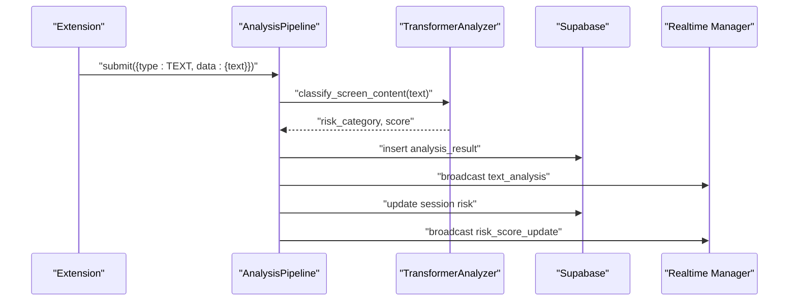

**Diagram sources**
- [pipeline.py:97-148](file://server/services/pipeline.py#L97-L148)
- [transformer_analysis.py:474-524](file://server/services/transformer_analysis.py#L474-L524)

#### Navigation and Forbidden Site Workflow
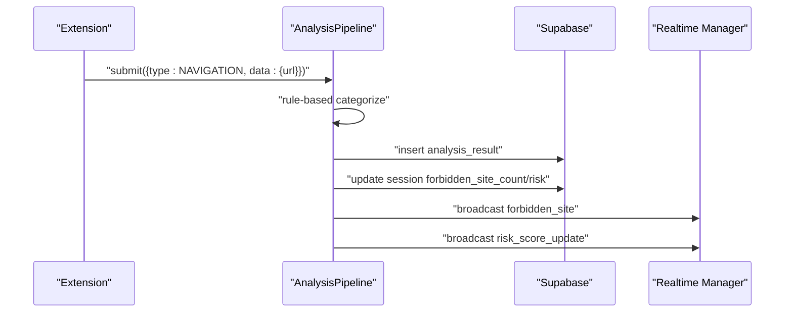

**Diagram sources**
- [pipeline.py:149-220](file://server/services/pipeline.py#L149-L220)

#### Vision Anomaly Workflow
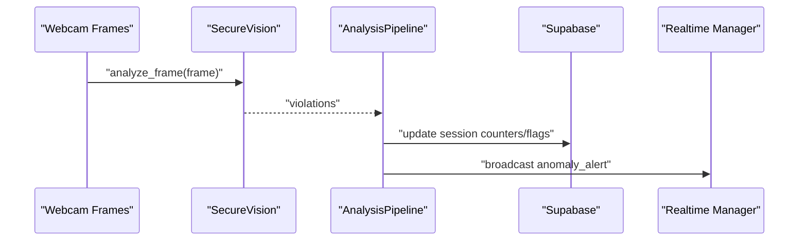

**Diagram sources**
- [face_detection.py:64-126](file://server/services/face_detection.py#L64-L126)
- [pipeline.py:246-277](file://server/services/pipeline.py#L246-L277)
- [realtime.py:412-417](file://server/services/realtime.py#L412-L417)

### Analysis Result Structures
- Text Analysis: includes similarity and transformer classification outputs
- URL Visit: includes category, domain, forbidden keyword matches
- Vision: includes violations and integrity impact
- OCR: includes detected text, forbidden keywords, and computed risk

**Section sources**
- [pipeline.py:123-144](file://server/services/pipeline.py#L123-L144)
- [pipeline.py:189-202](file://server/services/pipeline.py#L189-L202)
- [pipeline.py:246-277](file://server/services/pipeline.py#L246-L277)
- [ocr.py:57-73](file://server/services/ocr.py#L57-L73)