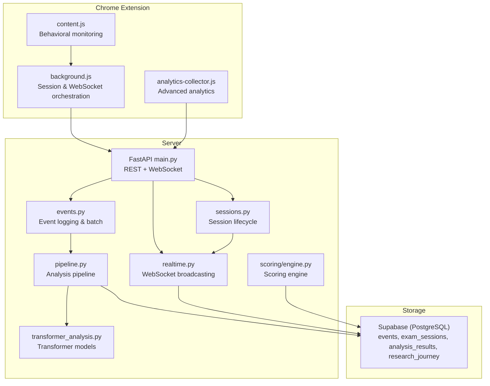
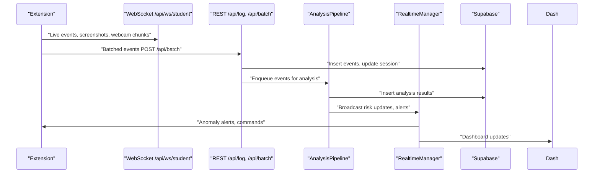
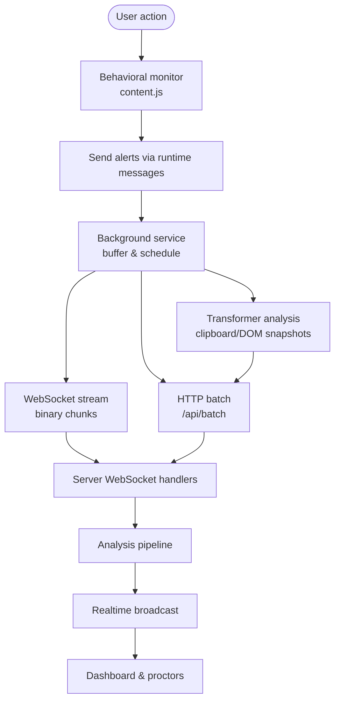
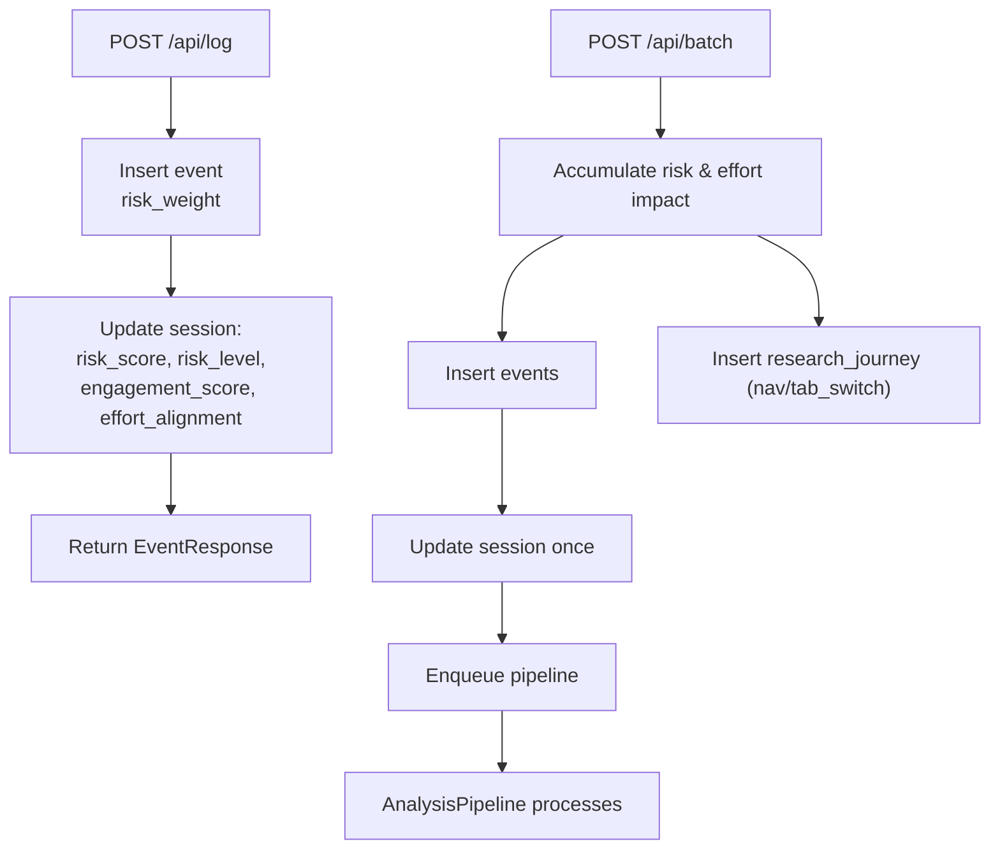
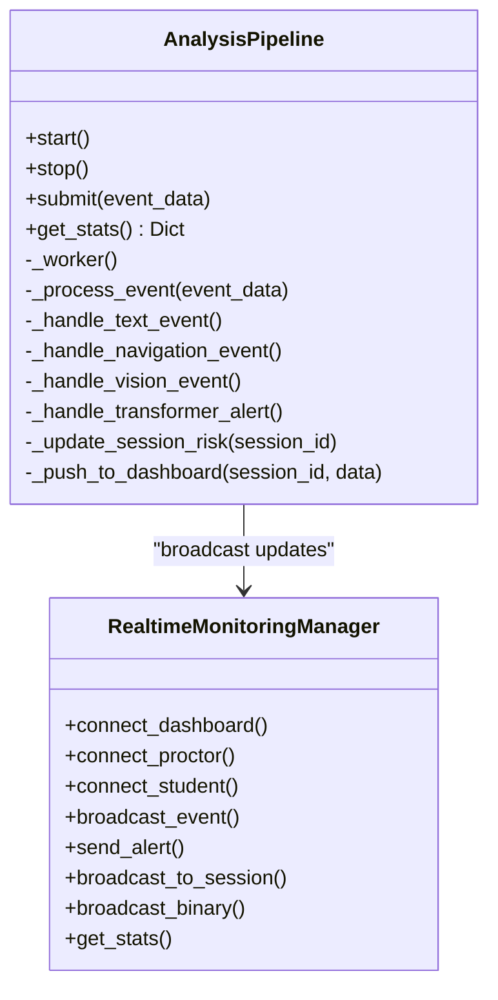
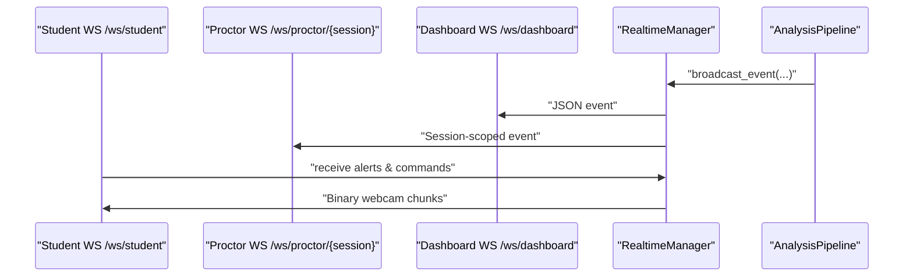
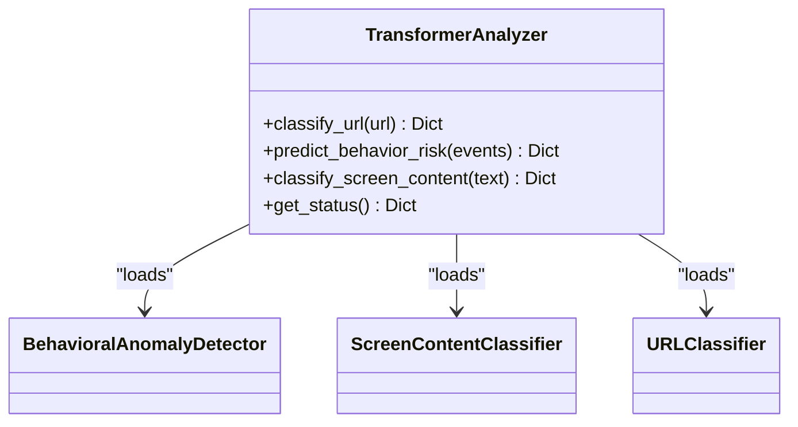
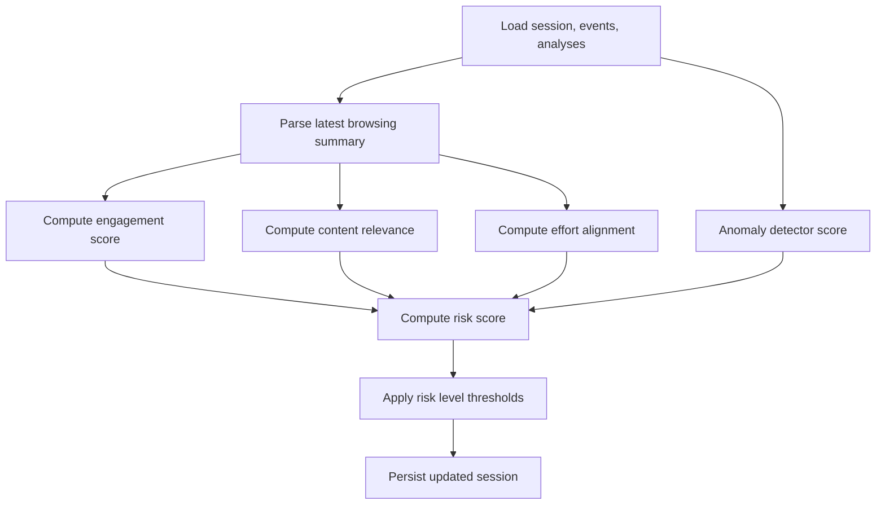
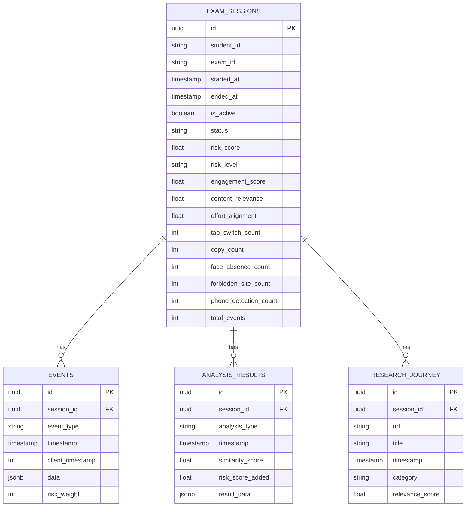
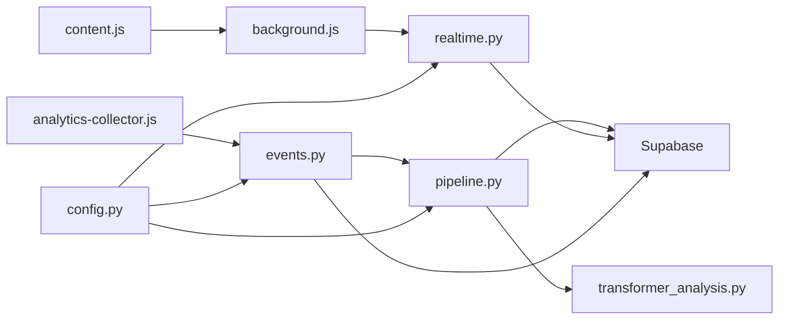

# Data Flow Architecture

<cite>
**Referenced Files in This Document**
- [background.js](file://extension/background.js)
- [content.js](file://extension/content.js)
- [analytics-collector.js](file://extension/analytics-collector.js)
- [main.py](file://server/main.py)
- [events.py](file://server/api/endpoints/events.py)
- [sessions.py](file://server/api/endpoints/sessions.py)
- [pipeline.py](file://server/services/pipeline.py)
- [realtime.py](file://server/services/realtime.py)
- [transformer_analysis.py](file://server/services/transformer_analysis.py)
- [engine.py](file://server/scoring/engine.py)
- [config.py](file://server/config.py)
- [event.py](file://server/models/event.py)
- [session.py](file://server/models/session.py)
</cite>

## Table of Contents
1. [Introduction](#introduction)
2. [Project Structure](#project-structure)
3. [Core Components](#core-components)
4. [Architecture Overview](#architecture-overview)
5. [Detailed Component Analysis](#detailed-component-analysis)
6. [Dependency Analysis](#dependency-analysis)
7. [Performance Considerations](#performance-considerations)
8. [Troubleshooting Guide](#troubleshooting-guide)
9. [Conclusion](#conclusion)
10. [Appendices](#appendices)

## Introduction
This document describes the complete data flow architecture of ExamGuard Pro, from Chrome extension event capture through backend AI analysis to real-time dashboard updates. It explains how user events traverse the extension, are transmitted via WebSocket connections, processed by the analysis pipeline, and broadcast to dashboards and proctors. It also documents data validation rules, event categorization, alert generation, database schema integration, access patterns, caching strategies, performance characteristics, and security and privacy controls.

## Project Structure
The system comprises three primary layers:
- Chrome Extension: captures user behavior, DOM snapshots, webcam frames, and browser telemetry; relays events to the backend via WebSocket and HTTP endpoints.
- Server: FastAPI backend exposing REST endpoints and WebSocket channels; orchestrates real-time broadcasting and runs the analysis pipeline.
- AI/ML: Transformer-based models for URL classification, behavioral anomaly detection, and screen content risk classification.

**Diagram sources**
- [main.py:170-647](file://server/main.py#L170-L647)
- [events.py:1-362](file://server/api/endpoints/events.py#L1-L362)
- [sessions.py:1-303](file://server/api/endpoints/sessions.py#L1-L303)
- [pipeline.py:1-342](file://server/services/pipeline.py#L1-L342)
- [realtime.py:1-642](file://server/services/realtime.py#L1-L642)
- [transformer_analysis.py:1-549](file://server/services/transformer_analysis.py#L1-L549)
- [engine.py:1-445](file://server/scoring/engine.py#L1-L445)

**Section sources**
- [main.py:170-647](file://server/main.py#L170-L647)
- [events.py:1-362](file://server/api/endpoints/events.py#L1-L362)
- [sessions.py:1-303](file://server/api/endpoints/sessions.py#L1-L303)
- [pipeline.py:1-342](file://server/services/pipeline.py#L1-L342)
- [realtime.py:1-642](file://server/services/realtime.py#L1-L642)
- [transformer_analysis.py:1-549](file://server/services/transformer_analysis.py#L1-L549)
- [engine.py:1-445](file://server/scoring/engine.py#L1-L445)

## Core Components
- Extension background service: manages session lifecycle, buffers events, performs periodic analysis, and relays data via WebSocket and HTTP.
- Content script monitor: captures keystroke dynamics, mouse movement, clipboard actions, audio anomalies, and detects overlays/cheating tools.
- Analytics collector: collects biometric and forensics data locally and sends selected insights to the backend.
- Server main: registers routers, initializes real-time manager, and exposes REST and WebSocket endpoints.
- Event logging: validates and logs events, updates session metrics, and batches submissions.
- Analysis pipeline: routes events to specialized handlers, updates risk scores, persists analysis results, and broadcasts updates.
- Real-time manager: manages WebSocket rooms, handles binary video streams, and broadcasts alerts.
- Transformer analyzer: loads and runs URL, behavioral, and screen content classifiers.
- Scoring engine: computes engagement, relevance, effort, and risk metrics from events and analysis results.

**Section sources**
- [background.js:1-800](file://extension/background.js#L1-L800)
- [content.js:1-473](file://extension/content.js#L1-L473)
- [analytics-collector.js:1-610](file://extension/analytics-collector.js#L1-L610)
- [main.py:170-647](file://server/main.py#L170-L647)
- [events.py:1-362](file://server/api/endpoints/events.py#L1-L362)
- [pipeline.py:1-342](file://server/services/pipeline.py#L1-L342)
- [realtime.py:1-642](file://server/services/realtime.py#L1-L642)
- [transformer_analysis.py:1-549](file://server/services/transformer_analysis.py#L1-L549)
- [engine.py:1-445](file://server/scoring/engine.py#L1-L445)

## Architecture Overview
The end-to-end data flow:
1. Extension monitors user behavior and browser activity, generating events and snapshots.
2. Events are batched and posted to the backend REST endpoints; real-time events are also streamed via WebSocket.
3. The backend validates and logs events, updates session metrics, and enqueues them for analysis.
4. The analysis pipeline runs transformers and anomaly detectors, updates risk scores, and writes results to storage.
5. Real-time manager broadcasts updates to dashboards and proctors via WebSocket; binary webcam frames are relayed directly.
6. The dashboard UI receives live updates and displays risk, alerts, and session metrics.

**Diagram sources**
- [main.py:248-501](file://server/main.py#L248-L501)
- [events.py:129-284](file://server/api/endpoints/events.py#L129-L284)
- [pipeline.py:74-333](file://server/services/pipeline.py#L74-L333)
- [realtime.py:334-403](file://server/services/realtime.py#L334-L403)

## Detailed Component Analysis

### Extension Data Capture and Transmission
- Background service:
  - Manages session state, buffers events, and periodically syncs to backend.
  - Relays live webcam chunks and WebRTC signaling via WebSocket.
  - Performs transformer-based text analysis on clipboard content and DOM snapshots.
  - Tracks browsing behavior, calculates risk and effort scores, and generates summary events.
- Content script monitor:
  - Captures keystroke dynamics, mouse movement, copy/paste, audio anomalies, and overlay detections.
  - Sends alerts to background for logging and broadcasting.
- Analytics collector:
  - Collects biometric and forensics data locally and sends selected insights to backend endpoints.

**Diagram sources**
- [background.js:52-166](file://extension/background.js#L52-L166)
- [content.js:332-343](file://extension/content.js#L332-L343)
- [analytics-collector.js:488-582](file://extension/analytics-collector.js#L488-L582)
- [main.py:393-473](file://server/main.py#L393-L473)

**Section sources**
- [background.js:1-800](file://extension/background.js#L1-L800)
- [content.js:1-473](file://extension/content.js#L1-L473)
- [analytics-collector.js:1-610](file://extension/analytics-collector.js#L1-L610)

### Event Logging and Batch Processing
- Single event logging:
  - Validates risk weight from configuration, inserts event, and updates session risk and effort scores.
- Batch logging:
  - Aggregates multiple events, computes accumulated risk and effort impact, inserts events and optional research journey entries, updates session once, and enqueues events for real-time analysis.

**Diagram sources**
- [events.py:30-127](file://server/api/endpoints/events.py#L30-L127)
- [events.py:129-284](file://server/api/endpoints/events.py#L129-L284)

**Section sources**
- [events.py:1-362](file://server/api/endpoints/events.py#L1-L362)
- [config.py:164-189](file://server/config.py#L164-L189)

### Analysis Pipeline and Risk Updates
- Routes events to handlers based on type:
  - Text events: transformer screen content classification.
  - Navigation events: URL categorization and risk impact.
  - Vision events: phone/facial absence updates.
  - Transformer alerts: plagiarism risk adjustments.
- Updates session risk level and broadcasts to dashboards with alert severity mapping.

**Diagram sources**
- [pipeline.py:9-342](file://server/services/pipeline.py#L9-L342)
- [realtime.py:102-642](file://server/services/realtime.py#L102-L642)

**Section sources**
- [pipeline.py:1-342](file://server/services/pipeline.py#L1-L342)
- [realtime.py:1-642](file://server/services/realtime.py#L1-L642)

### Real-Time Broadcasting and WebSocket Channels
- WebSocket endpoints:
  - /ws/dashboard: global dashboard updates.
  - /ws/proctor/{session_id}: session-scoped proctor monitoring.
  - /ws/student: student alerts and commands; handles binary webcam chunks.
- Realtime manager:
  - Manages rooms by session/exam, supports binary forwarding, and maintains event history.
  - Broadcasts alerts with severity levels and pushes session risk updates.

**Diagram sources**
- [main.py:274-473](file://server/main.py#L274-L473)
- [realtime.py:334-416](file://server/services/realtime.py#L334-L416)

**Section sources**
- [main.py:248-501](file://server/main.py#L248-L501)
- [realtime.py:1-642](file://server/services/realtime.py#L1-L642)

### Transformer-Based Analysis
- Loads three models:
  - URL classifier: website risk scoring.
  - Behavioral anomaly detector: sequence-based risk classification.
  - Screen content classifier: OCR text risk classification.
- Provides fallback rule-based classification when models are unavailable.

**Diagram sources**
- [transformer_analysis.py:178-549](file://server/services/transformer_analysis.py#L178-L549)

**Section sources**
- [transformer_analysis.py:1-549](file://server/services/transformer_analysis.py#L1-L549)

### Scoring Engine and Metrics
- Computes engagement, relevance, effort alignment, and risk from:
  - Browsing summaries (extension-derived).
  - Event counts and timestamps.
  - Analysis results (vision, OCR, anomalies).
- Applies blending weights and thresholds to produce normalized scores and risk levels.

**Diagram sources**
- [engine.py:382-445](file://server/scoring/engine.py#L382-L445)

**Section sources**
- [engine.py:1-445](file://server/scoring/engine.py#L1-L445)

### Database Schema Integration
- Core tables:
  - exam_sessions: session metadata, scores, and stats.
  - events: individual event logs with risk weights.
  - analysis_results: AI analysis outputs and risk additions.
  - research_journey: categorized navigation history.
- Pydantic models define structured schemas for API responses and internal processing.

**Diagram sources**
- [session.py:15-63](file://server/models/session.py#L15-L63)
- [event.py:6-30](file://server/models/event.py#L6-L30)
- [events.py:59-258](file://server/api/endpoints/events.py#L59-L258)
- [pipeline.py:123-144](file://server/services/pipeline.py#L123-L144)

**Section sources**
- [session.py:1-63](file://server/models/session.py#L1-L63)
- [event.py:1-30](file://server/models/event.py#L1-L30)
- [events.py:1-362](file://server/api/endpoints/events.py#L1-L362)
- [pipeline.py:1-342](file://server/services/pipeline.py#L1-L342)

## Dependency Analysis
- Extension depends on:
  - Background service for session orchestration and WebSocket relay.
  - Content script for behavioral monitoring.
  - Analytics collector for advanced insights.
- Server depends on:
  - Realtime manager for WebSocket broadcasting.
  - Analysis pipeline for event processing.
  - Transformer analyzer for AI classification.
  - Supabase for persistent storage.
- Configuration centralizes risk weights, URL categories, and forbidden keywords.

**Diagram sources**
- [background.js:1-800](file://extension/background.js#L1-L800)
- [content.js:1-473](file://extension/content.js#L1-L473)
- [analytics-collector.js:1-610](file://extension/analytics-collector.js#L1-L610)
- [main.py:1-647](file://server/main.py#L1-L647)
- [events.py:1-362](file://server/api/endpoints/events.py#L1-L362)
- [pipeline.py:1-342](file://server/services/pipeline.py#L1-L342)
- [realtime.py:1-642](file://server/services/realtime.py#L1-L642)
- [transformer_analysis.py:1-549](file://server/services/transformer_analysis.py#L1-L549)
- [config.py:1-205](file://server/config.py#L1-L205)

**Section sources**
- [config.py:1-205](file://server/config.py#L1-L205)
- [events.py:1-362](file://server/api/endpoints/events.py#L1-L362)
- [pipeline.py:1-342](file://server/services/pipeline.py#L1-L342)
- [realtime.py:1-642](file://server/services/realtime.py#L1-L642)

## Performance Considerations
- Batching:
  - Batch event logging reduces database overhead and improves throughput.
- Queuing:
  - Analysis pipeline uses an asyncio queue to decouple ingestion from processing.
- Binary streaming:
  - Direct binary forwarding avoids extra serialization for webcam frames.
- Transformer availability:
  - Graceful fallback to rule-based classification when models are unavailable.
- Heartbeat:
  - Periodic heartbeat maintains WebSocket liveness and provides stats.

[No sources needed since this section provides general guidance]

## Troubleshooting Guide
- WebSocket connectivity:
  - Verify WebSocket endpoints and heartbeat messages; check connection pools and room membership.
- Event delivery:
  - Confirm batch sizes and submission timing; inspect pipeline stats for errors.
- Risk score discrepancies:
  - Review risk weights and category penalties; ensure browsing summaries are present.
- Model loading:
  - Check transformer analyzer status and device availability; confirm checkpoint paths.

**Section sources**
- [main.py:503-507](file://server/main.py#L503-L507)
- [pipeline.py:48-53](file://server/services/pipeline.py#L48-L53)
- [realtime.py:538-559](file://server/services/realtime.py#L538-L559)
- [transformer_analysis.py:525-533](file://server/services/transformer_analysis.py#L525-L533)

## Conclusion
ExamGuard Pro’s architecture ensures robust, real-time monitoring by combining extension-level behavioral capture, efficient event batching, AI-driven analysis, and scalable WebSocket broadcasting. The system’s modular design enables incremental improvements, graceful degradation when AI models are unavailable, and clear separation of concerns across components.

[No sources needed since this section summarizes without analyzing specific files]

## Appendices

### Data Lifecycle
- Initial capture:
  - Extension monitors user actions and captures DOM/webcam snapshots.
- Temporary storage:
  - Events buffered locally; batched HTTP requests reduce latency and load.
- Permanent storage:
  - Events, analysis results, and research journey entries persisted to Supabase.
- Cleanup:
  - Session end marks records inactive; binary uploads are stored under uploads/; dashboards clear event history on admin wipe.

**Section sources**
- [sessions.py:146-209](file://server/api/endpoints/sessions.py#L146-L209)
- [main.py:513-524](file://server/main.py#L513-L524)
- [realtime.py:128-131](file://server/services/realtime.py#L128-L131)

### Security and Privacy Controls
- CORS configuration allows extension and dashboard access.
- WebSocket endpoints enforce room-based routing and binary forwarding.
- Analytics collector performs local processing and minimizes data exposure.
- Supabase credentials configured via environment variables; database mode supports multiple backends.

**Section sources**
- [main.py:216-222](file://server/main.py#L216-L222)
- [analytics-collector.js:10-11](file://extension/analytics-collector.js#L10-L11)
- [config.py:16-42](file://server/config.py#L16-L42)