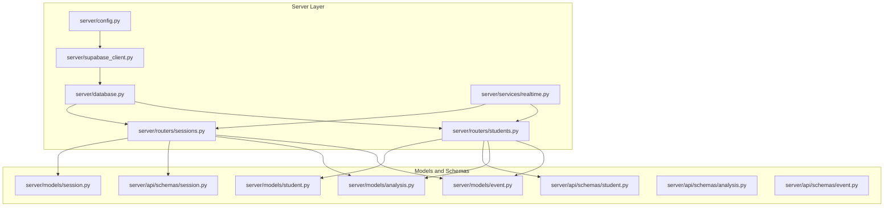
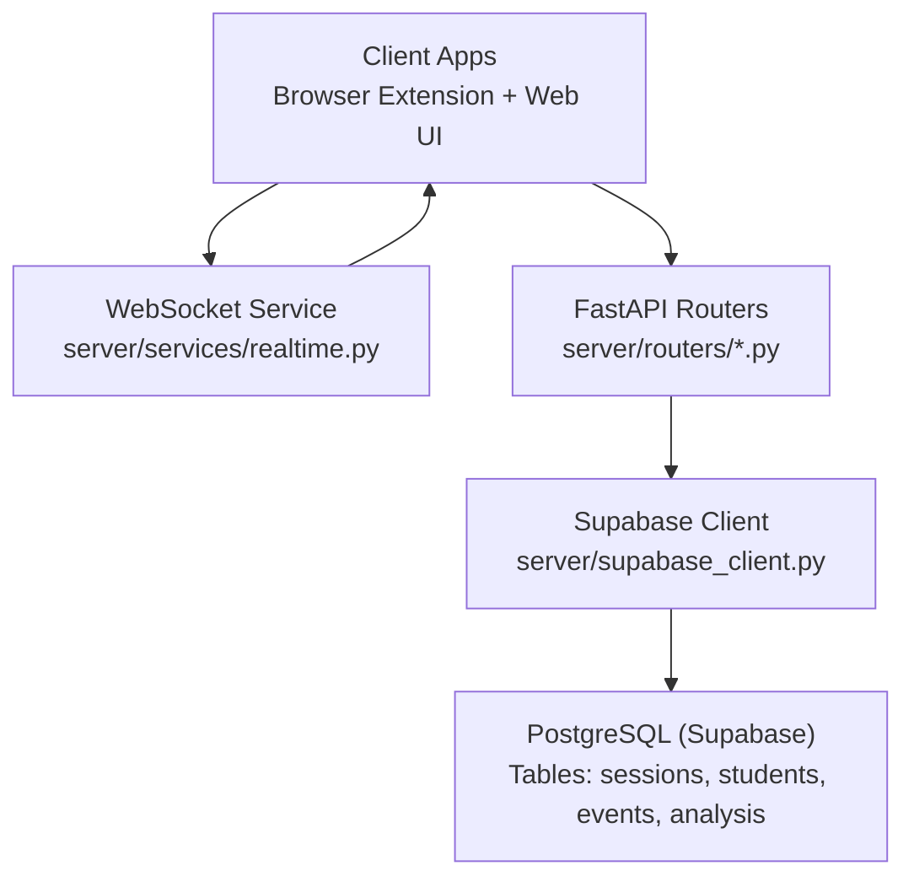
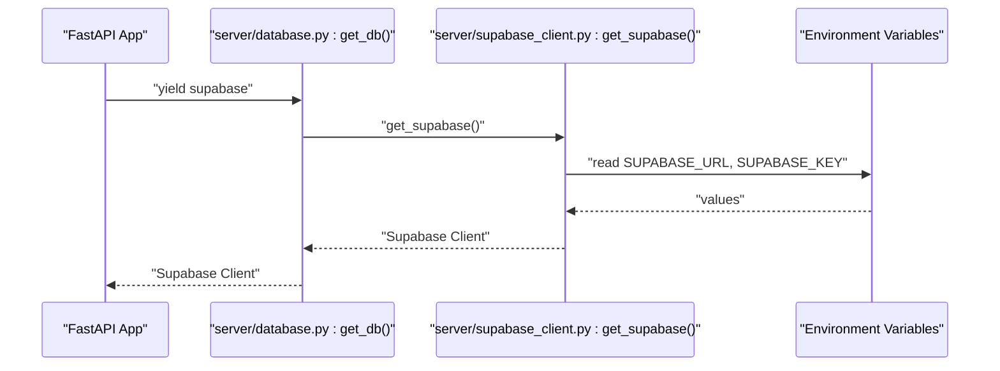
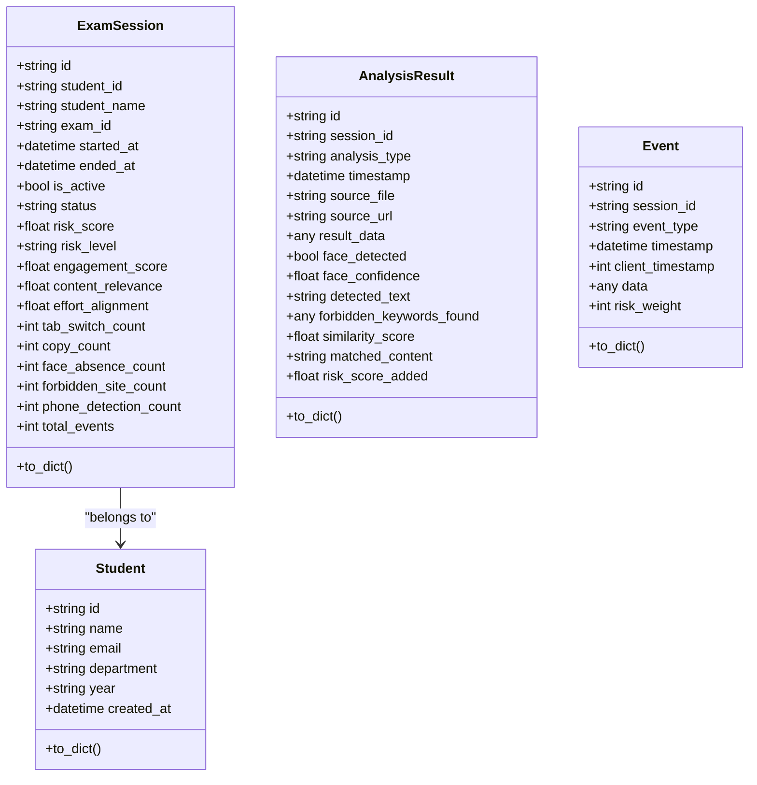
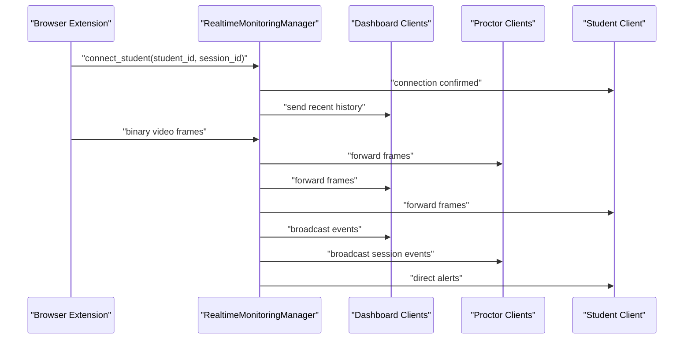
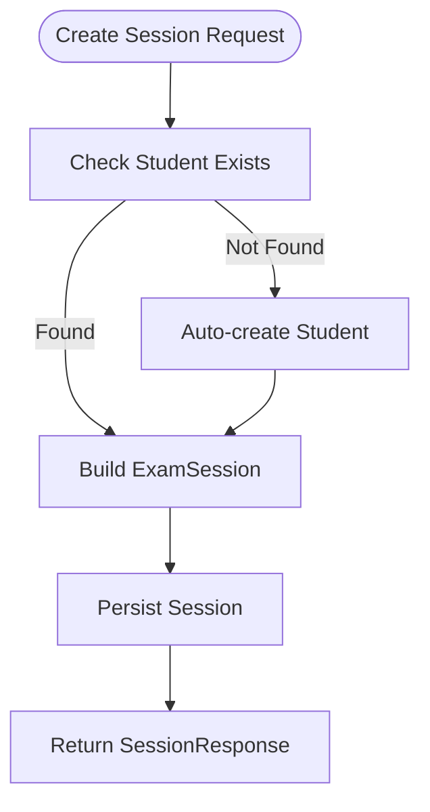
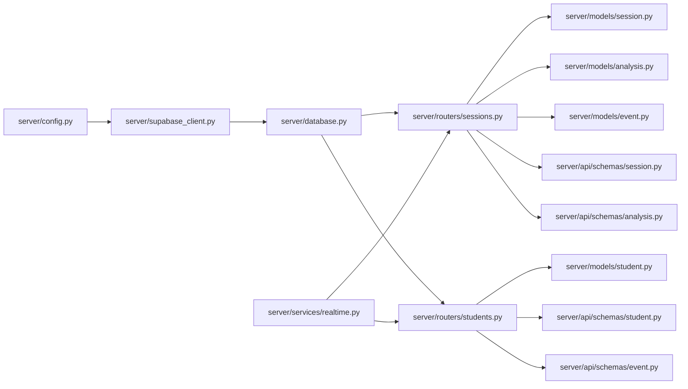

# Database Integration

<cite>
**Referenced Files in This Document**
- [supabase_client.py](file://server/supabase_client.py)
- [database.py](file://server/database.py)
- [models/session.py](file://server/models/session.py)
- [models/student.py](file://server/models/student.py)
- [models/analysis.py](file://server/models/analysis.py)
- [models/event.py](file://server/models/event.py)
- [api/schemas/session.py](file://server/api/schemas/session.py)
- [api/schemas/student.py](file://server/api/schemas/student.py)
- [api/schemas/analysis.py](file://server/api/schemas/analysis.py)
- [api/schemas/event.py](file://server/api/schemas/event.py)
- [routers/sessions.py](file://server/routers/sessions.py)
- [routers/students.py](file://server/routers/students.py)
- [services/realtime.py](file://server/services/realtime.py)
- [config.py](file://server/config.py)
</cite>

## Table of Contents
1. [Introduction](#introduction)
2. [Project Structure](#project-structure)
3. [Core Components](#core-components)
4. [Architecture Overview](#architecture-overview)
5. [Detailed Component Analysis](#detailed-component-analysis)
6. [Dependency Analysis](#dependency-analysis)
7. [Performance Considerations](#performance-considerations)
8. [Troubleshooting Guide](#troubleshooting-guide)
9. [Conclusion](#conclusion)
10. [Appendices](#appendices)

## Introduction
This document explains the database integration patterns used by ExamGuard Pro. It focuses on the Supabase PostgreSQL integration, real-time data broadcasting, and the data models for exam sessions, events, analysis results, and student profiles. It also covers data access patterns, query optimization strategies, caching approaches, lifecycle management, consistency, and security considerations. Where applicable, the document maps concepts to actual source files and provides diagrams that correspond to real code.

## Project Structure
The database integration spans several layers:
- Supabase client initialization and access
- Pydantic models representing data structures
- FastAPI routers exposing CRUD and analytics endpoints
- Real-time service managing WebSocket connections and event broadcasting
- Configuration for environment variables

**Diagram sources**
- [supabase_client.py:1-22](file://server/supabase_client.py#L1-L22)
- [database.py:1-24](file://server/database.py#L1-L24)
- [config.py](file://server/config.py)
- [services/realtime.py:1-643](file://server/services/realtime.py#L1-L643)
- [routers/sessions.py:1-232](file://server/routers/sessions.py#L1-L232)
- [routers/students.py:1-220](file://server/routers/students.py#L1-L220)
- [models/session.py:1-63](file://server/models/session.py#L1-L63)
- [models/student.py:1-17](file://server/models/student.py#L1-L17)
- [models/analysis.py:1-49](file://server/models/analysis.py#L1-L49)
- [models/event.py:1-30](file://server/models/event.py#L1-L30)
- [api/schemas/session.py:1-88](file://server/api/schemas/session.py#L1-L88)
- [api/schemas/student.py:1-95](file://server/api/schemas/student.py#L1-L95)
- [api/schemas/analysis.py:1-121](file://server/api/schemas/analysis.py#L1-L121)
- [api/schemas/event.py:1-63](file://server/api/schemas/event.py#L1-L63)

**Section sources**
- [supabase_client.py:1-22](file://server/supabase_client.py#L1-L22)
- [database.py:1-24](file://server/database.py#L1-L24)
- [config.py](file://server/config.py)

## Core Components
- Supabase client initialization and retrieval
- Database dependency provider for FastAPI
- Pydantic models for session, student, analysis, and event records
- API schemas for request/response validation
- Routers for session and student operations
- Real-time service for WebSocket-based event broadcasting

Key responsibilities:
- Supabase client encapsulates environment-driven initialization and exposes a shared client instance.
- Database dependency yields the Supabase client to route handlers.
- Pydantic models define shape and defaults for records; they also provide serialization helpers.
- Routers orchestrate reads/writes via SQLAlchemy-style operations against the Supabase client.
- Real-time service manages rooms, connections, and event broadcasting.

**Section sources**
- [supabase_client.py:1-22](file://server/supabase_client.py#L1-L22)
- [database.py:1-24](file://server/database.py#L1-L24)
- [models/session.py:1-63](file://server/models/session.py#L1-L63)
- [models/student.py:1-17](file://server/models/student.py#L1-L17)
- [models/analysis.py:1-49](file://server/models/analysis.py#L1-L49)
- [models/event.py:1-30](file://server/models/event.py#L1-L30)
- [api/schemas/session.py:1-88](file://server/api/schemas/session.py#L1-L88)
- [api/schemas/student.py:1-95](file://server/api/schemas/student.py#L1-L95)
- [api/schemas/analysis.py:1-121](file://server/api/schemas/analysis.py#L1-L121)
- [api/schemas/event.py:1-63](file://server/api/schemas/event.py#L1-L63)
- [routers/sessions.py:1-232](file://server/routers/sessions.py#L1-L232)
- [routers/students.py:1-220](file://server/routers/students.py#L1-L220)
- [services/realtime.py:1-643](file://server/services/realtime.py#L1-L643)

## Architecture Overview
The system integrates a Supabase-managed PostgreSQL backend with FastAPI endpoints and a WebSocket-based real-time service. The Supabase client is initialized from environment variables and exposed via a dependency provider. Routers handle session and student operations, while the real-time service broadcasts events to dashboards, proctors, and students.

**Diagram sources**
- [services/realtime.py:1-643](file://server/services/realtime.py#L1-L643)
- [routers/sessions.py:1-232](file://server/routers/sessions.py#L1-L232)
- [routers/students.py:1-220](file://server/routers/students.py#L1-L220)
- [supabase_client.py:1-22](file://server/supabase_client.py#L1-L22)

## Detailed Component Analysis

### Supabase Client and Database Dependency
- Initialization ensures environment variables are present and prints status messages.
- The dependency provider yields the Supabase client for route handlers.
- The database initializer prints a verification message and returns success.

**Diagram sources**
- [database.py:18-24](file://server/database.py#L18-L24)
- [supabase_client.py:19-22](file://server/supabase_client.py#L19-L22)
- [config.py](file://server/config.py)

**Section sources**
- [supabase_client.py:1-22](file://server/supabase_client.py#L1-L22)
- [database.py:1-24](file://server/database.py#L1-L24)

### Data Models and Schemas
- Session model defines exam session attributes, timestamps, risk scores, and counts.
- Student model defines profile attributes and creation timestamp.
- Analysis result model captures AI-detected events with optional fields per analysis type.
- Event model captures client-originated events with flexible JSON payload and risk weight.
- API schemas define request/response shapes for sessions, students, analysis, and events.

**Diagram sources**
- [models/session.py:15-63](file://server/models/session.py#L15-L63)
- [models/student.py:6-17](file://server/models/student.py#L6-L17)
- [models/analysis.py:6-49](file://server/models/analysis.py#L6-L49)
- [models/event.py:6-30](file://server/models/event.py#L6-L30)

**Section sources**
- [models/session.py:1-63](file://server/models/session.py#L1-L63)
- [models/student.py:1-17](file://server/models/student.py#L1-L17)
- [models/analysis.py:1-49](file://server/models/analysis.py#L1-L49)
- [models/event.py:1-30](file://server/models/event.py#L1-L30)
- [api/schemas/session.py:1-88](file://server/api/schemas/session.py#L1-L88)
- [api/schemas/student.py:1-95](file://server/api/schemas/student.py#L1-L95)
- [api/schemas/analysis.py:1-121](file://server/api/schemas/analysis.py#L1-L121)
- [api/schemas/event.py:1-63](file://server/api/schemas/event.py#L1-L63)

### Real-Time Subscription Patterns and Broadcasting
- WebSocket connections are grouped by role (dashboard, proctor, student) and by session (room).
- The service supports binary video streaming and JSON event broadcasting.
- Event history is maintained for late-joiners.
- Convenience methods emit structured alerts and risk updates.

**Diagram sources**
- [services/realtime.py:81-329](file://server/services/realtime.py#L81-L329)
- [services/realtime.py:334-417](file://server/services/realtime.py#L334-L417)
- [services/realtime.py:539-560](file://server/services/realtime.py#L539-L560)

**Section sources**
- [services/realtime.py:1-643](file://server/services/realtime.py#L1-L643)

### Data Access Patterns and Query Optimization
- Routers use SQLAlchemy-style queries to fetch and update records.
- Session listing supports filtering by activity and pagination.
- Risk score computation is performed during session end; fallback logic is included.
- Student auto-creation reduces external coordination overhead.

**Diagram sources**
- [routers/sessions.py:31-70](file://server/routers/sessions.py#L31-L70)

**Section sources**
- [routers/sessions.py:1-232](file://server/routers/sessions.py#L1-L232)
- [routers/students.py:1-220](file://server/routers/students.py#L1-L220)

### Change Data Capture and Conflict Resolution
- The codebase does not implement explicit CDC hooks or conflict resolution strategies.
- Real-time updates rely on WebSocket broadcasts and event history.
- Recommendations:
  - Implement optimistic concurrency with version fields or timestamps.
  - Use upsert patterns for events and analysis results to prevent duplicates.
  - Apply idempotency keys for event ingestion to avoid reprocessing.

[No sources needed since this section provides general guidance]

### Data Lifecycle Management, Retention, and Archival
- No explicit retention or archival logic is present in the codebase.
- Recommendations:
  - Define TTLs for short-lived events and analysis results.
  - Archive completed sessions after a configurable period.
  - Implement batch deletion jobs for stale data.

[No sources needed since this section provides general guidance]

### Transaction Handling and Consistency Guarantees
- Session creation and updates commit within a single operation.
- Risk score and level assignment occur during session end.
- Recommendations:
  - Wrap critical updates in explicit transactions.
  - Use SELECT ... FOR UPDATE for high-contention writes.
  - Ensure atomic updates to derived metrics (e.g., risk score) to maintain consistency.

[No sources needed since this section provides general guidance]

### Backup and Recovery Mechanisms
- Backups are managed by the Supabase platform; the codebase does not implement local backup logic.
- Recommendations:
  - Enable Supabase continuous backups.
  - Periodically export schema and critical datasets for offsite storage.
  - Test restoration procedures regularly.

[No sources needed since this section provides general guidance]

### Security Measures
- Transport security: Use HTTPS/WSS for API and WebSocket endpoints.
- Access control: Enforce authentication and authorization at the router level.
- Data protection: Encrypt sensitive fields at rest if required by policy.
- Recommendations:
  - Enforce JWT-based auth for WebSocket upgrades.
  - Restrict WebSocket access by session membership.
  - Sanitize and validate all incoming payloads.

[No sources needed since this section provides general guidance]

## Dependency Analysis
The following diagram highlights key dependencies among components involved in database integration and real-time updates.

**Diagram sources**
- [config.py](file://server/config.py)
- [supabase_client.py:1-22](file://server/supabase_client.py#L1-L22)
- [database.py:1-24](file://server/database.py#L1-L24)
- [routers/sessions.py:1-232](file://server/routers/sessions.py#L1-L232)
- [routers/students.py:1-220](file://server/routers/students.py#L1-L220)
- [models/session.py:1-63](file://server/models/session.py#L1-L63)
- [models/student.py:1-17](file://server/models/student.py#L1-L17)
- [models/analysis.py:1-49](file://server/models/analysis.py#L1-L49)
- [models/event.py:1-30](file://server/models/event.py#L1-L30)
- [api/schemas/session.py:1-88](file://server/api/schemas/session.py#L1-L88)
- [api/schemas/student.py:1-95](file://server/api/schemas/student.py#L1-L95)
- [api/schemas/analysis.py:1-121](file://server/api/schemas/analysis.py#L1-L121)
- [api/schemas/event.py:1-63](file://server/api/schemas/event.py#L1-L63)
- [services/realtime.py:1-643](file://server/services/realtime.py#L1-L643)

**Section sources**
- [routers/sessions.py:1-232](file://server/routers/sessions.py#L1-L232)
- [routers/students.py:1-220](file://server/routers/students.py#L1-L220)
- [services/realtime.py:1-643](file://server/services/realtime.py#L1-L643)

## Performance Considerations
- Minimize round-trips by batching event submissions and using WebSocket for live streams.
- Use pagination and filters in listing endpoints to reduce payload sizes.
- Cache frequently accessed session summaries and student metadata in memory for short periods.
- Offload heavy computations (e.g., AI analysis) to background workers and publish results via WebSocket.

[No sources needed since this section provides general guidance]

## Troubleshooting Guide
Common issues and remedies:
- Missing Supabase credentials: Verify environment variables and restart the service.
- WebSocket disconnections: The real-time service automatically cleans up disconnected clients and rooms.
- Session not found errors: Confirm session IDs and that sessions are not already ended.
- Risk score inconsistencies: Ensure the scoring logic runs consistently during session end.

**Section sources**
- [supabase_client.py:12-17](file://server/supabase_client.py#L12-L17)
- [services/realtime.py:275-309](file://server/services/realtime.py#L275-L309)
- [routers/sessions.py:84-95](file://server/routers/sessions.py#L84-L95)

## Conclusion
ExamGuard Pro integrates Supabase PostgreSQL with FastAPI and a robust WebSocket-based real-time service. The system models exam sessions, students, events, and analysis results with clear schemas and provides efficient broadcasting to stakeholders. While the current implementation focuses on operational simplicity, adopting explicit CDC, conflict resolution, retention policies, and stronger transactional guarantees would further improve reliability and scalability.

## Appendices

### Example Workflows

- Create a new exam session
  - Endpoint: POST create session
  - Behavior: Auto-create student if missing, persist session, return session details
  - Related files: [routers/sessions.py:31-70](file://server/routers/sessions.py#L31-L70), [models/student.py:6-17](file://server/models/student.py#L6-L17), [models/session.py:15-63](file://server/models/session.py#L15-L63)

- End an exam session and compute risk
  - Endpoint: POST end session
  - Behavior: Mark as inactive, compute risk score and level, commit changes
  - Related files: [routers/sessions.py:72-128](file://server/routers/sessions.py#L72-L128)

- Subscribe to real-time events
  - WebSocket roles: dashboard, proctor, student
  - Rooms: session-based broadcasting
  - Related files: [services/realtime.py:81-329](file://server/services/realtime.py#L81-L329)

- Insert events in batch
  - Schema: EventBatch
  - Behavior: Accept multiple events with timestamps and risk weights
  - Related files: [api/schemas/event.py:36-51](file://server/api/schemas/event.py#L36-L51), [models/event.py:6-30](file://server/models/event.py#L6-L30)