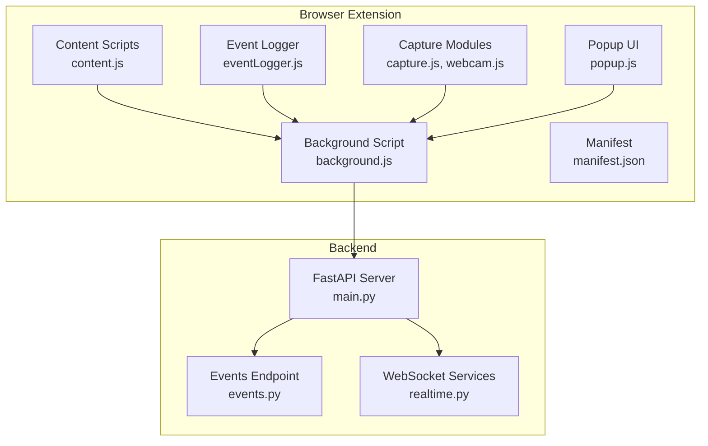
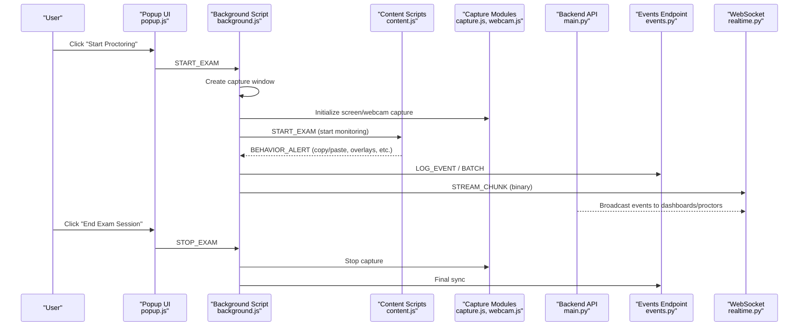
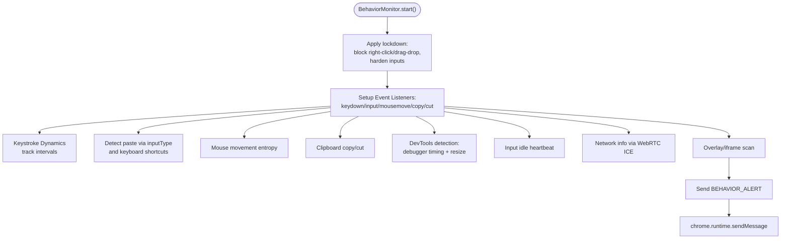
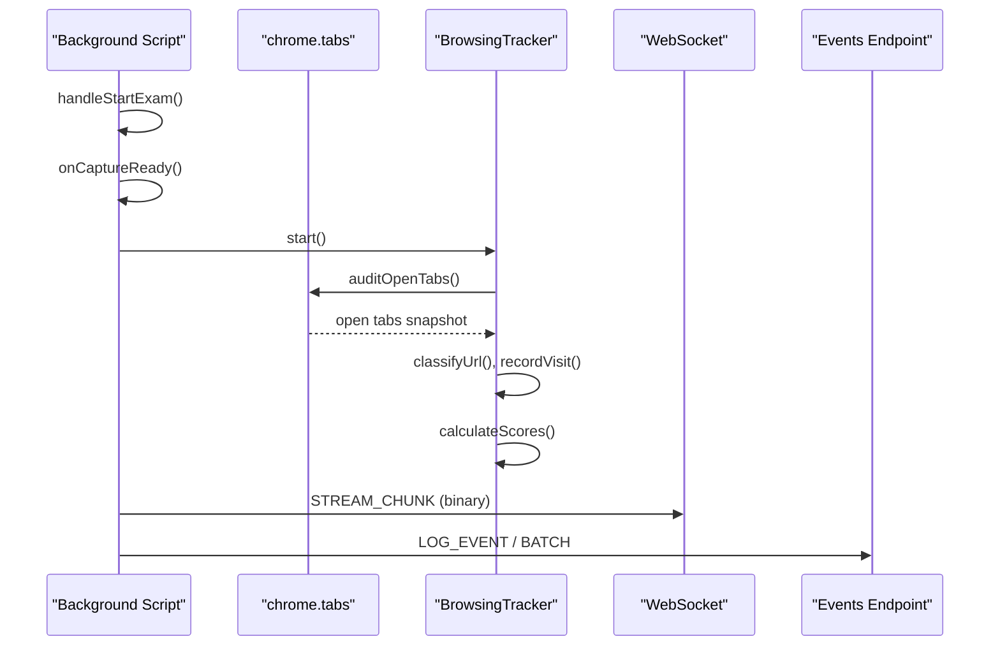
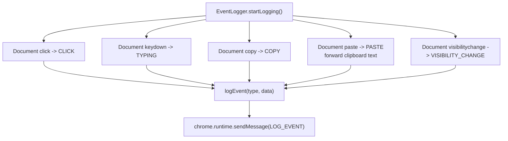
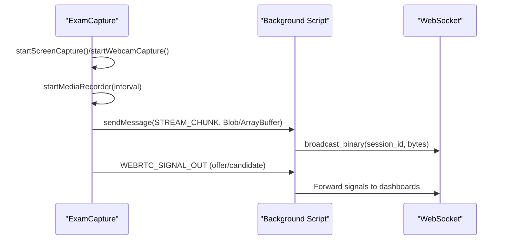
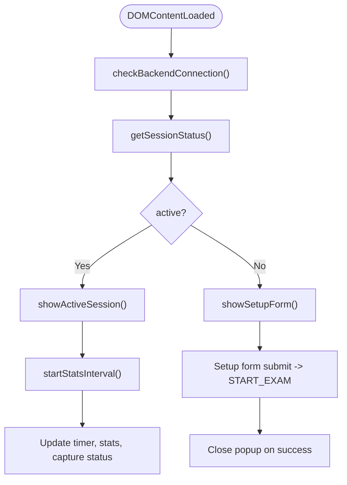
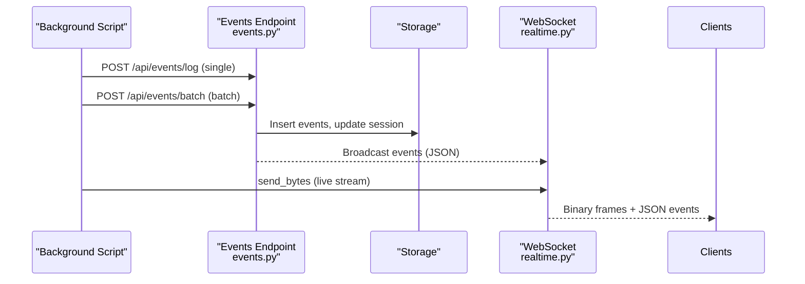
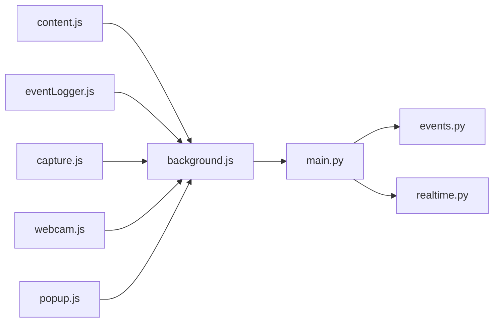

# Event Capture Flow

<cite>
**Referenced Files in This Document**
- [content.js](file://extension/content.js)
- [background.js](file://extension/background.js)
- [eventLogger.js](file://extension/eventLogger.js)
- [capture.js](file://extension/capture.js)
- [capture-page.js](file://extension/capture-page.js)
- [webcam.js](file://extension/webcam.js)
- [manifest.json](file://extension/manifest.json)
- [popup.js](file://extension/popup/popup.js)
- [utils.js](file://extension/utils.js)
- [events.py](file://server/api/endpoints/events.py)
- [realtime.py](file://server/services/realtime.py)
- [main.py](file://server/main.py)
</cite>

## Table of Contents
1. [Introduction](#introduction)
2. [Project Structure](#project-structure)
3. [Core Components](#core-components)
4. [Architecture Overview](#architecture-overview)
5. [Detailed Component Analysis](#detailed-component-analysis)
6. [Dependency Analysis](#dependency-analysis)
7. [Performance Considerations](#performance-considerations)
8. [Troubleshooting Guide](#troubleshooting-guide)
9. [Conclusion](#conclusion)

## Introduction
This document explains the Chrome extension event capture flow in ExamGuard Pro. It covers how user actions are captured in the browser (content scripts), coordinated by the background script, transformed into structured event objects, queued and batched, and transmitted to the backend via WebSocket connections. It also documents the event types captured (copy/paste, tab switching, navigation, window focus changes, camera/webcam detections), the data transformation pipeline, real-time broadcasting, and security/privacy considerations.

## Project Structure
The event capture spans three layers:
- Browser extension (content scripts, background script, capture pages)
- Backend API (FastAPI) with WebSocket real-time monitoring
- Server-side services for AI analysis, scoring, and storage

**Diagram sources**
- [content.js:1-473](file://extension/content.js#L1-L473)
- [background.js:1-800](file://extension/background.js#L1-L800)
- [capture.js:1-352](file://extension/capture.js#L1-L352)
- [webcam.js:1-90](file://extension/webcam.js#L1-L90)
- [eventLogger.js:1-111](file://extension/eventLogger.js#L1-L111)
- [popup.js:1-490](file://extension/popup/popup.js#L1-L490)
- [manifest.json:1-73](file://extension/manifest.json#L1-L73)
- [main.py:1-650](file://server/main.py#L1-L650)
- [events.py:1-414](file://server/api/endpoints/events.py#L1-L414)
- [realtime.py:1-643](file://server/services/realtime.py#L1-L643)

**Section sources**
- [manifest.json:29-44](file://extension/manifest.json#L29-L44)
- [main.py:248-490](file://server/main.py#L248-L490)

## Core Components
- Content Scripts: Capture keystrokes, mouse movements, copy/cut/paste, DevTools detection, input idle detection, and overlay/iframe scanning. Emit behavior alerts and network info.
- Background Script: Coordinates sessions, manages event queues, performs periodic synchronization, handles WebRTC signaling, relays binary stream chunks, and maintains browsing tracker.
- Event Logger: Captures click, typing, copy/paste, and visibility changes; forwards to background for logging.
- Capture Modules: Screen/webcam capture, MediaRecorder streaming, WebRTC signaling, and frame capture.
- Popup UI: Starts/stops sessions, displays live stats, and checks backend connectivity.
- Backend API: Accepts event logs, batches, and real-time WebSocket broadcasts for dashboards and proctors.

**Section sources**
- [content.js:34-357](file://extension/content.js#L34-L357)
- [background.js:21-800](file://extension/background.js#L21-L800)
- [eventLogger.js:1-111](file://extension/eventLogger.js#L1-L111)
- [capture.js:6-332](file://extension/capture.js#L6-L332)
- [webcam.js:1-90](file://extension/webcam.js#L1-L90)
- [popup.js:1-490](file://extension/popup/popup.js#L1-L490)

## Architecture Overview
The flow begins when the user initiates a session via the popup. The background script creates a capture window, initializes capture modules, and starts monitoring. Content scripts capture user behavior and send alerts. The background script aggregates events, optionally performs transformer analysis on clipboard text, and synchronizes with the backend via HTTP and WebSocket.

**Diagram sources**
- [popup.js:343-423](file://extension/popup/popup.js#L343-L423)
- [background.js:52-169](file://extension/background.js#L52-L169)
- [content.js:367-381](file://extension/content.js#L367-L381)
- [capture.js:175-203](file://extension/capture.js#L175-L203)
- [main.py:394-490](file://server/main.py#L394-L490)
- [events.py:30-142](file://server/api/endpoints/events.py#L30-L142)
- [realtime.py:310-377](file://server/services/realtime.py#L310-L377)

## Detailed Component Analysis

### Content Scripts: Behavior and Overlay Detection
- Monitors keystroke dynamics, mouse movements, copy/cut/paste, and DevTools detection.
- Emits behavior alerts enriched with timestamps, URL, and contextual data.
- Scans DOM for suspicious overlays and iframes commonly associated with cheating tools.

**Diagram sources**
- [content.js:34-357](file://extension/content.js#L34-L357)

**Section sources**
- [content.js:169-224](file://extension/content.js#L169-L224)
- [content.js:279-309](file://extension/content.js#L279-L309)
- [content.js:388-472](file://extension/content.js#L388-L472)

### Background Script: Session Coordination and Event Queue
- Manages session lifecycle, event buffers, and periodic synchronization.
- Handles WebRTC signaling and binary stream forwarding to WebSocket.
- Integrates browsing tracker for tab audits, URL classification, and risk/effort scoring.

**Diagram sources**
- [background.js:686-750](file://extension/background.js#L686-L750)
- [background.js:179-564](file://extension/background.js#L179-L564)
- [background.js:133-153](file://extension/background.js#L133-L153)

**Section sources**
- [background.js:21-800](file://extension/background.js#L21-L800)

### Event Logger: Basic Interaction Logging
- Captures clicks, keydown, copy/paste, and visibility changes.
- Maintains a small in-memory buffer and sends events to background for persistence.

**Diagram sources**
- [eventLogger.js:10-95](file://extension/eventLogger.js#L10-L95)

**Section sources**
- [eventLogger.js:1-111](file://extension/eventLogger.js#L1-L111)

### Capture Modules: Screen/Webcam and Stream Forwarding
- Initializes screen and webcam streams, captures frames, and starts MediaRecorder.
- Relays binary chunks to background script and initializes WebRTC signaling.

**Diagram sources**
- [capture.js:28-246](file://extension/capture.js#L28-L246)
- [capture.js:281-331](file://extension/capture.js#L281-L331)
- [background.js:143-153](file://extension/background.js#L143-L153)
- [main.py:469-476](file://server/main.py#L469-L476)

**Section sources**
- [capture.js:6-332](file://extension/capture.js#L6-L332)
- [webcam.js:1-90](file://extension/webcam.js#L1-L90)
- [capture-page.js:150-170](file://extension/capture-page.js#L150-L170)

### Popup UI: Session Control and Live Stats
- Validates backend connectivity, collects session inputs, and triggers session start/stop.
- Periodically queries background for session stats and renders live metrics.

**Diagram sources**
- [popup.js:51-85](file://extension/popup/popup.js#L51-L85)
- [popup.js:117-123](file://extension/popup/popup.js#L117-L123)
- [popup.js:308-339](file://extension/popup/popup.js#L308-L339)

**Section sources**
- [popup.js:1-490](file://extension/popup/popup.js#L1-L490)

### Backend API: Event Logging and Real-Time Broadcasting
- Accepts single and batched events, updates session risk/effort scores, and persists to storage.
- Real-time WebSocket broadcasting to dashboards, proctors, and students with binary stream forwarding.

**Diagram sources**
- [events.py:30-142](file://server/api/endpoints/events.py#L30-L142)
- [events.py:144-336](file://server/api/endpoints/events.py#L144-L336)
- [realtime.py:310-377](file://server/services/realtime.py#L310-L377)
- [main.py:394-490](file://server/main.py#L394-L490)

**Section sources**
- [events.py:1-414](file://server/api/endpoints/events.py#L1-L414)
- [realtime.py:1-643](file://server/services/realtime.py#L1-L643)
- [main.py:248-490](file://server/main.py#L248-L490)

## Dependency Analysis
- Content scripts depend on runtime messaging to background for alerts and network info.
- Background script depends on chrome APIs (tabs, windows, storage) and manages WebSocket connections.
- Capture modules depend on MediaDevices and WebRTC APIs; they communicate with background via messages.
- Frontend popup depends on background status and runtime messaging for session control.
- Backend depends on Supabase for persistence and FastAPI WebSocket services for real-time.

**Diagram sources**
- [content.js:1-473](file://extension/content.js#L1-L473)
- [background.js:1-800](file://extension/background.js#L1-L800)
- [eventLogger.js:1-111](file://extension/eventLogger.js#L1-L111)
- [capture.js:1-352](file://extension/capture.js#L1-L352)
- [webcam.js:1-90](file://extension/webcam.js#L1-L90)
- [popup.js:1-490](file://extension/popup/popup.js#L1-L490)
- [main.py:1-650](file://server/main.py#L1-L650)
- [events.py:1-414](file://server/api/endpoints/events.py#L1-L414)
- [realtime.py:1-643](file://server/services/realtime.py#L1-L643)

**Section sources**
- [manifest.json:6-24](file://extension/manifest.json#L6-L24)
- [background.js:1-800](file://extension/background.js#L1-L800)

## Performance Considerations
- Event buffering and throttling: Content scripts throttle mouse events and maintain bounded buffers; background script batches events and limits sync frequency.
- Media capture: Adaptive quality and error thresholds reduce bandwidth and CPU usage.
- WebSocket streaming: Binary forwarding avoids JSON overhead for live streams.
- Background retries: HTTP endpoints implement retry logic for transient failures.

[No sources needed since this section provides general guidance]

## Troubleshooting Guide
- Context invalidated: Content scripts wrap messaging with safe wrappers to detect invalid contexts and stop monitoring.
- Permission denials: Capture modules return structured errors for screen/webcam access failures; popup indicates offline backend or permission issues.
- Session not found: Batch logging gracefully handles missing sessions and avoids retry loops.
- WebSocket drops: Real-time manager cleans up disconnected sockets and continues broadcasting to others.

**Section sources**
- [content.js:5-26](file://extension/content.js#L5-L26)
- [capture.js:57-64](file://extension/capture.js#L57-L64)
- [events.py:154-159](file://server/api/endpoints/events.py#L154-L159)
- [realtime.py:589-601](file://server/services/realtime.py#L589-L601)

## Conclusion
ExamGuard Pro’s event capture flow integrates browser-level behavior monitoring, robust session coordination, and real-time backend streaming. The system transforms raw browser events into structured, timestamped records enriched with contextual data, batches them efficiently, and streams live media to the backend for AI analysis and real-time supervision. Security and privacy are addressed through local-first processing, minimal data retention, and explicit permission gating.