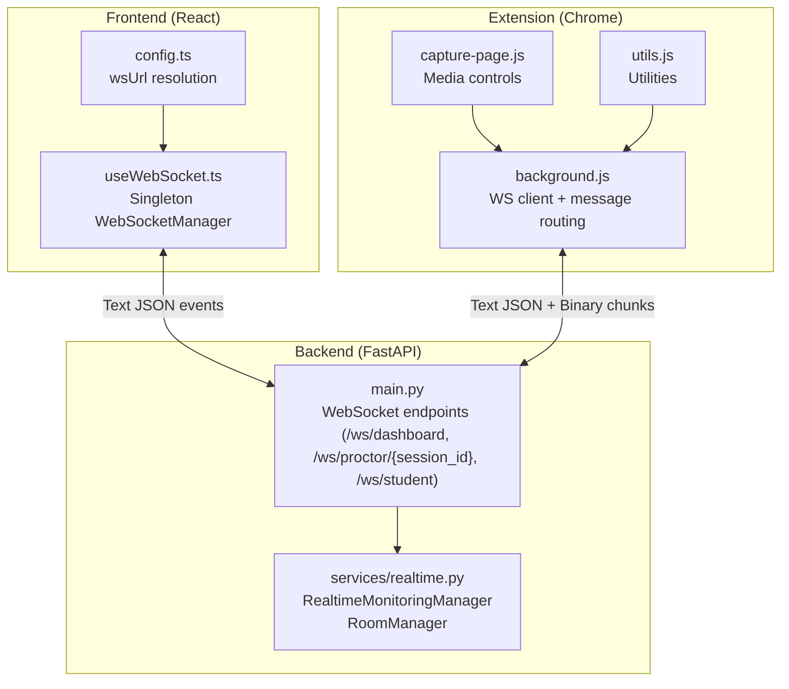
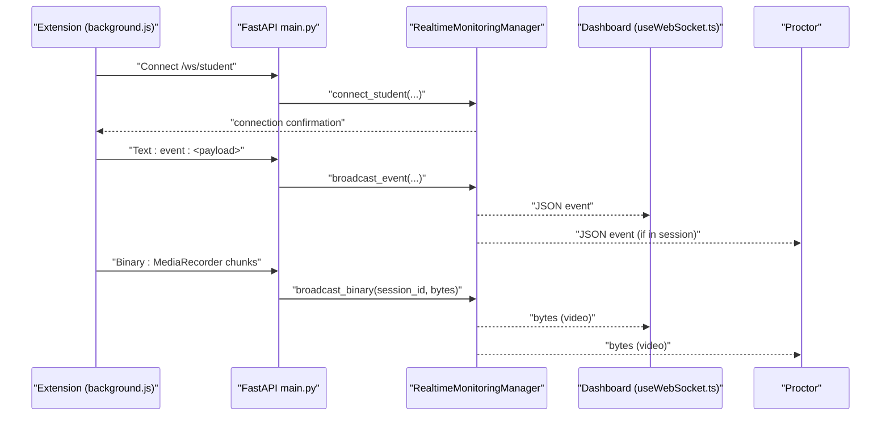
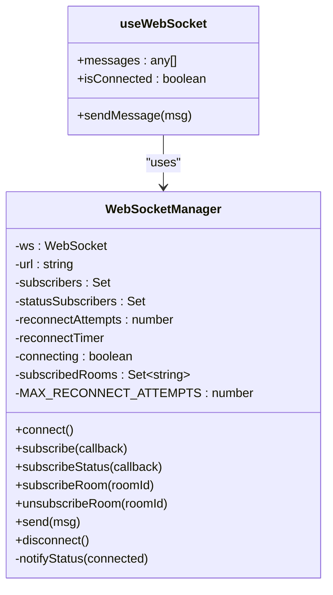
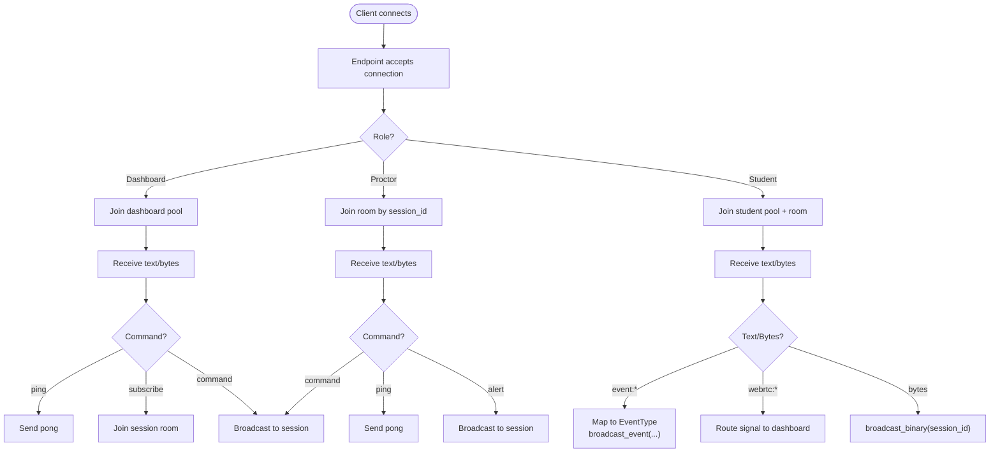
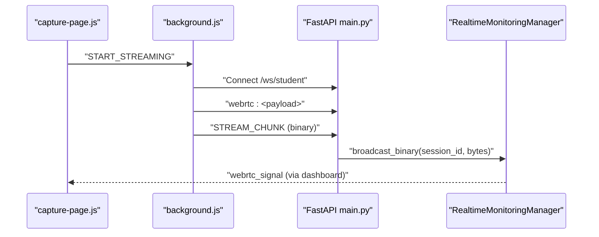
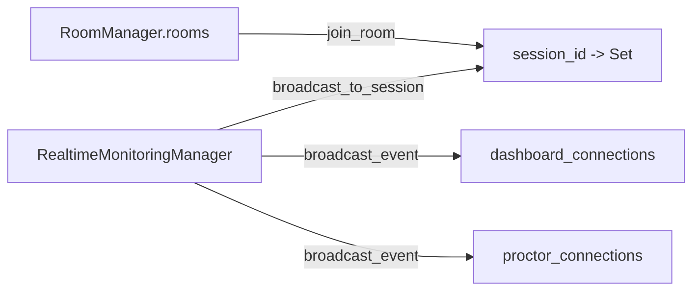
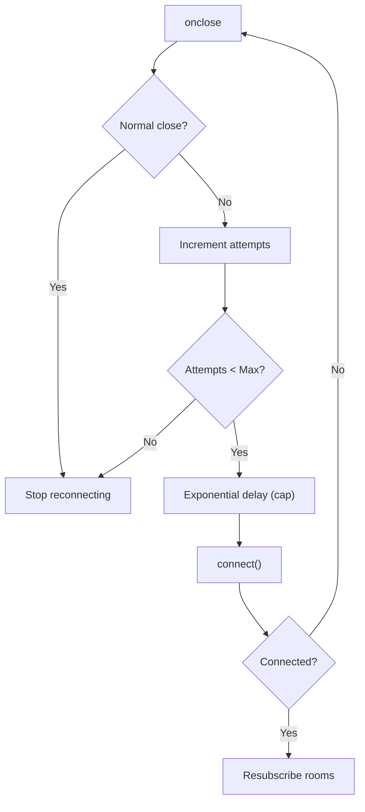
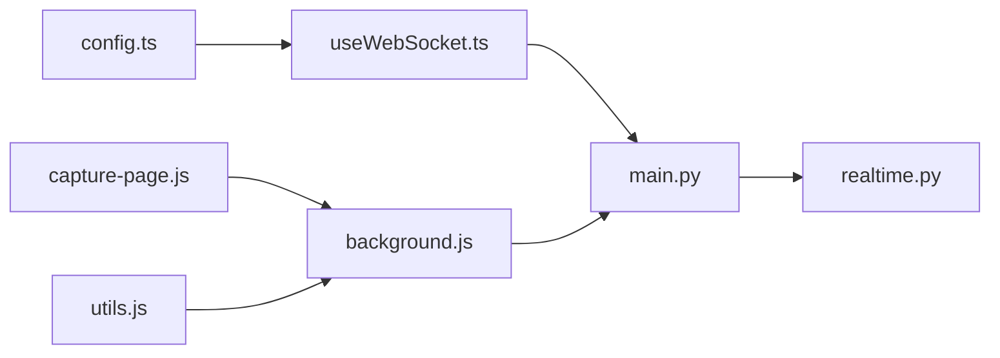

# WebSocket Communication

<cite>
**Referenced Files in This Document**
- [useWebSocket.ts](file://examguard-pro/src/hooks/useWebSocket.ts)
- [config.ts](file://examguard-pro/src/config.ts)
- [main.py](file://server/main.py)
- [realtime.py](file://server/services/realtime.py)
- [background.js](file://extension/background.js)
- [capture-page.js](file://extension/capture-page.js)
- [utils.js](file://extension/utils.js)
- [service.py](file://server/auth/service.py)
</cite>

## Table of Contents
1. [Introduction](#introduction)
2. [Project Structure](#project-structure)
3. [Core Components](#core-components)
4. [Architecture Overview](#architecture-overview)
5. [Detailed Component Analysis](#detailed-component-analysis)
6. [Dependency Analysis](#dependency-analysis)
7. [Performance Considerations](#performance-considerations)
8. [Troubleshooting Guide](#troubleshooting-guide)
9. [Conclusion](#conclusion)

## Introduction
This document describes the WebSocket communication architecture used by ExamGuard Pro to enable real-time, bidirectional messaging among three primary participants:
- Chrome extension (student side)
- Backend server (FastAPI + Starlette)
- Frontend dashboard (React SPA)

It covers connection establishment, message routing, room-based broadcasting for exam sessions, client subscription management, event broadcasting (risk score changes, violations, analysis results), heartbeat and reconnection strategies, and scalability/performance considerations.

## Project Structure
The WebSocket stack spans three layers:
- Frontend (React) uses a singleton WebSocket manager to connect to the backend and manage subscriptions.
- Backend (Python/FastAPI) exposes multiple WebSocket endpoints and a centralized real-time manager for routing and broadcasting.
- Chrome extension manages media streams and relays signaling and binary chunks to the backend.

**Diagram sources**
- [useWebSocket.ts:1-175](file://examguard-pro/src/hooks/useWebSocket.ts#L1-L175)
- [config.ts:1-12](file://examguard-pro/src/config.ts#L1-L12)
- [main.py:275-504](file://server/main.py#L275-L504)
- [realtime.py:102-643](file://server/services/realtime.py#L102-L643)
- [background.js:1-200](file://extension/background.js#L1-L200)
- [capture-page.js:1-171](file://extension/capture-page.js#L1-L171)
- [utils.js:1-35](file://extension/utils.js#L1-L35)

**Section sources**
- [useWebSocket.ts:1-175](file://examguard-pro/src/hooks/useWebSocket.ts#L1-L175)
- [config.ts:1-12](file://examguard-pro/src/config.ts#L1-L12)
- [main.py:275-504](file://server/main.py#L275-L504)
- [realtime.py:102-643](file://server/services/realtime.py#L102-L643)
- [background.js:1-200](file://extension/background.js#L1-L200)
- [capture-page.js:1-171](file://extension/capture-page.js#L1-L171)
- [utils.js:1-35](file://extension/utils.js#L1-L35)

## Core Components
- Frontend WebSocket Manager
  - Singleton wrapper around the browser WebSocket API.
  - Maintains subscribers, connection status, room subscriptions, and exponential backoff reconnection.
  - Sends “subscribe:{roomId}” to join session rooms; ignores heartbeat/connection messages at the UI layer.
- Backend Realtime Manager
  - Centralized broadcaster with connection pools for dashboards, proctors, and students.
  - Room-based routing keyed by session_id.
  - Event history for late-joiners; supports JSON and binary broadcasts.
  - Heartbeat task to keep Render-hosted connections alive.
- WebSocket Endpoints
  - /ws/dashboard: global event feed and stats; supports subscribe and ping/pong.
  - /ws/proctor/{session_id}: session-scoped proctor monitoring.
  - /ws/student: student-to-backend signaling and binary streaming.
- Extension WebSocket Client
  - Connects to /ws/student; sends events and binary chunks; relays WebRTC signaling.

**Section sources**
- [useWebSocket.ts:4-126](file://examguard-pro/src/hooks/useWebSocket.ts#L4-L126)
- [realtime.py:102-208](file://server/services/realtime.py#L102-L208)
- [main.py:275-504](file://server/main.py#L275-L504)
- [background.js:12-19](file://extension/background.js#L12-L19)

## Architecture Overview
The system uses a publish/subscribe model with rooms:
- Dashboards receive all events and can subscribe to a specific session.
- Proctors receive only session-scoped events.
- Students send events and receive targeted alerts/commands.
- Binary video chunks are routed to dashboards and proctors in the same session.

**Diagram sources**
- [main.py:394-504](file://server/main.py#L394-L504)
- [realtime.py:310-329](file://server/services/realtime.py#L310-L329)
- [background.js:134-153](file://extension/background.js#L134-L153)
- [useWebSocket.ts:131-174](file://examguard-pro/src/hooks/useWebSocket.ts#L131-L174)

## Detailed Component Analysis

### Frontend WebSocket Manager (React)
- Responsibilities
  - Manage a single persistent WebSocket connection to /ws/dashboard.
  - Maintain a set of subscribers and notify them on incoming messages.
  - Track connection status and notify status subscribers.
  - Support room subscriptions via “subscribe:{roomId}”.
  - Exponential backoff reconnection with a capped maximum.
- Message handling
  - Parses JSON and filters out internal types (“connection”, “heartbeat”, “pong”, “subscribed”).
  - Limits message history stored in memory for UI rendering.
- Room management
  - Stores subscribed rooms and resends subscribe commands upon reconnection.

**Diagram sources**
- [useWebSocket.ts:4-126](file://examguard-pro/src/hooks/useWebSocket.ts#L4-L126)

**Section sources**
- [useWebSocket.ts:4-126](file://examguard-pro/src/hooks/useWebSocket.ts#L4-L126)
- [useWebSocket.ts:131-174](file://examguard-pro/src/hooks/useWebSocket.ts#L131-L174)
- [config.ts:7-11](file://examguard-pro/src/config.ts#L7-L11)

### Backend Realtime Manager and Endpoints
- RealtimeMonitoringManager
  - Connection pools: dashboards, proctors, students.
  - RoomManager organizes session-based rooms.
  - Broadcast helpers for JSON and binary; error-prone sends are cleaned up.
  - Heartbeat task emits periodic stats.
  - Event history for late joiners.
- WebSocket endpoints
  - /ws/dashboard: accepts, sends connection confirmation and recent history, handles ping/stats, subscribe, and command routing.
  - /ws/proctor/{session_id}: session-scoped proctor monitoring; supports alert/command forwarding.
  - /ws/student: accepts student connections, routes events, relays WebRTC signals, and streams binary chunks.

**Diagram sources**
- [main.py:275-504](file://server/main.py#L275-L504)
- [realtime.py:102-208](file://server/services/realtime.py#L102-L208)
- [realtime.py:334-417](file://server/services/realtime.py#L334-L417)

**Section sources**
- [realtime.py:102-208](file://server/services/realtime.py#L102-L208)
- [realtime.py:334-417](file://server/services/realtime.py#L334-L417)
- [main.py:275-504](file://server/main.py#L275-L504)

### Extension WebSocket Client
- Configuration
  - Resolves WS_URL from backend base URL and uses wss:// when HTTPS is detected.
- Messaging
  - Handles START_EXAM, CAPTURE_READY, STOP_EXAM, LOG_EVENT, GET_STATUS, CLIPBOARD_TEXT, DOM_CONTENT_CAPTURE, BEHAVIOR_ALERT, WEBRTC_SIGNAL_OUT, STREAM_CHUNK, and WEBCAM_CAPTURE.
  - Sends WebRTC signaling and binary MediaRecorder chunks directly to the open WebSocket.
- Session state
  - Tracks active exam session, counts anomalies, and global scores.

**Diagram sources**
- [background.js:12-19](file://extension/background.js#L12-L19)
- [background.js:133-153](file://extension/background.js#L133-L153)
- [capture-page.js:157-161](file://extension/capture-page.js#L157-L161)
- [main.py:394-504](file://server/main.py#L394-L504)
- [realtime.py:310-329](file://server/services/realtime.py#L310-L329)

**Section sources**
- [background.js:12-19](file://extension/background.js#L12-L19)
- [background.js:52-169](file://extension/background.js#L52-L169)
- [capture-page.js:150-170](file://extension/capture-page.js#L150-L170)

### Message Routing Patterns and Room-Based Broadcasting
- Room joining
  - Clients send “subscribe:{session_id}” to join a session room.
  - The manager adds the connection to the room set and routes future session-bound messages to it.
- Broadcast scopes
  - Dashboards receive all events and can filter by room.
  - Proctors receive only session-scoped events.
  - Binary chunks are sent to dashboards and proctors in the same room.
- Command routing
  - Dashboard can send commands/alerts to students via session keys.

**Diagram sources**
- [realtime.py:81-100](file://server/services/realtime.py#L81-L100)
- [realtime.py:412-416](file://server/services/realtime.py#L412-L416)

**Section sources**
- [realtime.py:81-100](file://server/services/realtime.py#L81-L100)
- [realtime.py:412-416](file://server/services/realtime.py#L412-L416)
- [main.py:304-339](file://server/main.py#L304-L339)

### Event Types and Payload Structures
- Event types (selected)
  - Session: session_started, session_ended, student_joined, student_left
  - Monitoring: face_detected, face_missing, multiple_faces
  - Suspicious activity: tab_switch, copy_paste, screenshot_attempt, window_blur
  - Advanced detection: gaze_aversion, mouth_movement, behavior_violation, question_leak, network_change, device_mismatch
  - Analysis: plagiarism_detected, anomaly_detected, low_engagement, unusual_behavior, object_detected
  - System: risk_score_update, alert_triggered, report_generated, heartbeat
- Typical payloads
  - JSON events include event_type, student_id, session_id, data, alert_level, timestamp.
  - Binary payloads are raw bytes for video streaming.

**Section sources**
- [realtime.py:24-64](file://server/services/realtime.py#L24-L64)
- [realtime.py:334-377](file://server/services/realtime.py#L334-L377)

### Connection Establishment, Authentication, and Session Management
- Connection establishment
  - Frontend resolves wsUrl from config and connects to /ws/dashboard.
  - Extension resolves WS_URL and connects to /ws/student.
  - Backend endpoints accept and initialize pools/rooms.
- Authentication
  - Authentication endpoints exist under /api/auth; WebSocket endpoints themselves do not enforce tokens in the reviewed code. Access control should be enforced at the application layer or via reverse proxy.
- Session management
  - Students are associated with a session_id; dashboards/proctors can filter by session_id.
  - On student disconnect, the server marks the session as ended and persists risk metrics.

**Section sources**
- [config.ts:7-11](file://examguard-pro/src/config.ts#L7-L11)
- [background.js:12-19](file://extension/background.js#L12-L19)
- [main.py:275-504](file://server/main.py#L275-L504)
- [service.py:1-264](file://server/auth/service.py#L1-L264)

### Heartbeat Mechanisms and Automatic Reconnection
- Backend heartbeat
  - Periodic heartbeat sent to dashboards with connection stats.
  - Helps keep Render-hosted connections alive.
- Frontend reconnection
  - Exponential backoff with a maximum retry count.
  - Re-sends “subscribe:{room}” after successful reconnection.

**Diagram sources**
- [useWebSocket.ts:56-74](file://examguard-pro/src/hooks/useWebSocket.ts#L56-L74)
- [useWebSocket.ts:38-40](file://examguard-pro/src/hooks/useWebSocket.ts#L38-L40)
- [main.py:134-137](file://server/main.py#L134-L137)

**Section sources**
- [useWebSocket.ts:56-74](file://examguard-pro/src/hooks/useWebSocket.ts#L56-L74)
- [useWebSocket.ts:38-40](file://examguard-pro/src/hooks/useWebSocket.ts#L38-L40)
- [main.py:134-137](file://server/main.py#L134-L137)

## Dependency Analysis
- Frontend depends on:
  - config.ts for wsUrl resolution.
  - useWebSocket.ts for connection lifecycle and subscriptions.
- Backend depends on:
  - RealtimeMonitoringManager for routing and broadcasting.
  - Endpoint handlers in main.py for accepting connections and delegating commands.
- Extension depends on:
  - background.js for WS client behavior and message routing.
  - capture-page.js for media controls and signaling initiation.
  - utils.js for shared utilities.

**Diagram sources**
- [config.ts:7-11](file://examguard-pro/src/config.ts#L7-L11)
- [useWebSocket.ts:1-3](file://examguard-pro/src/hooks/useWebSocket.ts#L1-L3)
- [main.py:275-504](file://server/main.py#L275-L504)
- [realtime.py:102-208](file://server/services/realtime.py#L102-L208)
- [background.js:12-19](file://extension/background.js#L12-L19)
- [capture-page.js:1-171](file://extension/capture-page.js#L1-L171)
- [utils.js:1-35](file://extension/utils.js#L1-L35)

**Section sources**
- [config.ts:7-11](file://examguard-pro/src/config.ts#L7-L11)
- [useWebSocket.ts:1-3](file://examguard-pro/src/hooks/useWebSocket.ts#L1-L3)
- [main.py:275-504](file://server/main.py#L275-L504)
- [realtime.py:102-208](file://server/services/realtime.py#L102-L208)
- [background.js:12-19](file://extension/background.js#L12-L19)
- [capture-page.js:1-171](file://extension/capture-page.js#L1-L171)
- [utils.js:1-35](file://extension/utils.js#L1-L35)

## Performance Considerations
- Binary streaming
  - Video chunks are sent as bytes to reduce overhead compared to base64 encoding.
  - Room-scoped delivery avoids unnecessary duplication to non-monitoring clients.
- Connection pooling
  - Separate pools for dashboards, proctors, and students reduce contention.
  - RoomManager ensures only relevant clients receive session-bound messages.
- Heartbeat
  - Periodic heartbeats maintain connection liveness on platforms that terminate idle connections.
- Backpressure and cleanup
  - Disconnected sockets are removed from pools and rooms.
  - Event history is bounded to limit memory usage.

[No sources needed since this section provides general guidance]

## Troubleshooting Guide
- No events received on dashboard
  - Verify “subscribe:{session_id}” was sent after connect.
  - Confirm the session_id matches the one used by the student.
- Frequent reconnections
  - Check frontend exponential backoff logs and network stability.
  - Ensure backend heartbeat is running and clients receive “pong” responses.
- Binary stream not visible
  - Confirm the client is in the same room as the student.
  - Verify the endpoint is sending bytes and the UI expects binary frames.
- Extension cannot connect
  - Validate WS_URL resolution (wss:// vs ws://) and backend availability.
  - Inspect extension message handling for unknown message types.

**Section sources**
- [useWebSocket.ts:38-40](file://examguard-pro/src/hooks/useWebSocket.ts#L38-L40)
- [main.py:296-309](file://server/main.py#L296-L309)
- [main.py:134-137](file://server/main.py#L134-L137)
- [background.js:133-153](file://extension/background.js#L133-L153)

## Conclusion
ExamGuard Pro’s WebSocket architecture provides a scalable, room-based real-time communication backbone. The frontend singleton manager simplifies connection lifecycle and subscriptions, while the backend’s centralized manager efficiently routes events and binary streams. Room-based broadcasting ensures that dashboards and proctors receive only relevant data, and heartbeat plus reconnection strategies improve resilience. For production deployments, consider adding explicit authentication at the WebSocket layer and monitoring connection metrics to tune scaling and resource allocation.