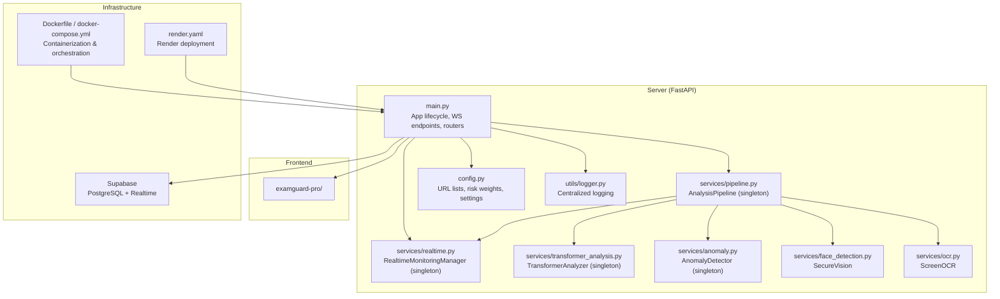
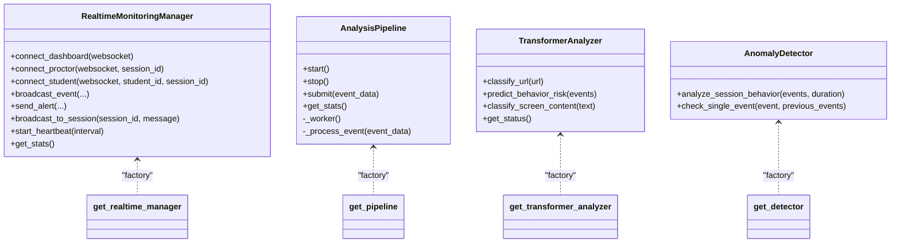
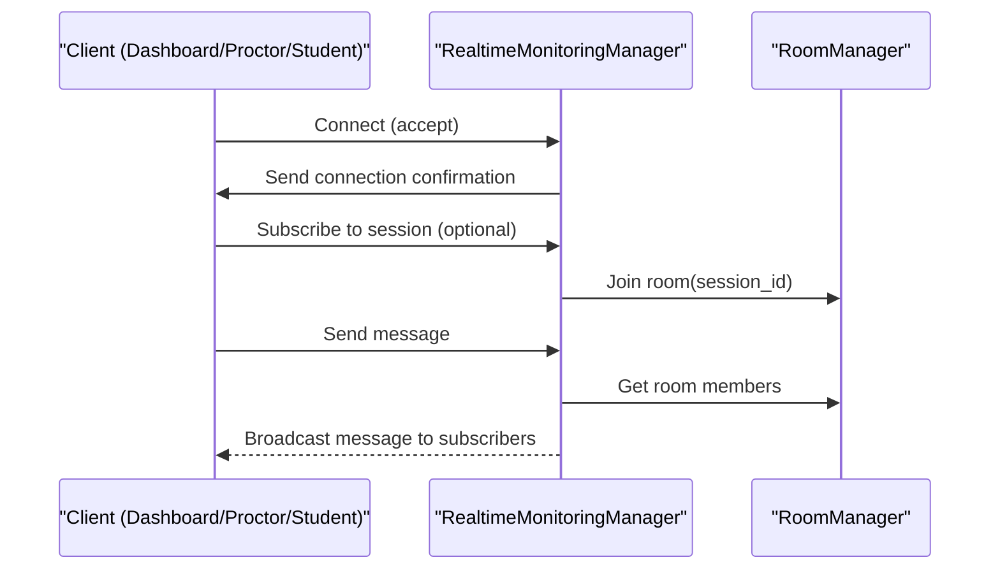
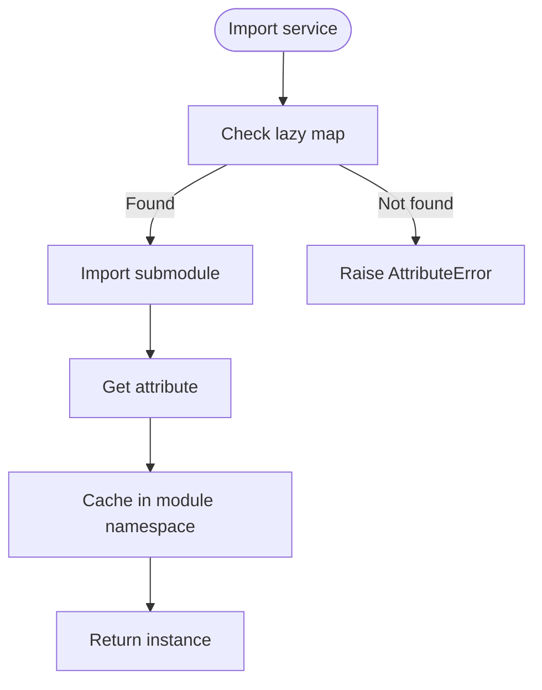
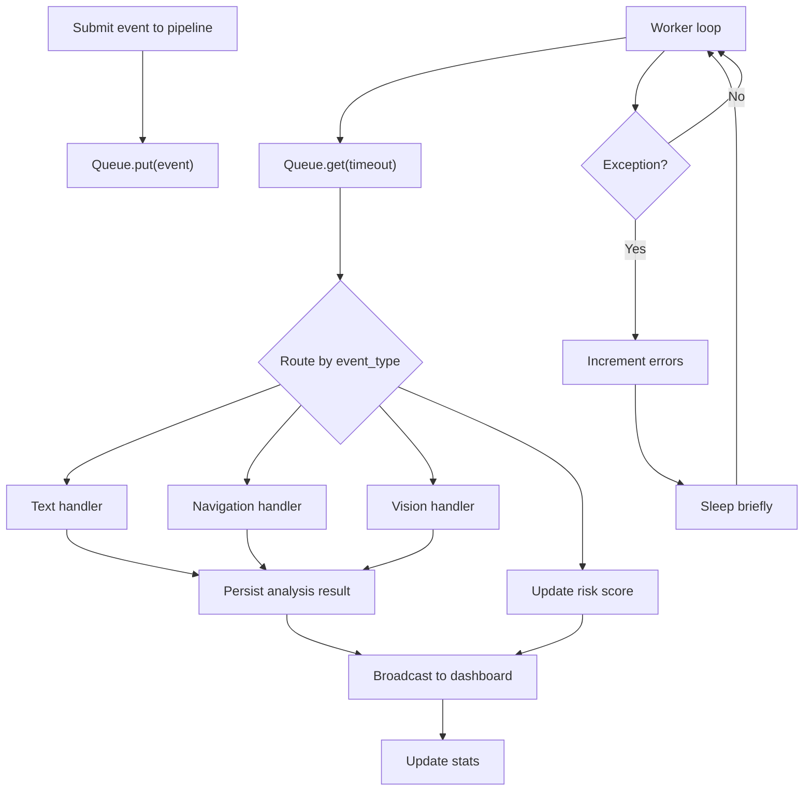
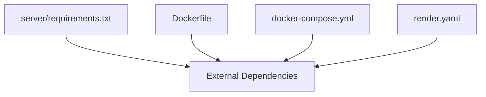

# Design Patterns

<cite>
**Referenced Files in This Document**
- [main.py](file://server/main.py)
- [pipeline.py](file://server/services/pipeline.py)
- [realtime.py](file://server/services/realtime.py)
- [transformer_analysis.py](file://server/services/transformer_analysis.py)
- [anomaly.py](file://server/services/anomaly.py)
- [face_detection.py](file://server/services/face_detection.py)
- [ocr.py](file://server/services/ocr.py)
- [config.py](file://server/config.py)
- [logger.py](file://server/utils/logger.py)
- [Dockerfile](file://Dockerfile)
- [docker-compose.yml](file://docker-compose.yml)
- [requirements.txt](file://server/requirements.txt)
- [render.yaml](file://render.yaml)
</cite>

## Table of Contents
1. [Introduction](#introduction)
2. [Project Structure](#project-structure)
3. [Core Components](#core-components)
4. [Architecture Overview](#architecture-overview)
5. [Detailed Component Analysis](#detailed-component-analysis)
6. [Dependency Analysis](#dependency-analysis)
7. [Performance Considerations](#performance-considerations)
8. [Troubleshooting Guide](#troubleshooting-guide)
9. [Conclusion](#conclusion)
10. [Appendices](#appendices)

## Introduction
This document explains the design patterns implemented in the ExamGuard Pro system and how they enable a scalable, maintainable, and extensible microservices-style architecture. The system separates concerns across:
- AI analysis services (computer vision, OCR, transformer-based NLP, anomaly detection)
- Real-time communication (WebSocket-based event broadcasting and monitoring)
- Data persistence (Supabase-backed session and analysis results)

Key patterns documented:
- Singleton for shared AI service instances and pipeline management
- Observer pattern for real-time event broadcasting and client subscriptions
- Factory pattern via lazy-imported service factories for AI modules
- Pipeline pattern for asynchronous event processing workflows

These patterns collectively improve scalability, modularity, and maintainability while supporting extensibility for new AI modules and WebSocket endpoints.

## Project Structure
The system is organized into a monorepo with a Python FastAPI backend, a React frontend, and optional extension components. The backend is structured around:
- API endpoints and routers
- Services for AI analysis, real-time monitoring, and data utilities
- Configuration and environment management
- Deployment artifacts for containerization and cloud platforms



**Diagram sources**
- [main.py:109-165](file://server/main.py#L109-L165)
- [pipeline.py:9-342](file://server/services/pipeline.py#L9-L342)
- [realtime.py:102-642](file://server/services/realtime.py#L102-L642)
- [transformer_analysis.py:178-549](file://server/services/transformer_analysis.py#L178-L549)
- [anomaly.py:11-221](file://server/services/anomaly.py#L11-L221)
- [face_detection.py:27-109](file://server/services/face_detection.py#L27-L109)
- [ocr.py:20-121](file://server/services/ocr.py#L20-L121)
- [config.py:16-205](file://server/config.py#L16-L205)
- [logger.py:1-64](file://server/utils/logger.py#L1-L64)
- [Dockerfile:1-55](file://Dockerfile#L1-L55)
- [docker-compose.yml:1-50](file://docker-compose.yml#L1-L50)
- [render.yaml:1-36](file://render.yaml#L1-L36)

**Section sources**
- [main.py:109-165](file://server/main.py#L109-L165)
- [Dockerfile:1-55](file://Dockerfile#L1-L55)
- [docker-compose.yml:1-50](file://docker-compose.yml#L1-L50)
- [render.yaml:1-36](file://render.yaml#L1-L36)

## Core Components
- AnalysisPipeline: Asynchronous event processing pipeline with a singleton instance, queue-based worker, and handlers for multiple event types. It integrates with Supabase for persistence and real-time broadcasting.
- RealtimeMonitoringManager: Central WebSocket manager implementing the observer pattern for multi-room broadcasting, alert levels, and heartbeat monitoring. Provides a singleton accessor.
- TransformerAnalyzer: Singleton AI analyzer encapsulating three transformer models (URL classification, behavioral anomaly, screen content) with dynamic loading and fallbacks.
- AnomalyDetector: Singleton rule-based anomaly detection for behavioral patterns.
- SecureVision and ScreenOCR: Computer vision and OCR services integrated into the pipeline and real-time stream processing.
- Configuration and Logging: Centralized settings, URL classification lists, risk weights, and logging utilities.

**Section sources**
- [pipeline.py:9-342](file://server/services/pipeline.py#L9-L342)
- [realtime.py:102-642](file://server/services/realtime.py#L102-L642)
- [transformer_analysis.py:178-549](file://server/services/transformer_analysis.py#L178-L549)
- [anomaly.py:11-221](file://server/services/anomaly.py#L11-L221)
- [face_detection.py:27-109](file://server/services/face_detection.py#L27-L109)
- [ocr.py:20-121](file://server/services/ocr.py#L20-L121)
- [config.py:16-205](file://server/config.py#L16-L205)
- [logger.py:1-64](file://server/utils/logger.py#L1-L64)

## Architecture Overview
The system follows a microservices-style architecture within a single process:
- API layer: FastAPI app with WebSocket endpoints and REST routers
- Service layer: AI analysis, real-time monitoring, and pipeline orchestration
- Persistence layer: Supabase for session and analysis data
- Observability: Heartbeat, stats, and centralized logging

```mermaid
graph TB
Client["Dashboard / Proctor / Student Clients"]
API["FastAPI App<br/>main.py"]
RT["RealtimeMonitoringManager<br/>realtime.py"]
PIPE["AnalysisPipeline<br/>pipeline.py"]
TA["TransformerAnalyzer<br/>transformer_analysis.py"]
AD["AnomalyDetector<br/>anomaly.py"]
CV["SecureVision<br/>face_detection.py"]
OCR["ScreenOCR<br/>ocr.py"]
CFG["Config & URLs<br/>config.py"]
LOG["Logger<br/>utils/logger.py"]
DB["Supabase DB"]
Client <- --> API
API --> RT
API --> PIPE
PIPE --> RT
PIPE --> TA
PIPE --> AD
PIPE --> CV
PIPE --> OCR
PIPE --> DB
API --> CFG
API --> LOG
RT --> DB
```

**Diagram sources**
- [main.py:248-501](file://server/main.py#L248-L501)
- [realtime.py:102-642](file://server/services/realtime.py#L102-L642)
- [pipeline.py:9-342](file://server/services/pipeline.py#L9-L342)
- [transformer_analysis.py:178-549](file://server/services/transformer_analysis.py#L178-L549)
- [anomaly.py:11-221](file://server/services/anomaly.py#L11-L221)
- [face_detection.py:27-109](file://server/services/face_detection.py#L27-L109)
- [ocr.py:20-121](file://server/services/ocr.py#L20-L121)
- [config.py:16-205](file://server/config.py#L16-L205)
- [logger.py:1-64](file://server/utils/logger.py#L1-L64)

## Detailed Component Analysis

### Singleton Pattern: AI Service Instances and Pipeline Management
- RealtimeMonitoringManager: Singleton accessed via a factory function, ensuring a single global manager for WebSocket connections, rooms, and event broadcasting.
- AnalysisPipeline: Singleton accessed via a factory function, providing a single background worker with a queue and stats.
- TransformerAnalyzer: Singleton accessed via a factory function, encapsulating three transformer models with dynamic loading and fallbacks.
- AnomalyDetector: Singleton accessed via a factory function, providing rule-based anomaly detection.



**Diagram sources**
- [realtime.py:632-642](file://server/services/realtime.py#L632-L642)
- [pipeline.py:334-342](file://server/services/pipeline.py#L334-L342)
- [transformer_analysis.py:536-549](file://server/services/transformer_analysis.py#L536-L549)
- [anomaly.py:190-221](file://server/services/anomaly.py#L190-L221)

**Section sources**
- [realtime.py:632-642](file://server/services/realtime.py#L632-L642)
- [pipeline.py:334-342](file://server/services/pipeline.py#L334-L342)
- [transformer_analysis.py:536-549](file://server/services/transformer_analysis.py#L536-L549)
- [anomaly.py:190-221](file://server/services/anomaly.py#L190-L221)

### Observer Pattern: WebSocket Real-Time Updates
- RealtimeMonitoringManager implements the observer pattern:
  - Maintains sets of connections (dashboard, proctor, student)
  - Manages rooms for session-based subscriptions
  - Broadcasts events to relevant subscribers
  - Sends alerts with severity levels
  - Provides heartbeat and event history for late-joiners



**Diagram sources**
- [realtime.py:213-274](file://server/services/realtime.py#L213-L274)
- [realtime.py:334-416](file://server/services/realtime.py#L334-L416)
- [realtime.py:81-100](file://server/services/realtime.py#L81-L100)

**Section sources**
- [realtime.py:102-642](file://server/services/realtime.py#L102-L642)

### Factory Pattern: AI Service Creation
- Lazy-loading service factories:
  - services/__init__.py maps public names to submodule attributes and lazily imports them on first access.
  - Example factories: get_transformer_analyzer, get_detector, get_ocr, get_gaze_service, etc.
- Benefits:
  - Avoids heavy model loading at import time
  - Enables modular addition of new AI modules



**Diagram sources**
- [server/services/__init__.py:35-68](file://server/services/__init__.py#L35-L68)

**Section sources**
- [server/services/__init__.py:10-68](file://server/services/__init__.py#L10-L68)

### Pipeline Pattern: Event Processing Workflows
- AnalysisPipeline orchestrates asynchronous processing:
  - Queue-based submission and background worker
  - Routing of events to specialized handlers
  - Integration with Supabase for persistence and real-time broadcasting
  - Statistics tracking and error handling



**Diagram sources**
- [pipeline.py:25-73](file://server/services/pipeline.py#L25-L73)
- [pipeline.py:74-304](file://server/services/pipeline.py#L74-L304)

**Section sources**
- [pipeline.py:9-342](file://server/services/pipeline.py#L9-L342)

### Conceptual Overview
- Microservices separation of concerns:
  - AI analysis services encapsulate computer vision, OCR, and NLP
  - Real-time communication manages WebSocket connections and event broadcasting
  - Data persistence uses Supabase for session and analysis records
- Scalability enablers:
  - Singleton managers reduce overhead and ensure consistent state
  - Asynchronous pipeline decouples producers and consumers
  - Lazy factories minimize cold-start costs
- Extensibility:
  - New AI modules can be added via the services package and lazy factory map
  - New WebSocket endpoints can be added to main.py with appropriate routing and broadcasting

[No sources needed since this section doesn't analyze specific files]

## Dependency Analysis
- External dependencies include FastAPI, Uvicorn, Supabase, OpenCV, PyTorch/TensorFlow-compatible transformers, MediaPipe, Tesseract, and others.
- Containerization packages system-level dependencies (OpenCV, Tesseract, FFmpeg) and installs Python dependencies optimized for CPU environments.
- Deployment configurations support both local Docker Compose and Render hosting.



**Diagram sources**
- [requirements.txt:1-34](file://server/requirements.txt#L1-L34)
- [Dockerfile:29-40](file://Dockerfile#L29-L40)
- [docker-compose.yml:10-26](file://docker-compose.yml#L10-L26)
- [render.yaml:10-35](file://render.yaml#L10-L35)

**Section sources**
- [requirements.txt:1-34](file://server/requirements.txt#L1-L34)
- [Dockerfile:1-55](file://Dockerfile#L1-L55)
- [docker-compose.yml:1-50](file://docker-compose.yml#L1-L50)
- [render.yaml:1-36](file://render.yaml#L1-L36)

## Performance Considerations
- Asynchronous processing: The pipeline uses asyncio queues and background tasks to prevent blocking and scale with concurrent events.
- Lazy loading: AI models are loaded on demand to reduce startup time and memory footprint.
- Singleton managers: Reuse of WebSocket and pipeline managers avoids redundant initialization.
- Resource management: Heartbeat tasks and connection cleanup help maintain stability under load.
- GPU acceleration: Transformers can leverage CUDA if available; otherwise, CPU fallback is supported.

[No sources needed since this section provides general guidance]

## Troubleshooting Guide
- Real-time connectivity:
  - Verify WebSocket endpoints accept connections and manage rooms correctly.
  - Use heartbeat messages to detect stale connections and clean them up.
- Pipeline errors:
  - Inspect error counters and logs in the pipeline stats.
  - Ensure event routing matches expected event types.
- Logging:
  - Use centralized loggers for API, analysis, and tasks.
  - Review formatted logs for structured event and analysis entries.
- Health checks:
  - Use the health endpoint to confirm AI analyzers and WebSocket stats.

**Section sources**
- [realtime.py:538-576](file://server/services/realtime.py#L538-L576)
- [pipeline.py:48-53](file://server/services/pipeline.py#L48-L53)
- [logger.py:20-64](file://server/utils/logger.py#L20-L64)
- [main.py:548-584](file://server/main.py#L548-L584)

## Conclusion
The ExamGuard Pro system leverages well-defined design patterns to achieve a clean separation of concerns and strong scalability:
- Singletons ensure consistent, shared state for real-time and AI services.
- The observer pattern enables efficient, multi-room broadcasting and subscription management.
- Factory pattern with lazy imports supports modular AI service creation and reduces startup overhead.
- The pipeline pattern decouples event producers from processors, enabling asynchronous scaling.

These patterns collectively support extensibility, maintainability, and robust operation in production environments.

[No sources needed since this section summarizes without analyzing specific files]

## Appendices

### Infrastructure Requirements and Deployment Topology
- Containerization:
  - Multi-stage build: Node.js stage for frontend, Python stage for backend.
  - System dependencies: OpenCV, Tesseract, FFmpeg.
- Orchestration:
  - Docker Compose for local development and optional embedded Postgres.
  - Render platform configuration for managed deployment.
- Database:
  - Supabase PostgreSQL with environment variables for connection and credentials.

**Section sources**
- [Dockerfile:1-55](file://Dockerfile#L1-L55)
- [docker-compose.yml:1-50](file://docker-compose.yml#L1-L50)
- [render.yaml:1-36](file://render.yaml#L1-L36)

### Technology Stack Decisions and Compatibility
- Backend: FastAPI + Uvicorn for async performance and excellent ASGI support.
- AI/ML: PyTorch-based transformer models with CPU-friendly installation.
- Vision: OpenCV and MediaPipe for face detection and landmarking.
- OCR: Tesseract with graceful fallback when unavailable.
- Real-time: WebSocket endpoints with room-based broadcasting and heartbeat.
- Persistence: Supabase for relational data and real-time features.

**Section sources**
- [requirements.txt:1-34](file://server/requirements.txt#L1-L34)
- [Dockerfile:29-40](file://Dockerfile#L29-L40)
- [render.yaml:10-35](file://render.yaml#L10-L35)

### Cross-Cutting Concerns
- Error handling:
  - Pipeline workers catch exceptions, increment error counters, and continue processing.
  - WebSocket broadcasts handle disconnections and remove stale connections.
- Logging:
  - Structured logging with separate loggers for API, analysis, and tasks.
- Resource management:
  - Heartbeat tasks keep connections alive.
  - Cleanup routines for rooms and buffers on disconnections.

**Section sources**
- [pipeline.py:67-72](file://server/services/pipeline.py#L67-L72)
- [realtime.py:275-309](file://server/services/realtime.py#L275-L309)
- [logger.py:20-64](file://server/utils/logger.py#L20-L64)