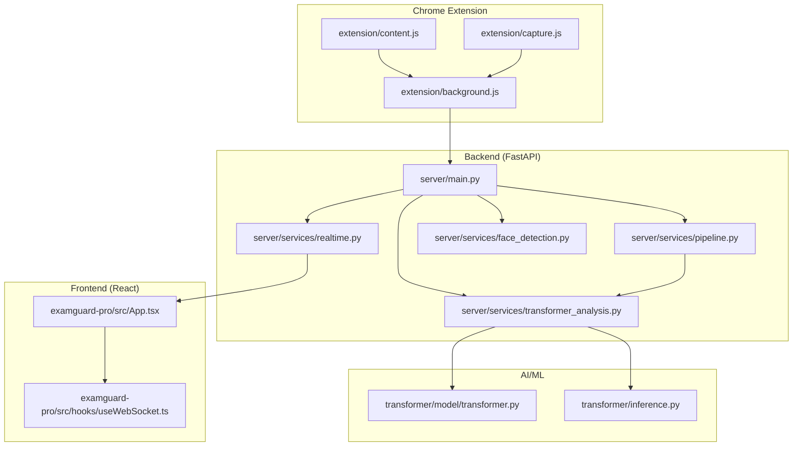
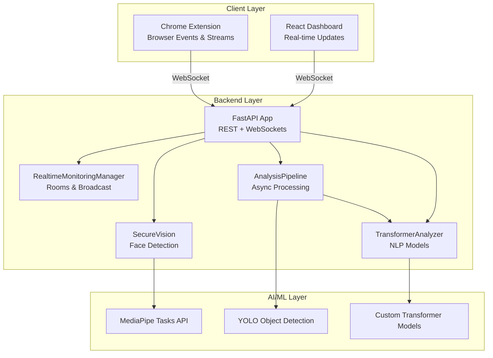
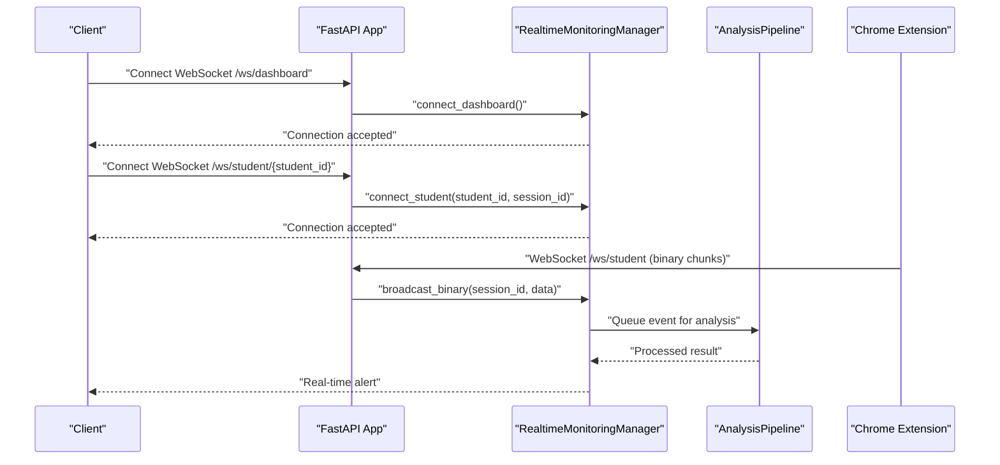
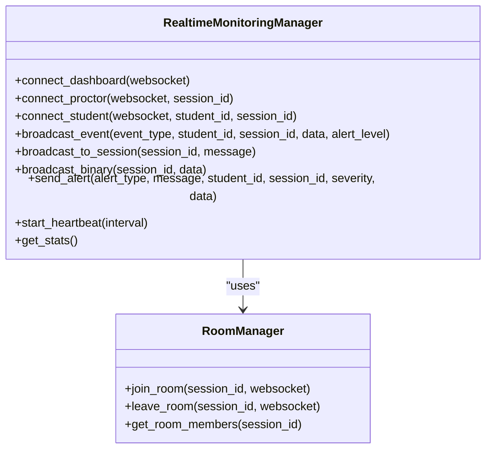
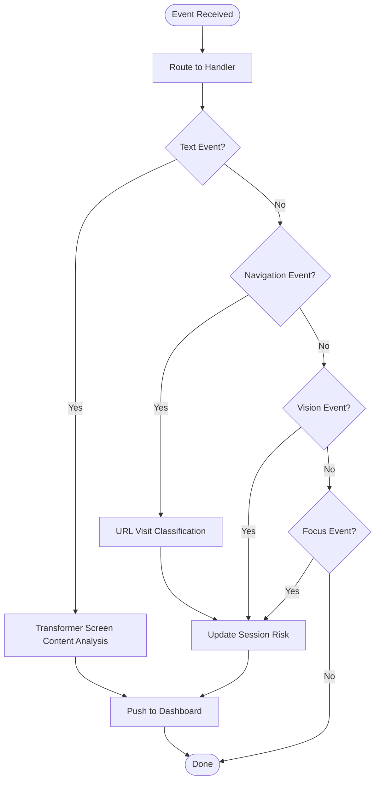
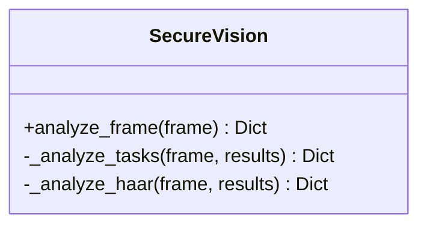
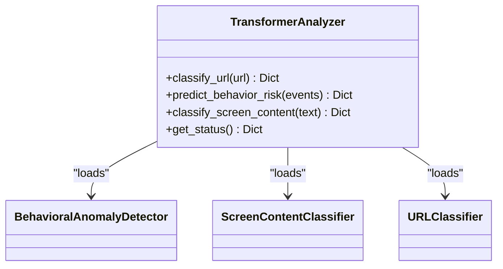
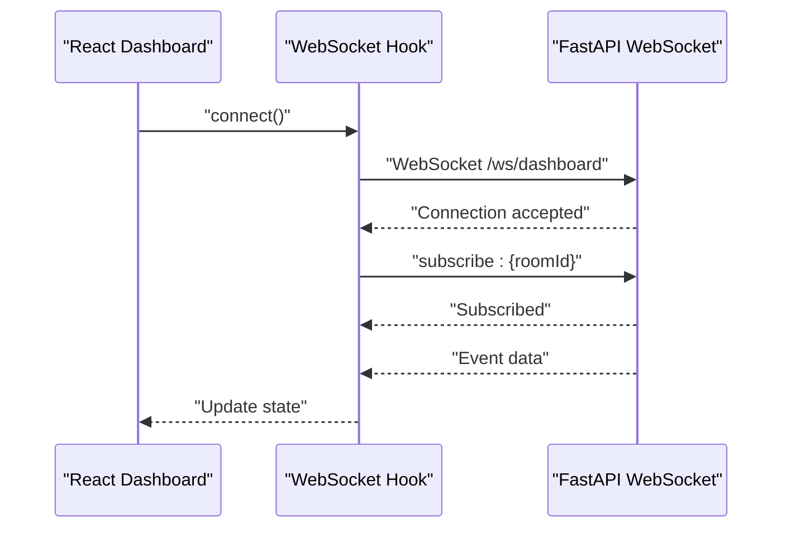
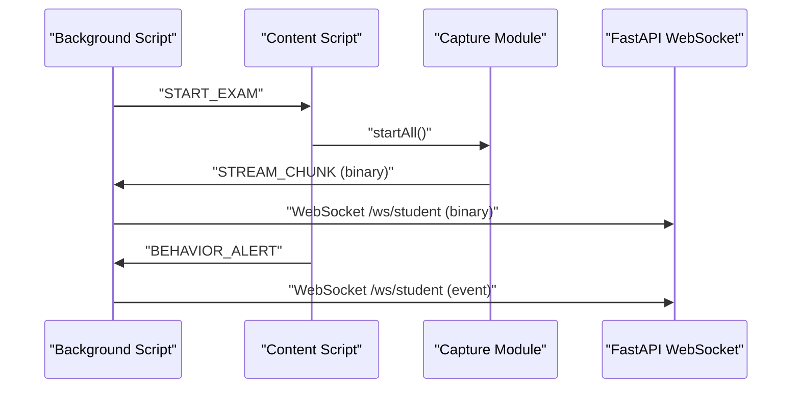
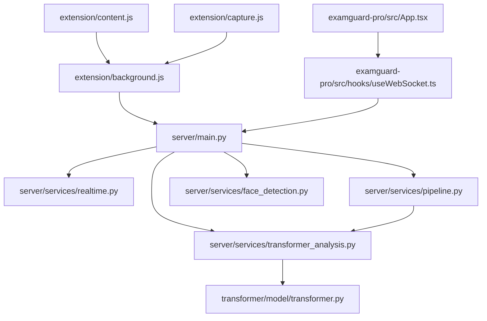

# System Overview

<cite>
**Referenced Files in This Document**
- [README.md](file://README.md)
- [server/main.py](file://server/main.py)
- [server/services/realtime.py](file://server/services/realtime.py)
- [server/services/pipeline.py](file://server/services/pipeline.py)
- [server/services/face_detection.py](file://server/services/face_detection.py)
- [server/services/transformer_analysis.py](file://server/services/transformer_analysis.py)
- [extension/background.js](file://extension/background.js)
- [extension/content.js](file://extension/content.js)
- [extension/capture.js](file://extension/capture.js)
- [transformer/model/transformer.py](file://transformer/model/transformer.py)
- [transformer/inference.py](file://transformer/inference.py)
- [examguard-pro/src/App.tsx](file://examguard-pro/src/App.tsx)
- [examguard-pro/src/hooks/useWebSocket.ts](file://examguard-pro/src/hooks/useWebSocket.ts)
</cite>

## Table of Contents
1. [Introduction](#introduction)
2. [Project Structure](#project-structure)
3. [Core Components](#core-components)
4. [Architecture Overview](#architecture-overview)
5. [Detailed Component Analysis](#detailed-component-analysis)
6. [Dependency Analysis](#dependency-analysis)
7. [Performance Considerations](#performance-considerations)
8. [Troubleshooting Guide](#troubleshooting-guide)
9. [Conclusion](#conclusion)

## Introduction
ExamGuard Pro is an AI-powered exam proctoring system designed to monitor online examinations through multi-modal analysis. It combines a FastAPI backend, a React dashboard, a Chrome extension, and AI/ML components to provide real-time monitoring, risk scoring, and alerts. The system ensures academic integrity by detecting suspicious activities such as tab switching, copy/paste, unauthorized device presence, and potentially plagiarized content.

The system’s purpose is to serve as a central coordinator (FastAPI backend) that orchestrates:
- Real-time monitoring manager (WebSocket-based)
- Analysis pipeline (multi-modal AI/ML processing)
- Secure vision engine (face detection and anomalies)
- Transformer-based NLP analysis (text and URL classification)
- Chrome extension for browser event capture and live streaming
- React dashboard for real-time visualization and control

## Project Structure
The repository is organized into four primary areas:
- server/: FastAPI backend with API endpoints, services, and real-time monitoring
- examguard-pro/: React dashboard with routing, context providers, and WebSocket integration
- extension/: Chrome extension (Manifest V3) for capturing browser events, webcam/screen streams, and WebRTC signaling
- transformer/: Custom Transformer models and training infrastructure for NLP tasks

**Diagram sources**
- [server/main.py:1-647](file://server/main.py#L1-L647)
- [server/services/realtime.py:1-642](file://server/services/realtime.py#L1-L642)
- [server/services/pipeline.py:1-342](file://server/services/pipeline.py#L1-L342)
- [server/services/face_detection.py:1-109](file://server/services/face_detection.py#L1-L109)
- [server/services/transformer_analysis.py:1-549](file://server/services/transformer_analysis.py#L1-L549)
- [extension/background.js:1-1998](file://extension/background.js#L1-L1998)
- [extension/content.js:1-473](file://extension/content.js#L1-L473)
- [extension/capture.js:1-352](file://extension/capture.js#L1-L352)
- [transformer/model/transformer.py:1-606](file://transformer/model/transformer.py#L1-L606)
- [transformer/inference.py:1-159](file://transformer/inference.py#L1-L159)
- [examguard-pro/src/App.tsx:1-92](file://examguard-pro/src/App.tsx#L1-L92)
- [examguard-pro/src/hooks/useWebSocket.ts:1-110](file://examguard-pro/src/hooks/useWebSocket.ts#L1-L110)

**Section sources**
- [README.md:1-92](file://README.md#L1-L92)

## Core Components
- FastAPI Backend (server/main.py): Central coordinator that initializes the secure vision engine, gaze service, real-time monitoring manager, and analysis pipeline. It exposes REST endpoints and WebSocket endpoints for real-time communication with the dashboard and extension.
- Real-time Monitoring Manager (server/services/realtime.py): Manages WebSocket connections, rooms, event broadcasting, and live video streaming. It integrates AI callbacks for frame extraction and anomaly detection.
- Analysis Pipeline (server/services/pipeline.py): Processes events asynchronously, performs transformer-based analysis, updates session risk scores, and pushes real-time updates to dashboards.
- Secure Vision Engine (server/services/face_detection.py): Provides face detection and anomaly detection using MediaPipe Tasks API or Haar cascades.
- Transformer Analyzer (server/services/transformer_analysis.py): Loads and runs trained Transformer models for URL classification, behavioral anomaly detection, and screen content classification.
- React Dashboard (examguard-pro/src/App.tsx, hooks/useWebSocket.ts): Provides routing, layout, and real-time WebSocket integration for live monitoring and alerts.
- Chrome Extension (extension/background.js, content.js, capture.js): Captures browser events, screen/webcam streams, and manages WebRTC signaling to the backend.

**Section sources**
- [server/main.py:110-165](file://server/main.py#L110-L165)
- [server/services/realtime.py:102-138](file://server/services/realtime.py#L102-L138)
- [server/services/pipeline.py:9-53](file://server/services/pipeline.py#L9-L53)
- [server/services/face_detection.py:27-50](file://server/services/face_detection.py#L27-L50)
- [server/services/transformer_analysis.py:178-206](file://server/services/transformer_analysis.py#L178-L206)
- [examguard-pro/src/App.tsx:67-91](file://examguard-pro/src/App.tsx#L67-L91)
- [examguard-pro/src/hooks/useWebSocket.ts:18-78](file://examguard-pro/src/hooks/useWebSocket.ts#L18-L78)
- [extension/background.js:12-19](file://extension/background.js#L12-L19)
- [extension/content.js:34-73](file://extension/content.js#L34-L73)
- [extension/capture.js:6-24](file://extension/capture.js#L6-L24)

## Architecture Overview
The system follows a multi-layered architecture:
- Backend layer: FastAPI application with middleware, routers, and WebSocket endpoints.
- Real-time layer: WebSocket-based event broadcasting and room management.
- AI/ML layer: Secure vision engine, object detection, and transformer-based NLP analysis.
- Frontend layer: React dashboard with real-time updates and controls.
- Extension layer: Chrome extension capturing browser events, screen/webcam streams, and WebRTC signaling.

**Diagram sources**
- [server/main.py:248-484](file://server/main.py#L248-L484)
- [server/services/realtime.py:102-138](file://server/services/realtime.py#L102-L138)
- [server/services/pipeline.py:74-96](file://server/services/pipeline.py#L74-L96)
- [server/services/face_detection.py:27-50](file://server/services/face_detection.py#L27-L50)
- [server/services/transformer_analysis.py:178-206](file://server/services/transformer_analysis.py#L178-L206)

## Detailed Component Analysis

### Backend Coordinator (FastAPI)
The backend initializes the secure vision engine, gaze service, real-time monitoring manager, and analysis pipeline during application startup. It registers authentication and API routers, mounts static files for uploads, and exposes health checks and statistics endpoints. WebSocket endpoints handle connections for dashboards, proctors, and students, enabling real-time alerts and live streaming.

**Diagram sources**
- [server/main.py:274-473](file://server/main.py#L274-L473)
- [server/services/realtime.py:213-273](file://server/services/realtime.py#L213-L273)
- [server/services/pipeline.py:44-66](file://server/services/pipeline.py#L44-L66)

**Section sources**
- [server/main.py:110-165](file://server/main.py#L110-L165)
- [server/main.py:248-484](file://server/main.py#L248-L484)

### Real-time Monitoring Manager
The real-time monitoring manager handles multi-room WebSocket connections, broadcasts events to dashboards and proctors, and manages live video streaming. It integrates AI callbacks for frame extraction and anomaly detection, updating session risk levels and pushing alerts to clients.

**Diagram sources**
- [server/services/realtime.py:102-138](file://server/services/realtime.py#L102-L138)
- [server/services/realtime.py:81-100](file://server/services/realtime.py#L81-L100)

**Section sources**
- [server/services/realtime.py:102-138](file://server/services/realtime.py#L102-L138)
- [server/services/realtime.py:334-403](file://server/services/realtime.py#L334-L403)

### Analysis Pipeline
The analysis pipeline processes events asynchronously, routes them to appropriate handlers, and updates session risk scores. It performs transformer-based analysis for text and URL events, updates database records, and pushes real-time updates to dashboards.

**Diagram sources**
- [server/services/pipeline.py:74-96](file://server/services/pipeline.py#L74-L96)
- [server/services/pipeline.py:97-148](file://server/services/pipeline.py#L97-L148)
- [server/services/pipeline.py:149-220](file://server/services/pipeline.py#L149-L220)
- [server/services/pipeline.py:246-277](file://server/services/pipeline.py#L246-L277)

**Section sources**
- [server/services/pipeline.py:9-53](file://server/services/pipeline.py#L9-L53)
- [server/services/pipeline.py:74-96](file://server/services/pipeline.py#L74-L96)

### Secure Vision Engine
The secure vision engine provides face detection and anomaly detection using MediaPipe Tasks API or Haar cascades. It detects multiple faces, absence of faces, and generates violations with integrity impact scores.

**Diagram sources**
- [server/services/face_detection.py:27-50](file://server/services/face_detection.py#L27-L50)

**Section sources**
- [server/services/face_detection.py:27-50](file://server/services/face_detection.py#L27-L50)

### Transformer-based NLP Analysis
The transformer analyzer loads trained models for URL classification, behavioral anomaly detection, and screen content classification. It provides risk scores and confidence levels for each classification.

**Diagram sources**
- [server/services/transformer_analysis.py:178-206](file://server/services/transformer_analysis.py#L178-L206)
- [server/services/transformer_analysis.py:54-90](file://server/services/transformer_analysis.py#L54-L90)
- [server/services/transformer_analysis.py:92-138](file://server/services/transformer_analysis.py#L92-L138)
- [server/services/transformer_analysis.py:116-138](file://server/services/transformer_analysis.py#L116-L138)

**Section sources**
- [server/services/transformer_analysis.py:178-206](file://server/services/transformer_analysis.py#L178-L206)
- [server/services/transformer_analysis.py:332-394](file://server/services/transformer_analysis.py#L332-L394)
- [server/services/transformer_analysis.py:400-468](file://server/services/transformer_analysis.py#L400-L468)
- [server/services/transformer_analysis.py:474-523](file://server/services/transformer_analysis.py#L474-L523)

### React Dashboard
The React dashboard provides routing, layout, and real-time WebSocket integration. It subscribes to specific exam rooms and displays alerts and analytics in real-time.

**Diagram sources**
- [examguard-pro/src/App.tsx:67-91](file://examguard-pro/src/App.tsx#L67-L91)
- [examguard-pro/src/hooks/useWebSocket.ts:18-78](file://examguard-pro/src/hooks/useWebSocket.ts#L18-L78)

**Section sources**
- [examguard-pro/src/App.tsx:67-91](file://examguard-pro/src/App.tsx#L67-L91)
- [examguard-pro/src/hooks/useWebSocket.ts:18-78](file://examguard-pro/src/hooks/useWebSocket.ts#L18-L78)

### Chrome Extension
The Chrome extension captures browser events, screen/webcam streams, and manages WebRTC signaling. It communicates with the background script to synchronize session state and send alerts to the backend.

**Diagram sources**
- [extension/background.js:52-166](file://extension/background.js#L52-L166)
- [extension/content.js:367-381](file://extension/content.js#L367-L381)
- [extension/capture.js:175-203](file://extension/capture.js#L175-L203)
- [server/main.py:393-473](file://server/main.py#L393-L473)

**Section sources**
- [extension/background.js:12-19](file://extension/background.js#L12-L19)
- [extension/content.js:34-73](file://extension/content.js#L34-L73)
- [extension/capture.js:6-24](file://extension/capture.js#L6-L24)
- [server/main.py:393-473](file://server/main.py#L393-L473)

## Dependency Analysis
The system exhibits clear separation of concerns:
- Backend depends on real-time manager and analysis pipeline for orchestration.
- Real-time manager depends on frame extractor and AI engines for live analysis.
- Analysis pipeline depends on transformer analyzer and database for updates.
- React dashboard depends on WebSocket hook for real-time updates.
- Chrome extension depends on background script for coordination and on capture module for media.

**Diagram sources**
- [extension/background.js:12-19](file://extension/background.js#L12-L19)
- [server/main.py:248-484](file://server/main.py#L248-L484)
- [server/services/realtime.py:102-138](file://server/services/realtime.py#L102-L138)
- [server/services/pipeline.py:74-96](file://server/services/pipeline.py#L74-L96)
- [server/services/transformer_analysis.py:178-206](file://server/services/transformer_analysis.py#L178-L206)
- [transformer/model/transformer.py:17-50](file://transformer/model/transformer.py#L17-L50)
- [examguard-pro/src/App.tsx:67-91](file://examguard-pro/src/App.tsx#L67-L91)
- [examguard-pro/src/hooks/useWebSocket.ts:18-78](file://examguard-pro/src/hooks/useWebSocket.ts#L18-L78)

**Section sources**
- [server/main.py:110-165](file://server/main.py#L110-L165)
- [server/services/realtime.py:102-138](file://server/services/realtime.py#L102-L138)
- [server/services/pipeline.py:9-53](file://server/services/pipeline.py#L9-L53)
- [server/services/transformer_analysis.py:178-206](file://server/services/transformer_analysis.py#L178-L206)
- [transformer/model/transformer.py:17-50](file://transformer/model/transformer.py#L17-L50)
- [examguard-pro/src/App.tsx:67-91](file://examguard-pro/src/App.tsx#L67-L91)
- [examguard-pro/src/hooks/useWebSocket.ts:18-78](file://examguard-pro/src/hooks/useWebSocket.ts#L18-L78)

## Performance Considerations
- Asynchronous processing: The analysis pipeline uses an asynchronous queue to process events efficiently without blocking the main thread.
- Efficient WebSocket broadcasting: The real-time manager maintains separate sets for dashboards, proctors, and students, minimizing unnecessary broadcasts.
- Adaptive capture: The extension adjusts capture quality and handles errors gracefully to reduce bandwidth and improve reliability.
- Model loading: The transformer analyzer loads models lazily and caches tokenizers to minimize initialization overhead.
- Heartbeat monitoring: The real-time manager sends periodic heartbeats to keep connections alive and monitor system health.

[No sources needed since this section provides general guidance]

## Troubleshooting Guide
Common issues and resolutions:
- WebSocket connection failures: The React WebSocket hook implements exponential backoff and reconnection attempts. Verify the WebSocket URL and network connectivity.
- Extension context invalidated: The content script catches “context invalidated” errors and stops monitoring when the extension is reloaded.
- Media permissions: Ensure screen and camera permissions are granted; the capture module handles stream end events and notifies the background script.
- AI model availability: The transformer analyzer falls back to rule-based classification if models are unavailable. Check model checkpoints and tokenizer files.
- Database connectivity: The backend uses Supabase; verify credentials and network access.

**Section sources**
- [examguard-pro/src/hooks/useWebSocket.ts:60-78](file://examguard-pro/src/hooks/useWebSocket.ts#L60-L78)
- [extension/content.js:5-26](file://extension/content.js#L5-L26)
- [extension/capture.js:113-140](file://extension/capture.js#L113-L140)
- [server/services/transformer_analysis.py:332-358](file://server/services/transformer_analysis.py#L332-L358)

## Conclusion
ExamGuard Pro provides a comprehensive, multi-modal exam proctoring solution that integrates a FastAPI backend, real-time monitoring manager, analysis pipeline, secure vision engine, and transformer-based NLP analysis with a React dashboard and Chrome extension. The system’s layered architecture enables scalable, real-time monitoring and alerting, ensuring academic integrity during online examinations.