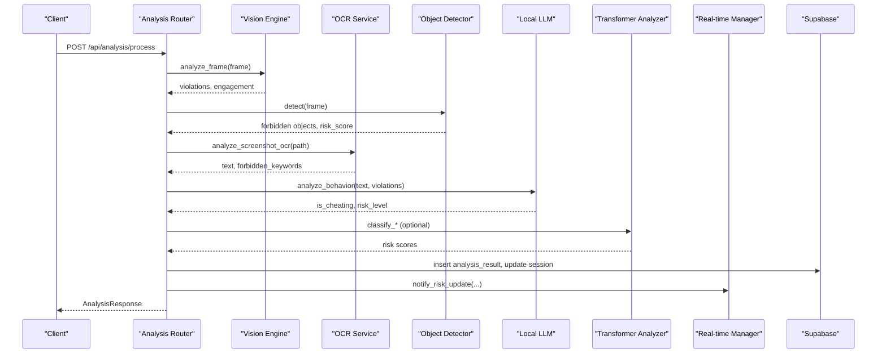
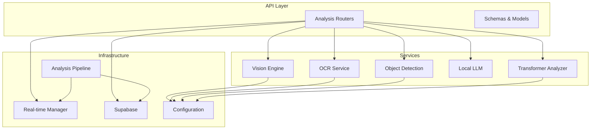

# Analysis Services API

<cite>
**Referenced Files in This Document**
- [main.py](file://server/main.py)
- [routers/analysis.py](file://server/routers/analysis.py)
- [api/endpoints/analysis.py](file://server/api/endpoints/analysis.py)
- [api/schemas/analysis.py](file://server/api/schemas/analysis.py)
- [models/analysis.py](file://server/models/analysis.py)
- [models/session.py](file://server/models/session.py)
- [models/event.py](file://server/models/event.py)
- [services/realtime.py](file://server/services/realtime.py)
- [services/ocr.py](file://server/services/ocr.py)
- [services/object_detection.py](file://server/services/object_detection.py)
- [services/llm.py](file://server/services/llm.py)
- [services/transformer_analysis.py](file://server/services/transformer_analysis.py)
- [services/pipeline.py](file://server/services/pipeline.py)
- [scoring/engine.py](file://server/scoring/engine.py)
- [config.py](file://server/config.py)
</cite>

## Table of Contents
1. [Introduction](#introduction)
2. [Project Structure](#project-structure)
3. [Core Components](#core-components)
4. [Architecture Overview](#architecture-overview)
5. [Detailed Component Analysis](#detailed-component-analysis)
6. [Dependency Analysis](#dependency-analysis)
7. [Performance Considerations](#performance-considerations)
8. [Troubleshooting Guide](#troubleshooting-guide)
9. [Conclusion](#conclusion)

## Introduction
This document provides comprehensive API documentation for ExamGuard Pro's AI analysis service endpoints focused on real-time monitoring data processing and risk assessment. It covers HTTP methods, URL patterns, request/response schemas, analysis parameters, confidence thresholds, and automated decision-making processes. It also documents integrations with computer vision services, OCR processing, and NLP analysis modules, along with examples, error handling, result interpretation, manual override capabilities, and dashboard reporting integration.

## Project Structure
The analysis service is implemented as part of a FastAPI application with modular components:
- API routers define endpoints under /api/analysis
- Services encapsulate computer vision, OCR, object detection, LLM, and transformer analysis
- Real-time monitoring integrates WebSocket broadcasting for live dashboards
- Scoring engine computes engagement, relevance, effort, and risk metrics
- Pipeline processes asynchronous events and updates session states

```mermaid
graph TB
Client["Client Applications<br/>Browser Extension / Dashboard"] --> API["FastAPI Application"]
API --> Routers["Analysis Routers<br/>/api/analysis/*"]
Routers --> Services["Analysis Services<br/>Vision / OCR / LLM / Transformers"]
Services --> Realtime["Real-time Manager<br/>WebSocket Broadcasting"]
Services --> DB["Supabase Storage"]
API --> Pipeline["Analysis Pipeline<br/>Async Event Processing"]
Pipeline --> Realtime
Pipeline --> DB
```

**Diagram sources**
- [main.py:170-187](file://server/main.py#L170-L187)
- [routers/analysis.py:29](file://server/routers/analysis.py#L29)
- [services/realtime.py:102-138](file://server/services/realtime.py#L102-L138)
- [services/pipeline.py:9-34](file://server/services/pipeline.py#L9-L34)

**Section sources**
- [main.py:170-187](file://server/main.py#L170-L187)
- [routers/analysis.py:29](file://server/routers/analysis.py#L29)

## Core Components
- Analysis Routers: Define endpoints for multi-modal analysis, dashboard data, and transformer-based analysis
- Analysis Services: Computer vision, OCR, object detection, LLM behavior analysis, and transformer classifiers
- Real-time Manager: WebSocket broadcasting for live monitoring and alerts
- Analysis Pipeline: Asynchronous processing of events and session updates
- Scoring Engine: Computes engagement, relevance, effort, and risk metrics
- Configuration: Defines forbidden keywords, URL categories, risk weights, and thresholds

**Section sources**
- [routers/analysis.py:84-291](file://server/routers/analysis.py#L84-L291)
- [api/endpoints/analysis.py:57-271](file://server/api/endpoints/analysis.py#L57-L271)
- [services/realtime.py:102-138](file://server/services/realtime.py#L102-L138)
- [services/pipeline.py:9-34](file://server/services/pipeline.py#L9-L34)
- [scoring/engine.py:373-445](file://server/scoring/engine.py#L373-L445)
- [config.py:58-196](file://server/config.py#L58-L196)

## Architecture Overview
The analysis service orchestrates multiple AI modules to evaluate real-time monitoring data and compute risk scores. It supports both direct API requests and asynchronous event-driven processing.

**Diagram sources**
- [routers/analysis.py:84-291](file://server/routers/analysis.py#L84-L291)
- [services/ocr.py:99-121](file://server/services/ocr.py#L99-L121)
- [services/object_detection.py:65-137](file://server/services/object_detection.py#L65-L137)
- [services/llm.py:28-71](file://server/services/llm.py#L28-L71)
- [services/transformer_analysis.py:332-394](file://server/services/transformer_analysis.py#L332-L394)
- [services/realtime.py:508-533](file://server/services/realtime.py#L508-L533)

## Detailed Component Analysis

### Analysis Endpoints

#### POST /api/analysis/process
- Purpose: Process webcam and screen images for multi-modal AI analysis
- Authentication: Requires API authentication (see Authentication router)
- Request Schema: AnalysisRequest
  - session_id: string (required)
  - webcam_image: base64-encoded image (optional)
  - screen_image: base64-encoded image (optional)
  - clipboard_text: string (optional)
  - timestamp: integer (required)
- Response Schema: AnalysisResponse
  - status: string
  - risk_score: number
  - face_detected: boolean
  - multiface_detected: boolean
  - phone_detected: boolean
  - looking_away: boolean
  - speaking_detected: boolean
  - is_suspicious_gaze: boolean
  - forbidden_detected: boolean
  - similarity_score: number

Processing logic:
1. Validate session existence
2. Decode base64 images to frames
3. Computer vision analysis (face detection, gaze tracking)
4. Object detection for prohibited items (e.g., cell phone)
5. OCR analysis for forbidden keywords
6. Optional LLM behavior analysis
7. Aggregate risk contributions and update session
8. Broadcast real-time updates

**Section sources**
- [routers/analysis.py:84-291](file://server/routers/analysis.py#L84-L291)
- [api/schemas/analysis.py:10-42](file://server/api/schemas/analysis.py#L10-L42)

#### GET /api/analysis/dashboard
- Purpose: Retrieve summarized student data for dashboard
- Response: Array of StudentSummary
  - total_students: integer
  - active_sessions: integer
  - average_engagement: number
  - high_risk_count: integer

**Section sources**
- [routers/analysis.py:293-341](file://server/routers/analysis.py#L293-L341)

#### GET /api/analysis/student/{student_id}
- Purpose: Get detailed analysis for a specific student
- Response: Object containing student profile and session history

**Section sources**
- [routers/analysis.py:343-363](file://server/routers/analysis.py#L343-L363)

### Transformer-Based Analysis Endpoints

#### POST /api/analysis/transformer/classify-url
- Purpose: Classify a URL into a risk category
- Request: string (URL)
- Response: URL classification result with category and risk score

#### POST /api/analysis/transformer/analyze-behavior
- Purpose: Analyze a sequence of student events for anomalous behavior
- Request: array of event objects
- Response: Behavior risk prediction with risk level and confidence

#### POST /api/analysis/transformer/classify-screen
- Purpose: Classify screenshot/OCR text into a risk category
- Request: string (text)
- Response: Screen content classification result

#### GET /api/analysis/transformer/status
- Purpose: Get Transformer analyzer status
- Response: Availability and device information

**Section sources**
- [routers/analysis.py:383-417](file://server/routers/analysis.py#L383-L417)
- [services/transformer_analysis.py:332-394](file://server/services/transformer_analysis.py#L332-L394)
- [services/transformer_analysis.py:400-468](file://server/services/transformer_analysis.py#L400-L468)
- [services/transformer_analysis.py:474-523](file://server/services/transformer_analysis.py#L474-L523)
- [services/transformer_analysis.py:525-533](file://server/services/transformer_analysis.py#L525-L533)

### Data Models and Schemas

#### AnalysisRequest
- session_id: string
- webcam_image: string (base64)
- screen_image: string (base64)
- clipboard_text: string
- timestamp: integer

#### AnalysisResponse
- status: string
- risk_score: number
- face_detected: boolean
- multiface_detected: boolean
- phone_detected: boolean
- looking_away: boolean
- speaking_detected: boolean
- is_suspicious_gaze: boolean
- forbidden_detected: boolean
- similarity_score: number

#### StudentSummary
- student_id: string
- name: string
- email: string
- department: string
- year: string
- latest_session_id: string
- risk_score: number
- engagement_score: number
- effort_alignment: number
- status: string

**Section sources**
- [api/schemas/analysis.py:10-42](file://server/api/schemas/analysis.py#L10-L42)
- [api/schemas/analysis.py:45-121](file://server/api/schemas/analysis.py#L45-L121)

### Computer Vision and Object Detection
- Vision Engine: Performs face detection and basic violations (e.g., gaze aversion)
- Gaze Tracking: Advanced analysis for suspicious gaze patterns
- Object Detection (YOLO): Detects prohibited items (e.g., cell phone) with configurable confidence thresholds

Risk scoring:
- Phone detection triggers immediate critical risk (score set to maximum)
- Other violations contribute incremental risk based on predefined weights

**Section sources**
- [routers/analysis.py:121-220](file://server/routers/analysis.py#L121-L220)
- [services/object_detection.py:65-137](file://server/services/object_detection.py#L65-L137)

### OCR and Forbidden Keyword Detection
- OCR Service: Extracts text from screenshots and detects forbidden keywords
- Forbidden keywords: Configurable list impacting risk score calculation
- Risk contribution: Proportional to number and type of detected keywords

**Section sources**
- [services/ocr.py:29-84](file://server/services/ocr.py#L29-L84)
- [config.py:58-81](file://server/config.py#L58-L81)

### Local LLM Analysis
- Optional integration with local LLM for behavior reasoning
- Analyzes extracted text and detected violations to assess cheating likelihood
- Adds risk contribution when behavior is flagged

**Section sources**
- [services/llm.py:28-71](file://server/services/llm.py#L28-L71)
- [routers/analysis.py:244-253](file://server/routers/analysis.py#L244-L253)

### Real-time Monitoring and Dashboard Integration
- WebSocket broadcasting for live updates
- Event types include risk score updates, anomalies, and alerts
- Dashboard receives real-time telemetry and can issue commands to students

**Section sources**
- [services/realtime.py:102-138](file://server/services/realtime.py#L102-L138)
- [services/realtime.py:334-402](file://server/services/realtime.py#L334-L402)
- [main.py:275-476](file://server/main.py#L275-L476)

### Analysis Pipeline
- Asynchronous processing of events (copy/paste, navigation, focus changes)
- Updates session risk scores and pushes notifications
- Supports transformer-based text analysis and plagiarism detection

**Section sources**
- [services/pipeline.py:74-304](file://server/services/pipeline.py#L74-L304)

### Scoring Engine
- Computes engagement, relevance, effort, and risk metrics
- Uses weighted aggregation of vision impacts, OCR results, anomaly detection, and browsing behavior
- Applies thresholds to determine risk levels

**Section sources**
- [scoring/engine.py:311-354](file://server/scoring/engine.py#L311-L354)
- [scoring/engine.py:373-445](file://server/scoring/engine.py#L373-L445)

## Dependency Analysis
The analysis service relies on several integrated components with clear separation of concerns:

**Diagram sources**
- [routers/analysis.py:24-27](file://server/routers/analysis.py#L24-L27)
- [services/realtime.py:102-138](file://server/services/realtime.py#L102-L138)
- [services/pipeline.py:9-34](file://server/services/pipeline.py#L9-L34)
- [config.py:58-196](file://server/config.py#L58-L196)

**Section sources**
- [routers/analysis.py:24-27](file://server/routers/analysis.py#L24-L27)
- [services/realtime.py:102-138](file://server/services/realtime.py#L102-L138)
- [services/pipeline.py:9-34](file://server/services/pipeline.py#L9-L34)

## Performance Considerations
- Asynchronous processing: OCR and LLM analysis run asynchronously to avoid blocking
- Throttling: Object detection is throttled to maintain stable frame rates
- Lazy initialization: Vision engine and advanced services are initialized on-demand
- Batch updates: Real-time manager batches WebSocket broadcasts for efficiency
- Resource limits: Configuration defines maximum image dimensions and quality to balance performance and accuracy

## Troubleshooting Guide

### Common Error Scenarios
- Session not found: Returned when session_id is invalid or expired
- Vision engine unavailable: Default values are used when vision engine is not initialized
- OCR not available: Fallback mode returns zero risk when Tesseract is not installed
- Object detection failure: Errors are caught and logged without crashing the pipeline
- LLM connection issues: Analysis continues without LLM when Ollama is unreachable

### Error Handling Patterns
- HTTP 404: Session not found during analysis processing
- HTTP 500: Internal server errors with detailed stack traces in logs
- Graceful degradation: Missing modules fall back to safe defaults
- Non-fatal database errors: Analysis results still broadcast despite storage failures

### Manual Override Capabilities
- Risk level thresholds: Configurable thresholds for safe/review/suspicious classifications
- Session status flags: Manual intervention can mark sessions as flagged
- Dashboard controls: Proctors can issue commands and alerts to students
- Configuration overrides: Environment variables control forbidden keywords and URL categories

**Section sources**
- [routers/analysis.py:96-100](file://server/routers/analysis.py#L96-L100)
- [services/ocr.py:75-84](file://server/services/ocr.py#L75-L84)
- [services/llm.py:16-26](file://server/services/llm.py#L16-L26)
- [config.py:191-196](file://server/config.py#L191-L196)

## Conclusion
ExamGuard Pro's analysis services provide a comprehensive real-time monitoring solution integrating computer vision, OCR, object detection, and NLP analysis. The modular architecture ensures scalability and maintainability while the real-time broadcasting enables immediate dashboard reporting and alert generation. The configurable risk scoring system allows fine-tuned sensitivity adjustments, and the asynchronous pipeline handles high-throughput event processing efficiently.