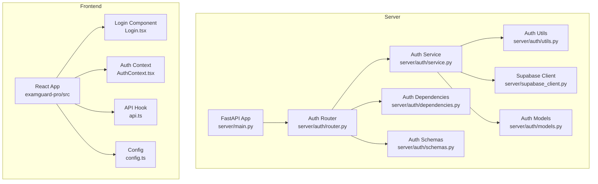
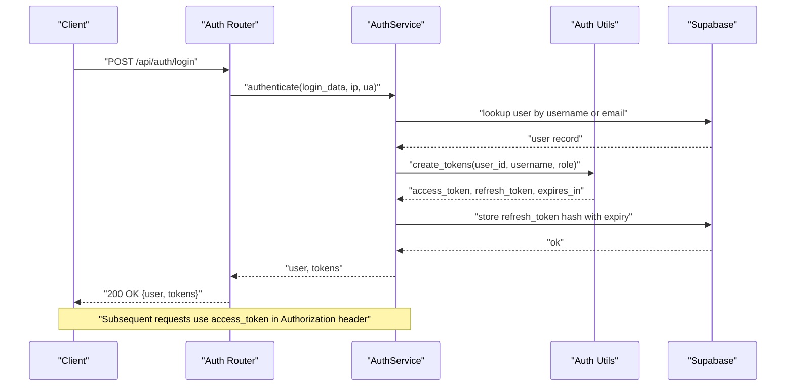
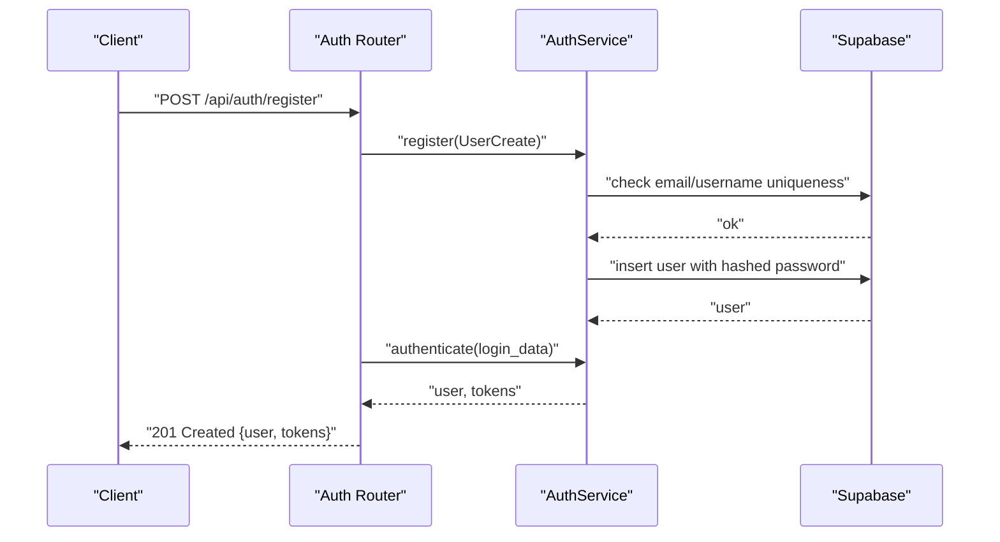
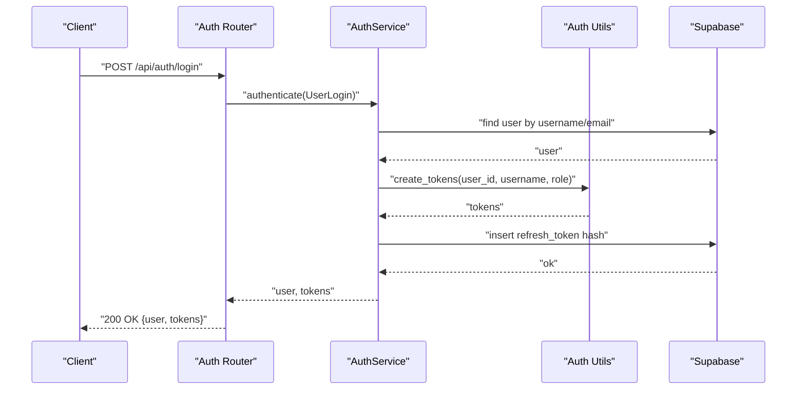
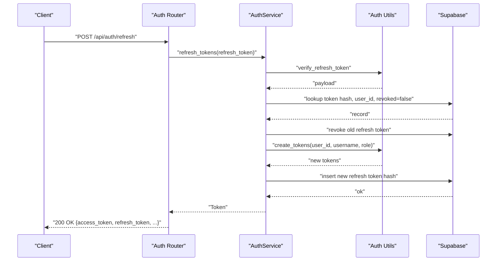
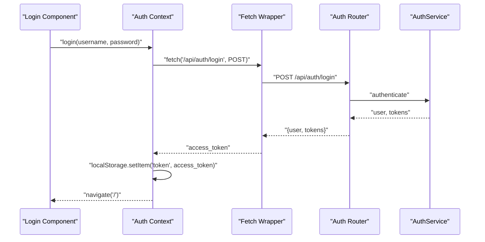
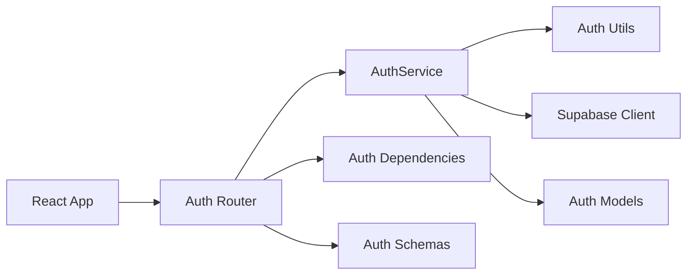

# Authentication API

<cite>
**Referenced Files in This Document**
- [router.py](file://server/auth/router.py)
- [schemas.py](file://server/auth/schemas.py)
- [service.py](file://server/auth/service.py)
- [models.py](file://server/auth/models.py)
- [utils.py](file://server/auth/utils.py)
- [dependencies.py](file://server/auth/dependencies.py)
- [config.py](file://server/auth/config.py)
- [main.py](file://server/main.py)
- [supabase_client.py](file://server/supabase_client.py)
- [Login.tsx](file://examguard-pro/src/components/Login.tsx)
- [AuthContext.tsx](file://examguard-pro/src/context/AuthContext.tsx)
- [api.ts](file://examguard-pro/src/hooks/api.ts)
- [config.ts](file://examguard-pro/src/config.ts)
</cite>

## Table of Contents
1. [Introduction](#introduction)
2. [Project Structure](#project-structure)
3. [Core Components](#core-components)
4. [Architecture Overview](#architecture-overview)
5. [Detailed Component Analysis](#detailed-component-analysis)
6. [Dependency Analysis](#dependency-analysis)
7. [Performance Considerations](#performance-considerations)
8. [Troubleshooting Guide](#troubleshooting-guide)
9. [Conclusion](#conclusion)
10. [Appendices](#appendices)

## Introduction
This document provides comprehensive API documentation for ExamGuard Pro’s authentication system. It focuses on the three primary endpoints under /api/auth:
- POST /api/auth/login
- POST /api/auth/register
- POST /api/auth/refresh

It also documents token lifecycle management, role-based access control, and integration patterns for web and mobile clients. The backend is FastAPI-based and integrates with Supabase for user and token persistence.

## Project Structure
The authentication system is implemented in the server/auth package and integrated into the main FastAPI application. The frontend React application demonstrates client-side integration.

**Diagram sources**
- [main.py](file://server/main.py#L244)
- [router.py](file://server/auth/router.py#L27)
- [service.py](file://server/auth/service.py#L22)
- [utils.py](file://server/auth/utils.py#L1)
- [dependencies.py](file://server/auth/dependencies.py#L1)
- [schemas.py](file://server/auth/schemas.py#L1)
- [models.py](file://server/auth/models.py#L1)
- [supabase_client.py](file://server/supabase_client.py#L1)
- [Login.tsx](file://examguard-pro/src/components/Login.tsx#L1)
- [AuthContext.tsx](file://examguard-pro/src/context/AuthContext.tsx#L1)
- [api.ts](file://examguard-pro/src/hooks/api.ts#L1)
- [config.ts](file://examguard-pro/src/config.ts#L1)

**Section sources**
- [main.py](file://server/main.py#L244)
- [router.py](file://server/auth/router.py#L27)

## Core Components
- Auth Router: Defines the /api/auth endpoints and delegates to the service layer.
- Auth Service: Implements registration, login, token refresh, logout, and administrative operations.
- Auth Utils: Provides JWT creation/verification, password hashing, and token storage helpers.
- Auth Dependencies: Handles bearer token extraction, user resolution, and role-based access control.
- Auth Schemas: Pydantic models for request/response validation.
- Auth Models: Enumerations and lightweight models for roles and refresh tokens.
- Supabase Client: Initializes and exposes the Supabase client for database operations.

**Section sources**
- [router.py](file://server/auth/router.py#L27)
- [service.py](file://server/auth/service.py#L22)
- [utils.py](file://server/auth/utils.py#L1)
- [dependencies.py](file://server/auth/dependencies.py#L1)
- [schemas.py](file://server/auth/schemas.py#L1)
- [models.py](file://server/auth/models.py#L1)
- [supabase_client.py](file://server/supabase_client.py#L1)

## Architecture Overview
The authentication flow integrates HTTP endpoints, service logic, and Supabase persistence. Tokens are JWT-based with separate access and refresh tokens. Access tokens are validated on each protected request; refresh tokens are persisted and rotated securely.

**Diagram sources**
- [router.py:65-89](file://server/auth/router.py#L65-L89)
- [service.py:67-140](file://server/auth/service.py#L67-L140)
- [utils.py:109-118](file://server/auth/utils.py#L109-L118)
- [supabase_client.py:19-22](file://server/supabase_client.py#L19-L22)

## Detailed Component Analysis

### Endpoint: POST /api/auth/register
- Purpose: Register a new user and automatically log them in.
- Request body: UserCreate (email, username, password, optional full_name).
- Response: AuthResponse (user, tokens).
- Behavior:
  - Validates uniqueness of email and username.
  - Creates user with hashed password and default role.
  - Immediately authenticates the user and issues tokens.
  - Stores refresh token hash with expiry and device metadata.

**Diagram sources**
- [router.py:34-56](file://server/auth/router.py#L34-L56)
- [service.py:29-65](file://server/auth/service.py#L29-L65)
- [service.py:67-140](file://server/auth/service.py#L67-L140)

**Section sources**
- [router.py:34-56](file://server/auth/router.py#L34-L56)
- [schemas.py:16-42](file://server/auth/schemas.py#L16-L42)
- [service.py:29-65](file://server/auth/service.py#L29-L65)

### Endpoint: POST /api/auth/login
- Purpose: Authenticate an existing user.
- Request body: UserLogin (username or email, password).
- Response: AuthResponse (user, tokens).
- Behavior:
  - Finds user by username or email (case-normalized).
  - Validates account lockout and activity.
  - Issues new access and refresh tokens.
  - Stores refresh token hash with expiry and device metadata.

**Diagram sources**
- [router.py:65-89](file://server/auth/router.py#L65-L89)
- [service.py:67-140](file://server/auth/service.py#L67-L140)
- [utils.py:109-118](file://server/auth/utils.py#L109-L118)

**Section sources**
- [router.py:65-89](file://server/auth/router.py#L65-L89)
- [schemas.py:44-47](file://server/auth/schemas.py#L44-L47)
- [service.py:67-140](file://server/auth/service.py#L67-L140)

### Endpoint: POST /api/auth/refresh
- Purpose: Rotate access token using a valid refresh token.
- Request body: TokenRefresh (refresh_token).
- Response: Token (access_token, refresh_token, token_type, expires_in).
- Behavior:
  - Verifies refresh token signature.
  - Confirms token exists, unrevoked, and not expired in Supabase.
  - Revokes the old refresh token and issues a new pair.
  - Updates refresh token hash and expiry.

**Diagram sources**
- [router.py:92-112](file://server/auth/router.py#L92-L112)
- [service.py:142-202](file://server/auth/service.py#L142-L202)
- [utils.py:145-154](file://server/auth/utils.py#L145-L154)

**Section sources**
- [router.py:92-112](file://server/auth/router.py#L92-L112)
- [schemas.py:114-117](file://server/auth/schemas.py#L114-L117)
- [service.py:142-202](file://server/auth/service.py#L142-L202)

### Token Management Details
- JWT Signing:
  - Algorithm: HS256.
  - Secret key: configurable via environment variable.
  - Access token expiry: configurable minutes.
  - Refresh token expiry: configurable days.
- Token Payloads:
  - Access token includes subject, username, role, type, exp, iat.
  - Refresh token includes JTI (unique identifier) for rotation safety.
- Storage:
  - Refresh tokens are stored as hashes with expiry, revocation flag, and device metadata.
- Rotation:
  - On refresh, the old refresh token is revoked and a new pair is issued.

**Section sources**
- [utils.py:14-22](file://server/auth/utils.py#L14-L22)
- [utils.py:55-106](file://server/auth/utils.py#L55-L106)
- [utils.py:121-154](file://server/auth/utils.py#L121-L154)
- [config.py:13-25](file://server/auth/config.py#L13-L25)
- [service.py:121-131](file://server/auth/service.py#L121-L131)
- [service.py:174-195](file://server/auth/service.py#L174-L195)

### Role-Based Access Control (RBAC)
- Roles:
  - admin, proctor, instructor, student.
- Protected endpoints:
  - get_current_user validates access token and checks user activity/lockout.
  - get_admin_user, get_privileged_user enforce role constraints.
- Frontend integration:
  - The dashboard demonstrates role-aware rendering and navigation.

**Section sources**
- [models.py:11-17](file://server/auth/models.py#L11-L17)
- [dependencies.py:124-158](file://server/auth/dependencies.py#L124-L158)
- [dependencies.py:28-84](file://server/auth/dependencies.py#L28-L84)

### Session Management
- Access tokens are short-lived; refresh tokens enable seamless renewal.
- Refresh tokens are persisted and rotated, supporting multi-device sessions.
- Logout endpoints:
  - /api/auth/logout revokes a single refresh token.
  - /api/auth/logout-all revokes all active refresh tokens for a user.

**Section sources**
- [router.py:115-134](file://server/auth/router.py#L115-L134)
- [service.py:204-219](file://server/auth/service.py#L204-L219)

### Request and Response Schemas
- UserCreate: email, username, password, optional full_name.
- UserLogin: username or email, password.
- UserResponse: id, email, username, full_name, role, is_active, is_verified, created_at, last_login.
- Token: access_token, refresh_token, token_type, expires_in (seconds).
- TokenRefresh: refresh_token.
- AuthResponse: user (UserResponse), tokens (Token).

**Section sources**
- [schemas.py:16-61](file://server/auth/schemas.py#L16-L61)
- [schemas.py:106-117](file://server/auth/schemas.py#L106-L117)
- [schemas.py:133-137](file://server/auth/schemas.py#L133-L137)

### Client Integration Examples

#### Web Client (React)
- Login flow:
  - Submit credentials to /api/auth/login.
  - On success, store access_token (e.g., in localStorage) and redirect to dashboard.
- Subsequent requests:
  - Include Authorization: Bearer <access_token> header.
- Logout:
  - Call /api/auth/logout with the current refresh_token to revoke it server-side.

**Diagram sources**
- [Login.tsx:12-19](file://examguard-pro/src/components/Login.tsx#L12-L19)
- [AuthContext.tsx:17-37](file://examguard-pro/src/context/AuthContext.tsx#L17-L37)
- [api.ts:4-14](file://examguard-pro/src/hooks/api.ts#L4-L14)
- [router.py:65-89](file://server/auth/router.py#L65-L89)

**Section sources**
- [Login.tsx:12-19](file://examguard-pro/src/components/Login.tsx#L12-L19)
- [AuthContext.tsx:17-37](file://examguard-pro/src/context/AuthContext.tsx#L17-L37)
- [api.ts:4-14](file://examguard-pro/src/hooks/api.ts#L4-L14)
- [config.ts:1-12](file://examguard-pro/src/config.ts#L1-L12)

### Mobile Client Guidelines
- Store access_token securely (e.g., secure storage APIs).
- Implement automatic token refresh using /api/auth/refresh when access_token is near expiry.
- On logout, call /api/auth/logout with the refresh_token to invalidate the session server-side.
- Handle network failures by retrying refresh with exponential backoff.

[No sources needed since this section provides general guidance]

### Integration Patterns with Frontend Dashboards
- SPA fallback: The backend serves the React SPA for unmatched routes, enabling clean dashboard URLs.
- WebSocket connections: The dashboard connects to real-time endpoints; authentication applies to HTTP endpoints; WebSocket connections are managed separately.

**Section sources**
- [main.py:611-634](file://server/main.py#L611-L634)

## Dependency Analysis
The authentication module exhibits clear separation of concerns:
- Router depends on Service for business logic.
- Service depends on Utils for cryptographic operations and on Supabase for persistence.
- Dependencies provide token parsing and RBAC enforcement.
- Frontend integrates via a simple fetch wrapper and context.

**Diagram sources**
- [router.py](file://server/auth/router.py#L27)
- [service.py](file://server/auth/service.py#L22)
- [utils.py](file://server/auth/utils.py#L1)
- [supabase_client.py:19-22](file://server/supabase_client.py#L19-L22)
- [dependencies.py](file://server/auth/dependencies.py#L1)
- [schemas.py](file://server/auth/schemas.py#L1)
- [models.py](file://server/auth/models.py#L1)

**Section sources**
- [router.py](file://server/auth/router.py#L27)
- [service.py](file://server/auth/service.py#L22)
- [dependencies.py](file://server/auth/dependencies.py#L1)

## Performance Considerations
- Token lifetimes: Short access tokens reduce exposure; refresh tokens enable efficient renewal.
- Supabase indexing: Ensure indexes on users (username, email) and refresh_tokens (token_hash, user_id) for optimal lookup performance.
- Password hashing rounds: Configurable bcrypt cost balances security and CPU usage.
- Rate limiting: Consider implementing rate limits for auth endpoints to mitigate brute force attacks.

[No sources needed since this section provides general guidance]

## Troubleshooting Guide
Common error scenarios and resolutions:
- Invalid credentials:
  - Symptom: 401 Unauthorized on login/register.
  - Cause: Incorrect username/email or password, or account locked/disabled.
  - Resolution: Verify credentials and account status; check failed_login_attempts and locked_until fields.
- Invalid or expired refresh token:
  - Symptom: 401 Unauthorized on /api/auth/refresh.
  - Cause: Token signature invalid, revoked, or expired.
  - Resolution: Require user to log in again to obtain a new refresh token.
- Expired access token:
  - Symptom: 401 Unauthorized on protected endpoints.
  - Cause: Access token past expiry.
  - Resolution: Use /api/auth/refresh to obtain a new access token.
- Account disabled or locked:
  - Symptom: 403 Forbidden on protected endpoints.
  - Cause: is_active false or locked_until in future.
  - Resolution: Contact administrator or wait until lockout period ends.
- Unauthorized access (RBAC):
  - Symptom: 403 Forbidden on admin endpoints.
  - Cause: Insufficient role.
  - Resolution: Ensure user has required role (admin/proctor/instructor).

**Section sources**
- [router.py:85-89](file://server/auth/router.py#L85-L89)
- [router.py:108-112](file://server/auth/router.py#L108-L112)
- [dependencies.py:62-83](file://server/auth/dependencies.py#L62-L83)
- [dependencies.py:128-132](file://server/auth/dependencies.py#L128-L132)

## Conclusion
ExamGuard Pro’s authentication system provides robust, standards-based JWT token management with secure refresh token handling and role-based access control. The modular design enables straightforward client integration across web and mobile platforms, while Supabase-backed persistence ensures scalability and reliability.

[No sources needed since this section summarizes without analyzing specific files]

## Appendices

### API Reference Summary

- POST /api/auth/register
  - Request: UserCreate
  - Response: 201 AuthResponse
  - Notes: Automatically logs in the user post-registration

- POST /api/auth/login
  - Request: UserLogin
  - Response: 200 AuthResponse

- POST /api/auth/refresh
  - Request: TokenRefresh
  - Response: 200 Token

- GET /api/auth/me
  - Response: 200 UserResponse

- PATCH /api/auth/me
  - Request: UserUpdate
  - Response: 200 UserResponse

- POST /api/auth/change-password
  - Request: PasswordChange
  - Response: 200 MessageResponse

- POST /api/auth/logout
  - Request: TokenRefresh
  - Response: 200 MessageResponse

- POST /api/auth/logout-all
  - Response: 200 MessageResponse

- GET /api/auth/users
  - Response: 200 UserListResponse

- PATCH /api/auth/users/{user_id}/role
  - Request: UserRoleUpdate
  - Response: 200 UserResponse

- DELETE /api/auth/users/{user_id}
  - Response: 200 MessageResponse

**Section sources**
- [router.py:34-56](file://server/auth/router.py#L34-L56)
- [router.py:65-89](file://server/auth/router.py#L65-L89)
- [router.py:92-112](file://server/auth/router.py#L92-L112)
- [router.py:141-146](file://server/auth/router.py#L141-L146)
- [router.py:149-175](file://server/auth/router.py#L149-L175)
- [router.py:178-198](file://server/auth/router.py#L178-L198)
- [router.py:115-134](file://server/auth/router.py#L115-L134)
- [router.py:126-134](file://server/auth/router.py#L126-L134)
- [router.py:205-235](file://server/auth/router.py#L205-L235)
- [router.py:238-256](file://server/auth/router.py#L238-L256)
- [router.py:259-281](file://server/auth/router.py#L259-L281)

### Security Considerations
- Token storage:
  - Store access_token in memory only; persist refresh_token securely.
  - Avoid logging tokens; sanitize logs.
- CSRF protection:
  - Use SameSite cookies for stateful sessions if applicable; rely on Bearer tokens for API-only flows.
- Rate limiting:
  - Enforce per-IP rate limits on /api/auth endpoints to prevent brute force.
- Secrets:
  - Change JWT_SECRET_KEY in production; rotate periodically.
- Transport:
  - Use HTTPS in production to protect tokens in transit.

[No sources needed since this section provides general guidance]