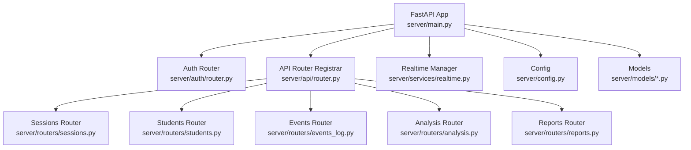
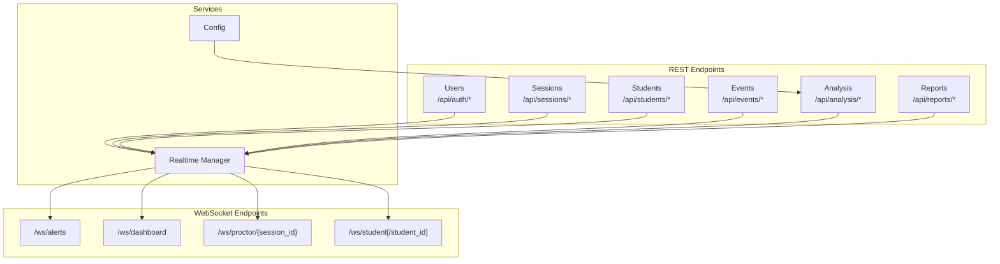
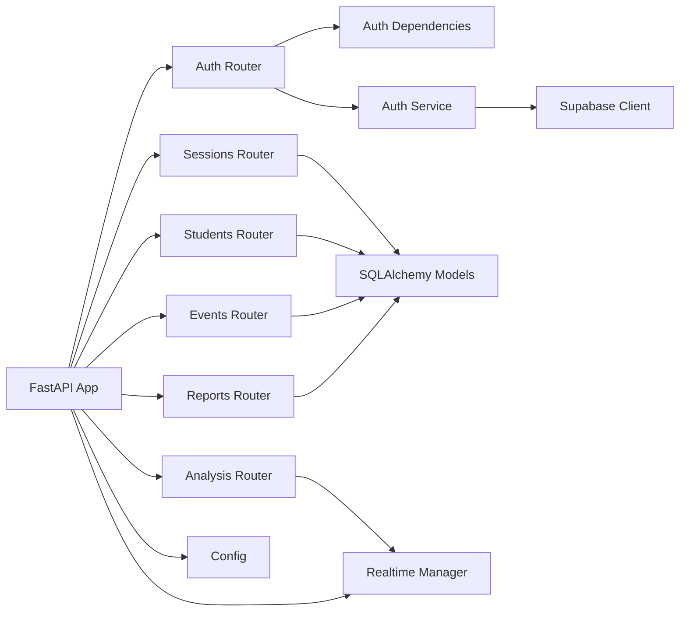
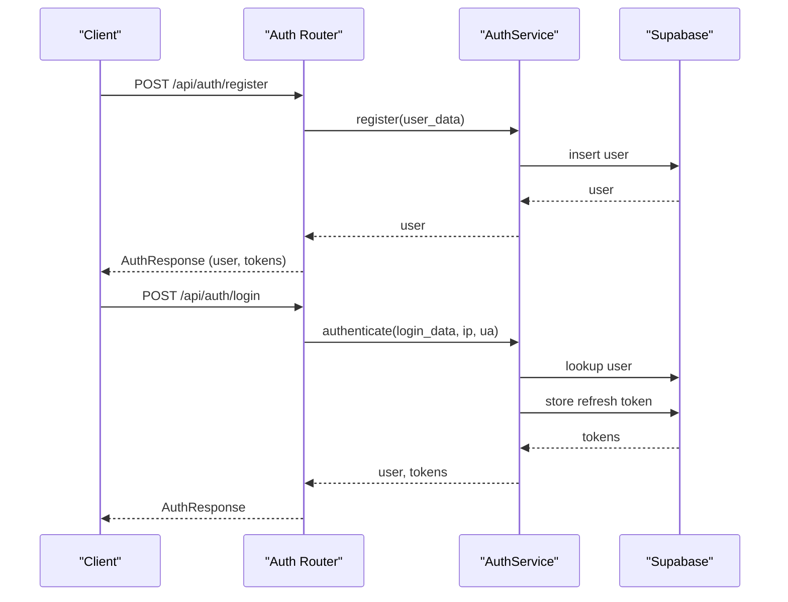
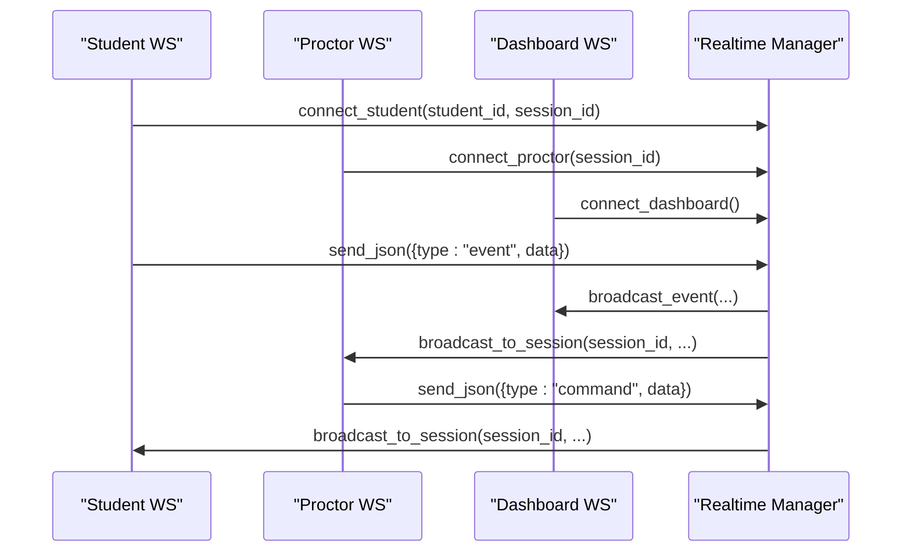

# Backend API Documentation

<cite>
**Referenced Files in This Document**
- [server/main.py](file://server/main.py)
- [server/auth/router.py](file://server/auth/router.py)
- [server/auth/dependencies.py](file://server/auth/dependencies.py)
- [server/auth/service.py](file://server/auth/service.py)
- [server/auth/models.py](file://server/auth/models.py)
- [server/auth/schemas.py](file://server/auth/schemas.py)
- [server/api/router.py](file://server/api/router.py)
- [server/config.py](file://server/config.py)
- [server/routers/students.py](file://server/routers/students.py)
- [server/routers/sessions.py](file://server/routers/sessions.py)
- [server/routers/reports.py](file://server/routers/reports.py)
- [server/routers/analysis.py](file://server/routers/analysis.py)
- [server/routers/events_log.py](file://server/routers/events_log.py)
- [server/services/realtime.py](file://server/services/realtime.py)
- [server/models/session.py](file://server/models/session.py)
- [server/models/event.py](file://server/models/event.py)
- [server/models/analysis.py](file://server/models/analysis.py)
</cite>

## Table of Contents
1. [Introduction](#introduction)
2. [Project Structure](#project-structure)
3. [Core Components](#core-components)
4. [Architecture Overview](#architecture-overview)
5. [Detailed Component Analysis](#detailed-component-analysis)
6. [Dependency Analysis](#dependency-analysis)
7. [Performance Considerations](#performance-considerations)
8. [Troubleshooting Guide](#troubleshooting-guide)
9. [Conclusion](#conclusion)
10. [Appendices](#appendices)

## Introduction
This document describes the ExamGuard Pro FastAPI backend REST API and WebSocket real-time endpoints. It covers authentication, exam session lifecycle, event logging, AI analysis integration, reports, and real-time monitoring. It also documents WebSocket endpoints for dashboards, proctors, and students, including message formats, event types, and client integration patterns. Security, rate limiting, and performance guidance are included for integrators building external systems.

## Project Structure
The backend is organized around:
- FastAPI application entrypoint and WebSocket endpoints
- Authentication module with JWT-based access and refresh tokens
- API routers for sessions, students, events, analysis, reports, and uploads
- Real-time monitoring service for WebSocket broadcasting and event aggregation
- Configuration for risk weights, URL classification, and capture settings

**Diagram sources**
- [server/main.py:170-186](file://server/main.py#L170-L186)
- [server/api/router.py:10-39](file://server/api/router.py#L10-L39)
- [server/routers/sessions.py:1-232](file://server/routers/sessions.py#L1-L232)
- [server/routers/students.py:1-220](file://server/routers/students.py#L1-L220)
- [server/routers/events_log.py:1-333](file://server/routers/events_log.py#L1-L333)
- [server/routers/analysis.py:1-418](file://server/routers/analysis.py#L1-L418)
- [server/routers/reports.py:1-207](file://server/routers/reports.py#L1-L207)
- [server/services/realtime.py:102-642](file://server/services/realtime.py#L102-L642)
- [server/config.py:1-205](file://server/config.py#L1-L205)
- [server/models/session.py:15-63](file://server/models/session.py#L15-L63)
- [server/models/event.py:6-30](file://server/models/event.py#L6-L30)
- [server/models/analysis.py:6-49](file://server/models/analysis.py#L6-L49)

**Section sources**
- [server/main.py:170-186](file://server/main.py#L170-L186)
- [server/api/router.py:10-39](file://server/api/router.py#L10-L39)

## Core Components
- FastAPI application with lifespan for initializing AI engines, pipeline, and heartbeat
- Authentication router with registration, login, token refresh, logout, and admin user management
- API routers for sessions, students, events, analysis, reports, and uploads
- Real-time monitoring manager supporting dashboards, proctors, and students with rooms and event broadcasting
- Configuration constants for risk weights, URL classification, and capture intervals

**Section sources**
- [server/main.py:109-165](file://server/main.py#L109-L165)
- [server/auth/router.py:34-294](file://server/auth/router.py#L34-L294)
- [server/api/router.py:10-39](file://server/api/router.py#L10-L39)
- [server/services/realtime.py:102-642](file://server/services/realtime.py#L102-L642)
- [server/config.py:164-205](file://server/config.py#L164-L205)

## Architecture Overview
The backend exposes REST endpoints under /api/* and WebSocket endpoints under /ws/*. Authentication is JWT-based with bearer tokens and refresh tokens stored in Supabase. Real-time monitoring uses a room-based WebSocket manager to broadcast events to dashboards, proctors, and students.

**Diagram sources**
- [server/main.py:244-507](file://server/main.py#L244-L507)
- [server/auth/router.py:34-294](file://server/auth/router.py#L34-L294)
- [server/routers/sessions.py:31-232](file://server/routers/sessions.py#L31-L232)
- [server/routers/students.py:55-220](file://server/routers/students.py#L55-L220)
- [server/routers/events_log.py:48-333](file://server/routers/events_log.py#L48-L333)
- [server/routers/analysis.py:84-418](file://server/routers/analysis.py#L84-L418)
- [server/routers/reports.py:47-207](file://server/routers/reports.py#L47-L207)
- [server/services/realtime.py:102-642](file://server/services/realtime.py#L102-L642)
- [server/config.py:164-205](file://server/config.py#L164-L205)

## Detailed Component Analysis

### Authentication Endpoints
- Base path: /api/auth
- Tags: Authentication
- Methods:
  - POST /register
    - Request: UserCreate
    - Response: AuthResponse
    - Behavior: Registers user, auto-logins, returns tokens
  - POST /login
    - Request: UserLogin
    - Response: AuthResponse
    - Behavior: Authenticates and returns tokens
  - POST /refresh
    - Request: TokenRefresh
    - Response: Token
    - Behavior: Rotates tokens using refresh token
  - POST /logout
    - Request: TokenRefresh
    - Response: MessageResponse
    - Behavior: Revokes refresh token
  - POST /logout-all
    - Response: MessageResponse
    - Behavior: Revokes all sessions for current user
  - GET /me
    - Response: UserResponse
    - Behavior: Returns current user profile
  - PATCH /me
    - Request: UserUpdate
    - Response: UserResponse
    - Behavior: Updates profile (email uniqueness enforced)
  - POST /change-password
    - Request: PasswordChange
    - Response: MessageResponse
    - Behavior: Changes password and revokes tokens
  - GET /verify-token
    - Response: MessageResponse
    - Behavior: Verifies current token validity
  - Admin endpoints:
    - GET /users?page&page_size&role
    - PATCH /users/{user_id}/role
    - DELETE /users/{user_id}

Security and Authorization:
- Bearer token required for protected endpoints
- API key supported for extension via X-API-Key header
- Role-based access control: admin, proctor, instructor, student
- Optional bypass for dashboard access in development

**Section sources**
- [server/auth/router.py:34-294](file://server/auth/router.py#L34-L294)
- [server/auth/dependencies.py:28-222](file://server/auth/dependencies.py#L28-L222)
- [server/auth/service.py:29-264](file://server/auth/service.py#L29-L264)
- [server/auth/models.py:11-50](file://server/auth/models.py#L11-L50)
- [server/auth/schemas.py:16-167](file://server/auth/schemas.py#L16-L167)

### Sessions Endpoints
- Base path: /api/sessions
- Methods:
  - POST /create
    - Request: SessionCreate
    - Response: SessionResponse
    - Behavior: Creates session; auto-creates student if missing
  - POST /{session_id}/end
    - Response: JSON with success, timestamps, and final risk score/level
    - Behavior: Ends session and calculates risk score/level
  - GET /{session_id}
    - Response: SessionSummary
    - Behavior: Retrieves session details
  - GET /
    - Query: active_only, limit
    - Response: List[SessionSummary]
    - Behavior: Lists sessions with optional filters

Notes:
- Risk score and level computed on end; engagement/content/effort alignment scores exposed
- Stats include counts for tab switches, copy events, face absences, forbidden sites, and total events

**Section sources**
- [server/routers/sessions.py:31-232](file://server/routers/sessions.py#L31-L232)
- [server/models/session.py:15-63](file://server/models/session.py#L15-L63)

### Students Endpoints
- Base path: /api/students
- Methods:
  - POST /create
    - Request: SessionCreate
    - Response: SessionResponse
    - Behavior: Creates session; auto-creates student if missing
  - POST /{session_id}/end
    - Response: JSON with success, timestamps, and final risk score/level
    - Behavior: Ends session and calculates risk score/level
  - GET /{session_id}
    - Response: SessionSummary
    - Behavior: Retrieves session details
  - GET /
    - Query: exam_id, active_only, limit
    - Response: List[SessionSummary]
    - Behavior: Lists sessions with optional filters
  - GET /all
    - Alias for listing all sessions
  - GET /{session_id}/stats
    - Response: JSON with duration, risk score/level, and event counts

**Section sources**
- [server/routers/students.py:55-220](file://server/routers/students.py#L55-L220)
- [server/models/session.py:15-63](file://server/models/session.py#L15-L63)

### Events Logging Endpoints
- Base path: /api/events
- Methods:
  - POST /log
    - Request: EventData
    - Response: EventResponse
    - Behavior: Logs a single event and updates session stats
  - POST /batch
    - Request: EventBatch
    - Response: JSON with success and counts
    - Behavior: Logs multiple events; optionally creates research journey entries; submits to pipeline
  - GET /session/{session_id}
    - Query: event_type, limit
    - Response: List[EventResponse]
    - Behavior: Retrieves events for a session
  - GET /session/{session_id}/timeline
    - Response: JSON with session_id, event_count, and timeline
    - Behavior: Full timeline ordered by ascending timestamp
  - GET /session/{session_id}/visited-sites
    - Response: JSON with categorized visited sites and flags
    - Behavior: Aggregates navigation and forbidden site events

Risk weights and categories are governed by configuration constants.

**Section sources**
- [server/routers/events_log.py:48-333](file://server/routers/events_log.py#L48-L333)
- [server/config.py:164-189](file://server/config.py#L164-L189)
- [server/models/event.py:6-30](file://server/models/event.py#L6-L30)

### Analysis and AI Integration Endpoints
- Base path: /api/analysis
- Methods:
  - POST /process
    - Request: AnalysisRequest (supports webcam_image, screen_image, clipboard_text, is_dom_capture, source_url, timestamp)
    - Response: JSON with status, risk_score, face_detected, confidence, detected_text, and vision_violations
    - Behavior: Processes webcam and screen images; saves frames; runs face detection, object detection, OCR, and optional LLM analysis; updates session risk and engagement; broadcasts risk updates
  - GET /dashboard
    - Response: List[StudentSummary]
    - Behavior: Summarized student data for dashboard
  - GET /student/{student_id}
    - Response: JSON with student and sessions
    - Behavior: Detailed analysis for a specific student
  - Transformer-based analysis:
    - POST /transformer/classify-url
      - Request: URL string
      - Response: Classification result
    - POST /transformer/analyze-behavior
      - Request: List of events
      - Response: Behavior risk prediction
    - POST /transformer/classify-screen
      - Request: Text string
      - Response: Content risk classification
    - GET /transformer/status
      - Response: Analyzer status

Notes:
- Vision engine and object detector are integrated; gaze tracking updates engagement
- Phone detection triggers critical alerts
- OCR detects forbidden keywords and reduces content relevance
- Risk score thresholds drive risk level updates

**Section sources**
- [server/routers/analysis.py:84-418](file://server/routers/analysis.py#L84-L418)
- [server/config.py:164-205](file://server/config.py#L164-L205)
- [server/models/analysis.py:6-49](file://server/models/analysis.py#L6-L49)

### Reports Endpoints
- Base path: /api/reports
- Methods:
  - GET /session/{session_id}/summary
    - Response: ReportSummary
    - Behavior: Summary report including risk breakdown and high-risk events
  - GET /session/{session_id}/json
    - Response: JSON report with session, events, analysis results, and risk thresholds
  - POST /session/{session_id}/pdf
    - Response: JSON with success and pdf_url
    - Behavior: Generates PDF report and returns downloadable URL
  - GET /flagged
    - Query: min_risk_score, limit
    - Response: JSON with flagged_count and sessions
    - Behavior: Sessions with risk scores above threshold

**Section sources**
- [server/routers/reports.py:47-207](file://server/routers/reports.py#L47-L207)

### WebSocket Endpoints
- Base path: /ws/*
- Roles: dashboard, proctor, student
- Endpoints:
  - /ws/alerts
    - Legacy endpoint for dashboard alerts
    - Supports ping/pong
  - /ws/dashboard
    - Connects dashboard; subscribes to all events; supports stats and subscribe commands
    - Commands: stats, subscribe:{session_id}, command:{payload}, webrtc:{payload}
  - /ws/proctor/{session_id}
    - Connects proctor to a specific session; supports ping and alert/command forwarding
  - /ws/student[/student_id]
    - Connects student; receives alerts and instructions; supports event reporting and WebRTC signaling
    - Binary frames: live video streaming chunks
  - /ws/stats
    - GET: Returns WebSocket connection statistics

Real-time features:
- Rooms per session for targeted broadcasting
- Event history for late-joiners
- Heartbeat messages for liveness
- Alert levels: info, warning, critical, emergency
- Event types include session lifecycle, monitoring, suspicious activity, analysis, and system events

**Section sources**
- [server/main.py:251-507](file://server/main.py#L251-L507)
- [server/services/realtime.py:102-642](file://server/services/realtime.py#L102-L642)

### Health and Info Endpoints
- GET /api/health-check
  - Response: JSON with status, service, version, and links
- GET /health
  - Response: JSON with database, WebSocket, pipeline, and AI module statuses
- GET /api/pipeline/stats
  - Response: Pipeline statistics
- GET /api
  - Response: API info and available endpoints

**Section sources**
- [server/main.py:228-237](file://server/main.py#L228-L237)
- [server/main.py:548-584](file://server/main.py#L548-L584)
- [server/main.py:587-591](file://server/main.py#L587-L591)
- [server/main.py:594-605](file://server/main.py#L594-L605)

## Dependency Analysis
- Authentication depends on Supabase for user and refresh token storage
- Real-time manager coordinates WebSocket connections and event broadcasting
- Analysis endpoints integrate face detection, object detection, OCR, and optional LLM
- Events and reports depend on SQLAlchemy models and configuration constants
- CORS is configured broadly for development and extension connectivity

**Diagram sources**
- [server/auth/router.py:34-294](file://server/auth/router.py#L34-L294)
- [server/auth/dependencies.py:28-222](file://server/auth/dependencies.py#L28-L222)
- [server/auth/service.py:29-264](file://server/auth/service.py#L29-L264)
- [server/routers/sessions.py:31-232](file://server/routers/sessions.py#L31-L232)
- [server/routers/students.py:55-220](file://server/routers/students.py#L55-L220)
- [server/routers/events_log.py:48-333](file://server/routers/events_log.py#L48-L333)
- [server/routers/analysis.py:84-418](file://server/routers/analysis.py#L84-L418)
- [server/routers/reports.py:47-207](file://server/routers/reports.py#L47-L207)
- [server/main.py:170-186](file://server/main.py#L170-L186)
- [server/services/realtime.py:102-642](file://server/services/realtime.py#L102-L642)
- [server/config.py:164-205](file://server/config.py#L164-L205)

**Section sources**
- [server/auth/router.py:34-294](file://server/auth/router.py#L34-L294)
- [server/auth/dependencies.py:28-222](file://server/auth/dependencies.py#L28-L222)
- [server/auth/service.py:29-264](file://server/auth/service.py#L29-L264)
- [server/main.py:170-186](file://server/main.py#L170-L186)

## Performance Considerations
- Real-time processing: Video chunks are relayed to dashboards and proctors; consider bandwidth and compression
- Background tasks: Risk score updates and pipeline submissions occur asynchronously
- Image handling: Screenshots and webcam frames are saved; ensure disk space and cleanup policies
- WebSocket heartbeat: Maintains liveness; tune interval for production environments
- CORS: Wildcard origins enabled for development; restrict in production deployments

[No sources needed since this section provides general guidance]

## Troubleshooting Guide
Common issues and resolutions:
- Authentication failures
  - Invalid or expired tokens: Ensure proper Bearer token usage and refresh token rotation
  - Locked accounts: Respect lockout windows and unlock policies
  - API key mismatches: Verify X-API-Key header matches configured value
- Session management
  - Session not found: Confirm session_id correctness and active status
  - Ending already-ended sessions: Endpoint returns success with final values
- WebSocket connectivity
  - Ping/Pong: Clients should respond to ping messages
  - Subscriptions: Use subscribe commands to target session rooms
  - Binary streams: Ensure proper handling of video chunks
- Real-time alerts
  - Phone detection: Critical alerts broadcast immediately upon detection
  - Risk updates: Dashboard receives periodic updates with severity levels

**Section sources**
- [server/auth/dependencies.py:28-222](file://server/auth/dependencies.py#L28-L222)
- [server/routers/sessions.py:72-127](file://server/routers/sessions.py#L72-L127)
- [server/main.py:251-507](file://server/main.py#L251-L507)
- [server/services/realtime.py:334-532](file://server/services/realtime.py#L334-L532)

## Conclusion
ExamGuard Pro provides a comprehensive backend for secure exam proctoring with REST APIs for authentication, sessions, events, analysis, and reports, plus WebSocket endpoints for real-time monitoring. The system integrates AI modules for face detection, object detection, OCR, and optional LLM analysis, and offers robust real-time broadcasting with rooms and alerting. Integrators should focus on proper authentication, efficient event batching, and resilient WebSocket handling for production deployments.

[No sources needed since this section summarizes without analyzing specific files]

## Appendices

### Authentication Flow (JWT)

**Diagram sources**
- [server/auth/router.py:34-124](file://server/auth/router.py#L34-L124)
- [server/auth/service.py:29-140](file://server/auth/service.py#L29-L140)

### Real-Time Event Broadcasting

**Diagram sources**
- [server/main.py:344-473](file://server/main.py#L344-L473)
- [server/services/realtime.py:213-377](file://server/services/realtime.py#L213-L377)

### Request/Response Schemas Overview
- Authentication
  - UserCreate, UserLogin, UserResponse, Token, TokenRefresh, AuthResponse, MessageResponse, PasswordChange, UserUpdate, UserRoleUpdate, UserListResponse
- Sessions
  - SessionCreate, SessionResponse, SessionSummary
- Events
  - EventData, EventBatch, EventResponse
- Analysis
  - AnalysisRequest, DashboardStats, StudentSummary, TextAnalysisRequest, PlagiarismCheckRequest, MultiAnswerRequest
- Reports
  - ReportRequest, ReportSummary
- Models
  - ExamSession, Event, AnalysisResult

**Section sources**
- [server/auth/schemas.py:16-167](file://server/auth/schemas.py#L16-L167)
- [server/routers/sessions.py:22-51](file://server/routers/sessions.py#L22-L51)
- [server/routers/events_log.py:26-44](file://server/routers/events_log.py#L26-L44)
- [server/routers/analysis.py:34-60](file://server/routers/analysis.py#L34-L60)
- [server/routers/reports.py:28-43](file://server/routers/reports.py#L28-L43)
- [server/models/session.py:15-63](file://server/models/session.py#L15-L63)
- [server/models/event.py:6-30](file://server/models/event.py#L6-L30)
- [server/models/analysis.py:6-49](file://server/models/analysis.py#L6-L49)

### Security and Rate Limiting
- Authentication
  - Bearer token scheme; optional API key for extensions
  - Role-based access control helpers
- Rate limiting
  - No explicit middleware implemented; consider adding rate limiting for login/register endpoints
- CORS
  - Broadly permissive for development; adjust origins in production

**Section sources**
- [server/auth/dependencies.py:17-222](file://server/auth/dependencies.py#L17-L222)
- [server/main.py:192-222](file://server/main.py#L192-L222)

### API Versioning
- API title and version are set in the FastAPI app definition
- Current version: 2.0.0

**Section sources**
- [server/main.py:170-186](file://server/main.py#L170-L186)