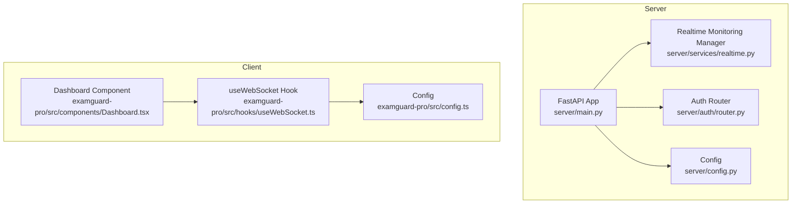
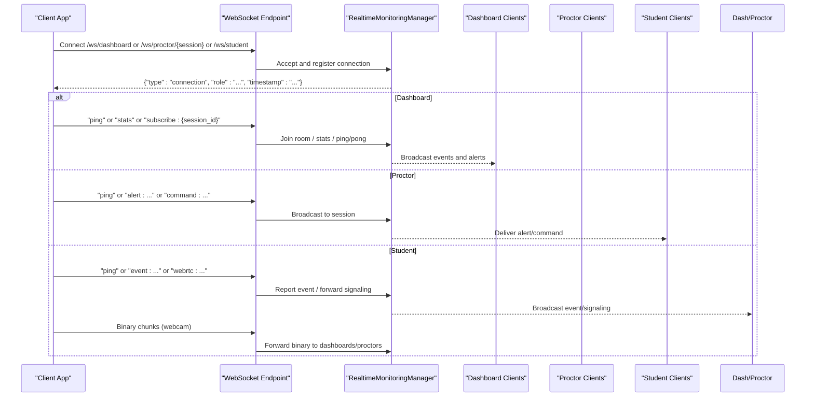
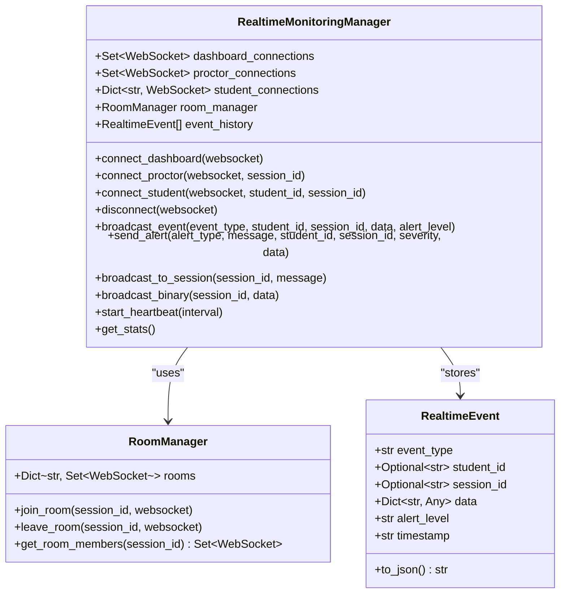
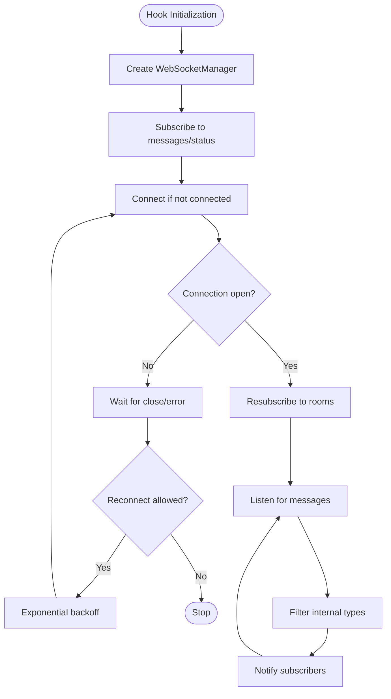
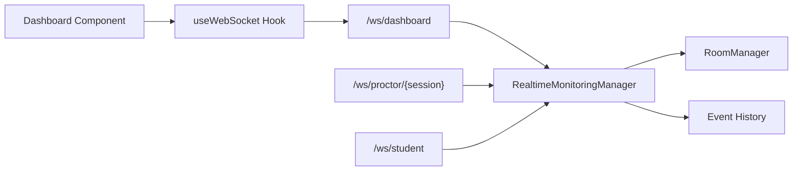

# Events & WebSocket API

<cite>
**Referenced Files in This Document**
- [server/main.py](file://server/main.py)
- [server/services/realtime.py](file://server/services/realtime.py)
- [server/api/schemas/event.py](file://server/api/schemas/event.py)
- [server/auth/router.py](file://server/auth/router.py)
- [server/config.py](file://server/config.py)
- [examguard-pro/src/hooks/useWebSocket.ts](file://examguard-pro/src/hooks/useWebSocket.ts)
- [examguard-pro/src/config.ts](file://examguard-pro/src/config.ts)
- [examguard-pro/src/components/Dashboard.tsx](file://examguard-pro/src/components/Dashboard.tsx)
</cite>

## Table of Contents
1. [Introduction](#introduction)
2. [Project Structure](#project-structure)
3. [Core Components](#core-components)
4. [Architecture Overview](#architecture-overview)
5. [Detailed Component Analysis](#detailed-component-analysis)
6. [Dependency Analysis](#dependency-analysis)
7. [Performance Considerations](#performance-considerations)
8. [Troubleshooting Guide](#troubleshooting-guide)
9. [Conclusion](#conclusion)
10. [Appendices](#appendices)

## Introduction
This document specifies the WebSocket communication protocol for ExamGuard Pro, focusing on real-time event streaming and bidirectional communication across three roles:
- Dashboard: centralized monitoring and alert viewing
- Proctor: session-scoped monitoring and control
- Student: event reporting and instruction reception

It covers connection handling, message formats, event types, room management, authentication prerequisites, broadcasting semantics, and client integration patterns. It also documents reconnection strategies, error handling, security considerations, rate limiting, and scalability patterns for high-concurrency exam monitoring.

## Project Structure
The WebSocket implementation spans the backend FastAPI server and the frontend React client:
- Backend: WebSocket endpoints and real-time manager
- Frontend: WebSocket client hook and configuration

**Diagram sources**
- [server/main.py:275-503](file://server/main.py#L275-L503)
- [server/services/realtime.py:102-643](file://server/services/realtime.py#L102-L643)
- [server/auth/router.py:1-294](file://server/auth/router.py#L1-L294)
- [server/config.py:1-205](file://server/config.py#L1-L205)
- [examguard-pro/src/hooks/useWebSocket.ts:1-175](file://examguard-pro/src/hooks/useWebSocket.ts#L1-L175)
- [examguard-pro/src/config.ts:1-12](file://examguard-pro/src/config.ts#L1-L12)
- [examguard-pro/src/components/Dashboard.tsx:1-427](file://examguard-pro/src/components/Dashboard.tsx#L1-L427)

**Section sources**
- [server/main.py:275-503](file://server/main.py#L275-L503)
- [server/services/realtime.py:102-643](file://server/services/realtime.py#L102-L643)
- [server/auth/router.py:1-294](file://server/auth/router.py#L1-L294)
- [server/config.py:1-205](file://server/config.py#L1-L205)
- [examguard-pro/src/hooks/useWebSocket.ts:1-175](file://examguard-pro/src/hooks/useWebSocket.ts#L1-L175)
- [examguard-pro/src/config.ts:1-12](file://examguard-pro/src/config.ts#L1-L12)
- [examguard-pro/src/components/Dashboard.tsx:1-427](file://examguard-pro/src/components/Dashboard.tsx#L1-L427)

## Core Components
- WebSocket endpoints
  - /ws/dashboard: dashboard receives all events and supports stats, ping, and room subscription
  - /ws/proctor/{session_id}: proctor receives only session-scoped events and can broadcast commands/alerts to students
  - /ws/student: student reports UI events and receives instructions/alerts; supports binary streaming for webcam
- Realtime monitoring manager
  - Manages connection pools for dashboard, proctor, and student
  - Implements room-based broadcasting and event history
  - Provides convenience methods for common events and alerts
- Client integration
  - React WebSocket hook with exponential backoff and room subscription
  - Automatic re-subscription on reconnect
  - Ping/pong and stats retrieval for dashboard

**Section sources**
- [server/main.py:275-503](file://server/main.py#L275-L503)
- [server/services/realtime.py:102-643](file://server/services/realtime.py#L102-L643)
- [examguard-pro/src/hooks/useWebSocket.ts:1-175](file://examguard-pro/src/hooks/useWebSocket.ts#L1-L175)

## Architecture Overview
The system uses FastAPI WebSocket endpoints backed by a central RealtimeMonitoringManager. Connections are categorized by role and optionally scoped to sessions via rooms. Events are broadcast to relevant subscribers, and binary video chunks are forwarded to dashboards and proctors.

**Diagram sources**
- [server/main.py:275-503](file://server/main.py#L275-L503)
- [server/services/realtime.py:213-417](file://server/services/realtime.py#L213-L417)

## Detailed Component Analysis

### WebSocket Endpoints and Roles

#### /ws/dashboard
- Purpose: Central dashboard receives all events and can manage subscriptions and stats.
- Commands:
  - "ping": responds with {"type":"pong", "timestamp": "..."}
  - "stats": responds with {"type":"stats", "data": {...}}
  - "subscribe:{session_id}": join a session room
  - "command:{json}": broadcast command to session (routing via session_id or student_id)
  - "webrtc:{json}": route signaling to a specific student
- Behavior:
  - On connect, sends a connection confirmation with role and timestamp
  - Sends recent event history to new connections
  - Supports ping/pong and stats queries

**Section sources**
- [server/main.py:275-343](file://server/main.py#L275-L343)
- [server/services/realtime.py:213-229](file://server/services/realtime.py#L213-L229)

#### /ws/proctor/{session_id}
- Purpose: Proctor monitors a specific session and can send alerts/commands to students.
- Commands:
  - "ping": responds with {"type":"pong"}
  - "alert:{json}": broadcasts a proctor alert to students in the session
  - "command:{json}": broadcasts a command to students in the session
- Behavior:
  - On connect, registers with the session room and role
  - Maintains session-scoped visibility

**Section sources**
- [server/main.py:345-391](file://server/main.py#L345-L391)
- [server/services/realtime.py:232-247](file://server/services/realtime.py#L232-L247)

#### /ws/student
- Purpose: Student reports UI events and receives instructions/alerts; supports binary webcam streaming.
- Commands:
  - "ping": responds with {"type":"pong"}
  - "event:{json}": reports UI events (e.g., tab_switch, copy, paste, blur)
  - "webrtc:{json}": forwards signaling to dashboards for the session
- Binary streaming:
  - Receives webcam frames as bytes and forwards to dashboards/proctors
- Behavior:
  - On connect, registers with student_id and session_id
  - Broadcasts STUDENT_JOINED on connect
  - Broadcasts STUDENT_LEFT and marks session inactive on disconnect

**Section sources**
- [server/main.py:394-503](file://server/main.py#L394-L503)
- [server/services/realtime.py:249-273](file://server/services/realtime.py#L249-L273)

### Realtime Monitoring Manager
- Connection pools:
  - dashboard_connections: global dashboard clients
  - proctor_connections: session-scoped proctor clients
  - student_connections: student_id -> WebSocket mapping
- Rooms:
  - RoomManager organizes session_id -> connections
  - join_room/leave_room/get_room_members
- Broadcasting:
  - broadcast_event: emits to dashboards and session proctors; stores in history
  - broadcast_to_session: emits to all in room
  - broadcast_binary: forwards video chunks to dashboards and session proctors
  - send_alert: convenience wrapper around broadcast_event
- Heartbeat:
  - start_heartbeat: periodic heartbeat to dashboards with stats
- Statistics:
  - get_stats: connection counts, event counts, active rooms

**Diagram sources**
- [server/services/realtime.py:102-643](file://server/services/realtime.py#L102-L643)

**Section sources**
- [server/services/realtime.py:102-643](file://server/services/realtime.py#L102-L643)

### Event Types and Message Formats
- Event types enumerate session lifecycle, monitoring, suspicious activity, advanced detections, analysis outcomes, system events, and heartbeat.
- Messages include standardized fields:
  - event_type or type
  - student_id and session_id when applicable
  - data payload
  - alert_level for severity
  - timestamp

Common event categories:
- Session: session_started, session_ended, student_joined, student_left
- Monitoring: face_detected, face_missing, multiple_faces
- Suspicious activity: tab_switch, copy_paste, screenshot_attempt, window_blur
- Advanced detection: gaze_aversion, mouth_movement, behavior_violation, question_leak, network_change, device_mismatch
- Analysis: plagiarism_detected, anomaly_detected, low_engagement, unusual_behavior, object_detected
- System: risk_score_update, alert_triggered, report_generated
- Heartbeat: heartbeat

**Section sources**
- [server/services/realtime.py:24-65](file://server/services/realtime.py#L24-L65)

### Client Integration Patterns

#### Frontend WebSocket Hook
- Singleton WebSocketManager manages a single WebSocket connection to /ws/dashboard.
- Subscriptions:
  - subscribe(callback): registers message handlers
  - subscribeStatus(callback): tracks connection state
  - subscribeRoom(roomId)/unsubscribeRoom(roomId): room-based filtering
- Reconnection:
  - Exponential backoff with capped delay
  - Automatic re-subscription to rooms on reconnect
- Message handling:
  - Filters out internal types (connection, heartbeat, pong, subscribed)
  - Maintains recent message buffer

**Diagram sources**
- [examguard-pro/src/hooks/useWebSocket.ts:1-175](file://examguard-pro/src/hooks/useWebSocket.ts#L1-L175)

**Section sources**
- [examguard-pro/src/hooks/useWebSocket.ts:1-175](file://examguard-pro/src/hooks/useWebSocket.ts#L1-L175)
- [examguard-pro/src/config.ts:1-12](file://examguard-pro/src/config.ts#L1-L12)
- [examguard-pro/src/components/Dashboard.tsx:1-427](file://examguard-pro/src/components/Dashboard.tsx#L1-L427)

### Message Protocols and Examples

#### Dashboard Protocol
- Establish connection to /ws/dashboard
- Send "ping" to verify connectivity; expect {"type":"pong", "timestamp": "..."}
- Send "stats" to retrieve stats; expect {"type":"stats", "data": {...}}
- Send "subscribe:{session_id}" to join a session room; expect {"type":"subscribed", "session_id": "..."}
- Send "command:{...}" to broadcast to session; payload should include routing info (e.g., session_id or student_id)
- Send "webrtc:{...}" to route signaling to a specific student; payload includes target and signaling data

#### Proctor Protocol
- Establish connection to /ws/proctor/{session_id}
- Send "ping" to verify connectivity; expect {"type":"pong"}
- Send "alert:{...}" to broadcast a proctor alert to students in the session
- Send "command:{...}" to broadcast a command to students in the session

#### Student Protocol
- Establish connection to /ws/student with optional query parameters (student_id, session_id)
- Send "ping" to verify connectivity; expect {"type":"pong"}
- Send "event:{...}" to report UI events; supported types include tab_switch, copy, paste, blur
- Send "webrtc:{...}" to forward signaling to dashboards for the session
- Receive binary webcam frames and process them accordingly

**Section sources**
- [server/main.py:275-503](file://server/main.py#L275-L503)
- [server/services/realtime.py:213-417](file://server/services/realtime.py#L213-L417)

## Dependency Analysis
- Backend dependencies:
  - FastAPI WebSocket endpoints depend on RealtimeMonitoringManager for connection and broadcasting
  - Heartbeat and stats rely on manager’s internal state
- Frontend dependencies:
  - useWebSocket depends on config.wsUrl and maintains singleton connection
  - Dashboard component subscribes to messages and displays alerts

**Diagram sources**
- [server/main.py:275-503](file://server/main.py#L275-L503)
- [server/services/realtime.py:81-137](file://server/services/realtime.py#L81-L137)
- [examguard-pro/src/hooks/useWebSocket.ts:1-175](file://examguard-pro/src/hooks/useWebSocket.ts#L1-L175)

**Section sources**
- [server/main.py:275-503](file://server/main.py#L275-L503)
- [server/services/realtime.py:81-137](file://server/services/realtime.py#L81-L137)
- [examguard-pro/src/hooks/useWebSocket.ts:1-175](file://examguard-pro/src/hooks/useWebSocket.ts#L1-L175)

## Performance Considerations
- Connection scaling:
  - Use room-based broadcasting to minimize fan-out to non-relevant clients
  - Separate global dashboard connections from session-scoped connections
- Binary streaming:
  - Forward webcam chunks directly to dashboards/proctors to reduce duplication
- Event history:
  - Maintain bounded event history to limit memory usage
- Heartbeat:
  - Periodic heartbeats help detect dead connections promptly
- Concurrency:
  - Leverage asyncio for non-blocking I/O and broadcasting
- Rate limiting:
  - Apply rate limits at the API layer for non-WebSocket endpoints (see Authentication configuration)

[No sources needed since this section provides general guidance]

## Troubleshooting Guide
- Connection drops:
  - Client automatically attempts exponential backoff reconnection
  - On close, client checks event code; normal closures do not trigger retries
- Message queuing:
  - Client filters internal message types; ensure your app ignores connection, heartbeat, pong, and subscribed messages
- Client disconnection:
  - On student disconnect, broadcast STUDENT_LEFT and update session status in the database
- Error handling:
  - Server catches WebSocketDisconnect and runtime exceptions; cleans up connections
  - Broadcasting failures remove dead sockets from pools

**Section sources**
- [server/main.py:340-342](file://server/main.py#L340-L342)
- [server/main.py:473-502](file://server/main.py#L473-L502)
- [server/services/realtime.py:589-601](file://server/services/realtime.py#L589-L601)
- [examguard-pro/src/hooks/useWebSocket.ts:56-73](file://examguard-pro/src/hooks/useWebSocket.ts#L56-L73)

## Conclusion
ExamGuard Pro’s WebSocket API provides a robust, room-scoped, and event-rich communication backbone for real-time exam monitoring. The backend offers role-specific endpoints with clear command semantics, while the frontend integrates seamlessly with a resilient client hook supporting reconnection and room subscriptions. Security and scalability are addressed through structured broadcasting, heartbeat monitoring, and separation of concerns across roles.

[No sources needed since this section summarizes without analyzing specific files]

## Appendices

### WebSocket Endpoint Reference
- /ws/dashboard
  - Role: dashboard
  - Commands: ping, stats, subscribe:{session_id}, command:{...}, webrtc:{...}
  - Notes: receives all events; room subscription supported
- /ws/proctor/{session_id}
  - Role: proctor
  - Commands: ping, alert:{...}, command:{...}
  - Notes: session-scoped visibility and control
- /ws/student
  - Role: student
  - Commands: ping, event:{...}, webrtc:{...}
  - Binary: webcam frames as bytes
  - Notes: reports UI events; receives instructions/alerts

**Section sources**
- [server/main.py:275-503](file://server/main.py#L275-L503)

### Event Model Reference
- EventCreate: used for batch event submissions
- EventData: individual event item with type, timestamp, data, id
- EventBatch: collection of events for a session
- EventResponse: standardized response for event creation

**Section sources**
- [server/api/schemas/event.py:10-63](file://server/api/schemas/event.py#L10-L63)

### Security and Rate Limiting
- Authentication:
  - Use dedicated authentication endpoints to obtain tokens before accessing protected features
- Rate limiting:
  - Authentication endpoints enforce stricter limits; general API rate limits apply
- CORS:
  - Wildcard origins configured for development and extension support

**Section sources**
- [server/auth/router.py:1-294](file://server/auth/router.py#L1-L294)
- [server/auth/config.py:86-95](file://server/auth/config.py#L86-L95)
- [server/config.py:48-49](file://server/config.py#L48-L49)