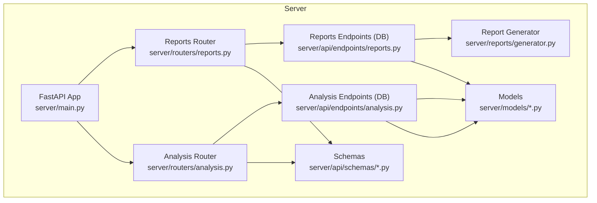
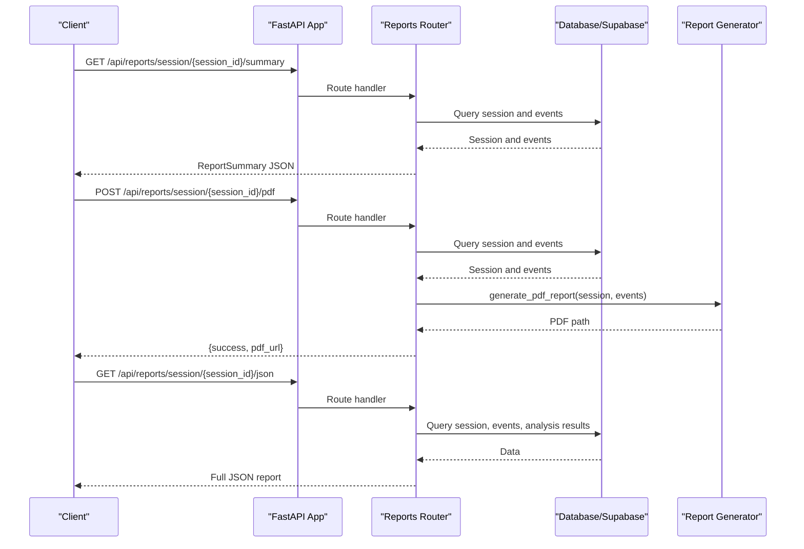
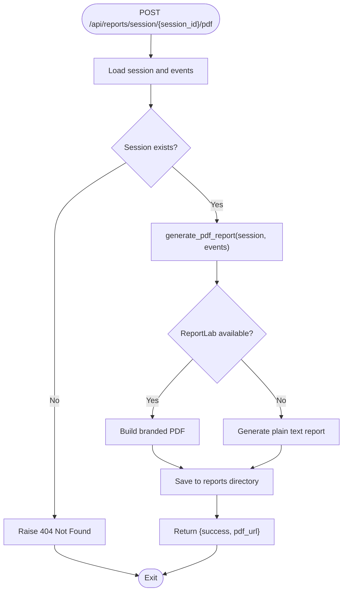
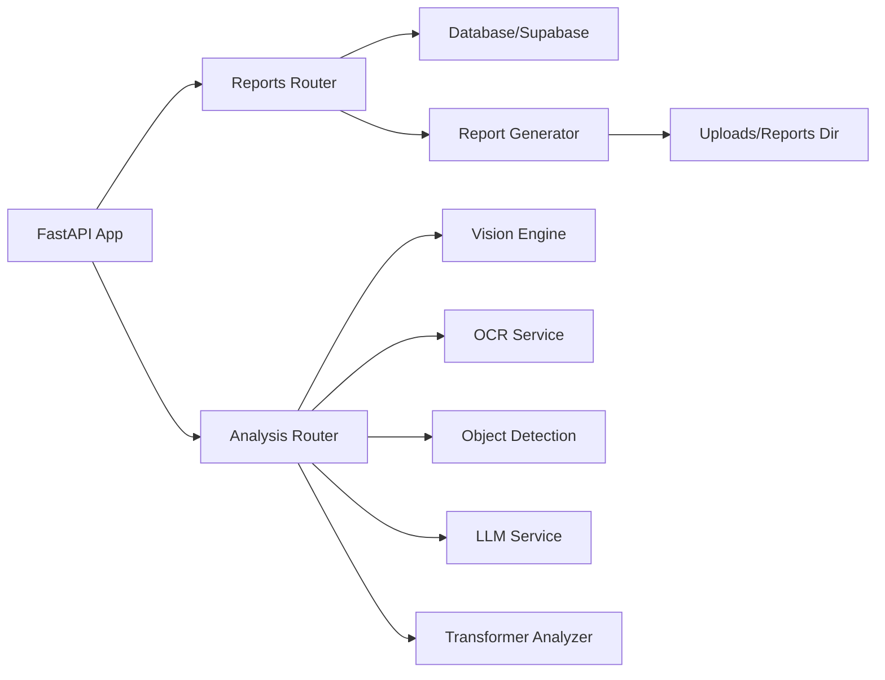

# Reports & Analytics API

<cite>
**Referenced Files in This Document**
- [main.py](file://server/main.py)
- [routers/reports.py](file://server/routers/reports.py)
- [api/endpoints/reports.py](file://server/api/endpoints/reports.py)
- [reports/generator.py](file://server/reports/generator.py)
- [routers/analysis.py](file://server/routers/analysis.py)
- [api/endpoints/analysis.py](file://server/api/endpoints/analysis.py)
- [api/schemas/report.py](file://server/api/schemas/report.py)
- [api/schemas/analysis.py](file://server/api/schemas/analysis.py)
- [models/session.py](file://server/models/session.py)
- [models/event.py](file://server/models/event.py)
- [models/analysis.py](file://server/models/analysis.py)
</cite>

## Table of Contents
1. [Introduction](#introduction)
2. [Project Structure](#project-structure)
3. [Core Components](#core-components)
4. [Architecture Overview](#architecture-overview)
5. [Detailed Component Analysis](#detailed-component-analysis)
6. [Dependency Analysis](#dependency-analysis)
7. [Performance Considerations](#performance-considerations)
8. [Troubleshooting Guide](#troubleshooting-guide)
9. [Conclusion](#conclusion)

## Introduction
This document specifies the Reports & Analytics API for ExamGuard Pro, focusing on:
- PDF report generation for exam sessions
- Session analytics and statistical summaries
- Export formats and data filtering options
- Error handling for report generation failures, large data exports, and template rendering issues
- Integration points with external analytics systems for comprehensive exam monitoring insights

The API exposes endpoints under /api/reports and related analytics endpoints under /api/analysis. It supports both database-backed and Supabase-backed modes, with PDF generation powered by a dedicated report generator.

## Project Structure
The Reports & Analytics API is implemented across several modules:
- Router definitions for reports and analysis
- Endpoint handlers (database-backed and Supabase-backed)
- Report generation engine
- Pydantic schemas for request/response validation
- Domain models for sessions, events, and analysis results
- Application entrypoint and static file serving for PDF downloads

**Diagram sources**
- [main.py:170-248](file://server/main.py#L170-L248)
- [routers/reports.py:1-207](file://server/routers/reports.py#L1-L207)
- [routers/analysis.py:1-418](file://server/routers/analysis.py#L1-L418)
- [api/endpoints/reports.py:1-178](file://server/api/endpoints/reports.py#L1-L178)
- [api/endpoints/analysis.py:1-453](file://server/api/endpoints/analysis.py#L1-L453)
- [reports/generator.py:1-564](file://server/reports/generator.py#L1-L564)
- [api/schemas/report.py:1-87](file://server/api/schemas/report.py#L1-L87)
- [api/schemas/analysis.py:1-121](file://server/api/schemas/analysis.py#L1-L121)
- [models/session.py:1-63](file://server/models/session.py#L1-L63)
- [models/event.py:1-30](file://server/models/event.py#L1-L30)
- [models/analysis.py:1-49](file://server/models/analysis.py#L1-L49)

**Section sources**
- [main.py:170-248](file://server/main.py#L170-L248)
- [routers/reports.py:1-207](file://server/routers/reports.py#L1-L207)
- [routers/analysis.py:1-418](file://server/routers/analysis.py#L1-L418)
- [api/endpoints/reports.py:1-178](file://server/api/endpoints/reports.py#L1-L178)
- [api/endpoints/analysis.py:1-453](file://server/api/endpoints/analysis.py#L1-L453)
- [reports/generator.py:1-564](file://server/reports/generator.py#L1-L564)
- [api/schemas/report.py:1-87](file://server/api/schemas/report.py#L1-L87)
- [api/schemas/analysis.py:1-121](file://server/api/schemas/analysis.py#L1-L121)
- [models/session.py:1-63](file://server/models/session.py#L1-L63)
- [models/event.py:1-30](file://server/models/event.py#L1-L30)
- [models/analysis.py:1-49](file://server/models/analysis.py#L1-L49)

## Core Components
- Reports Router: Provides endpoints for session summaries, JSON reports, PDF generation, and flagged sessions.
- Analysis Router: Provides endpoints for multi-modal AI analysis, dashboard statistics, and transformer-based analysis.
- Report Generator: Creates branded PDF reports from session and event data, with fallback to plain text.
- Schemas: Define request/response models for validation and documentation.
- Models: Represent session, event, and analysis result records for data exchange.

Key capabilities:
- Generate PDF reports with KPI cards, risk assessment, event statistics, and timelines.
- Export JSON reports containing session, events, and analysis results.
- Filter analytics by risk thresholds and limits.
- Integrate with external AI services for OCR, object detection, and LLM-based behavior analysis.

**Section sources**
- [routers/reports.py:47-207](file://server/routers/reports.py#L47-L207)
- [api/endpoints/reports.py:15-178](file://server/api/endpoints/reports.py#L15-L178)
- [reports/generator.py:422-534](file://server/reports/generator.py#L422-L534)
- [api/schemas/report.py:10-87](file://server/api/schemas/report.py#L10-L87)
- [models/session.py:15-63](file://server/models/session.py#L15-L63)
- [models/event.py:6-30](file://server/models/event.py#L6-L30)
- [models/analysis.py:6-49](file://server/models/analysis.py#L6-L49)

## Architecture Overview
The Reports & Analytics API follows a layered architecture:
- Presentation layer: FastAPI routers and endpoints
- Business logic: Report generation and analysis orchestration
- Data access: Database-backed (SQLAlchemy) and Supabase-backed routes
- External integrations: Vision engine, OCR, object detection, LLM, and transformer analyzers

**Diagram sources**
- [main.py:170-248](file://server/main.py#L170-L248)
- [routers/reports.py:47-207](file://server/routers/reports.py#L47-L207)
- [api/endpoints/reports.py:15-178](file://server/api/endpoints/reports.py#L15-L178)
- [reports/generator.py:422-534](file://server/reports/generator.py#L422-L534)

## Detailed Component Analysis

### Reports Endpoints
Endpoints for generating and retrieving reports:
- GET /api/reports/session/{session_id}/summary
  - Returns a concise summary including risk score, risk level, durations, and counts of high-risk events.
  - Query parameters: None.
  - Response: ReportSummary model.
  - Error: 404 if session not found.

- GET /api/reports/session/{session_id}/json
  - Returns a full JSON report including session metadata, duration, events, and analysis results.
  - Query parameters: None.
  - Response: JSON object with nested report data.
  - Error: 404 if session not found.

- POST /api/reports/session/{session_id}/pdf
  - Generates a PDF report asynchronously and returns a download URL.
  - Query parameters: None.
  - Response: {success: true, pdf_url: string}.
  - Error: 500 if PDF generation fails.

- GET /api/reports/flagged
  - Returns sessions with risk scores above a threshold.
  - Query parameters:
    - min_risk_score: float, default 30
    - limit: int, default 50
  - Response: {flagged_count: int, sessions: array of session dicts}.
  - Error: 500 on internal failure.

Notes:
- The database-backed implementation uses SQLAlchemy ORM and returns dictionaries via model.to_dict().
- The Supabase-backed implementation queries tables directly and returns structured JSON.

**Section sources**
- [routers/reports.py:47-207](file://server/routers/reports.py#L47-L207)
- [api/endpoints/reports.py:15-178](file://server/api/endpoints/reports.py#L15-L178)
- [models/session.py:45-63](file://server/models/session.py#L45-L63)
- [models/event.py:24-30](file://server/models/event.py#L24-L30)
- [models/analysis.py:40-49](file://server/models/analysis.py#L40-L49)

### Report Generation Workflow
The PDF generation process:
- Validates ReportLab availability; falls back to plain text if unavailable.
- Builds a branded PDF with sections for session info, risk assessment, KPI cards, event statistics, and timeline.
- Saves the PDF to a reports directory and returns a relative URL for download.

**Diagram sources**
- [routers/reports.py:151-185](file://server/routers/reports.py#L151-L185)
- [reports/generator.py:422-534](file://server/reports/generator.py#L422-L534)

**Section sources**
- [routers/reports.py:151-185](file://server/routers/reports.py#L151-L185)
- [reports/generator.py:422-534](file://server/reports/generator.py#L422-L534)

### Analytics Endpoints
Endpoints for AI analysis and dashboard data:
- POST /api/analysis/process
  - Processes webcam and screen images, OCR, and optional LLM analysis.
  - Request body: AnalysisRequest (session_id, webcam_image base64, screen_image base64, clipboard_text, timestamp).
  - Response: AnalysisResponse with risk_score, flags, and optional details.
  - Error: 404 if session not found; 500 on internal error.

- GET /api/analysis/dashboard
  - Aggregates dashboard data for all students and their latest sessions.
  - Response: List[StudentSummary] with risk/engagement metrics.
  - Error: 500 on internal error.

- GET /api/analysis/student/{student_id}
  - Returns student details and associated sessions.
  - Response: {student: dict, sessions: array of dicts}.
  - Error: 404 if student not found; 500 on internal error.

- GET /api/analysis/stats
  - Returns overall dashboard statistics (total students, active sessions, average engagement, high-risk count).
  - Response: DashboardStats.
  - Error: 500 on internal error.

Transformer-based analysis endpoints:
- POST /api/analysis/transformer/classify-url
- POST /api/analysis/transformer/analyze-behavior
- POST /api/analysis/transformer/classify-screen
- GET /api/analysis/transformer/status

These endpoints integrate with transformer analyzers for URL classification, behavior risk prediction, and screen content classification.

**Section sources**
- [routers/analysis.py:84-292](file://server/routers/analysis.py#L84-L292)
- [api/endpoints/analysis.py:57-453](file://server/api/endpoints/analysis.py#L57-L453)
- [api/schemas/analysis.py:10-121](file://server/api/schemas/analysis.py#L10-L121)

### Data Models and Schemas
Report schemas:
- ReportRequest: Controls inclusion of events, analysis, screenshots, and timeline.
- ReportSummary: Summary metrics for a session.
- ReportResponse: Wrapper for report data with format and optional download URL.
- ReportEventItem and ReportAnalysisItem: Individual items for detailed reports.

Analysis schemas:
- AnalysisRequest: Multi-modal analysis input.
- AnalysisResponse: Output with risk flags and scores.
- TextAnalysisRequest, PlagiarismCheckRequest, MultiAnswerRequest: Transformer-based text analysis requests.
- DashboardStats: Dashboard-level metrics.

Domain models:
- ExamSession: Session metadata, timestamps, risk/engagement scores, and counters.
- Event: Logged events with timestamps, types, risk weights, and data blobs.
- AnalysisResult: AI analysis outcomes with risk contributions and optional source files.

**Section sources**
- [api/schemas/report.py:10-87](file://server/api/schemas/report.py#L10-L87)
- [api/schemas/analysis.py:10-121](file://server/api/schemas/analysis.py#L10-L121)
- [models/session.py:15-63](file://server/models/session.py#L15-L63)
- [models/event.py:6-30](file://server/models/event.py#L6-L30)
- [models/analysis.py:6-49](file://server/models/analysis.py#L6-L49)

## Dependency Analysis
The Reports & Analytics API depends on:
- FastAPI for routing and request/response handling
- SQLAlchemy (database mode) or Supabase client (Supabase mode) for data access
- ReportLab for PDF generation (optional)
- External services: vision engine, OCR, object detection, LLM, transformer analyzers
- Static file serving for PDF downloads

**Diagram sources**
- [main.py:170-248](file://server/main.py#L170-L248)
- [routers/reports.py:151-185](file://server/routers/reports.py#L151-L185)
- [routers/analysis.py:84-292](file://server/routers/analysis.py#L84-L292)
- [reports/generator.py:422-534](file://server/reports/generator.py#L422-L534)

**Section sources**
- [main.py:170-248](file://server/main.py#L170-L248)
- [routers/reports.py:151-185](file://server/routers/reports.py#L151-L185)
- [routers/analysis.py:84-292](file://server/routers/analysis.py#L84-L292)
- [reports/generator.py:422-534](file://server/reports/generator.py#L422-L534)

## Performance Considerations
- PDF generation: ReportLab is optional; if unavailable, a plain text report is generated. Consider enabling ReportLab for production PDF needs.
- Large data exports: JSON reports include all events and analysis results; use pagination or filtering (e.g., limit) when integrating with external systems.
- Image processing: Webcam and screenshot processing can be CPU-intensive; offload heavy computations to background tasks where appropriate.
- Database vs Supabase: Database-backed routes use SQLAlchemy ORM; Supabase-backed routes rely on remote queries. Choose the mode aligned with your infrastructure.

[No sources needed since this section provides general guidance]

## Troubleshooting Guide
Common issues and resolutions:
- Session not found (404):
  - Ensure the session_id is valid and exists in the database or Supabase.
  - Verify the selected data source mode matches your deployment.

- PDF generation failed (500):
  - Confirm ReportLab is installed and functional.
  - Check write permissions for the reports directory.
  - Review server logs for detailed error messages.

- Large data export timeouts:
  - Reduce included data by excluding events or analysis results.
  - Implement client-side pagination or incremental exports.

- Template rendering issues:
  - If ReportLab is unavailable, the generator falls back to plain text.
  - Validate input data shapes and ensure required fields are present.

**Section sources**
- [routers/reports.py:164-184](file://server/routers/reports.py#L164-L184)
- [api/endpoints/reports.py:111-133](file://server/api/endpoints/reports.py#L111-L133)
- [reports/generator.py:423-424](file://server/reports/generator.py#L423-L424)

## Conclusion
The Reports & Analytics API provides robust capabilities for generating PDF reports, exporting JSON analytics, and integrating with external AI systems. By leveraging both database-backed and Supabase-backed implementations, it supports flexible deployment scenarios. Proper error handling, optional PDF generation, and comprehensive schemas ensure reliable operation across diverse environments.