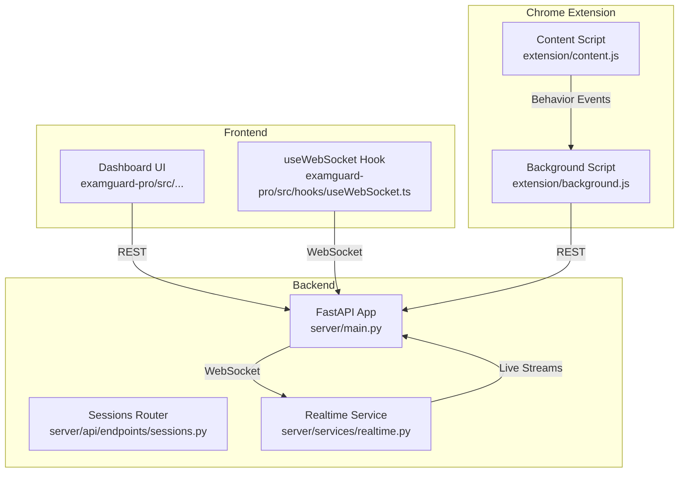
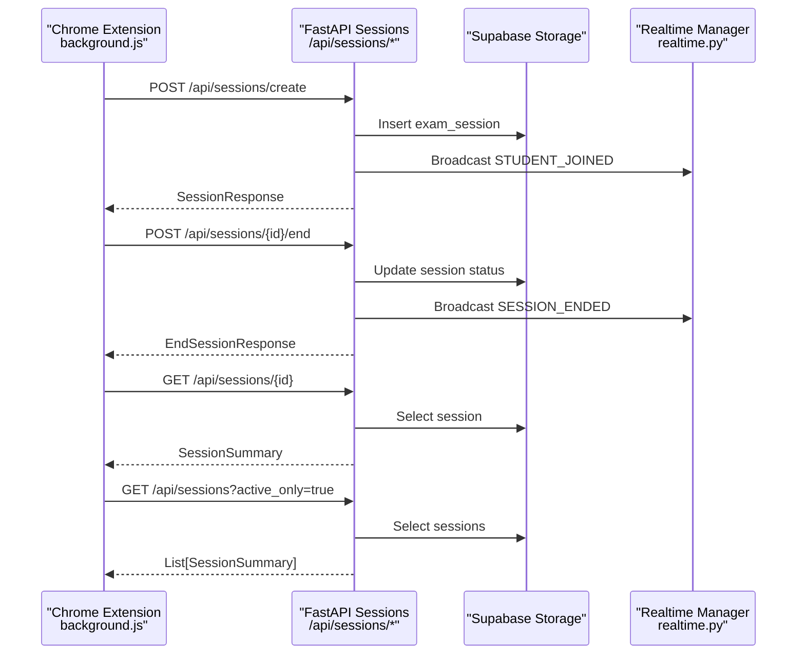
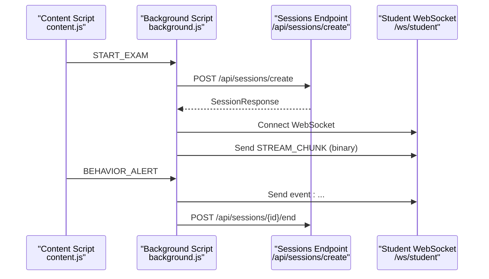
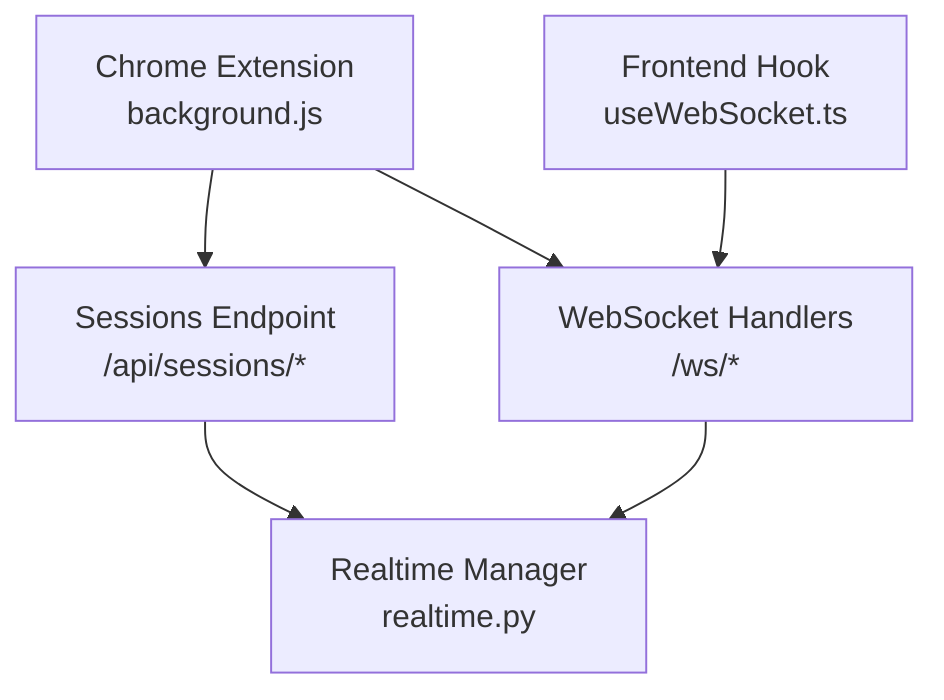

# Session Management API

<cite>
**Referenced Files in This Document**
- [main.py](file://server/main.py)
- [sessions.py](file://server/api/endpoints/sessions.py)
- [session.py](file://server/models/session.py)
- [session.py](file://server/api/schemas/session.py)
- [realtime.py](file://server/services/realtime.py)
- [useWebSocket.ts](file://examguard-pro/src/hooks/useWebSocket.ts)
- [background.js](file://extension/background.js)
- [content.js](file://extension/content.js)
- [router.py](file://server/auth/router.py)
</cite>

## Table of Contents
1. [Introduction](#introduction)
2. [Project Structure](#project-structure)
3. [Core Components](#core-components)
4. [Architecture Overview](#architecture-overview)
5. [Detailed Component Analysis](#detailed-component-analysis)
6. [Dependency Analysis](#dependency-analysis)
7. [Performance Considerations](#performance-considerations)
8. [Troubleshooting Guide](#troubleshooting-guide)
9. [Conclusion](#conclusion)

## Introduction
This document provides comprehensive API documentation for ExamGuard Pro’s exam session management endpoints focused on session lifecycle control and monitoring. It covers HTTP methods, URL patterns, request/response schemas, session configuration parameters, student enrollment, proctor assignment, real-time session control, session states, timing controls, participant management, and integration with the Chrome extension for live monitoring.

## Project Structure
The session management system spans three primary areas:
- Backend API: FastAPI application with WebSocket endpoints for real-time monitoring and Supabase-managed session persistence.
- Frontend Dashboard: React-based dashboard consuming REST APIs and WebSocket feeds for live updates.
- Chrome Extension: Browser extension that initiates sessions, captures behavior, and streams media to the backend.

**Diagram sources**
- [main.py:248-507](file://server/main.py#L248-L507)
- [sessions.py:12-303](file://server/api/endpoints/sessions.py#L12-L303)
- [realtime.py:102-642](file://server/services/realtime.py#L102-L642)
- [useWebSocket.ts:1-110](file://examguard-pro/src/hooks/useWebSocket.ts#L1-L110)
- [background.js:751-800](file://extension/background.js#L751-L800)
- [content.js:367-381](file://extension/content.js#L367-L381)

**Section sources**
- [main.py:167-647](file://server/main.py#L167-L647)
- [sessions.py:1-303](file://server/api/endpoints/sessions.py#L1-L303)
- [realtime.py:1-642](file://server/services/realtime.py#L1-L642)
- [useWebSocket.ts:1-110](file://examguard-pro/src/hooks/useWebSocket.ts#L1-L110)
- [background.js:1-800](file://extension/background.js#L1-L800)
- [content.js:1-473](file://extension/content.js#L1-L473)

## Core Components
- Session Creation Endpoint: Creates a new exam session, auto-creates students, validates exam codes, and broadcasts join events.
- Session Termination Endpoint: Ends a session, calculates risk score, and broadcasts end events.
- Session Retrieval Endpoint: Returns session details and aggregated statistics.
- Listing Endpoint: Lists sessions with optional filters (active only).
- Real-Time Monitoring: WebSocket endpoints for dashboard, proctor, and student channels with event broadcasting and live streaming.
- Chrome Extension Integration: Initiates sessions, monitors behavior, and streams media to the backend.

**Section sources**
- [sessions.py:12-303](file://server/api/endpoints/sessions.py#L12-L303)
- [session.py:11-88](file://server/api/schemas/session.py#L11-L88)
- [session.py:15-63](file://server/models/session.py#L15-L63)
- [realtime.py:24-65](file://server/services/realtime.py#L24-L65)
- [main.py:274-507](file://server/main.py#L274-L507)
- [background.js:751-800](file://extension/background.js#L751-L800)

## Architecture Overview
The session lifecycle integrates REST and WebSocket protocols:
- REST endpoints manage session creation, termination, retrieval, and listing.
- WebSocket endpoints enable real-time monitoring, live streaming, and event broadcasting.
- The Chrome extension acts as a client for both REST and WebSocket communication.

**Diagram sources**
- [sessions.py:12-303](file://server/api/endpoints/sessions.py#L12-L303)
- [realtime.py:334-403](file://server/services/realtime.py#L334-L403)
- [background.js:751-800](file://extension/background.js#L751-L800)

## Detailed Component Analysis

### REST API Endpoints

#### Session Creation
- Method: POST
- Path: /api/sessions/create
- Purpose: Create a new exam session for a student, auto-create student if needed, validate exam code against proctor session, and initialize session state.
- Request Schema: SessionCreate
  - student_id: string (required)
  - student_name: string (required)
  - student_email: string (optional)
  - exam_id: string (required)
- Response Schema: SessionResponse
  - session_id: string
  - student_id: string
  - student_name: string
  - exam_id: string
  - started_at: string (ISO 8601)
  - is_active: boolean (default: true)
- Behavior:
  - Auto-creates student record if not present.
  - Validates exam_id against proctor sessions; supports lazy activation when proctor has not joined yet.
  - Initializes session with default scores and status.
  - Broadcasts STUDENT_JOINED event to dashboard via WebSocket.

**Section sources**
- [sessions.py:12-107](file://server/api/endpoints/sessions.py#L12-L107)
- [session.py:11-36](file://server/api/schemas/session.py#L11-L36)

#### Session Termination
- Method: POST
- Path: /api/sessions/{session_id}/end
- Purpose: End an active session, compute risk score, update status, and broadcast end event.
- Path Parameter:
  - session_id: string (required)
- Response Schema: EndSessionResponse
  - session_id: string
  - status: string ("ended" or "already_ended")
  - final_risk_score: number
  - risk_level: string ("safe", "review", "suspicious")
  - duration_seconds: number
- Behavior:
  - Idempotent: returns success if already ended.
  - Updates session is_active flag, ended_at timestamp, and risk metrics.
  - Broadcasts SESSION_ENDED event to dashboard via WebSocket.

**Section sources**
- [sessions.py:146-209](file://server/api/endpoints/sessions.py#L146-L209)

#### Session Details
- Method: GET
- Path: /api/sessions/{session_id}
- Purpose: Retrieve detailed session information including scores and statistics.
- Path Parameter:
  - session_id: string (required)
- Response Schema: SessionSummary
  - id: string
  - student_name: string
  - student_id: string
  - exam_id: string
  - started_at: string (ISO 8601)
  - ended_at: string or null
  - risk_score: number or null
  - risk_level: string or null
  - engagement_score: number or null
  - content_relevance: number or null
  - effort_alignment: number or null
  - status: string ("active" or "ended")
  - stats: object with counts for:
    - tab_switches: integer
    - copy_events: integer
    - face_absences: integer
    - forbidden_sites: integer
    - total: integer

**Section sources**
- [sessions.py:211-248](file://server/api/endpoints/sessions.py#L211-L248)
- [session.py:48-88](file://server/api/schemas/session.py#L48-L88)

#### List Sessions
- Method: GET
- Path: /api/sessions
- Purpose: List sessions with optional filters and pagination.
- Query Parameters:
  - active_only: boolean (default: false)
  - limit: integer (default: 100)
- Response Schema: List[SessionSummary]
  - Array of SessionSummary objects.

**Section sources**
- [sessions.py:251-292](file://server/api/endpoints/sessions.py#L251-L292)

#### Active Session Count
- Method: GET
- Path: /api/sessions/active/count
- Purpose: Get the count of active sessions.
- Response Schema: ActiveCountResponse
  - active_count: integer

**Section sources**
- [sessions.py:295-303](file://server/api/endpoints/sessions.py#L295-L303)

### WebSocket Endpoints

#### Dashboard WebSocket
- Path: /ws/dashboard
- Purpose: Receive all events across all sessions for the dashboard.
- Features:
  - Accepts subscription commands to specific session rooms.
  - Supports ping/pong and stats queries.
  - Broadcasts alerts, session events, and heartbeat.

**Section sources**
- [main.py:274-342](file://server/main.py#L274-L342)
- [realtime.py:334-403](file://server/services/realtime.py#L334-L403)

#### Proctor WebSocket
- Path: /ws/proctor/{session_id}
- Purpose: Receive events for a specific session for proctor monitoring.
- Features:
  - Accepts commands and alerts to students in the session.
  - Maintains room-based subscriptions.

**Section sources**
- [main.py:344-391](file://server/main.py#L344-L391)
- [realtime.py:334-403](file://server/services/realtime.py#L334-L403)

#### Student WebSocket
- Path: /ws/student
- Alternative Path: /ws/student/{student_id}
- Purpose: Receive alerts and instructions from proctors; stream live media.
- Features:
  - Handles text and binary messages.
  - Routes WebRTC signaling and live video chunks.
  - Broadcasts STUDENT_LEFT on disconnect and marks session as ended.

**Section sources**
- [main.py:393-507](file://server/main.py#L393-L507)
- [realtime.py:310-329](file://server/services/realtime.py#L310-L329)

### Chrome Extension Integration

#### Session Lifecycle
- Starts session via REST POST to /api/sessions/create.
- Monitors behavior and captures events via content script.
- Streams live webcam and screen captures via WebSocket binary frames.
- Stops session via REST POST to /api/sessions/{id}/end.

**Diagram sources**
- [background.js:751-800](file://extension/background.js#L751-L800)
- [content.js:367-381](file://extension/content.js#L367-L381)
- [main.py:393-507](file://server/main.py#L393-L507)

**Section sources**
- [background.js:52-166](file://extension/background.js#L52-L166)
- [background.js:751-800](file://extension/background.js#L751-L800)
- [content.js:332-343](file://extension/content.js#L332-L343)
- [main.py:393-507](file://server/main.py#L393-L507)

### Session States and Timing Controls
- Session States:
  - recording: Initial state after creation.
  - processing: Intermediate state during analysis.
  - completed: Finalized session.
  - flagged: Indicates suspicious activity.
- Timing Controls:
  - started_at: ISO timestamp when session starts.
  - ended_at: ISO timestamp when session ends.
  - duration_seconds: Computed difference between ended_at and started_at.
- Risk Metrics:
  - risk_score: Numeric score derived from events.
  - risk_level: Categorized as safe, review, suspicious.
- Engagement Metrics:
  - engagement_score: 0–100 scale.
  - content_relevance: 0–100 scale.
  - effort_alignment: 0–100 scale.

**Section sources**
- [session.py:15-63](file://server/models/session.py#L15-L63)
- [session.py:48-88](file://server/api/schemas/session.py#L48-L88)
- [sessions.py:146-209](file://server/api/endpoints/sessions.py#L146-L209)

### Participant Management
- Students:
  - Auto-created if not present during session creation.
  - Name and optional email stored.
- Proctors:
  - Identified by student_id prefix "PROCTOR-".
  - Used to validate exam_id and establish canonical exam code.
- Dashboard Users:
  - Receive all events and can subscribe to specific sessions.

**Section sources**
- [sessions.py:12-107](file://server/api/endpoints/sessions.py#L12-L107)
- [router.py:1-294](file://server/auth/router.py#L1-L294)

### Real-Time Monitoring Patterns
- Event Types:
  - Session events: SESSION_STARTED, SESSION_ENDED, STUDENT_JOINED, STUDENT_LEFT.
  - Monitoring events: FACE_DETECTED, FACE_MISSING, MULTIPLE_FACES.
  - Suspicious activity: TAB_SWITCH, COPY_PASTE, SCREENSHOT_ATTEMPT, WINDOW_BLUR.
  - Analysis events: PLAGIARISM_DETECTED, ANOMALY_DETECTED, LOW_ENGAGEMENT, UNUSUAL_BEHAVIOR, OBJECT_DETECTED.
  - System events: RISK_SCORE_UPDATE, ALERT_TRIGGERED, REPORT_GENERATED.
  - Heartbeat: HEARTBEAT.
- Rooms:
  - Per-session rooms for targeted event delivery.
- Binary Streaming:
  - Live webcam/screen chunks routed to dashboards and proctors.

**Section sources**
- [realtime.py:24-65](file://server/services/realtime.py#L24-L65)
- [realtime.py:310-329](file://server/services/realtime.py#L310-L329)
- [main.py:274-342](file://server/main.py#L274-L342)

## Dependency Analysis

**Diagram sources**
- [sessions.py:12-303](file://server/api/endpoints/sessions.py#L12-L303)
- [realtime.py:102-642](file://server/services/realtime.py#L102-L642)
- [main.py:274-507](file://server/main.py#L274-L507)
- [useWebSocket.ts:1-110](file://examguard-pro/src/hooks/useWebSocket.ts#L1-L110)
- [background.js:1-800](file://extension/background.js#L1-L800)

**Section sources**
- [main.py:167-647](file://server/main.py#L167-L647)
- [sessions.py:1-303](file://server/api/endpoints/sessions.py#L1-L303)
- [realtime.py:1-642](file://server/services/realtime.py#L1-L642)
- [useWebSocket.ts:1-110](file://examguard-pro/src/hooks/useWebSocket.ts#L1-L110)
- [background.js:1-800](file://extension/background.js#L1-L800)

## Performance Considerations
- WebSocket Efficiency:
  - Binary streaming reduces overhead for live video.
  - Room-based broadcasting minimizes unnecessary fan-out.
- Event History:
  - Limited event history keeps memory usage bounded.
- Database Access:
  - Supabase-based reads/writes are optimized for session listing and retrieval.
- Frontend Responsiveness:
  - useWebSocket hook manages reconnection and message buffering.

[No sources needed since this section provides general guidance]

## Troubleshooting Guide
- Session Not Found:
  - Symptom: 404 when retrieving or ending a session.
  - Resolution: Verify session_id correctness and existence in Supabase.
- Already Ended:
  - Symptom: End endpoint returns "already_ended".
  - Resolution: Idempotent operation; no action required.
- Exam Code Validation:
  - Symptom: Student cannot join without proctor session.
  - Resolution: Ensure proctor joins first or rely on lazy activation for testing.
- WebSocket Disconnection:
  - Symptom: Lost live stream or alerts.
  - Resolution: useWebSocket hook automatically reconnects; verify backend WebSocket endpoints are reachable.
- Extension Connectivity:
  - Symptom: Cannot start or stop session from extension.
  - Resolution: Confirm API base URL and backend availability; check browser permissions.

**Section sources**
- [sessions.py:146-209](file://server/api/endpoints/sessions.py#L146-L209)
- [sessions.py:211-248](file://server/api/endpoints/sessions.py#L211-L248)
- [background.js:751-800](file://extension/background.js#L751-L800)
- [useWebSocket.ts:18-100](file://examguard-pro/src/hooks/useWebSocket.ts#L18-L100)

## Conclusion
ExamGuard Pro’s session management API provides a robust foundation for exam session lifecycle control and real-time monitoring. REST endpoints handle session creation, termination, retrieval, and listing, while WebSocket endpoints enable live dashboards, proctor monitoring, and student communication. The Chrome extension integrates seamlessly with these endpoints to capture behavior and stream media, ensuring comprehensive proctoring coverage.