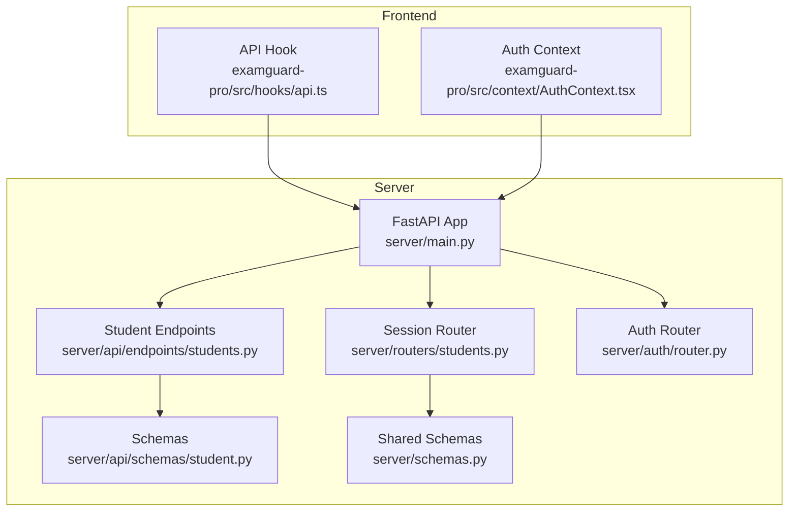
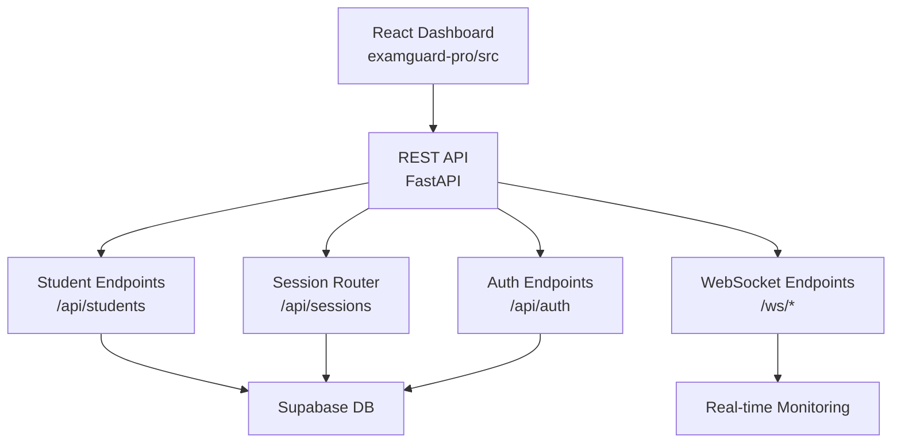
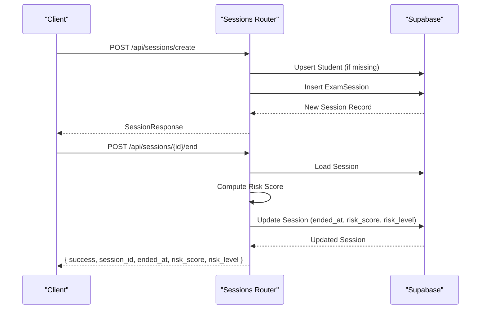
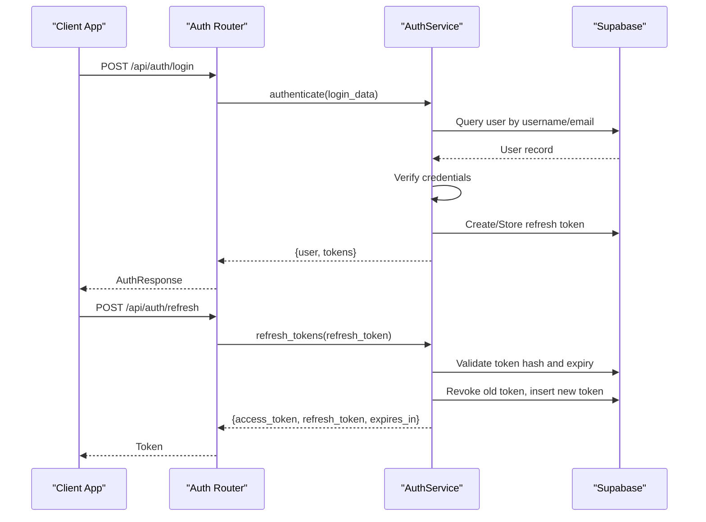
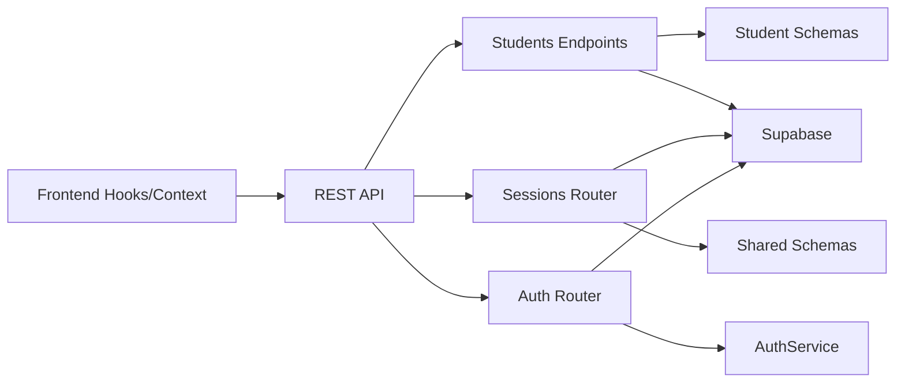

# Student Management API

<cite>
**Referenced Files in This Document**
- [main.py](file://server/main.py)
- [students.py](file://server/api/endpoints/students.py)
- [student.py](file://server/api/schemas/student.py)
- [schemas.py](file://server/schemas.py)
- [models/student.py](file://server/models/student.py)
- [routers/students.py](file://server/routers/students.py)
- [auth/router.py](file://server/auth/router.py)
- [auth/schemas.py](file://server/auth/schemas.py)
- [auth/service.py](file://server/auth/service.py)
- [api.ts](file://examguard-pro/src/hooks/api.ts)
- [AuthContext.tsx](file://examguard-pro/src/context/AuthContext.tsx)
</cite>

## Table of Contents
1. [Introduction](#introduction)
2. [Project Structure](#project-structure)
3. [Core Components](#core-components)
4. [Architecture Overview](#architecture-overview)
5. [Detailed Component Analysis](#detailed-component-analysis)
6. [Dependency Analysis](#dependency-analysis)
7. [Performance Considerations](#performance-considerations)
8. [Troubleshooting Guide](#troubleshooting-guide)
9. [Conclusion](#conclusion)
10. [Appendices](#appendices)

## Introduction
This document provides comprehensive API documentation for ExamGuard Pro student management endpoints. It focuses on:
- Student registration and profile management
- Academic record management and enrollment verification
- Exam participation tracking and session lifecycle
- Student authentication flows and session management integration
- Data validation rules, privacy considerations, and error handling
- Examples of registration requests, profile updates, and enrollment confirmations
- Guidance on bulk operations and integration with real-time monitoring

The API is implemented using FastAPI and integrates with Supabase for data persistence. The frontend is a React application that consumes these APIs.

## Project Structure
The student management functionality spans the backend API and the frontend dashboard:
- Backend API endpoints for student CRUD operations and session management
- Authentication endpoints for user login and session tokens
- Frontend hooks and context for API consumption and authentication

**Diagram sources**
- [main.py](file://server/main.py)
- [students.py](file://server/api/endpoints/students.py)
- [routers/students.py](file://server/routers/students.py)
- [auth/router.py](file://server/auth/router.py)
- [student.py](file://server/api/schemas/student.py)
- [schemas.py](file://server/schemas.py)
- [api.ts](file://examguard-pro/src/hooks/api.ts)
- [AuthContext.tsx](file://examguard-pro/src/context/AuthContext.tsx)

**Section sources**
- [main.py](file://server/main.py)
- [students.py](file://server/api/endpoints/students.py)
- [routers/students.py](file://server/routers/students.py)
- [auth/router.py](file://server/auth/router.py)
- [student.py](file://server/api/schemas/student.py)
- [schemas.py](file://server/schemas.py)
- [api.ts](file://examguard-pro/src/hooks/api.ts)
- [AuthContext.tsx](file://examguard-pro/src/context/AuthContext.tsx)

## Core Components
- Student endpoints: create, list, retrieve, update, delete students via Supabase
- Session endpoints: create, end, list, and retrieve exam sessions; compute risk scores
- Authentication endpoints: register, login, refresh, logout, and manage user profiles
- Shared schemas: request/response models for student and session data
- Frontend integration: API hook and auth context for consuming endpoints

Key capabilities:
- Student registration with ID and email uniqueness checks
- Profile updates with email uniqueness validation
- Session lifecycle management with risk scoring and statistics
- Real-time WebSocket integration for live monitoring and alerts
- Token-based authentication with refresh and logout mechanisms

**Section sources**
- [students.py](file://server/api/endpoints/students.py)
- [routers/students.py](file://server/routers/students.py)
- [auth/router.py](file://server/auth/router.py)
- [student.py](file://server/api/schemas/student.py)
- [schemas.py](file://server/schemas.py)

## Architecture Overview
The system follows a layered architecture:
- Presentation layer: FastAPI routers expose REST endpoints
- Domain layer: Pydantic schemas define request/response contracts
- Persistence layer: Supabase tables store student and session data
- Real-time layer: WebSocket endpoints deliver live updates
- Client layer: React frontend consumes REST and WebSocket APIs

**Diagram sources**
- [main.py](file://server/main.py)
- [students.py](file://server/api/endpoints/students.py)
- [routers/students.py](file://server/routers/students.py)
- [auth/router.py](file://server/auth/router.py)

## Detailed Component Analysis

### Student Registration Endpoint
Purpose: Create a new student record with optional predefined ID and mandatory uniqueness checks.

HTTP Method | URL Pattern | Description
---|---|---
POST | /api/students | Create a new student

Request Body Schema (StudentCreate):
- id: string (optional)
- name: string (required, length 1-255)
- email: string (optional, email format)
- department: string (optional)
- year: string (optional)

Validation Rules:
- Name length: minimum 1, maximum 255
- Email: validated as email format when provided
- Uniqueness: rejects duplicate ID or email

Response:
- StudentResponse with id, name, email, department, year, created_at

Error Handling:
- 400: Student ID already registered
- 400: Email already registered
- 500: Internal failure during creation

Example Request:
- POST /api/students
- Content-Type: application/json
- Body: { "id": "STU-2024-001", "name": "Jane Doe", "email": "jane.doe@university.edu", "department": "Computer Science", "year": "Junior" }

Example Success Response:
- 201 Created
- Body: { "id": "generated-id", "name": "Jane Doe", "email": "jane.doe@university.edu", "department": "Computer Science", "year": "Junior", "created_at": "2025-01-01T00:00:00Z" }

**Section sources**
- [students.py](file://server/api/endpoints/students.py)
- [student.py](file://server/api/schemas/student.py)

### Student Profile Management
Endpoints:
- GET /api/students: List all students with pagination
- GET /api/students/{student_id}: Retrieve a specific student
- PUT /api/students/{student_id}: Update student profile
- DELETE /api/students/{student_id}: Delete a student

Update Workflow:
- Validate provided fields
- Check email uniqueness against other records (excluding current student)
- Apply partial updates atomically

Response:
- StudentResponse for retrieval and updates
- Deletion returns a confirmation message

Error Handling:
- 404: Student not found
- 400: Email already in use
- 500: Internal failure

Example Update Request:
- PUT /api/students/{student_id}
- Content-Type: application/json
- Body: { "email": "updated.email@university.edu", "year": "Senior" }

**Section sources**
- [students.py](file://server/api/endpoints/students.py)
- [student.py](file://server/api/schemas/student.py)

### Exam Participation Tracking
Endpoints:
- POST /api/sessions/create: Create a new exam session (auto-creates student if missing)
- POST /api/sessions/{session_id}/end: End session and compute risk score
- GET /api/sessions/{session_id}: Retrieve session details
- GET /api/sessions: List sessions with filters (exam_id, active_only, limit)
- GET /api/sessions/all: Alias for list sessions
- GET /api/sessions/{session_id}/stats: Get session statistics

Session Lifecycle:
- Create session with student_id, student_name, exam_id
- End session to finalize risk score and timestamps
- Retrieve summaries with computed metrics and stats

Response Schemas:
- SessionCreate: student_id, student_name, exam_id
- SessionResponse: session_id, student_id, student_name, exam_id, started_at, is_active
- SessionSummary: comprehensive session metrics and stats

Error Handling:
- 404: Session not found
- 400: Session already ended
- 500: Internal failure

Sequence: Create Session → Participate in Exam → End Session → Retrieve Summary

**Diagram sources**
- [routers/students.py](file://server/routers/students.py)

**Section sources**
- [routers/students.py](file://server/routers/students.py)
- [schemas.py](file://server/schemas.py)

### Student Authentication Flows
Endpoints:
- POST /api/auth/register: Register a new user and auto-login
- POST /api/auth/login: Authenticate and return tokens
- POST /api/auth/refresh: Refresh access token
- POST /api/auth/logout: Logout and revoke refresh token
- POST /api/auth/logout-all: Logout from all sessions
- GET /api/auth/me: Get current user profile
- PATCH /api/auth/me: Update current user profile
- POST /api/auth/change-password: Change password

Authentication Details:
- Tokens: access_token and refresh_token with expiration
- Validation: strict password and username policies
- Security: hashed passwords, token rotation, refresh token revocation

Frontend Integration:
- AuthContext stores access tokens in local storage
- API hook adds Content-Type header for JSON requests

**Diagram sources**
- [auth/router.py](file://server/auth/router.py)
- [auth/service.py](file://server/auth/service.py)
- [auth/schemas.py](file://server/auth/schemas.py)

**Section sources**
- [auth/router.py](file://server/auth/router.py)
- [auth/service.py](file://server/auth/service.py)
- [auth/schemas.py](file://server/auth/schemas.py)
- [AuthContext.tsx](file://examguard-pro/src/context/AuthContext.tsx)
- [api.ts](file://examguard-pro/src/hooks/api.ts)

### Data Validation, Enrollment Verification, and Academic Records
Validation Rules:
- StudentCreate: name required, length limits; optional id, email, department, year
- StudentUpdate: optional fields; email validated and checked for uniqueness
- Auth schemas enforce strong username and password policies

Enrollment Verification:
- Unique constraints on id and email during registration
- Unique email constraint during updates (excluding current record)

Academic Records:
- StudentResponse includes basic info and created_at
- SessionSummary aggregates risk metrics and engagement scores
- Bulk operations: list endpoints support pagination and filtering

Privacy Considerations:
- Token-based authentication with secure refresh token storage
- Password hashing and secure token rotation
- Minimal PII exposure in responses

**Section sources**
- [student.py](file://server/api/schemas/student.py)
- [students.py](file://server/api/endpoints/students.py)
- [auth/schemas.py](file://server/auth/schemas.py)

### Frontend Integration Patterns
- API Hook: centralized fetchWithAuth for REST calls
- Auth Context: manages login state and token storage
- WebSocket Integration: real-time session monitoring and alerts

Frontend Consumption:
- Use API hook to call /api/students and /api/sessions
- Use AuthContext to obtain tokens for protected routes
- Connect to /ws/student and /ws/dashboard for real-time updates

**Section sources**
- [api.ts](file://examguard-pro/src/hooks/api.ts)
- [AuthContext.tsx](file://examguard-pro/src/context/AuthContext.tsx)
- [main.py](file://server/main.py)

## Dependency Analysis
The student and session endpoints depend on shared schemas and Supabase for persistence. Authentication depends on AuthService and token management.

**Diagram sources**
- [students.py](file://server/api/endpoints/students.py)
- [routers/students.py](file://server/routers/students.py)
- [student.py](file://server/api/schemas/student.py)
- [schemas.py](file://server/schemas.py)
- [auth/router.py](file://server/auth/router.py)
- [auth/service.py](file://server/auth/service.py)
- [api.ts](file://examguard-pro/src/hooks/api.ts)
- [AuthContext.tsx](file://examguard-pro/src/context/AuthContext.tsx)

**Section sources**
- [students.py](file://server/api/endpoints/students.py)
- [routers/students.py](file://server/routers/students.py)
- [student.py](file://server/api/schemas/student.py)
- [schemas.py](file://server/schemas.py)
- [auth/router.py](file://server/auth/router.py)
- [auth/service.py](file://server/auth/service.py)
- [api.ts](file://examguard-pro/src/hooks/api.ts)
- [AuthContext.tsx](file://examguard-pro/src/context/AuthContext.tsx)

## Performance Considerations
- Pagination: Use limit parameters on list endpoints to control payload sizes
- Filtering: Apply exam_id and active_only filters to reduce result sets
- Asynchronous operations: Leverage async database queries for concurrent requests
- Real-time efficiency: Use WebSocket rooms to minimize broadcast overhead
- Caching: Consider caching frequently accessed student/session summaries

## Troubleshooting Guide
Common Issues and Resolutions:
- Duplicate Registration: 400 error when id or email already exists
  - Resolution: Ensure unique student ID and email; update existing records instead of re-registering
- Validation Failures: 400 error for invalid fields
  - Resolution: Check name length, email format, and required fields
- Enrollment Conflicts: Session already ended
  - Resolution: Do not call end endpoint twice; use session status to prevent double-ending
- Authentication Errors: 401 for invalid credentials or expired tokens
  - Resolution: Use refresh endpoint; ensure correct username/email and password
- Network/API Errors: Non-OK responses
  - Resolution: Verify endpoint URLs, headers, and token presence

**Section sources**
- [students.py](file://server/api/endpoints/students.py)
- [routers/students.py](file://server/routers/students.py)
- [auth/router.py](file://server/auth/router.py)

## Conclusion
The Student Management API provides robust endpoints for student registration, profile management, and exam participation tracking. It enforces data validation, ensures unique identifiers, and integrates with authentication and real-time monitoring. The frontend seamlessly consumes these endpoints to deliver a comprehensive proctoring experience.

## Appendices

### API Reference Summary

Student Endpoints
- POST /api/students: Create student
- GET /api/students: List students
- GET /api/students/{student_id}: Get student
- PUT /api/students/{student_id}: Update student
- DELETE /api/students/{student_id}: Delete student

Session Endpoints
- POST /api/sessions/create: Create session
- POST /api/sessions/{session_id}/end: End session
- GET /api/sessions/{session_id}: Get session
- GET /api/sessions: List sessions
- GET /api/sessions/all: List sessions alias
- GET /api/sessions/{session_id}/stats: Session stats

Authentication Endpoints
- POST /api/auth/register: Register user
- POST /api/auth/login: Login
- POST /api/auth/refresh: Refresh token
- POST /api/auth/logout: Logout
- POST /api/auth/logout-all: Logout all
- GET /api/auth/me: Get profile
- PATCH /api/auth/me: Update profile
- POST /api/auth/change-password: Change password

**Section sources**
- [students.py](file://server/api/endpoints/students.py)
- [routers/students.py](file://server/routers/students.py)
- [auth/router.py](file://server/auth/router.py)