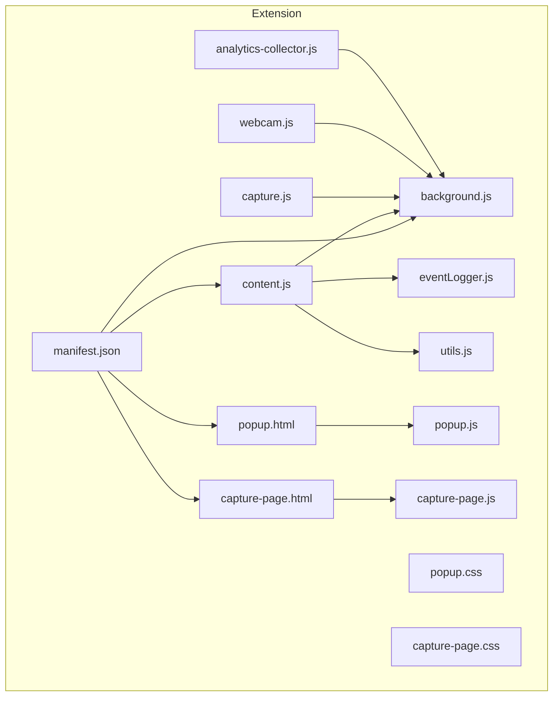
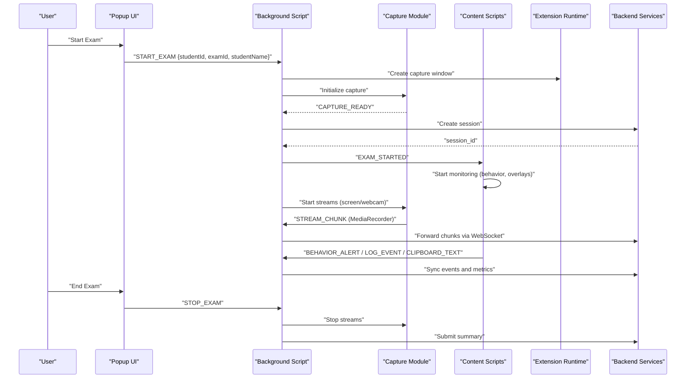
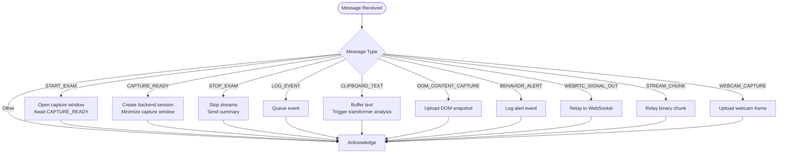
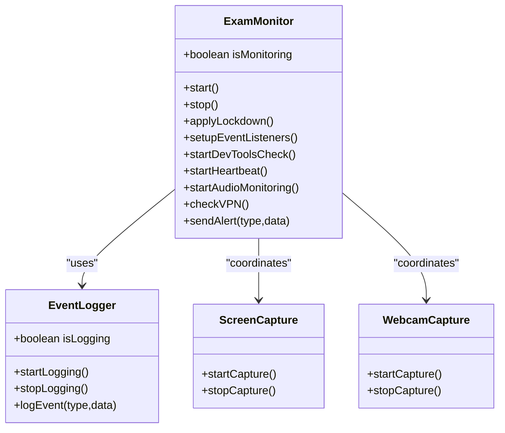
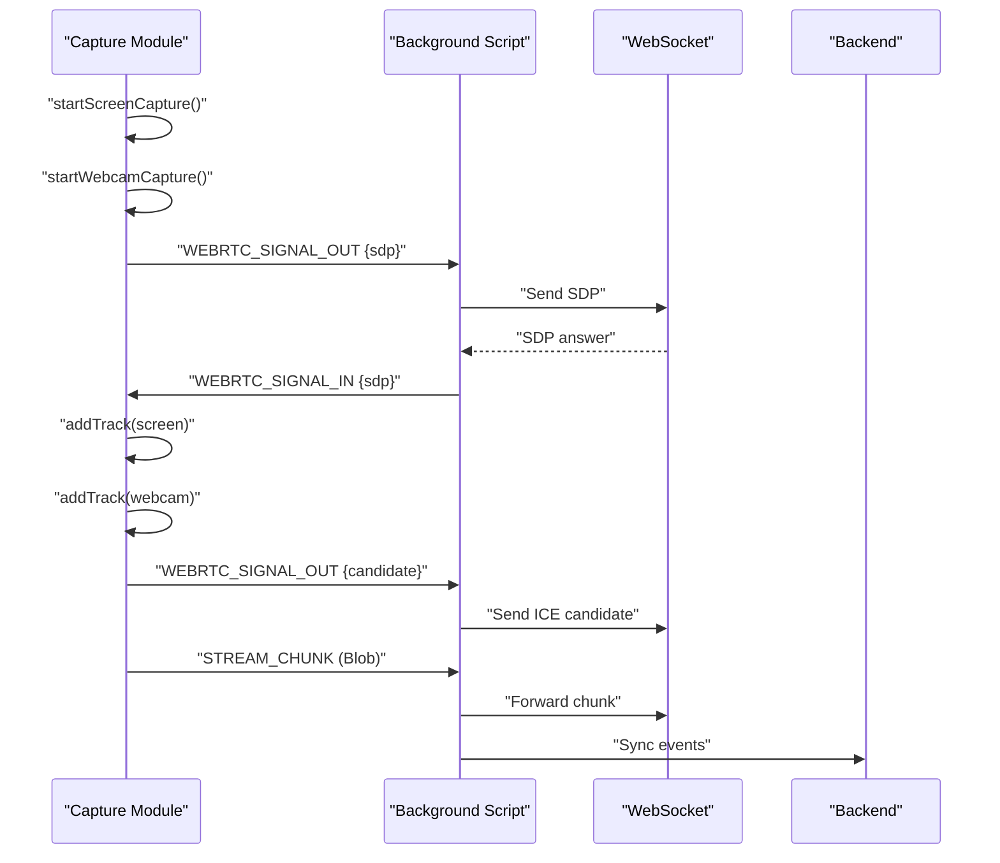
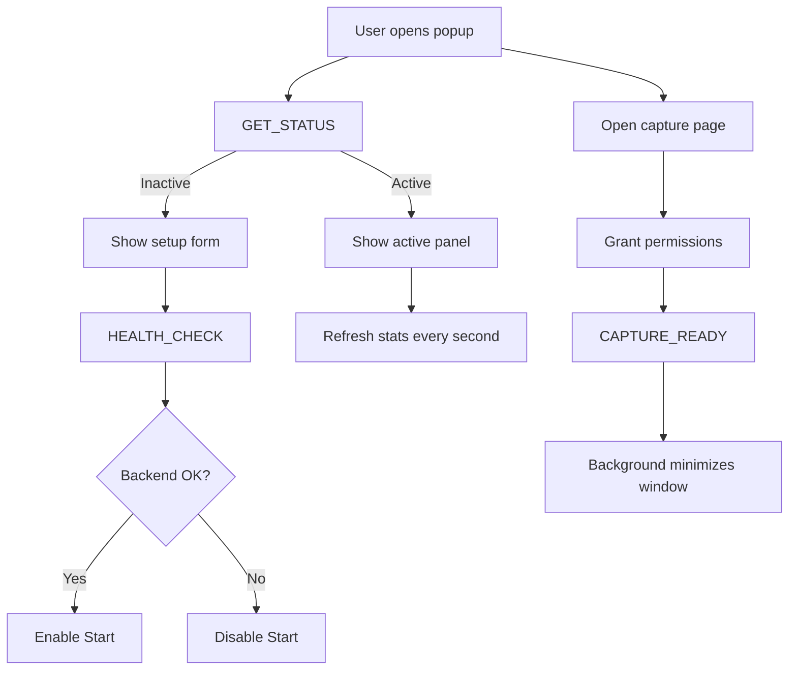
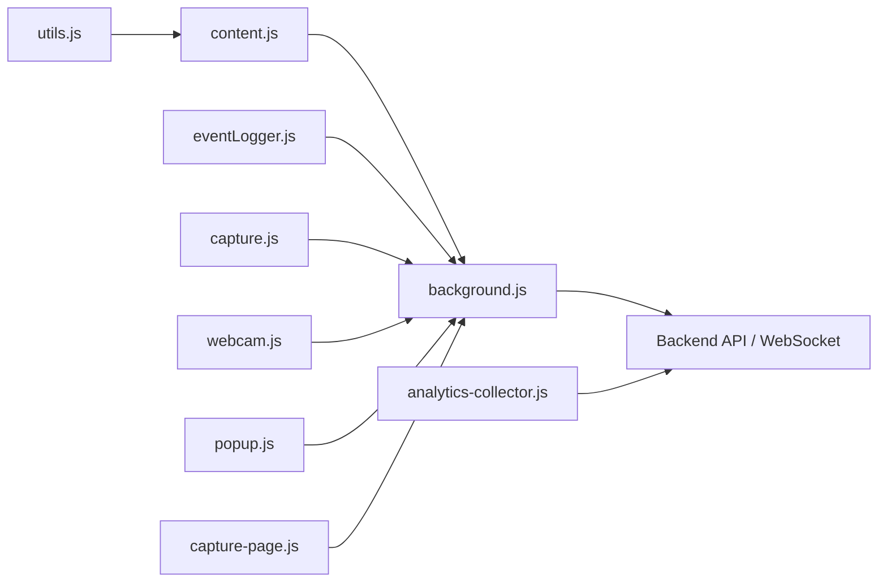

# Chrome Extension

<cite>
**Referenced Files in This Document**
- [manifest.json](file://extension/manifest.json)
- [background.js](file://extension/background.js)
- [content.js](file://extension/content.js)
- [eventLogger.js](file://extension/eventLogger.js)
- [utils.js](file://extension/utils.js)
- [capture.js](file://extension/capture.js)
- [webcam.js](file://extension/webcam.js)
- [popup.html](file://extension/popup/popup.html)
- [popup.js](file://extension/popup/popup.js)
- [popup.css](file://extension/popup/popup.css)
- [capture-page.html](file://extension/capture-page.html)
- [capture-page.js](file://extension/capture-page.js)
- [capture-page.css](file://extension/capture-page.css)
- [analytics-collector.js](file://extension/analytics-collector.js)
</cite>

## Table of Contents
1. [Introduction](#introduction)
2. [Project Structure](#project-structure)
3. [Core Components](#core-components)
4. [Architecture Overview](#architecture-overview)
5. [Detailed Component Analysis](#detailed-component-analysis)
6. [Dependency Analysis](#dependency-analysis)
7. [Performance Considerations](#performance-considerations)
8. [Troubleshooting Guide](#troubleshooting-guide)
9. [Conclusion](#conclusion)
10. [Appendices](#appendices)

## Introduction
This document describes the Chrome extension component of ExamGuard Pro responsible for browser monitoring during exams. It covers the extension architecture, Manifest V3 configuration, background script functionality, content script integration, and the monitoring capabilities including tab switching detection, window blurring events, copy/paste tracking, screen capture, and webcam video processing. It also documents the event logging system, data transmission to backend services, and WebRTC signaling support. Installation instructions, configuration options, security considerations, integration patterns with backend services, real-time streaming, and privacy protection measures are included, along with troubleshooting guidance and browser compatibility notes.

## Project Structure
The extension is organized into:
- Manifest V3 definition and permissions
- Background service worker managing session lifecycle and data flow
- Content scripts for page-level monitoring and event logging
- Capture modules for screen and webcam streams
- Popup UI for session control and telemetry
- Capture page for media permission prompts
- Utilities and analytics collector for advanced client-side processing

**Diagram sources**
- [manifest.json:1-73](file://extension/manifest.json#L1-L73)
- [background.js:1-120](file://extension/background.js#L1-L120)
- [content.js:1-60](file://extension/content.js#L1-L60)
- [eventLogger.js:1-40](file://extension/eventLogger.js#L1-L40)
- [utils.js:1-35](file://extension/utils.js#L1-L35)
- [capture.js:1-60](file://extension/capture.js#L1-L60)
- [webcam.js:1-40](file://extension/webcam.js#L1-L40)
- [popup.html:1-60](file://extension/popup/popup.html#L1-L60)
- [popup.js:1-60](file://extension/popup/popup.js#L1-L60)
- [capture-page.html:1-40](file://extension/capture-page.html#L1-L40)
- [capture-page.js:1-40](file://extension/capture-page.js#L1-L40)
- [analytics-collector.js:1-40](file://extension/analytics-collector.js#L1-L40)

**Section sources**
- [manifest.json:1-73](file://extension/manifest.json#L1-L73)
- [background.js:1-120](file://extension/background.js#L1-L120)
- [content.js:1-60](file://extension/content.js#L1-L60)
- [popup.js:1-60](file://extension/popup/popup.js#L1-L60)
- [capture-page.js:1-40](file://extension/capture-page.js#L1-L40)

## Core Components
- Manifest V3: Declares permissions, host permissions, background service worker, content scripts, action popup, and web-accessible resources.
- Background Service Worker: Manages session state, coordinates capture windows, handles messaging, performs periodic synchronization, and relays WebRTC signaling.
- Content Scripts: Injected early into pages to monitor behavior, detect overlays, track copy/paste, and forward alerts and clipboard text to the background.
- Capture Modules: Provide screen and webcam capture, live streaming via MediaRecorder, and WebRTC signaling for real-time streaming.
- Popup UI: Provides session control, health checks, permission indicators, and browsing statistics.
- Capture Page: Guides users through granting screen and camera permissions and finalizes session start.
- Utilities: Provide shared helpers like URL sanitization and delays.
- Analytics Collector: Optional advanced analytics module for biometrics, forensics, and audio sampling.

**Section sources**
- [manifest.json:6-73](file://extension/manifest.json#L6-L73)
- [background.js:12-166](file://extension/background.js#L12-L166)
- [content.js:34-381](file://extension/content.js#L34-L381)
- [capture.js:6-352](file://extension/capture.js#L6-L352)
- [popup.js:87-143](file://extension/popup/popup.js#L87-L143)
- [capture-page.js:19-102](file://extension/capture-page.js#L19-L102)
- [utils.js:4-35](file://extension/utils.js#L4-L35)
- [analytics-collector.js:13-111](file://extension/analytics-collector.js#L13-L111)

## Architecture Overview
The extension follows a clear separation of concerns:
- Background script maintains global session state and orchestrates data collection and transmission.
- Content scripts run in page context to observe user interactions and environment signals.
- Capture modules manage media streams and signaling channels.
- UI components (popup and capture page) provide user controls and feedback.
- Messaging bridges content scripts and background for event forwarding and control commands.

**Diagram sources**
- [background.js:52-166](file://extension/background.js#L52-L166)
- [content.js:367-381](file://extension/content.js#L367-L381)
- [capture.js:207-246](file://extension/capture.js#L207-L246)
- [popup.js:343-423](file://extension/popup/popup.js#L343-L423)

## Detailed Component Analysis

### Manifest V3 Configuration
- Permissions: tabs, activeTab, storage, unlimitedStorage, notifications, clipboardRead, alarms, scripting, windows, system.display.
- Host permissions: broad allowances including localhost and production domains.
- Background: service worker with module type.
- Content scripts: injected at document_start for all http/https frames, include html2canvas, utils, eventLogger, and content.js.
- Action: popup and icon definitions.
- Web accessible resources: webcam, capture assets, and utils exposed to all URLs.

Security and privacy considerations:
- Broad host permissions are declared; ensure runtime checks and URL classification are enforced in code.
- Clipboard access is explicit; restrict usage to necessary events.

**Section sources**
- [manifest.json:6-73](file://extension/manifest.json#L6-L73)

### Background Service Worker
Responsibilities:
- Session lifecycle: create, start, stop, and persist state.
- Messaging hub: route messages from content scripts and capture modules to backend APIs and WebSocket.
- Periodic sync: batch and transmit events and metrics.
- Browsing tracker: classify URLs, audit open tabs, compute risk and effort scores.
- WebRTC signaling: relay ICE candidates and SDP offers/answers.

Key behaviors:
- Message routing for START_EXAM, CAPTURE_READY, STOP_EXAM, LOG_EVENT, CLIPBOARD_TEXT, DOM_CONTENT_CAPTURE, BEHAVIOR_ALERT, NETWORK_INFO, WEBRTC_SIGNAL_OUT, STREAM_CHUNK, WEBCAM_CAPTURE.
- Session state includes counters for tab switches, copy events, anomalies, and timestamps for last captures and sync.
- Browsing tracker maintains time-by-category, visited sites, open tabs, and derived scores.

**Diagram sources**
- [background.js:52-166](file://extension/background.js#L52-L166)

**Section sources**
- [background.js:12-166](file://extension/background.js#L12-L166)
- [background.js:168-561](file://extension/background.js#L168-L561)

### Content Scripts Integration
- Early injection at document_start ensures immediate monitoring.
- ExamMonitor:
  - Lockdown: disables right-click, drag-and-drop, and hardens input attributes.
  - Behavior monitoring: keystroke dynamics, paste detection, mouse movement entropy, copy/cut detection.
  - DevTools detection: timing-based debugger probe and window resize heuristic.
  - Heartbeat: detects prolonged inactivity.
  - Audio monitoring: microphone stream analysis for sustained noise.
  - VPN detection: STUN ICE candidate extraction.
  - Overlay detection: identifies suspicious transparent overlays and cheating tool iframes.
- EventLogger:
  - Tracks clicks, typing, copy/paste, visibility changes.
  - Sends events to background and clipboard text for similarity analysis.

**Diagram sources**
- [content.js:34-357](file://extension/content.js#L34-L357)
- [eventLogger.js:1-111](file://extension/eventLogger.js#L1-L111)

**Section sources**
- [content.js:5-31](file://extension/content.js#L5-L31)
- [content.js:34-357](file://extension/content.js#L34-L357)
- [eventLogger.js:1-111](file://extension/eventLogger.js#L1-L111)

### Capture Modules
- Screen Capture:
  - Uses getDisplayMedia with cursor and surface hints.
  - Handles stream end events and notifies background.
  - MediaRecorder-based live streaming with configurable bit rate.
- Webcam Capture:
  - getUserMedia with user-facing camera.
  - Periodic frame capture and upload to background.
- WebRTC Signaling:
  - ICE candidates and SDP offer/answer exchange via background messaging.
  - Background relays signaling to WebSocket for real-time streaming.

**Diagram sources**
- [capture.js:28-106](file://extension/capture.js#L28-L106)
- [capture.js:207-246](file://extension/capture.js#L207-L246)
- [capture.js:281-331](file://extension/capture.js#L281-L331)
- [background.js:133-150](file://extension/background.js#L133-L150)

**Section sources**
- [capture.js:6-352](file://extension/capture.js#L6-L352)
- [webcam.js:1-90](file://extension/webcam.js#L1-L90)

### Popup UI and Capture Page
- Popup:
  - Health checks backend connectivity.
  - Permission indicators for screen, webcam, and backend.
  - Session dashboard with stats, capture status, and browsing scores.
  - Start/stop controls with notifications.
- Capture Page:
  - Prompts for screen and camera permissions.
  - Finalizes session start and communicates readiness to background.

**Diagram sources**
- [popup.js:51-123](file://extension/popup/popup.js#L51-L123)
- [popup.js:117-180](file://extension/popup/popup.js#L117-L180)
- [popup.js:343-423](file://extension/popup/popup.js#L343-L423)
- [capture-page.js:19-102](file://extension/capture-page.js#L19-L102)

**Section sources**
- [popup.html:1-192](file://extension/popup/popup.html#L1-L192)
- [popup.js:87-143](file://extension/popup/popup.js#L87-L143)
- [popup.css:1-718](file://extension/popup/popup.css#L1-L718)
- [capture-page.html:1-53](file://extension/capture-page.html#L1-L53)
- [capture-page.js:19-102](file://extension/capture-page.js#L19-L102)
- [capture-page.css:1-202](file://extension/capture-page.css#L1-L202)

### Analytics Collector (Optional)
- Collects keystroke and mouse biometrics, optional gaze tracking, browser forensics, and audio samples.
- Batches and sends to backend endpoints for analysis.
- Designed for local processing with optional server-side aggregation.

**Section sources**
- [analytics-collector.js:13-610](file://extension/analytics-collector.js#L13-L610)

## Dependency Analysis
- Content scripts depend on utils for URL sanitation and rely on background for event dispatch.
- Capture modules depend on MediaDevices APIs and communicate via extension messaging.
- Popup and capture page depend on background for session control and status updates.
- Background depends on backend endpoints and WebSocket for real-time data streaming.

**Diagram sources**
- [background.js:12-166](file://extension/background.js#L12-L166)
- [content.js:34-381](file://extension/content.js#L34-L381)
- [eventLogger.js:1-111](file://extension/eventLogger.js#L1-L111)
- [capture.js:6-352](file://extension/capture.js#L6-L352)
- [webcam.js:1-90](file://extension/webcam.js#L1-L90)
- [popup.js:343-423](file://extension/popup/popup.js#L343-L423)
- [capture-page.js:76-102](file://extension/capture-page.js#L76-L102)
- [utils.js:4-35](file://extension/utils.js#L4-L35)
- [analytics-collector.js:13-610](file://extension/analytics-collector.js#L13-L610)

**Section sources**
- [background.js:12-166](file://extension/background.js#L12-L166)
- [content.js:34-381](file://extension/content.js#L34-L381)
- [popup.js:343-423](file://extension/popup/popup.js#L343-L423)

## Performance Considerations
- MediaRecorder configuration balances quality and bandwidth; adjust bit rate and codec as needed.
- Event buffering and batching reduce network overhead; tune intervals for responsiveness.
- Avoid excessive DOM queries and heavy computations in content scripts; throttle timers and listeners.
- Use selective event logging and limit stored event history to maintain memory efficiency.
- Defer non-critical analytics to background to minimize page impact.

## Troubleshooting Guide
Common issues and resolutions:
- Extension reloads cause context invalidation:
  - Content scripts detect invalid context and stop monitoring automatically.
  - Verify message handler returns true for asynchronous responses.
- Permission denials:
  - Capture page indicates denied status; prompt users to grant screen and camera access.
  - Popup shows permission indicators; ensure media devices are available.
- Backend connectivity failures:
  - Popup health check displays offline status; confirm endpoint availability and CORS.
- WebRTC signaling failures:
  - ICE candidates and SDP must be relayed through background to WebSocket; verify message routing.
- Clipboard text not analyzed:
  - Ensure content script forwards CLIPBOARD_TEXT messages and background initiates transformer analysis.
- Tab audit discrepancies:
  - Confirm tabs permission and that chrome.tabs queries return expected results.

**Section sources**
- [content.js:5-31](file://extension/content.js#L5-L31)
- [popup.js:87-143](file://extension/popup/popup.js#L87-L143)
- [capture-page.js:21-65](file://extension/capture-page.js#L21-L65)
- [background.js:133-150](file://extension/background.js#L133-L150)

## Conclusion
ExamGuard Pro’s Chrome extension integrates a robust background service worker, page-level content scripts, and media capture modules to deliver comprehensive exam monitoring. With Manifest V3 permissions, real-time WebRTC streaming, and structured event logging, it supports secure, transparent, and privacy-conscious proctoring. Proper configuration, attention to performance, and clear user guidance through the popup and capture page ensure reliable operation across browsers.

## Appendices

### Installation Instructions
- Load unpacked extension in developer mode:
  - Open Chrome Extensions page.
  - Enable Developer mode.
  - Click “Load unpacked” and select the extension directory containing manifest.json.
- Permissions:
  - Grant screen capture and camera access when prompted by the capture page.
  - Allow notifications for session status updates.
- Start an exam:
  - Fill the popup form with student and exam details.
  - Click Start; a capture window will appear to finalize permissions.
  - After successful setup, the popup shows active session stats and browsing health.

**Section sources**
- [popup.html:34-72](file://extension/popup/popup.html#L34-L72)
- [popup.js:343-389](file://extension/popup/popup.js#L343-L389)
- [capture-page.html:14-40](file://extension/capture-page.html#L14-L40)
- [capture-page.js:76-102](file://extension/capture-page.js#L76-L102)

### Configuration Options
- Backend base URL and WebSocket URL are configurable in background and popup scripts.
- Sync intervals and transformer analysis intervals are adjustable constants in the background script.
- Media quality and error thresholds can be tuned in capture modules.

**Section sources**
- [background.js:12-19](file://extension/background.js#L12-L19)
- [popup.js:7-13](file://extension/popup/popup.js#L7-L13)
- [capture.js:16-24](file://extension/capture.js#L16-L24)

### Security and Privacy Considerations
- Permissions:
  - Request only necessary permissions (tabs, storage, media, notifications).
  - Avoid unnecessary host permissions; restrict to required domains.
- Data handling:
  - Sanitize URLs and limit sensitive data exposure.
  - Batch and compress media streams to reduce data transfer.
- Consent and transparency:
  - Inform users about monitoring and data usage.
  - Provide clear controls to stop sessions and review collected data.
- Transport:
  - Use secure WebSocket connections for real-time streaming.
  - Validate backend endpoints and enforce HTTPS.

**Section sources**
- [manifest.json:6-24](file://extension/manifest.json#L6-L24)
- [background.js:12-19](file://extension/background.js#L12-L19)
- [popup.js:87-115](file://extension/popup/popup.js#L87-L115)

### Integration Patterns with Backend Services
- Session creation:
  - Background creates sessions via API and stores session identifiers.
- Real-time streaming:
  - MediaRecorder chunks forwarded to WebSocket via background.
- Event logging:
  - Events and alerts are queued and synchronized to backend endpoints.
- WebRTC signaling:
  - ICE candidates and SDP exchanged through background to WebSocket.

**Section sources**
- [background.js:751-800](file://extension/background.js#L751-L800)
- [background.js:133-150](file://extension/background.js#L133-L150)
- [capture.js:207-246](file://extension/capture.js#L207-L246)

### Browser Compatibility Notes
- Manifest V3 requires modern Chrome versions with service workers and updated APIs.
- MediaDevices APIs vary by browser; test screen and camera access across supported browsers.
- Content script injection timing (document_start) is supported; ensure compatibility with page scripts.

**Section sources**
- [manifest.json:25-28](file://extension/manifest.json#L25-L28)
- [content.js:367-381](file://extension/content.js#L367-L381)